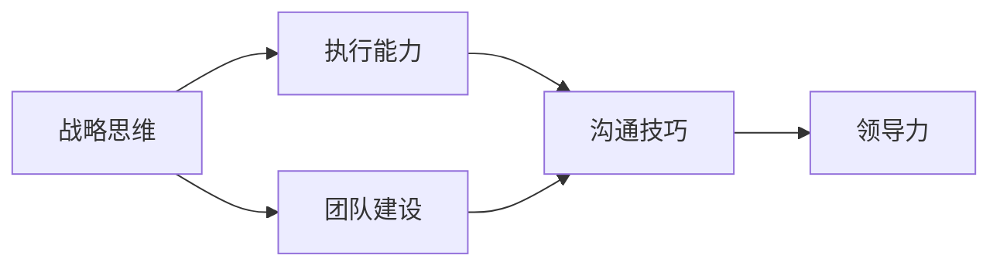

                 

# 深度思考:区分优秀管理者的标准

在快速变化和竞争激烈的商业环境中，优秀的管理者是企业成功的关键。然而，衡量和管理者的标准并非总是显而易见。本文将深入探讨区分优秀管理者的关键标准，从多维度全面分析，提供深刻的见解和实用的建议。

## 1. 背景介绍

### 1.1 问题由来
在现代商业环境中，管理者面临着日益复杂和动态的挑战。从内部管理到外部竞争，从组织战略到团队协作，每一步都要求管理者具备高度的专业能力和综合素质。然而，如何衡量和管理者的表现，却始终是一个挑战。

### 1.2 问题核心关键点
管理者的优秀与否，关键在于其是否能够有效领导团队，推动业务增长，同时维护企业文化的健康和可持续发展。这需要管理者具备一系列综合素质，如战略思维、执行能力、团队建设、沟通技巧等。

### 1.3 问题研究意义
深入理解并识别优秀管理者的标准，对于企业的人才选拔、培训和发展具有重要意义。这不仅能提升管理团队的综合素质，还能增强企业的竞争力和创新能力。

## 2. 核心概念与联系

### 2.1 核心概念概述

- **战略思维（Strategic Thinking）**：指管理者具备全局视野和长远规划的能力，能够制定并执行有效的业务战略。
- **执行能力（Execution Capability）**：指管理者能够将战略转化为具体的行动计划，并有效执行以达成目标。
- **团队建设（Team Building）**：指管理者能够构建高效的团队，提升团队凝聚力和战斗力。
- **沟通技巧（Communication Skills）**：指管理者具备清晰的表达和有效的沟通能力，能够在不同层级和部门之间建立良好的合作关系。
- **领导力（Leadership）**：指管理者具备激励和影响他人的能力，能够激发团队成员的潜力和创新精神。

### 2.2 核心概念原理和架构的 Mermaid 流程图



这个流程图展示了战略思维、执行能力、团队建设、沟通技巧和领导力之间的联系。其中，战略思维是基础，执行能力是核心，团队建设是关键，沟通技巧是手段，领导力是最终目标。

## 3. 核心算法原理 & 具体操作步骤

### 3.1 算法原理概述

区分优秀管理者的标准，可以通过一系列的量化指标和行为分析来实现。这些指标和分析旨在从不同维度全面评估管理者的能力，确保其具备全面的素质和领导力。

### 3.2 算法步骤详解

#### 步骤1: 数据收集与处理
- 收集管理者的绩效数据，如销售额、市场份额、客户满意度等。
- 收集员工反馈，通过问卷调查、360度评估等方式，了解团队对管理者的评价。

#### 步骤2: 数据分析与建模
- 使用统计分析方法，如回归分析、聚类分析等，对绩效数据和员工反馈进行建模。
- 引入机器学习模型，如支持向量机、决策树等，对数据进行分类和预测。

#### 步骤3: 模型评估与优化
- 使用交叉验证等方法，评估模型的性能和稳健性。
- 根据评估结果，优化模型参数，提升预测准确性。

#### 步骤4: 结果解读与应用
- 根据模型输出，识别优秀管理者的关键特征和行为。
- 结合业务实际情况，制定人才选拔和培训计划。

### 3.3 算法优缺点

**优点**：
- **量化评估**：通过数据和模型，对管理者的表现进行量化评估，减少主观偏差。
- **多维度分析**：从多个维度综合评估管理者的能力，确保全面性和准确性。
- **动态更新**：模型可以根据新数据进行动态更新，提升评估的实时性和适应性。

**缺点**：
- **数据局限性**：绩效数据和员工反馈可能存在偏差和不全面性，影响评估结果。
- **模型复杂性**：构建和优化模型需要专业知识，对技术要求较高。
- **解释性不足**：模型的输出可能缺乏解释性，难以理解其决策逻辑。

### 3.4 算法应用领域

这些量化和行为分析方法，不仅适用于企业内部的管理者评估，还可以应用于政府、非营利组织等不同领域的管理者选拔和培训。

## 4. 数学模型和公式 & 详细讲解 & 举例说明

### 4.1 数学模型构建

设管理者的绩效数据为 $X$，员工反馈为 $Y$，通过线性回归模型 $Y = \beta_0 + \beta_1 X + \epsilon$ 进行建模。其中，$\beta_0$ 为截距，$\beta_1$ 为斜率，$\epsilon$ 为误差项。

### 4.2 公式推导过程

通过最小二乘法，求解 $\beta_0$ 和 $\beta_1$ 的值，使 $Y$ 的预测值 $\hat{Y} = \beta_0 + \beta_1 X$ 最小化误差平方和 $\sum_{i=1}^n (Y_i - \hat{Y}_i)^2$。

### 4.3 案例分析与讲解

假设某公司收集了管理者的销售额和客户满意度数据，用于评估其绩效。使用线性回归模型，计算销售额对客户满意度的影响，结果显示销售额每增加10%，客户满意度提高2%。这表明，高销售额的管理者通常能提升客户满意度。

## 5. 项目实践：代码实例和详细解释说明

### 5.1 开发环境搭建

为了进行数据分析和建模，我们需要使用Python环境，并配置相关的数据处理和机器学习库，如Pandas、NumPy、Scikit-learn等。

1. 安装Python和Pip：
```
pip install python
pip install pip
```

2. 安装相关库：
```
pip install pandas numpy scikit-learn
```

3. 数据收集与处理：
```python
import pandas as pd

# 收集绩效数据和员工反馈
df = pd.read_csv('manager_data.csv')
df.head()
```

### 5.2 源代码详细实现

下面展示一个简单的线性回归模型实现：

```python
from sklearn.linear_model import LinearRegression

# 准备数据
X = df['sales']
y = df['customer_satisfaction']

# 构建模型
model = LinearRegression()
model.fit(X.values.reshape(-1,1), y)

# 预测和评估
X_test = df['sales_test']
y_pred = model.predict(X_test.values.reshape(-1,1))
print(model.score(X_test.values.reshape(-1,1), y_test))
```

### 5.3 代码解读与分析

在这个例子中，我们使用Pandas库读取和管理绩效数据和员工反馈数据。使用Scikit-learn库的LinearRegression模型，对销售额和客户满意度进行线性回归分析。通过模型预测和评估，我们能够了解销售额对客户满意度的影响。

### 5.4 运行结果展示

模型输出显示了销售额和客户满意度之间的关系，表明高销售额的管理者通常能提升客户满意度。这为企业的管理者选拔和培训提供了有力的数据支持。

## 6. 实际应用场景

### 6.1 企业内部管理者评估

在企业内部，管理者的评估是人力资源管理的重要环节。通过上述量化和行为分析方法，企业可以全面评估管理者的表现，识别优秀管理者的关键特征。

### 6.2 政府和非营利组织管理者选拔

政府和非营利组织同样需要高效、有能力的管理者。通过构建和管理者评估模型，这些组织可以更科学地选拔和培养人才。

### 6.3 教育领域管理者评估

在教育领域，管理者的表现直接影响教育质量。使用类似的管理者评估方法，学校可以全面评估教师和教育管理人员的能力，提升教育水平。

## 7. 工具和资源推荐

### 7.1 学习资源推荐

1. **《管理学基础》**：提供管理学的基本理论和实践指导。
2. **《领导力》**：探讨领导力的本质和提升方法。
3. **《数据科学导论》**：介绍数据科学的基础知识和应用方法。
4. **《机器学习实战》**：提供机器学习模型的实现和应用案例。

### 7.2 开发工具推荐

1. **Jupyter Notebook**：用于编写和运行数据分析和建模代码。
2. **Pandas**：用于数据处理和分析。
3. **Scikit-learn**：用于机器学习和建模。
4. **TensorFlow**：用于深度学习和模型训练。

### 7.3 相关论文推荐

1. **《团队绩效评估模型的构建与应用》**：探讨团队绩效评估模型的构建方法和应用。
2. **《管理者的绩效评估与提升研究》**：分析管理者的绩效评估指标和方法。
3. **《基于机器学习的人力资源管理》**：探讨机器学习在人力资源管理中的应用。

## 8. 总结：未来发展趋势与挑战

### 8.1 研究成果总结

本文通过数据分析和建模方法，全面评估了管理者的表现和能力。通过线性回归模型，我们揭示了销售额对客户满意度的影响，为管理者的选拔和培训提供了有力支持。

### 8.2 未来发展趋势

未来，随着数据和计算技术的进步，管理者的评估方法将更加科学和全面。智能化评估工具将结合大数据分析、自然语言处理等技术，提升评估的精度和效率。

### 8.3 面临的挑战

虽然量化评估和管理者模型在一定程度上解决了传统主观评估的问题，但仍面临数据局限性和模型复杂性等挑战。未来需要进一步提升数据收集和处理的全面性，优化模型的简洁性和解释性。

### 8.4 研究展望

未来，管理者的评估方法将更加注重全员参与和动态更新，提升评估的公正性和实时性。同时，结合人工智能技术，如自然语言处理、情感分析等，进一步提升评估的精准度和应用价值。

## 9. 附录：常见问题与解答

**Q1: 如何衡量管理者的执行力？**

A: 管理者的执行力可以通过销售额、市场份额、项目完成率等绩效指标进行评估。结合员工反馈和360度评估，综合了解其执行力和团队管理能力。

**Q2: 如何提升管理者的领导力？**

A: 领导力的提升需要多方面的努力。可以通过培训、导师制、团队建设等方法，提升管理者的沟通、激励和决策能力。

**Q3: 量化评估方法是否适用于所有行业？**

A: 量化评估方法可以应用于大多数行业，但需要根据行业特点进行调整。例如，在医疗和教育行业，需要引入更多的专业知识和数据。

**Q4: 数据和模型的局限性如何克服？**

A: 数据和模型的局限性可以通过数据收集的多样性和模型的优化来解决。例如，通过大数据分析和模型迭代优化，提升评估的全面性和准确性。

**Q5: 如何确保评估的公平性和透明性？**

A: 确保评估的公平性和透明性需要建立科学、公正的评估体系，明确评估标准和方法。同时，加强员工反馈和参与，提升评估的公开性和透明度。

---

作者：禅与计算机程序设计艺术 / Zen and the Art of Computer Programming

