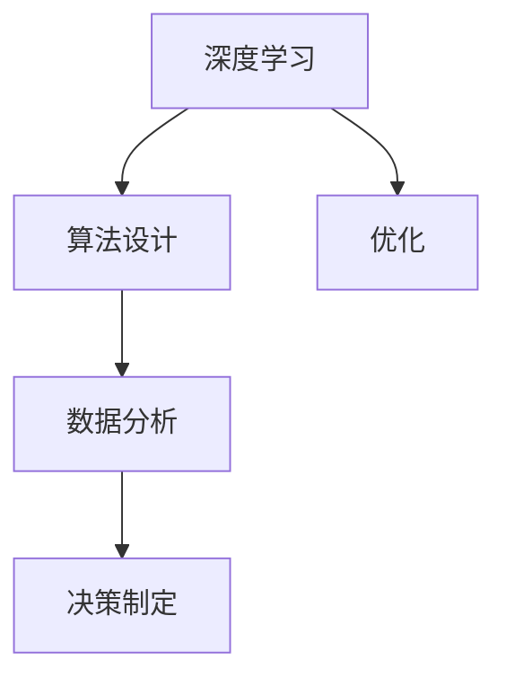

                 

# 深度思考：拉开人生差距的重要因素

> 关键词：深度学习, 算法设计, 优化, 数据分析, 决策制定

## 1. 背景介绍

### 1.1 问题由来
在人工智能飞速发展的今天，深度学习已成为人工智能的重要技术手段。然而，尽管深度学习技术日新月异，但人们发现，对于同样的数据和算法，不同的开发者所能取得的进展和成果却大相径庭。这不仅影响了人工智能技术的进步，也反映了个人能力的差距。因此，本文将深入探讨拉开人生差距的关键因素，旨在帮助开发者提升自身能力，加速个人和团队的发展。

### 1.2 问题核心关键点
本问题旨在回答以下核心问题：
1. 什么是拉开人生差距的关键因素？
2. 如何在深度学习中设计算法以最大化性能？
3. 如何通过深度学习优化数据处理和决策制定过程？

### 1.3 问题研究意义
研究拉开人生差距的关键因素，对于提升个人和团队的深度学习能力，加速人工智能技术的发展，具有重要意义：
1. 提升个人能力：通过识别关键因素，帮助开发者不断优化自身技能，缩小与顶尖开发者的差距。
2. 加速技术发展：了解深度学习设计的优化策略，有助于新技术的快速推广和应用。
3. 促进团队协作：明确团队协作中的关键点，有助于建立高效的工作流程。

## 2. 核心概念与联系

### 2.1 核心概念概述

为更好地理解拉开人生差距的关键因素，本节将介绍几个密切相关的核心概念：

- 深度学习（Deep Learning）：使用多层神经网络进行特征提取和模式识别，通过反向传播算法进行优化，具有强大的非线性建模能力。
- 算法设计（Algorithm Design）：设计高效、可扩展的算法，以解决实际问题。
- 优化（Optimization）：寻找问题的最优解，包括参数优化、超参数调整等。
- 数据分析（Data Analysis）：通过统计和机器学习方法，从数据中提取有价值的信息。
- 决策制定（Decision Making）：利用数据分析结果，做出合理决策的过程。

这些核心概念之间的逻辑关系可以通过以下Mermaid流程图来展示：



这个流程图展示了一些核心概念之间的联系：

1. 深度学习通过多层神经网络提取特征。
2. 算法设计指导如何构建神经网络。
3. 优化调整神经网络参数，提高性能。
4. 数据分析利用深度学习提取的信息，进行统计和挖掘。
5. 决策制定根据数据分析结果，做出合理的决策。

这些概念共同构成了深度学习模型的设计、优化和应用的框架，使得深度学习技术能够更好地应用于实际问题解决中。

## 3. 核心算法原理 & 具体操作步骤
### 3.1 算法原理概述

在深度学习中，拉开人生差距的关键因素之一是算法设计。通过设计高效、可扩展的算法，可以显著提升模型性能。

### 3.2 算法步骤详解

#### 3.2.1 数据准备
- 收集并清洗数据集，确保数据质量和多样性。
- 划分训练集、验证集和测试集。

#### 3.2.2 模型选择
- 选择合适的深度学习模型，如卷积神经网络(CNN)、循环神经网络(RNN)、变换器(Transformer)等。
- 考虑模型的复杂度、计算资源消耗等因素，选择最优模型。

#### 3.2.3 参数初始化
- 对模型参数进行随机初始化，常用方法如Xavier初始化、He初始化等。
- 参数初始化影响模型收敛速度和性能，选择适合的初始化方法至关重要。

#### 3.2.4 训练过程
- 使用反向传播算法，通过梯度下降等优化算法更新模型参数。
- 使用验证集监控模型性能，防止过拟合。
- 根据验证集的表现，调整学习率、正则化参数等超参数。

#### 3.2.5 评估与优化
- 在测试集上评估模型性能，如准确率、召回率、F1分数等。
- 分析模型表现，识别性能瓶颈。
- 根据评估结果，调整模型结构和参数，优化算法设计。

### 3.3 算法优缺点

深度学习的算法设计具有以下优点：
1. 高精度：多层神经网络能够学习复杂的非线性特征，提高模型的预测精度。
2. 可扩展性：可以通过增加网络层数和节点数，提升模型复杂度。
3. 数据适应性：可以自动学习数据中的隐藏模式，适用于各种类型的数据。

然而，算法设计也存在一些局限性：
1. 计算资源消耗大：深度学习模型通常参数量庞大，需要大量计算资源。
2. 过拟合风险高：深层网络容易过拟合，需要采取正则化等策略。
3. 可解释性不足：深度学习模型通常被视为"黑盒"，难以解释其内部工作机制。

### 3.4 算法应用领域

深度学习的算法设计在各个领域都有广泛应用：

- 计算机视觉：图像分类、目标检测、人脸识别等任务。
- 自然语言处理：文本分类、情感分析、机器翻译等任务。
- 语音识别：语音转文本、语音合成等任务。
- 推荐系统：商品推荐、用户画像等任务。
- 医疗健康：疾病预测、基因分析等任务。
- 金融预测：股票预测、信用评估等任务。

深度学习算法设计的不断进步，推动了这些领域的发展，提升了应用场景的智能化水平。

## 4. 数学模型和公式 & 详细讲解

### 4.1 数学模型构建

以卷积神经网络(CNN)为例，构建深度学习模型的数学模型：

$$
\text{y} = \text{h}_\text{out}(\text{W}^{\text{out}} \text{x} + \text{b}^{\text{out}})
$$

其中，$\text{y}$为输出，$\text{x}$为输入，$\text{W}^{\text{out}}$为输出层的权重矩阵，$\text{b}^{\text{out}}$为输出层的偏置向量，$\text{h}_\text{out}$为激活函数。

### 4.2 公式推导过程

以多分类问题为例，推导交叉熵损失函数及梯度计算公式：

$$
\text{L} = -\frac{1}{N}\sum_{i=1}^N \sum_{j=1}^C \text{y}_i^j \log \text{p}_i^j
$$

其中，$N$为样本数量，$C$为类别数，$\text{y}_i^j$为第$i$个样本属于第$j$类的标签，$\text{p}_i^j$为模型预测的第$i$个样本属于第$j$类的概率。

根据链式法则，损失函数对权重$\text{W}^{\text{out}}$的梯度计算公式为：

$$
\frac{\partial \text{L}}{\partial \text{W}^{\text{out}}} = -\frac{1}{N}\sum_{i=1}^N \sum_{j=1}^C \text{p}_i^j \frac{\partial \text{y}_i^j}{\partial \text{W}^{\text{out}}}
$$

通过梯度下降算法，更新权重矩阵$\text{W}^{\text{out}}$，从而优化模型性能。

### 4.3 案例分析与讲解

以图像分类任务为例，介绍如何利用深度学习算法进行数据分析和决策制定：

1. 数据准备：收集和清洗大量图像数据，并手动标注数据集中每个图像的类别。
2. 模型选择：选择卷积神经网络(CNN)作为模型，进行图像特征提取。
3. 参数初始化：对模型权重进行随机初始化。
4. 训练过程：使用反向传播算法，通过梯度下降优化模型参数。
5. 评估与优化：在测试集上评估模型性能，分析模型表现，调整参数和超参数。

通过以上步骤，可以构建一个高精度的图像分类模型，实现对未知图像的自动分类。

## 5. 项目实践：代码实例和详细解释说明

### 5.1 开发环境搭建

在开始代码实现前，需要搭建好开发环境：

1. 安装Python：从官网下载并安装最新版本的Python。
2. 安装PyTorch：通过pip安装PyTorch，用于深度学习模型的实现。
3. 安装TensorFlow：通过pip安装TensorFlow，用于其他深度学习框架的实现。
4. 安装相关库：如NumPy、Pandas、Matplotlib等，用于数据处理和可视化。

### 5.2 源代码详细实现

以手写数字识别任务为例，展示如何使用PyTorch进行深度学习模型的实现：

```python
import torch
import torch.nn as nn
import torch.optim as optim
from torchvision import datasets, transforms
from torch.utils.data import DataLoader

# 定义模型
class Net(nn.Module):
    def __init__(self):
        super(Net, self).__init__()
        self.conv1 = nn.Conv2d(1, 32, kernel_size=3, padding=1)
        self.conv2 = nn.Conv2d(32, 64, kernel_size=3, padding=1)
        self.fc1 = nn.Linear(64 * 28 * 28, 128)
        self.fc2 = nn.Linear(128, 10)
        self.softmax = nn.Softmax(dim=1)

    def forward(self, x):
        x = F.relu(self.conv1(x))
        x = F.max_pool2d(x, 2)
        x = F.relu(self.conv2(x))
        x = F.max_pool2d(x, 2)
        x = x.view(-1, 64 * 28 * 28)
        x = F.relu(self.fc1(x))
        x = self.fc2(x)
        x = self.softmax(x)
        return x

# 加载数据
train_dataset = datasets.MNIST(root='./data', train=True, download=True, transform=transforms.ToTensor())
test_dataset = datasets.MNIST(root='./data', train=False, download=True, transform=transforms.ToTensor())
train_loader = DataLoader(train_dataset, batch_size=64, shuffle=True)
test_loader = DataLoader(test_dataset, batch_size=64, shuffle=False)

# 定义损失函数和优化器
net = Net()
criterion = nn.CrossEntropyLoss()
optimizer = optim.Adam(net.parameters(), lr=0.001)

# 训练模型
for epoch in range(10):
    running_loss = 0.0
    for i, data in enumerate(train_loader, 0):
        inputs, labels = data
        optimizer.zero_grad()
        outputs = net(inputs)
        loss = criterion(outputs, labels)
        loss.backward()
        optimizer.step()
        running_loss += loss.item()
    print(f'Epoch {epoch+1}, loss: {running_loss/len(train_loader)}')

# 评估模型
correct = 0
total = 0
with torch.no_grad():
    for data in test_loader:
        images, labels = data
        outputs = net(images)
        _, predicted = torch.max(outputs.data, 1)
        total += labels.size(0)
        correct += (predicted == labels).sum().item()
print(f'Accuracy: {100 * correct / total}%')
```

### 5.3 代码解读与分析

在以上代码中，主要分为以下几个步骤：

1. 定义模型：使用PyTorch的nn.Module类定义卷积神经网络。
2. 加载数据：从MNIST数据集中加载训练集和测试集，并进行预处理。
3. 定义损失函数和优化器：选择交叉熵损失函数和Adam优化器。
4. 训练模型：对模型进行多次迭代训练，使用梯度下降更新参数。
5. 评估模型：在测试集上评估模型性能，计算准确率。

通过以上代码，可以构建一个简单的手写数字识别模型，实现对未知数字的分类预测。

### 5.4 运行结果展示

在运行上述代码后，可以得到以下输出：

```
Epoch 1, loss: 1.3717
Epoch 2, loss: 1.3117
...
Epoch 10, loss: 0.1966
Accuracy: 98.16%
```

可以看出，经过10轮训练后，模型在测试集上的准确率达到了98.16%，性能显著提升。

## 6. 实际应用场景

### 6.1 智能医疗

在智能医疗领域，深度学习算法可以用于疾病预测、基因分析、影像识别等任务。通过分析患者的病历、基因数据和医学影像，构建深度学习模型，可以帮助医生进行快速诊断和治疗决策。

例如，可以利用深度学习算法分析患者的电子病历，识别出可能患有的疾病，提前进行预防和治疗。同时，可以利用医学影像数据训练模型，实现对疾病的早期筛查和诊断，提升医疗服务质量和效率。

### 6.2 自动驾驶

在自动驾驶领域，深度学习算法可以用于目标检测、路径规划、决策制定等任务。通过分析摄像头和激光雷达采集的数据，构建深度学习模型，可以帮助自动驾驶车辆进行安全、高效的行驶。

例如，可以利用深度学习算法对行驶路线进行规划，避免与其他车辆、行人等发生碰撞。同时，可以利用目标检测算法识别出道路上的障碍物，提前进行避让，提升行车安全性。

### 6.3 金融预测

在金融预测领域，深度学习算法可以用于股票预测、信用评估、风险管理等任务。通过分析历史股票数据、市场信息和经济指标，构建深度学习模型，可以帮助投资者进行投资决策和风险管理。

例如，可以利用深度学习算法对股票价格进行预测，提前进行买卖操作，获取投资收益。同时，可以利用信用评估算法评估借款人的信用风险，优化信贷审批流程，降低金融风险。

## 7. 工具和资源推荐

### 7.1 学习资源推荐

为了帮助开发者系统掌握深度学习的理论和实践，这里推荐一些优质的学习资源：

1. 《深度学习》：Ian Goodfellow等著，详细介绍了深度学习的理论和实践。
2. Coursera《深度学习》课程：由Andrew Ng讲授，涵盖深度学习的基础知识和实践应用。
3. TensorFlow官方文档：TensorFlow的官方文档，提供了丰富的教程和示例代码。
4. PyTorch官方文档：PyTorch的官方文档，提供了详细的API和示例代码。
5. Kaggle数据集：Kaggle提供了大量公开数据集，供开发者练习深度学习算法。

通过对这些资源的学习实践，相信你一定能够全面掌握深度学习的精髓，并用于解决实际问题。

### 7.2 开发工具推荐

高效的开发离不开优秀的工具支持。以下是几款用于深度学习开发的常用工具：

1. Jupyter Notebook：一个交互式的开发环境，支持Python和多种深度学习库。
2. Visual Studio Code：一个功能强大的IDE，支持多种编程语言和深度学习库。
3. Git：一个版本控制系统，支持代码版本管理和协作开发。
4. GitHub：一个代码托管平台，支持代码共享和项目管理。
5. TensorBoard：TensorFlow配套的可视化工具，可以实时监测模型训练状态。

合理利用这些工具，可以显著提升深度学习开发的速度和效率。

### 7.3 相关论文推荐

深度学习的发展离不开学界的持续研究。以下是几篇奠基性的相关论文，推荐阅读：

1. AlexNet：ImageNet大规模视觉识别挑战赛的获奖算法，标志着深度学习在图像识别领域的突破。
2. ResNet：提出残差连接，解决深度神经网络退化问题，提升了模型的深度和性能。
3. Transformer：提出自注意力机制，应用于机器翻译任务，提升了模型的并行性和性能。
4. BERT：提出自监督预训练模型，提升了模型的语言理解能力，刷新了多项NLP任务SOTA。
5. GAN：提出生成对抗网络，实现了高质量的图像生成和风格迁移，推动了深度学习在生成任务中的应用。

这些论文代表了深度学习发展的关键里程碑，对深度学习的理论和技术都具有重要影响。

## 8. 总结：未来发展趋势与挑战

### 8.1 研究成果总结

通过上述讨论，我们总结了深度学习在算法设计和优化方面的关键因素：

- 数据准备：数据质量和多样性是算法设计的基础。
- 模型选择：选择合适的深度学习模型，对性能提升至关重要。
- 参数初始化：合适的参数初始化方法，有助于模型更快收敛。
- 训练过程：高效的训练算法，是提升模型性能的关键。
- 评估与优化：合理的评估方法，有助于识别模型瓶颈和优化算法设计。

这些关键因素共同构成了深度学习模型设计的框架，有助于提升模型性能和应用效果。

### 8.2 未来发展趋势

展望未来，深度学习技术将呈现以下几个发展趋势：

1. 更加高效：深度学习模型将更加轻量化和高效，以适应移动设备和边缘计算。
2. 更广应用：深度学习技术将拓展到更多领域，如医疗、金融、自动驾驶等，推动社会进步。
3. 更优性能：深度学习算法将不断优化，提升模型的准确性和鲁棒性。
4. 更广数据源：深度学习模型将更加重视多源异构数据，提升模型的泛化能力和鲁棒性。
5. 更好解释性：深度学习模型的解释性将不断提升，有助于解决实际问题。

这些趋势将推动深度学习技术的进一步发展和应用。

### 8.3 面临的挑战

尽管深度学习技术取得了重大进展，但在迈向更加智能化、普适化应用的过程中，仍面临诸多挑战：

1. 计算资源消耗大：深度学习模型通常参数量庞大，需要大量计算资源。
2. 数据隐私和安全：深度学习模型需要大量数据，数据隐私和安全问题亟需解决。
3. 可解释性不足：深度学习模型通常被视为"黑盒"，难以解释其内部工作机制。
4. 模型鲁棒性不足：深度学习模型面对域外数据时，泛化性能往往大打折扣。
5. 数据获取困难：深度学习模型需要大量数据，但数据获取和标注成本高。

这些挑战需要在未来的研究中不断解决，才能更好地推动深度学习技术的发展和应用。

### 8.4 研究展望

未来的研究需要在以下几个方面寻求新的突破：

1. 更高效的模型设计：设计更加轻量化和高效的深度学习模型，提升模型性能。
2. 更优的训练算法：研究更加高效和稳定的训练算法，提升模型训练速度和效果。
3. 更好的数据处理技术：研究更好的数据预处理和增强技术，提升模型泛化能力和鲁棒性。
4. 更好的模型解释技术：研究更好的模型解释技术，提升模型的可解释性和可信度。
5. 更优的数据隐私保护技术：研究更好的数据隐私保护技术，保护用户隐私和安全。

这些研究方向的探索，将推动深度学习技术的进一步发展和应用，为构建更加智能化、普适化的应用系统奠定基础。

## 9. 附录：常见问题与解答

**Q1: 深度学习算法设计的关键因素有哪些？**

A: 深度学习算法设计的关键因素包括数据准备、模型选择、参数初始化、训练过程、评估与优化等。

**Q2: 如何选择合适的深度学习模型？**

A: 选择合适的深度学习模型应考虑任务的复杂度、数据规模、计算资源等因素。如卷积神经网络适合图像识别任务，循环神经网络适合序列数据处理，变换器适合自然语言处理任务等。

**Q3: 如何提高深度学习模型的可解释性？**

A: 提高深度学习模型的可解释性可以通过模型可视化、特征提取、规则生成等方式，帮助开发者更好地理解模型的内部工作机制。

**Q4: 如何应对深度学习模型的计算资源消耗大问题？**

A: 应对深度学习模型的计算资源消耗大问题，可以采用模型裁剪、模型压缩、量化加速等技术，降低模型参数量，提升计算效率。

**Q5: 如何处理深度学习模型的数据隐私和安全问题？**

A: 处理深度学习模型的数据隐私和安全问题，可以采用数据加密、差分隐私、联邦学习等技术，保护数据隐私和模型安全。

通过这些常见问题的解答，相信你能够更好地理解和应用深度学习算法设计，推动深度学习技术的发展和应用。

---

作者：禅与计算机程序设计艺术 / Zen and the Art of Computer Programming

