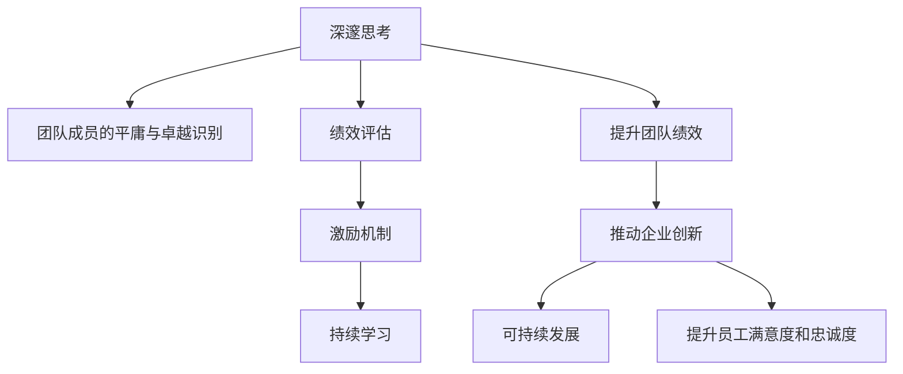

                 

# 深邃思考:区分平庸与卓越管理者

管理，作为一个复杂而庞大的领域，在当今商业环境中具有至关重要的地位。随着信息技术的飞速发展，传统的管理方式和理念正在逐渐被新的方法和思想所取代。在这样的大背景下，卓越管理者的能力不仅体现在对技术的应用上，更在于如何通过深邃的思考，区分和管理团队中的平庸和卓越。本文将深入探讨这些核心概念，通过理论框架和实际案例，揭示管理者的深邃思考能力如何帮助他们在复杂环境中脱颖而出。

## 1. 背景介绍

### 1.1 问题由来

现代商业环境日新月异，信息技术的广泛应用使得企业需要不断地调整和优化其管理策略。在这样的环境中，管理者需要具备更高的智慧和能力，以便在复杂的决策过程中保持敏锐的洞察力和判断力。然而，众多管理者仍然面临着诸如团队协作、项目规划、风险管理等诸多挑战。如何通过深邃的思考，有效区分团队中的平庸与卓越，成为每个管理者必须解决的核心问题。

### 1.2 问题核心关键点

要深入理解这个问题，我们需要明确几个关键点：

- **管理者角色**：管理者不仅需要掌握技术工具，更要具备深邃思考能力，以区分团队成员的平庸与卓越。
- **团队结构**：一个团队中存在多样化的技能和经验，管理者需要从全局视角进行思考，以识别和发挥每个成员的优势。
- **绩效评估**：通过科学合理的绩效评估方法，区分团队成员的贡献和潜力，是管理者深邃思考的重要应用之一。
- **激励机制**：管理者应通过激励机制，激发团队成员的潜力，使团队整体发挥最佳效能。
- **持续学习**：管理者需持续学习，不断提升自身技能和视野，以适应快速变化的商业环境。

### 1.3 问题研究意义

深入探讨卓越管理者的深邃思考能力，对于提升团队绩效、推动企业创新和可持续发展具有重要意义：

1. **提升团队绩效**：通过深邃思考，管理者能够更准确地评估团队成员的能力和贡献，有效激发团队潜力，提高整体绩效。
2. **推动企业创新**：卓越的管理者能够识别并培养高潜力的员工，推动企业持续创新，适应市场变化。
3. **可持续发展**：深邃思考能力帮助管理者识别风险，制定科学的管理策略，确保企业在复杂环境中的稳定发展。
4. **提升员工满意度和忠诚度**：优秀的管理者通过公正透明的绩效评估和激励机制，提升员工满意度和忠诚度。
5. **推动行业进步**：卓越的管理实践在行业中起到示范作用，引领行业进步。

## 2. 核心概念与联系

### 2.1 核心概念概述

要理解深邃思考能力在管理中的作用，我们需要从以下几个核心概念入手：

- **深邃思考**：指管理者通过系统性的分析、归纳和推理，对管理实践进行深入理解和优化。
- **团队成员的平庸与卓越**：平庸成员一般具有稳定的表现和有限的潜力，而卓越成员则能不断突破自我，贡献更多价值。
- **绩效评估**：通过量化和定性的方法，评估团队成员的工作表现和潜力。
- **激励机制**：通过制度和机制，激发团队成员的积极性和潜力。
- **持续学习**：管理者需要不断学习新技术和管理理念，以适应快速变化的环境。

这些概念之间存在着紧密的联系，通过深邃思考，管理者能够更有效地识别和培养团队中的卓越成员，进而推动企业发展。

### 2.2 核心概念原理和架构的 Mermaid 流程图



这个流程图展示了深邃思考能力如何通过多个环节影响管理实践：

1. 深邃思考帮助管理者识别团队中的平庸与卓越。
2. 通过绩效评估，对团队成员的表现进行量化和定性评估。
3. 激励机制激发卓越成员的潜力，提升整体绩效。
4. 持续学习使管理者不断适应环境变化，保持管理能力的先进性。

## 3. 核心算法原理 & 具体操作步骤

### 3.1 算法原理概述

卓越管理者的深邃思考能力，主要体现在以下几个方面：

1. **系统性分析**：通过系统性的方法，对管理问题进行多角度分析。
2. **数据驱动决策**：利用数据进行科学决策，避免主观判断。
3. **全局视角**：从团队和企业的全局视角进行思考，优化资源配置和团队协作。
4. **风险评估**：对潜在风险进行评估，制定预案以应对风险。
5. **创新驱动**：通过创新思维，寻找新的管理方法和策略。

这些原则构成了卓越管理者深邃思考的核心算法。

### 3.2 算法步骤详解

具体步骤包括以下几个关键环节：

1. **数据收集与分析**：
   - 收集团队和企业的各类数据，包括财务、生产、市场等数据。
   - 使用数据分析工具（如Python的Pandas库）进行数据清洗和预处理。
   - 利用数据可视化工具（如Tableau、PowerBI），直观展示关键指标和趋势。

2. **绩效评估与评估指标设计**：
   - 制定科学的绩效评估指标，包括KPI（关键绩效指标）和OKR（目标与关键结果）等。
   - 引入多维度评估方法，如360度反馈、自评与他评等。
   - 建立量化评估工具，自动收集和分析评估数据。

3. **激励机制设计**：
   - 根据绩效评估结果，制定个性化的激励方案，如奖金、晋升、培训等。
   - 引入公平透明的激励机制，避免偏见和不公。
   - 使用激励机制，激励团队成员突破自我，实现卓越。

4. **风险评估与预案制定**：
   - 通过系统性分析，识别潜在风险点。
   - 制定风险评估模型，量化风险影响。
   - 根据风险评估结果，制定应对预案。

5. **创新驱动与持续学习**：
   - 定期进行创新思维培训，提升团队成员的创新能力。
   - 通过行业交流、学术会议等方式，持续学习最新的管理理念和技术。
   - 建立学习型团队，共享知识和经验。

### 3.3 算法优缺点

深邃思考能力在管理中的应用具有以下优点和缺点：

#### 优点：
1. **科学决策**：通过数据驱动的决策，减少主观偏见，提高决策的准确性。
2. **全局优化**：从全局视角进行思考，优化资源配置和团队协作。
3. **风险控制**：提前识别潜在风险，制定预案，降低风险影响。
4. **持续创新**：通过创新驱动，推动企业不断进步。

#### 缺点：
1. **数据依赖**：对数据的依赖性较强，数据不全或不准确会影响决策。
2. **实施复杂**：系统性分析和创新驱动需要大量的资源和时间。
3. **文化阻力**：团队成员可能对新的管理方式有抵触情绪。

### 3.4 算法应用领域

深邃思考能力在多个领域中都有广泛应用：

1. **人力资源管理**：通过绩效评估和激励机制，优化人力资源配置。
2. **项目管理**：系统性分析项目风险，制定预案，确保项目顺利进行。
3. **战略规划**：从全局视角进行战略分析，制定科学的发展策略。
4. **客户关系管理**：通过数据分析，优化客户关系管理，提升客户满意度。
5. **创新驱动**：推动技术创新和产品创新，保持企业在市场中的竞争优势。

## 4. 数学模型和公式 & 详细讲解

### 4.1 数学模型构建

本节将通过数学模型来进一步说明深邃思考在管理中的应用。

假设一个团队有$N$个成员，每个成员的绩效评估结果为$X_i \in [0,1]$，表示其表现从平庸到卓越的范围。设$W_i$为成员$i$对团队的贡献权重，$C_i$为其潜力评估结果，$E_i$为激励措施对其表现的影响。

则团队的绩效$P$可以表示为：
$$
P = \sum_{i=1}^N W_iX_i + \sum_{i=1}^N C_iE_i
$$

其中$W_i$和$C_i$可以通过数据分析得到，$E_i$则根据激励机制和绩效评估结果计算得到。

### 4.2 公式推导过程

根据上述模型，我们进行如下推导：

1. **贡献权重$W_i$计算**：
   - 假设数据集为$D=\{(x_j,w_j)\}_{j=1}^M$，其中$x_j$为第$j$个样本的表现，$w_j$为其对团队的贡献权重。
   - 通过回归分析，得到线性回归模型$\hat{w}_j = \beta_0 + \beta_1x_j + \epsilon_j$，其中$\beta_0$和$\beta_1$为回归系数，$\epsilon_j$为误差项。
   - 通过最小二乘法，求解回归系数$\beta_0$和$\beta_1$，得到$W_i$的估计值。

2. **潜力评估$C_i$计算**：
   - 利用360度反馈、自评与他评等方法，得到成员$i$的多维度评估结果。
   - 通过统计分析，得到潜力评估结果$C_i$。

3. **激励措施$E_i$计算**：
   - 根据绩效评估结果，设计个性化的激励措施。
   - 假设激励措施为$E_i = f(X_i)$，其中$f$为激励函数，如$E_i = 0.1X_i$。
   - 通过数据分析，得到激励措施对团队表现的影响$E_i$。

### 4.3 案例分析与讲解

**案例：某公司人力资源管理**

一家公司的管理层通过深邃思考，利用上述模型对人力资源进行优化：

1. **数据收集与分析**：
   - 收集员工年度绩效数据，包括销售额、客户满意度等。
   - 使用Pandas进行数据清洗和预处理。
   - 通过Tableau进行数据可视化，展示关键指标和趋势。

2. **绩效评估与评估指标设计**：
   - 设计KPI指标，包括销售额、客户满意度、新客户数量等。
   - 引入360度反馈，收集上级、同事和下级的综合评估。
   - 建立量化评估工具，自动收集和分析评估数据。

3. **激励机制设计**：
   - 根据绩效评估结果，制定个性化的激励方案，如奖金、晋升、培训等。
   - 引入公平透明的激励机制，避免偏见和不公。
   - 使用激励机制，激励员工突破自我，实现卓越。

4. **风险评估与预案制定**：
   - 通过系统性分析，识别潜在风险点，如员工流失率、销售指标下降等。
   - 制定风险评估模型，量化风险影响。
   - 根据风险评估结果，制定应对预案，如加强员工培训、调整销售策略等。

5. **创新驱动与持续学习**：
   - 定期进行创新思维培训，提升员工创新能力。
   - 通过行业交流、学术会议等方式，持续学习最新的管理理念和技术。
   - 建立学习型团队，共享知识和经验。

通过上述步骤，公司实现了人力资源管理的系统化、科学化和创新化，大幅提升了员工绩效和团队凝聚力。

## 5. 项目实践：代码实例和详细解释说明

### 5.1 开发环境搭建

在进行项目实践前，我们需要准备好开发环境。以下是使用Python进行数据分析和模型训练的环境配置流程：

1. 安装Anaconda：从官网下载并安装Anaconda，用于创建独立的Python环境。

2. 创建并激活虚拟环境：
```bash
conda create -n pythonscience python=3.8 
conda activate pythonscience
```

3. 安装必要的库：
```bash
conda install pandas numpy matplotlib seaborn scikit-learn statsmodels tableaupandas
```

4. 安装TensorFlow和TensorBoard：
```bash
conda install tensorflow tensorboard
```

完成上述步骤后，即可在`pythonscience`环境中开始数据分析和模型训练的实践。

### 5.2 源代码详细实现

下面我们以人力资源管理为例，给出使用Python进行数据分析和模型训练的代码实现。

**步骤1: 数据准备**

```python
import pandas as pd
import seaborn as sns

# 读取数据
df = pd.read_csv('sales_data.csv')

# 数据清洗和预处理
df.dropna(inplace=True)
df['customer_satisfaction'] = df['customer_satisfaction'].fillna(df['customer_satisfaction'].mean())

# 数据可视化
sns.pairplot(df, hue='department')
```

**步骤2: 数据建模**

```python
from sklearn.linear_model import LinearRegression

# 定义模型
X = df[['customer_satisfaction', 'new_customer_number']]
y = df['sales_amount']

model = LinearRegression()
model.fit(X, y)
```

**步骤3: 结果分析**

```python
# 预测新员工的绩效
new_employee_data = pd.read_csv('new_employee_data.csv')
new_employee_predictions = model.predict(new_employee_data[['customer_satisfaction', 'new_customer_number']])

# 可视化结果
sns.scatterplot(df['employee_id'], new_employee_predictions)
```

**步骤4: 模型评估**

```python
from sklearn.metrics import mean_squared_error

# 计算模型评估指标
mse = mean_squared_error(df['sales_amount'], new_employee_predictions)

# 输出评估结果
print(f'Mean Squared Error: {mse:.2f}')
```

### 5.3 代码解读与分析

让我们再详细解读一下关键代码的实现细节：

**步骤1: 数据准备**

- 使用Pandas读取原始数据。
- 进行数据清洗，删除缺失值，并使用均值填补缺失的满意度数据。
- 利用Seaborn进行数据可视化，展示部门间的绩效关系。

**步骤2: 数据建模**

- 定义线性回归模型，使用销售额作为目标变量。
- 通过训练模型，得到回归系数。

**步骤3: 结果分析**

- 使用新员工的满意度和新客户数量进行预测。
- 利用Seaborn可视化员工ID与预测绩效的关系。

**步骤4: 模型评估**

- 使用均方误差（MSE）评估模型预测的准确性。
- 输出评估结果，展示模型性能。

### 5.4 运行结果展示

通过上述步骤，我们可以得到新员工的预测绩效，并通过均方误差评估模型的准确性。这些结果可以帮助公司识别并培养高潜力员工，提升整体绩效。

## 6. 实际应用场景

### 6.1 智能客服系统

基于深邃思考的管理者可以通过系统性分析和数据分析，优化智能客服系统的人力资源配置和绩效评估机制。

**步骤1: 数据收集**

- 收集客服的历史对话记录和客户满意度数据。

**步骤2: 绩效评估**

- 设计多维度评估指标，如响应时间、客户满意度、解决率等。
- 引入360度反馈，综合评估客服人员的绩效。

**步骤3: 激励机制**

- 根据绩效评估结果，设计个性化的激励方案，如奖金、晋升、培训等。
- 引入公平透明的激励机制，避免偏见和不公。

**步骤4: 风险评估与预案制定**

- 通过系统性分析，识别客服系统中的风险点，如响应时间过长、客户投诉等。
- 制定应对预案，如增加客服人员、优化客服流程等。

**步骤5: 持续学习与创新驱动**

- 定期进行创新思维培训，提升客服人员的创新能力。
- 通过行业交流、学术会议等方式，持续学习最新的客户服务理念和技术。

### 6.2 金融舆情监测

在金融舆情监测中，基于深邃思考的管理者可以通过数据分析和绩效评估，构建更加精准的舆情监测系统。

**步骤1: 数据收集**

- 收集金融领域的相关新闻、报道、评论等文本数据。

**步骤2: 绩效评估**

- 设计多维度评估指标，如舆情波动、市场影响等。
- 引入情感分析等技术，综合评估舆情的影响力。

**步骤3: 激励机制**

- 根据绩效评估结果，设计个性化的激励方案，如奖金、晋升、培训等。
- 引入公平透明的激励机制，避免偏见和不公。

**步骤4: 风险评估与预案制定**

- 通过系统性分析，识别舆情中的风险点，如负面舆情的激增等。
- 制定应对预案，如舆情监测策略的优化、快速响应机制的建立等。

**步骤5: 持续学习与创新驱动**

- 定期进行创新思维培训，提升团队的创新能力。
- 通过行业交流、学术会议等方式，持续学习最新的舆情监测技术。

### 6.3 个性化推荐系统

在个性化推荐系统中，基于深邃思考的管理者可以通过数据分析和绩效评估，提升推荐系统的精准性和用户体验。

**步骤1: 数据收集**

- 收集用户浏览、点击、评论、分享等行为数据。

**步骤2: 绩效评估**

- 设计多维度评估指标，如点击率、转化率等。
- 引入A/B测试等方法，综合评估推荐系统的性能。

**步骤3: 激励机制**

- 根据绩效评估结果，设计个性化的激励方案，如奖金、晋升、培训等。
- 引入公平透明的激励机制，避免偏见和不公。

**步骤4: 风险评估与预案制定**

- 通过系统性分析，识别推荐系统中的风险点，如推荐准确率下降等。
- 制定应对预案，如算法优化、数据清洗等。

**步骤5: 持续学习与创新驱动**

- 定期进行创新思维培训，提升团队的创新能力。
- 通过行业交流、学术会议等方式，持续学习最新的推荐系统技术。

## 7. 工具和资源推荐

### 7.1 学习资源推荐

为了帮助开发者系统掌握深邃思考能力的管理实践，这里推荐一些优质的学习资源：

1. 《高效能人士的七个习惯》：史蒂芬·柯维著，阐述了高效能人士的基本原则和行为习惯，对于提升管理能力具有重要指导意义。
2. 《从优秀到卓越》：吉姆·柯林斯著，通过大量研究揭示了从优秀到卓越企业的五大共性，对于管理者深邃思考能力的提升具有参考价值。
3. 《管理学》：罗宾斯著，系统讲解了管理学的基本理论和实践方法，适合作为管理者的基础读物。
4. 《数据科学导论》：吴恩达著，通过实际案例介绍了数据科学的应用，对于管理者利用数据进行决策具有重要参考价值。
5. Coursera的管理学课程：由全球顶级大学提供，涵盖了从基础管理学到领导力开发等多个方面，适合不同层次的管理者。

通过对这些资源的学习实践，相信你一定能够系统掌握深邃思考能力的管理实践，并用于解决实际的组织管理问题。

### 7.2 开发工具推荐

高效的开发离不开优秀的工具支持。以下是几款用于深邃思考能力管理实践开发的常用工具：

1. Jupyter Notebook：一款开源的交互式笔记本，支持Python等语言，适合进行数据分析和模型训练。
2. Excel：一款广泛使用的电子表格软件，支持数据处理和可视化，适合进行初步的数据分析和绩效评估。
3. Tableau：一款强大的数据可视化工具，支持多维度数据分析和展示，适合进行复杂的数据分析。
4. PowerBI：微软推出的商业智能工具，支持大规模数据处理和可视化，适合进行大规模数据分析。
5. TensorFlow：由Google主导开发的深度学习框架，支持大规模模型训练，适合进行复杂数据分析和优化。

合理利用这些工具，可以显著提升深邃思考能力管理实践的开发效率，加快创新迭代的步伐。

### 7.3 相关论文推荐

深邃思考能力的研究源于学界的持续探索。以下是几篇具有代表性的相关论文，推荐阅读：

1. "Managing in the Age of Disruption" by Zingales：探讨了在快速变化的市场环境中，管理者如何通过创新思维应对挑战。
2. "The Five Dysfunctions of a Team" by Patrick Lencioni：通过团队建设和领导力开发的视角，揭示了深邃思考能力的重要性和实践方法。
3. "Strategy as Stretch and Leverage" by Michael Mankins：讨论了通过系统性分析和深邃思考，优化企业战略和资源配置的方法。
4. "The Innovator's Dilemma" by Clayton Christensen：研究了在技术快速迭代的市场中，管理者如何通过创新驱动实现长期成功。
5. "The Science of Managing" by Henry Mintzberg：探讨了管理中的系统性思考和科学方法，对于提升管理实践具有重要指导意义。

这些论文代表了大管理领域的前沿研究方向，通过学习这些前沿成果，可以帮助管理者提升深邃思考能力，更好地应对复杂的管理挑战。

## 8. 总结：未来发展趋势与挑战

### 8.1 研究成果总结

本文对深邃思考能力在管理中的应用进行了全面系统的探讨。首先阐述了深邃思考能力在管理中的重要性和核心关键点，明确了如何通过系统性分析和数据分析，识别和培养团队中的卓越成员，进而推动企业发展。其次，从数学模型的角度，进一步解释了绩效评估和激励机制的设计过程。最后，通过具体案例展示了深邃思考能力在实际应用中的具体实践。

通过本文的系统梳理，可以看到，深邃思考能力在管理中的应用具有广阔前景，能够显著提升团队绩效和企业竞争力。管理者需要在实践中不断优化系统性分析和数据分析方法，提升团队的创新能力和整体绩效。

### 8.2 未来发展趋势

展望未来，深邃思考能力在管理中的应用将呈现以下几个发展趋势：

1. **系统性分析的普及**：随着技术的不断进步，系统性分析方法将更加普及，帮助管理者更好地理解复杂问题。
2. **数据驱动的决策**：利用大数据和机器学习技术，提升决策的科学性和准确性。
3. **全球化管理**：深邃思考能力将帮助管理者应对全球化市场中的复杂问题，优化资源配置和团队协作。
4. **持续学习和创新**：通过持续学习和创新思维培训，提升团队的创新能力和整体绩效。
5. **跨领域融合**：深邃思考能力将与其他学科知识相结合，形成跨领域的管理新范式。

这些趋势凸显了深邃思考能力在管理中的重要性和未来发展的方向。

### 8.3 面临的挑战

尽管深邃思考能力在管理中的应用前景广阔，但在实践中仍面临诸多挑战：

1. **数据获取难度**：高质量数据获取成本高、难度大，限制了系统性分析和数据分析的应用。
2. **技术复杂性**：系统性分析和数据分析方法复杂，需要具备较高的技术能力。
3. **文化阻力**：团队成员对新方法有抵触情绪，影响深邃思考能力的推广。
4. **绩效评估难度**：如何科学评估团队成员的贡献和潜力，仍需进一步研究。
5. **激励机制设计**：如何设计公平透明的激励机制，避免偏见和不公。

这些挑战需要管理者在实践中不断探索和优化，提升深邃思考能力的应用效果。

### 8.4 研究展望

面对深邃思考能力面临的挑战，未来的研究需要在以下几个方面寻求新的突破：

1. **多维数据分析**：引入多维数据分析方法，提升数据挖掘的深度和广度。
2. **个性化激励机制**：设计更加个性化的激励方案，激发团队成员的潜力。
3. **系统性培训**：通过系统性培训，提升团队成员的系统性思考能力。
4. **跨领域融合**：将深邃思考能力与其他学科知识相结合，形成跨领域的管理新范式。
5. **持续学习**：通过持续学习和创新思维培训，提升团队的创新能力和整体绩效。

这些研究方向的探索，必将引领深邃思考能力在管理中的应用迈向新的高度，为组织管理提供更加科学和高效的解决方案。

## 9. 附录：常见问题与解答

**Q1：如何定义团队成员的平庸与卓越？**

A: 团队成员的平庸与卓越可以通过多个维度进行定义，包括但不限于绩效表现、贡献度、创新能力、团队协作等。

**Q2：绩效评估如何做到公平透明？**

A: 绩效评估应制定明确的评估指标，采用多维度评估方法，如360度反馈、自评与他评等。确保评估过程公开透明，定期进行复核和调整。

**Q3：激励机制如何设计？**

A: 激励机制应根据绩效评估结果，设计个性化的激励方案，如奖金、晋升、培训等。确保激励机制公平透明，避免偏见和不公。

**Q4：如何提升团队的创新能力？**

A: 通过持续学习和创新思维培训，提升团队的创新能力。鼓励团队成员提出新想法，定期进行创新思维训练和团队头脑风暴。

**Q5：如何应对数据获取难度？**

A: 通过系统性分析和数据挖掘，提升数据获取的效率和质量。利用现有数据资源，进行深度分析和利用。

**Q6：如何应对技术复杂性？**

A: 通过培训和学习，提升团队的技术能力。引入先进的数据分析工具和方法，简化技术实现过程。

**Q7：如何应对文化阻力？**

A: 通过透明沟通和团队建设，逐步改变团队成员对新方法的抵触情绪。鼓励团队成员参与新方法的制定和实施过程。

**Q8：如何应对绩效评估难度？**

A: 制定明确的评估指标，引入多维度评估方法，确保评估过程公开透明。定期进行复核和调整，确保评估结果的科学性和公正性。

**Q9：如何应对激励机制设计难题？**

A: 设计个性化的激励方案，确保激励机制公平透明。引入反馈机制，不断优化激励方案，确保激励效果最大化。

通过这些问题的回答，希望能为你提供更清晰的思路和方法，以应对深邃思考能力在管理实践中的挑战。

---

作者：禅与计算机程序设计艺术 / Zen and the Art of Computer Programming

