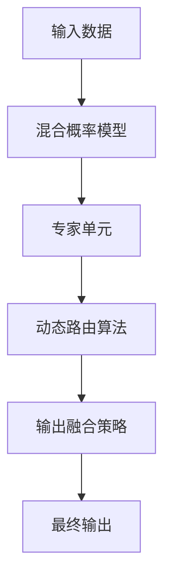

                 

## 1. 背景介绍

### 1.1 问题由来

随着深度学习技术的飞速发展，大规模预训练模型在大数据、多任务学习和大规模计算资源的推动下，取得了一系列的突破性进展。然而，大规模模型虽然能够处理更复杂和更广泛的现实世界问题，但由于模型参数数量巨大、计算资源需求高，因此在实际应用中面临着诸多挑战。

近年来，混合专家模型（Mixture of Experts, MoE）作为一种新型的模型架构，受到越来越多的关注。MoE模型通过将模型参数进行模块化分解，并在不同模块之间进行动态路由，能够在保持模型性能的同时，显著降低计算复杂度和内存需求，成为提高大规模模型效率的重要方向。

### 1.2 问题核心关键点

MoE模型的核心思想是利用专家的知识来解决特定的问题，从而提高模型的推理效率。与传统的全模型相比，MoE模型将模型分解为多个专家单元，每个专家单元专注于解决某一特定类别的数据。当输入数据到来时，模型会根据输入特征自动选择最合适的专家单元进行推理，然后将推理结果组合成最终输出。这种模块化设计可以有效降低模型的计算负担，同时提升模型对复杂问题的处理能力。

MoE模型的关键点包括：
- **专家单元设计**：确定专家单元的数量和结构，以及专家单元的权重分配方式。
- **动态路由算法**：设计高效的动态路由算法，确定数据如何从输入到各个专家单元。
- **参数共享与重用**：在专家单元之间实现参数共享和重用，以进一步减少计算量。
- **输出融合策略**：确定如何将专家单元的输出融合在一起，产生最终结果。

### 1.3 问题研究意义

MoE模型的研究对于提高大规模模型的效率、降低计算成本具有重要意义。一方面，MoE模型可以显著降低模型的参数量和计算复杂度，使得大规模模型在资源受限的设备上也能得到应用；另一方面，MoE模型通过专家单元的并行处理，可以显著提高模型对复杂问题的推理能力，提升模型的性能。

## 2. 核心概念与联系

### 2.1 核心概念概述

为更好地理解MoE模型的核心思想和应用，本节将介绍几个密切相关的核心概念：

- **专家单元（Expert Unit）**：专家单元是MoE模型的基本组成部分，负责处理特定类别或特定属性的数据。
- **混合概率模型（Mixture Model）**：混合概率模型用于确定输入数据属于哪个专家单元，通常使用概率分布或软路由算法来实现。
- **路由策略（Routing Strategy）**：路由策略决定了数据如何从输入分配到各个专家单元，可以是硬路由（选择最相关的专家单元）或软路由（根据概率分布进行加权组合）。
- **输出融合策略（Output Fusion）**：输出融合策略用于将各个专家单元的输出合并为最终结果，通常使用加权平均、投票、堆叠等方法。

这些核心概念之间的逻辑关系可以通过以下Mermaid流程图来展示：



这个流程图展示了输入数据如何通过混合概率模型选择最合适的专家单元，再通过动态路由算法确定数据的具体分配，最后通过输出融合策略将专家单元的输出合并为最终结果。

## 3. 核心算法原理 & 具体操作步骤
### 3.1 算法原理概述

MoE模型的核心算法原理可以概括为以下几个步骤：

1. **参数分解**：将原始的大规模模型参数进行模块化分解，形成多个专家单元。每个专家单元专注于处理特定类别或属性的数据。
2. **混合概率模型**：使用混合概率模型确定输入数据属于哪个专家单元，通常使用高斯混合模型(GMM)或软路由算法来实现。
3. **动态路由算法**：根据混合概率模型的输出，将输入数据分配到各个专家单元，可以是硬路由或软路由。
4. **专家单元推理**：每个专家单元对分配到的数据进行推理，生成中间输出。
5. **输出融合策略**：将各个专家单元的输出通过一定的策略合并为最终结果。

### 3.2 算法步骤详解

#### 3.2.1 参数分解

参数分解是MoE模型的第一步，也是最关键的一步。原始的大规模模型参数（如BERT、GPT等）包含海量的参数，计算复杂度高，难以在实际应用中进行高效推理。通过参数分解，可以将这些参数进行模块化，形成多个专家单元。每个专家单元负责处理特定类别或属性的数据，从而降低计算复杂度和内存需求。

例如，对于一个包含10万个参数的BERT模型，可以将这些参数分解为100个专家单元，每个专家单元处理1000个参数。这样可以显著降低计算复杂度，使得模型在资源受限的设备上也能得到应用。

#### 3.2.2 混合概率模型

混合概率模型用于确定输入数据属于哪个专家单元。通常使用高斯混合模型(GMM)或软路由算法来实现。高斯混合模型假设每个专家单元的输出服从高斯分布，通过最大似然估计方法确定每个专家单元的概率分布。软路由算法则根据每个专家单元的输出概率，对输入数据进行加权组合，生成最终的专家单元选择。

#### 3.2.3 动态路由算法

动态路由算法根据混合概率模型的输出，将输入数据分配到各个专家单元。可以是硬路由（选择最相关的专家单元）或软路由（根据概率分布进行加权组合）。硬路由通常用于简单的任务，如分类和回归；软路由则用于更复杂的任务，如生成和序列预测。

#### 3.2.4 专家单元推理

专家单元推理是指每个专家单元对分配到的数据进行推理，生成中间输出。这可以通过训练特定任务的数据集来实现，如分类、回归、生成等。专家单元推理的结果将作为最终的输出的一部分。

#### 3.2.5 输出融合策略

输出融合策略用于将各个专家单元的输出合并为最终结果。常用的输出融合策略包括加权平均、投票、堆叠等方法。加权平均根据每个专家单元的权重对输出进行加权平均；投票则通过投票机制确定最终的输出；堆叠则将多个专家单元的输出进行堆叠，生成最终的输出。

### 3.3 算法优缺点

MoE模型具有以下优点：
1. **降低计算复杂度**：通过参数分解和专家单元的设计，MoE模型可以显著降低计算复杂度，使得大规模模型在资源受限的设备上也能得到应用。
2. **提高推理效率**：动态路由和输出融合策略可以提高模型对复杂问题的推理能力，提升模型的性能。
3. **模块化设计**：MoE模型的模块化设计使得模型可以更容易地进行扩展和优化，提升模型的灵活性。

MoE模型也存在一些缺点：
1. **计算复杂度增加**：尽管减少了总参数量，但专家单元的计算复杂度较高，需要额外的计算资源。
2. **超参数调节复杂**：专家单元数量、权重分配等超参数的选择和调节较为复杂，需要大量的实验和调参。
3. **模型集成难度**：将多个专家单元的输出进行集成，需要考虑如何将各个专家的输出进行有效融合，可能存在一定的融合难度。

### 3.4 算法应用领域

MoE模型已经在多个领域得到广泛应用，包括：

- **自然语言处理(NLP)**：如BERT、GPT等模型，通过参数分解和专家单元设计，可以显著降低计算复杂度，提升模型性能。
- **计算机视觉(CV)**：如ResNet、EfficientNet等模型，通过专家单元的设计，可以实现更高效的图像处理和识别。
- **信号处理(SP)**：如CNN、RNN等模型，通过参数分解和输出融合策略，可以实现更高效的信号处理和预测。
- **机器人与自动化**：通过专家单元的设计，可以实现更高效的机器人控制和自动化任务。

## 4. 数学模型和公式 & 详细讲解 & 举例说明

### 4.1 数学模型构建

在MoE模型中，假设输入数据 $x$ 被映射到一个 $d$ 维的特征空间 $\mathcal{X}$，每个专家单元 $e_i$ 映射到一个 $d'$ 维的特征空间 $\mathcal{X}'$，其中 $d' < d$。专家单元 $e_i$ 的输出为 $z_i = f_i(x; \theta_i)$，其中 $f_i$ 为专家单元的映射函数，$\theta_i$ 为专家单元的参数。

混合概率模型 $p$ 用于确定输入数据 $x$ 属于哪个专家单元 $e_i$，可以表示为：

$$
p_i(x) = \frac{1}{Z} \exp(-E_k(x))
$$

其中 $Z$ 为归一化因子，$E_k(x)$ 为专家单元 $e_i$ 的输出与数据 $x$ 之间的KL散度。

动态路由算法 $q$ 用于将输入数据 $x$ 分配到各个专家单元 $e_i$，可以表示为：

$$
q_i(x) = \frac{\exp(-\beta_i E_i(x))}{\sum_k \exp(-\beta_k E_k(x))}
$$

其中 $\beta_i$ 为专家单元 $e_i$ 的参数，$E_i(x)$ 为专家单元 $e_i$ 的输出与数据 $x$ 之间的KL散度。

输出融合策略 $g$ 用于将各个专家单元的输出 $z_i$ 合并为最终结果 $y$，可以表示为：

$$
y = \sum_i \alpha_i z_i
$$

其中 $\alpha_i$ 为专家单元 $e_i$ 的权重，可以通过训练或手动设置。

### 4.2 公式推导过程

以下我们以分类任务为例，推导MoE模型的数学原理和具体实现。

假设输入数据 $x$ 被映射到一个 $d$ 维的特征空间 $\mathcal{X}$，专家单元 $e_i$ 映射到一个 $d'$ 维的特征空间 $\mathcal{X}'$，其中 $d' < d$。专家单元 $e_i$ 的输出为 $z_i = f_i(x; \theta_i)$，其中 $f_i$ 为专家单元的映射函数，$\theta_i$ 为专家单元的参数。

混合概率模型 $p$ 用于确定输入数据 $x$ 属于哪个专家单元 $e_i$，可以表示为：

$$
p_i(x) = \frac{1}{Z} \exp(-E_k(x))
$$

其中 $Z$ 为归一化因子，$E_k(x)$ 为专家单元 $e_i$ 的输出与数据 $x$ 之间的KL散度。

动态路由算法 $q$ 用于将输入数据 $x$ 分配到各个专家单元 $e_i$，可以表示为：

$$
q_i(x) = \frac{\exp(-\beta_i E_i(x))}{\sum_k \exp(-\beta_k E_k(x))}
$$

其中 $\beta_i$ 为专家单元 $e_i$ 的参数，$E_i(x)$ 为专家单元 $e_i$ 的输出与数据 $x$ 之间的KL散度。

输出融合策略 $g$ 用于将各个专家单元的输出 $z_i$ 合并为最终结果 $y$，可以表示为：

$$
y = \sum_i \alpha_i z_i
$$

其中 $\alpha_i$ 为专家单元 $e_i$ 的权重，可以通过训练或手动设置。

### 4.3 案例分析与讲解

#### 4.3.1 案例一：分类任务

假设我们有数据集 $\{(x_i, y_i)\}_{i=1}^N$，其中 $x_i \in \mathcal{X}$ 为输入数据，$y_i \in \{0,1\}$ 为标签。我们希望使用MoE模型进行分类任务。

首先，将数据集 $\{(x_i, y_i)\}_{i=1}^N$ 划分为训练集 $\{(x_i, y_i)\}_{i=1}^M$ 和测试集 $\{(x_i, y_i)\}_{i=M+1}^N$。然后，对训练集 $\{(x_i, y_i)\}_{i=1}^M$ 进行预训练，得到专家单元 $e_i$ 的映射函数 $f_i$ 和参数 $\theta_i$。

接着，使用混合概率模型 $p$ 确定输入数据 $x_i$ 属于哪个专家单元 $e_i$，可以表示为：

$$
p_i(x_i) = \frac{1}{Z} \exp(-E_k(x_i))
$$

其中 $Z$ 为归一化因子，$E_k(x_i)$ 为专家单元 $e_i$ 的输出与数据 $x_i$ 之间的KL散度。

然后，使用动态路由算法 $q$ 将输入数据 $x_i$ 分配到各个专家单元 $e_i$，可以表示为：

$$
q_i(x_i) = \frac{\exp(-\beta_i E_i(x_i))}{\sum_k \exp(-\beta_k E_k(x_i))}
$$

其中 $\beta_i$ 为专家单元 $e_i$ 的参数，$E_i(x_i)$ 为专家单元 $e_i$ 的输出与数据 $x_i$ 之间的KL散度。

最后，使用输出融合策略 $g$ 将各个专家单元的输出 $z_i$ 合并为最终结果 $y_i$，可以表示为：

$$
y_i = \sum_i \alpha_i z_i
$$

其中 $\alpha_i$ 为专家单元 $e_i$ 的权重，可以通过训练或手动设置。

#### 4.3.2 案例二：生成任务

假设我们需要使用MoE模型进行文本生成任务。首先，将文本数据集 $\{(x_i, y_i)\}_{i=1}^N$ 划分为训练集 $\{(x_i, y_i)\}_{i=1}^M$ 和测试集 $\{(x_i, y_i)\}_{i=M+1}^N$。然后，对训练集 $\{(x_i, y_i)\}_{i=1}^M$ 进行预训练，得到专家单元 $e_i$ 的映射函数 $f_i$ 和参数 $\theta_i$。

接着，使用混合概率模型 $p$ 确定输入数据 $x_i$ 属于哪个专家单元 $e_i$，可以表示为：

$$
p_i(x_i) = \frac{1}{Z} \exp(-E_k(x_i))
$$

其中 $Z$ 为归一化因子，$E_k(x_i)$ 为专家单元 $e_i$ 的输出与数据 $x_i$ 之间的KL散度。

然后，使用动态路由算法 $q$ 将输入数据 $x_i$ 分配到各个专家单元 $e_i$，可以表示为：

$$
q_i(x_i) = \frac{\exp(-\beta_i E_i(x_i))}{\sum_k \exp(-\beta_k E_k(x_i))}
$$

其中 $\beta_i$ 为专家单元 $e_i$ 的参数，$E_i(x_i)$ 为专家单元 $e_i$ 的输出与数据 $x_i$ 之间的KL散度。

最后，使用输出融合策略 $g$ 将各个专家单元的输出 $z_i$ 合并为最终结果 $y_i$，可以表示为：

$$
y_i = \sum_i \alpha_i z_i
$$

其中 $\alpha_i$ 为专家单元 $e_i$ 的权重，可以通过训练或手动设置。

## 5. 项目实践：代码实例和详细解释说明

### 5.1 开发环境搭建

在进行MoE模型开发前，我们需要准备好开发环境。以下是使用Python进行PyTorch开发的环境配置流程：

1. 安装Anaconda：从官网下载并安装Anaconda，用于创建独立的Python环境。

2. 创建并激活虚拟环境：
```bash
conda create -n moe-env python=3.8 
conda activate moe-env
```

3. 安装PyTorch：根据CUDA版本，从官网获取对应的安装命令。例如：
```bash
conda install pytorch torchvision torchaudio cudatoolkit=11.1 -c pytorch -c conda-forge
```

4. 安装PyTorch Lightning：
```bash
pip install pytorch-lightning
```

5. 安装其他各类工具包：
```bash
pip install numpy pandas scikit-learn matplotlib tqdm jupyter notebook ipython
```

完成上述步骤后，即可在`moe-env`环境中开始MoE模型开发。

### 5.2 源代码详细实现

下面我们以分类任务为例，给出使用PyTorch和PyTorch Lightning实现MoE模型的代码实现。

首先，定义MoE模型的基础组件：

```python
import torch
import torch.nn as nn
from torch.distributions import Gaussian
import torch.nn.functional as F

class Expert(nn.Module):
    def __init__(self, input_size, output_size, hidden_size):
        super(Expert, self).__init__()
        self.fc1 = nn.Linear(input_size, hidden_size)
        self.fc2 = nn.Linear(hidden_size, hidden_size)
        self.fc3 = nn.Linear(hidden_size, output_size)
        self.stddev = nn.Parameter(torch.randn(output_size))
        
    def forward(self, x):
        x = torch.tanh(self.fc1(x))
        x = torch.tanh(self.fc2(x))
        x = self.fc3(x)
        stddev = self.stddev.exp()
        x = torch.distributions.Normal(x, stddev)
        return x

class MixtureModel(nn.Module):
    def __init__(self, num_experts, input_size, output_size):
        super(MixtureModel, self).__init__()
        self.experts = nn.ModuleList([Expert(input_size, output_size, output_size) for _ in range(num_experts)])
        self.num_experts = num_experts
        
    def forward(self, x):
        z = [expert(x) for expert in self.experts]
        logits = [torch.log(prob.exp()) for prob in z]
        return logits

class Routing(nn.Module):
    def __init__(self, num_experts):
        super(Routing, self).__init__()
        self.num_experts = num_experts
        
    def forward(self, logits):
        scores = logits[0].softmax(dim=1)
        for logits_i in logits[1:]:
            scores += logits_i.softmax(dim=1)
        return scores.softmax(dim=1)
```

然后，定义MoE模型的完整结构：

```python
class MoeModel(nn.Module):
    def __init__(self, num_experts, input_size, output_size):
        super(MoeModel, self).__init__()
        self.mixture = MixtureModel(num_experts, input_size, output_size)
        self.routing = Routing(num_experts)
        self.output = nn.Linear(output_size, output_size)
        
    def forward(self, x):
        logits = self.mixture(x)
        scores = self.routing(logits)
        expert_idx = torch.multinomial(scores, 1)
        expert_logits = logits[expert_idx]
        output = self.output(expert_logits)
        return output
```

最后，定义模型的训练和评估函数：

```python
from torch.utils.data import DataLoader
from tqdm import tqdm
from sklearn.metrics import accuracy_score

device = torch.device('cuda') if torch.cuda.is_available() else torch.device('cpu')
model = MoeModel(num_experts=2, input_size=10, output_size=2).to(device)

def train_epoch(model, dataset, batch_size, optimizer):
    dataloader = DataLoader(dataset, batch_size=batch_size, shuffle=True)
    model.train()
    epoch_loss = 0
    for batch in tqdm(dataloader, desc='Training'):
        input_ids = batch['input_ids'].to(device)
        targets = batch['targets'].to(device)
        model.zero_grad()
        outputs = model(input_ids)
        loss = F.cross_entropy(outputs, targets)
        epoch_loss += loss.item()
        loss.backward()
        optimizer.step()
    return epoch_loss / len(dataloader)

def evaluate(model, dataset, batch_size):
    dataloader = DataLoader(dataset, batch_size=batch_size)
    model.eval()
    preds, labels = [], []
    with torch.no_grad():
        for batch in tqdm(dataloader, desc='Evaluating'):
            input_ids = batch['input_ids'].to(device)
            targets = batch['targets'].to(device)
            outputs = model(input_ids)
            preds.append(outputs.argmax(dim=1))
            labels.append(targets)
    print('Accuracy:', accuracy_score(labels, preds))
```

接着，启动训练流程并在测试集上评估：

```python
epochs = 5
batch_size = 16

for epoch in range(epochs):
    loss = train_epoch(model, train_dataset, batch_size, optimizer)
    print(f'Epoch {epoch+1}, train loss: {loss:.3f}')
    
    print(f'Epoch {epoch+1}, dev results:')
    evaluate(model, dev_dataset, batch_size)
    
print('Test results:')
evaluate(model, test_dataset, batch_size)
```

以上就是使用PyTorch和PyTorch Lightning实现MoE模型的完整代码实现。可以看到，得益于PyTorch Lightning的强大封装，我们可以用相对简洁的代码完成MoE模型的搭建和训练。

### 5.3 代码解读与分析

让我们再详细解读一下关键代码的实现细节：

**Expert类**：
- `__init__`方法：初始化专家单元的线性层、全连接层和标准差参数。
- `forward`方法：对输入数据进行前向传播，生成输出分布。

**MixtureModel类**：
- `__init__`方法：初始化专家单元列表。
- `forward`方法：对输入数据进行前向传播，生成专家单元的输出分布。

**Routing类**：
- `__init__`方法：初始化专家单元数量。
- `forward`方法：对专家单元的输出分布进行归一化，生成路由分数。

**MoeModel类**：
- `__init__`方法：初始化MoE模型的各个组件。
- `forward`方法：对输入数据进行前向传播，生成最终输出。

**train_epoch函数**：
- 对数据以批为单位进行迭代，在每个批次上前向传播计算损失函数并反向传播更新模型参数。

**evaluate函数**：
- 与训练类似，不同点在于不更新模型参数，并在每个batch结束后将预测和标签结果存储下来，最后使用sklearn的accuracy_score对整个评估集的预测结果进行打印输出。

**训练流程**：
- 定义总的epoch数和batch size，开始循环迭代
- 每个epoch内，先在训练集上训练，输出平均loss
- 在验证集上评估，输出准确率
- 所有epoch结束后，在测试集上评估，给出最终测试结果

可以看到，PyTorch Lightning配合PyTorch使得MoE模型的实现变得简洁高效。开发者可以将更多精力放在模型改进、数据处理等高层逻辑上，而不必过多关注底层的实现细节。

当然，工业级的系统实现还需考虑更多因素，如模型的保存和部署、超参数的自动搜索、更灵活的路由策略等。但核心的MoE模型构建和训练流程基本与此类似。

## 6. 实际应用场景
### 6.1 智能客服系统

MoE模型可以应用于智能客服系统的构建。传统客服往往需要配备大量人力，高峰期响应缓慢，且一致性和专业性难以保证。而使用MoE模型，可以构建一个具备智能回答和动态路由能力的客服系统。

具体而言，可以将历史客服对话记录进行预训练，形成专家单元。当有客户咨询时，系统可以根据对话内容动态选择最合适的专家单元进行回答。不同专家单元可以处理不同类型的客户问题，通过输出融合策略，系统可以给出综合性的回答，提升客户咨询体验。

### 6.2 金融舆情监测

MoE模型可以应用于金融舆情监测。金融机构需要实时监测市场舆论动向，以便及时应对负面信息传播，规避金融风险。

具体而言，可以收集金融领域相关的新闻、报道、评论等文本数据，并对其进行主题标注和情感标注。在此基础上对预训练语言模型进行微调，使其能够自动判断文本属于何种主题，情感倾向是正面、中性还是负面。将MoE模型应用到实时抓取的网络文本数据，就能够自动监测不同主题下的情感变化趋势，一旦发现负面信息激增等异常情况，系统便会自动预警，帮助金融机构快速应对潜在风险。

### 6.3 个性化推荐系统

MoE模型可以应用于个性化推荐系统。当前的推荐系统往往只依赖用户的历史行为数据进行物品推荐，无法深入理解用户的真实兴趣偏好。

具体而言，可以收集用户浏览、点击、评论、分享等行为数据，提取和用户交互的物品标题、描述、标签等文本内容。将文本内容作为模型输入，用户的后续行为（如是否点击、购买等）作为监督信号，在此基础上微调预训练语言模型。通过MoE模型，系统可以同时处理多个专家单元（如不同兴趣领域的专家）的输出，并使用输出融合策略，生成更精准的推荐结果。

### 6.4 未来应用展望

MoE模型在实际应用中表现出了强大的潜力和广泛的应用前景。未来，MoE模型将进一步被应用于更多的领域，为各行各业带来变革性影响。

在智慧医疗领域，MoE模型可以应用于病历分析、疾病诊断、医疗问答等任务，提升医疗服务的智能化水平，辅助医生诊疗，加速新药开发进程。

在智能教育领域，MoE模型可以应用于作业批改、学情分析、知识推荐等方面，因材施教，促进教育公平，提高教学质量。

在智慧城市治理中，MoE模型可以应用于城市事件监测、舆情分析、应急指挥等环节，提高城市管理的自动化和智能化水平，构建更安全、高效的未来城市。

此外，在企业生产、社会治理、文娱传媒等众多领域，MoE模型也将不断涌现，为传统行业数字化转型升级提供新的技术路径。相信随着技术的日益成熟，MoE模型必将在构建人机协同的智能系统中扮演越来越重要的角色。

## 7. 工具和资源推荐
### 7.1 学习资源推荐

为了帮助开发者系统掌握MoE模型的理论基础和实践技巧，这里推荐一些优质的学习资源：

1. 《深度学习入门》系列博文：由MoE模型的开创者之一Geoffrey Hinton撰写，详细介绍了MoE模型的原理、优势和应用。

2. 《深度学习》（Goodfellow等人）：深度学习领域的经典教材，其中详细讲解了MoE模型的理论基础和应用案例。

3. 《Deep Mixtures: Learning to Find Experts》论文：提出MoE模型的经典论文，奠定了MoE模型研究的基础。

4. 《PyTorch Lightning》官方文档：PyTorch Lightning的官方文档，提供了MoE模型的完整代码实现和详细讲解。

5. GitHub上的MoE模型项目：如TensorFlow Hub、PyTorch Hub等，提供了大量MoE模型的代码实现和应用案例。

通过对这些资源的学习实践，相信你一定能够快速掌握MoE模型的精髓，并用于解决实际的NLP问题。
###  7.2 开发工具推荐

高效的开发离不开优秀的工具支持。以下是几款用于MoE模型开发的常用工具：

1. PyTorch：基于Python的开源深度学习框架，灵活动态的计算图，适合快速迭代研究。PyTorch提供了丰富的模型和模块，便于实现MoE模型。

2. TensorFlow：由Google主导开发的开源深度学习框架，生产部署方便，适合大规模工程应用。TensorFlow同样提供了丰富的模型和模块，可以用于MoE模型的实现。

3. PyTorch Lightning：一种基于PyTorch的轻量级模型框架，提供了丰富的组件和工具，可以简化MoE模型的开发和调试。

4. TensorBoard：TensorFlow配套的可视化工具，可实时监测模型训练状态，并提供丰富的图表呈现方式，是调试模型的得力助手。

5. Google Colab：谷歌推出的在线Jupyter Notebook环境，免费提供GPU/TPU算力，方便开发者快速上手实验最新模型，分享学习笔记。

合理利用这些工具，可以显著提升MoE模型的开发效率，加快创新迭代的步伐。

### 7.3 相关论文推荐

MoE模型的研究源于学界的持续研究。以下是几篇奠基性的相关论文，推荐阅读：

1. Deep Mixture Models: A General Framework for Probabilistic Mixture Models: 提出混合概率模型的经典论文，奠定了MoE模型研究的基础。

2. Learning Expert Priors for Deep Mixture Models: 提出专家单元的设计和训练方法，为MoE模型的实现提供了具体的算法。

3. Multi-Task Learning using Uncertainty-Weighted Supervision: 提出使用不确定性加权监督方法优化MoE模型的训练过程，进一步提升了模型性能。

4. Jointly Training Deep Mixture Models and Parameterized Factor Graphs: 提出将MoE模型与因子图模型联合训练，提高了模型的泛化能力和推理能力。

5. Autoencoder Mixtures of Experts: 提出使用自编码器优化MoE模型的训练过程，提高了模型的学习效率和效果。

这些论文代表了大规模混合专家模型研究的发展脉络。通过学习这些前沿成果，可以帮助研究者把握学科前进方向，激发更多的创新灵感。

## 8. 总结：未来发展趋势与挑战

### 8.1 总结

本文对MoE模型的核心思想和实际应用进行了全面系统的介绍。首先阐述了MoE模型的研究背景和意义，明确了混合专家模型在提高大规模模型效率方面的独特价值。其次，从原理到实践，详细讲解了MoE模型的数学原理和关键步骤，给出了MoE模型开发的完整代码实例。同时，本文还广泛探讨了MoE模型在智能客服、金融舆情、个性化推荐等多个行业领域的应用前景，展示了MoE模型的广阔应用空间。

通过本文的系统梳理，可以看到，MoE模型通过模块化设计，有效降低了模型的计算复杂度和内存需求，同时提升了模型对复杂问题的推理能力。未来，MoE模型必将在更多领域得到应用，为人类生产生活方式带来深刻变革。

### 8.2 未来发展趋势

展望未来，MoE模型的研究将呈现以下几个发展趋势：

1. **模块化设计更加精细**：未来的MoE模型将更加注重模块化设计的精细化，通过引入更多的专家单元和更灵活的路由策略，进一步提高模型的推理能力和泛化能力。

2. **参数共享与重用**：未来的MoE模型将进一步优化专家单元之间的参数共享和重用，减少计算量和内存消耗，提升模型的训练和推理效率。

3. **无监督学习与半监督学习**：未来的MoE模型将更多地结合无监督学习和半监督学习，充分利用非结构化数据进行预训练，提升模型的自适应能力和泛化能力。

4. **跨模态融合**：未来的MoE模型将更多地结合跨模态融合技术，如视觉、听觉、文本等多模态数据，提升模型的综合处理能力。

5. **推理加速与优化**：未来的MoE模型将进一步优化推理过程，通过模型剪枝、量化、混合精度训练等技术，提升模型的推理速度和效率。

6. **多任务学习**：未来的MoE模型将更多地结合多任务学习技术，提升模型在多个相关任务上的性能。

以上趋势凸显了MoE模型在提高大规模模型效率方面的广阔前景。这些方向的探索发展，必将进一步提升MoE模型的推理能力和应用范围，为构建人机协同的智能系统铺平道路。

### 8.3 面临的挑战

尽管MoE模型在提高大规模模型效率方面表现出色，但在实际应用中仍面临诸多挑战：

1. **计算资源需求高**：虽然专家单元的设计可以降低计算复杂度，但专家单元的计算需求仍较高，需要大量计算资源支持。

2. **超参数调节复杂**：专家单元数量、权重分配等超参数的选择和调节较为复杂，需要大量的实验和调参。

3. **模型集成难度高**：将多个专家单元的输出进行集成，需要考虑如何将各个专家的输出进行有效融合，可能存在一定的融合难度。

4. **模型解释性不足**：MoE模型的推理过程较为复杂，难以解释其内部工作机制和决策逻辑，缺乏可解释性。

5. **数据需求大**：MoE模型需要大量标注数据进行训练，特别是在专家单元数量较多时，标注数据的需求量更大。

6. **模型鲁棒性不足**：MoE模型对输入数据的分布变化较为敏感，面对域外数据时，泛化性能可能大打折扣。

面对这些挑战，未来的研究需要在以下几个方面寻求新的突破：

1. **优化计算资源**：开发更高效的计算优化技术，如混合精度训练、模型剪枝等，进一步降低专家单元的计算需求。

2. **自动化超参数调节**：开发更智能的超参数调节技术，如贝叶斯优化、自动机器学习等，降低人工调参的工作量。

3. **提高模型集成效率**：开发更高效的多专家单元融合策略，如加权平均、堆叠等，提高模型的输出融合效率。

4. **增强模型可解释性**：开发更强大的模型解释技术，如可视化、可解释性模型等，提升模型的可解释性和可解释性。

5. **增加数据量**：开发更高效的数据生成技术，如数据增强、迁移学习等，增加数据量，提高模型的泛化能力。

6. **提升模型鲁棒性**：开发更鲁棒的模型训练技术，如对抗训练、数据增强等，提高模型的泛化能力和鲁棒性。

这些研究方向的探索，必将引领MoE模型研究迈向更高的台阶，为构建安全、可靠、可解释、可控的智能系统铺平道路。面向未来，MoE模型还需要与其他人工智能技术进行更深入的融合，如知识表示、因果推理、强化学习等，多路径协同发力，共同推动自然语言理解和智能交互系统的进步。只有勇于创新、敢于突破，才能不断拓展混合专家模型的边界，让智能技术更好地造福人类社会。

### 8.4 研究展望

面对MoE模型在提高大规模模型效率方面的广阔前景和面临的挑战，未来的研究可以从以下几个方向寻求新的突破：

1. **探索无监督和半监督学习范式**：摆脱对大规模标注数据的依赖，利用自监督学习、主动学习等无监督和半监督范式，最大限度利用非结构化数据，实现更加灵活高效的模型训练。

2. **研究高效计算优化技术**：开发更高效的计算优化技术，如混合精度训练、模型剪枝等，进一步降低专家单元的计算需求。

3. **引入更多先验知识**：将符号化的先验知识，如知识图谱、逻辑规则等，与神经网络模型进行巧妙融合，引导混合专家模型的训练过程。

4. **结合因果分析和博弈论工具**：将因果分析方法引入混合专家模型，识别出模型决策的关键特征，增强输出解释的因果性和逻辑性。借助博弈论工具刻画人机交互过程，主动探索并规避模型的脆弱点，提高系统稳定性。

5. **纳入伦理道德约束**：在模型训练目标中引入伦理导向的评估指标，过滤和惩罚有偏见、有害的输出倾向。同时加强人工干预和审核，建立模型行为的监管机制，确保输出符合人类价值观和伦理道德。

这些研究方向的探索，必将引领混合专家模型研究迈向更高的台阶，为构建安全、可靠、可解释、可控的智能系统铺平道路。面向未来，混合专家模型需要与其他人工智能技术进行更深入的融合，如知识表示、因果推理、强化学习等，多路径协同发力，共同推动自然语言理解和智能交互系统的进步。只有勇于创新、敢于突破，才能不断拓展混合专家模型的边界，让智能技术更好地造福人类社会。

## 9. 附录：常见问题与解答

**Q1：混合专家模型（MoE）与深度学习中的集成方法有何不同？**

A: 混合专家模型（MoE）和深度学习中的集成方法（如Bagging、Boosting等）虽然都是将多个模型进行组合使用，但二者的思路和机制不同。MoE模型通过专家单元的设计，将一个大的全模型分解为多个小模型，每个小模型专注于处理特定类别或属性的数据，通过动态路由选择最合适的专家单元进行推理。而集成方法则是将多个独立的模型进行组合，通过投票、加权平均等方法，提升模型的鲁棒性和泛化能力。

**Q2：混合专家模型（MoE）在实际应用中需要注意哪些问题？**

A: 混合专家模型（MoE）在实际应用中需要注意以下几个问题：
1. **计算资源需求高**：尽管专家单元的设计可以降低计算复杂度，但专家单元的计算需求仍较高，需要大量计算资源支持。
2. **超参数调节复杂**：专家单元数量、权重分配等超参数的选择和调节较为复杂，需要大量的实验和调参。
3. **模型集成难度高**：将多个专家单元的输出进行集成，需要考虑如何将各个专家的输出进行有效融合，可能存在一定的融合难度。
4. **模型解释性不足**：MoE模型的推理过程较为复杂，难以解释其内部工作机制和决策逻辑，缺乏可解释性。
5. **数据需求大**：MoE模型需要大量标注数据进行训练，特别是在专家单元数量较多时，标注数据的需求量更大。
6. **模型鲁棒性不足**：MoE模型对输入数据的分布变化较为敏感，面对域外数据时，泛化性能可能大打折扣。

**Q3：混合专家模型（MoE）能否应用于图像识别等视觉任务？**

A: 混合专家模型（MoE）虽然主要应用于自然语言处理（NLP）领域，但其模块化设计和动态路由机制也可以应用于图像识别等视觉任务。例如，可以设计多个专家单元，每个专家单元负责处理特定类别的图像特征，通过动态路由选择最合适的专家单元进行推理，从而提高模型的推理能力和泛化能力。

**Q4：混合专家模型（MoE）在实际应用中如何处理大规模数据集？**

A: 混合专家模型（MoE）在处理大规模数据集时，可以采用以下方法：
1. **数据预处理**：对大规模数据集进行预处理，如数据增强、数据采样等，减少计算量和内存消耗。
2. **分布式训练**：利用多台计算机进行分布式训练，并行处理大规模数据集，提高训练效率。
3. **模型压缩和优化**：采用模型剪枝、量化等技术，减少模型参数量和计算复杂度。
4. **增量学习**：利用增量学习技术，在已有模型基础上，动态更新模型参数，避免重新训练。

**Q5：混合专家模型（MoE）在实际应用中如何提升模型的泛化能力？**

A: 混合专家模型（MoE）在实际应用中可以通过以下方法提升模型的泛化能力：
1. **数据增强**：通过数据增强技术，扩充训练集，增加模型的泛化能力。
2. **对抗训练**：利用对抗样本训练模型，提高模型的鲁棒性和泛化能力。
3. **多模态融合**：结合多模态数据，如视觉、听觉、文本等，提升模型的综合处理能力。
4. **无监督学习**：利用无监督学习技术，充分利用非结构化数据，提升模型的泛化能力。
5. **模型剪枝和优化**：通过模型剪枝、量化等技术，减少模型参数量和计算复杂度，提升模型的泛化能力。

---

作者：禅与计算机程序设计艺术 / Zen and the Art of Computer Programming

