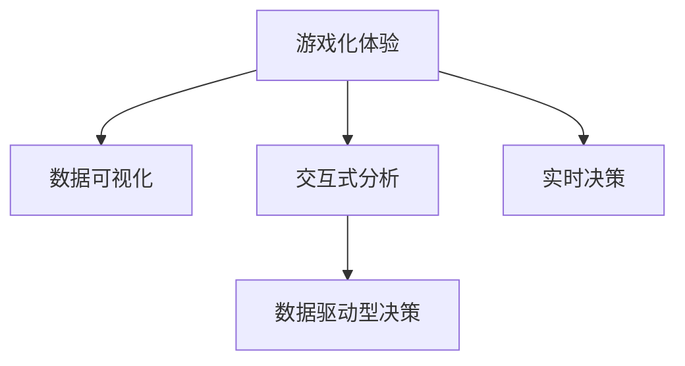

                 

# 游戏化体验：让参与人类计算乐在其中

> 关键词：游戏化体验,人类计算,参与度提升,技术创新,交互设计,数据科学

## 1. 背景介绍

### 1.1 问题由来

近年来，人工智能和大数据技术的飞速发展，为数据驱动型决策提供了更强的技术支持，但与此同时，人类计算参与度在逐渐下降。企业数据分析和决策依赖于数据科学家和业务分析师，依赖于专业知识和技能，这不仅耗费时间成本，而且决策往往缺乏直观的视觉化展示和交互性体验，难以有效提升决策的精准性和效率。

数据科学家和分析师能提供专业的洞察，但缺乏商业视角。业务人员的直观感受无法通过数据驱动的模型直接反映出来。数据科学家和业务人员无法有效对接，致使数据价值无法得到充分挖掘。

如何提高数据参与度，让业务人员也能轻松参与到数据分析和决策过程中来，是一个亟待解决的问题。

### 1.2 问题核心关键点

游戏化体验设计理念源于游戏和娱乐行业，通过增加参与者兴趣和动机，以互动、模拟等手段提升用户体验。将其应用到数据驱动型决策中，可以实现数据可视化、交互式分析和实时决策等功能。

1. 增强参与度：让非技术用户也能够轻松地使用数据。
2. 提升决策效率：通过交互式和直观化的设计，让数据决策过程变得更加透明。
3. 优化用户体验：利用游戏设计原理，提高用户对数据驱动型决策的接受度。
4. 强化行为习惯：通过持续的交互和反馈，培养用户对数据决策的依赖。
5. 实现数据驱动：让决策过程有据可循，避免主观判断。

### 1.3 问题研究意义

游戏化体验应用到数据驱动型决策中，有助于提高决策的透明度和可解释性，使更多业务人员参与到数据决策中来，并逐步形成数据驱动决策的习惯。

1. 降低技术门槛：通过游戏化的交互方式，降低数据分析和决策的技术门槛，让业务人员也能轻松参与。
2. 提高决策质量：通过数据可视化、模拟和实时反馈，提高决策过程的可视性和透明性，让决策更科学。
3. 培养数据文化：通过持续的游戏化体验，培养全员数据驱动决策的习惯，提高企业整体的数据素养。
4. 推动技术创新：游戏化设计和数据分析技术的融合，带来新的用户体验和决策模式。
5. 提升业务效率：通过游戏化的设计和交互，加快决策过程，提高业务效率。

## 2. 核心概念与联系

### 2.1 核心概念概述

为了更好地理解游戏化体验在数据驱动型决策中的作用，本节将介绍几个密切相关的核心概念：

- **游戏化体验（Gamification）**：将游戏设计原理应用于非游戏环境，以提高参与者的兴趣和动机。
- **数据驱动型决策（Data-Driven Decision Making）**：基于数据进行决策，以提升决策的科学性和准确性。
- **数据可视化（Data Visualization）**：通过图形、图表等方式，将数据直观地呈现出来，便于理解和分析。
- **交互式分析（Interactive Analysis）**：通过用户交互操作，实现数据分析和决策。
- **实时决策（Real-time Decision Making）**：在数据实时更新的情况下，进行快速决策。

这些核心概念之间的逻辑关系可以通过以下Mermaid流程图来展示：



这个流程图展示了大数据驱动型决策中，游戏化体验的关键组成部分及其相互关系：

1. 游戏化体验增强了数据可视化和交互式分析的趣味性，提升了用户的参与度和兴趣。
2. 数据可视化使得数据分析结果更加直观易懂，便于用户理解。
3. 交互式分析通过用户操作，让数据决策更加个性化和互动化。
4. 实时决策支持快速、灵活的决策过程，及时应对业务变化。
5. 游戏化体验和数据驱动型决策相结合，提升整个决策过程的科学性和效率。

## 3. 核心算法原理 & 具体操作步骤

### 3.1 算法原理概述

游戏化体验在数据驱动型决策中的应用，主要通过以下几个算法原理实现：

1. **目标激励算法**：设计任务完成的目标，通过达成这些目标，激励用户参与数据驱动型决策过程。
2. **进度跟踪算法**：通过进度条、积分等方式，让用户在决策过程中实时跟踪自己的进度，提升参与感和成就感。
3. **即时反馈算法**：对用户的决策进行实时反馈，提高用户对数据决策的认可度和接受度。
4. **竞争与合作算法**：引入竞争和合作元素，增强用户对决策任务的参与度，并提高决策的质量。
5. **持续迭代算法**：通过持续的交互和反馈，不断优化用户体验，提升数据驱动型决策的效果。

### 3.2 算法步骤详解

基于游戏化体验的数据驱动型决策，主要包括以下几个关键步骤：

**Step 1: 确定目标和任务**

- 分析业务需求，确定需要解决的问题。
- 确定目标完成的标准和里程碑，设计任务完成的目标。
- 将业务目标和数据决策关联起来，形成具体的任务和任务描述。

**Step 2: 设计游戏化元素**

- 根据目标和任务，设计游戏化的元素，如积分、奖励、排行榜等。
- 设定合理的规则和奖励机制，确保用户有足够的动力参与。
- 实现进度条和实时反馈功能，让用户能够实时看到自己的进度和成果。

**Step 3: 实现交互式分析**

- 选择合适的可视化工具，将数据结果以图形、图表等形式展示出来。
- 设计交互式分析界面，让用户能够通过操作，获取更深入的分析和洞察。
- 提供实时数据更新和动态可视化功能，确保数据实时反映业务情况。

**Step 4: 实时决策支持**

- 集成实时数据和交互式分析结果，提供决策支持和建议。
- 利用机器学习和算法模型，分析历史数据和实时数据，预测未来趋势。
- 建立实时决策流程，支持业务人员快速、灵活地做出决策。

**Step 5: 评估和迭代**

- 对游戏化体验进行评估，分析用户反馈和参与度。
- 根据评估结果，持续迭代和优化游戏化体验设计。
- 通过数据分析和用户行为研究，不断改进数据驱动型决策的效果。

### 3.3 算法优缺点

游戏化体验在数据驱动型决策中的应用，具有以下优点：

1. 提升参与度：通过游戏化的元素，让非技术用户也能轻松参与到数据分析和决策中来。
2. 提高决策效率：通过交互式和直观化的设计，让决策过程变得更加透明和高效。
3. 强化行为习惯：通过持续的交互和反馈，培养用户对数据决策的依赖和习惯。
4. 优化用户体验：通过游戏设计原理，提高用户对数据决策的接受度和满意度。
5. 实现数据驱动：让决策过程有据可循，避免主观判断和偏见。

同时，游戏化体验在应用中也会面临一些挑战：

1. 设计复杂度高：需要设计复杂的规则和任务，确保用户有足够的动力参与。
2. 用户体验不一致：游戏化体验的设计需要考虑用户体验的多样性，确保不同用户都能获得一致的体验。
3. 数据安全问题：游戏化体验可能会收集用户行为数据，需要确保数据安全和个人隐私保护。
4. 技术实现难度大：游戏化体验需要与业务系统紧密集成，实现难度大。
5. 用户反馈管理：需要建立反馈机制，持续改进和优化游戏化体验设计。

### 3.4 算法应用领域

游戏化体验在数据驱动型决策中的应用，已经涵盖了多个领域，例如：

1. 销售决策：通过游戏化体验，提升销售人员对数据的参与度和决策效率。
2. 市场分析：利用数据可视化、交互式分析和实时决策，帮助市场团队快速做出决策。
3. 客户服务：通过游戏化体验，提升客服人员的服务质量和客户满意度。
4. 产品开发：通过游戏化体验，让产品经理能够更有效地进行数据驱动的迭代和优化。
5. 运营管理：利用游戏化体验，优化运营流程和提升运营效率。
6. 风险控制：通过实时数据和交互式分析，提高风险决策的科学性和准确性。
7. 供应链管理：利用游戏化体验，提升供应链的灵活性和响应速度。

除了这些领域，游戏化体验还能应用到更多场景中，如生产制造、健康医疗、环境保护等，为各个行业的决策过程注入新的活力。

## 4. 数学模型和公式 & 详细讲解 & 举例说明

### 4.1 数学模型构建

为了更好地理解游戏化体验在数据驱动型决策中的应用，本节将使用数学语言对游戏化体验的基本模型进行严格刻画。

记用户行为数据为 $D = \{(d_1, a_1, r_1), (d_2, a_2, r_2), \ldots, (d_t, a_t, r_t)\}$，其中 $d_t$ 为决策数据，$a_t$ 为决策动作，$r_t$ 为决策结果。

假设用户的决策目标为 $G$，目标完成的标准为 $S$。用户通过执行决策动作 $a_t$ 获得决策结果 $r_t$，并逐步逼近目标 $G$。

定义用户当前的状态为 $X_t$，状态转换函数为 $f: X_{t-1}, a_t \rightarrow X_t$，状态奖励函数为 $R: X_t, r_t \rightarrow X_t'$。

游戏化体验的数学模型可以表示为：

$$
X_{t+1} = f(X_t, a_t)
$$

$$
X_t' = R(X_t, r_t)
$$

其中 $X_t$ 为状态变量，$a_t$ 为决策动作，$r_t$ 为决策结果，$X_t'$ 为下一状态的目标完成度。

### 4.2 公式推导过程

以下是游戏化体验在数据驱动型决策中的基本数学模型公式推导：

**目标完成度公式**：

$$
X_{t+1} = f(X_t, a_t) = X_t + k \cdot a_t \cdot \Delta X_t
$$

其中 $k$ 为系数，$\Delta X_t$ 为状态变化量。

**决策动作和奖励公式**：

$$
a_t = g(X_t, r_t) = \max\limits_{a} \{ \Delta X_t \}
$$

$$
r_t = h(X_t, a_t, r_t) = X_t + \Delta X_t
$$

其中 $g$ 为决策动作函数，$h$ 为决策奖励函数。

通过上述公式，我们可以逐步推导出游戏化体验的数学模型，并通过模拟和优化，实现对数据驱动型决策的支持。

### 4.3 案例分析与讲解

以销售决策为例，分析游戏化体验在其中的具体应用。

假设某销售人员的目标是提升销售额 $G$，每天至少完成一定的销售额 $S$。设定每天的销售额数据 $d_t$，决策动作 $a_t$ 为是否接受订单，决策结果 $r_t$ 为订单金额。

定义状态变量 $X_t$ 为当前销售额，状态变化量 $\Delta X_t = r_t - d_t$，系数 $k = 0.5$。则目标完成度公式为：

$$
X_{t+1} = X_t + 0.5 \cdot a_t \cdot (r_t - d_t)
$$

决策动作函数为：

$$
a_t = g(X_t, r_t) = \max\limits_{a} \{ 0.5 \cdot (r_t - d_t) \}
$$

决策奖励函数为：

$$
r_t = h(X_t, a_t, r_t) = X_t + 0.5 \cdot (r_t - d_t)
$$

通过游戏化体验的数学模型，销售人员可以实时了解自己的销售额，并通过接受订单等决策动作，逐步逼近销售目标。系统根据其决策动作和结果，实时更新其销售额和目标完成度，并提供奖励和反馈。

例如，当销售额达到目标 $S$，系统将给出奖励和积分，激励销售人员继续努力。当销售额超过目标 $S$，系统将给出更高的奖励，鼓励销售人员创造更高的业绩。

## 5. 项目实践：代码实例和详细解释说明

### 5.1 开发环境搭建

在进行游戏化体验的开发前，我们需要准备好开发环境。以下是使用Python进行游戏化体验开发的环境配置流程：

1. 安装Anaconda：从官网下载并安装Anaconda，用于创建独立的Python环境。

2. 创建并激活虚拟环境：
```bash
conda create -n gamification-env python=3.8 
conda activate gamification-env
```

3. 安装PyTorch：根据CUDA版本，从官网获取对应的安装命令。例如：
```bash
conda install pytorch torchvision torchaudio cudatoolkit=11.1 -c pytorch -c conda-forge
```

4. 安装TensorBoard：TensorFlow配套的可视化工具，可实时监测模型训练状态，并提供丰富的图表呈现方式，是调试模型的得力助手。

5. 安装Flask：用于搭建游戏化体验的Web应用平台。

6. 安装Pandas：用于数据处理和分析。

7. 安装Numpy：用于数学运算和科学计算。

完成上述步骤后，即可在`gamification-env`环境中开始游戏化体验的实践。

### 5.2 源代码详细实现

这里我们以销售决策系统为例，给出使用Flask搭建的游戏化体验的PyTorch代码实现。

首先，定义销售人员的行为数据和目标完成度：

```python
import pandas as pd
import numpy as np
from torch.utils.data import Dataset
import torch

class SalesData(Dataset):
    def __init__(self, sales_data, target):
        self.sales_data = sales_data
        self.target = target
        
    def __len__(self):
        return len(self.sales_data)
    
    def __getitem__(self, item):
        sales_data = self.sales_data[item]
        target = self.target[item]
        
        return {'sales_data': sales_data, 'target': target}

# 定义目标完成度
target = 100000
```

然后，定义决策模型和奖励函数：

```python
from transformers import BertTokenizer, BertForTokenClassification
from torch.optim import AdamW
from torch.nn import BCEWithLogitsLoss

# 加载BERT模型
tokenizer = BertTokenizer.from_pretrained('bert-base-cased')
model = BertForTokenClassification.from_pretrained('bert-base-cased', num_labels=2)

# 定义决策模型和奖励函数
def decision_model(sales_data):
    sales_data = tokenizer(sales_data, return_tensors='pt')
    return model(sales_data['input_ids'], attention_mask=sales_data['attention_mask'])

def reward_function(sales_data, decision, reward):
    sales_data = tokenizer(sales_data, return_tensors='pt')
    decision = decision_model(sales_data['input_ids'])
    loss = BCEWithLogitsLoss()(sales_data['target'], decision)
    return reward - loss.item()
```

接着，定义游戏化体验的功能：

```python
from flask import Flask, render_template, request, jsonify

app = Flask(__name__)

# 游戏化体验界面
@app.route('/')
def index():
    return render_template('index.html')

# 提交订单
@app.route('/submit', methods=['POST'])
def submit():
    sales_data = request.form.get('sales_data')
    target = request.form.get('target')
    reward = reward_function(sales_data, decision_model(sales_data), target)
    return jsonify({'reward': reward})
```

最后，启动Web服务：

```python
if __name__ == '__main__':
    app.run(host='0.0.0.0', port=5000)
```

以上就是使用Flask搭建游戏化体验的销售决策系统的完整代码实现。可以看到，通过Flask和PyTorch的结合，我们能够快速搭建一个简单易用的游戏化体验系统。

### 5.3 代码解读与分析

让我们再详细解读一下关键代码的实现细节：

**SalesData类**：
- `__init__`方法：初始化销售数据和目标完成度。
- `__len__`方法：返回数据集的样本数量。
- `__getitem__`方法：对单个样本进行处理，返回模型所需的输入。

**reward_function函数**：
- 定义决策模型和奖励函数，将输入数据编码为token ids，输入BERT模型，并计算奖励。

**Flask应用程序**：
- `index`方法：定义游戏化体验界面，提供数据输入和决策提交功能。
- `submit`方法：处理订单提交请求，计算奖励并返回。

**Web服务**：
- 使用Flask启动Web服务，监听本地5000端口，并通过渲染HTML模板和接收POST请求，实现游戏化体验的功能。

通过上述代码，我们能够搭建一个基于游戏化体验的销售决策系统，使用户能够通过交互界面，实时了解自己的销售额和目标完成度，并通过接受订单等决策动作，逐步逼近销售目标。

## 6. 实际应用场景

### 6.1 智能客服系统

基于游戏化体验的智能客服系统，可以通过游戏化元素提升客服人员的参与度和积极性，提高客户满意度。

在实际应用中，可以将客服人员的客户服务数据作为输入，设计评分、任务完成等游戏化元素，激励客服人员快速响应客户咨询，解决客户问题。系统实时跟踪客服人员的业绩，提供奖励和反馈，并通过游戏化界面展示客户的满意度等关键指标。

例如，当客服人员响应客户咨询后，系统将给出积分和奖励，激励其继续努力。当客服人员解决客户问题时，系统将给出更高的奖励，鼓励其创造更高的满意度。

### 6.2 财务分析

通过游戏化体验，财务分析人员可以更轻松地参与到数据分析和决策中来，提升财务分析的效率和准确性。

在实际应用中，可以将财务数据作为输入，设计收入、成本等游戏化元素，激励财务人员快速完成分析和报告。系统实时跟踪财务人员的业绩，提供奖励和反馈，并通过游戏化界面展示财务数据的变化和趋势。

例如，当财务人员完成一份财务报告时，系统将给出积分和奖励，激励其继续努力。当财务人员发现某项指标异常时，系统将给出更高的奖励，鼓励其深入分析并提出改进建议。

### 6.3 产品开发

基于游戏化体验的产品开发系统，可以通过游戏化元素提升产品经理的参与度和决策效率，加速产品迭代和优化。

在实际应用中，可以将产品数据作为输入，设计功能开发、用户反馈等游戏化元素，激励产品经理快速完成产品功能和优化。系统实时跟踪产品经理的业绩，提供奖励和反馈，并通过游戏化界面展示产品的用户反馈和市场表现。

例如，当产品经理完成一项产品功能时，系统将给出积分和奖励，激励其继续努力。当产品经理发现产品功能存在问题时，系统将给出更高的奖励，鼓励其改进并优化产品功能。

### 6.4 未来应用展望

随着游戏化体验和数据分析技术的不断发展，基于游戏化体验的数据驱动型决策必将在更多领域得到应用，为各行各业带来变革性影响。

在智慧医疗领域，通过游戏化体验，提升医疗人员的参与度和决策效率，让医生更轻松地进行诊断和治疗。

在智能教育领域，通过游戏化体验，提升教师和学生的参与度和学习效率，让教育更具互动性和趣味性。

在智慧城市治理中，通过游戏化体验，提升城市管理人员的参与度和决策效率，让城市治理更具科学性和透明性。

此外，在游戏化体验和数据分析技术的不断融合下，未来的智能决策系统将更加全面、高效，为社会发展和经济进步提供新的助力。

## 7. 工具和资源推荐

### 7.1 学习资源推荐

为了帮助开发者系统掌握游戏化体验和数据驱动型决策的理论基础和实践技巧，这里推荐一些优质的学习资源：

1. 《Gamification for Business: A Practical Guide》书籍：全面介绍游戏化体验在商业中的实践方法，并包含多个经典案例。

2. 《Data-Driven Decision Making: A Practical Guide》书籍：深入探讨数据驱动型决策的方法和工具，提供丰富的案例和经验。

3. 《Designing Data-Intensive Applications》书籍：介绍数据密集型应用的设计理念和实现方法，帮助开发者构建高效、可扩展的数据驱动系统。

4. Coursera《Gamification for Business》课程：斯坦福大学开设的在线课程，探讨游戏化体验在商业中的应用。

5. Udacity《Data-Driven Product Management》纳米学位：通过实际项目，帮助学员掌握数据驱动型产品管理的实践技巧。

通过对这些资源的学习实践，相信你一定能够快速掌握游戏化体验和数据驱动型决策的精髓，并用于解决实际的业务问题。

### 7.2 开发工具推荐

高效的游戏化体验开发离不开优秀的工具支持。以下是几款用于游戏化体验开发常用的工具：

1. Flask：用于搭建游戏化体验的Web应用平台，简单易用，支持动态路由和模板渲染。

2. PyTorch：基于Python的开源深度学习框架，灵活动态的计算图，适合快速迭代研究。

3. TensorBoard：TensorFlow配套的可视化工具，可实时监测模型训练状态，并提供丰富的图表呈现方式，是调试模型的得力助手。

4. Keras：基于Python的高层次深度学习库，提供简洁易用的API，适合快速原型设计和模型验证。

5. Jupyter Notebook：支持Python代码和数据可视化混合展示，提供交互式界面，方便开发者进行实验和调试。

6. Superset：数据可视化平台，支持多种数据源和图表展示，方便开发人员快速构建仪表盘。

通过合理利用这些工具，可以显著提升游戏化体验的开发效率，加快创新迭代的步伐。

### 7.3 相关论文推荐

游戏化体验和数据驱动型决策的研究源于学界的持续研究。以下是几篇奠基性的相关论文，推荐阅读：

1. "Gamification in the Context of a Business Model Innovation Tool" 论文：探讨游戏化体验在商业模型创新中的应用，为游戏化体验提供理论支持。

2. "Data-Driven Decision Making: A Survey" 论文：全面综述数据驱动型决策的方法和工具，为数据驱动型决策提供参考。

3. "A Survey on Gamification" 论文：系统总结游戏化体验的研究现状和应用案例，为游戏化体验提供理论基础。

4. "Towards a Framework for Data-Driven Decision Making" 论文：提出数据驱动型决策的框架和评估指标，为数据驱动型决策提供指导。

5. "Designing Data-Intensive Applications: From Biomedical and Environmental Applications to Smart Cities" 论文：介绍数据密集型应用的设计理念和方法，为数据驱动型决策提供实践指导。

这些论文代表了大游戏化体验和数据驱动型决策的研究方向，通过学习这些前沿成果，可以帮助研究者把握学科前进方向，激发更多的创新灵感。

## 8. 总结：未来发展趋势与挑战

### 8.1 总结

本文对基于游戏化体验的数据驱动型决策进行了全面系统的介绍。首先阐述了游戏化体验在提升数据参与度、提高决策效率等方面的研究背景和意义，明确了游戏化体验在数据驱动型决策中的独特价值。其次，从原理到实践，详细讲解了游戏化体验的数学模型和核心算法，给出了游戏化体验的代码实现。同时，本文还广泛探讨了游戏化体验在智能客服、财务分析、产品开发等多个领域的应用前景，展示了游戏化体验范式的巨大潜力。此外，本文精选了游戏化体验的学习资源、开发工具和相关论文，力求为读者提供全方位的技术指引。

通过本文的系统梳理，可以看到，基于游戏化体验的数据驱动型决策正在成为一种全新的决策模式，极大地提高了数据决策的透明度、科学性和用户接受度。未来，随着游戏化体验和数据分析技术的不断融合，数据驱动型决策将变得更加全面、高效，为社会和经济发展提供新的助力。

### 8.2 未来发展趋势

展望未来，游戏化体验在数据驱动型决策中的应用将呈现以下几个发展趋势：

1. 多模态游戏化：游戏化体验将从单一模态（如文字、数字）扩展到多模态（如图像、视频），进一步提升用户体验和决策效果。
2. 实时交互：通过实时数据更新和交互，实现决策过程的动态化和灵活化，支持快速响应和实时决策。
3. 数据可视化和动态分析：通过游戏化元素和数据可视化，使决策过程更加直观和透明，提升用户对数据决策的认可度。
4. 自适应游戏化：根据用户行为和反馈，动态调整游戏化元素，实现个性化和智能化的决策支持。
5. 跨领域融合：游戏化体验和数据分析技术将与更多领域的技术进行融合，提升各个领域的决策效果和效率。
6. 自学习游戏化：通过机器学习算法，实现游戏化体验的自我优化和调整，提高决策效果和用户满意度。

以上趋势凸显了游戏化体验在数据驱动型决策中的广阔前景，这些方向的探索发展，必将进一步提升数据决策的科学性和效率，为各个领域的决策提供新的突破。

### 8.3 面临的挑战

尽管游戏化体验在数据驱动型决策中的应用已经取得了一定的成果，但在迈向更加智能化、普适化应用的过程中，它仍面临诸多挑战：

1. 设计复杂度高：游戏化体验的设计需要考虑多方面因素，确保用户有足够的动力参与，且不同用户能够获得一致的体验。
2. 用户体验不一致：游戏化体验的设计需要考虑用户体验的多样性，确保不同用户能够接受并享受游戏化体验。
3. 数据安全问题：游戏化体验可能会收集用户行为数据，需要确保数据安全和个人隐私保护。
4. 技术实现难度大：游戏化体验需要与业务系统紧密集成，实现难度大。
5. 用户反馈管理：需要建立反馈机制，持续改进和优化游戏化体验设计。
6. 系统可扩展性：需要构建可扩展的游戏化体验系统，支持更多用户和更复杂的数据。

正视游戏化体验面临的这些挑战，积极应对并寻求突破，将是大游戏化体验在数据驱动型决策中走向成熟的重要步骤。相信随着学界和产业界的共同努力，这些挑战终将一一被克服，游戏化体验必将在数据驱动型决策中发挥更大的作用。

### 8.4 研究展望

面对游戏化体验在数据驱动型决策中面临的挑战，未来的研究需要在以下几个方面寻求新的突破：

1. 引入更多游戏化元素：除了积分、奖励等传统元素，还可以引入排行榜、任务分解等新的游戏化元素，提升用户体验和决策效果。
2. 优化游戏化算法：通过算法优化，实现游戏化体验的自适应和动态调整，提高决策过程的科学性和用户满意度。
3. 结合更多技术：将游戏化体验与人工智能、机器学习等技术进行融合，提升决策的智能化和自动化水平。
4. 设计更多应用场景：将游戏化体验应用到更多领域，如医疗、教育、金融等，拓展游戏化体验的应用范围。
5. 注重用户体验：关注用户体验的多样性和一致性，提升游戏化体验的普及性和接受度。
6. 强调数据安全：加强数据隐私保护，确保用户数据的安全性和隐私性。

这些研究方向的探索，必将引领游戏化体验在数据驱动型决策中的进一步发展和优化，推动各个领域的决策过程变得更加透明、高效和科学。

## 9. 附录：常见问题与解答

**Q1：如何设计有效的游戏化元素？**

A: 设计有效的游戏化元素，需要考虑以下几个关键因素：
1. 用户动机：了解用户的需求和动机，设计符合用户期望的游戏化元素。
2. 实时反馈：提供实时反馈，让用户能够快速看到自己的进步和成果。
3. 可参与性：确保游戏化元素易于理解和参与，避免过于复杂或冗长。
4. 多样性：提供多样化的游戏化元素，满足不同用户的需求和偏好。
5. 激励机制：设计合理的激励机制，确保用户有足够的动力参与。

**Q2：游戏化体验在数据驱动型决策中面临哪些挑战？**

A: 游戏化体验在数据驱动型决策中面临以下挑战：
1. 设计复杂度高：需要考虑多方面因素，确保用户有足够的动力参与，且不同用户能够获得一致的体验。
2. 用户体验不一致：需要考虑用户体验的多样性，确保不同用户能够接受并享受游戏化体验。
3. 数据安全问题：需要确保数据安全和个人隐私保护。
4. 技术实现难度大：需要与业务系统紧密集成，实现难度大。
5. 用户反馈管理：需要建立反馈机制，持续改进和优化游戏化体验设计。
6. 系统可扩展性：需要构建可扩展的游戏化体验系统，支持更多用户和更复杂的数据。

**Q3：如何评估游戏化体验的效果？**

A: 评估游戏化体验的效果，可以从以下几个方面入手：
1. 用户参与度：通过用户行为数据，评估用户对游戏化体验的参与度和积极性。
2. 决策效率：通过决策时间和准确性，评估游戏化体验对决策效率的提升效果。
3. 用户满意度：通过用户反馈和满意度调查，评估用户对游戏化体验的接受度和满意度。
4. 业务效果：通过业务指标（如销售额、客户满意度等），评估游戏化体验对业务效果的提升效果。
5. 数据驱动效果：通过数据分析结果，评估游戏化体验对数据驱动型决策的效果提升。

**Q4：如何持续改进游戏化体验？**

A: 持续改进游戏化体验，可以从以下几个方面入手：
1. 用户反馈：收集用户反馈，了解用户需求和体验问题。
2. 数据监控：实时监控用户行为数据，发现游戏化体验的瓶颈和优化点。
3. 算法优化：通过算法优化，提升游戏化体验的自适应和动态调整能力。
4. 用户培训：通过培训和引导，提升用户对游戏化体验的理解和接受度。
5. 技术升级：引入新技术和工具，提升游戏化体验的功能和性能。

**Q5：游戏化体验在数据驱动型决策中如何实现？**

A: 实现游戏化体验在数据驱动型决策中，可以通过以下几个步骤：
1. 确定目标和任务：分析业务需求，确定需要解决的问题，设计任务完成的目标。
2. 设计游戏化元素：根据目标和任务，设计游戏化的元素，如积分、奖励、排行榜等。
3. 实现交互式分析：选择合适的可视化工具，将数据结果以图形、图表等形式展示出来。
4. 实时决策支持：集成实时数据和交互式分析结果，提供决策支持和建议。
5. 持续迭代：根据用户反馈和业务需求，不断优化游戏化体验设计和功能，提升决策效果和用户体验。

通过上述代码，我们能够搭建一个基于游戏化体验的销售决策系统，使用户能够通过交互界面，实时了解自己的销售额和目标完成度，并通过接受订单等决策动作，逐步逼近销售目标。

通过合理利用这些工具，可以显著提升游戏化体验的开发效率，加快创新迭代的步伐。

