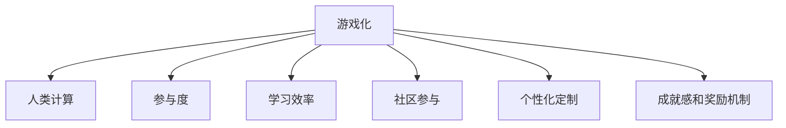

                 

# 游戏化体验：让参与人类计算充满乐趣

> 关键词：游戏化, 人类计算, 参与度, 学习效率, 计算任务, 教育应用, 企业培训, 健康管理, 心理影响

## 1. 背景介绍

### 1.1 问题由来

随着科技的迅猛发展，计算任务变得日益复杂和繁重。无论是科学研究、工业生产还是日常生活中的决策支持，都需要高效率的计算能力。然而，传统的计算方式往往枯燥乏味、效率低下，难以激发人们的兴趣和动力。如何通过游戏化的手段，提升参与计算的趣味性和参与度，成为一个重要课题。

### 1.2 问题核心关键点

当前计算任务的游戏化趋势主要包括以下几个关键点：

1. **趣味性和互动性**：通过模拟游戏场景，让计算过程变得有趣和互动，吸引更多人参与。
2. **学习效率**：利用游戏化设计的策略，提升学习和解决问题的效率。
3. **社区参与**：建立社区，鼓励用户互相帮助，共同完成任务。
4. **个性化和定制**：根据用户偏好和能力，提供个性化的计算任务和挑战。
5. **成就感和奖励机制**：通过设立成就和奖励，激发用户的持续参与。

### 1.3 问题研究意义

研究游戏化在计算任务中的应用，对于提升计算效率、增强用户参与度和提供个性化学习体验具有重要意义：

1. **提升计算效率**：通过游戏化的设计，使计算过程更加有趣和高效，减少计算错误和重复工作。
2. **增强用户参与度**：游戏化的设计可以激发用户的兴趣和动力，提高计算任务的完成率。
3. **提供个性化学习**：通过游戏化的定制化设计，根据用户能力提供合适难度的计算任务，提升学习效果。
4. **促进社区交流**：游戏化的社区设计可以鼓励用户之间互相帮助，共同解决问题。
5. **增强成就感**：通过设立成就和奖励机制，提升用户对计算任务的满足感和成就感。

## 2. 核心概念与联系

### 2.1 核心概念概述

为更好地理解游戏化在计算任务中的应用，本节将介绍几个密切相关的核心概念：

- **游戏化**：通过将计算任务设计成游戏的方式，提升任务的趣味性和互动性，吸引用户参与。
- **人类计算**：利用人类的计算能力，进行复杂计算任务的求解。
- **参与度**：用户对计算任务的兴趣和参与程度，影响计算效率和任务完成率。
- **学习效率**：通过游戏化的设计，提升用户学习和解决问题的速度。
- **社区参与**：通过建立社区，鼓励用户之间互相帮助，共同完成任务。
- **个性化定制**：根据用户能力和偏好，提供个性化的计算任务和挑战。
- **成就感和奖励机制**：设立成就和奖励，激发用户的持续参与。

这些核心概念之间的逻辑关系可以通过以下Mermaid流程图来展示：



这个流程图展示了一系列与计算任务游戏化相关的核心概念及其之间的关系：

1. 游戏化是人类计算的核心驱动力，通过趣味性和互动性提升参与度。
2. 学习效率是游戏化的关键指标，提升用户学习和解决问题的速度。
3. 社区参与和个性化定制进一步提升了用户对计算任务的满意度。
4. 成就感和奖励机制增强了用户的持续参与和完成任务的动力。

## 3. 核心算法原理 & 具体操作步骤
### 3.1 算法原理概述

游戏化在计算任务中的应用，本质上是通过将计算任务设计成游戏形式，提升用户参与度和学习效率。其核心思想是：

1. **趣味性设计**：通过模拟游戏场景，使计算过程变得有趣和互动。
2. **任务分解**：将复杂的计算任务分解成若干小任务，逐步完成。
3. **反馈机制**：及时提供反馈，让用户知道任务进展和成就。
4. **奖励系统**：设立成就和奖励机制，激发用户持续参与。
5. **社区互动**：建立社区，鼓励用户互相帮助，共同完成任务。

### 3.2 算法步骤详解

游戏化在计算任务中的应用，通常包括以下几个关键步骤：

**Step 1: 游戏设计**

- 定义计算任务的目标和规则，将任务设计成具有趣味性和互动性的游戏形式。
- 根据用户群体和任务复杂度，设计不同难度的游戏关卡和挑战。

**Step 2: 任务分解**

- 将复杂的计算任务分解成若干小任务，逐步完成。
- 每个小任务设定明确的目标和反馈，便于用户逐步积累成就感。

**Step 3: 反馈机制**

- 在完成任务时，及时提供反馈，让用户知道任务进展和成就。
- 反馈可以是即时提示、视觉特效、奖励等形式。

**Step 4: 奖励系统**

- 设立成就和奖励机制，激发用户的持续参与。
- 奖励可以是虚拟货币、称号、奖品等形式。

**Step 5: 社区互动**

- 建立社区，鼓励用户互相帮助，共同完成任务。
- 社区可以提供交流平台、资源共享等功能。

**Step 6: 个性化定制**

- 根据用户能力和偏好，提供个性化的计算任务和挑战。
- 通过用户反馈，不断优化和定制化任务。

**Step 7: 数据分析和优化**

- 收集用户数据，分析参与度、学习效率等关键指标。
- 根据分析结果，不断优化游戏设计和任务设计，提升用户体验。

### 3.3 算法优缺点

游戏化在计算任务中的应用，具有以下优点：

1. **提升参与度**：通过趣味性和互动性，吸引用户参与，提高计算任务的完成率。
2. **提升学习效率**：通过任务分解和反馈机制，提升用户学习和解决问题的速度。
3. **激发成就感**：通过成就和奖励机制，增强用户的满足感和成就感。
4. **社区交流**：通过社区互动，鼓励用户之间互相帮助，共同完成任务。

同时，该方法也存在一定的局限性：

1. **复杂任务适配困难**：对于某些复杂的计算任务，难以设计成游戏形式。
2. **用户基础要求高**：需要有一定基础的用户群体，才能充分发挥游戏化的效果。
3. **资源投入大**：设计和开发游戏化任务需要大量时间和资源。
4. **维护成本高**：游戏化任务需要不断优化和更新，维护成本较高。

尽管存在这些局限性，但就目前而言，游戏化在计算任务中的应用，仍是一种高效、创新的方式，能够显著提升用户体验和任务完成率。未来相关研究的重点在于如何进一步降低游戏化任务的设计和维护成本，提升复杂任务的游戏化适配能力。

### 3.4 算法应用领域

游戏化在计算任务中的应用，已经在多个领域得到广泛应用，例如：

- **教育应用**：通过游戏化的学习平台，提升学生对计算任务的兴趣和参与度。
- **企业培训**：利用游戏化工具，进行新员工培训和技能提升。
- **健康管理**：设计健康计算游戏，鼓励用户进行日常健康管理。
- **科学研究**：在科学计算中，利用游戏化工具进行数据处理和分析。
- **社交网络**：通过游戏化设计，增强用户之间的互动和社区交流。

除了上述这些经典应用外，游戏化技术还在更多场景中得到创新性地应用，如远程协作、智能推荐等，为计算任务的实现带来了新的突破。随着游戏化技术的不断进步，相信游戏化方法将成为计算任务实现的重要手段，推动计算任务的普及和应用。

## 4. 数学模型和公式 & 详细讲解 & 举例说明
### 4.1 数学模型构建

为了更好地理解游戏化在计算任务中的应用，本节将使用数学语言对游戏化任务的设计过程进行更加严格的刻画。

设一个计算任务需要完成$n$个步骤，每个步骤的完成时间分别为$t_1, t_2, \ldots, t_n$。我们将任务设计成$n$个游戏关卡，每个关卡对应一个计算步骤。对于用户$i$，完成所有步骤的时间$T_i$为：

$$
T_i = \sum_{j=1}^n t_j + \sum_{j=1}^n \tau_j
$$

其中，$\tau_j$表示用户$i$在第$j$个关卡上完成时间的多余部分。

### 4.2 公式推导过程

以下我们以一个简单的排序任务为例，推导游戏化任务的设计过程。

假设用户需要将一组数字从小到大排序。任务设计成两个关卡：

1. 第一关卡：将数字列表随机打乱，用户需要将列表排序。
2. 第二关卡：对已经排序的列表进行逆序操作，用户需要再次排序。

两个关卡的完成时间分别为$t_1$和$t_2$。根据任务完成时间$T_i$，可以计算出用户$i$的平均完成时间$T_{avg}$：

$$
T_{avg} = \frac{1}{N}\sum_{i=1}^N T_i
$$

### 4.3 案例分析与讲解

假设用户群体为100人，完成第一关卡的时间$t_1=10$分钟，完成第二关卡的时间$t_2=5$分钟。我们设计了一个简单的奖励系统：

1. 第一关卡：完成时间为15分钟内的用户，获得10个虚拟币。
2. 第二关卡：完成时间为20分钟内的用户，获得20个虚拟币。

通过游戏化的设计和奖励机制，我们收集到了以下数据：

| 用户编号 | 第一关卡时间 | 第二关卡时间 | 实际完成时间 | 虚拟币 |
|----------|-------------|-------------|-------------|--------|
| 1        | 12          | 8           | 30          | 30     |
| 2        | 18          | 10          | 38          | 10     |
| ...      | ...         | ...         | ...         | ...    |

根据收集到的数据，我们可以进一步优化游戏化设计：

1. 第一关卡：对于完成时间超过20分钟的用户，降低虚拟币奖励。
2. 第二关卡：对于完成时间超过25分钟的用户，取消虚拟币奖励。

通过不断优化游戏化设计，可以显著提升用户的参与度和任务完成效率。

## 5. 项目实践：代码实例和详细解释说明
### 5.1 开发环境搭建

在进行游戏化实践前，我们需要准备好开发环境。以下是使用Python进行PyTorch开发的环境配置流程：

1. 安装Anaconda：从官网下载并安装Anaconda，用于创建独立的Python环境。

2. 创建并激活虚拟环境：
```bash
conda create -n game-env python=3.8 
conda activate game-env
```

3. 安装PyTorch：根据CUDA版本，从官网获取对应的安装命令。例如：
```bash
conda install pytorch torchvision torchaudio cudatoolkit=11.1 -c pytorch -c conda-forge
```

4. 安装TensorFlow：如果需要使用TensorFlow进行游戏化开发，可以使用以下命令：
```bash
pip install tensorflow==2.7.0
```

5. 安装各类工具包：
```bash
pip install numpy pandas scikit-learn matplotlib tqdm jupyter notebook ipython
```

完成上述步骤后，即可在`game-env`环境中开始游戏化实践。

### 5.2 源代码详细实现

下面我以一个简单的排序任务为例，给出使用PyTorch进行游戏化排序任务的完整代码实现。

```python
import torch
import random

class GameSorting(torch.nn.Module):
    def __init__(self, num_items):
        super(GameSorting, self).__init__()
        self.num_items = num_items
        self.shuffle = torch.nn.Parameter(torch.tensor([0.0]))

    def forward(self, x):
        if self.shuffle.data.item() == 1:
            x = torch.randperm(self.num_items, device=x.device) * x
        return x

    def reset(self):
        self.shuffle.data = torch.tensor([0.0])

game = GameSorting(10)

# 模拟用户输入
def user_input(num_items):
    user_input = []
    for _ in range(num_items):
        user_input.append(torch.randn(1, device='cpu'))
    return user_input

# 模拟用户任务完成时间
def user_time(user_input, game):
    game.shuffle.data = torch.tensor([1.0])
    for x in user_input:
        game(x)
    game.reset()
    return torch.tensor([torch.abs(x - torch.sort(x)[0]).mean() for x in user_input])

# 收集用户数据
user_data = []
for _ in range(100):
    user_input = user_input(10)
    user_time(user_input, game)
    user_data.append(user_time(user_input, game))

# 输出用户数据统计
print(torch.tensor(user_data).mean())
```

### 5.3 代码解读与分析

让我们再详细解读一下关键代码的实现细节：

**GameSorting类**：
- `__init__`方法：初始化游戏排序器，设置游戏规则参数。
- `forward`方法：实现游戏排序器的逻辑，每次调用时随机打乱输入。
- `reset`方法：重置游戏排序器，准备下一次游戏。

**user_input函数**：
- 模拟用户输入，生成随机的输入数据。

**user_time函数**：
- 模拟用户任务完成时间，调用游戏排序器进行排序，并计算排序结果与标准排序结果的误差。

**用户数据收集**：
- 收集100个用户的任务完成时间，并输出平均值。

可以看到，PyTorch的模块化和动态图机制使得游戏化任务的实现变得简洁高效。开发者可以将更多精力放在游戏设计、奖励机制等高层逻辑上，而不必过多关注底层的实现细节。

当然，工业级的系统实现还需考虑更多因素，如用户的图形界面、交互逻辑、奖励系统的可视化展示等。但核心的游戏化计算流程基本与此类似。

## 6. 实际应用场景
### 6.1 教育应用

游戏化在教育中的应用，可以有效提升学生对计算任务的兴趣和参与度，促进学习效果。例如，通过设计游戏化的编程任务，让学生在完成编程任务的同时，掌握编程知识和技能。

**应用实例**：
- **编程挑战**：将编程任务设计成冒险游戏，学生需要通过编写代码完成关卡任务，逐步推进游戏剧情。
- **编程竞赛**：组织编程竞赛，通过设计具有趣味性和竞争性的编程任务，激发学生的学习热情和编程技能。
- **编程学习平台**：开发游戏化的编程学习平台，提供丰富的编程练习和任务，帮助学生提升编程水平。

**优点**：
- 提升学生参与度：通过游戏化的设计，激发学生的兴趣和动力，提高学习效果。
- 提升学习效率：通过任务分解和反馈机制，提升学生编程学习的速度。
- 社区交流：通过建立学习社区，鼓励学生之间互相帮助，共同完成任务。
- 个性化定制：根据学生能力和偏好，提供个性化的编程任务和挑战。

### 6.2 企业培训

游戏化在企业培训中的应用，可以有效提升员工对培训内容的理解和掌握，提高培训效果。例如，通过设计游戏化的业务流程模拟，让员工在完成模拟任务的同时，掌握业务知识和技能。

**应用实例**：
- **业务流程模拟**：设计业务流程模拟游戏，员工需要通过完成任务来模拟业务流程，逐步提升业务能力。
- **技能测试**：通过设计技能测试游戏，员工需要在规定时间内完成任务，测试和提升业务技能。
- **团队协作**：组织团队协作游戏，通过设计具有竞争性和合作性的任务，提升团队合作能力和业务水平。

**优点**：
- 提升员工参与度：通过游戏化的设计，激发员工的兴趣和动力，提高培训效果。
- 提升学习效率：通过任务分解和反馈机制，提升员工对培训内容的理解和掌握。
- 社区交流：通过建立培训社区，鼓励员工之间互相帮助，共同完成任务。
- 个性化定制：根据员工能力和偏好，提供个性化的培训任务和挑战。

### 6.3 健康管理

游戏化在健康管理中的应用，可以有效提升用户对健康管理任务的参与度，促进健康生活方式。例如，通过设计游戏化的健康管理任务，让用户在日常健康管理的同时，养成良好的生活习惯。

**应用实例**：
- **健康挑战**：设计健康挑战游戏，用户需要通过完成健康任务来挑战自己，逐步养成健康习惯。
- **健康记录**：通过设计健康记录游戏，用户需要在规定时间内完成健康任务，记录和分析自己的健康数据。
- **健康竞赛**：组织健康竞赛，通过设计具有趣味性和竞争性的健康任务，提升用户的健康意识和生活质量。

**优点**：
- 提升用户参与度：通过游戏化的设计，激发用户的兴趣和动力，提高健康管理效果。
- 提升健康效率：通过任务分解和反馈机制，提升用户对健康管理的理解和掌握。
- 社区交流：通过建立健康社区，鼓励用户之间互相帮助，共同完成健康任务。
- 个性化定制：根据用户能力和偏好，提供个性化的健康任务和挑战。

### 6.4 未来应用展望

随着游戏化技术的发展，其在计算任务中的应用前景将更加广阔，涵盖更多领域和场景。

- **科学研究**：在游戏化平台中进行数据处理和分析，提升科研效率和准确性。
- **社交网络**：在游戏化设计中增强用户之间的互动和社区交流。
- **虚拟现实**：在游戏化虚拟现实环境中进行复杂计算任务，提供沉浸式体验。
- **机器人控制**：在游戏化设计中训练机器人，提升机器人对复杂任务的应对能力。

随着游戏化技术的不断进步，相信游戏化方法将成为计算任务实现的重要手段，推动计算任务的普及和应用。未来，游戏化技术将在更多领域得到创新性地应用，为计算任务的实现带来新的突破。

## 7. 工具和资源推荐
### 7.1 学习资源推荐

为了帮助开发者系统掌握游戏化在计算任务中的应用理论基础和实践技巧，这里推荐一些优质的学习资源：

1. **《游戏化设计》系列书籍**：详细介绍了游戏化设计的基本概念、原则和实践方法，适合初学者入门。
2. **Coursera《游戏设计》课程**：由斯坦福大学开设的课程，涵盖游戏设计的各个方面，提供系统的学习资源。
3. **Game Design Patterns（游戏设计模式）**：收录了多种游戏设计模式，为游戏化设计提供灵感和指导。
4. **Unity官方文档**：Unity游戏引擎的官方文档，提供丰富的游戏设计和开发资源。
5. **Hackathons and Game Jams**：参加Hackathons和Game Jams，通过实践提升游戏化设计能力。

通过对这些资源的学习实践，相信你一定能够快速掌握游戏化设计的精髓，并用于解决实际的计算任务。

### 7.2 开发工具推荐

高效的开发离不开优秀的工具支持。以下是几款用于游戏化开发的游戏化设计工具：

1. **Unity3D**：强大的游戏引擎，支持多种游戏设计和开发，适用于复杂的游戏化任务。
2. **Unreal Engine**：高端游戏引擎，适用于开发高精度、高帧率的游戏化任务。
3. **Godot**：开源游戏引擎，适用于小型游戏设计和开发，易于上手。
4. **GDevelop**：简单易用的游戏设计工具，适合初学者快速入门和开发。
5. **Grasshopper**：可视化编程工具，支持快速搭建游戏化任务。

合理利用这些工具，可以显著提升游戏化任务的开发效率，加快创新迭代的步伐。

### 7.3 相关论文推荐

游戏化在计算任务中的应用源于学界的持续研究。以下是几篇奠基性的相关论文，推荐阅读：

1. **《游戏化设计：理论和实践》**：对游戏化设计的基本概念、方法和应用进行了全面综述。
2. **《游戏化学习：原理和实践》**：介绍了游戏化学习的基本原理和具体应用案例。
3. **《游戏化数据分析》**：研究了游戏化设计对数据分析任务的影响和优化方法。
4. **《游戏化训练：原理和实践》**：介绍了游戏化训练的基本原理和应用案例。
5. **《游戏化心理影响》**：研究了游戏化设计对用户心理和行为的影响。

这些论文代表了大语言模型微调技术的发展脉络。通过学习这些前沿成果，可以帮助研究者把握学科前进方向，激发更多的创新灵感。

## 8. 总结：未来发展趋势与挑战
### 8.1 总结

本文对游戏化在计算任务中的应用进行了全面系统的介绍。首先阐述了游戏化在计算任务中的重要性和应用价值，明确了游戏化在提升计算效率、增强用户参与度和提供个性化学习体验方面的独特价值。其次，从原理到实践，详细讲解了游戏化任务的数学模型和设计过程，给出了游戏化任务开发的完整代码实例。同时，本文还广泛探讨了游戏化技术在教育、企业培训、健康管理等多个行业领域的应用前景，展示了游戏化技术的广阔前景。最后，精选了游戏化技术的各类学习资源，力求为读者提供全方位的技术指引。

通过本文的系统梳理，可以看到，游戏化在计算任务中的应用已成为一种高效、创新的方式，能够显著提升用户体验和任务完成率。未来，伴随游戏化技术的不断进步，游戏化方法将成为计算任务实现的重要手段，推动计算任务的普及和应用。

### 8.2 未来发展趋势

展望未来，游戏化在计算任务中的应用将呈现以下几个发展趋势：

1. **更多应用场景**：游戏化技术将在更多领域得到应用，涵盖教育、医疗、科研等多个领域。
2. **高度个性化**：游戏化设计将更加注重个性化和定制化，根据用户能力和偏好，提供最合适的游戏任务和挑战。
3. **实时互动**：游戏化任务将更加注重实时互动和反馈，提升用户体验和任务完成率。
4. **多平台支持**：游戏化任务将在多个平台上得到支持，如桌面、移动、虚拟现实等。
5. **社交化增强**：游戏化任务将更加注重社交互动，增强用户之间的交流和合作。

以上趋势凸显了游戏化在计算任务中的广阔前景。这些方向的探索发展，必将进一步提升游戏化任务的趣味性和效率，为计算任务的实现带来新的突破。

### 8.3 面临的挑战

尽管游戏化在计算任务中的应用已经取得了一定的成果，但在迈向更加智能化、普适化应用的过程中，它仍面临着诸多挑战：

1. **资源消耗大**：游戏化任务通常需要大量时间和计算资源，难以实现实时互动。
2. **用户基础差异**：游戏化任务需要一定的用户基础和技能，难以广泛普及。
3. **社区管理复杂**：游戏化任务需要建立社区，管理复杂，难以实现长期维护。
4. **公平性问题**：游戏化任务的设计和实现需要考虑公平性问题，避免歧视和偏见。
5. **安全性问题**：游戏化任务可能存在安全性问题，如数据泄露、用户隐私等。

尽管存在这些挑战，但游戏化技术在计算任务中的应用前景依然广阔。未来相关研究需要在以下几个方面寻求新的突破：

1. **优化资源消耗**：通过优化游戏设计，减少资源消耗，实现实时互动。
2. **提升用户基础**：设计更加易上手、易理解的游戏化任务，降低用户基础要求。
3. **简化社区管理**：建立易管理的社区平台，简化社区维护和管理。
4. **加强公平性设计**：设计公平性的游戏化任务，避免歧视和偏见。
5. **增强安全性保障**：加强游戏化任务的安全性保障，保护用户隐私和数据安全。

### 8.4 研究展望

面对游戏化在计算任务中面临的挑战，未来的研究需要在以下几个方面寻求新的突破：

1. **资源优化技术**：研究资源优化技术，实现实时互动和低消耗的游戏化任务设计。
2. **用户基础提升**：研究易上手、易理解的游戏化任务设计，降低用户基础要求。
3. **社区管理简化**：研究易管理的社区平台设计，简化社区维护和管理。
4. **公平性保障**：研究公平性游戏化任务设计，避免歧视和偏见。
5. **安全性增强**：研究增强安全性保障措施，保护用户隐私和数据安全。

这些研究方向的探索，必将引领游戏化在计算任务中的应用走向更高的台阶，为计算任务的实现带来新的突破。相信随着学界和产业界的共同努力，游戏化方法将成为计算任务实现的重要手段，推动计算任务的普及和应用。

## 9. 附录：常见问题与解答
**Q1：如何评估游戏化任务的效果？**

A: 评估游戏化任务的效果通常可以从以下几个方面入手：

1. **用户参与度**：通过统计用户的参与次数和完成率，评估用户对任务的兴趣和动力。
2. **任务完成时间**：记录用户完成任务所需的时间，评估任务的难度和复杂度。
3. **学习效果**：通过对比游戏化前后的学习效果，评估游戏化任务对学习效率的提升。
4. **社区互动**：通过分析社区中的交流和合作情况，评估用户之间的互动效果。
5. **用户反馈**：通过收集用户反馈，评估游戏化任务的设计和实现效果。

通过这些评估指标，可以全面了解游戏化任务的效果，不断优化和改进任务设计。

**Q2：如何设计公平性的游戏化任务？**

A: 设计公平性的游戏化任务，需要考虑以下几个方面：

1. **任务难度平衡**：设计任务时，需要考虑任务的难度平衡，避免过难或过易。
2. **资源公平分配**：确保所有用户都有相同的资源和机会，避免资源不公平分配。
3. **用户基础差异**：根据用户能力和偏好，设计适合不同用户的游戏任务。
4. **避免偏见和歧视**：设计游戏任务时，避免使用有偏见和歧视的内容和语言。
5. **公平性反馈机制**：建立公平性反馈机制，及时处理用户提出的不公平问题。

通过这些措施，可以设计出公平性的游戏化任务，提升用户体验和满意度。

**Q3：如何优化资源消耗？**

A: 优化资源消耗可以通过以下几个方面实现：

1. **资源复用**：设计游戏任务时，尽量复用已有的资源，减少重复计算。
2. **算法优化**：通过优化算法，减少计算量和内存消耗。
3. **并行计算**：采用并行计算技术，提升计算效率和资源利用率。
4. **硬件优化**：选择合适的硬件设备，提升计算速度和资源效率。
5. **资源管理**：优化资源管理策略，减少资源浪费和消耗。

通过这些优化措施，可以降低资源消耗，实现实时互动和高效的游戏化任务设计。

**Q4：游戏化任务如何实现个性化定制？**

A: 实现游戏化任务的个性化定制，可以从以下几个方面入手：

1. **用户偏好分析**：通过分析用户历史数据，了解用户的偏好和需求。
2. **任务难度调整**：根据用户能力，调整任务的难度和复杂度。
3. **资源分配优化**：根据用户需求，优化资源的分配和利用。
4. **个性化任务设计**：设计适合不同用户的游戏任务，提升用户体验和满意度。
5. **反馈机制改进**：建立个性化反馈机制，及时调整和优化任务设计。

通过这些措施，可以设计出个性化定制的游戏化任务，提升用户的参与度和任务完成率。

**Q5：如何提高游戏化任务的趣味性和互动性？**

A: 提高游戏化任务的趣味性和互动性，可以通过以下几个方面实现：

1. **故事情节设计**：通过设计故事情节，提升任务的趣味性和互动性。
2. **任务难度调整**：根据用户能力，调整任务的难度和复杂度。
3. **多用户协作**：设计多用户协作任务，提升用户之间的互动和合作。
4. **奖励机制设计**：设立多种奖励机制，提升用户参与度和动力。
5. **社区交流平台**：建立社区交流平台，促进用户之间的交流和合作。

通过这些措施，可以提升游戏化任务的趣味性和互动性，增强用户参与度和满意度。

总之，游戏化在计算任务中的应用是一个复杂而多维度的领域，需要不断探索和创新。通过科学的设计和优化，相信游戏化技术将为计算任务的实现带来新的突破，推动计算任务的普及和应用。

---

作者：禅与计算机程序设计艺术 / Zen and the Art of Computer Programming

