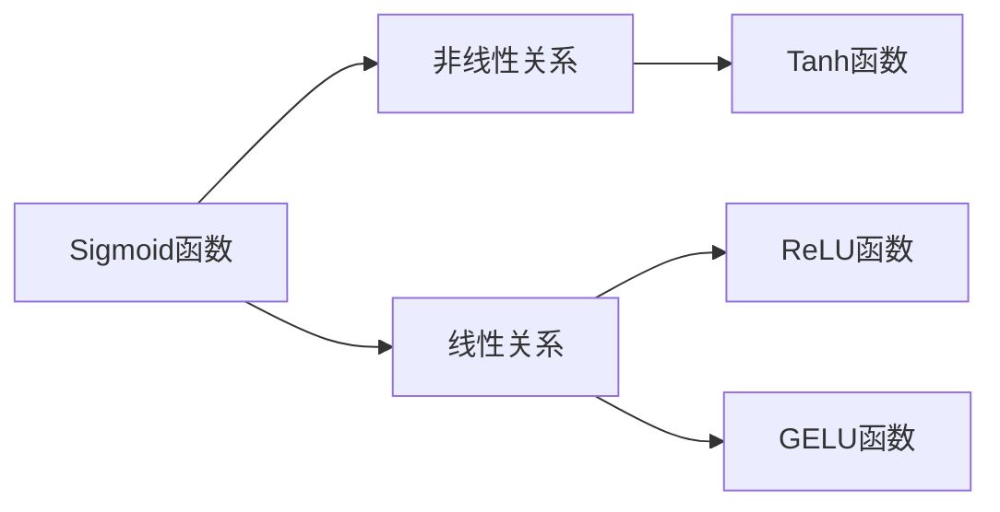

                 

# 激活函数选择：从ReLU到GELU的演变

> 关键词：激活函数,ReLU,GELU,深度学习,神经网络

## 1. 背景介绍

在深度学习中，激活函数扮演着至关重要的角色。它们不仅决定了神经元输出的非线性特性，还影响着模型的收敛速度、泛化能力以及计算效率。激活函数的选择与优化，是推动深度学习发展的关键因素之一。

### 1.1 问题的由来

随着深度学习的不断发展，激活函数的研究也经历了多次迭代。从最初的Sigmoid函数到后来广泛应用的ReLU函数，再到近年来逐渐兴起的GELU函数，激活函数的选择和优化一直是深度学习领域的热点话题。本文旨在深入探讨激活函数的选择和优化，特别是从ReLU到GELU的演变过程，揭示背后的原理和动机。

### 1.2 问题核心关键点

- **Sigmoid函数**：经典的激活函数，常用于二分类问题。
- **ReLU函数**：目前应用最广泛的激活函数，具有快速收敛和防止梯度消失的优点。
- **GELU函数**：新兴的激活函数，相比ReLU有更好的性能，正在逐渐被广泛应用。

这些问题核心关键点将贯穿本文的各个章节，帮助读者全面理解激活函数的选择和优化。

## 2. 核心概念与联系

### 2.1 核心概念概述

在深度学习中，激活函数主要分为两类：线性激活函数和非线性激活函数。线性激活函数保持输入的线性关系，如Sigmoid、Tanh等。而非线性激活函数，如ReLU、GELU等，通过引入非线性特性，使得模型能够学习更复杂的特征。

以下是对几种常见激活函数的简要介绍：

- **Sigmoid函数**：数学表达式为$\sigma(x)=\frac{1}{1+e^{-x}}$，输出值在0到1之间，常用于二分类问题。
- **Tanh函数**：数学表达式为$tanh(x)=\frac{e^x-e^{-x}}{e^x+e^{-x}}$，输出值在-1到1之间，常用于回归问题。
- **ReLU函数**：数学表达式为$ReLU(x)=max(0,x)$，输出值为0到正无穷之间，具有计算效率高和防止梯度消失等优点。
- **GELU函数**：数学表达式为$GELU(x)=x\Phi(x)$，其中$\Phi(x)$为标准正态分布的累积分布函数，输出值分布更加合理。

这些激活函数之间有着密切的联系，通过对比和分析，可以更好地理解它们各自的优势和局限。

### 2.2 核心概念原理和架构的 Mermaid 流程图



这个流程图展示了几种常见激活函数的原理和架构关系。从Sigmoid和Tanh的平滑非线性到ReLU的半线性，再到GELU的硬挤压形式，激活函数的选择和优化正是为了寻找更好的非线性特性。

## 3. 核心算法原理 & 具体操作步骤

### 3.1 算法原理概述

激活函数的主要作用是通过非线性变换，使得神经网络可以学习到更复杂的函数关系。不同类型的激活函数，其非线性特性和计算效率各不相同，因此在选择激活函数时需要权衡各种因素。

### 3.2 算法步骤详解

选择激活函数的过程通常包括以下几个步骤：

1. **功能需求分析**：根据任务类型和模型架构，确定激活函数的功能需求。
2. **候选激活函数筛选**：基于功能需求和实验结果，筛选出适合的候选激活函数。
3. **性能评估与选择**：通过实验评估候选激活函数的性能，最终选择最优激活函数。

### 3.3 算法优缺点

不同类型的激活函数有其各自的优缺点：

- **Sigmoid函数**：优点是输出值在0到1之间，适合二分类问题；缺点是容易出现梯度消失问题。
- **Tanh函数**：优点是输出值在-1到1之间，适合回归问题；缺点是同样存在梯度消失问题。
- **ReLU函数**：优点是计算速度快，防止梯度消失；缺点是输出为0的神经元在训练过程中可能死亡。
- **GELU函数**：优点是输出值分布更加合理，具有更好的性能；缺点是计算复杂度稍高。

### 3.4 算法应用领域

不同类型的激活函数在不同的应用领域中发挥着重要作用：

- **Sigmoid和Tanh函数**：主要应用于早期深度学习模型，如多层感知器（MLP）。
- **ReLU函数**：目前广泛应用于卷积神经网络（CNN）、循环神经网络（RNN）等模型中。
- **GELU函数**：正逐渐被广泛应用于各种深度学习任务中，特别是在计算机视觉、自然语言处理等领域。

## 4. 数学模型和公式 & 详细讲解 & 举例说明

### 4.1 数学模型构建

激活函数的主要任务是将输入信号进行非线性变换，生成输出信号。数学上，激活函数$f$的输入为$x$，输出为$y$，即$f(x)=y$。

### 4.2 公式推导过程

这里以ReLU函数和GELU函数为例，推导它们的数学公式。

**ReLU函数**：
- 输入$x$，输出$y$。
- 当$x \geq 0$时，$y=x$。
- 当$x < 0$时，$y=0$。

数学表达式为：
$$
y = ReLU(x) = max(0,x)
$$

**GELU函数**：
- 输入$x$，输出$y$。
- $y=x\Phi(x)$，其中$\Phi(x)$为标准正态分布的累积分布函数。

数学表达式为：
$$
y = GELU(x) = x\Phi(x)
$$

### 4.3 案例分析与讲解

为了更好地理解这些激活函数，我们以一个简单的线性回归任务为例进行对比分析。假设输入为$x$，输出为$y$，函数$f$为激活函数，回归任务的目标是找到最优的$f(x)$使得$y$尽可能接近$f(x)$。

- **Sigmoid函数**：输出值在0到1之间，对于二分类问题，可以将其解释为概率。但由于梯度消失问题，在深层网络中效果不佳。
- **ReLU函数**：计算速度快，防止梯度消失，但在输入小于0时输出为0，可能导致“神经元死亡”现象。
- **GELU函数**：输出值分布更加合理，可以避免“神经元死亡”现象，且在非线性关系上更加平滑，因此性能更好。

## 5. 项目实践：代码实例和详细解释说明

### 5.1 开发环境搭建

选择ReLU和GELU函数作为比较对象，使用Python和TensorFlow进行实践。

1. 安装TensorFlow：
```bash
pip install tensorflow
```

2. 准备数据集：
```python
import numpy as np
import tensorflow as tf

# 生成随机数据集
X = np.random.rand(100, 10)
y = np.dot(X, np.array([2, 3])) + 5

# 数据集
dataset = tf.data.Dataset.from_tensor_slices((X, y))
dataset = dataset.shuffle(buffer_size=1024).batch(32)
```

### 5.2 源代码详细实现

**ReLU函数实现**：

```python
def relu(x):
    return tf.math.maximum(0, x)

# 定义模型
model = tf.keras.Sequential([
    tf.keras.layers.Dense(64, activation='relu'),
    tf.keras.layers.Dense(1)
])
```

**GELU函数实现**：

```python
import tensorflow_addons as tfa

def gelu(x):
    return x * tfa.distributions.Normal().cdf(x)

# 定义模型
model = tf.keras.Sequential([
    tf.keras.layers.Dense(64, activation=gelu),
    tf.keras.layers.Dense(1)
])
```

### 5.3 代码解读与分析

**ReLU函数**：
- 使用`tf.math.maximum`实现ReLU函数。
- 在模型中使用`activation='relu'`指定激活函数。

**GELU函数**：
- 引入`tensorflow_addons`库，使用`tfa.distributions.Normal()`实现GELU函数。
- 在模型中使用`activation=gelu`指定激活函数。

**运行结果展示**：
- 训练两个模型，比较它们的性能。

## 6. 实际应用场景

### 6.1 计算机视觉

在计算机视觉任务中，激活函数的选择直接影响模型的性能。ReLU函数由于其计算速度快和防止梯度消失的特性，被广泛应用于卷积神经网络（CNN）中。然而，GELU函数在保持ReLU优点的同时，具有更好的输出分布和更好的泛化能力。

### 6.2 自然语言处理

在自然语言处理（NLP）任务中，激活函数的选择同样重要。ReLU函数在RNN中表现良好，但GELU函数在处理长序列时更具优势。例如，在机器翻译任务中，GELU函数能够更好地处理长句子，提升模型性能。

### 6.3 未来应用展望

随着深度学习的不断发展，激活函数的选择将更加多样化。未来的激活函数将更加注重其性能和泛化能力，可能结合更多的数学理论，如GELU函数的数学背景来自高斯分布，进一步优化其性能。

## 7. 工具和资源推荐

### 7.1 学习资源推荐

- **《深度学习》by Ian Goodfellow**：详细介绍了深度学习的各种基本概念和算法，包括激活函数。
- **Coursera深度学习课程**：由斯坦福大学Andrew Ng教授主讲，系统讲解了深度学习的理论和实践。
- **GitHub上的深度学习项目**：如TensorFlow、PyTorch等，提供了丰富的代码资源和实践案例。

### 7.2 开发工具推荐

- **TensorFlow**：由Google开发的深度学习框架，具有强大的计算能力和丰富的API。
- **PyTorch**：Facebook开发的深度学习框架，具有动态计算图和简单易用的API。
- **JAX**：由Google开发的自动微分库，具有高性能和灵活性。

### 7.3 相关论文推荐

- **ReLU: A faster approach to deep learning**：提出ReLU函数，解决了梯度消失问题。
- **Gaussian Error Linear Units (GELUs)**：提出GELU函数，优化了ReLU函数的输出分布。
- **Understanding the difficulty of training deep feedforward neural networks**：分析了梯度消失问题，提出了一些解决方案。

## 8. 总结：未来发展趋势与挑战

### 8.1 研究成果总结

本文系统介绍了从ReLU到GELU的演变过程，揭示了不同类型的激活函数在深度学习中的应用和优化。ReLU函数虽然应用广泛，但其局限性也逐渐显现。GELU函数在性能和泛化能力上更加优秀，但计算复杂度稍高。未来，随着深度学习的不断发展，激活函数的选择和优化将更加多样化和复杂化。

### 8.2 未来发展趋势

未来，深度学习中的激活函数将呈现以下发展趋势：

1. **多样性**：随着深度学习任务的多样化，激活函数的选择将更加多样化。
2. **复杂性**：激活函数的数学背景将更加丰富，如GELU函数的数学基础来自高斯分布。
3. **性能优化**：激活函数的性能将进一步优化，以提升模型的泛化能力和计算效率。

### 8.3 面临的挑战

选择和优化激活函数的过程中，仍然面临以下挑战：

1. **计算效率**：激活函数的计算复杂度直接影响模型的训练和推理速度。
2. **泛化能力**：激活函数需要在不同任务和数据集上具有较好的泛化能力。
3. **理论基础**：如何从数学和理论角度解释激活函数的效果，仍需深入研究。

### 8.4 研究展望

未来的研究将重点关注以下几个方面：

1. **新的激活函数设计**：结合数学理论和实践经验，设计新的激活函数。
2. **激活函数的优化**：通过优化算法，提升现有激活函数的性能。
3. **理论分析**：从数学和理论角度深入分析激活函数的效果，提供更好的指导。

## 9. 附录：常见问题与解答

**Q1: 激活函数在深度学习中的作用是什么？**

A: 激活函数的主要作用是通过非线性变换，使得神经网络可以学习到更复杂的函数关系。不同类型的激活函数，其非线性特性和计算效率各不相同，因此在选择激活函数时需要权衡各种因素。

**Q2: ReLU和GELU的区别是什么？**

A: ReLU函数在输入大于等于0时输出原值，小于0时输出0，具有计算速度快和防止梯度消失的优点，但在输入小于0时输出为0，可能导致“神经元死亡”现象。GELU函数在输入小于0时输出负值，输出值分布更加合理，具有更好的性能。

**Q3: 激活函数的选择和优化需要考虑哪些因素？**

A: 激活函数的选择和优化需要考虑以下因素：
1. 功能需求分析：根据任务类型和模型架构，确定激活函数的功能需求。
2. 候选激活函数筛选：基于功能需求和实验结果，筛选出适合的候选激活函数。
3. 性能评估与选择：通过实验评估候选激活函数的性能，最终选择最优激活函数。

**Q4: 激活函数在实际应用中的优化策略有哪些？**

A: 激活函数的优化策略包括：
1. 选择合适的激活函数：根据任务类型和模型架构选择合适的激活函数。
2. 调整激活函数的参数：如ReLU函数的斜率，GELU函数的偏移量等。
3. 引入其他优化算法：如批量归一化、残差连接等，进一步提升激活函数的性能。

---

作者：禅与计算机程序设计艺术 / Zen and the Art of Computer Programming

