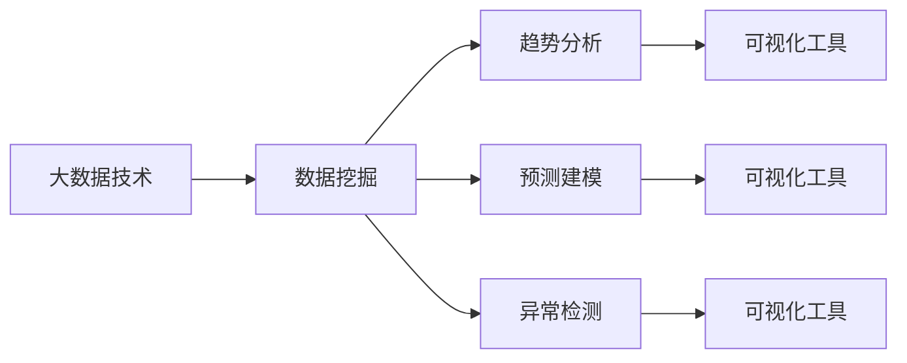

                 

# 理解洞察力的价值：在商业领域的应用实践

在快速发展的商业世界中，洞察力作为一种宝贵资产，已经变得越来越重要。深入理解商业洞察力，不仅能够提升企业的决策质量，还能为企业的竞争优势奠定坚实的基础。本文将深入探讨商业洞察力的价值，并结合实际案例分析，展示如何通过技术手段有效应用和实践商业洞察力。

## 1. 背景介绍

### 1.1 问题由来

在数字化时代，海量数据不断涌现，为企业提供了丰富的信息来源。然而，如何在浩如烟海的数据中提取有价值的洞察，成为摆在企业面前的重要挑战。以往依赖人工分析和经验积累的方式，已无法满足企业对决策速度和准确性的需求。因此，如何利用技术手段提升商业洞察力，成为当下商业领域的热点话题。

### 1.2 问题核心关键点

商业洞察力是指通过对数据进行分析和挖掘，发现潜在的规律、趋势和机会，为企业制定更为科学合理的决策提供支持。主要包括以下几个核心要素：

- **数据挖掘**：从海量数据中提取有价值的信息和知识。
- **趋势分析**：识别数据中的长期趋势和周期性规律。
- **预测建模**：基于历史数据构建模型，预测未来趋势。
- **异常检测**：识别异常数据点，发现潜在问题。
- **可视化展示**：将分析结果以图形化方式展示，便于理解。

这些核心要素构成了一个完整的商业洞察力体系，是企业提升竞争力的重要工具。

## 2. 核心概念与联系

### 2.1 核心概念概述

为了更好地理解商业洞察力，我们首先需要了解以下几个关键概念：

- **大数据技术**：指通过收集、存储、处理和分析海量数据的技术体系，包括数据采集、数据存储、数据处理和数据分析等环节。
- **数据挖掘**：从大规模数据集中发现有用信息、模式和知识的过程。
- **预测建模**：通过建立数学模型来预测未来趋势，包括时间序列分析、回归分析、分类分析等方法。
- **可视化工具**：将数据分析结果以图形化形式展示，便于直观理解。

这些概念之间的联系可以通过以下Mermaid流程图展示：



这个流程图展示了大数据技术在商业洞察力中的重要作用，以及数据挖掘、趋势分析、预测建模和异常检测等核心步骤。最后，通过可视化工具将分析结果呈现出来，实现洞察力的应用。

## 3. 核心算法原理 & 具体操作步骤

### 3.1 算法原理概述

商业洞察力的实现基于数据挖掘和数据分析等技术，其核心算法原理包括：

- **聚类算法**：如K-means、层次聚类等，将数据分组，发现数据的内在结构。
- **分类算法**：如决策树、支持向量机、神经网络等，基于历史数据预测分类结果。
- **回归算法**：如线性回归、多项式回归、岭回归等，用于预测数值型变量。
- **异常检测算法**：如孤立森林、局部离群因子等，识别数据中的异常点。

这些算法通过数学模型将数据转化为有意义的洞察，为商业决策提供依据。

### 3.2 算法步骤详解

基于上述算法原理，商业洞察力的实现步骤通常包括：

1. **数据采集**：通过API接口、爬虫等方式，从各种数据源（如社交媒体、电商平台、公共数据集等）获取数据。
2. **数据清洗**：处理缺失值、异常值、重复值等，确保数据质量。
3. **特征工程**：提取、选择和转换数据特征，提升模型性能。
4. **模型构建**：选择合适的算法，建立预测或分类模型。
5. **模型评估**：通过交叉验证等方法，评估模型性能，选择最佳模型。
6. **结果可视化**：使用可视化工具，展示分析结果，支持决策。

以下是一个基于Python的商业洞察力实现示例，包括数据采集、数据清洗、特征工程、模型构建和结果可视化等步骤。

### 3.3 算法优缺点

商业洞察力算法具有以下优点：

- **自动化和效率高**：通过算法自动化处理数据，显著提升了数据挖掘和分析的效率。
- **精度高**：现代算法可以处理复杂数据，提供高精度的分析结果。
- **可解释性强**：许多算法能够提供模型的内部机制和关键特征，帮助理解分析结果。

同时，这些算法也存在以下缺点：

- **复杂度高**：模型构建和优化过程相对复杂，需要专业知识支持。
- **数据质量要求高**：数据清洗和特征工程需要高质量数据作为基础。
- **结果解释难度大**：复杂模型往往难以解释，存在"黑箱"问题。

## 4. 数学模型和公式 & 详细讲解 & 举例说明

### 4.1 数学模型构建

商业洞察力的数学模型主要基于统计学、机器学习等领域的经典方法。以下以回归模型为例，展示商业洞察力的数学模型构建过程。

假设我们有n个历史销售数据$(X_1, Y_1), ..., (X_n, Y_n)$，其中$X$为自变量，$Y$为因变量。我们的目标是通过回归模型预测未来的销售趋势，即$Y_{new}$。

### 4.2 公式推导过程

回归模型的基本假设为$Y = \beta_0 + \beta_1 X_1 + ... + \beta_k X_k + \epsilon$，其中$\beta_0, ..., \beta_k$为模型参数，$\epsilon$为误差项。

通过最小二乘法，我们求解模型参数：

$$
\hat{\beta} = (X^T X)^{-1} X^T Y
$$

得到模型为：

$$
\hat{Y} = \hat{\beta}_0 + \hat{\beta}_1 X_1 + ... + \hat{\beta}_k X_k
$$

### 4.3 案例分析与讲解

假设我们是一家电商企业，需要预测下个月的销售额。我们收集了过去一年的销售数据，包括日期、销售额、促销活动、节假日等变量。通过构建回归模型，我们能够找到销售额与促销活动、节假日之间的关系，并预测下个月的销售额。

## 5. 项目实践：代码实例和详细解释说明

### 5.1 开发环境搭建

为了实现商业洞察力，我们需要搭建一个Python开发环境。以下是搭建Python环境的步骤：

1. 安装Python：从官网下载并安装Python，建议使用Anaconda发行版，方便管理依赖包。
2. 安装依赖包：使用pip安装必要的依赖包，如NumPy、Pandas、Scikit-learn等。

### 5.2 源代码详细实现

以下是一个基于Python的回归模型实现示例，展示了数据预处理、模型构建和结果可视化的全过程。

```python
import pandas as pd
import numpy as np
from sklearn.linear_model import LinearRegression
from sklearn.model_selection import train_test_split
import matplotlib.pyplot as plt

# 读取数据
data = pd.read_csv('sales_data.csv')

# 数据预处理
data['date'] = pd.to_datetime(data['date'])
X = data[['促销活动', '节假日', '季节性特征']]
Y = data['sales']

# 划分训练集和测试集
X_train, X_test, Y_train, Y_test = train_test_split(X, Y, test_size=0.2, random_state=42)

# 构建模型
model = LinearRegression()
model.fit(X_train, Y_train)

# 预测并评估模型
Y_pred = model.predict(X_test)

# 可视化结果
plt.scatter(X_test, Y_test, color='blue', label='Actual Sales')
plt.scatter(X_test, Y_pred, color='red', label='Predicted Sales')
plt.legend()
plt.show()
```

### 5.3 代码解读与分析

上述代码展示了从数据读取、预处理、模型构建到结果可视化的全过程。具体解读如下：

- 数据读取：使用Pandas库读取数据集，构建数据框。
- 数据预处理：将日期转换为Pandas的Datetime对象，便于时间序列分析。
- 数据划分：使用train_test_split函数划分训练集和测试集。
- 模型构建：使用LinearRegression类构建线性回归模型，并进行训练。
- 预测和评估：使用predict函数进行预测，并计算误差。
- 结果可视化：使用Matplotlib库绘制实际销售与预测销售的散点图。

## 6. 实际应用场景

### 6.1 电商平台销售预测

电商平台通过销售数据预测未来销售趋势，有助于优化库存管理和营销策略。通过回归模型和趋势分析，企业可以准确预测未来的销售量和趋势，制定更为科学的库存采购和促销活动计划。

### 6.2 金融风险管理

金融机构通过分析用户历史交易数据，识别潜在的风险点和欺诈行为，有助于提升风控水平和用户体验。通过分类算法和异常检测，金融机构可以构建风险预测模型，识别高风险用户，进行针对性的风险管理。

### 6.3 供应链管理

供应链企业通过数据分析，优化供应链流程和库存管理，提升运营效率和成本控制。通过聚类分析和回归模型，企业可以发现供应链中的瓶颈和优化机会，进行合理调整。

### 6.4 未来应用展望

未来，商业洞察力将在更多领域得到广泛应用，为企业的决策提供更为科学的依据。例如：

- **健康医疗**：通过数据分析，提升疾病预测和预防能力，为患者提供更个性化的诊疗方案。
- **智能制造**：通过大数据分析，优化生产流程，提高生产效率和产品质量。
- **智能交通**：通过交通数据挖掘，优化交通管理，提高道路通行效率和安全性。

## 7. 工具和资源推荐

### 7.1 学习资源推荐

为了帮助开发者深入理解商业洞察力的实现，我们推荐以下学习资源：

1. **《Python数据分析与可视化》**：详细介绍了Python在数据分析和可视化方面的应用，适合初学者入门。
2. **《机器学习实战》**：介绍了机器学习的基本原理和算法实现，适合实战操作。
3. **《深度学习》**：由Ian Goodfellow等著，深入探讨深度学习在商业领域的应用，适合进阶学习。
4. **Kaggle**：提供丰富的数据分析和机器学习竞赛，通过实战项目提升技能。
5. **Coursera**：提供多门商业洞察力和数据分析相关的课程，如斯坦福大学的《Data Science and Machine Learning》。

### 7.2 开发工具推荐

以下是几个常用的商业洞察力开发工具：

1. **Jupyter Notebook**：开源的交互式笔记本，适合数据分析和可视化。
2. **Python IDE**：如PyCharm、Visual Studio Code等，提供丰富的开发环境和调试工具。
3. **Data Visualization Tools**：如Matplotlib、Seaborn、Plotly等，方便可视化展示分析结果。
4. **Database Tools**：如MySQL、MongoDB等，用于存储和管理数据。

### 7.3 相关论文推荐

以下几篇论文深入探讨了商业洞察力的实现方法和应用场景：

1. **《A Survey of Data Mining Techniques for Business Intelligence》**：总结了商业智能领域的数据挖掘技术。
2. **《Data Mining for Customer Segmentation and Targeted Marketing》**：介绍了客户细分和精准营销的数据挖掘方法。
3. **《Predictive Analytics: The Power to Forecast and Preserve the Past》**：探讨了预测分析在商业洞察力中的应用。
4. **《Big Data Analytics in Marketing: Methodologies and Applications》**：介绍了大数据在市场营销中的应用。

## 8. 总结：未来发展趋势与挑战

### 8.1 总结

本文详细探讨了商业洞察力的价值和实现方法，并结合实际案例分析，展示了商业洞察力在各个领域的广泛应用。通过数据挖掘和数据分析，企业可以提取有价值的信息，提升决策质量。未来，商业洞察力将继续在更多领域发挥重要作用，成为企业竞争力的重要组成部分。

### 8.2 未来发展趋势

展望未来，商业洞察力将呈现以下几个发展趋势：

1. **人工智能和机器学习技术的普及**：随着AI技术的进步，商业洞察力将更加自动化和智能化。
2. **大数据技术的不断发展**：更多的数据源和数据处理技术将支持更全面、更深入的数据分析。
3. **实时分析和预测**：实时数据分析和预测将成为常态，提升企业决策的及时性和精准性。
4. **跨领域融合**：商业洞察力将与其他领域技术（如区块链、物联网等）深度融合，拓展更多应用场景。

### 8.3 面临的挑战

尽管商业洞察力在企业决策中发挥了重要作用，但也面临以下挑战：

1. **数据质量**：高质量数据的获取和处理是商业洞察力的基础，数据质量问题影响分析结果的准确性。
2. **技术复杂性**：商业洞察力涉及多种算法和技术，需要综合运用，技术实现难度较大。
3. **数据隐私和安全**：企业需处理大量敏感数据，数据隐私和安全问题需高度重视。
4. **结果解释性**：复杂的模型难以解释，缺乏透明性和可解释性。

### 8.4 研究展望

未来，商业洞察力的研究需要在以下几个方面取得突破：

1. **数据治理**：建立完善的数据治理体系，确保数据质量和数据安全。
2. **模型简化**：研究更加简洁、易于解释的模型，提升模型透明性和可解释性。
3. **跨领域应用**：探索商业洞察力与其他领域技术的融合，拓展应用场景。
4. **实时分析**：研究实时数据分析和预测技术，提升决策效率。

## 9. 附录：常见问题与解答

**Q1: 如何确保数据质量？**

A: 数据质量是商业洞察力的基础，以下是一些保障数据质量的方法：

- **数据清洗**：处理缺失值、异常值和重复值，确保数据完整性和一致性。
- **数据标准化**：使用统一的格式和标准，避免数据不一致性。
- **数据验证**：通过交叉验证和数据抽样，检测数据错误和异常。

**Q2: 如何选择适当的算法？**

A: 选择适当的算法需要考虑以下几个方面：

- **任务类型**：根据任务是分类、回归还是聚类，选择合适的算法。
- **数据特征**：分析数据特征，选择适合的算法。
- **模型复杂度**：考虑模型的复杂度和计算资源，选择性能最优的算法。

**Q3: 如何解释商业洞察力模型？**

A: 模型解释性是商业洞察力的重要考虑因素。以下是一些提升模型解释性的方法：

- **模型可视化**：使用图表和图形展示模型结构和关键特征。
- **特征重要性**：通过特征重要性分析，识别模型中关键特征。
- **部分可解释模型**：选择可解释性较强的模型，如决策树和线性回归。

**Q4: 如何应对数据隐私和安全问题？**

A: 数据隐私和安全是商业洞察力的重要保障，以下是一些应对方法：

- **数据匿名化**：对数据进行匿名化处理，保护用户隐私。
- **访问控制**：设置严格的访问控制，确保数据仅被授权人员访问。
- **加密技术**：使用加密技术保护数据传输和存储安全。

**Q5: 商业洞察力技术如何在企业中落地？**

A: 商业洞察力技术的落地需要考虑以下几个方面：

- **技术栈选择**：根据企业需求和技术栈选择适当的技术工具和框架。
- **团队建设**：组建专业团队，培训相关技能和知识。
- **项目规划**：制定详细的项目规划和实施计划。

通过不断优化和改进，商业洞察力技术将在更多企业中得到应用，为企业决策提供更为科学的依据，推动企业持续创新和发展。

---

作者：禅与计算机程序设计艺术 / Zen and the Art of Computer Programming

