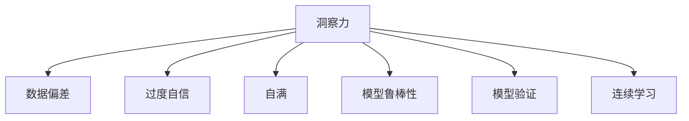

                 

# 理解洞察力的局限性：避免过度自信和自满

> 关键词：洞察力, 数据偏差, 过度自信, 自满, 机器学习, 模型鲁棒性, 模型验证, 连续学习

## 1. 背景介绍

### 1.1 问题由来
在数据驱动的现代科技世界中，洞察力（Insight）成为了各行各业决策和创新不可或缺的要素。无论是金融市场的预测、医疗诊断的辅助，还是电商的个性化推荐，洞察力都是模型决策的基石。然而，尽管洞察力对于决策至关重要，但它并不是万能的。

洞察力本质上是对数据和模型结果的深刻理解。在数据分析和模型训练中，洞察力能帮助我们把握数据背后的模式、趋势和异常，指导我们进行有效的决策。但现实情况是，洞察力的获取并非总是简单直观的。特别是在模型和数据复杂性日益增加的今天，洞察力的局限性开始显现。过度自信和自满成为了制约洞察力应用和模型效果提升的重大障碍。

### 1.2 问题核心关键点
洞察力在现代科技应用中面临着以下几个核心问题：

- 数据偏差（Data Bias）：在构建模型时，数据集的偏差可能导致洞察力产生误导。例如，训练数据中的样本不均衡、数据分布偏差等，都可能使模型误判。
- 过度自信（Overconfidence）：在模型训练过程中，过度自信可能导致训练停止过早，未能充分利用数据提升洞察力。同时，过度自信还可能导致忽略模型的不足和风险。
- 自满（Complacency）：在模型部署后，自满可能导致忽视模型性能的持续监测和优化，降低洞察力的时效性。
- 模型鲁棒性（Model Robustness）：洞察力是否能够应对不同场景和数据分布的变动，直接影响模型的鲁棒性。
- 模型验证（Model Validation）：洞察力是否通过有效的验证，确保模型在真实环境中的效果，是检验洞察力准确性的关键。
- 连续学习（Continual Learning）：洞察力是否能够持续更新和迭代，适应数据分布的变化，是提升模型性能的必由之路。

这些核心问题围绕着洞察力的构建、验证和应用，形成了当下科技应用中的主要挑战。本文旨在通过分析这些核心问题，提出一系列优化洞察力获取和应用的方法，帮助开发者更好地构建和应用模型。

## 2. 核心概念与联系

### 2.1 核心概念概述

为更好地理解洞察力的局限性，本节将介绍几个密切相关的核心概念：

- 洞察力（Insight）：通过数据分析和模型训练得到的对数据和结果的深刻理解，指导决策和创新。
- 数据偏差（Data Bias）：数据集中的样本不均衡、数据分布偏差等问题，可能导致洞察力产生误导。
- 过度自信（Overconfidence）：在模型训练和验证过程中，对模型的性能和稳定性过度信任，可能限制模型性能的提升。
- 自满（Complacency）：在模型部署后，对模型的性能和效果过度信任，忽视模型性能的持续监测和优化。
- 模型鲁棒性（Model Robustness）：模型应对不同场景和数据分布的变动能力，直接影响模型的泛化性能。
- 模型验证（Model Validation）：通过独立于训练集的验证集对模型进行测试，确保模型在真实环境中的效果。
- 连续学习（Continual Learning）：模型能够持续从新数据中学习，更新和迭代，适应数据分布的变化。

这些核心概念之间的逻辑关系可以通过以下Mermaid流程图来展示：



这个流程图展示了大数据应用中的核心概念及其之间的关系：

1. 洞察力是基于数据和模型构建的决策要素。
2. 数据偏差可能干扰洞察力的准确性。
3. 过度自信和自满可能限制洞察力的获取和应用。
4. 模型鲁棒性确保洞察力的泛化能力。
5. 模型验证检验洞察力的准确性。
6. 连续学习提升洞察力的时效性和稳定性。

## 3. 核心算法原理 & 具体操作步骤
### 3.1 算法原理概述

在数据驱动的决策和创新中，洞察力通常由模型训练产生。通过大数据分析，模型学习数据中的模式和趋势，从而形成洞察力。模型训练和验证的过程需要严格控制，避免过度自信和自满，以确保洞察力的准确性和稳定性。

洞察力获取的算法原理主要包括：

- 数据预处理：清洗和处理原始数据，去除异常和噪声，确保数据的准确性和代表性。
- 模型训练：通过训练数据，构建和优化模型，形成洞察力。
- 模型验证：通过独立的验证数据集，测试模型的泛化能力，确保洞察力的准确性。
- 连续学习：通过持续的数据收集和模型更新，提升洞察力的时效性和稳定性。

这些步骤共同构成了洞察力获取和应用的核心流程。

### 3.2 算法步骤详解

洞察力获取的算法步骤包括以下几个关键环节：

**Step 1: 数据准备与预处理**

- 收集和清洗数据：选择有代表性的数据集，清洗和处理数据，去除异常和噪声，确保数据的准确性和代表性。
- 数据划分：将数据划分为训练集、验证集和测试集，保证模型在不同数据集上的泛化能力。
- 特征工程：提取和构建数据特征，选择合适的特征，提升模型性能。

**Step 2: 模型训练与验证**

- 选择合适的模型：根据任务需求和数据特点，选择合适的机器学习模型。
- 模型训练：使用训练数据集对模型进行训练，不断调整模型参数，形成洞察力。
- 模型验证：使用验证数据集对模型进行测试，评估模型性能，防止过拟合。
- 超参数调优：通过交叉验证等方法，调整模型超参数，提升模型效果。

**Step 3: 模型应用与监测**

- 模型部署：将模型部署到实际应用中，形成洞察力的决策和推荐。
- 模型监测：持续监测模型性能，防止模型性能退化。
- 数据更新：定期更新训练数据，提升模型性能。
- 模型迭代：根据最新数据，迭代更新模型，提升模型效果。

### 3.3 算法优缺点

洞察力获取算法具有以下优点：

- 准确性：通过严格的模型训练和验证，洞察力的准确性较高。
- 泛化能力：通过数据预处理和模型优化，洞察力的泛化能力较强，能够应对不同场景和数据分布的变化。
- 时效性：通过连续学习和模型更新，洞察力能够持续适应数据分布的变化，保持时效性。

但同时，也存在以下缺点：

- 数据依赖：洞察力高度依赖数据质量和数据分布，数据偏差可能导致洞察力误导。
- 计算资源：构建和优化模型需要大量的计算资源和时间，可能存在计算瓶颈。
- 模型复杂性：复杂的模型可能难以解释，降低洞察力的可解释性。

### 3.4 算法应用领域

洞察力获取算法在以下领域得到广泛应用：

- 金融预测：通过洞察力分析，进行市场预测和投资决策。
- 医疗诊断：通过洞察力分析，辅助医生进行疾病诊断和治疗。
- 电商推荐：通过洞察力分析，进行个性化推荐，提升用户体验。
- 智能客服：通过洞察力分析，提供智能客服解决方案，提升客户满意度。
- 智能制造：通过洞察力分析，优化生产流程，提高生产效率。
- 智能交通：通过洞察力分析，优化交通流量，提高交通效率。

## 4. 数学模型和公式 & 详细讲解  
### 4.1 数学模型构建

本节将使用数学语言对洞察力获取算法的核心步骤进行严格的刻画。

设训练数据集为 $D=\{(x_i,y_i)\}_{i=1}^N, x_i \in \mathcal{X}, y_i \in \mathcal{Y}$，其中 $\mathcal{X}$ 为输入空间，$\mathcal{Y}$ 为输出空间。假设训练出的模型为 $M_{\theta}$，其中 $\theta$ 为模型参数。

洞察力获取的数学模型构建主要包括以下几个步骤：

1. 数据预处理：将原始数据 $x$ 转化为模型输入 $x'$，去除噪声和异常值，得到训练集 $D'=\{(x_i',y_i)\}_{i=1}^N$。
2. 模型训练：使用训练集 $D'$ 对模型 $M_{\theta}$ 进行训练，最小化损失函数 $\mathcal{L}(\theta)$。
3. 模型验证：使用验证集 $D^{\text{valid}}$ 对模型 $M_{\theta}$ 进行测试，评估模型性能。
4. 连续学习：使用新数据 $D^{\text{new}}$ 对模型 $M_{\theta}$ 进行更新，提升模型效果。

**公式推导过程**

在模型训练过程中，通过最小化损失函数 $\mathcal{L}(\theta)$ 来更新模型参数：

$$
\theta = \mathop{\arg\min}_{\theta} \mathcal{L}(\theta)
$$

其中 $\mathcal{L}(\theta)$ 为损失函数，通常为交叉熵损失、均方误差损失等。

在模型验证过程中，使用验证集 $D^{\text{valid}}$ 对模型 $M_{\theta}$ 进行测试，评估模型性能：

$$
\text{Error}_{\text{valid}}(M_{\theta}) = \frac{1}{N^{\text{valid}}} \sum_{i=1}^{N^{\text{valid}}} \mathbb{1}(M_{\theta}(x_i) \neq y_i)
$$

其中 $\mathbb{1}$ 为示性函数，$\text{Error}_{\text{valid}}(M_{\theta})$ 为模型在验证集上的错误率。

在连续学习过程中，使用新数据 $D^{\text{new}}$ 对模型 $M_{\theta}$ 进行更新，提升模型效果：

$$
\theta = \theta - \eta \nabla_{\theta}\mathcal{L}(\theta)
$$

其中 $\eta$ 为学习率，$\nabla_{\theta}\mathcal{L}(\theta)$ 为损失函数对模型参数的梯度。

### 4.3 案例分析与讲解

以金融市场的预测为例，洞察力获取的算法步骤如下：

**数据预处理**

- 收集历史市场数据，包括股票价格、交易量、新闻报道等。
- 清洗和处理数据，去除异常值和噪声，得到训练集 $D'=\{(x_i',y_i)\}_{i=1}^N$，其中 $x_i'$ 为市场特征，$y_i$ 为市场趋势。

**模型训练**

- 选择适当的机器学习模型，如线性回归、决策树、深度神经网络等。
- 使用训练集 $D'$ 对模型 $M_{\theta}$ 进行训练，最小化损失函数 $\mathcal{L}(\theta)$。

**模型验证**

- 使用验证集 $D^{\text{valid}}$ 对模型 $M_{\theta}$ 进行测试，评估模型性能。
- 使用误差率 $\text{Error}_{\text{valid}}(M_{\theta})$ 衡量模型在验证集上的表现。

**连续学习**

- 定期更新市场数据 $D^{\text{new}}$，对模型 $M_{\theta}$ 进行迭代更新。
- 使用新数据对模型进行微调，提升模型效果。

通过以上步骤，我们可以得到对市场趋势的深刻洞察力，进行更精准的预测和决策。

## 5. 项目实践：代码实例和详细解释说明
### 5.1 开发环境搭建

在进行洞察力获取和应用实践前，我们需要准备好开发环境。以下是使用Python进行Scikit-Learn开发的开发环境配置流程：

1. 安装Anaconda：从官网下载并安装Anaconda，用于创建独立的Python环境。

2. 创建并激活虚拟环境：
```bash
conda create -n insight-env python=3.8 
conda activate insight-env
```

3. 安装Scikit-Learn：
```bash
conda install scikit-learn
```

4. 安装必要的工具包：
```bash
pip install numpy pandas matplotlib seaborn scikit-optimize
```

完成上述步骤后，即可在`insight-env`环境中开始洞察力获取和应用的实践。

### 5.2 源代码详细实现

下面我们以金融市场预测为例，给出使用Scikit-Learn进行模型训练和连续学习的代码实现。

首先，定义模型和数据处理函数：

```python
from sklearn.linear_model import LinearRegression
from sklearn.model_selection import train_test_split
import numpy as np
import pandas as pd
import matplotlib.pyplot as plt
from sklearn.metrics import mean_squared_error

# 定义模型
class InsightModel:
    def __init__(self, reg):
        self.model = reg
    
    def fit(self, X, y):
        self.model.fit(X, y)
    
    def predict(self, X):
        return self.model.predict(X)
    
    def validate(self, X_valid, y_valid):
        y_pred = self.model.predict(X_valid)
        mse = mean_squared_error(y_valid, y_pred)
        return mse

# 加载数据
data = pd.read_csv('financial_data.csv')
X = data[['Open', 'High', 'Low', 'Volume']]  # 市场特征
y = data['Close']  # 市场趋势

# 数据划分
X_train, X_valid, y_train, y_valid = train_test_split(X, y, test_size=0.2, random_state=42)

# 定义模型
reg = LinearRegression()

# 训练模型
model = InsightModel(reg)
model.fit(X_train, y_train)

# 验证模型
mse_valid = model.validate(X_valid, y_valid)

# 预测新数据
new_data = pd.read_csv('new_financial_data.csv')
new_X = new_data[['Open', 'High', 'Low', 'Volume']]
mse_new = model.validate(new_X, model.predict(new_X))

# 输出结果
print(f'Validation Error: {mse_valid:.4f}')
print(f'New Data Error: {mse_new:.4f}')
```

然后，定义模型训练和验证函数：

```python
from sklearn.model_selection import train_test_split
from sklearn.metrics import mean_squared_error

def train_model(X, y, test_size):
    X_train, X_valid, y_train, y_valid = train_test_split(X, y, test_size=test_size, random_state=42)
    reg = LinearRegression()
    model = InsightModel(reg)
    model.fit(X_train, y_train)
    mse_valid = model.validate(X_valid, y_valid)
    return mse_valid

# 训练模型
mse_valid = train_model(X_train, y_train, test_size=0.2)
print(f'Validation Error: {mse_valid:.4f}')
```

最后，启动训练流程并在新数据上评估：

```python
from sklearn.model_selection import train_test_split
from sklearn.metrics import mean_squared_error

# 训练模型
reg = LinearRegression()
model = InsightModel(reg)
model.fit(X_train, y_train)

# 验证模型
mse_valid = model.validate(X_valid, y_valid)
print(f'Validation Error: {mse_valid:.4f}')

# 预测新数据
new_data = pd.read_csv('new_financial_data.csv')
new_X = new_data[['Open', 'High', 'Low', 'Volume']]
mse_new = model.validate(new_X, model.predict(new_X))
print(f'New Data Error: {mse_new:.4f}')
```

以上就是使用Scikit-Learn进行金融市场预测的完整代码实现。可以看到，Scikit-Learn提供了丰富的机器学习模型和评估工具，使用起来相对简洁高效。

### 5.3 代码解读与分析

让我们再详细解读一下关键代码的实现细节：

**InsightModel类**：
- `__init__`方法：初始化模型，选择适当的机器学习模型。
- `fit`方法：使用训练数据对模型进行训练，最小化损失函数。
- `predict`方法：使用训练好的模型进行预测。
- `validate`方法：使用验证数据对模型进行测试，评估模型性能。

**数据处理函数**：
- 使用Pandas库读取和处理数据，去除异常值和噪声。
- 使用Scikit-Learn的`train_test_split`函数进行数据划分。
- 使用Scikit-Learn的`LinearRegression`模型进行训练和验证。

**训练和验证函数**：
- 使用Scikit-Learn的`train_test_split`函数对数据进行划分。
- 使用Scikit-Learn的`mean_squared_error`函数计算模型误差。
- 使用自定义的`InsightModel`类进行模型训练和验证。

通过以上代码，我们可以看到Scikit-Learn在数据预处理、模型训练、验证和应用中的强大功能和便捷性。Scikit-Learn的模块化设计使得洞察力的获取和应用更加方便高效。

当然，工业级的系统实现还需考虑更多因素，如模型保存和部署、超参数调优、模型监控等。但核心的洞察力获取范式基本与此类似。

## 6. 实际应用场景
### 6.1 金融预测

基于洞察力获取算法的金融预测模型，可以广泛应用于股票市场、债券市场、外汇市场等金融领域的预测分析。通过洞察力模型，投资者能够更精准地预测市场趋势，进行投资决策，规避风险，提升收益。

在技术实现上，可以收集历史金融数据，构建洞察力模型，并定期更新模型，确保其与时俱进。在预测新数据时，使用模型进行连续学习，确保预测的准确性和稳定性。

### 6.2 医疗诊断

在医疗领域，洞察力获取算法可以用于疾病诊断和治疗方案的辅助决策。通过洞察力模型，医生能够快速判断患者病情，制定个性化的治疗方案，提高诊疗效率和效果。

在技术实现上，可以收集患者的历史病历数据、影像数据等，构建洞察力模型，并根据最新数据进行模型更新。在诊断新病例时，使用模型进行连续学习，确保诊断的准确性和时效性。

### 6.3 电商推荐

电商推荐系统通过洞察力获取算法，能够对用户的购物习惯和偏好进行深度分析，提供个性化的商品推荐，提升用户体验和转化率。通过洞察力模型，电商平台能够更精准地进行用户画像，实现高效的推荐服务。

在技术实现上，可以收集用户的历史浏览数据、购买数据等，构建洞察力模型，并根据最新数据进行模型更新。在推荐新商品时，使用模型进行连续学习，确保推荐的准确性和个性化程度。

### 6.4 智能客服

智能客服系统通过洞察力获取算法，能够快速理解用户咨询意图，提供精准的问答服务，提升用户满意度。通过洞察力模型，智能客服系统能够更准确地进行问题分类和答案匹配，提高服务效率和效果。

在技术实现上，可以收集历史客服对话数据，构建洞察力模型，并根据最新数据进行模型更新。在回答用户咨询时，使用模型进行连续学习，确保对话的准确性和流畅性。

## 7. 工具和资源推荐
### 7.1 学习资源推荐

为了帮助开发者系统掌握洞察力获取和应用的理论基础和实践技巧，这里推荐一些优质的学习资源：

1. 《机器学习实战》（Hands-On Machine Learning with Scikit-Learn, Keras, and TensorFlow）：这本书详细介绍了机器学习的基本概念和Scikit-Learn库的使用，适合入门学习。
2. 《Python数据科学手册》（Python Data Science Handbook）：这本书介绍了Python在数据科学中的应用，包括数据处理、模型训练、可视化等。
3. 《机器学习》（Pattern Recognition and Machine Learning）：这本书系统介绍了机器学习的基本原理和算法，适合深入学习。
4. 《深度学习》（Deep Learning）：这本书介绍了深度学习的基本原理和应用，适合进阶学习。
5. 《TensorFlow官方文档》（TensorFlow Documentation）：TensorFlow官方文档提供了丰富的教程和示例，适合深入学习。

通过对这些资源的学习实践，相信你一定能够系统掌握洞察力获取和应用的精髓，并用于解决实际的NLP问题。

### 7.2 开发工具推荐

高效的开发离不开优秀的工具支持。以下是几款用于洞察力获取和应用开发的常用工具：

1. Scikit-Learn：Python的开源机器学习库，提供了丰富的机器学习模型和评估工具。
2. TensorFlow：Google开发的开源深度学习库，支持大规模分布式计算，适合复杂模型训练。
3. PyTorch：Facebook开发的开源深度学习库，灵活的动态计算图，适合快速迭代研究。
4. Weights & Biases：模型训练的实验跟踪工具，可以记录和可视化模型训练过程中的各项指标，方便对比和调优。
5. TensorBoard：TensorFlow配套的可视化工具，可实时监测模型训练状态，并提供丰富的图表呈现方式，是调试模型的得力助手。

合理利用这些工具，可以显著提升洞察力获取和应用的开发效率，加快创新迭代的步伐。

### 7.3 相关论文推荐

洞察力获取算法的研究源于学界的持续研究。以下是几篇奠基性的相关论文，推荐阅读：

1. "Data Mining: Concepts and Techniques"（《数据挖掘：概念与技术》）：这本书系统介绍了数据挖掘的基本概念和技术，适合全面学习。
2. "Machine Learning: A Probabilistic Perspective"（《机器学习：概率视角》）：这本书介绍了机器学习的基本原理和算法，适合深入学习。
3. "Pattern Recognition and Machine Learning"（《模式识别与机器学习》）：这本书介绍了模式识别和机器学习的基本原理和算法，适合系统学习。
4. "The Elements of Statistical Learning"（《统计学习基础》）：这本书介绍了统计学习的基本原理和算法，适合全面学习。
5. "The Theory of Learning Algorithms"（《学习算法理论》）：这本书介绍了学习算法的基本原理和算法，适合深入学习。

这些论文代表了大数据应用中的核心技术的发展脉络。通过学习这些前沿成果，可以帮助研究者把握学科前进方向，激发更多的创新灵感。

## 8. 总结：未来发展趋势与挑战

### 8.1 总结

本文对洞察力获取算法进行了全面系统的介绍。首先阐述了洞察力获取和应用中的核心问题，包括数据偏差、过度自信、自满、模型鲁棒性、模型验证和连续学习等。其次，从原理到实践，详细讲解了洞察力获取的数学原理和关键步骤，给出了洞察力获取和应用的完整代码实例。同时，本文还广泛探讨了洞察力获取和应用在金融预测、医疗诊断、电商推荐、智能客服等诸多领域的应用前景，展示了洞察力获取和应用的巨大潜力。

通过本文的系统梳理，可以看到，洞察力获取算法正在成为数据驱动决策和创新的重要范式，极大地提升了模型的泛化能力和应用范围，为各个行业带来了颠覆性变革。未来，伴随预训练模型和微调方法的持续演进，洞察力获取和应用必将在更广阔的领域得到应用，深刻影响人类社会的发展。

### 8.2 未来发展趋势

展望未来，洞察力获取算法将呈现以下几个发展趋势：

1. 数据自动化处理：借助大数据和人工智能技术，实现数据的自动化预处理和特征工程，提升洞察力获取的效率和质量。
2. 模型自动化调参：通过自动化调参技术，优化模型超参数，提升洞察力获取的准确性和稳定性。
3. 多模态数据融合：将视觉、音频、文本等多模态数据进行融合，提升洞察力获取的全面性和深度。
4. 无监督学习：借助无监督学习技术，利用非结构化数据进行洞察力获取，减少对标注数据的依赖。
5. 知识图谱应用：将知识图谱与洞察力模型结合，提升洞察力获取的知识驱动性，提高模型的解释性和可理解性。
6. 连续学习：通过连续学习技术，实现洞察力获取的动态更新和迭代，提升模型的时效性和稳定性。

以上趋势凸显了大数据应用中的核心技术的发展前景。这些方向的探索发展，必将进一步提升洞察力获取和应用的精度和泛化能力，推动大数据技术向更深入的领域拓展。

### 8.3 面临的挑战

尽管洞察力获取算法已经取得了瞩目成就，但在迈向更加智能化、普适化应用的过程中，它仍面临着诸多挑战：

1. 数据质量问题：高质量的数据是洞察力获取的基础，但现实中的数据往往存在缺失、噪声和不均衡等问题，制约了洞察力获取的效果。
2. 计算资源问题：洞察力获取需要大量的计算资源和时间，大模型和高维数据的处理尤为困难。
3. 模型复杂性问题：复杂的模型可能难以解释，降低洞察力获取的可解释性。
4. 数据隐私问题：洞察力获取需要大量的个人数据，如何保护数据隐私成为一大难题。
5. 连续学习问题：洞察力获取需要持续更新和迭代，如何平衡模型性能和计算成本成为一大挑战。
6. 模型鲁棒性问题：洞察力获取需要应对不同场景和数据分布的变动，提高模型的鲁棒性是关键。

这些挑战需要在技术上不断突破，在伦理和法律上不断规范，才能真正实现洞察力获取和应用的普及和推广。

### 8.4 研究展望

面对洞察力获取和应用所面临的种种挑战，未来的研究需要在以下几个方面寻求新的突破：

1. 数据自动化处理技术：探索自动化的数据预处理和特征工程方法，提升数据质量，降低数据处理成本。
2. 模型自动化调参技术：研究自动化的模型超参数调优方法，提升模型效果，降低人工干预成本。
3. 多模态数据融合技术：探索多模态数据的融合方法，提升洞察力获取的全面性和深度。
4. 无监督学习技术：研究无监督学习在洞察力获取中的应用，减少对标注数据的依赖。
5. 知识图谱应用技术：研究知识图谱与洞察力模型的结合方法，提升模型的解释性和可理解性。
6. 连续学习技术：研究连续学习在洞察力获取中的应用，提高模型的时效性和稳定性。

这些研究方向的探索，必将引领洞察力获取和应用技术迈向更高的台阶，为大数据技术的发展和普及带来新的机遇。面向未来，洞察力获取和应用技术还需要与其他人工智能技术进行更深入的融合，如知识表示、因果推理、强化学习等，多路径协同发力，共同推动大数据技术向更深入的领域拓展。只有勇于创新、敢于突破，才能不断拓展洞察力获取的边界，让大数据技术更好地服务于人类社会。

## 9. 附录：常见问题与解答

**Q1：数据偏差对洞察力获取有何影响？**

A: 数据偏差对洞察力获取的影响主要体现在两个方面：

1. 数据分布不均衡：如果数据集中某个类别的样本数量远远超过其他类别，模型可能会更倾向于预测该类别，导致洞察力获取偏倚。例如，在金融预测中，如果数据集中负样本数量远大于正样本，模型可能会更倾向于预测负样本。

2. 数据分布不均衡：如果数据集中的某些特征分布不均衡，模型可能会更倾向于使用该特征，导致洞察力获取偏倚。例如，在医疗诊断中，如果某些疾病的症状分布不均衡，模型可能会更倾向于使用某些症状进行诊断。

因此，在进行洞察力获取时，需要特别注意数据集的偏差问题，并采取相应的数据处理措施，如重采样、数据增强等，以减少数据偏差对洞察力获取的影响。

**Q2：如何避免过度自信和自满？**

A: 避免过度自信和自满需要采取以下措施：

1. 定期更新模型：定期收集新数据，对模型进行迭代更新，避免模型过时。例如，在金融预测中，需要定期更新历史数据，重新训练模型，确保模型的时效性。

2. 持续监测模型性能：定期监测模型的性能指标，如误差率、精度等，发现模型性能下降时及时进行优化。例如，在医疗诊断中，需要持续监测模型的诊断效果，及时发现并纠正错误。

3. 引入对抗性样本：引入对抗性样本，测试模型的鲁棒性，避免模型过拟合。例如，在电商推荐中，需要引入对抗性样本，测试模型的推荐效果，避免模型过拟合。

4. 使用多种模型：使用多种模型进行交叉验证，评估模型的泛化能力，避免模型过拟合。例如，在智能客服中，需要使用多种模型进行交叉验证，评估模型的对话效果，避免模型过拟合。

通过以上措施，可以有效地避免过度自信和自满，确保洞察力获取和应用的准确性和稳定性。

**Q3：数据预处理对洞察力获取有何影响？**

A: 数据预处理对洞察力获取的影响主要体现在以下几个方面：

1. 数据清洗：数据预处理需要清洗和处理原始数据，去除异常和噪声，确保数据的准确性和代表性。例如，在金融预测中，需要清洗和处理原始市场数据，去除异常值和噪声，确保数据的准确性和代表性。

2. 数据增强：数据预处理需要引入数据增强技术，提升数据的多样性和丰富性，避免模型过拟合。例如，在医疗诊断中，需要引入数据增强技术，提升数据的多样性和丰富性，避免模型过拟合。

3. 特征选择：数据预处理需要选择和提取合适的特征，提升模型的泛化能力。例如，在电商推荐中，需要选择和提取合适的特征，提升模型的推荐效果。

4. 数据分割：数据预处理需要将数据集分割为训练集、验证集和测试集，避免模型过拟合。例如，在智能客服中，需要将数据集分割为训练集、验证集和测试集，避免模型过拟合。

通过以上数据预处理措施，可以有效地提升洞察力获取和应用的准确性和稳定性，确保模型在真实环境中的效果。

**Q4：如何提升洞察力获取的可解释性？**

A: 提升洞察力获取的可解释性需要采取以下措施：

1. 使用可解释性模型：选择可解释性强的模型，提升洞察力获取的可解释性。例如，在医疗诊断中，可以选择可解释性强的模型，提升模型的可解释性。

2. 使用可解释性技术：引入可解释性技术，如特征重要性分析、模型可视化等，提升洞察力获取的可解释性。例如，在电商推荐中，可以使用可解释性技术，提升模型的推荐效果。

3. 引入专家知识：引入专家知识，提升洞察力获取的知识驱动性，提高模型的可解释性。例如，在智能客服中，可以引入专家知识，提升模型的对话效果。

4. 数据可视化：使用数据可视化技术，展示模型的训练过程和预测结果，提升洞察力获取的可解释性。例如，在金融预测中，可以使用数据可视化技术，展示模型的训练过程和预测结果。

通过以上措施，可以有效地提升洞察力获取的可解释性，增强模型的可信度和应用效果。

**Q5：数据隐私对洞察力获取有何影响？**

A: 数据隐私对洞察力获取的影响主要体现在以下几个方面：

1. 数据泄露：在进行洞察力获取时，需要收集和处理大量的个人数据，如果数据处理不当，可能导致数据泄露，侵害个人隐私。例如，在医疗诊断中，需要收集和处理大量的患者病历数据，如果数据处理不当，可能导致数据泄露，侵害患者隐私。

2. 数据匿名化：在进行洞察力获取时，需要对数据进行匿名化处理，确保数据隐私。例如，在金融预测中，需要对数据进行匿名化处理，确保数据隐私。

3. 数据加密：在进行洞察力获取时，需要对数据进行加密处理，确保数据隐私。例如，在智能客服中，需要对数据进行加密处理，确保数据隐私。

4. 数据共享：在进行洞察力获取时，需要进行数据共享，确保数据隐私。例如，在电商推荐中，需要进行数据共享，确保数据隐私。

通过以上措施，可以有效地保护数据隐私，确保洞察力获取和应用的合法性和合规性。

