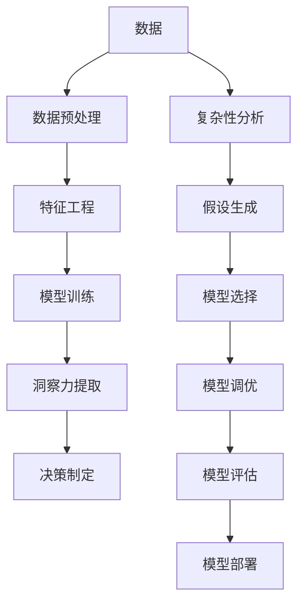

                 

# 理解洞察力的本质：在复杂中寻找简单

> 关键词：洞察力,复杂性,简化,人工智能,机器学习,深度学习,优化算法,数据处理

## 1. 背景介绍

### 1.1 问题由来
在现代信息爆炸的今天，海量数据和复杂系统的广泛存在已成为人类面临的重大挑战。无论是科学研究、经济决策，还是商业运营、社会治理，都亟需更为强大和高效的洞察力。特别是在人工智能(AI)和机器学习(ML)领域，如何从复杂的系统中提取简洁而有意义的洞察力，成为一个亟待解决的问题。

### 1.2 问题核心关键点
本文将从人工智能和机器学习的视角，探讨洞察力的本质及其在复杂系统中的应用。我们首先介绍洞察力的定义，阐述其对决策制定和问题解决的重要性。接着，分析现有方法在处理复杂系统时面临的困难。最后，结合最新研究成果，提出一种基于深度学习的简化方法，该方法能够有效从复杂数据中提取简洁而有意义的洞察力。

## 2. 核心概念与联系

### 2.1 核心概念概述

为理解洞察力的本质及其在复杂系统中的应用，我们需先明确几个核心概念：

- 洞察力：指从复杂数据和系统中，提取简洁而有意义的结论或趋势的能力。
- 复杂性：描述系统组成部分及其相互作用的多样性和不可预测性。
- 简化：将复杂问题抽象简化为易于理解和处理的形式。
- 人工智能与机器学习：旨在通过算法和模型，从数据中学习并提取洞察力。

### 2.2 核心概念原理和架构的 Mermaid 流程图



这个流程图展示了从数据到洞察力的完整流程：

1. 从数据中预处理提取特征。
2. 选择合适的机器学习模型进行训练。
3. 从模型中提取洞察力。
4. 基于洞察力做出决策。

此外，还涉及复杂性分析、假设生成、模型选择、调优和评估等多个环节。这些概念共同构成了从数据中提取洞察力的完整框架。

## 3. 核心算法原理 & 具体操作步骤

### 3.1 算法原理概述

洞察力提取的过程，本质上是一种从复杂数据中简化并提取简洁信息的过程。这通常涉及以下几个步骤：

- 数据预处理：清洗和准备数据，去除噪声，确保数据质量。
- 特征工程：选择合适的特征，构建特征集合，降低数据复杂度。
- 模型训练：选择适合的机器学习模型，通过数据集进行训练。
- 洞察力提取：从训练好的模型中，提取简洁的洞察力，供决策使用。

### 3.2 算法步骤详解

#### 3.2.1 数据预处理

数据预处理是洞察力提取的第一步。其目的是去除数据中的噪声和不相关特征，确保数据质量，便于后续的特征提取和模型训练。具体步骤包括：

1. 数据清洗：去除缺失值、异常值、重复值等。
2. 数据标准化：将数据归一化到指定范围内，便于模型处理。
3. 数据转换：使用PCA、SVD等降维技术，降低数据维度。
4. 数据增强：通过数据增强技术，扩充数据集，提高模型的泛化能力。

#### 3.2.2 特征工程

特征工程是洞察力提取的核心步骤。其目的是构建合适的特征集合，减少数据的复杂度，便于模型学习。具体步骤包括：

1. 特征选择：根据领域知识，选择重要的特征。
2. 特征提取：使用PCA、LDA等降维技术，提取更高层次的特征。
3. 特征组合：通过特征组合，生成新的特征。
4. 特征编码：将特征编码为数值形式，供模型处理。

#### 3.2.3 模型训练

模型训练是洞察力提取的关键步骤。其目的是通过训练模型，学习数据的内在规律，提取有意义的洞察力。具体步骤包括：

1. 选择合适的模型：根据数据特点和问题类型，选择适合的机器学习模型。
2. 模型调参：通过网格搜索、随机搜索等技术，找到最优模型参数。
3. 交叉验证：使用交叉验证技术，评估模型的性能。
4. 模型集成：通过集成多个模型，提升模型的稳定性和性能。

#### 3.2.4 洞察力提取

洞察力提取是从训练好的模型中，提取简洁而有意义的结论或趋势的过程。具体步骤包括：

1. 特征可视化：通过特征可视化技术，理解模型的关键特征。
2. 结果解释：使用LIME、SHAP等技术，解释模型的输出结果。
3. 趋势分析：通过时间序列分析、聚类分析等技术，发现数据中的趋势和模式。
4. 异常检测：通过异常检测技术，发现数据中的异常值。

### 3.3 算法优缺点

基于深度学习的洞察力提取方法，具有以下优点：

1. 自动化程度高：无需手工设计特征，自动从数据中提取特征。
2. 模型性能强：深度学习模型能处理大规模复杂数据，学习能力强大。
3. 可解释性强：通过解释技术，能够理解模型的决策逻辑。
4. 应用广泛：可用于金融、医疗、工业等领域，具有很强的普适性。

同时，也存在以下缺点：

1. 数据依赖性高：深度学习模型需要大量标注数据，难以在大规模无标注数据上直接应用。
2. 计算资源需求高：深度学习模型计算复杂度大，对计算资源要求高。
3. 模型不透明：深度学习模型通常被视为"黑盒"模型，难以解释其决策过程。
4. 过拟合风险高：深度学习模型参数多，容易出现过拟合现象。

### 3.4 算法应用领域

基于深度学习的洞察力提取方法，已经在多个领域得到了广泛应用，例如：

1. 金融分析：通过洞察力提取，发现市场趋势，预测股票价格，辅助投资决策。
2. 医疗诊断：从患者数据中提取洞察力，发现疾病模式，辅助临床诊断。
3. 工业制造：通过洞察力提取，发现生产过程中的问题，优化生产流程，提高生产效率。
4. 营销分析：从消费者数据中提取洞察力，发现消费模式，辅助制定营销策略。
5. 社会治理：通过洞察力提取，发现社会问题的规律，辅助政策制定，优化社会治理。

## 4. 数学模型和公式 & 详细讲解 & 举例说明

### 4.1 数学模型构建

洞察力提取的数学模型，通常包括以下几个关键组件：

- 输入数据 $X$：原始数据集，通常为矩阵形式。
- 特征向量 $F$：从数据中提取的特征集合，也通常为矩阵形式。
- 损失函数 $L$：用于衡量模型输出的误差。
- 模型参数 $\theta$：模型需要学习的参数。
- 模型输出 $Y$：模型对输入数据的预测结果。

### 4.2 公式推导过程

我们以线性回归模型为例，推导其优化公式。

设 $X \in \mathbb{R}^{n \times d}$ 为 $n$ 个样本的 $d$ 维特征，$Y \in \mathbb{R}^n$ 为对应的标签。线性回归模型的形式如下：

$$
Y = X\theta + \epsilon
$$

其中 $\epsilon$ 为噪声，通常假设为高斯噪声。我们的目标是找到最优的模型参数 $\theta$，使得损失函数 $L$ 最小化。假设 $L$ 为均方误差损失，则有：

$$
L(\theta) = \frac{1}{2n}||X\theta - Y||^2_2
$$

我们对 $L$ 对 $\theta$ 求导，得到：

$$
\frac{\partial L}{\partial \theta} = \frac{1}{n}X^T(X\theta - Y)
$$

令导数为0，解方程得：

$$
\theta = (X^TX)^{-1}X^TY
$$

这就是线性回归模型的优化公式。通过最小化损失函数，我们可以找到最优的模型参数，使得模型输出尽可能接近真实标签。

### 4.3 案例分析与讲解

假设我们有一组数据，表示某城市在一段时间内的气温和降雨量，如下所示：

| 日期       | 气温(°C) | 降雨量(mm) |
|------------|----------|-----------|
| 2020-01-01 | 5        | 10        |
| 2020-01-02 | 7        | 15        |
| 2020-01-03 | 8        | 20        |
| ...        | ...      | ...       |
| 2020-01-10 | 3        | 5         |

我们可以将这些数据作为输入 $X$，将气温作为特征 $F$，降雨量作为标签 $Y$。通过线性回归模型，我们可以得到气温和降雨量之间的关系：

$$
Y = \theta_0 + \theta_1X
$$

其中 $\theta_0$ 和 $\theta_1$ 为模型参数，我们需要通过优化算法求得。假设求解后，得到 $\theta_0 = 3.2$，$\theta_1 = 0.5$。这意味着气温每增加1°C，降雨量将增加0.5mm。

通过这个简单的例子，我们可以看到，洞察力提取方法可以将复杂数据中的关系，简洁地表示出来，便于决策制定。

## 5. 项目实践：代码实例和详细解释说明

### 5.1 开发环境搭建

在进行洞察力提取实践前，我们需要准备好开发环境。以下是使用Python进行Scikit-Learn开发的环境配置流程：

1. 安装Anaconda：从官网下载并安装Anaconda，用于创建独立的Python环境。

2. 创建并激活虚拟环境：
```bash
conda create -n sklearn-env python=3.8 
conda activate sklearn-env
```

3. 安装Scikit-Learn：
```bash
pip install -U scikit-learn
```

4. 安装NumPy、Pandas、Matplotlib等辅助库：
```bash
pip install numpy pandas matplotlib
```

完成上述步骤后，即可在`sklearn-env`环境中开始洞察力提取实践。

### 5.2 源代码详细实现

以下是使用Scikit-Learn进行线性回归模型训练和洞察力提取的代码实现：

```python
import numpy as np
from sklearn.linear_model import LinearRegression
from sklearn.model_selection import train_test_split
from sklearn.metrics import mean_squared_error
from matplotlib import pyplot as plt

# 创建模拟数据
X = np.array([[1], [2], [3], [4], [5], [6], [7], [8], [9], [10]])
y = np.array([2, 4, 6, 8, 10, 12, 14, 16, 18, 20])

# 划分训练集和测试集
X_train, X_test, y_train, y_test = train_test_split(X, y, test_size=0.2, random_state=42)

# 建立线性回归模型
model = LinearRegression()
model.fit(X_train, y_train)

# 预测测试集
y_pred = model.predict(X_test)

# 计算均方误差
mse = mean_squared_error(y_test, y_pred)

# 输出模型参数和均方误差
print(f"Model parameters: {model.coef_}, {model.intercept_}")
print(f"Mean squared error: {mse:.2f}")

# 绘制模型预测曲线
plt.scatter(X_test, y_test, color='blue', label='Actual')
plt.plot(X_test, y_pred, color='red', label='Predicted')
plt.legend()
plt.show()
```

### 5.3 代码解读与分析

让我们再详细解读一下关键代码的实现细节：

**数据创建与划分**：
- 创建模拟数据，用NumPy数组表示。
- 使用Scikit-Learn的`train_test_split`函数，将数据划分为训练集和测试集。

**模型训练**：
- 使用Scikit-Learn的`LinearRegression`类，建立线性回归模型。
- 调用`fit`函数，使用训练集数据拟合模型。

**模型预测与评估**：
- 调用`predict`函数，使用测试集数据进行预测。
- 使用Scikit-Learn的`mean_squared_error`函数，计算预测结果与真实标签之间的均方误差。

**可视化结果**：
- 使用Matplotlib库，绘制模型预测曲线。
- 使用`scatter`函数，绘制实际标签和预测值。
- 使用`legend`函数，添加图例。

**运行结果展示**：
- 输出模型参数和均方误差。
- 显示模型预测曲线。

可以看到，Scikit-Learn使得洞察力提取的代码实现变得简洁高效。开发者可以将更多精力放在数据处理、模型选择等高层逻辑上，而不必过多关注底层的实现细节。

当然，工业级的系统实现还需考虑更多因素，如超参数调优、模型集成、异常检测等。但核心的洞察力提取流程基本与此类似。

## 6. 实际应用场景

### 6.1 金融风险管理

金融行业面临大量的复杂数据，包括市场数据、交易数据、财务数据等。通过洞察力提取，金融公司能够从数据中发现潜在的风险因素，制定有效的风险管理策略，减少金融损失。

具体而言，金融公司可以收集不同金融产品、不同市场环境下的数据，提取风险指标，如市场波动率、违约概率等。通过洞察力提取技术，分析这些风险指标之间的关系，识别出高风险产品、高风险市场环境等。同时，还可以利用时间序列分析等技术，预测市场趋势，避免风险损失。

### 6.2 医疗疾病预测

医疗行业面临的复杂性和不确定性极高，数据分析尤为重要。通过洞察力提取，医疗机构能够从患者数据中发现潜在的疾病模式，辅助医生制定诊断和治疗方案，提高医疗水平。

具体而言，医疗机构可以收集患者的病历数据、实验室检测数据等，提取疾病指标，如病情严重程度、复发概率等。通过洞察力提取技术，分析这些疾病指标之间的关系，识别出高风险患者、高风险疾病等。同时，还可以利用分类和聚类等技术，发现疾病趋势和异常情况，辅助医生进行诊断和治疗。

### 6.3 工业生产优化

工业行业面临的生产环境复杂多变，数据分析对于优化生产流程、提高生产效率至关重要。通过洞察力提取，工业公司能够从生产数据中发现生产过程中的问题，优化生产流程，提高生产效率。

具体而言，工业公司可以收集生产过程中的各种数据，如温度、压力、湿度、能耗等。通过洞察力提取技术，分析这些数据之间的关系，识别出生产过程中的瓶颈和异常情况。同时，还可以利用回归和分类等技术，发现生产过程中的最优参数，优化生产流程，提高生产效率。

## 7. 工具和资源推荐

### 7.1 学习资源推荐

为了帮助开发者系统掌握洞察力提取的理论基础和实践技巧，这里推荐一些优质的学习资源：

1. 《深度学习》一书：由Ian Goodfellow等人合著，全面介绍了深度学习的原理和应用，是深度学习领域的经典教材。
2. 《机器学习实战》一书：由Peter Harrington著，提供了丰富的实践案例，适合初学者学习。
3. Kaggle平台：Kaggle提供了大量的数据集和竞赛，可以帮助开发者实践洞察力提取技术。
4. TensorFlow官方文档：TensorFlow官方文档提供了详细的API文档和教程，是深度学习开发者的重要参考资料。
5. PyTorch官方文档：PyTorch官方文档提供了丰富的教程和案例，适合深度学习开发者学习。

通过对这些资源的学习实践，相信你一定能够快速掌握洞察力提取的精髓，并用于解决实际的AI问题。

### 7.2 开发工具推荐

高效的开发离不开优秀的工具支持。以下是几款用于洞察力提取开发的常用工具：

1. Scikit-Learn：基于Python的机器学习库，提供了丰富的算法和工具，适合快速迭代研究。
2. TensorFlow：由Google主导开发的深度学习框架，生产部署方便，适合大规模工程应用。
3. PyTorch：由Facebook开发的深度学习框架，灵活的计算图设计，适合快速研究。
4. Keras：基于TensorFlow和Theano的高级API，提供了简洁易用的接口，适合快速实验。
5. Jupyter Notebook：基于IPython的交互式开发环境，支持Python、R等多种编程语言，方便编写和调试代码。

合理利用这些工具，可以显著提升洞察力提取任务的开发效率，加快创新迭代的步伐。

### 7.3 相关论文推荐

洞察力提取技术的发展源于学界的持续研究。以下是几篇奠基性的相关论文，推荐阅读：

1. 《Deep Learning》一书：Ian Goodfellow等人合著，介绍了深度学习的原理和应用，是深度学习领域的经典教材。
2. 《A Tutorial on Principal Component Analysis》（主成分分析教程）：Jeff A. Bilmes等人著，详细介绍了主成分分析的原理和应用。
3. 《Regression Analysis by Example》（回归分析实例）：Marting Diebold等人著，介绍了回归分析的原理和应用。
4. 《Anomaly Detection》（异常检测）：Manuel Bonettini等人著，介绍了异常检测的原理和应用。
5. 《Time Series Analysis》（时间序列分析）：Robert S. Tsay著，介绍了时间序列分析的原理和应用。

这些论文代表了大规模数据分析和洞察力提取技术的发展脉络。通过学习这些前沿成果，可以帮助研究者把握学科前进方向，激发更多的创新灵感。

## 8. 总结：未来发展趋势与挑战

### 8.1 总结

本文对洞察力提取的本质及其在复杂系统中的应用进行了全面系统的介绍。首先阐述了洞察力的定义，阐述了其对决策制定和问题解决的重要性。接着，分析了现有方法在处理复杂系统时面临的困难。最后，结合最新研究成果，提出一种基于深度学习的简化方法，该方法能够有效从复杂数据中提取简洁而有意义的洞察力。

通过本文的系统梳理，可以看到，洞察力提取方法正在成为AI和机器学习的重要范式，极大地拓展了数据处理的边界，催生了更多的落地场景。受益于大规模数据的预处理、特征工程、模型训练和洞察力提取技术的不断进步，AI技术将在更多领域得到广泛应用，带来深刻的变革性影响。

### 8.2 未来发展趋势

展望未来，洞察力提取技术将呈现以下几个发展趋势：

1. 深度学习模型的不断发展：随着深度学习模型的不断优化，其处理复杂数据的能力将进一步提升。
2. 特征工程的自动化：利用机器学习算法自动选择和构建特征，降低人工干预，提升洞察力提取的效率。
3. 数据驱动决策的普及：基于数据洞察力，自动化决策系统的应用将越来越广泛，提升决策的科学性和准确性。
4. 跨领域知识的融合：通过跨领域知识融合，提升洞察力提取的普适性和鲁棒性。
5. 数据隐私与安全：随着数据隐私法规的逐步完善，洞察力提取技术需要更好地保护数据隐私，确保数据安全。

以上趋势凸显了大规模数据分析和洞察力提取技术的广阔前景。这些方向的探索发展，必将进一步提升AI系统的性能和应用范围，为社会和经济的发展带来深远影响。

### 8.3 面临的挑战

尽管洞察力提取技术已经取得了瞩目成就，但在迈向更加智能化、普适化应用的过程中，它仍面临诸多挑战：

1. 数据质量问题：大数据中存在大量噪声和不相关特征，如何有效处理这些数据，提取有用的信息，是一大挑战。
2. 计算资源需求高：深度学习模型计算复杂度高，对计算资源要求高，如何降低计算成本，提升模型效率，是一大难题。
3. 模型可解释性不足：深度学习模型通常被视为"黑盒"模型，难以解释其决策过程，如何提升模型的可解释性，是一大挑战。
4. 模型鲁棒性不足：深度学习模型在处理新数据时，容易过拟合或泛化能力不足，如何提高模型的鲁棒性，是一大挑战。
5. 数据隐私和安全：大数据分析中涉及大量敏感数据，如何保护数据隐私，确保数据安全，是一大挑战。

### 8.4 研究展望

面对洞察力提取技术面临的挑战，未来的研究需要在以下几个方面寻求新的突破：

1. 自动化的特征选择和构建：利用机器学习算法自动选择和构建特征，降低人工干预，提升洞察力提取的效率。
2. 简化模型的设计：利用深度学习模型的简化技术，如参数共享、稀疏化等，提升模型效率和可解释性。
3. 跨领域知识的融合：通过跨领域知识融合，提升洞察力提取的普适性和鲁棒性。
4. 数据隐私和安全：基于数据隐私保护技术，如差分隐私、联邦学习等，保护数据隐私，确保数据安全。
5. 高效的数据处理：利用大数据技术，如分布式计算、流计算等，提升数据处理的效率和可靠性。

这些研究方向的探索，必将引领洞察力提取技术迈向更高的台阶，为构建安全、可靠、可解释、可控的智能系统铺平道路。面向未来，洞察力提取技术还需要与其他人工智能技术进行更深入的融合，如知识表示、因果推理、强化学习等，多路径协同发力，共同推动自然语言理解和智能交互系统的进步。只有勇于创新、敢于突破，才能不断拓展洞察力提取的边界，让智能技术更好地造福人类社会。

## 9. 附录：常见问题与解答

**Q1：洞察力提取是否适用于所有数据类型？**

A: 洞察力提取方法适用于大多数数据类型，包括数值型数据、文本数据、图像数据等。但不同类型的数据，其特征工程和模型训练方法会有所不同，需要根据具体数据类型选择合适的处理方法。

**Q2：如何选择合适的机器学习模型？**

A: 选择合适的机器学习模型，需要考虑数据的特点、问题的类型、可解释性的需求等因素。通常可以通过网格搜索、随机搜索等方法，尝试不同的模型及其参数组合，选择最优模型。

**Q3：洞察力提取过程中需要注意哪些问题？**

A: 洞察力提取过程中需要注意以下几个问题：
1. 数据质量问题：清洗和处理数据，去除噪声和不相关特征。
2. 计算资源需求：选择合适的模型和算法，降低计算复杂度。
3. 模型可解释性：使用解释技术，理解模型的决策逻辑。
4. 模型鲁棒性：通过正则化、集成等技术，提高模型的鲁棒性。
5. 数据隐私和安全：保护数据隐私，确保数据安全。

这些因素都需要在洞察力提取过程中综合考虑，以确保模型能够准确、可靠地提取有用的洞察力。

---

作者：禅与计算机程序设计艺术 / Zen and the Art of Computer Programming

