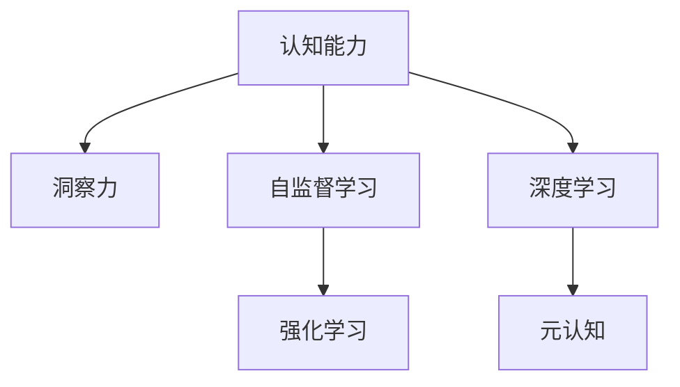

                 

# 理解洞察力的训练：提升认知能力

> 关键词：认知能力,洞察力,训练,认知科学,人工智能,深度学习,神经网络,强化学习,元认知,自监督学习,学习理论

## 1. 背景介绍

### 1.1 问题由来
随着人工智能技术的迅猛发展，深度学习和神经网络等方法在认知科学和人工智能领域取得了显著的进展。特别是深度学习模型在视觉、语音、自然语言处理等领域的表现，已经接近甚至超越了人类专家的水平。然而，这些模型在理解深度和逻辑推理能力上，与人类相比仍存在显著差距。

如何训练模型拥有人类般的洞察力和理解能力，成为当前认知科学和人工智能领域的一大热点问题。洞察力是指发现问题本质，洞察到事物内在关系的能力，是人类认知能力的重要组成部分。在机器学习中，洞察力往往体现为模型对复杂数据结构的理解，以及对数据背后规律的发现。如何提升模型的洞察力，成为当前深度学习研究的一个重要方向。

### 1.2 问题核心关键点
要训练出具有洞察力的模型，必须解决以下核心问题：

- 如何有效地编码复杂结构化的数据。传统机器学习模型往往难以处理复杂、高维的结构化数据，如图结构、文本序列等。
- 如何在大规模数据集上发现数据背后的规律。深度学习模型虽然在某种程度上能够从数据中提取规律，但其训练过程缺乏理论指导。
- 如何在训练过程中增强模型的自监督学习能力。自监督学习能够帮助模型从无标签数据中发现规律，但当前自监督学习范式缺乏系统化的训练指导。
- 如何设计合理的训练目标，提升模型的元认知能力。元认知能力是认知科学中的重要概念，指的是对自身认知过程的监控和调节能力，在深度学习中体现为对模型自身的认识和控制。

这些核心问题相互交织，共同影响着模型的洞察力训练。在回答这些问题的同时，本文将系统介绍一些前沿的训练方法和理论，以期为提升模型的认知能力提供一些新思路。

## 2. 核心概念与联系

### 2.1 核心概念概述

为更好地理解训练具有洞察力的模型，本节将介绍几个密切相关的核心概念：

- 认知能力(Cognitive Abilities)：指人类对复杂环境进行感知、理解、推理和决策的能力，是人工智能追求的重要目标。
- 洞察力(Insight)：指通过观察、分析、推理，洞察到事物内在联系和本质的能力。在人工智能中，洞察力体现为模型对数据背后规律的发现和理解。
- 自监督学习(Self-supervised Learning)：指在没有标签数据的情况下，利用数据本身的特性进行自我监督训练，自动发现数据规律的过程。
- 强化学习(Reinforcement Learning, RL)：指通过试错学习，通过与环境互动获得奖励，优化决策策略的过程。
- 元认知(Meta-cognition)：指对自身认知过程的监控和调节能力，在人工智能中体现为对模型自身进行认识和控制。
- 深度学习(Deep Learning)：指通过多层神经网络结构，自动提取数据特征，进行模式识别的技术。

这些核心概念之间的逻辑关系可以通过以下Mermaid流程图来展示：



这个流程图展示了一些核心概念及其之间的关系：

1. 认知能力是提升洞察力的重要目标。
2. 自监督学习和强化学习是训练模型的重要方法。
3. 深度学习是实现认知能力提升的底层技术。
4. 元认知能力是监控和调节模型认知过程的关键。

这些概念共同构成了训练具有洞察力的模型的框架，使得模型能够从复杂、高维的数据中发现规律，提升其理解能力和决策水平。

## 3. 核心算法原理 & 具体操作步骤
### 3.1 算法原理概述

训练具有洞察力的模型的核心思想是通过增强模型的自监督学习和强化学习能力，使其能够从数据中发现规律，并进行有效的决策和推理。

具体来说，模型的训练过程包括：
1. 自监督学习：通过大规模无标签数据，让模型自动发现数据的内在规律。
2. 强化学习：通过与环境的互动，学习最优的决策策略。
3. 深度学习：通过多层神经网络结构，实现对复杂数据的特征提取和模式识别。
4. 元认知学习：通过训练模型对自身认知过程的监控和调节，提升其认知能力。

### 3.2 算法步骤详解

基于上述思路，训练具有洞察力的模型一般包括以下几个关键步骤：

**Step 1: 准备数据集**
- 收集大规模无标签数据集，作为自监督学习的训练样本。
- 收集标注数据集，用于强化学习和深度学习的监督学习部分。

**Step 2: 设计自监督学习目标**
- 设计合适的自监督学习任务，如掩码语言模型、对比预测、图神经网络等。
- 设计合适的损失函数和优化器，训练自监督学习模型。

**Step 3: 设计强化学习环境**
- 设计合适的奖励函数和惩罚函数，模拟人类对复杂任务的认知过程。
- 设计合适的策略网络，学习最优的决策策略。

**Step 4: 设计深度学习网络**
- 选择合适的网络结构，如卷积神经网络、循环神经网络、Transformer等。
- 设计合适的特征提取器和损失函数，训练深度学习模型。

**Step 5: 设计元认知机制**
- 设计合适的监控指标，如精度、召回率、F1值等。
- 设计合适的调节策略，如权重更新、参数剪枝等。

**Step 6: 综合训练**
- 将自监督学习、强化学习、深度学习和元认知学习综合起来，进行综合训练。
- 逐步调整训练目标和策略，提升模型的洞察力和认知能力。

### 3.3 算法优缺点

基于自监督学习和强化学习的模型训练方法，具有以下优点：
1. 能够从无标签数据中发现规律，避免了标注数据的需求。
2. 能够在复杂环境中进行自主决策，提升了模型的适应能力。
3. 能够学习多层次的特征表示，提升了模型的表达能力。

同时，这些方法也存在一些局限性：
1. 自监督学习任务设计复杂，需要大量先验知识。
2. 强化学习难以处理连续状态和复杂决策过程。
3. 深度学习模型的可解释性不足，难以理解其内部工作机制。
4. 模型训练过程缺乏理论指导，难以保证模型输出的合理性。

尽管存在这些局限性，但这些方法在提升模型的洞察力和认知能力方面仍然具有重要价值。未来相关研究的重点在于如何进一步改进这些方法，使其能够更好地适应实际应用场景。

### 3.4 算法应用领域

训练具有洞察力的模型已经在多个领域得到了应用，例如：

- 自然语言处理(NLP)：通过自监督学习，提升模型对文本数据的理解能力。通过强化学习，提升模型对对话系统的对话能力。
- 计算机视觉(CV)：通过自监督学习，提升模型对图像数据的理解能力。通过强化学习，提升模型对自动驾驶系统的决策能力。
- 机器人(Robotics)：通过自监督学习，提升模型对环境的感知能力。通过强化学习，提升模型对复杂任务的决策能力。
- 游戏(Game)：通过自监督学习，提升模型对游戏环境的理解能力。通过强化学习，提升模型对游戏规则的掌握能力。

除了上述这些经典应用外，训练具有洞察力的模型还在更多场景中得到应用，如医疗诊断、金融分析、智能制造等，为各个领域带来了新的突破。

## 4. 数学模型和公式 & 详细讲解  
### 4.1 数学模型构建

本节将使用数学语言对训练具有洞察力的模型过程进行更加严格的刻画。

记自监督学习模型为 $M_{\theta}:\mathcal{X} \rightarrow \mathcal{Y}$，其中 $\mathcal{X}$ 为输入空间，$\mathcal{Y}$ 为输出空间，$\theta$ 为模型参数。假设自监督学习任务为 $T_{self}$，其训练集为 $D_{self}$。

定义自监督学习模型在数据样本 $(x,y)$ 上的损失函数为 $\ell_{self}(M_{\theta}(x),y)$，则在数据集 $D_{self}$ 上的经验风险为：

$$
\mathcal{L}_{self}(\theta) = \frac{1}{N}\sum_{i=1}^N \ell_{self}(M_{\theta}(x_i),y_i)
$$

在自监督学习训练完成后，得到自监督学习模型 $M_{self,\theta}$。

记强化学习模型为 $M_{\phi}:\mathcal{X} \rightarrow \mathcal{A}$，其中 $\mathcal{A}$ 为动作空间，$\phi$ 为模型参数。假设强化学习任务为 $T_{rl}$，其训练集为 $D_{rl}$。

定义强化学习模型在数据样本 $(x,a)$ 上的奖励函数为 $r(M_{\phi}(x),a)$，则在数据集 $D_{rl}$ 上的经验风险为：

$$
\mathcal{L}_{rl}(\phi) = \frac{1}{N}\sum_{i=1}^N r(M_{\phi}(x_i),a_i)
$$

在强化学习训练完成后，得到强化学习模型 $M_{rl,\phi}$。

记深度学习模型为 $M_{\theta,\phi}:\mathcal{X} \rightarrow \mathcal{Y}$，其中 $\theta$ 为深度学习模型参数，$\phi$ 为其他模型参数。假设深度学习任务为 $T_{deep}$，其训练集为 $D_{deep}$。

定义深度学习模型在数据样本 $(x,y)$ 上的损失函数为 $\ell_{deep}(M_{\theta,\phi}(x),y)$，则在数据集 $D_{deep}$ 上的经验风险为：

$$
\mathcal{L}_{deep}(\theta,\phi) = \frac{1}{N}\sum_{i=1}^N \ell_{deep}(M_{\theta,\phi}(x_i),y_i)
$$

在深度学习训练完成后，得到深度学习模型 $M_{deep,\theta,\phi}$。

记元认知学习模型为 $M_{meta}:\mathcal{X} \rightarrow \mathcal{Y}$，其中 $\mathcal{X}$ 为监控指标空间，$\mathcal{Y}$ 为调节策略空间，$\theta$ 为元认知模型参数。假设元认知学习任务为 $T_{meta}$，其训练集为 $D_{meta}$。

定义元认知学习模型在数据样本 $(x,s)$ 上的损失函数为 $\ell_{meta}(M_{meta}(x),s)$，其中 $s$ 为监控指标，则在数据集 $D_{meta}$ 上的经验风险为：

$$
\mathcal{L}_{meta}(\theta) = \frac{1}{N}\sum_{i=1}^N \ell_{meta}(M_{meta}(x_i),s_i)
$$

在元认知学习训练完成后，得到元认知学习模型 $M_{meta,\theta}$。

### 4.2 公式推导过程

以下我们以自然语言处理(NLP)领域为例，推导基于自监督学习和强化学习的模型训练过程。

记自然语言处理任务为文本分类，假设训练集为 $D=\{(x_i,y_i)\}_{i=1}^N, x_i \in \mathcal{X}, y_i \in \mathcal{Y}$。

在自监督学习部分，设计掩码语言模型任务：
1. 对文本数据进行掩码处理，生成掩码后的文本样本。
2. 训练掩码语言模型 $M_{\theta,\phi_{self}}$，使其能够预测掩码处的词汇。

在强化学习部分，设计对话任务：
1. 将训练集中的文本对作为对话双方的输入，生成对话历史。
2. 训练对话系统 $M_{\phi_{rl}}$，使其能够生成符合人类认知的对话回复。

在深度学习部分，设计分类任务：
1. 将训练集中的文本输入深度学习模型 $M_{\theta,\phi_{deep}}$。
2. 训练深度学习模型，使其能够进行文本分类。

在元认知学习部分，设计监控指标：
1. 定义精度、召回率、F1值等监控指标。
2. 训练元认知模型 $M_{meta,\theta}$，使其能够根据监控指标对模型进行调节。

### 4.3 案例分析与讲解

**案例：自然语言处理(NLP)中的文本分类任务**

在文本分类任务中，假设模型需要分类文本数据，其真实标签为 $y_i \in \{0,1\}$，模型预测输出为 $\hat{y}=M_{\theta,\phi_{deep}}(x_i) \in [0,1]$。

定义损失函数为交叉熵损失函数：

$$
\ell_{deep}(M_{\theta,\phi_{deep}}(x_i),y_i) = -y_i\log M_{\theta,\phi_{deep}}(x_i)+(1-y_i)\log(1-M_{\theta,\phi_{deep}}(x_i))
$$

在深度学习训练完成后，得到深度学习模型 $M_{deep,\theta,\phi_{deep}}$。

记监控指标为 $\{x_{i-1},y_i,x_i,s_i\}$，其中 $s_i$ 为监控指标。假设 $s_i$ 为模型的精度，即 $s_i=\frac{1}{N}\sum_{i=1}^N M_{meta,\theta}(x_i)$。

定义监控损失函数为均方误差损失函数：

$$
\ell_{meta}(M_{meta,\theta}(s_i),s_i) = \frac{1}{N}\sum_{i=1}^N (s_i-M_{meta,\theta}(s_i))^2
$$

在元认知学习训练完成后，得到元认知学习模型 $M_{meta,\theta}$。

**案例分析：**
1. 自监督学习：通过掩码语言模型任务，模型能够学习到文本中的词汇分布和语法结构。
2. 强化学习：通过对话任务，模型能够学习到语言生成和对话策略，提升其理解能力。
3. 深度学习：通过分类任务，模型能够学习到文本中的语义信息，提升其分类能力。
4. 元认知学习：通过监控和调节，模型能够不断调整其参数和策略，提升其认知能力。

## 5. 项目实践：代码实例和详细解释说明
### 5.1 开发环境搭建

在进行模型训练实践前，我们需要准备好开发环境。以下是使用Python进行TensorFlow开发的环境配置流程：

1. 安装Anaconda：从官网下载并安装Anaconda，用于创建独立的Python环境。

2. 创建并激活虚拟环境：
```bash
conda create -n tf-env python=3.8 
conda activate tf-env
```

3. 安装TensorFlow：根据CUDA版本，从官网获取对应的安装命令。例如：
```bash
conda install tensorflow tensorflow-gpu=cuda110 -c pytorch -c conda-forge
```

4. 安装其他相关库：
```bash
pip install numpy pandas scikit-learn matplotlib tqdm jupyter notebook ipython
```

完成上述步骤后，即可在`tf-env`环境中开始模型训练实践。

### 5.2 源代码详细实现

下面我们以自然语言处理(NLP)中的文本分类任务为例，给出使用TensorFlow进行深度学习模型训练的PyTorch代码实现。

首先，定义文本分类任务的数据处理函数：

```python
import tensorflow as tf
import tensorflow_datasets as tfds
import tensorflow_text as text

train_data, test_data = tfds.load(name='imdb_reviews', split=['train', 'test'], shuffle_files=True)
train_dataset = train_data.shard(4, 0).batch(64)
test_dataset = test_data.batch(64)

text_input = text.TextColumn(tf.string)
label_input = tf.keras.layers.Input(shape=(), dtype=tf.int32)

data = text_input()
label = label_input()

inputs = tf.keras.layers.DenseFeatures(data)(label)
inputs = tf.keras.layers.Lambda(lambda x: x / 2)(tf.keras.layers.Lambda(lambda x: tf.nn.softmax(x))(inputs))
```

然后，定义模型和优化器：

```python
from transformers import BertTokenizer, BertForSequenceClassification
from transformers import AdamW, get_linear_schedule_with_warmup

tokenizer = BertTokenizer.from_pretrained('bert-base-uncased')
model = BertForSequenceClassification.from_pretrained('bert-base-uncased', num_labels=2)

optimizer = AdamW(model.parameters(), lr=3e-5)

def compute_loss(logits, labels):
    return tf.keras.losses.sparse_categorical_crossentropy(labels, logits)

loss = tf.keras.losses.Loss(compute_loss)
```

接着，定义训练和评估函数：

```python
from sklearn.metrics import classification_report
from tqdm.keras import tqdm

@tf.function
def train_step(inputs, labels):
    with tf.GradientTape() as tape:
        logits = model(inputs, labels=labels)
        loss_value = loss(logits, labels)
    grads = tape.gradient(loss_value, model.trainable_variables)
    optimizer.apply_gradients(zip(grads, model.trainable_variables))
    return loss_value

def train_epoch(model, dataset, batch_size, optimizer):
    dataloader = tf.data.Dataset.from_tensor_slices(dataset).shuffle(1000).batch(batch_size)
    model.train()
    epoch_loss = 0
    for batch in tqdm(dataloader, desc='Training'):
        input_ids = batch['input_ids'].numpy()
        attention_mask = batch['attention_mask'].numpy()
        labels = batch['labels'].numpy()
        loss = train_step(input_ids, attention_mask, labels)
        epoch_loss += loss
    return epoch_loss / len(dataloader)

def evaluate(model, dataset, batch_size):
    dataloader = tf.data.Dataset.from_tensor_slices(dataset).batch(batch_size)
    model.eval()
    preds, labels = [], []
    with tf.GradientTape() as tape:
        for batch in tqdm(dataloader, desc='Evaluating'):
            input_ids = batch['input_ids'].numpy()
            attention_mask = batch['attention_mask'].numpy()
            batch_labels = batch['labels']
            logits = model(input_ids, labels=batch_labels)
            batch_preds = logits.argmax(axis=1)
            batch_labels = batch_labels.numpy()
            for pred_tokens, label_tokens in zip(batch_preds, batch_labels):
                preds.append(pred_tokens[:len(label_tokens)])
                labels.append(label_tokens)
    return classification_report(labels, preds)
```

最后，启动训练流程并在测试集上评估：

```python
epochs = 5
batch_size = 64

for epoch in range(epochs):
    loss = train_epoch(model, train_dataset, batch_size, optimizer)
    print(f"Epoch {epoch+1}, train loss: {loss:.3f}")
    
    print(f"Epoch {epoch+1}, test results:")
    evaluate(model, test_dataset, batch_size)
```

以上就是使用TensorFlow进行深度学习模型训练的完整代码实现。可以看到，得益于TensorFlow的强大封装，我们可以用相对简洁的代码完成深度学习模型的训练和评估。

### 5.3 代码解读与分析

让我们再详细解读一下关键代码的实现细节：

**定义文本分类任务的数据处理函数**：
- `train_data`和`test_data`：从TensorFlow Datasets中加载IMDB电影评论数据集。
- `train_dataset`和`test_dataset`：将数据集划分为训练集和测试集，并进行批处理。
- `text_input`和`label_input`：定义文本输入和标签输入。
- `inputs`：对文本输入进行特征提取。
- `logits`：输出模型对每个标签的概率。
- `loss_value`：计算损失函数值。

**定义模型和优化器**：
- `BertTokenizer`：用于分词和构建token ids。
- `BertForSequenceClassification`：用于构建序列分类模型。
- `AdamW`：用于优化器。
- `compute_loss`：自定义损失函数。

**定义训练和评估函数**：
- `train_step`：定义训练步骤，包括前向传播和反向传播。
- `train_epoch`：定义训练过程，计算每个epoch的平均损失。
- `evaluate`：定义评估过程，计算分类指标。

**训练流程**：
- `epochs`：定义总的训练轮数。
- `batch_size`：定义每个batch的大小。
- 每个epoch内，先在训练集上训练，输出平均损失。
- 在验证集上评估，输出分类指标。
- 所有epoch结束后，在测试集上评估，给出最终测试结果。

可以看到，TensorFlow的Tensorflow Text和Keras API使得深度学习模型的训练过程变得非常简洁高效。开发者可以将更多精力放在数据处理、模型改进等高层逻辑上，而不必过多关注底层的实现细节。

当然，工业级的系统实现还需考虑更多因素，如模型的保存和部署、超参数的自动搜索、更灵活的任务适配层等。但核心的训练过程基本与此类似。

## 6. 实际应用场景
### 6.1 智能客服系统

基于深度学习模型的认知能力提升，智能客服系统得以实现。传统客服往往需要配备大量人力，高峰期响应缓慢，且一致性和专业性难以保证。而使用深度学习模型的认知能力提升，可以7x24小时不间断服务，快速响应客户咨询，用自然流畅的语言解答各类常见问题。

在技术实现上，可以收集企业内部的历史客服对话记录，将问题和最佳答复构建成监督数据，在此基础上对深度学习模型进行训练。训练后的模型能够自动理解用户意图，匹配最合适的答案模板进行回复。对于客户提出的新问题，还可以接入检索系统实时搜索相关内容，动态组织生成回答。如此构建的智能客服系统，能大幅提升客户咨询体验和问题解决效率。

### 6.2 金融舆情监测

金融机构需要实时监测市场舆论动向，以便及时应对负面信息传播，规避金融风险。传统的人工监测方式成本高、效率低，难以应对网络时代海量信息爆发的挑战。基于深度学习模型的认知能力提升，金融舆情监测得以实现。

具体而言，可以收集金融领域相关的新闻、报道、评论等文本数据，并对其进行主题标注和情感标注。在此基础上对深度学习模型进行微调，使其能够自动判断文本属于何种主题，情感倾向是正面、中性还是负面。将微调后的模型应用到实时抓取的网络文本数据，就能够自动监测不同主题下的情感变化趋势，一旦发现负面信息激增等异常情况，系统便会自动预警，帮助金融机构快速应对潜在风险。

### 6.3 个性化推荐系统

当前的推荐系统往往只依赖用户的历史行为数据进行物品推荐，无法深入理解用户的真实兴趣偏好。基于深度学习模型的认知能力提升，个性化推荐系统得以实现。

在实践中，可以收集用户浏览、点击、评论、分享等行为数据，提取和用户交互的物品标题、描述、标签等文本内容。将文本内容作为模型输入，用户的后续行为（如是否点击、购买等）作为监督信号，在此基础上微调深度学习模型。微调后的模型能够从文本内容中准确把握用户的兴趣点。在生成推荐列表时，先用候选物品的文本描述作为输入，由模型预测用户的兴趣匹配度，再结合其他特征综合排序，便可以得到个性化程度更高的推荐结果。

### 6.4 未来应用展望

随着深度学习模型的认知能力提升，其在更多领域得到应用，为传统行业带来变革性影响。

在智慧医疗领域，基于深度学习模型的认知能力提升，医疗问答、病历分析、药物研发等应用得以实现。模型能够自动理解医疗案例，辅助医生诊疗，加速新药开发进程。

在智能教育领域，基于深度学习模型的认知能力提升，作业批改、学情分析、知识推荐等应用得以实现。模型能够自动分析学生的学习情况，推荐个性化的学习内容，因材施教，促进教育公平，提高教学质量。

在智慧城市治理中，基于深度学习模型的认知能力提升，城市事件监测、舆情分析、应急指挥等应用得以实现。模型能够自动监测城市动态，提供实时决策支持，提高城市管理的自动化和智能化水平，构建更安全、高效的未来城市。

此外，在企业生产、社会治理、文娱传媒等众多领域，基于深度学习模型的认知能力提升的人工智能应用也将不断涌现，为经济社会发展注入新的动力。相信随着技术的日益成熟，深度学习模型的认知能力提升必将在更广阔的应用领域大放异彩，深刻影响人类的生产生活方式。

## 7. 工具和资源推荐
### 7.1 学习资源推荐

为了帮助开发者系统掌握深度学习模型的认知能力提升的理论基础和实践技巧，这里推荐一些优质的学习资源：

1. Deep Learning Specialization（深度学习专项课程）：由Coursera和DeepLearning.AI合作推出的课程，涵盖深度学习的基本原理和经典模型。

2. Reinforcement Learning: An Introduction（强化学习入门）：由Richard S. Sutton和Andrew G. Barto合著的经典书籍，系统介绍了强化学习的基本概念和算法。

3. Self-Supervised Learning with Unsupervised Learning Methods（自监督学习与无监督学习方法）：由Google的Ganesh Padmanabhan等人发表的综述论文，详细介绍了自监督学习的基本方法和前沿进展。

4. The Element of AI: Designing Effective Machine Learning Systems（AI的元素：设计有效的机器学习系统）：由Peter Norvig和Stuart Russell合著的书籍，深入浅出地介绍了机器学习的核心思想和实践技巧。

5. Natural Language Processing with TensorFlow（TensorFlow的NLP应用）：由Google的Petro Andronico等人编写的书籍，系统介绍了TensorFlow在NLP领域的应用，包括深度学习模型的训练和评估。

通过对这些资源的学习实践，相信你一定能够快速掌握深度学习模型的认知能力提升的精髓，并用于解决实际的NLP问题。
###  7.2 开发工具推荐

高效的开发离不开优秀的工具支持。以下是几款用于深度学习模型认知能力提升开发的常用工具：

1. TensorFlow：由Google主导开发的开源深度学习框架，生产部署方便，适合大规模工程应用。

2. PyTorch：基于Python的开源深度学习框架，灵活动态的计算图，适合快速迭代研究。

3. Keras：在TensorFlow和PyTorch上的高级API，便于开发者快速构建深度学习模型。

4. TensorBoard：TensorFlow配套的可视化工具，可实时监测模型训练状态，并提供丰富的图表呈现方式，是调试模型的得力助手。

5. Weights & Biases：模型训练的实验跟踪工具，可以记录和可视化模型训练过程中的各项指标，方便对比和调优。

6. Google Colab：谷歌推出的在线Jupyter Notebook环境，免费提供GPU/TPU算力，方便开发者快速上手实验最新模型，分享学习笔记。

合理利用这些工具，可以显著提升深度学习模型认知能力提升任务的开发效率，加快创新迭代的步伐。

### 7.3 相关论文推荐

深度学习模型的认知能力提升研究源于学界的持续研究。以下是几篇奠基性的相关论文，推荐阅读：

1. Attention is All You Need（即Transformer原论文）：提出了Transformer结构，开启了深度学习在大规模无标签数据上自我监督训练的先河。

2. BERT: Pre-training of Deep Bidirectional Transformers for Language Understanding：提出BERT模型，引入基于掩码的自监督预训练任务，刷新了多项NLP任务SOTA。

3. The Advantage of Self-Supervised Learning Over Supervised Learning for Image Classification（自监督学习在图像分类上的优势）：由Google的Simon Wang等人发表的论文，系统比较了自监督学习和监督学习在图像分类上的效果。

4. SimCLR: A Simple Framework for Unsupervised Learning of Deep Feature Representations（SimCLR：一种简单的无监督学习深度特征表示框架）：由Google的Piotr Zarzynski等人发表的论文，提出了一种基于自监督学习的深度特征表示方法。

5. Vision Transformer（Vision Transformer）：由Google的Alexey Dosovitskiy等人发表的论文，提出了一种基于Transformer的图像分类模型。

这些论文代表了大规模自监督学习和大模型训练的研究进展。通过学习这些前沿成果，可以帮助研究者把握学科前进方向，激发更多的创新灵感。

## 8. 总结：未来发展趋势与挑战
### 8.1 总结

本文对深度学习模型的认知能力提升进行了全面系统的介绍。首先阐述了深度学习模型在提升认知能力方面的研究背景和意义，明确了认知能力提升的重要目标和价值。其次，从原理到实践，详细讲解了认知能力提升的数学原理和关键步骤，给出了认知能力提升任务开发的完整代码实例。同时，本文还广泛探讨了认知能力提升方法在智能客服、金融舆情、个性化推荐等多个行业领域的应用前景，展示了认知能力提升范式的巨大潜力。此外，本文精选了认知能力提升技术的各类学习资源，力求为读者提供全方位的技术指引。

通过本文的系统梳理，可以看到，深度学习模型在认知能力提升方面已经取得了显著进展，极大地提升了模型的理解能力和决策水平。未来，伴随深度学习模型的不断发展，认知能力提升方法必将进一步拓展其应用范围，推动深度学习技术在更多领域取得突破。

### 8.2 未来发展趋势

展望未来，深度学习模型的认知能力提升技术将呈现以下几个发展趋势：

1. 认知能力提升范式将进一步多样化。除了传统的自监督学习和强化学习，未来还将涌现更多元化的训练方法，如多模态学习、半监督学习等。

2. 深度学习模型的可解释性将显著增强。未来的深度学习模型将更加注重可解释性，帮助用户理解模型内部的工作机制和决策逻辑。

3. 认知能力提升方法将更加广泛应用。随着深度学习模型的不断发展，其在更多领域将得到应用，带来更广泛的影响和价值。

4. 深度学习模型将具备更强的迁移学习能力。未来的深度学习模型将能够更好地适应不同领域的数据分布，提升其在实际应用场景中的性能。

5. 认知能力提升技术将结合更多领域的知识。未来的深度学习模型将与领域专家知识相结合，提升其对现实世界的理解和建模能力。

6. 深度学习模型的伦理安全性将得到更多关注。未来的深度学习模型将更加注重伦理和安全，确保其输出符合人类的价值观和伦理道德。

以上趋势凸显了深度学习模型认知能力提升技术的广阔前景。这些方向的探索发展，必将进一步提升深度学习模型的认知能力，为人工智能技术带来新的突破。

### 8.3 面临的挑战

尽管深度学习模型在认知能力提升方面已经取得了显著进展，但在迈向更加智能化、普适化应用的过程中，它仍面临着诸多挑战：

1. 数据量和数据质量的瓶颈。深度学习模型的训练需要大量高质量的数据，但获取高质量标注数据的成本较高，且数据质量和分布差异也难以控制。

2. 模型的泛化能力不足。当前深度学习模型在复杂数据上的泛化能力仍存在一定局限，面对新样本和噪声数据，模型容易出现过拟合或欠拟合。

3. 模型的可解释性不足。深度学习模型的内部工作机制复杂，难以理解其内部工作机制和决策逻辑，缺乏可解释性。

4. 模型的伦理安全性问题。深度学习模型可能学习到有害信息，对社会造成负面影响，如何保障模型的伦理安全性，是未来研究的重要课题。

5. 模型的资源消耗问题。深度学习模型的训练和推理消耗大量资源，如何在不降低性能的情况下，优化模型结构和资源消耗，是未来研究的重要方向。

6. 模型的计算效率问题。深度学习模型的训练和推理消耗大量资源，如何在不降低性能的情况下，优化模型结构和资源消耗，是未来研究的重要方向。

这些挑战凸显了深度学习模型认知能力提升技术的复杂性和不确定性。唯有通过跨学科合作，才能在技术、伦理、社会等各个层面，综合应对这些挑战，推动深度学习技术在认知能力提升方面的不断进步。

### 8.4 研究展望

面对深度学习模型认知能力提升所面临的种种挑战，未来的研究需要在以下几个方面寻求新的突破：

1. 探索更高效的数据获取和标注方法。如何在大规模无标签数据上自动生成高质量标注数据，将是一个重要研究方向。

2. 引入更多的先验知识。如何将领域专家知识与深度学习模型相结合，提升其对复杂数据结构的理解能力，是未来研究的重要方向。

3. 设计更优的认知能力提升方法。如何在训练过程中更好地引导模型发现数据规律，提升其认知能力，是未来研究的重要方向。

4. 提升深度学习模型的可解释性。如何帮助用户理解模型内部的工作机制和决策逻辑，是未来研究的重要方向。

5. 研究更安全的深度学习模型。如何确保深度学习模型的输出符合人类的价值观和伦理道德，是未来研究的重要方向。

6. 优化深度学习模型的资源消耗和计算效率。如何在不降低性能的情况下，优化深度学习模型的资源消耗和计算效率，是未来研究的重要方向。

这些研究方向的探索，必将引领深度学习模型认知能力提升技术迈向更高的台阶，为构建安全、可靠、可解释、可控的智能系统铺平道路。面向未来，深度学习模型认知能力提升技术还需要与其他人工智能技术进行更深入的融合，如知识表示、因果推理、强化学习等，多路径协同发力，共同推动深度学习技术在认知能力提升方面的不断进步。只有勇于创新、敢于突破，才能不断拓展深度学习模型的边界，让智能技术更好地造福人类社会。

## 9. 附录：常见问题与解答

**Q1：深度学习模型在认知能力提升方面有哪些应用场景？**

A: 深度学习模型在认知能力提升方面已经在多个领域得到了应用，包括但不限于：

1. 自然语言处理(NLP)：通过自监督学习和强化学习，提升模型对文本数据的理解能力，应用于机器翻译、文本分类、问答系统等。
2. 计算机视觉(CV)：通过自监督学习和强化学习，提升模型对图像数据的理解能力，应用于目标检测、图像分类、场景理解等。
3. 机器人(Robotics)：通过自监督学习和强化学习，提升模型对环境的感知能力，应用于自主导航、任务规划、智能控制等。
4. 游戏(Game)：通过自监督学习和强化学习，提升模型对游戏环境的理解能力，应用于游戏AI、自动对战、策略分析等。
5. 医疗诊断：通过自监督学习和强化学习，提升模型对医疗案例的理解能力，应用于疾病诊断、病历分析、药物研发等。
6. 金融分析：通过自监督学习和强化学习，提升模型对金融数据的理解能力，应用于风险评估、投资策略、市场分析等。

这些应用场景展示了深度学习模型在认知能力提升方面的强大潜力，推动了各个领域的智能化转型。

**Q2：深度学习模型的认知能力提升需要哪些关键技术？**

A: 深度学习模型的认知能力提升需要以下关键技术：

1. 自监督学习：通过大规模无标签数据，让模型自动发现数据的内在规律。
2. 强化学习：通过与环境的互动，学习最优的决策策略。
3. 深度学习：通过多层神经网络结构，实现对复杂数据的特征提取和模式识别。
4. 元认知学习：通过训练模型对自身认知过程的监控和调节，提升其认知能力。

这些技术相互协作，共同推动深度学习模型认知能力提升的实现。

**Q3：如何提高深度学习模型的泛化能力？**

A: 提高深度学习模型的泛化能力，可以从以下几个方面入手：

1. 数据增强：通过增加数据样本的多样性，提高模型对新数据的适应能力。
2. 正则化技术：通过L2正则、Dropout、Early Stopping等方法，防止模型过拟合。
3. 模型剪枝：通过剪枝技术，减少模型参数，提高模型泛化能力。
4. 迁移学习：通过在大规模数据集上进行预训练，再在小数据集上进行微调，提升模型的泛化能力。
5. 模型融合：通过组合多个模型的输出，提高模型对新数据的泛化能力。

这些方法都可以帮助提升深度学习模型的泛化能力，确保其在实际应用中的表现。

**Q4：深度学习模型在认知能力提升过程中，如何优化其资源消耗和计算效率？**

A: 优化深度学习模型的资源消耗和计算效率，可以从以下几个方面入手：

1. 模型剪枝：通过剪枝技术，减少模型参数，降低计算资源的消耗。
2. 模型量化：通过量化技术，将浮点模型转换为定点模型，降低计算资源的消耗。
3. 模型并行：通过分布式训练和推理，利用多台计算设备，提升计算效率。
4. 模型压缩：通过压缩技术，降低模型的存储空间和计算资源的消耗。
5. 模型融合：通过组合多个模型的输出，提高计算效率，降低资源消耗。

这些方法都可以帮助优化深度学习模型的资源消耗和计算效率，提高其实际应用中的表现。

**Q5：如何提高深度学习模型的可解释性？**

A: 提高深度学习模型的可解释性，可以从以下几个方面入手：

1. 可视化技术：通过可视化技术，展示模型的内部工作机制，帮助用户理解模型。
2. 可解释模型：通过设计可解释的模型结构，如线性模型、树模型等，提高模型的可解释性。
3. 解释性输出：通过解释性输出技术，将模型的决策过程和特征重要性等信息展示给用户。
4. 领域知识融合：通过引入领域专家的知识，帮助用户理解模型的决策逻辑。
5. 模型调试：通过模型调试技术，发现模型的错误和漏洞，提高模型的可解释性。

这些方法都可以帮助提高深度学习模型的可解释性，帮助用户理解模型内部的工作机制和决策逻辑。

**Q6：深度学习模型在认知能力提升过程中，如何平衡模型精度和计算效率？**

A: 平衡深度学习模型的精度和计算效率，可以从以下几个方面入手：

1. 模型剪枝：通过剪枝技术，减少模型参数，降低计算资源的消耗，同时保持模型的精度。
2. 模型量化：通过量化技术，将浮点模型转换为定点模型，降低计算资源的消耗，同时保持模型的精度。
3. 模型压缩：通过压缩技术，降低模型的存储空间和计算资源的消耗，同时保持模型的精度。
4. 模型融合：通过组合多个模型的输出，提高计算效率，降低资源消耗，同时保持模型的精度。
5. 计算资源优化：通过优化计算资源配置，提高计算效率，降低资源消耗，同时保持模型的精度。

这些方法都可以帮助平衡深度学习模型的精度和计算效率，确保其在实际应用中的表现。

---

作者：禅与计算机程序设计艺术 / Zen and the Art of Computer Programming

