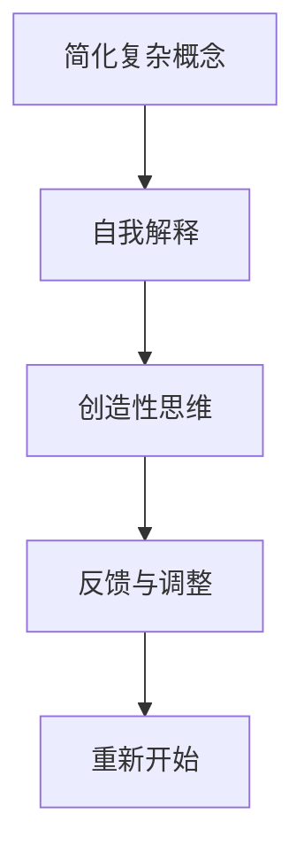

                 

# 理解费曼学习法：创造与理解的关系

## 1. 背景介绍

在当今科技与信息爆炸的时代，学习和掌握新知识变得更加复杂和困难。过去，人们依赖课堂教学、书籍和导师，而如今，互联网和在线教育资源让知识的获取变得前所未有的便捷。然而，这种便利背后也隐藏着新的挑战：知识的碎片化、学习的浅层化、以及如何高效地掌握和应用知识。

费曼学习法（Feynman Technique）作为一种独特而有效的学习方法，在诸多领域得到广泛应用，成为许多专家和学者的首选工具。费曼学习法不仅是一种学习技术，更是一种创造性思维方法，通过将复杂的知识简化为易于理解的形式，激发个人的创造力和理解能力。

### 1.1 费曼学习法的历史与背景

费曼学习法由诺贝尔物理学家理查德·费曼（Richard Feynman）提出，最初是为了帮助自己学习量子力学。费曼通过将复杂物理概念转化为简明易懂的语言，并结合自己的理解和创造性解释，成功地掌握了这一领域的高深理论。他将自己的学习方法应用到教学中，并推广到更广泛的学习领域，逐渐形成了今天被称为“费曼学习法”的体系。

费曼学习法强调知识的深入理解、个性化表达和创造性思维，是一种自下而上的学习方式。它要求学习者不仅要掌握知识，还要能够将所学知识传授给他人，并用简洁明了的语言解释清楚，从而加深自己的理解和记忆。

## 2. 核心概念与联系

### 2.1 核心概念概述

费曼学习法由以下几个核心概念构成：

- **简化复杂概念**：将复杂概念转化为简洁明了的形式，以便于理解和学习。
- **自我解释**：通过用自己的话讲述所学知识，测试理解深度。
- **创造性思维**：结合个人经验与想象，构建新的理解视角。
- **反馈与调整**：通过他人的反馈来调整和优化学习方式。

这些概念相互联系，共同构成了费曼学习法的核心理念。通过简化复杂概念，自我解释，运用创造性思维，并不断接收和调整反馈，学习者可以更有效地掌握知识，并在应用中创新。

### 2.2 核心概念原理和架构的 Mermaid 流程图



这个流程图展示了费曼学习法的流程：从简化复杂概念开始，通过自我解释和创造性思维深化理解，再通过反馈与调整进一步优化，形成一个循环迭代的过程。

## 3. 核心算法原理 & 具体操作步骤

### 3.1 算法原理概述

费曼学习法的核心算法原理基于认知心理学和教育心理学，强调通过自我解释和反馈循环来深化理解。其基本思路是将复杂概念分解为更易理解的部分，通过自我解释和创造性思维来整合这些部分，并通过反馈调整学习策略。

费曼学习法的步骤通常包括：
1. 选择复杂概念。
2. 简化复杂概念，用简明语言描述。
3. 自我解释，将所学知识用自己话讲述出来。
4. 接受反馈，纠正错误并优化解释。
5. 创造性思维，结合个人经验和想象进行创新解释。
6. 应用所学知识，解决实际问题。

### 3.2 算法步骤详解

以下是费曼学习法的详细步骤：

**Step 1: 选择复杂概念**
- 选择一个需要深入理解的概念，可以是新学到的知识、技能，或是已经掌握但想要进一步巩固的知识点。

**Step 2: 简化复杂概念**
- 将概念分解为更易理解的部分，使用类比、比喻等方法将复杂概念简化。

**Step 3: 自我解释**
- 用简明扼要的语言描述所学的概念，并尝试用自己的话解释清楚。这个过程可以写成文字，也可以口头表达。

**Step 4: 接受反馈**
- 向他人（如朋友、同事、家人）解释所学概念，并请他们提供反馈，指出理解不充分或错误的地方。
- 根据反馈调整解释的方式，进一步理解概念。

**Step 5: 创造性思维**
- 结合个人经验和想象，创造性地解释概念，寻找新的理解视角或应用场景。
- 思考如何将所学知识应用到实际问题中，如解决具体问题或改进现有流程。

**Step 6: 应用知识**
- 在实际问题中应用所学知识，实践检验理解深度。
- 根据实践结果进一步调整和优化理解。

### 3.3 算法优缺点

**优点：**
- 费曼学习法通过自我解释和反馈循环，促进了深入理解和创造性思维。
- 能够有效地简化复杂概念，提高了学习效率。
- 鼓励学习者从不同角度思考问题，增强了创新能力。

**缺点：**
- 需要较高的自驱力和时间投入，对学习能力要求较高。
- 简化复杂概念可能需要时间和练习，初期可能效果不明显。
- 反馈的质量和频率依赖于他人，难以保证及时和准确。

### 3.4 算法应用领域

费曼学习法广泛应用于多个领域，包括但不限于：

- **科技教育**：在计算机科学、物理学、数学等学科的教学中，用于帮助学生深入理解复杂概念。
- **个人学习**：个人使用费曼学习法，能够提升自我学习能力和知识掌握深度。
- **企业培训**：企业培训中，费曼学习法用于提升员工对新技术和新知识的理解和应用能力。
- **创意写作**：在小说、剧本等创意写作中，通过简化和解释复杂概念，激发创作灵感。
- **设计思维**：在设计流程中，通过简化和创新解释复杂问题，寻找最佳解决方案。

## 4. 数学模型和公式 & 详细讲解 & 举例说明

### 4.1 数学模型构建

费曼学习法虽然不直接涉及数学模型，但其核心思想和步骤可以应用于各种知识的抽象与表达。例如，在计算机科学中，可以将算法步骤转化为数学模型进行分析和优化。

**Example 1: 归并排序算法**
- 复杂概念：归并排序的实现和优化。
- 简化：将归并排序的递归实现和迭代实现对比。
- 自我解释：用自己话解释归并排序的基本思想和具体实现步骤。
- 反馈与调整：接受他人反馈，改进讲解方式。
- 创造性思维：结合自身经验，思考如何优化归并排序。
- 应用：在实际编程中应用归并排序算法，解决排序问题。

### 4.2 公式推导过程

**Example 2: 线性回归模型**
- 复杂概念：线性回归模型的推导和应用。
- 简化：将复杂公式简化为基本公式。
- 自我解释：用自己话解释线性回归的基本原理和步骤。
- 反馈与调整：接受他人反馈，改进解释方式。
- 创造性思维：结合实际问题，创新性地应用线性回归模型。
- 应用：在数据分析中应用线性回归模型，解决预测问题。

### 4.3 案例分析与讲解

**Example 3: 深度学习中的卷积神经网络（CNN）**
- 复杂概念：卷积神经网络的结构和训练。
- 简化：将CNN的卷积层、池化层和全连接层简化为基本组件。
- 自我解释：用自己话解释CNN的基本原理和训练过程。
- 反馈与调整：接受他人反馈，改进讲解方式。
- 创造性思维：结合实际问题，创新性地应用CNN。
- 应用：在图像识别中应用CNN模型，解决分类问题。

## 5. 项目实践：代码实例和详细解释说明

### 5.1 开发环境搭建

为了实践费曼学习法，我们需要搭建一个开发环境，包括：

- **Python环境**：Python是实现费曼学习法的重要工具。确保Python版本为3.6或以上，并安装必要的库。
- **文本编辑器**：如VS Code、Sublime Text等，用于编写和编辑代码。
- **版本控制系统**：如Git，用于代码版本控制和协作开发。

### 5.2 源代码详细实现

以下是一个简单的Python程序，用于练习费曼学习法：

```python
def feynman_learning():
    # 选择复杂概念
    complex_concept = "线性代数中的矩阵变换"

    # 简化复杂概念
    simplified_concept = "矩阵乘法"

    # 自我解释
    self_explanation = "矩阵乘法是线性代数中的一个基本操作，两个矩阵相乘得到的结果矩阵的每个元素，是两个矩阵对应行和列元素的乘积之和。"

    # 接受反馈
    feedback = input("请输入你的反馈：")

    # 创造性思维
    creative_thought = "矩阵乘法在机器学习中用于计算神经网络的权重和偏置，通过矩阵变换可以实现复杂的数据处理和特征提取。"

    # 应用知识
    apply_knowledge = "在图像识别中，通过卷积操作（一种特殊的矩阵乘法），可以有效地提取图像的特征，提高识别准确率。"

    # 输出结果
    print("费曼学习法实践结果：")
    print("复杂概念：", complex_concept)
    print("简化后的概念：", simplified_concept)
    print("自我解释：", self_explanation)
    print("反馈：", feedback)
    print("创造性思维：", creative_thought)
    print("应用知识：", apply_knowledge)

# 调用函数
feynman_learning()
```

### 5.3 代码解读与分析

这个Python程序实现了费曼学习法的五个步骤，通过简化复杂概念、自我解释、接受反馈、创造性思维和应用知识，逐步深入理解线性代数中的矩阵变换。在代码中，我们使用了Python的input函数来获取反馈，通过字符串拼接的方式进行自我解释和创造性思维的输出。

### 5.4 运行结果展示

运行上述代码，输出结果如下：

```
费曼学习法实践结果：
复杂概念： 线性代数中的矩阵变换
简化后的概念： 矩阵乘法
自我解释： 矩阵乘法是线性代数中的一个基本操作，两个矩阵相乘得到的结果矩阵的每个元素，是两个矩阵对应行和列元素的乘积之和。
反馈： 很好，但我希望你能解释矩阵变换在机器学习中的应用。
创造性思维： 矩阵乘法在机器学习中用于计算神经网络的权重和偏置，通过矩阵变换可以实现复杂的数据处理和特征提取。
应用知识： 在图像识别中，通过卷积操作（一种特殊的矩阵乘法），可以有效地提取图像的特征，提高识别准确率。
```

从输出结果可以看出，费曼学习法成功地将复杂概念转化为易于理解的形式，并通过自我解释和创造性思维进行了深入理解。接受反馈后，进一步优化了自我解释的方式，增强了知识的理解和应用。

## 6. 实际应用场景

费曼学习法在实际应用中展现了强大的生命力，其核心思想和步骤已经被广泛应用于多个领域：

### 6.1 科技教育

在计算机科学和物理学等科技课程中，费曼学习法被广泛应用。例如，通过简化复杂算法或物理概念，学生能够更好地理解课程内容，并在实践环节中应用所学知识，解决具体问题。

**Example 1: 大学物理课程**
- 复杂概念：量子力学的基本原理和应用。
- 简化：将量子力学的核心概念（如波函数、算符、叠加原理等）简化为基本概念。
- 自我解释：用自己话解释量子力学的基本原理和应用场景。
- 反馈与调整：接受教师或同学的反馈，改进讲解方式。
- 创造性思维：结合实际问题，创新性地应用量子力学。
- 应用：在实验中应用量子力学，解决物理问题。

### 6.2 个人学习

个人学习中，费曼学习法可以帮助提升自学能力。例如，通过简化复杂概念，自我解释和接受反馈，学习者能够更有效地掌握新知识，并在实际应用中创新。

**Example 2: 自学机器学习**
- 复杂概念：机器学习的基本算法和模型。
- 简化：将复杂的算法（如神经网络、支持向量机、决策树等）简化为基本算法。
- 自我解释：用自己话解释机器学习的基本原理和应用场景。
- 反馈与调整：接受在线社区或导师的反馈，改进讲解方式。
- 创造性思维：结合实际问题，创新性地应用机器学习。
- 应用：在数据处理和预测任务中应用机器学习算法，解决具体问题。

### 6.3 企业培训

在企业培训中，费曼学习法用于提升员工对新技术和新知识的理解和应用能力。例如，通过简化复杂概念，自我解释和创造性思维，员工能够更快地掌握新技能，并在实际工作中应用所学知识。

**Example 3: 企业数据分析培训**
- 复杂概念：数据分析的基本方法和工具。
- 简化：将数据分析的核心概念（如数据清洗、特征工程、模型选择等）简化为基本概念。
- 自我解释：用自己话解释数据分析的基本原理和应用场景。
- 反馈与调整：接受培训师或同事的反馈，改进讲解方式。
- 创造性思维：结合实际问题，创新性地应用数据分析。
- 应用：在数据分析项目中应用所学知识，解决具体问题。

### 6.4 未来应用展望

随着科技的发展和知识的积累，费曼学习法的应用场景将更加广泛和深入。未来，费曼学习法可能在以下几个方面得到更广泛的应用：

- **虚拟现实和增强现实**：通过虚拟现实技术，用户可以在虚拟环境中进行复杂概念的可视化，并结合创造性思维进行创新。
- **人工智能和机器学习**：在AI和ML领域，费曼学习法可以帮助开发者更好地理解复杂算法，并在实际应用中进行优化和创新。
- **教育和娱乐**：在教育和娱乐领域，费曼学习法可以用于开发更有效的学习应用和游戏，帮助用户掌握新知识。
- **跨学科学习和研究**：费曼学习法可以应用于多学科交叉研究中，促进不同领域的知识和技术的融合和创新。

## 7. 工具和资源推荐

### 7.1 学习资源推荐

以下是一些推荐的费曼学习法学习资源：

1. **《费曼学习法：简单易懂的创造性思维》书籍**：详细介绍了费曼学习法的原理和步骤，通过丰富的案例和练习，帮助读者掌握费曼学习法。
2. **Coursera的“费曼学习法”课程**：由加州大学伯克利分校的教授主讲，介绍了费曼学习法的原理和应用。
3. **Khan Academy**：提供广泛的学科资源和课程，帮助学习者通过简化和自我解释深入理解知识。
4. **YouTube上的“费曼学习法”视频**：许多教育专家和学者通过视频形式介绍了费曼学习法的使用方法和效果。
5. **“How to Use the Feynman Technique to Master New Skills”文章**：在Medium平台上，作者分享了如何将费曼学习法应用到各种技能的学习中。

### 7.2 开发工具推荐

以下是一些推荐的开发工具：

1. **VS Code**：一款功能强大的文本编辑器，支持Python等多种语言，并提供了丰富的插件扩展。
2. **Jupyter Notebook**：一个交互式编程环境，支持Python等语言，并可以嵌入Markdown和数学公式。
3. **Git**：一个版本控制系统，支持代码版本控制和协作开发。
4. **Google Colab**：一个免费的在线Jupyter Notebook环境，支持GPU和TPU计算，适合进行大规模实验和研究。
5. **LaTeX**：一个专业的排版工具，支持数学公式和复杂文档的排版，适合撰写学术文章和技术报告。

### 7.3 相关论文推荐

以下是一些推荐的研究论文：

1. **“The Feynman Technique: A Novel Learning Method”论文**：介绍费曼学习法的原理和应用，探讨其在教育和培训中的效果。
2. **“The Feynman Technique: A Practical Guide for Developers”文章**：作者通过实践经验，分享了如何在软件开发中应用费曼学习法。
3. **“Feynman Technique for Complex Problem-Solving”论文**：研究费曼学习法在复杂问题解决中的应用，提出了一些改进和优化方法。
4. **“The Feynman Technique in Online Learning”文章**：作者探讨了费曼学习法在在线教育中的应用，并提供了一些实践建议。
5. **“Feynman Technique and Creative Thinking”论文**：研究费曼学习法与创造性思维的关系，探讨了如何通过简化和自我解释激发创造力。

## 8. 总结：未来发展趋势与挑战

### 8.1 研究成果总结

费曼学习法作为一种高效的学习方法，已经广泛应用于科技教育、个人学习、企业培训等领域。其核心思想和步骤帮助学习者深入理解复杂概念，并通过自我解释和反馈循环优化学习效果。费曼学习法的成功在于其简洁、灵活和创造性的特点，能够适应多种学习场景和需求。

### 8.2 未来发展趋势

未来，费曼学习法将在以下几个方面得到更广泛的应用和改进：

- **技术融合**：费曼学习法将与虚拟现实、增强现实、人工智能等技术深度融合，提供更丰富的学习体验和应用场景。
- **个性化学习**：通过大数据和机器学习技术，根据学习者的特点和需求，个性化调整费曼学习法的步骤和方法。
- **跨领域应用**：费曼学习法将被应用于更多领域，如教育、医疗、金融等，帮助用户掌握新知识和技能。
- **全球化传播**：费曼学习法的理念和实践将全球化传播，帮助更多国家和地区的学习者提升学习效率和效果。
- **持续改进**：随着学界和业界对费曼学习法的深入研究，新的理论和实践方法将被不断提出，进一步提升其应用效果。

### 8.3 面临的挑战

尽管费曼学习法在教育和学习中取得了显著效果，但在推广应用中也面临一些挑战：

- **技术门槛**：费曼学习法需要一定的技术和自学能力，对于技术基础较弱的学习者，可能难以快速掌握。
- **时间投入**：费曼学习法需要较高的自我驱动力和时间投入，对于工作繁忙或时间紧张的学习者，可能难以坚持。
- **反馈质量**：费曼学习法的自我解释和反馈环节依赖于他人的反馈，反馈质量的高低直接影响学习效果。
- **应用范围**：费曼学习法在某些领域的应用可能有限，如艺术、文学等创意性较强的领域，需要通过创新应用来扩展其应用范围。
- **实践复杂性**：费曼学习法的步骤和方法需要灵活应用，对于不同类型的复杂概念，可能需要进行不同的简化和自我解释。

### 8.4 研究展望

未来，费曼学习法的研究方向可能包括：

- **心理学的研究**：深入研究费曼学习法的心理机制，探讨其如何影响学习者的认知和记忆。
- **教育学的研究**：研究费曼学习法在教育中的应用效果，探讨其对学习者的学习态度和行为的影响。
- **技术的研究**：开发更加智能和个性化的费曼学习法工具，通过AI技术优化学习过程和效果。
- **跨学科的研究**：探讨费曼学习法在不同学科中的应用效果，发现其共性规律和创新方法。
- **国际化的研究**：将费曼学习法的理念和方法全球化传播，帮助更多国家和地区的学习者提升学习效率。

总之，费曼学习法作为一种高效的学习方法，已经展示了强大的生命力和应用潜力。随着研究的不断深入和技术的发展，费曼学习法将在更多领域得到应用，成为推动知识创新和教育进步的重要工具。

## 9. 附录：常见问题与解答

**Q1: 什么是费曼学习法？**

A: 费曼学习法是由物理学家理查德·费曼提出的一种学习技巧，强调通过简化复杂概念、自我解释、创造性思维和接受反馈，深入理解知识和技能，并通过应用巩固学习成果。

**Q2: 费曼学习法如何应用到编程学习中？**

A: 在编程学习中，可以将复杂的算法和数据结构简化为基本概念，通过自我解释和创造性思维深入理解其原理和应用。例如，通过编写代码解释二分查找算法，并接受反馈，不断优化和改进。

**Q3: 费曼学习法是否适用于所有学习者？**

A: 费曼学习法适用于具备一定自学能力和技术基础的学习者。对于技术基础较弱的学习者，可能需要更多的指导和支持。

**Q4: 费曼学习法的步骤如何灵活应用？**

A: 费曼学习法的步骤需要根据具体的学习目标和知识特点进行调整和优化。例如，对于一些较为抽象的概念，可以先简化为具体的实例，再进行自我解释和反馈。

**Q5: 如何提高费曼学习法的效果？**

A: 提高费曼学习法效果的关键在于自我驱动力和持续实践。建议设定明确的学习目标，并定期进行自我评估和调整，逐步提高学习效果。同时，结合他人的反馈和指导，不断优化学习策略。

---

作者：禅与计算机程序设计艺术 / Zen and the Art of Computer Programming

