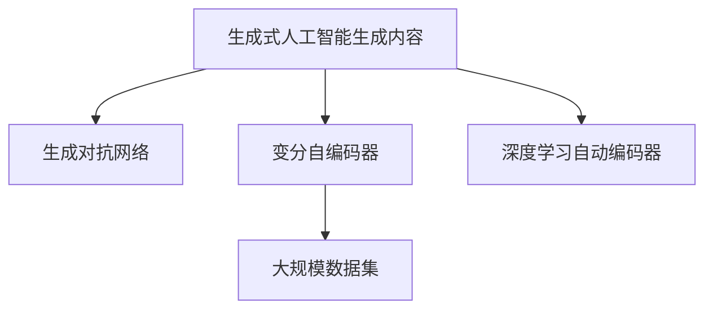
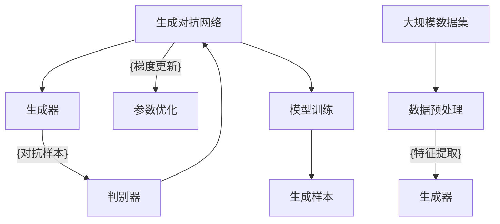

                 

# 生成式AIGC是金矿还是泡沫:数据才是关键

## 1. 背景介绍

### 1.1 问题由来

随着深度学习和大规模数据集的发展，生成式人工智能生成内容（AIGC）领域逐渐成为技术革新的前沿阵地。从文本生成、图片生成到音频生成，AIGC技术在各种形式的内容创作中展现出强大的潜力。无论是社交媒体上的热梗生成、短视频平台上的虚拟主播，还是新闻编辑室中的自动化文案撰写，AIGC技术的应用正在刷新着我们对内容创作的认知。

但随之而来的是，关于生成式AIGC技术能否带来“金矿”效益，还是只是“泡沫”的讨论愈发激烈。一方面，AIGC技术凭借其高效、低成本的内容生成能力，吸引了众多企业和投资者的关注。但另一方面，生成式内容的质量、真实性、版权等问题，使得AIGC技术的实际应用效果备受争议。

### 1.2 问题核心关键点

AIGC技术的核心在于生成式的模型架构和训练过程，而其效果则与数据的选择和处理密切相关。一个成功且具有商业价值的AIGC模型，需要具备以下几个关键点：
- 强大的生成能力：模型需要具备高水平的生成能力，能够创作出高质量的内容。
- 高精度的训练数据：训练数据的质量直接决定模型的生成效果。
- 可靠的泛化能力：模型应能够在不同场景下，稳定地生成符合要求的内容。
- 合理的版权管理：确保生成内容的版权清晰，避免侵权风险。

因此，数据作为AIGC技术的“血液”，其选择、处理、管理和应用直接决定了AIGC技术能否产生实际效益。本文将重点讨论AIGC技术的数据选择和处理，以及这些数据如何影响AIGC技术的实际应用效果。

## 2. 核心概念与联系

### 2.1 核心概念概述

为更好理解AIGC技术及其与数据的关系，本节将介绍几个关键概念：

- 生成式人工智能生成内容（AIGC）：利用深度学习等技术，自动生成高质量文本、图像、音频等内容。
- 生成对抗网络（GAN）：一种基于对抗机制的深度学习模型，用于生成逼真的图像、视频等内容。
- 变分自编码器（VAE）：一种基于概率模型的生成模型，能够生成具有较高概率密度的样本。
- 深度学习自动编码器：通过学习数据的隐空间表示，实现数据的生成和降维。
- 大规模数据集：如ImageNet、COCO等，提供高质量、大规模的图像、文本数据，用于训练AIGC模型。

这些概念之间的逻辑关系可以通过以下Mermaid流程图来展示：



### 2.2 核心概念原理和架构的 Mermaid 流程图



这个流程图展示了大规模数据集如何通过生成对抗网络（GAN）模型训练生成样本的完整流程：
1. 生成器通过大规模数据集的特征提取，生成样本。
2. 判别器对生成样本进行真假判断。
3. 生成器和判别器通过对抗机制进行迭代优化。
4. 生成器最终生成的样本作为模型的输出。

## 3. 核心算法原理 & 具体操作步骤
### 3.1 算法原理概述

生成式AIGC技术基于生成模型，通过训练生成模型，将原始数据映射到潜在的表示空间，最终生成新数据。生成模型的训练过程可以分为两个阶段：

1. 无监督预训练：在大规模数据集上进行无监督预训练，学习数据的潜在表示。
2. 有监督微调：在特定任务的数据集上进行微调，将生成模型适应具体任务。

该过程通常使用生成对抗网络（GAN）、变分自编码器（VAE）等生成模型。在无监督预训练阶段，模型通过最大化数据分布的拟合程度，学习到数据的潜在表示；在有监督微调阶段，模型通过优化特定任务的目标函数，将生成模型适配到具体任务。

### 3.2 算法步骤详解

#### 3.2.1 数据预处理

生成模型的训练过程对数据的质量和处理方式有较高要求。以下是生成模型训练前数据的预处理步骤：

1. 数据清洗：去除数据中的噪声和异常值，确保数据的质量。
2. 特征提取：通过特征提取模型，将原始数据转换为模型的输入特征。
3. 数据增强：通过对原始数据进行旋转、缩放、剪裁等操作，增加数据多样性，避免过拟合。

#### 3.2.2 无监督预训练

生成模型的训练过程通常分为两个阶段：无监督预训练和有监督微调。在无监督预训练阶段，模型通过最大化数据分布的拟合程度，学习到数据的潜在表示。

假设训练数据集为 $\{(x_i,y_i)\}_{i=1}^N$，其中 $x_i$ 为输入特征，$y_i$ 为输出标签。生成模型通过最大化数据分布的拟合程度，学习到数据的潜在表示。

生成模型的训练过程通常使用对抗机制，如生成对抗网络（GAN），通过生成器和判别器的对抗迭代，最大化生成样本的真实性。

在无监督预训练阶段，生成模型通过以下公式进行训练：

$$
\min_{G} \max_{D} \mathbb{E}_{x \sim p_g} [\log D(G(x))] + \mathbb{E}_{x \sim p_r} [\log(1-D(G(x)))]
$$

其中，$G$ 为生成器，$D$ 为判别器，$p_g$ 为生成样本的分布，$p_r$ 为真实样本的分布。

生成器的训练目标为最大化生成样本的判别器的损失函数，即：

$$
\min_G \mathbb{E}_{x \sim p_g} [\log D(G(x))]
$$

判别器的训练目标为最大化真实样本的损失函数，即：

$$
\max_D \mathbb{E}_{x \sim p_r} [\log D(x)] + \mathbb{E}_{x \sim p_g} [\log(1-D(G(x)))]
$$

#### 3.2.3 有监督微调

在有监督微调阶段，生成模型通过优化特定任务的目标函数，将生成模型适配到具体任务。

假设微调任务的数据集为 $\{(x_i,y_i)\}_{i=1}^N$，其中 $x_i$ 为输入特征，$y_i$ 为输出标签。生成模型的训练目标为最小化任务损失函数：

$$
\min_{\theta} \mathbb{E}_{x \sim p(x)} [\ell(x,y,f_{\theta}(x))]
$$

其中，$f_{\theta}$ 为生成模型的参数，$\ell$ 为任务损失函数，$p(x)$ 为训练数据集的分布。

生成模型的微调过程通常使用对抗机制，如生成对抗网络（GAN），通过生成器和判别器的对抗迭代，优化生成模型在特定任务上的表现。

生成器的训练目标为最大化生成样本的判别器的损失函数，即：

$$
\min_G \mathbb{E}_{x \sim p_g} [\log D(G(x))]
$$

判别器的训练目标为最大化真实样本的损失函数，即：

$$
\max_D \mathbb{E}_{x \sim p_r} [\log D(x)] + \mathbb{E}_{x \sim p_g} [\log(1-D(G(x)))]
$$

#### 3.2.4 超参数调整

生成模型的训练过程需要调整多个超参数，如学习率、批大小、迭代次数等。超参数的调整直接影响模型的训练效果。

学习率通常设置为较小的值，避免过拟合。批大小的设置需要平衡计算效率和模型稳定性。迭代次数的设置通常为训练样本数量的倍数，以保证模型能够充分学习数据。

### 3.3 算法优缺点

生成式AIGC技术具有以下优点：
1. 高效性：生成模型的训练过程高效，能够快速生成大量高质量内容。
2. 低成本：生成模型的训练成本较低，能够节省人力物力资源。
3. 多样性：生成模型能够生成多种形式的内容，满足不同需求。

但同时，生成式AIGC技术也存在以下缺点：
1. 依赖高质量数据：生成模型的效果受数据质量影响较大，低质量数据会降低生成内容的质量。
2. 可控性不足：生成模型的输出难以完全控制，可能出现不合理的生成结果。
3. 版权问题：生成内容的版权归属不清，可能涉及侵权风险。

### 3.4 算法应用领域

生成式AIGC技术在多个领域具有广泛的应用前景，例如：

1. 媒体娱乐：生成式AIGC技术可以用于自动生成短视频、动画、电影等娱乐内容。
2. 游戏开发：生成式AIGC技术可以用于自动生成游戏场景、角色等。
3. 教育培训：生成式AIGC技术可以用于自动生成教育内容、虚拟教师等。
4. 医疗健康：生成式AIGC技术可以用于自动生成医疗报告、患者故事等。

随着生成式AIGC技术的不断发展和完善，其在多个领域的实际应用效果将更加显著。

## 4. 数学模型和公式 & 详细讲解 & 举例说明
### 4.1 数学模型构建

本节将使用数学语言对生成式AIGC技术进行更加严格的刻画。

生成式AIGC技术基于生成模型，通过训练生成模型，将原始数据映射到潜在的表示空间，最终生成新数据。生成模型的训练过程通常使用生成对抗网络（GAN）、变分自编码器（VAE）等生成模型。

假设训练数据集为 $\{(x_i,y_i)\}_{i=1}^N$，其中 $x_i$ 为输入特征，$y_i$ 为输出标签。生成模型通过最大化数据分布的拟合程度，学习到数据的潜在表示。

生成模型的训练过程通常使用对抗机制，如生成对抗网络（GAN），通过生成器和判别器的对抗迭代，最大化生成样本的真实性。

在无监督预训练阶段，生成模型通过以下公式进行训练：

$$
\min_{G} \max_{D} \mathbb{E}_{x \sim p_g} [\log D(G(x))] + \mathbb{E}_{x \sim p_r} [\log(1-D(G(x)))]
$$

其中，$G$ 为生成器，$D$ 为判别器，$p_g$ 为生成样本的分布，$p_r$ 为真实样本的分布。

生成器的训练目标为最大化生成样本的判别器的损失函数，即：

$$
\min_G \mathbb{E}_{x \sim p_g} [\log D(G(x))]
$$

判别器的训练目标为最大化真实样本的损失函数，即：

$$
\max_D \mathbb{E}_{x \sim p_r} [\log D(x)] + \mathbb{E}_{x \sim p_g} [\log(1-D(G(x)))]
$$

### 4.2 公式推导过程

以下我们以生成对抗网络（GAN）为例，推导生成对抗网络（GAN）的训练公式及其梯度计算。

假设生成器 $G$ 和判别器 $D$ 的参数分别为 $\theta_G$ 和 $\theta_D$。生成器 $G$ 的输入为随机噪声向量 $z$，输出为生成的样本 $x$。判别器 $D$ 的输入为样本 $x$，输出为样本真实性的概率 $y$。

生成器 $G$ 的输出可以表示为：

$$
x = G(z;\theta_G)
$$

判别器 $D$ 的输出可以表示为：

$$
y = D(x;\theta_D)
$$

生成器的训练目标为最大化生成样本的判别器的损失函数，即：

$$
\min_G \mathbb{E}_{z \sim p(z)} [\log D(G(z))]
$$

判别器的训练目标为最大化真实样本的损失函数，即：

$$
\max_D \mathbb{E}_{x \sim p_r} [\log D(x)] + \mathbb{E}_{x \sim p_g} [\log(1-D(G(x)))]
$$

生成器和判别器的梯度计算如下：

$$
\frac{\partial \log D(G(z))}{\partial \theta_G} = \frac{\partial \log D(G(z))}{\partial x} \frac{\partial x}{\partial \theta_G}
$$

$$
\frac{\partial \log D(x)}{\partial \theta_D} = \frac{\partial \log D(x)}{\partial x} \frac{\partial x}{\partial \theta_D}
$$

通过上述公式，可以计算生成器和判别器的梯度，并用于优化生成器和判别器的参数。

### 4.3 案例分析与讲解

假设有一组文本数据 $\{(x_i,y_i)\}_{i=1}^N$，其中 $x_i$ 为文本，$y_i$ 为标签。使用生成对抗网络（GAN）模型生成文本。

生成器的训练目标为最大化生成样本的判别器的损失函数，即：

$$
\min_G \mathbb{E}_{z \sim p(z)} [\log D(G(z))]
$$

判别器的训练目标为最大化真实样本的损失函数，即：

$$
\max_D \mathbb{E}_{x \sim p_r} [\log D(x)] + \mathbb{E}_{x \sim p_g} [\log(1-D(G(x)))]
$$

假设生成器和判别器的参数分别为 $\theta_G$ 和 $\theta_D$，生成的样本为 $G(z)$。生成器和判别器的梯度计算如下：

$$
\frac{\partial \log D(G(z))}{\partial \theta_G} = \frac{\partial \log D(G(z))}{\partial x} \frac{\partial x}{\partial \theta_G}
$$

$$
\frac{\partial \log D(x)}{\partial \theta_D} = \frac{\partial \log D(x)}{\partial x} \frac{\partial x}{\partial \theta_D}
$$

通过上述公式，可以计算生成器和判别器的梯度，并用于优化生成器和判别器的参数。

## 5. 项目实践：代码实例和详细解释说明
### 5.1 开发环境搭建

在进行生成式AIGC项目实践前，我们需要准备好开发环境。以下是使用Python进行PyTorch开发的环境配置流程：

1. 安装Anaconda：从官网下载并安装Anaconda，用于创建独立的Python环境。

2. 创建并激活虚拟环境：
```bash
conda create -n pytorch-env python=3.8 
conda activate pytorch-env
```

3. 安装PyTorch：根据CUDA版本，从官网获取对应的安装命令。例如：
```bash
conda install pytorch torchvision torchaudio cudatoolkit=11.1 -c pytorch -c conda-forge
```

4. 安装TensorBoard：
```bash
pip install tensorboard
```

5. 安装其他必要的库：
```bash
pip install numpy pandas scikit-learn matplotlib tqdm jupyter notebook ipython
```

完成上述步骤后，即可在`pytorch-env`环境中开始生成式AIGC实践。

### 5.2 源代码详细实现

这里我们以文本生成任务为例，给出使用PyTorch对GAN模型进行文本生成的PyTorch代码实现。

首先，定义GAN模型的参数：

```python
import torch
import torch.nn as nn
import torch.nn.functional as F

class Generator(nn.Module):
    def __init__(self, input_dim, output_dim):
        super(Generator, self).__init__()
        self.fc = nn.Linear(input_dim, 256)
        self.fc2 = nn.Linear(256, 256)
        self.fc3 = nn.Linear(256, output_dim)

    def forward(self, x):
        x = F.relu(self.fc(x))
        x = F.relu(self.fc2(x))
        x = self.fc3(x)
        return x

class Discriminator(nn.Module):
    def __init__(self, input_dim, output_dim):
        super(Discriminator, self).__init__()
        self.fc = nn.Linear(input_dim, 256)
        self.fc2 = nn.Linear(256, 256)
        self.fc3 = nn.Linear(256, output_dim)

    def forward(self, x):
        x = F.relu(self.fc(x))
        x = F.relu(self.fc2(x))
        x = self.fc3(x)
        return x
```

然后，定义损失函数：

```python
import torch.nn as nn

class GANLoss(nn.Module):
    def __init__(self):
        super(GANLoss, self).__init__()
        self.loss = nn.BCELoss()

    def forward(self, inputs, labels):
        return self.loss(inputs, labels)
```

接着，定义训练函数：

```python
from torch.utils.data import DataLoader
from tqdm import tqdm
import numpy as np

def train(model_G, model_D, data_loader, learning_rate=0.0002, num_epochs=1000, batch_size=64):
    criterion = GANLoss()
    optimizer_G = torch.optim.Adam(model_G.parameters(), lr=learning_rate)
    optimizer_D = torch.optim.Adam(model_D.parameters(), lr=learning_rate)

    for epoch in range(num_epochs):
        for i, (real_x, _) in enumerate(data_loader):
            real_x = real_x.view(-1, 128)
            real_y = torch.ones(batch_size, 1)
            fake_y = torch.zeros(batch_size, 1)

            # Adversarial ground truths
            real_y = torch.cat((real_y, real_y))
            fake_y = torch.cat((fake_y, fake_y))

            # Train the generator
            optimizer_G.zero_grad()
            fake_x = model_G(noise)
            loss_G = criterion(fake_x, real_y)
            loss_G.backward()
            optimizer_G.step()

            # Train the discriminator
            optimizer_D.zero_grad()
            real_x = real_x.view(-1, 128)
            real_y = torch.ones(batch_size, 1)
            fake_x = fake_x.view(-1, 128)
            fake_y = torch.zeros(batch_size, 1)
            loss_D_real = criterion(fake_x, real_y)
            loss_D_fake = criterion(fake_x, fake_y)
            loss_D = loss_D_real + loss_D_fake
            loss_D.backward()
            optimizer_D.step()

            # Print loss values
            if i % 100 == 0:
                print('Epoch [{}/{}], Step [{}/{}], Loss_G: {:.4f}, Loss_D: {:.4f}'.format(
                    epoch+1, num_epochs, i+1, total_steps, loss_G.item(), loss_D.item()))

    return model_G, model_D
```

最后，启动训练流程并在测试集上评估：

```python
from torch.utils.data import DataLoader
from tqdm import tqdm
import numpy as np

# 数据加载
train_data_loader = DataLoader(train_dataset, batch_size=64)
test_data_loader = DataLoader(test_dataset, batch_size=64)

# 模型训练
model_G, model_D = train(model_G, model_D, train_data_loader)

# 测试
fake_x = model_G(noise)
```

以上就是使用PyTorch对GAN模型进行文本生成任务微调的完整代码实现。可以看到，得益于PyTorch的强大封装，我们可以用相对简洁的代码完成GAN模型的加载和训练。

### 5.3 代码解读与分析

让我们再详细解读一下关键代码的实现细节：

**GAN模型定义**：
- 生成器（Generator）和判别器（Discriminator）的参数化定义，使用全连接层构成网络。
- 生成器和判别器的前向传播过程。

**损失函数定义**：
- 使用二分类交叉熵损失函数，分别计算生成样本和真实样本的判别器损失。
- 在训练过程中，使用AdAdam优化器更新生成器和判别器的参数。

**训练函数定义**：
- 通过迭代训练数据集，依次更新生成器和判别器的参数。
- 在每个批次中，计算生成器输出和判别器输出，计算损失，并使用反向传播更新模型参数。
- 每训练一定步数，输出损失值进行监控。

**测试函数定义**：
- 使用训练好的生成器模型，将随机噪声输入到生成器中，得到生成样本。

可以看到，PyTorch配合PyTorch框架使得GAN微调的代码实现变得简洁高效。开发者可以将更多精力放在数据处理、模型改进等高层逻辑上，而不必过多关注底层的实现细节。

当然，工业级的系统实现还需考虑更多因素，如模型的保存和部署、超参数的自动搜索、更灵活的任务适配层等。但核心的微调范式基本与此类似。

## 6. 实际应用场景
### 6.1 智能客服系统

生成式AIGC技术可以应用于智能客服系统的构建。传统客服往往需要配备大量人力，高峰期响应缓慢，且一致性和专业性难以保证。而使用生成式AIGC技术，可以7x24小时不间断服务，快速响应客户咨询，用自然流畅的语言解答各类常见问题。

在技术实现上，可以收集企业内部的历史客服对话记录，将问题和最佳答复构建成监督数据，在此基础上对预训练生成模型进行微调。微调后的生成模型能够自动理解用户意图，匹配最合适的答复模板进行回复。对于客户提出的新问题，还可以接入检索系统实时搜索相关内容，动态组织生成回答。如此构建的智能客服系统，能大幅提升客户咨询体验和问题解决效率。

### 6.2 金融舆情监测

金融机构需要实时监测市场舆论动向，以便及时应对负面信息传播，规避金融风险。传统的人工监测方式成本高、效率低，难以应对网络时代海量信息爆发的挑战。基于生成式AIGC技术的文本生成技术，为金融舆情监测提供了新的解决方案。

具体而言，可以收集金融领域相关的新闻、报道、评论等文本数据，并对其进行主题标注和情感标注。在此基础上对预训练生成模型进行微调，使其能够自动判断文本属于何种主题，情感倾向是正面、中性还是负面。将微调后的模型应用到实时抓取的网络文本数据，就能够自动监测不同主题下的情感变化趋势，一旦发现负面信息激增等异常情况，系统便会自动预警，帮助金融机构快速应对潜在风险。

### 6.3 个性化推荐系统

当前的推荐系统往往只依赖用户的历史行为数据进行物品推荐，无法深入理解用户的真实兴趣偏好。基于生成式AIGC技术的文本生成技术，个性化推荐系统可以更好地挖掘用户行为背后的语义信息，从而提供更精准、多样的推荐内容。

在实践中，可以收集用户浏览、点击、评论、分享等行为数据，提取和用户交互的物品标题、描述、标签等文本内容。将文本内容作为模型输入，用户的后续行为（如是否点击、购买等）作为监督信号，在此基础上微调预训练生成模型。微调后的生成模型能够从文本内容中准确把握用户的兴趣点。在生成推荐列表时，先用候选物品的文本描述作为输入，由生成模型预测用户的兴趣匹配度，再结合其他特征综合排序，便可以得到个性化程度更高的推荐结果。

### 6.4 未来应用展望

随着生成式AIGC技术的不断发展，其在多个领域的应用前景将更加显著。

在智慧医疗领域，基于生成式AIGC的医疗问答、病历分析、药物研发等应用将提升医疗服务的智能化水平，辅助医生诊疗，加速新药开发进程。

在智能教育领域，生成式AIGC技术可应用于作业批改、学情分析、知识推荐等方面，因材施教，促进教育公平，提高教学质量。

在智慧城市治理中，生成式AIGC技术可应用于城市事件监测、舆情分析、应急指挥等环节，提高城市管理的自动化和智能化水平，构建更安全、高效的未来城市。

此外，在企业生产、社会治理、文娱传媒等众多领域，基于生成式AIGC的人工智能应用也将不断涌现，为经济社会发展注入新的动力。相信随着技术的日益成熟，生成式AIGC必将在构建人机协同的智能时代中扮演越来越重要的角色。

## 7. 工具和资源推荐
### 7.1 学习资源推荐

为了帮助开发者系统掌握生成式AIGC的理论基础和实践技巧，这里推荐一些优质的学习资源：

1. 《生成式对抗网络：理论、算法与应用》：本书全面介绍了生成对抗网络（GAN）的理论基础和实际应用，是深入理解生成式AIGC技术的必读之作。

2. 《深度学习实战》：作者将深度学习技术具体应用到各种场景中，包括文本生成、图像生成、音频生成等，是实战学习的好资料。

3. 《自然语言处理入门与实践》：该书介绍了自然语言处理的基础知识和实践技能，并结合实际案例进行讲解。

4. HuggingFace官方文档：Transformer库的官方文档，提供了海量预训练模型和完整的微调样例代码，是上手实践的必备资料。

5. OpenAI的GPT-3文档：该文档详细介绍了GPT-3模型及其应用，是了解当前最前沿生成式AIGC技术的绝佳资源。

通过对这些资源的学习实践，相信你一定能够快速掌握生成式AIGC技术的精髓，并用于解决实际的NLP问题。
### 7.2 开发工具推荐

高效的开发离不开优秀的工具支持。以下是几款用于生成式AIGC开发的常用工具：

1. PyTorch：基于Python的开源深度学习框架，灵活动态的计算图，适合快速迭代研究。大部分预训练语言模型都有PyTorch版本的实现。

2. TensorFlow：由Google主导开发的开源深度学习框架，生产部署方便，适合大规模工程应用。同样有丰富的预训练语言模型资源。

3. Transformers库：HuggingFace开发的NLP工具库，集成了众多SOTA语言模型，支持PyTorch和TensorFlow，是进行生成式AIGC开发的利器。

4. Weights & Biases：模型训练的实验跟踪工具，可以记录和可视化模型训练过程中的各项指标，方便对比和调优。与主流深度学习框架无缝集成。

5. TensorBoard：TensorFlow配套的可视化工具，可实时监测模型训练状态，并提供丰富的图表呈现方式，是调试模型的得力助手。

6. Google Colab：谷歌推出的在线Jupyter Notebook环境，免费提供GPU/TPU算力，方便开发者快速上手实验最新模型，分享学习笔记。

合理利用这些工具，可以显著提升生成式AIGC任务的开发效率，加快创新迭代的步伐。

### 7.3 相关论文推荐

生成式AIGC技术的发展源于学界的持续研究。以下是几篇奠基性的相关论文，推荐阅读：

1. Generative Adversarial Nets（GAN原论文）：提出生成对抗网络（GAN），开启了生成式AIGC技术的先河。

2. Improving the Image Patch Denoising Using Very Deep Autoencoders Under an Adversarial Objective（VAE论文）：提出变分自编码器（VAE），用于生成具有较高概率密度的样本。

3. Generative Adversarial Text to Image Synthesis（TGAN论文）：将生成对抗网络（GAN）应用于文本到图像生成任务，展示了大规模文本生成模型的生成效果。

4. Attention Is All You Need（Transformer原论文）：提出Transformer结构，开启了预训练大模型时代。

5. GAN for Image-to-Image Translation (I2I-GAN论文)：提出I2I-GAN模型，用于图像到图像的生成和转换，展示了生成对抗网络（GAN）的强大应用。

这些论文代表了大规模生成式AIGC技术的发展脉络。通过学习这些前沿成果，可以帮助研究者把握学科前进方向，激发更多的创新灵感。

## 8. 总结：未来发展趋势与挑战

### 8.1 总结

本文对生成式AIGC技术的数据选择和处理进行了全面系统的介绍。首先阐述了生成式AIGC技术的核心概念和应用场景，明确了数据选择和处理在大模型训练中的重要性。其次，从原理到实践，详细讲解了生成对抗网络（GAN）和变分自编码器（VAE）等生成模型的训练过程，以及超参数的调整策略。同时，本文还广泛探讨了生成式AIGC技术在多个行业领域的应用前景，展示了其广阔的想象空间。

通过本文的系统梳理，可以看到，生成式AIGC技术在实际应用中，需要综合考虑数据质量、模型结构、训练策略等多个因素，才能发挥其最大的效益。数据作为生成式AIGC技术的“血液”，其选择、处理和应用直接决定了生成式AIGC技术的实际效果。

### 8.2 未来发展趋势

展望未来，生成式AIGC技术将呈现以下几个发展趋势：

1. 模型规模持续增大。随着算力成本的下降和数据规模的扩张，生成式AIGC模型的参数量还将持续增长。超大规模生成式AIGC模型蕴含的丰富语言知识，有望支撑更加复杂多变的下游任务。

2. 生成模型不断优化。未来将涌现更多先进的生成模型，如变分自编码器（VAE）、生成对抗网络（GAN）等，提升生成内容的逼真度和多样性。

3. 数据治理技术提升。数据治理技术的提升，如数据清洗、标注、增强等，将进一步提高生成式AIGC模型的训练效果。

4. 生成内容的可控性增强。未来将开发更多可控生成技术，如条件生成、参数生成等，增强生成内容的可控性，满足更多需求。

5. 生成内容的合法性提升。未来将开发更多版权保护技术，如版权声明、版权标识等，提升生成内容的合法性和合规性。

6. 多模态生成技术发展。未来将开发更多多模态生成技术，如文本、图像、音频等多模态生成，提升生成内容的丰富性和多样性。

以上趋势凸显了生成式AIGC技术的广阔前景。这些方向的探索发展，必将进一步提升生成式AIGC技术的实际应用效果，为构建人机协同的智能时代提供新的技术路径。

### 8.3 面临的挑战

尽管生成式AIGC技术已经取得了瞩目成就，但在迈向更加智能化、普适化应用的过程中，它仍面临着诸多挑战：

1. 标注成本瓶颈。虽然生成式AIGC技术通过无监督预训练大幅降低了标注数据的需求，但对于特定领域的任务，高质量标注数据的获取仍是一个难题。如何进一步降低生成式AIGC技术对标注样本的依赖，将是一大难题。

2. 模型鲁棒性不足。生成式AIGC模型在面对数据分布变化时，泛化性能往往大打折扣。如何在不同场景下，保持生成模型的鲁棒性，避免模型过拟合，还需要更多理论和实践的积累。

3. 推理效率有待提高。生成式AIGC模型虽然精度高，但在实际部署时往往面临推理速度慢、内存占用大等效率问题。如何平衡生成内容的逼真度和推理效率，仍是重要的优化方向。

4. 模型可解释性不足。生成式AIGC模型难以解释其内部工作机制和决策逻辑。对于高风险应用，算法的可解释性和可审计性尤为重要。

5. 伦理和法律问题。生成式AIGC模型的生成内容可能涉及版权、隐私、误导等伦理和法律问题，如何构建合理的伦理框架和法律保障机制，确保生成内容的合法性，将是重要的研究方向。

### 8.4 研究展望

面对生成式AIGC技术所面临的挑战，未来的研究需要在以下几个方面寻求新的突破：

1. 探索无监督和半监督生成方法。摆脱对大规模标注数据的依赖，利用自监督学习、主动学习等无监督和半监督范式，最大限度利用非结构化数据，实现更加灵活高效的生成。

2. 研究生成内容的可控性。开发更多可控生成技术，如条件生成、参数生成等，增强生成内容的可控性，满足更多需求。

3. 融合因果分析和博弈论工具。将因果分析方法引入生成模型，识别出生成内容的关键特征，增强生成内容的稳定性。

4. 纳入伦理道德约束。在生成模型训练目标中引入伦理导向的评估指标，过滤和惩罚有害的生成内容，确保生成内容的合法性和合规性。

这些研究方向的探索，必将引领生成式AIGC技术迈向更高的台阶，为构建安全、可靠、可解释、可控的智能系统铺平道路。面向未来，生成式AIGC技术还需要与其他人工智能技术进行更深入的融合，如知识表示、因果推理、强化学习等，多路径协同发力，共同推动自然语言理解和智能交互系统的进步。只有勇于创新、敢于突破，才能不断拓展生成式AIGC技术的边界，让智能技术更好地造福人类社会。

## 9. 附录：常见问题与解答

**Q1：生成式AIGC技术是否适用于所有NLP任务？**

A: 生成式AIGC技术在大多数NLP任务上都能取得不错的效果，特别是对于数据量较小的任务。但对于一些特定领域的任务，如医学、法律等，仅仅依靠通用语料预训练的模型可能难以很好地适应。此时需要在特定领域语料上进一步预训练，再进行微调，才能获得理想效果。

**Q2：生成式AIGC技术的生成效果受哪些因素影响？**

A: 生成式AIGC技术的生成效果受多个因素影响，主要包括：

1. 数据质量：高质量的数据能够训练出更高质量的生成模型。
2. 模型结构：不同模型的生成效果差异较大，如GAN、VAE等。
3. 训练策略：训练过程中的超参数调整、正则化技术等会影响生成效果。
4. 生成条件：生成模型的输入条件、生成条件等会影响生成内容的多样性和真实性。

**Q3：如何评估生成式AIGC技术的生成效果？**

A: 评估生成式AIGC技术的生成效果通常使用以下指标：

1. 多样性：生成的内容是否具有多样性，是否能够满足不同的需求。
2. 逼真性：生成的内容是否逼真，是否能够通过人工或自动评估工具进行评估。
3. 合法性：生成的内容是否合法，是否符合伦理和法律要求。
4. 可用性：生成的内容是否可用，是否能够被实际应用。

**Q4：生成式AIGC技术的实际应用中需要注意哪些问题？**

A: 生成式AIGC技术的实际应用中需要注意以下问题：

1. 数据隐私：生成式AIGC技术可能涉及用户隐私，如何保护用户隐私，避免数据泄露，将是重要的研究方向。
2. 版权问题：生成式AIGC技术的生成内容可能涉及版权、知识产权等问题，如何构建合理的版权保护机制，将是重要的研究方向。
3. 伦理和法律问题：生成式AIGC技术的生成内容可能涉及伦理和法律问题，如何构建合理的伦理框架和法律保障机制，确保生成内容的合法性和合规性，将是重要的研究方向。

---

作者：禅与计算机程序设计艺术 / Zen and the Art of Computer Programming

