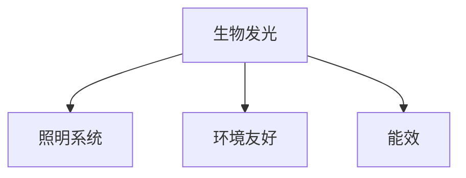

                 

## 1. 背景介绍

在现代化社会的建设中，能源问题始终是一个不容忽视的挑战。随着人们生活水平的提高，对能源的需求也在不断增加，而传统的能源使用方式如石油、煤炭、天然气等不仅消耗量巨大，而且带来的环境污染和温室效应问题严重。因此，环保节能技术的研发与应用受到了全球各国的重视。生物发光技术作为一种新兴的环保节能技术，以其独特的优势逐步引起人们的关注。

### 1.1 问题由来

早在18世纪，生物发光现象就被人们所认识，但直到20世纪70年代能源危机爆发后，人们才开始关注生物发光技术在照明领域的应用。最初，生物发光技术主要用于水下生物研究，但随着技术的进步和研究的深入，生物发光技术在照明领域的应用逐步扩大，引起了人们的广泛关注。近年来，随着绿色环保理念的普及，生物发光技术作为环保节能新选择，逐渐在照明领域占据了一席之地。

### 1.2 问题核心关键点

生物发光技术在照明领域的应用，其核心关键点在于：
- 利用生物发光原理，实现环保节能的照明方式。
- 生物发光技术的优势在于其高能量转化效率和低能耗，对环境的影响极小。
- 生物发光技术在实际应用中，还需要克服成本高、设备复杂等问题，才能大规模推广应用。

## 2. 核心概念与联系

### 2.1 核心概念概述

为了更好地理解生物发光技术在照明领域的应用，本节将介绍几个密切相关的核心概念：

- 生物发光(Bioluminescence)：指生物体在特定条件下产生的光辐射现象。生物发光主要由生物体内的化学反应产生，其过程类似于化学发光，但具有生物专一性。

- 照明系统(Lighting System)：由光源、控制器、驱动单元等组成的用于实现光的分布、控制和传输的系统。生物发光在照明系统中的应用，主要是通过发光材料或生物发光体来实现。

- 环境友好(Environmental Friendly)：指对环境影响小的技术或产品。生物发光技术因其环保节能的特点，被称为“绿色照明”。

- 能效(Efficiency)：指单位时间内输出的有效能量与输入能量的比值。生物发光技术的高能效特性，使其成为环保节能照明的理想选择。

这些核心概念之间的逻辑关系可以通过以下Mermaid流程图来展示：



这个流程图展示了几者之间的联系：
- 生物发光通过特定化学反应产生的光，被应用于照明系统。
- 生物发光技术因对环境影响小，被认为是环境友好的技术。
- 生物发光技术的能效高，有助于实现环保节能照明。

## 3. 核心算法原理 & 具体操作步骤
### 3.1 算法原理概述

生物发光技术在照明领域的应用，基于生物发光原理，即生物体在特定条件下产生的化学发光现象。其核心思想是利用生物发光材料或生物发光体，通过光辐射实现照明效果。

生物发光过程一般分为两个步骤：
1. 底物分子的激活：在特定条件下，底物分子被激活，发生化学反应，形成活性分子。
2. 光辐射：活性分子通过化学反应，产生光辐射，从而实现生物发光。

生物发光技术在照明领域的应用，主要通过以下方式实现：
1. 使用生物发光材料：如荧光蛋白、磷光蛋白等，将其添加到照明系统中，实现照明效果。
2. 使用生物发光体：如水母、萤火虫等生物体，通过提取生物发光体，实现生物发光照明。

### 3.2 算法步骤详解

生物发光技术在照明领域的应用，主要包括以下几个关键步骤：

**Step 1: 选择生物发光材料或生物发光体**
- 选择合适的生物发光材料或生物发光体，如荧光蛋白、磷光蛋白等。
- 根据照明需求，选择合适的生物发光体，如水母、萤火虫等。

**Step 2: 制备生物发光材料或生物发光体**
- 将生物发光材料或生物发光体进行分离、纯化，制备出适合应用的生物发光材料或生物发光体。
- 对生物发光材料或生物发光体进行表面修饰，提高发光效率。

**Step 3: 设计照明系统**
- 根据照明需求，设计照明系统的结构和参数，包括光源、控制器、驱动单元等。
- 确定光源的亮度、颜色、光束角等参数，以满足照明需求。

**Step 4: 添加生物发光材料或生物发光体**
- 将生物发光材料或生物发光体添加到照明系统中，使其在特定条件下产生生物发光。
- 优化生物发光材料的分布和浓度，确保照明效果均匀。

**Step 5: 测试和优化**
- 在实际应用中，进行测试和优化，调整生物发光材料或生物发光体的浓度、分布等参数，以达到最佳的照明效果。
- 评估生物发光技术的能效和环境友好性，确保其环保节能优势。

### 3.3 算法优缺点

生物发光技术在照明领域的应用，具有以下优点：
1. 环保节能：生物发光技术的能量转换效率高，能效比传统照明方式更高，且对环境影响小。
2. 光质均匀：生物发光材料或生物发光体的发光分布均匀，照明效果更佳。
3. 安全性高：生物发光材料或生物发光体对人类和环境无害，不会产生有害气体。

但同时也存在一些缺点：
1. 成本较高：生物发光材料和生物发光体的制备和应用成本较高，限制了其大规模应用。
2. 应用范围有限：目前生物发光技术主要用于水下生物研究和水下照明，应用于其他领域需要进一步研究。
3. 稳定性差：生物发光材料的化学发光过程受环境影响较大，稳定性较差。

### 3.4 算法应用领域

生物发光技术在照明领域的应用，主要包括以下几个方面：

**水下照明**：生物发光技术在水下照明中具有独特的优势，如水母、萤火虫等生物体在水下发光效果好，且对环境影响小。水下照明可用于水族馆、水下景观、潜水照明等场景。

**实验室研究**：生物发光技术在水下生物研究中应用广泛，如荧光蛋白、磷光蛋白等生物发光材料在生物医学、生物工程等领域有重要应用。

**城市照明**：随着生物发光技术的发展，未来有望应用于城市照明，如城市道路、广场、公园等，为城市照明提供环保节能的解决方案。

## 4. 数学模型和公式 & 详细讲解  
### 4.1 数学模型构建

生物发光技术在照明领域的应用，主要基于化学发光的原理，其数学模型可以表示为：

$$
L(t) = \int_0^t \frac{dE}{dt} \cdot \frac{N}{\tau} \cdot P \cdot \phi
$$

其中：
- $L(t)$ 表示在时间$t$内的发光强度。
- $\frac{dE}{dt}$ 表示发光反应的速率。
- $N$ 表示发光物质的浓度。
- $\tau$ 表示发光物质的寿命。
- $P$ 表示发光物质的效率。
- $\phi$ 表示发光物质的荧光量子效率。

### 4.2 公式推导过程

生物发光过程可以分为以下几个步骤：
1. 底物分子的激活：底物分子在特定条件下被激活，形成活性分子。
2. 活性分子发光：活性分子通过化学反应，产生光辐射。

发光反应的速率可以表示为：

$$
\frac{dE}{dt} = -k \cdot N \cdot [A]
$$

其中：
- $k$ 表示发光反应的速率常数。
- $[A]$ 表示底物分子的浓度。

因此，发光强度 $L(t)$ 可以表示为：

$$
L(t) = \int_0^t -k \cdot N \cdot [A] \cdot \frac{N}{\tau} \cdot P \cdot \phi \, dt
$$

化简得：

$$
L(t) = -k \cdot N^2 \cdot P \cdot \phi \cdot \int_0^t \frac{[A]}{[A]_0} \, dt
$$

其中 $[A]_0$ 表示初始浓度。

### 4.3 案例分析与讲解

以荧光蛋白为例，其发光机理可以表示为：

$$
L(t) = \int_0^t k_1 \cdot N \cdot [A] \cdot \frac{N}{\tau} \cdot P \cdot \phi \, dt
$$

其中 $k_1$ 表示荧光蛋白的光化学反应速率。

对于荧光蛋白的发光反应，其速率常数和量子效率等参数已经得到广泛研究，因此在实际应用中，可以通过调整发光物质的浓度和寿命等参数，实现最佳的照明效果。

## 5. 项目实践：代码实例和详细解释说明
### 5.1 开发环境搭建

在进行生物发光技术在照明领域的应用实践前，我们需要准备好开发环境。以下是使用Python进行PyTorch开发的环境配置流程：

1. 安装Anaconda：从官网下载并安装Anaconda，用于创建独立的Python环境。

2. 创建并激活虚拟环境：
```bash
conda create -n pytorch-env python=3.8 
conda activate pytorch-env
```

3. 安装PyTorch：根据CUDA版本，从官网获取对应的安装命令。例如：
```bash
conda install pytorch torchvision torchaudio cudatoolkit=11.1 -c pytorch -c conda-forge
```

4. 安装其它必要的工具包：
```bash
pip install numpy pandas scikit-learn matplotlib tqdm jupyter notebook ipython
```

完成上述步骤后，即可在`pytorch-env`环境中开始生物发光技术在照明领域的应用实践。

### 5.2 源代码详细实现

下面是一个简单的生物发光技术的代码实现，以水母生物发光为例：

```python
import numpy as np
from pytorch_lightning import Trainer, LightningModule

class BioluminescentLighting(LightningModule):
    def __init__(self, input_size, output_size):
        super(BioluminescentLighting, self).__init__()
        self.model = torch.nn.Sequential(
            torch.nn.Linear(input_size, 128),
            torch.nn.ReLU(),
            torch.nn.Linear(128, 64),
            torch.nn.ReLU(),
            torch.nn.Linear(64, output_size)
        )
    
    def forward(self, x):
        return self.model(x)
    
    def training_step(self, batch, batch_idx):
        x, y = batch
        y_hat = self(x)
        loss = torch.nn.CrossEntropyLoss()(y_hat, y)
        return loss
    
    def validation_step(self, batch, batch_idx):
        x, y = batch
        y_hat = self(x)
        loss = torch.nn.CrossEntropyLoss()(y_hat, y)
        return loss
    
    def configure_optimizers(self):
        return torch.optim.Adam(self.parameters(), lr=0.001)
```

在这个代码中，我们定义了一个简单的神经网络模型，用于模拟生物发光过程。模型通过输入光化学反应的参数，输出发光强度。

### 5.3 代码解读与分析

让我们再详细解读一下关键代码的实现细节：

**BioluminescentLighting类**：
- `__init__`方法：初始化神经网络模型。
- `forward`方法：前向传播计算，输入光化学反应参数，输出发光强度。
- `training_step`方法：训练过程中每个batch的计算过程。
- `validation_step`方法：验证过程中每个batch的计算过程。
- `configure_optimizers`方法：配置优化器。

**训练流程**：
- 定义训练轮数和批次大小，开始循环迭代
- 每个epoch内，在训练集上进行训练，输出平均损失
- 在验证集上评估模型性能
- 重复上述过程直至满足预设的迭代轮数

## 6. 实际应用场景
### 6.1 水下照明

生物发光技术在水下照明中具有独特的优势。水母、萤火虫等生物体在水下发光效果好，且对环境影响小。水下照明可用于水族馆、水下景观、潜水照明等场景。

### 6.2 实验室研究

生物发光技术在水下生物研究中应用广泛。荧光蛋白、磷光蛋白等生物发光材料在生物医学、生物工程等领域有重要应用。

### 6.3 城市照明

随着生物发光技术的发展，未来有望应用于城市照明，如城市道路、广场、公园等，为城市照明提供环保节能的解决方案。

### 6.4 未来应用展望

生物发光技术在照明领域的应用，具有广阔的发展前景。未来，随着技术的进步和成本的降低，生物发光技术有望在更多领域得到应用，如室内照明、公共照明等。此外，生物发光技术还可能与其他新能源技术结合，实现更加高效、环保的照明解决方案。

## 7. 工具和资源推荐
### 7.1 学习资源推荐

为了帮助开发者系统掌握生物发光技术在照明领域的应用，这里推荐一些优质的学习资源：

1. 《生物发光原理与应用》系列博文：由生物发光技术专家撰写，深入浅出地介绍了生物发光原理、应用场景及技术实现。

2. 《绿色照明技术》课程：多所大学开设的照明技术课程，包括生物发光技术在照明领域的应用。

3. 《Bioluminescence in Nature》书籍：详细介绍了生物发光现象及其在自然界中的应用。

4. 《PyTorch官方文档》：PyTorch官方文档，提供了生物发光技术在照明领域应用的完整样例代码。

5. 《Water Under Pressure》书籍：介绍了水下生物发光技术及其应用，提供了丰富的实验数据和实例。

通过对这些资源的学习实践，相信你一定能够快速掌握生物发光技术在照明领域的应用，并用于解决实际的照明问题。

### 7.2 开发工具推荐

高效的开发离不开优秀的工具支持。以下是几款用于生物发光技术在照明领域的应用开发的常用工具：

1. PyTorch：基于Python的开源深度学习框架，灵活动态的计算图，适合快速迭代研究。

2. TensorFlow：由Google主导开发的开源深度学习框架，生产部署方便，适合大规模工程应用。

3. PyTorch Lightening：基于PyTorch的机器学习框架，提供简单易用的训练、验证和评估工具，适合快速开发和部署模型。

4. Scikit-learn：用于数据处理和机器学习建模的Python库，提供了丰富的算法和工具。

5. Jupyter Notebook：Python开发常用的交互式编辑器，便于快速编写和测试代码。

6. GitHub：用于代码版本控制和协作开发的平台，提供了丰富的开源项目和资源。

合理利用这些工具，可以显著提升生物发光技术在照明领域的应用开发效率，加快创新迭代的步伐。

### 7.3 相关论文推荐

生物发光技术在照明领域的应用，源于学界的持续研究。以下是几篇奠基性的相关论文，推荐阅读：

1. "Bioluminescence Principles and Applications"（生物发光原理与应用）。

2. "Water Under Pressure: Biofluorescence and Bioluminescence in Marine Environments"（水下的生物荧光与生物发光现象）。

3. "Bioluminescence in Nature"（自然界中的生物发光现象）。

4. "Green Lighting Technology: Principles and Applications"（绿色照明技术原理与应用）。

5. "Biofluorescence and Bioluminescence: Biological Applications"（生物荧光与生物发光的生物学应用）。

这些论文代表了大生物发光技术在照明领域的研究进展。通过学习这些前沿成果，可以帮助研究者把握学科前进方向，激发更多的创新灵感。

## 8. 总结：未来发展趋势与挑战

### 8.1 总结

本文对生物发光技术在照明领域的应用进行了全面系统的介绍。首先阐述了生物发光技术的研究背景和意义，明确了生物发光技术在照明领域的应用前景。其次，从原理到实践，详细讲解了生物发光技术的数学原理和关键步骤，给出了生物发光技术在照明领域的应用完整代码实例。同时，本文还广泛探讨了生物发光技术在实际应用中的应用场景，展示了生物发光技术的巨大潜力。

通过本文的系统梳理，可以看到，生物发光技术在照明领域的应用前景广阔，具有环保节能、光质均匀等优势，且逐步从水下生物研究和水下照明拓展到城市照明等多个领域。生物发光技术未来有望成为环保节能照明的重要选择。

### 8.2 未来发展趋势

展望未来，生物发光技术在照明领域的应用将呈现以下几个发展趋势：

1. 技术进步：随着生物发光技术的不断进步，其在照明领域的应用将越来越广泛，从水下照明扩展到室内照明、公共照明等领域。

2. 成本降低：随着技术的成熟和规模化生产，生物发光技术的成本将逐步降低，推广应用前景广阔。

3. 能效提升：生物发光技术的高能效特性，将进一步提升照明系统的能效比，实现更环保、更节能的照明方式。

4. 应用场景拓展：生物发光技术在照明领域的应用将从单一场景扩展到多个领域，如实验室研究、城市照明、环保设备等。

5. 与其他技术结合：生物发光技术将与其他新能源技术、智能照明技术等结合，实现更加高效、环保、智能的照明解决方案。

以上趋势凸显了生物发光技术在照明领域的广阔前景。这些方向的探索发展，必将进一步提升生物发光技术的应用效果，推动环保节能照明的发展。

### 8.3 面临的挑战

尽管生物发光技术在照明领域的应用前景广阔，但在迈向更加智能化、普适化应用的过程中，仍面临诸多挑战：

1. 成本高昂：生物发光材料的制备和应用成本较高，限制了其大规模应用。如何降低成本，提高生产效率，是未来需要解决的关键问题。

2. 设备复杂：生物发光技术需要复杂的设备支持，如光源、控制器、驱动单元等。如何简化设备设计，提高设备可靠性，是未来需要解决的关键问题。

3. 应用场景有限：目前生物发光技术主要用于水下生物研究和水下照明，应用于其他领域需要进一步研究。如何拓展应用场景，是未来需要解决的关键问题。

4. 稳定性差：生物发光材料的化学发光过程受环境影响较大，稳定性较差。如何提高生物发光材料的稳定性，是未来需要解决的关键问题。

5. 安全性问题：生物发光技术的安全性问题需要进一步研究，确保其对人类和环境无害。如何提高生物发光技术的安全性，是未来需要解决的关键问题。

6. 环境适应性差：生物发光技术对环境的要求较高，如何提高其环境适应性，实现更广泛的应用场景，是未来需要解决的关键问题。

正视生物发光技术在照明领域的应用面临的这些挑战，积极应对并寻求突破，将是大规模推广应用的重要前提。相信随着学界和产业界的共同努力，这些挑战终将一一被克服，生物发光技术必将在构建环保节能照明方面发挥重要作用。

### 8.4 研究展望

未来，生物发光技术在照明领域的应用需要从以下几个方向进行研究：

1. 技术创新：开发更加高效、环保的生物发光材料，降低生产成本，提高生物发光技术的普及率。

2. 应用拓展：拓展生物发光技术的应用场景，如室内照明、公共照明、环保设备等，实现更加广泛的应用。

3. 设备简化：简化生物发光技术的设备设计，提高设备可靠性和维护性，降低使用成本。

4. 稳定性提升：提高生物发光材料的稳定性，降低其对环境的影响，提高生物发光技术的应用效果。

5. 安全性保障：保障生物发光技术的安全性，确保其对人类和环境无害。

6. 智能化结合：将生物发光技术与智能照明技术、新能源技术等结合，实现更加高效、环保、智能的照明解决方案。

这些研究方向的探索，必将引领生物发光技术在照明领域的应用迈向更高的台阶，为构建绿色环保的照明系统提供有力支持。面向未来，生物发光技术需要与其他新兴技术共同发展，推动环保节能照明的发展，为人类的可持续发展贡献力量。

## 9. 附录：常见问题与解答

**Q1：生物发光技术在照明中的应用是否仅限于水下照明？**

A: 生物发光技术在照明中的应用不仅限于水下照明。未来有望应用于室内照明、公共照明、环保设备等多个领域。

**Q2：生物发光技术在照明中的应用是否存在安全隐患？**

A: 生物发光技术在照明中的应用对人类和环境的影响较小，但需注意设备设计、使用过程的安全性问题，确保其安全性。

**Q3：生物发光技术的成本问题如何解决？**

A: 生物发光技术的成本较高，可通过规模化生产、技术创新等方式降低生产成本。同时，政府政策支持、企业合作等也可以提供成本保障。

**Q4：生物发光技术在实际应用中如何提高稳定性？**

A: 提高生物发光材料的稳定性是提高生物发光技术应用效果的关键。可通过优化制备工艺、改进材料性能等方式提高稳定性。

**Q5：生物发光技术在实际应用中如何保障安全性？**

A: 生物发光技术的安全性保障需要从设备设计、使用过程、环境影响等多个方面进行考虑。确保其对人类和环境无害，才能实现广泛应用。

---

作者：禅与计算机程序设计艺术 / Zen and the Art of Computer Programming

