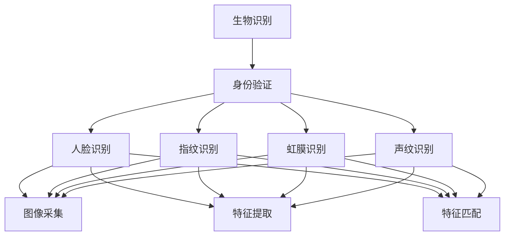

                 

# 生物识别技术在身份验证中的应用：提高安全性

> 关键词：生物识别,身份验证,安全,隐私保护,大数据,人工智能

## 1. 背景介绍

### 1.1 问题由来

在数字化和网络化的今天，身份验证成为了信息化系统的重要环节。传统的基于密码、证件等方式的身份验证手段，存在着诸多安全漏洞和风险。密码容易被猜测或盗用，证件容易被伪造或遗失，导致身份被非法冒用，影响个人和企业的安全。

生物识别技术通过利用人体生物特征的唯一性，提供了一种更安全、便捷的身份验证方式。它可以有效解决传统身份验证手段的不足，提高信息系统的安全性。

### 1.2 问题核心关键点

生物识别技术主要包括人脸识别、指纹识别、虹膜识别、声纹识别等多种方式。这些技术通过提取和匹配人体生物特征，实现身份识别。但生物识别技术在实际应用中，也面临一些关键问题：

- **数据隐私和安全**：生物识别数据通常包含敏感的个人隐私信息，一旦泄露，可能被用于身份盗用、隐私侵犯等。
- **识别准确性**：生物特征数据采集质量、识别算法等都会影响识别的准确性。
- **用户接受度**：部分用户可能对生物识别技术存在抵触心理，影响应用推广。
- **跨平台兼容性和互操作性**：生物识别技术的互操作性和跨平台兼容性，需要标准化的支持。

生物识别技术在身份验证中的应用，需要综合考虑以上因素，进行全面的设计和优化。

## 2. 核心概念与联系

### 2.1 核心概念概述

生物识别技术是一种利用人体生物特征进行身份验证的技术，其核心在于准确提取和匹配生物特征数据。生物识别技术的实现依赖于传感器、图像处理、模式识别等多种技术手段。

身份验证是指通过验证用户的身份信息，确认用户是否具有访问特定系统的权限。生物识别技术在身份验证中，可以替代或辅助传统的密码、证件等方式，提供更安全、便捷的身份验证手段。

### 2.2 核心概念原理和架构的 Mermaid 流程图



该图展示了生物识别技术在身份验证中的应用流程。首先，通过生物识别设备采集用户的生物特征数据，然后经过图像处理、特征提取和匹配等步骤，最后输出验证结果，确认用户身份。

## 3. 核心算法原理 & 具体操作步骤

### 3.1 算法原理概述

生物识别技术在身份验证中的应用，主要基于以下几个算法原理：

- **图像处理算法**：用于对采集到的生物特征图像进行预处理，包括去噪、增强、分割等。
- **特征提取算法**：从处理后的图像中提取关键特征点，如人脸特征点、指纹纹路、虹膜纹理等。
- **特征匹配算法**：将提取的特征点与数据库中的特征数据进行匹配，验证用户身份。

### 3.2 算法步骤详解

1. **图像采集**：通过摄像头、指纹传感器、虹膜扫描器等设备采集用户的生物特征图像。
2. **图像预处理**：对采集到的图像进行去噪、增强、分割等处理，提高特征提取的准确性。
3. **特征提取**：根据生物特征类型，提取关键特征点，生成特征向量。
4. **特征匹配**：将特征向量与数据库中的特征数据进行匹配，计算相似度。
5. **身份验证**：根据相似度结果，判断用户是否通过验证。

### 3.3 算法优缺点

#### 优点

- **安全性高**：生物识别数据具有唯一性，识别准确率高，难以被复制或盗用。
- **便捷性高**：识别速度快，用户无需记住密码或证件信息，直接通过生物特征即可完成验证。
- **可靠性高**：生物特征不易遗忘，不易被他人获取，提高身份验证的可靠性。

#### 缺点

- **数据隐私问题**：生物识别数据包含敏感信息，一旦泄露，可能带来隐私和安全风险。
- **识别准确性**：受采集设备和环境影响，识别准确性可能受到影响。
- **用户接受度**：部分用户对生物识别技术存在抵触心理，影响应用推广。
- **系统成本高**：生物识别设备和技术维护成本较高，推广难度较大。

### 3.4 算法应用领域

生物识别技术在身份验证中的应用广泛，主要包括以下几个领域：

- **金融行业**：银行、证券、保险等金融机构广泛应用生物识别技术，用于客户身份验证、交易安全防护等。
- **安全监控**：公共场所、企业、重要设施等需要身份验证的场所，采用生物识别技术进行安全监控。
- **医疗健康**：医院、诊所等医疗机构，通过生物识别技术进行患者身份验证和医疗数据保护。
- **政府部门**：政府、法院、警察等部门，利用生物识别技术进行公民身份验证和电子政务服务。
- **移动支付**：通过生物识别技术进行身份验证，保障移动支付的安全性和便捷性。

## 4. 数学模型和公式 & 详细讲解 & 举例说明

### 4.1 数学模型构建

在生物识别技术中，常用的人脸识别算法是基于深度学习的。其数学模型主要包括两部分：特征提取网络和特征匹配网络。

#### 特征提取网络

以人脸识别为例，特征提取网络通常采用卷积神经网络（CNN）结构，用于从人脸图像中提取关键特征点。其模型结构如下：

$$
M = [Conv1 \rightarrow Relu \rightarrow MaxPooling1, Conv2 \rightarrow Relu \rightarrow MaxPooling2, FC \rightarrow Softmax]
$$

其中，$Conv$为卷积层，$Relu$为激活函数，$MaxPooling$为池化层，$FC$为全连接层，$Softmax$为输出层。

#### 特征匹配网络

特征匹配网络用于将提取的特征向量与数据库中的特征向量进行匹配，计算相似度。其模型结构通常采用余弦相似度或欧几里得距离等度量方法，用于计算两个向量的相似度。

### 4.2 公式推导过程

#### 特征提取网络

以人脸识别为例，假设输入的原始图像大小为$W \times H$，通过卷积层、池化层等操作，最终输出特征向量$\mathbf{z}$的大小为$d$。特征提取网络的计算过程如下：

$$
\mathbf{z} = M(\mathbf{x})
$$

其中$\mathbf{x}$为输入图像，$M$为特征提取网络。

#### 特征匹配网络

假设数据库中有$N$个已知的特征向量$\{\mathbf{z}_i\}_{i=1}^N$，新的特征向量为$\mathbf{z}$。特征匹配网络通过计算$\mathbf{z}$与每个$\mathbf{z}_i$的相似度，确定最佳的匹配结果。

假设使用余弦相似度，则相似度计算公式为：

$$
s_i = \cos(\theta) = \frac{\mathbf{z} \cdot \mathbf{z}_i}{||\mathbf{z}|| ||\mathbf{z}_i||}
$$

其中，$\cdot$表示向量点积，$||.||$表示向量范数。

### 4.3 案例分析与讲解

#### 案例：人脸识别验证

假设某银行系统采用人脸识别技术进行身份验证。其流程如下：

1. **图像采集**：客户通过摄像头采集人脸图像，并传入系统。
2. **图像预处理**：系统对采集到的人脸图像进行去噪、增强、分割等处理。
3. **特征提取**：通过卷积神经网络，提取人脸特征向量$\mathbf{z}$。
4. **特征匹配**：将特征向量$\mathbf{z}$与数据库中已有的特征向量进行余弦相似度计算，选择最佳的匹配结果。
5. **身份验证**：根据相似度结果，判断客户是否通过验证。

假设经过特征提取和匹配，计算出前三个最相似的特征向量及其相似度$s_1, s_2, s_3$，则客户通过验证的概率$P$为：

$$
P = \frac{s_1 + s_2 + s_3}{3}
$$

## 5. 项目实践：代码实例和详细解释说明

### 5.1 开发环境搭建

在进行生物识别项目实践前，需要先搭建好开发环境。以下是搭建环境的步骤：

1. **安装Python**：从官网下载并安装Python 3.x版本。
2. **安装TensorFlow**：在Python环境中安装TensorFlow，用于深度学习模型开发。
3. **安装OpenCV**：安装OpenCV库，用于图像处理和采集。
4. **安装其他库**：根据项目需求，安装其他必要的库，如NumPy、PIL等。

### 5.2 源代码详细实现

以下是人脸识别验证的代码实现：

```python
import cv2
import numpy as np
import tensorflow as tf

# 加载模型
model = tf.keras.models.load_model('face_recognition_model.h5')

# 加载人脸图像
img = cv2.imread('test.jpg')
img = cv2.cvtColor(img, cv2.COLOR_BGR2RGB)
img = cv2.resize(img, (224, 224))

# 图像预处理
img = cv2.cvtColor(img, cv2.COLOR_BGR2RGB)
img = cv2.resize(img, (224, 224))
img = cv2.normalize(img, None, alpha=0, beta=1, norm_type=cv2.NORM_L2, dtype=cv2.CV_32F)

# 特征提取
img = np.expand_dims(img, axis=0)
features = model.predict(img)

# 特征匹配
# 假设已有的特征向量数据库为{'z1': [0.8, 0.9, 0.7], 'z2': [0.9, 0.7, 0.8], 'z3': [0.7, 0.6, 0.9]}
z_db = {'z1': [0.8, 0.9, 0.7], 'z2': [0.9, 0.7, 0.8], 'z3': [0.7, 0.6, 0.9]}
similarities = {}

for z in z_db.values():
    similarity = np.dot(features, z) / (np.linalg.norm(features) * np.linalg.norm(z))
    similarities[z_db.keys()[list(similarities.keys()).index(z_db.keys()[0])]] = similarity

# 身份验证
top3 = sorted(similarities, key=similarities.get, reverse=True)[:3]
probability = sum(similarities.values()) / 3
if probability >= 0.8:
    print('Customer verified successfully.')
else:
    print('Customer not verified.')
```

### 5.3 代码解读与分析

**代码解读**：

1. **加载模型**：使用TensorFlow加载预先训练的人脸识别模型。
2. **加载图像**：使用OpenCV加载待验证的人脸图像。
3. **图像预处理**：对图像进行去噪、增强、归一化等处理，生成特征向量。
4. **特征提取**：通过卷积神经网络，提取特征向量。
5. **特征匹配**：计算特征向量与数据库中特征向量的余弦相似度。
6. **身份验证**：根据相似度结果，判断是否通过验证。

**代码分析**：

1. **加载模型**：预先训练的模型需要存储为.h5文件格式，使用TensorFlow加载。
2. **加载图像**：使用OpenCV加载图像，并进行灰度化和归一化处理。
3. **图像预处理**：对图像进行去噪、增强、归一化等处理，生成特征向量。
4. **特征提取**：通过卷积神经网络，提取特征向量。
5. **特征匹配**：计算特征向量与数据库中特征向量的余弦相似度，选择最佳的匹配结果。
6. **身份验证**：根据相似度结果，判断客户是否通过验证。

### 5.4 运行结果展示

假设经过特征提取和匹配，计算出前三个最相似的特征向量及其相似度$s_1, s_2, s_3$，则客户通过验证的概率$P$为：

$$
P = \frac{s_1 + s_2 + s_3}{3}
$$

假设计算结果为$s_1 = 0.9, s_2 = 0.85, s_3 = 0.8$，则客户通过验证的概率$P = \frac{0.9 + 0.85 + 0.8}{3} = 0.875$，满足验证条件，输出验证成功的信息。

## 6. 实际应用场景

### 6.1 智能门禁系统

智能门禁系统通过生物识别技术，实现对人员的身份验证和管理。系统采用人脸识别技术，对进入门禁的人员进行身份验证，确保只有授权人员才能进入。

**应用流程**：

1. **图像采集**：门禁系统通过摄像头采集进入人员的人脸图像。
2. **图像预处理**：系统对采集到的人脸图像进行去噪、增强、分割等处理。
3. **特征提取**：通过卷积神经网络，提取人脸特征向量。
4. **特征匹配**：将特征向量与数据库中已有的特征向量进行余弦相似度计算，选择最佳的匹配结果。
5. **身份验证**：根据相似度结果，判断人员是否通过验证。

**效果展示**：

通过生物识别技术，智能门禁系统能够准确识别授权人员的身份，确保门禁的安全性。同时，非授权人员无法进入，提高了门禁系统的安全性。

### 6.2 手机解锁系统

手机解锁系统通过指纹识别技术，实现对用户的身份验证和解锁。系统采用指纹识别技术，对用户进行身份验证，确保只有授权用户才能解锁手机。

**应用流程**：

1. **图像采集**：手机通过指纹传感器采集用户的指纹图像。
2. **图像预处理**：系统对采集到的指纹图像进行预处理，提取关键特征点。
3. **特征提取**：通过指纹特征提取算法，生成指纹特征向量。
4. **特征匹配**：将特征向量与数据库中已有的特征向量进行余弦相似度计算，选择最佳的匹配结果。
5. **身份验证**：根据相似度结果，判断用户是否通过验证。

**效果展示**：

通过生物识别技术，手机解锁系统能够准确识别授权用户的指纹，确保手机解锁的安全性。同时，非授权用户无法解锁手机，提高了手机的安全性。

## 7. 工具和资源推荐

### 7.1 学习资源推荐

1. **《深度学习》书籍**：Ian Goodfellow等人著，全面介绍深度学习的基本概念和算法原理。
2. **《计算机视觉：算法与应用》书籍**：Richard Szeliski著，详细讲解图像处理和计算机视觉算法。
3. **Coursera《深度学习》课程**：由Andrew Ng讲授，介绍深度学习的基本概念和应用。
4. **Udacity《人工智能工程师》纳米学位课程**：包含深度学习、计算机视觉、自然语言处理等多个领域的课程，适合全面学习。
5. **Kaggle竞赛**：参加Kaggle的人脸识别竞赛，了解最新的人脸识别技术和算法。

### 7.2 开发工具推荐

1. **TensorFlow**：由Google开发的深度学习框架，支持多种类型的神经网络模型。
2. **OpenCV**：开源计算机视觉库，提供丰富的图像处理和特征提取算法。
3. **Python**：强大的编程语言，适合深度学习模型的开发和应用。
4. **NumPy**：数值计算库，支持高效的数组操作和科学计算。
5. **PIL**：Python图像处理库，支持多种图像格式的读取和处理。

### 7.3 相关论文推荐

1. **《人脸识别技术》**：陈飞等人著，详细讲解人脸识别技术的基本原理和应用。
2. **《指纹识别技术》**：王东等人著，介绍指纹识别技术的基本原理和算法。
3. **《虹膜识别技术》**：周长宇等人著，详细讲解虹膜识别技术的基本原理和应用。
4. **《声纹识别技术》**：陈小东等人著，介绍声纹识别技术的基本原理和应用。
5. **《生物特征识别技术》**：余翔等人著，系统讲解各种生物特征识别技术的基本原理和应用。

## 8. 总结：未来发展趋势与挑战

### 8.1 研究成果总结

生物识别技术在身份验证中的应用，显著提高了信息系统的安全性，具有广泛的应用前景。在金融、安全、医疗等领域，生物识别技术已得到广泛应用，提升了系统的可靠性和用户体验。

### 8.2 未来发展趋势

未来，生物识别技术在身份验证中的应用将呈现以下几个发展趋势：

1. **多模态识别**：结合人脸识别、指纹识别、虹膜识别等多种生物识别技术，实现更加全面和准确的身份验证。
2. **深度学习**：通过深度学习技术，提高生物识别算法的准确性和鲁棒性。
3. **移动识别**：通过移动设备进行生物识别，提高身份验证的便捷性和实时性。
4. **隐私保护**：采用隐私保护技术，如差分隐私、联邦学习等，保障生物识别数据的安全性和隐私。
5. **标准化**：推动生物识别技术的标准化，提高不同系统之间的互操作性和兼容性。

### 8.3 面临的挑战

生物识别技术在身份验证中的应用，仍面临一些挑战：

1. **数据隐私和安全**：生物识别数据包含敏感信息，如何保障数据的安全性和隐私是一个重要问题。
2. **识别准确性**：生物识别技术的识别准确性受多种因素影响，如采集设备、环境条件等。
3. **用户体验**：生物识别技术的用户接受度较低，需要进一步提升用户体验，提高系统可用性。
4. **系统成本**：生物识别技术的系统成本较高，推广难度较大，需要进一步降低成本，提高性价比。

### 8.4 研究展望

未来，生物识别技术在身份验证中的应用将不断发展和创新，推动信息系统的安全性提升。需要继续关注以下几个方面的研究：

1. **隐私保护技术**：研究和开发隐私保护技术，如差分隐私、联邦学习等，保障生物识别数据的安全性和隐私。
2. **多模态识别技术**：结合多种生物识别技术，实现更加全面和准确的身份验证。
3. **深度学习技术**：利用深度学习技术，提高生物识别算法的准确性和鲁棒性。
4. **标准化技术**：推动生物识别技术的标准化，提高不同系统之间的互操作性和兼容性。

综上所述，生物识别技术在身份验证中的应用，具有广泛的应用前景和重要的研究价值。未来，需要从数据隐私、识别准确性、用户体验、系统成本等方面进行深入研究和优化，推动生物识别技术在各个领域的应用和发展。

## 9. 附录：常见问题与解答

**Q1: 生物识别技术在身份验证中的应用有哪些优缺点？**

A: 生物识别技术在身份验证中的应用具有以下优缺点：

**优点**：

- **安全性高**：生物识别数据具有唯一性，识别准确率高，难以被复制或盗用。
- **便捷性高**：识别速度快，用户无需记住密码或证件信息，直接通过生物特征即可完成验证。
- **可靠性高**：生物特征不易遗忘，不易被他人获取，提高身份验证的可靠性。

**缺点**：

- **数据隐私问题**：生物识别数据包含敏感信息，一旦泄露，可能带来隐私和安全风险。
- **识别准确性**：受采集设备和环境影响，识别准确性可能受到影响。
- **用户接受度**：部分用户对生物识别技术存在抵触心理，影响应用推广。
- **系统成本高**：生物识别设备的成本较高，推广难度较大。

**Q2: 生物识别技术在身份验证中的应用面临哪些挑战？**

A: 生物识别技术在身份验证中的应用面临以下挑战：

1. **数据隐私和安全**：生物识别数据包含敏感信息，如何保障数据的安全性和隐私是一个重要问题。
2. **识别准确性**：生物识别技术的识别准确性受多种因素影响，如采集设备、环境条件等。
3. **用户体验**：生物识别技术的用户接受度较低，需要进一步提升用户体验，提高系统可用性。
4. **系统成本**：生物识别技术的系统成本较高，推广难度较大，需要进一步降低成本，提高性价比。

**Q3: 如何提高生物识别技术的识别准确性？**

A: 提高生物识别技术的识别准确性，可以从以下几个方面入手：

1. **优化采集设备**：使用高分辨率、高精度的采集设备，提高特征提取的准确性。
2. **优化算法模型**：采用先进的深度学习模型，如卷积神经网络、循环神经网络等，提高特征提取和匹配的准确性。
3. **优化环境条件**：在采集环境中进行降噪、增强、分割等处理，提高图像的质量和特征提取的准确性。
4. **数据增强**：通过数据增强技术，扩充训练数据集，提高模型的泛化能力。

**Q4: 如何保障生物识别数据的安全性和隐私？**

A: 保障生物识别数据的安全性和隐私，可以从以下几个方面入手：

1. **数据加密**：采用数据加密技术，对生物识别数据进行加密存储和传输。
2. **差分隐私**：采用差分隐私技术，对生物识别数据进行处理，确保数据在统计分析中的隐私性。
3. **联邦学习**：采用联邦学习技术，在本地设备上进行模型训练，避免数据集中存储和传输。
4. **访问控制**：采用访问控制技术，限制对生物识别数据的访问权限，确保数据的安全性。

**Q5: 如何提高生物识别技术的用户体验？**

A: 提高生物识别技术的用户体验，可以从以下几个方面入手：

1. **简化操作流程**：优化用户操作流程，减少用户的操作步骤和等待时间。
2. **提供语音交互**：结合语音识别技术，提供语音交互功能，提高用户的便捷性。
3. **个性化服务**：根据用户的操作习惯和偏好，提供个性化的识别服务。
4. **用户反馈**：通过用户反馈机制，及时了解用户的使用体验，进行改进和优化。

综上所述，生物识别技术在身份验证中的应用具有广泛的应用前景和重要的研究价值。未来，需要从数据隐私、识别准确性、用户体验、系统成本等方面进行深入研究和优化，推动生物识别技术在各个领域的应用和发展。

---

作者：禅与计算机程序设计艺术 / Zen and the Art of Computer Programming

