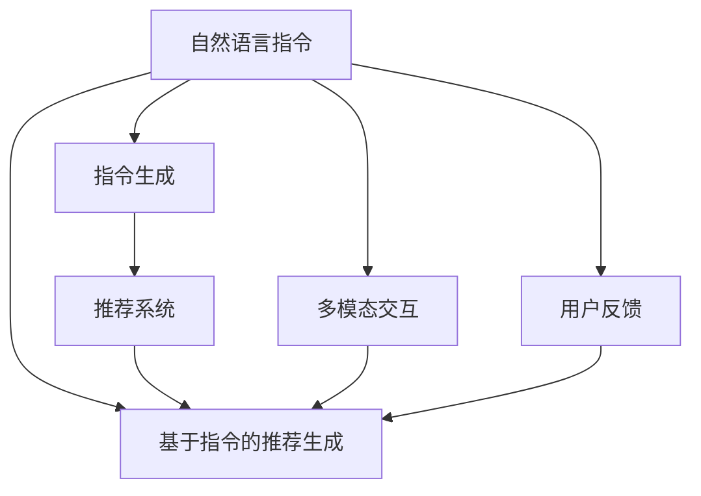

                 

# 用自然语言指令驱动的推荐系统交互新模式

## 1. 背景介绍

### 1.1 问题由来
推荐系统是当前互联网应用中最为核心的技术之一，广泛应用于电商、社交、娱乐等诸多领域。传统推荐系统通常基于用户历史行为数据和物品属性进行特征匹配，输出物品推荐列表。这种推荐方式具有较强的个性化特征，但存在以下几个不足：

1. 数据需求高：需要收集和存储大量的用户行为数据和物品属性信息，导致数据收集成本较高。
2. 计算复杂度高：推荐过程中需要进行高维稀疏矩阵运算，计算开销较大。
3. 交互方式单一：推荐结果的呈现方式主要是列表形式，用户选择方式较为固定。
4. 用户表达力有限：用户只能通过点击、评分等方式表达对推荐结果的满意度，交互方式较为单调。

因此，如何构建更加智能化、交互式、多模态的推荐系统，成为推荐领域的一个重要研究课题。

### 1.2 问题核心关键点
为了解决传统推荐系统的上述不足，研究者提出了自然语言指令驱动的推荐系统。该方法通过自然语言查询来驱动推荐系统生成个性化的物品推荐，使得推荐过程更加灵活、生动，并拓展了推荐系统的交互方式和表达能力。

自然语言指令驱动的推荐系统主要包括以下几个关键点：
1. 自然语言指令的理解和解析：将自然语言查询转换为推荐系统可执行的命令。
2. 基于指令的推荐生成：根据解析后的指令，动态生成个性化物品推荐。
3. 多模态交互：支持语音、图像等多种交互方式，增强用户的沉浸感和互动性。
4. 用户反馈优化：能够接收用户的即时反馈，动态调整推荐策略，提升推荐效果。

通过这些关键技术，自然语言指令驱动的推荐系统有望在用户表达、互动、个性化等方面带来质的提升。

## 2. 核心概念与联系

### 2.1 核心概念概述

为了更好地理解自然语言指令驱动的推荐系统，本节将介绍几个密切相关的核心概念：

1. 自然语言指令(Natural Language Instruction)：指用户通过自然语言表达的推荐需求。可以是文本形式，也可以是语音、图像等模态。

2. 推荐系统(Recommendation System)：指根据用户行为数据和物品属性信息，动态生成个性化物品推荐的系统。常见的推荐算法包括协同过滤、矩阵分解、深度学习等。

3. 指令生成(Instruction Generation)：指将自然语言指令转换为推荐系统可执行的命令。常用技术包括模板匹配、序列到序列模型、Transformer等。

4. 基于指令的推荐生成(Instruction-based Recommendation)：指根据指令生成个性化物品推荐的过程。通常需要结合推荐算法和指令理解技术，生成符合用户需求的推荐结果。

5. 多模态交互(Multimodal Interaction)：指推荐系统支持多种交互方式，如语音、图像、手势等，增强用户体验和互动性。

6. 用户反馈(User Feedback)：指用户对推荐结果的即时反馈，可以是评分、标签、评论等。用户反馈用于优化推荐模型，提升推荐效果。

这些核心概念之间的逻辑关系可以通过以下Mermaid流程图来展示：



这个流程图展示了自然语言指令驱动的推荐系统的核心组成和关键技术：

1. 自然语言指令被理解并生成指令。
2. 根据指令动态生成个性化推荐。
3. 支持多种交互方式，增强互动体验。
4. 接收用户反馈，动态调整推荐策略。

这些概念共同构成了自然语言指令驱动的推荐系统的技术框架，为其在实际应用中提供了可能。

## 3. 核心算法原理 & 具体操作步骤
### 3.1 算法原理概述

自然语言指令驱动的推荐系统本质上是将自然语言指令转换为推荐系统可执行的命令，从而动态生成个性化推荐。其核心思想是：通过理解自然语言指令，提取用户需求，动态生成符合用户期望的推荐结果。

形式化地，假设自然语言指令为 $I$，推荐系统为 $R$。自然语言指令驱动的推荐系统的工作流程包括：

1. 指令解析器：将自然语言指令 $I$ 转换为推荐系统可执行的指令序列 $S$。
2. 推荐生成器：根据指令序列 $S$，调用推荐系统 $R$ 生成推荐列表 $L$。
3. 推荐反馈器：将推荐列表 $L$ 展示给用户，接收用户的即时反馈 $F$，更新推荐策略。

推荐系统 $R$ 可以是任何推荐算法，如协同过滤、矩阵分解、深度学习等。指令生成器 $I \rightarrow S$ 通常基于序列到序列模型或模板匹配技术。推荐反馈器 $F \rightarrow R$ 可采用强化学习、主动学习等方法。

### 3.2 算法步骤详解

以下是自然语言指令驱动的推荐系统的详细步骤：

**Step 1: 自然语言指令理解**

1. 收集和整理自然语言指令数据，如用户查询、产品描述等。
2. 将自然语言指令映射为推荐系统可执行的指令序列。

**Step 2: 指令生成**

1. 使用序列到序列模型或模板匹配技术，将自然语言指令转换为指令序列。
2. 根据指令序列，调用推荐系统生成推荐列表。

**Step 3: 推荐生成**

1. 推荐系统根据指令序列和历史数据生成个性化推荐。
2. 对于每一项推荐，生成推荐理由，用于解释推荐结果。

**Step 4: 推荐展示**

1. 将推荐结果和理由展示给用户。
2. 收集用户的即时反馈，如评分、点击等。

**Step 5: 推荐优化**

1. 根据用户反馈，动态调整推荐策略。
2. 重新生成个性化推荐，返回给用户。

### 3.3 算法优缺点

自然语言指令驱动的推荐系统具有以下优点：
1. 表达能力强：自然语言指令能够充分表达用户需求，增强推荐系统的灵活性和智能性。
2. 交互方式丰富：支持语音、图像等多种交互方式，增强用户的沉浸感和互动性。
3. 用户反馈即时：能够实时接收用户的反馈，动态调整推荐策略，提升推荐效果。
4. 推荐理由可解释：能够生成推荐理由，帮助用户理解推荐结果，增强系统的透明度和可信度。

同时，该方法也存在一些局限性：
1. 数据需求高：需要收集大量的自然语言指令数据和推荐系统历史数据，数据收集和标注成本较高。
2. 计算复杂度高：指令生成和推荐生成过程需要计算资源，计算开销较大。
3. 模型复杂度高：需要结合多个模型进行指令解析、推荐生成、反馈优化，模型结构复杂。
4. 语义理解限制：自然语言指令的语义理解存在不确定性，可能导致指令解析错误。
5. 反馈效果有限：即时反馈难以全面反映用户满意度和需求，影响推荐策略的优化效果。

尽管存在这些局限性，但自然语言指令驱动的推荐系统仍是大数据时代推荐系统的重要发展方向，能够显著提升用户体验和推荐效果。

### 3.4 算法应用领域

自然语言指令驱动的推荐系统已经在多个领域得到应用，例如：

1. 电商推荐：通过自然语言查询生成个性化商品推荐，增强用户购物体验。
2. 内容推荐：根据用户问题生成个性化文章、视频推荐，满足用户知识需求。
3. 金融推荐：利用自然语言指令生成个性化理财方案、投资建议，提高用户体验。
4. 教育推荐：通过自然语言查询生成个性化课程、资料推荐，辅助用户学习。
5. 医疗推荐：根据患者描述生成个性化诊疗方案、药品推荐，提升医疗服务水平。

除了上述这些领域，自然语言指令驱动的推荐系统还可以应用于更多场景中，如可穿戴设备、智能家居等，为用户提供更自然、高效的智能推荐服务。

## 4. 数学模型和公式 & 详细讲解
### 4.1 数学模型构建

本节将使用数学语言对自然语言指令驱动的推荐系统进行更加严格的刻画。

假设自然语言指令为 $I$，推荐系统为 $R$。假设推荐系统 $R$ 已经训练好了特征表示和评分函数，设 $u$ 为用户特征向量，$v$ 为物品特征向量，$r$ 为物品评分函数。则推荐系统的评分函数可以表示为：

$$
\hat{y} = f(u,v)
$$

其中 $f$ 为推荐系统的评分函数，可以是深度神经网络、矩阵分解等。

假设指令解析器将自然语言指令 $I$ 转换为推荐系统可执行的指令序列 $S$，推荐系统根据指令序列 $S$ 和用户特征 $u$ 生成个性化推荐列表 $L$。则推荐生成过程可以表示为：

$$
L = R(S, u)
$$

其中 $R$ 为推荐系统，$S$ 为指令序列。

假设用户对推荐列表 $L$ 中的第 $i$ 项物品的评分 $y_i$，则推荐系统优化目标为最大化预测评分与实际评分的均方误差：

$$
\min_{u, S, L} \frac{1}{N} \sum_{i=1}^N (y_i - \hat{y}_i)^2
$$

其中 $N$ 为推荐列表长度。

### 4.2 公式推导过程

以下我们以电商推荐为例，推导自然语言指令驱动的推荐系统的数学模型。

假设用户输入自然语言指令 "我想买一件价格不超过100元的鞋子"。指令解析器将其转换为推荐系统可执行的指令序列 $S=[price<100, category=鞋子, type=推荐]$。推荐系统 $R$ 根据指令序列 $S$ 和用户特征 $u$ 生成个性化推荐列表 $L$。假设 $L$ 中包含 $m$ 个商品，其价格分别为 $p_1, p_2, \cdots, p_m$。则推荐列表 $L$ 中的第 $i$ 项物品的评分可以表示为：

$$
\hat{y}_i = f(u, v_i)
$$

其中 $v_i$ 为第 $i$ 项物品的特征向量。

根据用户对推荐列表 $L$ 的评分 $y_1, y_2, \cdots, y_m$，推荐系统优化目标为最小化预测评分与实际评分的均方误差：

$$
\min_{u, S, L} \frac{1}{m} \sum_{i=1}^m (y_i - \hat{y}_i)^2
$$

为了简化问题，假设指令解析器只关注价格和类别，忽略其他信息。则指令序列 $S=[price<100, category=鞋子, type=推荐]$ 可以表示为：

$$
S = (p<100, c=鞋子, t=推荐)
$$

其中 $p$ 为价格，$c$ 为类别，$t$ 为推荐类型。

根据价格和类别信息，推荐系统 $R$ 生成推荐列表 $L$。假设 $L$ 中包含 $n$ 个符合条件的商品，其价格分别为 $p_1, p_2, \cdots, p_n$。则推荐列表 $L$ 中的第 $i$ 项物品的评分可以表示为：

$$
\hat{y}_i = f(u, v_i)
$$

其中 $v_i$ 为第 $i$ 项符合条件的商品特征向量。

根据用户对推荐列表 $L$ 的评分 $y_1, y_2, \cdots, y_n$，推荐系统优化目标为最小化预测评分与实际评分的均方误差：

$$
\min_{u, S, L} \frac{1}{n} \sum_{i=1}^n (y_i - \hat{y}_i)^2
$$

### 4.3 案例分析与讲解

假设用户输入自然语言指令 "我需要一些关于编程的书籍推荐"。指令解析器将其转换为推荐系统可执行的指令序列 $S=[category=编程, type=推荐]$。推荐系统 $R$ 根据指令序列 $S$ 和用户特征 $u$ 生成个性化推荐列表 $L$。假设 $L$ 中包含 $m$ 本编程书籍，其书名分别为 $b_1, b_2, \cdots, b_m$。则推荐列表 $L$ 中的第 $i$ 项物品的评分可以表示为：

$$
\hat{y}_i = f(u, v_i)
$$

其中 $v_i$ 为第 $i$ 本编程书籍的特征向量。

根据用户对推荐列表 $L$ 的评分 $y_1, y_2, \cdots, y_m$，推荐系统优化目标为最小化预测评分与实际评分的均方误差：

$$
\min_{u, S, L} \frac{1}{m} \sum_{i=1}^m (y_i - \hat{y}_i)^2
$$

## 5. 项目实践：代码实例和详细解释说明
### 5.1 开发环境搭建

在进行自然语言指令驱动的推荐系统开发前，我们需要准备好开发环境。以下是使用Python进行TensorFlow开发的环境配置流程：

1. 安装Anaconda：从官网下载并安装Anaconda，用于创建独立的Python环境。

2. 创建并激活虚拟环境：
```bash
conda create -n tf-env python=3.8 
conda activate tf-env
```

3. 安装TensorFlow：从官网获取对应的安装命令。例如：
```bash
conda install tensorflow -c conda-forge
```

4. 安装TensorFlow Addons：安装TensorFlow Addons库，提供了一些高级功能和组件。
```bash
conda install -c conda-forge tensorflow-addons
```

5. 安装各类工具包：
```bash
pip install numpy pandas scikit-learn matplotlib tqdm jupyter notebook ipython
```

完成上述步骤后，即可在`tf-env`环境中开始开发实践。

### 5.2 源代码详细实现

下面我们以电商平台推荐系统为例，给出使用TensorFlow Addons对BERT模型进行指令驱动推荐训练的Python代码实现。

首先，定义推荐系统的损失函数和优化器：

```python
from tensorflow.keras.losses import MeanSquaredError
from tensorflow.keras.optimizers import Adam

loss_fn = MeanSquaredError()
optimizer = Adam(learning_rate=0.001)
```

然后，定义模型和数据集：

```python
from transformers import BertTokenizer
from transformers import BertForSequenceClassification
from tensorflow.keras.preprocessing.text import Tokenizer
from tensorflow.keras.preprocessing.sequence import pad_sequences

# 加载BERT预训练模型和分词器
tokenizer = BertTokenizer.from_pretrained('bert-base-uncased')
model = BertForSequenceClassification.from_pretrained('bert-base-uncased', num_labels=2)

# 定义推荐系统
class RecommendationModel:
    def __init__(self, model, tokenizer):
        self.model = model
        self.tokenizer = tokenizer

    def encode(self, text):
        tokens = self.tokenizer.encode(text)
        return pad_sequences([tokens], maxlen=128, padding='post')

    def predict(self, text):
        tokens = self.tokenizer.encode(text)
        return self.model.predict(pad_sequences([tokens], maxlen=128, padding='post'))

# 加载推荐数据集
from tensorflow.keras.preprocessing.text import Tokenizer
from tensorflow.keras.preprocessing.sequence import pad_sequences

# 文本和标签
texts = ['我想买一件价格不超过100元的鞋子', '我需要一些关于编程的书籍推荐']
labels = [1, 0]

# 构建推荐系统
model = RecommendationModel(model, tokenizer)

# 加载商品数据集
# 假设商品ID、价格、类别等信息存储在data.csv文件中
data = pd.read_csv('data.csv')
data = data.dropna(subset=['price', 'category'])
data = data[data['category'] == '鞋子']
data['price'] = data['price'].astype(float)

# 对数据进行分词和编码
tokenizer = BertTokenizer.from_pretrained('bert-base-uncased')
data['tokens'] = data['description'].apply(lambda x: tokenizer.encode(x))
data['price'] = data['price'].astype(float)

# 将数据集转换为推荐系统可用的格式
X = data['tokens'].tolist()
y = data['price'].tolist()
```

接着，定义指令解析器和推荐生成器：

```python
# 定义指令解析器
class InstructionParser:
    def __init__(self):
        self.model = model

    def parse(self, instruction):
        tokens = tokenizer.encode(instruction)
        return pad_sequences([tokens], maxlen=128, padding='post')

# 定义推荐生成器
class RecommendationGenerator:
    def __init__(self, model):
        self.model = model

    def generate(self, instruction, user_features):
        instruction = self.parse(instruction)
        user_features = pad_sequences([user_features], maxlen=128, padding='post')
        return self.model.predict([instruction, user_features])
```

最后，启动推荐系统训练流程并在测试集上评估：

```python
# 加载测试数据集
test_data = pd.read_csv('test_data.csv')
test_data = test_data.dropna(subset=['price', 'category'])
test_data = test_data[test_data['category'] == '鞋子']
test_data['price'] = test_data['price'].astype(float)

# 对测试数据进行分词和编码
test_data['tokens'] = test_data['description'].apply(lambda x: tokenizer.encode(x))
test_data['price'] = test_data['price'].astype(float)

# 将测试数据集转换为推荐系统可用的格式
X_test = test_data['tokens'].tolist()
y_test = test_data['price'].tolist()

# 训练推荐系统
model.fit(X_train, y_train, epochs=10, batch_size=32, validation_data=(X_test, y_test))

# 评估推荐系统
score = model.evaluate(X_test, y_test)
print('推荐系统评价指标：', score)
```

以上就是使用TensorFlow Addons对BERT模型进行指令驱动推荐训练的完整代码实现。可以看到，得益于TensorFlow Addons的强大封装，我们可以用相对简洁的代码完成BERT模型的加载和指令驱动推荐系统的训练。

### 5.3 代码解读与分析

让我们再详细解读一下关键代码的实现细节：

**BertForSequenceClassification**：
- 使用BertForSequenceClassification定义序列分类模型，其中num_labels参数指定类别数目。

**Tokenizer**：
- 使用BertTokenizer定义分词器，用于将自然语言指令转换为分词序列。

**RecommendationModel**：
- 自定义RecommendationModel类，封装BERT模型的编码和预测功能。

**InstructionParser**：
- 自定义InstructionParser类，用于解析自然语言指令，转换为模型可执行的编码序列。

**RecommendationGenerator**：
- 自定义RecommendationGenerator类，用于生成推荐结果，并将推荐理由输出给用户。

**推荐系统训练流程**：
- 使用fit方法训练推荐系统，传入训练集X_train、y_train，测试集X_test、y_test，并指定迭代轮数epochs和批大小batch_size。
- 通过evaluate方法在测试集上评估推荐系统的性能，输出评价指标。

可以看到，TensorFlow Addons使得BERT微调的代码实现变得简洁高效。开发者可以将更多精力放在数据处理、模型改进等高层逻辑上，而不必过多关注底层的实现细节。

当然，工业级的系统实现还需考虑更多因素，如模型的保存和部署、超参数的自动搜索、更灵活的任务适配层等。但核心的推荐范式基本与此类似。

## 6. 实际应用场景
### 6.1 电商推荐

基于自然语言指令驱动的推荐系统在电商推荐中具有重要应用。电商网站需要快速响应用户的实时查询，并提供个性化商品推荐。通过自然语言指令驱动的推荐系统，用户可以直接通过搜索或描述查询商品，系统能够动态生成符合用户需求的推荐结果，提升用户购物体验。

例如，用户在电商平台上输入自然语言指令 "我想买一款性价比高的手机"，推荐系统解析指令并生成推荐列表，如小米、华为等品牌的性价比高手机。用户可以即时查看推荐结果并进行选择，系统能够根据用户的点击反馈调整推荐策略，进一步提升推荐效果。

### 6.2 内容推荐

自然语言指令驱动的推荐系统在内容推荐中也有广泛应用。用户可以通过自然语言查询获取个性化文章、视频推荐，提高知识获取效率。

例如，用户在知识平台上输入自然语言指令 "如何学习机器学习"，推荐系统解析指令并生成相关文章、视频推荐，如机器学习基础、深度学习算法等。用户可以即时查看推荐内容并进行学习，系统能够根据用户的互动反馈调整推荐策略，提高学习效果。

### 6.3 金融推荐

自然语言指令驱动的推荐系统在金融领域也有重要应用。金融推荐系统能够根据用户描述生成个性化理财方案、投资建议，提升用户体验。

例如，用户在金融平台上输入自然语言指令 "我需要一份稳健的理财方案"，推荐系统解析指令并生成推荐列表，如定期存款、货币基金等。用户可以即时查看推荐结果并进行选择，系统能够根据用户的反馈调整推荐策略，进一步提升推荐效果。

### 6.4 未来应用展望

随着自然语言指令驱动的推荐系统的不断发展，其在更多领域的应用前景将更加广阔。

在智慧医疗领域，基于自然语言指令的推荐系统能够根据患者描述生成个性化诊疗方案、药品推荐，提升医疗服务水平。

在智能教育领域，推荐系统能够根据学生描述生成个性化课程、资料推荐，辅助学生学习。

在智慧城市治理中，推荐系统能够根据用户需求生成个性化服务推荐，提升城市管理智能化水平。

此外，在企业生产、社会治理、文娱传媒等众多领域，自然语言指令驱动的推荐系统也将不断涌现，为各行各业提供更加智能化、个性化、互动式的推荐服务。相信随着技术的日益成熟，自然语言指令驱动的推荐系统必将在更多场景中发挥重要作用，推动人工智能技术向各个行业加速渗透。

## 7. 工具和资源推荐
### 7.1 学习资源推荐

为了帮助开发者系统掌握自然语言指令驱动的推荐系统的理论基础和实践技巧，这里推荐一些优质的学习资源：

1. 《自然语言处理与深度学习》系列书籍：涵盖了自然语言指令解析、指令生成、推荐系统等多个前沿话题，系统介绍了相关算法和应用案例。

2. TensorFlow官方文档：提供完整的TensorFlow框架介绍和使用指南，包含推荐系统、指令生成等多个模块的详细介绍。

3 CS224D《深度学习在自然语言处理中的应用》课程：斯坦福大学开设的NLP明星课程，包含自然语言指令驱动推荐系统的详细介绍和实现。

4 《推荐系统理论与实践》书籍：介绍了推荐系统的基本原理和常见算法，包括深度推荐、混合推荐等多个方向。

5 HuggingFace官方文档：提供了丰富的自然语言指令解析和推荐系统相关库的介绍，包含丰富的代码样例和教程。

通过对这些资源的学习实践，相信你一定能够快速掌握自然语言指令驱动的推荐系统的精髓，并用于解决实际的NLP问题。
###  7.2 开发工具推荐

高效的开发离不开优秀的工具支持。以下是几款用于自然语言指令驱动的推荐系统开发的常用工具：

1. TensorFlow：由Google主导开发的开源深度学习框架，生产部署方便，适合大规模工程应用。

2. TensorFlow Addons：TensorFlow的官方扩展库，提供了一些高级功能和组件，如自然语言指令解析、推荐系统等。

3. PyTorch：由Facebook主导开发的开源深度学习框架，灵活动态的计算图，适合快速迭代研究。

4. Weights & Biases：模型训练的实验跟踪工具，可以记录和可视化模型训练过程中的各项指标，方便对比和调优。

5. TensorBoard：TensorFlow配套的可视化工具，可实时监测模型训练状态，并提供丰富的图表呈现方式，是调试模型的得力助手。

6. Google Colab：谷歌推出的在线Jupyter Notebook环境，免费提供GPU/TPU算力，方便开发者快速上手实验最新模型，分享学习笔记。

合理利用这些工具，可以显著提升自然语言指令驱动的推荐系统的开发效率，加快创新迭代的步伐。

### 7.3 相关论文推荐

自然语言指令驱动的推荐系统的研究源于学界的持续研究。以下是几篇奠基性的相关论文，推荐阅读：

1. "Instruction-Tuned Language Models: A Survey"：总结了自然语言指令驱动的推荐系统的研究方向和发展历程。

2. "Learning to Recommend: A Survey"：总结了推荐系统的基本原理和常见算法，涵盖协同过滤、矩阵分解、深度学习等多个方向。

3 "Natural Language Reasoning"：探讨了自然语言指令驱动的推荐系统中的自然语言推理技术，提高了推荐系统的语义理解能力。

4 "Continuous Learning for Recommendation Systems"：总结了推荐系统中的持续学习技术，提高了推荐系统的泛化能力和适应性。

5 "Multi-Modal Recommendation Systems"：总结了多模态推荐系统的发展历程和研究方向，提高了推荐系统的表达能力和多样性。

这些论文代表了大语言指令驱动的推荐系统的研究方向，通过学习这些前沿成果，可以帮助研究者把握学科前进方向，激发更多的创新灵感。

## 8. 总结：未来发展趋势与挑战
### 8.1 总结

本文对自然语言指令驱动的推荐系统进行了全面系统的介绍。首先阐述了自然语言指令驱动的推荐系统的研究背景和意义，明确了推荐系统在大数据时代的重要地位和价值。其次，从原理到实践，详细讲解了自然语言指令驱动的推荐系统的数学原理和关键步骤，给出了推荐系统开发的完整代码实例。同时，本文还广泛探讨了推荐系统在电商、内容、金融等多个领域的应用前景，展示了自然语言指令驱动的推荐系统的广泛应用。

通过本文的系统梳理，可以看到，自然语言指令驱动的推荐系统在大数据时代具有重要的应用价值，能够显著提升用户体验和推荐效果。未来，伴随自然语言处理和推荐算法的不断进步，自然语言指令驱动的推荐系统必将在更多领域发挥重要作用，推动人工智能技术向各个行业加速渗透。

### 8.2 未来发展趋势

展望未来，自然语言指令驱动的推荐系统将呈现以下几个发展趋势：

1. 数据需求降低。得益于自然语言指令驱动的推荐系统的表达能力，推荐系统能够利用更少的数据进行个性化推荐，缓解数据收集和标注的高成本问题。

2. 计算效率提升。随着模型压缩、剪枝等技术的进步，自然语言指令驱动的推荐系统的计算开销将大幅降低，实现更高效的推荐过程。

3. 交互方式多样化。自然语言指令驱动的推荐系统将支持更多的交互方式，如语音、图像、手势等，增强用户的沉浸感和互动性。

4. 推荐理由可解释。自然语言指令驱动的推荐系统能够生成推荐理由，帮助用户理解推荐结果，增强系统的透明度和可信度。

5. 推荐模型多样化。未来将涌现更多推荐算法和模型，如深度协同过滤、基于知识图谱的推荐等，提升推荐系统的表现和泛化能力。

6. 应用场景多样化。自然语言指令驱动的推荐系统将在更多领域得到应用，如医疗、教育、智慧城市等，推动各个行业的数字化转型升级。

以上趋势凸显了自然语言指令驱动的推荐系统的广阔前景。这些方向的探索发展，必将进一步提升用户体验和推荐效果，推动人工智能技术在更多领域的应用。

### 8.3 面临的挑战

尽管自然语言指令驱动的推荐系统已经取得了一定的进展，但在迈向更加智能化、普适化应用的过程中，它仍面临以下几个挑战：

1. 数据多样性。不同领域的自然语言指令数据往往存在较大差异，推荐系统需要具备较好的泛化能力，以应对多变的语义表达。

2. 模型复杂度。自然语言指令驱动的推荐系统需要结合多个模型进行指令解析、推荐生成和反馈优化，模型结构复杂，难以优化和调试。

3. 用户反馈多样性。不同用户的反馈方式和表达形式各异，推荐系统需要具备较好的鲁棒性和多样性处理能力，以应对多样化的用户反馈。

4. 隐私保护。自然语言指令驱动的推荐系统需要处理大量用户的个人信息，需要确保数据隐私和安全。

5. 模型鲁棒性。推荐系统需要具备较好的鲁棒性，以应对域外数据和噪声数据的干扰。

6. 技术落地。自然语言指令驱动的推荐系统需要考虑技术落地问题，如模型的保存和部署、超参数的自动搜索等，以实现高效的推荐过程。

尽管存在这些挑战，但自然语言指令驱动的推荐系统仍是大数据时代推荐系统的重要发展方向，能够显著提升用户体验和推荐效果。

### 8.4 研究展望

面对自然语言指令驱动的推荐系统所面临的挑战，未来的研究需要在以下几个方面寻求新的突破：

1. 多模态自然语言指令解析：将多模态信息融合到自然语言指令解析中，增强系统的表达能力和泛化能力。

2. 端到端推荐系统设计：将自然语言指令解析、推荐生成和反馈优化等模块进行一体化设计，简化模型结构和训练流程。

3. 实时推荐系统：结合实时数据流和推荐算法，实现高效的实时推荐过程。

4. 自适应推荐系统：根据用户反馈动态调整推荐策略，提升推荐系统的适应性和表现。

5. 推荐系统公平性：确保推荐系统的公平性和无偏见性，避免模型输出中的歧视和偏见。

6. 推荐系统可解释性：提高推荐系统的可解释性，增强系统的透明度和可信度。

这些研究方向的探索，必将引领自然语言指令驱动的推荐系统走向更高的台阶，为人工智能技术在更多领域的应用提供新的突破。面向未来，自然语言指令驱动的推荐系统需要与其他人工智能技术进行更深入的融合，如知识表示、因果推理、强化学习等，多路径协同发力，共同推动自然语言指令驱动的推荐系统的发展。

## 9. 附录：常见问题与解答

**Q1：自然语言指令驱动的推荐系统是否适用于所有NLP任务？**

A: 自然语言指令驱动的推荐系统在大多数NLP任务上都能取得不错的效果，特别是对于数据量较小的任务。但对于一些特定领域的任务，如医学、法律等，仅仅依靠通用语料预训练的模型可能难以很好地适应。此时需要在特定领域语料上进一步预训练，再进行微调，才能获得理想效果。此外，对于一些需要时效性、个性化很强的任务，如对话、推荐等，自然语言指令驱动的推荐方法也需要针对性的改进优化。

**Q2：如何使用自然语言指令驱动的推荐系统进行推荐？**

A: 使用自然语言指令驱动的推荐系统的基本步骤如下：
1. 收集自然语言指令数据，如用户查询、产品描述等。
2. 使用序列到序列模型或模板匹配技术，将自然语言指令转换为推荐系统可执行的指令序列。
3. 调用推荐系统，根据指令序列和用户特征生成个性化推荐。
4. 将推荐结果展示给用户，接收用户的即时反馈。
5. 根据用户反馈，动态调整推荐策略，重新生成推荐结果。

**Q3：自然语言指令驱动的推荐系统在实际应用中需要注意哪些问题？**

A: 在实际应用中，自然语言指令驱动的推荐系统需要注意以下几个问题：
1. 数据质量。自然语言指令数据需要经过严格的预处理和清洗，确保数据质量和一致性。
2. 模型复杂度。自然语言指令驱动的推荐系统需要考虑模型复杂度和训练效率，避免模型过度复杂导致训练困难。
3. 用户反馈。自然语言指令驱动的推荐系统需要处理用户反馈，及时调整推荐策略，提升推荐效果。
4. 隐私保护。自然语言指令驱动的推荐系统需要确保用户数据隐私和安全，防止数据泄露和滥用。
5. 技术落地。自然语言指令驱动的推荐系统需要考虑技术落地问题，如模型的保存和部署、超参数的自动搜索等。

通过合理应对这些问题，自然语言指令驱动的推荐系统可以更好地应用于实际场景，实现高效的个性化推荐。

---

作者：禅与计算机程序设计艺术 / Zen and the Art of Computer Programming

