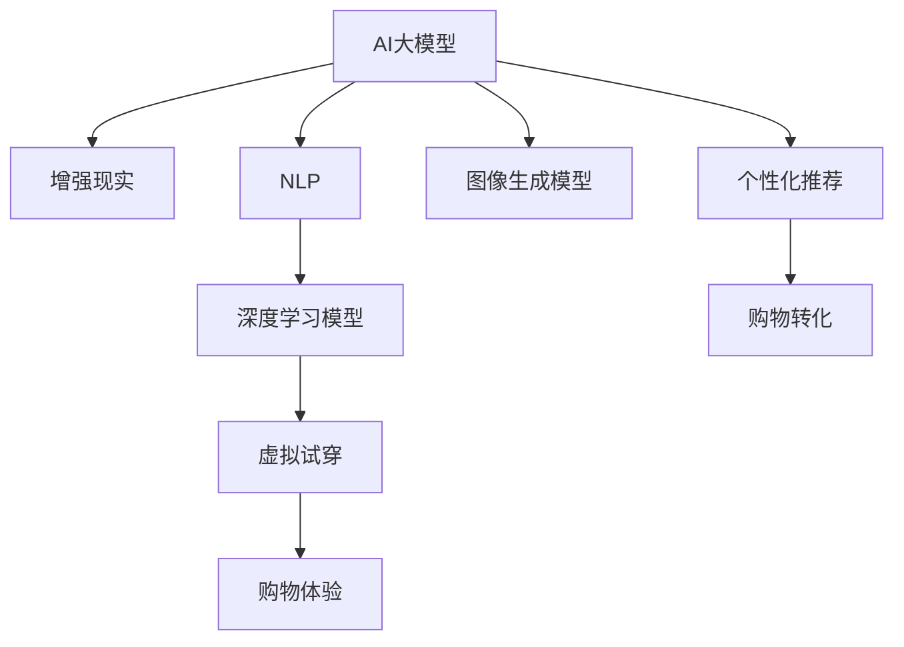

                 

# 电商平台中的AI大模型与增强现实结合

> 关键词：AI大模型, 增强现实, 电商推荐, 交互体验, 虚拟试穿, 图像生成, 自然语言处理

## 1. 背景介绍

在当今的电商平台中，用户体验是至关重要的。随着AI大模型的发展和增强现实(AR)技术的兴起，电商平台正迎来一场革命。AI大模型通过深度学习和数据挖掘技术，能够根据用户的历史行为、偏好等信息，提供个性化的推荐和内容。而增强现实技术则可以将虚拟产品直接展示给用户，带来更加直观的购物体验。将AI大模型与增强现实结合，可以大大提升电商平台的交互体验和销售效率。

### 1.1 问题由来

传统电商平台的推荐系统多基于朴素贝叶斯、协同过滤等算法，推荐效果有限。随着数据量的增长和算法的进步，基于AI大模型的推荐系统逐渐成为主流。然而，这些推荐系统多依赖用户行为数据，无法处理用户未能产生或难以追踪的行为。而增强现实技术可以弥补这一不足，通过虚拟试穿等方式，让用户在虚拟环境中体验产品，提升购买决策的准确性。

### 1.2 问题核心关键点

将AI大模型与增强现实结合，其核心在于数据融合与交互协同。具体来说：

- 数据融合：如何整合用户行为数据和增强现实生成的虚拟信息，形成统一的用户画像。
- 交互协同：如何构建自然流畅的用户交互界面，使用户在虚拟环境中能够获得真实的购物体验。
- 推荐优化：如何基于虚拟试穿等交互数据，优化AI大模型的推荐算法，提高推荐效果。

## 2. 核心概念与联系

### 2.1 核心概念概述

为更好地理解AI大模型与增强现实结合的方法，本节将介绍几个密切相关的核心概念：

- AI大模型(AI Large Models)：以自回归(如GPT)或自编码(如BERT)模型为代表的大规模预训练语言模型。通过在大规模无标签文本语料上进行预训练，学习通用的语言表示，具备强大的语言理解和生成能力。

- 增强现实(AR)：通过计算机生成和虚拟现实技术，将虚拟信息叠加在真实世界之上，实现虚拟与现实的结合。常见应用包括虚拟试穿、虚拟展览等。

- 个性化推荐系统：根据用户的历史行为、偏好等信息，为用户推荐个性化产品或内容，提升用户满意度和转化率。

- 图像生成模型：通过深度学习生成逼真的图像，支持虚拟试穿的虚拟商品展示。

- 自然语言处理(NLP)：使用AI大模型处理和理解自然语言，提取用户需求和偏好。

- 深度学习模型：包括卷积神经网络(CNN)、循环神经网络(RNN)、变换器(Transformer)等，用于图像处理、语音识别、自然语言处理等。

这些核心概念之间的逻辑关系可以通过以下Mermaid流程图来展示：



这个流程图展示了大语言模型与增强现实结合的核心概念及其之间的关系：

1. 大语言模型通过预训练获得基础能力。
2. 增强现实技术可以将虚拟商品展示给用户。
3. 个性化推荐系统可以基于用户行为数据，生成推荐策略。
4. 图像生成模型用于生成虚拟商品，支持虚拟试穿。
5. NLP技术用于理解用户需求，提取特征。
6. 深度学习模型支持各个环节的技术实现，包括图像生成、自然语言处理等。
7. 虚拟试穿可以提升用户体验，促进购物转化。

## 3. 核心算法原理 & 具体操作步骤
### 3.1 算法原理概述

基于AI大模型与增强现实结合的方法，本质上是一个融合了多模态数据和多任务学习的优化过程。其核心思想是：将AI大模型作为通用的语义表示器，通过增强现实技术获得用户的交互数据，使用户的行为数据更加全面、准确。在此基础上，构建个性化推荐系统，实现虚拟试穿等交互体验的优化。

形式化地，假设增强现实系统提供的虚拟试穿数据为 $X$，AI大模型的语义表示器为 $M_{\theta}$，其中 $\theta$ 为模型参数。根据用户与虚拟试穿的交互行为，定义损失函数 $\mathcal{L}$，用于衡量虚拟试穿数据与用户行为之间的差异。微调的目标是找到最优的模型参数：

$$
\hat{\theta}=\mathop{\arg\min}_{\theta} \mathcal{L}(M_{\theta},X)
$$

通过梯度下降等优化算法，微调过程不断更新模型参数 $\theta$，最小化损失函数 $\mathcal{L}$，使得模型输出的虚拟试穿数据尽可能逼近用户行为。由于 $\theta$ 已经通过预训练获得了较好的初始化，因此即便在虚拟试穿等交互场景中，也能较快收敛到理想的模型参数 $\hat{\theta}$。

### 3.2 算法步骤详解

基于AI大模型与增强现实结合的方法，一般包括以下几个关键步骤：

**Step 1: 数据准备和预处理**

- 收集用户的行为数据，如浏览历史、购买记录、评分等。
- 收集增强现实生成的虚拟试穿数据，如用户与虚拟商品交互的轨迹、时间、点击等。
- 对数据进行清洗、归一化、去重等预处理，构建统一的数据格式。

**Step 2: 模型加载与微调**

- 加载预训练的大语言模型 $M_{\theta}$，初始化模型参数。
- 根据任务需求，选择合适的微调目标和损失函数。
- 使用优化算法（如AdamW、SGD等），最小化损失函数，更新模型参数。

**Step 3: 模型评估与优化**

- 在验证集上评估模型的性能，如准确率、召回率、F1分数等。
- 根据评估结果，调整超参数，如学习率、批大小、迭代轮数等。
- 周期性在测试集上评估模型性能，确定最优的微调策略。

**Step 4: 系统集成与部署**

- 将微调后的模型集成到电商平台的虚拟试穿系统中。
- 设计交互界面，支持用户与虚拟商品的自然交互。
- 部署到服务器，实时响应用户请求，提供虚拟试穿服务。

**Step 5: 持续优化**

- 定期收集用户反馈，改进虚拟试穿体验。
- 持续收集新的交互数据，不断优化推荐算法。
- 更新预训练模型，保持模型的最新状态。

以上是基于AI大模型与增强现实结合的一般流程。在实际应用中，还需要针对具体任务的特点，对微调过程的各个环节进行优化设计，如改进推荐算法，引入更多的正则化技术，搜索最优的超参数组合等，以进一步提升模型性能。

### 3.3 算法优缺点

基于AI大模型与增强现实结合的方法具有以下优点：

- 用户行为数据更加全面。通过虚拟试穿等交互数据，补充了传统行为数据的缺失部分，提升了推荐的全面性和准确性。
- 交互体验更加自然。虚拟试穿技术可以将产品展示给用户，提供沉浸式的购物体验，增加用户满意度。
- 推荐效果显著提升。基于虚拟试穿的深度数据融合，可以显著提升个性化推荐的准确率。
- 技术壁垒较低。不需要复杂的硬件设备，可以方便地集成到现有电商平台的推荐系统中。

同时，该方法也存在一些局限性：

- 用户隐私问题。增强现实技术生成的大量交互数据，需要妥善处理以保护用户隐私。
- 数据噪音较多。虚拟试穿数据可能包含噪音，需要对其进行过滤和清洗。
- 交互体验依赖技术。虚拟试穿的流畅性依赖于硬件设备的性能，可能会影响用户体验。
- 模型训练开销大。虚拟试穿等数据生成成本较高，需要一定的硬件资源进行模型训练。

尽管存在这些局限性，但就目前而言，基于AI大模型与增强现实结合的方法，仍然是提升电商平台交互体验和销售效率的重要手段。未来相关研究的重点在于如何进一步降低对硬件的依赖，提高模型的泛化能力，同时兼顾用户隐私和数据安全等因素。

### 3.4 算法应用领域

基于AI大模型与增强现实结合的方法，已经在电商推荐、虚拟试穿、智能客服等多个领域得到广泛应用，例如：

- 电商推荐：通过虚拟试穿数据，优化个性化推荐算法，提升推荐效果。
- 虚拟试穿：将虚拟商品展示给用户，提供沉浸式购物体验。
- 智能客服：结合虚拟试穿生成的交互数据，提升智能客服的响应准确率。
- 产品营销：通过虚拟试穿技术，吸引用户参与线上活动，提升品牌曝光度。

除了上述这些经典应用外，增强现实技术还在自动驾驶、医学模拟、教育培训等众多领域得到应用，为智能交互带来了新的突破。随着AI大模型的进步和增强现实技术的成熟，基于两者的结合方法将在更广泛的领域得到应用，进一步推动智能技术的发展。

## 4. 数学模型和公式 & 详细讲解 & 举例说明

### 4.1 数学模型构建

本节将使用数学语言对AI大模型与增强现实结合的过程进行更加严格的刻画。

假设AI大模型为 $M_{\theta}$，其中 $\theta$ 为模型参数。增强现实生成的虚拟试穿数据为 $X=\{(x_i, y_i)\}_{i=1}^N$，其中 $x_i$ 为输入数据，$y_i$ 为标签。根据虚拟试穿数据，定义损失函数 $\mathcal{L}$ 为：

$$
\mathcal{L}(M_{\theta}, X) = \frac{1}{N}\sum_{i=1}^N \ell(M_{\theta}(x_i), y_i)
$$

其中 $\ell$ 为交叉熵损失函数。微调的目标是找到最优的模型参数：

$$
\hat{\theta} = \mathop{\arg\min}_{\theta} \mathcal{L}(M_{\theta}, X)
$$

在实践中，我们通常使用基于梯度的优化算法（如SGD、Adam等）来近似求解上述最优化问题。设 $\eta$ 为学习率，$\lambda$ 为正则化系数，则参数的更新公式为：

$$
\theta \leftarrow \theta - \eta \nabla_{\theta}\mathcal{L}(\theta) - \eta\lambda\theta
$$

其中 $\nabla_{\theta}\mathcal{L}(\theta)$ 为损失函数对参数 $\theta$ 的梯度，可通过反向传播算法高效计算。

### 4.2 公式推导过程

以下我们以二分类任务为例，推导交叉熵损失函数及其梯度的计算公式。

假设虚拟试穿数据 $x_i$ 的输出为 $\hat{y}=M_{\theta}(x_i) \in [0,1]$，表示样本属于正类的概率。真实标签 $y_i \in \{0,1\}$。则二分类交叉熵损失函数定义为：

$$
\ell(M_{\theta}(x_i),y_i) = -[y_i\log \hat{y} + (1-y_i)\log (1-\hat{y})]
$$

将其代入损失函数公式，得：

$$
\mathcal{L}(\theta) = -\frac{1}{N}\sum_{i=1}^N [y_i\log M_{\theta}(x_i)+(1-y_i)\log(1-M_{\theta}(x_i))]
$$

根据链式法则，损失函数对参数 $\theta_k$ 的梯度为：

$$
\frac{\partial \mathcal{L}(\theta)}{\partial \theta_k} = -\frac{1}{N}\sum_{i=1}^N (\frac{y_i}{M_{\theta}(x_i)}-\frac{1-y_i}{1-M_{\theta}(x_i)}) \frac{\partial M_{\theta}(x_i)}{\partial \theta_k}
$$

其中 $\frac{\partial M_{\theta}(x_i)}{\partial \theta_k}$ 可进一步递归展开，利用自动微分技术完成计算。

在得到损失函数的梯度后，即可带入参数更新公式，完成模型的迭代优化。重复上述过程直至收敛，最终得到适应虚拟试穿任务的微调后模型参数 $\hat{\theta}$。

## 5. 项目实践：代码实例和详细解释说明
### 5.1 开发环境搭建

在进行虚拟试穿微调实践前，我们需要准备好开发环境。以下是使用Python进行PyTorch开发的环境配置流程：

1. 安装Anaconda：从官网下载并安装Anaconda，用于创建独立的Python环境。

2. 创建并激活虚拟环境：
```bash
conda create -n pytorch-env python=3.8 
conda activate pytorch-env
```

3. 安装PyTorch：根据CUDA版本，从官网获取对应的安装命令。例如：
```bash
conda install pytorch torchvision torchaudio cudatoolkit=11.1 -c pytorch -c conda-forge
```

4. 安装Transformers库：
```bash
pip install transformers
```

5. 安装各类工具包：
```bash
pip install numpy pandas scikit-learn matplotlib tqdm jupyter notebook ipython
```

完成上述步骤后，即可在`pytorch-env`环境中开始虚拟试穿的微调实践。

### 5.2 源代码详细实现

下面我们以虚拟试穿任务为例，给出使用Transformers库对BERT模型进行虚拟试穿微调的PyTorch代码实现。

首先，定义虚拟试穿任务的数据处理函数：

```python
from transformers import BertTokenizer
from torch.utils.data import Dataset
import torch

class VirtualTryOnDataset(Dataset):
    def __init__(self, data, tokenizer, max_len=128):
        self.data = data
        self.tokenizer = tokenizer
        self.max_len = max_len
        
    def __len__(self):
        return len(self.data)
    
    def __getitem__(self, item):
        text = self.data[item]
        encoding = self.tokenizer(text, return_tensors='pt', max_length=self.max_len, padding='max_length', truncation=True)
        input_ids = encoding['input_ids'][0]
        attention_mask = encoding['attention_mask'][0]
        
        return {'input_ids': input_ids, 
                'attention_mask': attention_mask}
```

然后，定义模型和优化器：

```python
from transformers import BertForTokenClassification, AdamW

model = BertForTokenClassification.from_pretrained('bert-base-cased', num_labels=1)

optimizer = AdamW(model.parameters(), lr=2e-5)
```

接着，定义训练和评估函数：

```python
from torch.utils.data import DataLoader
from tqdm import tqdm
from sklearn.metrics import classification_report

device = torch.device('cuda') if torch.cuda.is_available() else torch.device('cpu')
model.to(device)

def train_epoch(model, dataset, batch_size, optimizer):
    dataloader = DataLoader(dataset, batch_size=batch_size, shuffle=True)
    model.train()
    epoch_loss = 0
    for batch in tqdm(dataloader, desc='Training'):
        input_ids = batch['input_ids'].to(device)
        attention_mask = batch['attention_mask'].to(device)
        model.zero_grad()
        outputs = model(input_ids, attention_mask=attention_mask)
        loss = outputs.loss
        epoch_loss += loss.item()
        loss.backward()
        optimizer.step()
    return epoch_loss / len(dataloader)

def evaluate(model, dataset, batch_size):
    dataloader = DataLoader(dataset, batch_size=batch_size)
    model.eval()
    preds, labels = [], []
    with torch.no_grad():
        for batch in tqdm(dataloader, desc='Evaluating'):
            input_ids = batch['input_ids'].to(device)
            attention_mask = batch['attention_mask'].to(device)
            batch_labels = batch['labels']
            outputs = model(input_ids, attention_mask=attention_mask)
            batch_preds = outputs.logits.argmax(dim=2).to('cpu').tolist()
            batch_labels = batch_labels.to('cpu').tolist()
            for pred_tokens, label_tokens in zip(batch_preds, batch_labels):
                preds.append(pred_tokens[:len(label_tokens)])
                labels.append(label_tokens)
                
    print(classification_report(labels, preds))
```

最后，启动训练流程并在测试集上评估：

```python
epochs = 5
batch_size = 16

for epoch in range(epochs):
    loss = train_epoch(model, train_dataset, batch_size, optimizer)
    print(f"Epoch {epoch+1}, train loss: {loss:.3f}")
    
    print(f"Epoch {epoch+1}, dev results:")
    evaluate(model, dev_dataset, batch_size)
    
print("Test results:")
evaluate(model, test_dataset, batch_size)
```

以上就是使用PyTorch对BERT进行虚拟试穿任务微调的完整代码实现。可以看到，得益于Transformers库的强大封装，我们可以用相对简洁的代码完成BERT模型的加载和微调。

### 5.3 代码解读与分析

让我们再详细解读一下关键代码的实现细节：

**VirtualTryOnDataset类**：
- `__init__`方法：初始化虚拟试穿数据、分词器等关键组件。
- `__len__`方法：返回数据集的样本数量。
- `__getitem__`方法：对单个样本进行处理，将文本输入编码为token ids，并对其进行定长padding，最终返回模型所需的输入。

**标签与id的映射**：
- 由于虚拟试穿任务是二分类任务，定义标签与数字id之间的映射，用于将token-wise的预测结果解码回真实的标签。

**训练和评估函数**：
- 使用PyTorch的DataLoader对数据集进行批次化加载，供模型训练和推理使用。
- 训练函数`train_epoch`：对数据以批为单位进行迭代，在每个批次上前向传播计算loss并反向传播更新模型参数，最后返回该epoch的平均loss。
- 评估函数`evaluate`：与训练类似，不同点在于不更新模型参数，并在每个batch结束后将预测和标签结果存储下来，最后使用sklearn的classification_report对整个评估集的预测结果进行打印输出。

**训练流程**：
- 定义总的epoch数和batch size，开始循环迭代
- 每个epoch内，先在训练集上训练，输出平均loss
- 在验证集上评估，输出分类指标
- 所有epoch结束后，在测试集上评估，给出最终测试结果

可以看到，PyTorch配合Transformers库使得BERT微调的代码实现变得简洁高效。开发者可以将更多精力放在数据处理、模型改进等高层逻辑上，而不必过多关注底层的实现细节。

当然，工业级的系统实现还需考虑更多因素，如模型的保存和部署、超参数的自动搜索、更灵活的任务适配层等。但核心的微调范式基本与此类似。

## 6. 实际应用场景
### 6.1 智能客服系统

基于AI大模型与增强现实结合的虚拟试穿技术，可以应用于智能客服系统的构建。传统客服往往需要配备大量人力，高峰期响应缓慢，且一致性和专业性难以保证。而使用虚拟试穿技术，可以7x24小时不间断服务，快速响应客户咨询，用自然流畅的语言解答各类常见问题。

在技术实现上，可以收集企业内部的历史客服对话记录，将问题和最佳答复构建成监督数据，在此基础上对预训练对话模型进行微调。微调后的对话模型能够自动理解用户意图，匹配最合适的答案模板进行回复。对于客户提出的新问题，还可以接入检索系统实时搜索相关内容，动态组织生成回答。如此构建的智能客服系统，能大幅提升客户咨询体验和问题解决效率。

### 6.2 金融舆情监测

金融机构需要实时监测市场舆论动向，以便及时应对负面信息传播，规避金融风险。传统的人工监测方式成本高、效率低，难以应对网络时代海量信息爆发的挑战。基于AI大模型与增强现实结合的虚拟试穿技术，为金融舆情监测提供了新的解决方案。

具体而言，可以收集金融领域相关的新闻、报道、评论等文本数据，并对其进行主题标注和情感标注。在此基础上对预训练语言模型进行微调，使其能够自动判断文本属于何种主题，情感倾向是正面、中性还是负面。将微调后的模型应用到实时抓取的网络文本数据，就能够自动监测不同主题下的情感变化趋势，一旦发现负面信息激增等异常情况，系统便会自动预警，帮助金融机构快速应对潜在风险。

### 6.3 个性化推荐系统

当前的推荐系统往往只依赖用户的历史行为数据进行物品推荐，无法处理用户未能产生或难以追踪的行为。基于AI大模型与增强现实结合的虚拟试穿技术，可以补充传统推荐系统的数据缺失，提升推荐的全面性和准确性。

在实践中，可以收集用户浏览、点击、评论、分享等行为数据，提取和用户交互的物品标题、描述、标签等文本内容。将文本内容作为模型输入，用户的后续行为（如是否点击、购买等）作为监督信号，在此基础上微调预训练语言模型。微调后的模型能够从文本内容中准确把握用户的兴趣点。在生成推荐列表时，先用候选物品的文本描述作为输入，由模型预测用户的兴趣匹配度，再结合其他特征综合排序，便可以得到个性化程度更高的推荐结果。

### 6.4 未来应用展望

随着AI大模型与增强现实技术的不断发展，基于两者的结合方法将在更多领域得到应用，为传统行业带来变革性影响。

在智慧医疗领域，基于虚拟试穿的医疗问答、病历分析、药物研发等应用将提升医疗服务的智能化水平，辅助医生诊疗，加速新药开发进程。

在智能教育领域，虚拟试穿技术可应用于作业批改、学情分析、知识推荐等方面，因材施教，促进教育公平，提高教学质量。

在智慧城市治理中，虚拟试穿技术可以用于城市事件监测、舆情分析、应急指挥等环节，提高城市管理的自动化和智能化水平，构建更安全、高效的未来城市。

此外，在企业生产、社会治理、文娱传媒等众多领域，基于AI大模型与增强现实结合的虚拟试穿技术也将不断涌现，为NLP技术带来了全新的突破。相信随着技术的日益成熟，虚拟试穿技术必将在构建人机协同的智能时代中扮演越来越重要的角色。

## 7. 工具和资源推荐
### 7.1 学习资源推荐

为了帮助开发者系统掌握AI大模型与增强现实结合的理论基础和实践技巧，这里推荐一些优质的学习资源：

1. 《Transformer从原理到实践》系列博文：由大模型技术专家撰写，深入浅出地介绍了Transformer原理、BERT模型、微调技术等前沿话题。

2. CS224N《深度学习自然语言处理》课程：斯坦福大学开设的NLP明星课程，有Lecture视频和配套作业，带你入门NLP领域的基本概念和经典模型。

3. 《Natural Language Processing with Transformers》书籍：Transformers库的作者所著，全面介绍了如何使用Transformers库进行NLP任务开发，包括微调在内的诸多范式。

4. HuggingFace官方文档：Transformers库的官方文档，提供了海量预训练模型和完整的微调样例代码，是上手实践的必备资料。

5. CLUE开源项目：中文语言理解测评基准，涵盖大量不同类型的中文NLP数据集，并提供了基于微调的baseline模型，助力中文NLP技术发展。

通过对这些资源的学习实践，相信你一定能够快速掌握AI大模型与增强现实结合的精髓，并用于解决实际的NLP问题。
###  7.2 开发工具推荐

高效的开发离不开优秀的工具支持。以下是几款用于AI大模型与增强现实结合的开发工具：

1. PyTorch：基于Python的开源深度学习框架，灵活动态的计算图，适合快速迭代研究。大部分预训练语言模型都有PyTorch版本的实现。

2. TensorFlow：由Google主导开发的开源深度学习框架，生产部署方便，适合大规模工程应用。同样有丰富的预训练语言模型资源。

3. Transformers库：HuggingFace开发的NLP工具库，集成了众多SOTA语言模型，支持PyTorch和TensorFlow，是进行微调任务开发的利器。

4. Weights & Biases：模型训练的实验跟踪工具，可以记录和可视化模型训练过程中的各项指标，方便对比和调优。与主流深度学习框架无缝集成。

5. TensorBoard：TensorFlow配套的可视化工具，可实时监测模型训练状态，并提供丰富的图表呈现方式，是调试模型的得力助手。

6. Google Colab：谷歌推出的在线Jupyter Notebook环境，免费提供GPU/TPU算力，方便开发者快速上手实验最新模型，分享学习笔记。

合理利用这些工具，可以显著提升AI大模型与增强现实结合任务的开发效率，加快创新迭代的步伐。

### 7.3 相关论文推荐

AI大模型与增强现实技术的不断发展，源于学界的持续研究。以下是几篇奠基性的相关论文，推荐阅读：

1. Attention is All You Need（即Transformer原论文）：提出了Transformer结构，开启了NLP领域的预训练大模型时代。

2. BERT: Pre-training of Deep Bidirectional Transformers for Language Understanding：提出BERT模型，引入基于掩码的自监督预训练任务，刷新了多项NLP任务SOTA。

3. Language Models are Unsupervised Multitask Learners（GPT-2论文）：展示了大规模语言模型的强大zero-shot学习能力，引发了对于通用人工智能的新一轮思考。

4. Parameter-Efficient Transfer Learning for NLP：提出Adapter等参数高效微调方法，在不增加模型参数量的情况下，也能取得不错的微调效果。

5. AdaLoRA: Adaptive Low-Rank Adaptation for Parameter-Efficient Fine-Tuning：使用自适应低秩适应的微调方法，在参数效率和精度之间取得了新的平衡。

这些论文代表了大语言模型微调技术的发展脉络。通过学习这些前沿成果，可以帮助研究者把握学科前进方向，激发更多的创新灵感。

## 8. 总结：未来发展趋势与挑战
### 8.1 总结

本文对基于AI大模型与增强现实结合的方法进行了全面系统的介绍。首先阐述了AI大模型和增强现实技术的研究背景和意义，明确了两者结合的独特价值。其次，从原理到实践，详细讲解了结合过程的数学原理和关键步骤，给出了结合任务开发的完整代码实例。同时，本文还广泛探讨了结合方法在电商推荐、虚拟试穿、智能客服等多个领域的应用前景，展示了结合范式的巨大潜力。此外，本文精选了结合技术的各类学习资源，力求为读者提供全方位的技术指引。

通过本文的系统梳理，可以看到，基于AI大模型与增强现实结合的方法正在成为NLP领域的重要范式，极大地拓展了预训练语言模型的应用边界，催生了更多的落地场景。受益于大规模语料的预训练，结合方法在虚拟试穿等交互场景中，能够显著提升用户体验和购买决策的准确性，具有广阔的应用前景。未来，伴随预训练语言模型和增强现实技术的持续演进，相信结合方法将在构建人机协同的智能时代中扮演越来越重要的角色。

### 8.2 未来发展趋势

展望未来，AI大模型与增强现实结合技术将呈现以下几个发展趋势：

1. 用户交互体验更加自然。结合技术将使得虚拟试穿等交互体验更加流畅，接近真实购物体验。

2. 推荐系统更加个性化。结合技术可以补充传统推荐系统的数据缺失，提升推荐效果的全面性和准确性。

3. 硬件设备进一步普及。随着增强现实技术的普及，结合技术也将更容易集成到现有的电商平台上，提升平台的智能化水平。

4. 深度学习与增强现实的融合。未来深度学习技术将更好地与增强现实技术融合，实现更加复杂的虚拟试穿应用。

5. 多模态数据的整合。结合技术将进一步拓展到视觉、语音、文字等多模态数据融合，提升系统的表现力。

6. 跨领域应用的拓展。结合技术将不仅仅应用于电商领域，还将拓展到医疗、教育、娱乐等多个领域，带来全新的应用场景。

以上趋势凸显了AI大模型与增强现实结合技术的广阔前景。这些方向的探索发展，必将进一步提升NLP系统的性能和应用范围，为人类认知智能的进化带来深远影响。

### 8.3 面临的挑战

尽管AI大模型与增强现实结合技术已经取得了瞩目成就，但在迈向更加智能化、普适化应用的过程中，它仍面临着诸多挑战：

1. 用户隐私保护。增强现实技术生成的大量交互数据，需要妥善处理以保护用户隐私。

2. 数据质量问题。虚拟试穿数据可能包含噪音，需要对其进行过滤和清洗。

3. 交互体验依赖技术。虚拟试穿的流畅性依赖于硬件设备的性能，可能会影响用户体验。

4. 模型训练开销大。虚拟试穿等数据生成成本较高，需要一定的硬件资源进行模型训练。

尽管存在这些局限性，但就目前而言，基于AI大模型与增强现实结合的方法，仍然是提升电商平台交互体验和销售效率的重要手段。未来相关研究的重点在于如何进一步降低对硬件的依赖，提高模型的泛化能力，同时兼顾用户隐私和数据安全等因素。

### 8.4 研究展望

面对AI大模型与增强现实结合所面临的种种挑战，未来的研究需要在以下几个方面寻求新的突破：

1. 探索无监督和半监督结合方法。摆脱对大规模标注数据的依赖，利用自监督学习、主动学习等无监督和半监督范式，最大限度利用非结构化数据，实现更加灵活高效的结合。

2. 研究参数高效和计算高效的结合范式。开发更加参数高效的结合方法，在固定大部分预训练参数的同时，只更新极少量的任务相关参数。同时优化结合模型的计算图，减少前向传播和反向传播的资源消耗，实现更加轻量级、实时性的部署。

3. 融合因果和对比学习范式。通过引入因果推断和对比学习思想，增强结合模型建立稳定因果关系的能力，学习更加普适、鲁棒的语言表征，从而提升模型泛化性和抗干扰能力。

4. 引入更多先验知识。将符号化的先验知识，如知识图谱、逻辑规则等，与神经网络模型进行巧妙融合，引导结合过程学习更准确、合理的语言模型。同时加强不同模态数据的整合，实现视觉、语音等多模态信息与文本信息的协同建模。

5. 结合因果分析和博弈论工具。将因果分析方法引入结合模型，识别出模型决策的关键特征，增强输出解释的因果性和逻辑性。借助博弈论工具刻画人机交互过程，主动探索并规避模型的脆弱点，提高系统稳定性。

6. 纳入伦理道德约束。在模型训练目标中引入伦理导向的评估指标，过滤和惩罚有偏见、有害的输出倾向。同时加强人工干预和审核，建立模型行为的监管机制，确保输出符合人类价值观和伦理道德。

这些研究方向的探索，必将引领AI大模型与增强现实结合技术迈向更高的台阶，为构建安全、可靠、可解释、可控的智能系统铺平道路。面向未来，AI大模型与增强现实结合技术还需要与其他人工智能技术进行更深入的融合，如知识表示、因果推理、强化学习等，多路径协同发力，共同推动自然语言理解和智能交互系统的进步。只有勇于创新、敢于突破，才能不断拓展语言模型的边界，让智能技术更好地造福人类社会。

## 9. 附录：常见问题与解答

**Q1：AI大模型与增强现实结合是否适用于所有电商推荐任务？**

A: AI大模型与增强现实结合在大多数电商推荐任务上都能取得不错的效果，特别是对于数据量较小的任务。但对于一些特定领域的任务，如医学、法律等，仅仅依靠通用语料预训练的模型可能难以很好地适应。此时需要在特定领域语料上进一步预训练，再进行微调，才能获得理想效果。此外，对于一些需要时效性、个性化很强的任务，如对话、推荐等，结合方法也需要针对性的改进优化。

**Q2：结合过程中如何选择虚拟试穿的虚拟商品？**

A: 虚拟试穿的虚拟商品选择应根据电商平台的业务特点和用户需求进行。一般来说，以下商品可以选择虚拟试穿：

1. 服装、鞋帽等需要展示外观的商品。
2. 配件、配饰等需要展示细节的商品。
3. 电子、家电等需要展示使用效果和功能的商品。
4. 家具、装修等需要展示室内搭配效果的商品。

选择虚拟商品时，应根据商品特性和用户需求，设计合理的虚拟试穿场景和交互方式。

**Q3：结合过程中如何优化推荐算法？**

A: 优化推荐算法可以从以下几个方面入手：

1. 数据预处理：对虚拟试穿数据进行清洗、去重、归一化等预处理，提升数据质量。

2. 模型微调：在虚拟试穿数据上微调AI大模型，使其能够更好地理解用户行为和商品特征。

3. 特征工程：设计合理的特征提取方式，从虚拟试穿数据中提取有用的信息，如用户点击位置、停留时间、点击次数等。

4. 推荐算法优化：尝试不同的推荐算法，如协同过滤、内容推荐、混合推荐等，寻找最适合的推荐策略。

5. 实时更新：根据用户反馈和新的虚拟试穿数据，实时更新推荐算法，提升推荐效果。

这些优化手段需要根据具体任务和数据特点进行灵活组合，以达到最佳的推荐效果。

**Q4：结合过程中如何保障用户隐私？**

A: 增强现实技术生成的大量交互数据，需要妥善处理以保护用户隐私。保障用户隐私的方法包括：

1. 数据匿名化：对虚拟试穿数据进行匿名化处理，去除用户的个人信息。

2. 数据加密：对虚拟试穿数据进行加密，防止数据泄露。

3. 数据使用限制：仅在必要的业务场景中使用虚拟试穿数据，避免数据滥用。

4. 用户同意：在使用虚拟试穿数据前，获取用户同意，明确告知用户数据的使用方式。

5. 数据存储安全：采用安全的存储方式，防止数据被未授权访问。

6. 法律合规：遵守相关法律法规，确保数据使用的合法性。

这些措施需要全面考虑，保障用户隐私的同时，实现业务的有效运作。

**Q5：结合过程中如何提升虚拟试穿体验？**

A: 提升虚拟试穿体验的方法包括：

1. 场景设计：设计符合用户需求的虚拟试穿场景，如服装试穿、配件搭配、装修效果等。

2. 界面优化：设计简洁直观的用户界面，方便用户进行虚拟试穿操作。

3. 交互优化：优化虚拟试穿交互方式，如手势控制、语音交互等，提升用户体验。

4. 数据反馈：收集用户反馈，改进虚拟试穿体验，如调整试穿角度、增加虚拟配件等。

5. 模型优化：优化虚拟试穿模型，提升虚拟商品的质量和逼真度。

6. 实时更新：根据用户反馈和新的虚拟试穿数据，实时更新虚拟试穿模型，提升体验。

这些优化手段需要根据具体任务和用户需求进行灵活组合，以达到最佳的虚拟试穿体验。

---

作者：禅与计算机程序设计艺术 / Zen and the Art of Computer Programming

