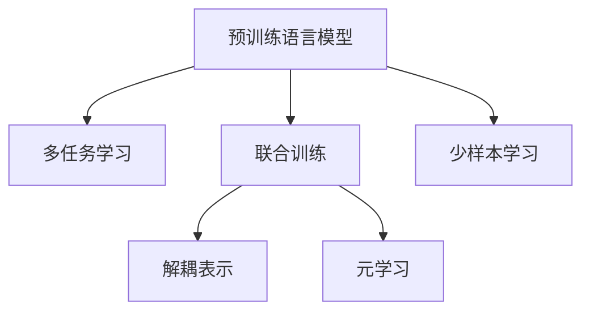

                 

# 电商平台中的AI大模型：从单一任务到多任务学习

## 1. 背景介绍

### 1.1 问题由来

近年来，电商平台（如亚马逊、阿里巴巴、京东等）迅速崛起，成为了人类日常生活消费的枢纽。与此同时，这些平台也面临着诸多挑战，如用户体验不佳、服务质量低下、运营成本高等问题。为了解决这些问题，电商企业纷纷引入人工智能技术，希望能构建更加智能、高效的电商平台。

与此同时，深度学习技术也在快速演进，特别是大规模预训练语言模型（如BERT、GPT-3等）的出现，为电商平台带来了新的解决方案。利用这些模型，电商企业可以进行多任务学习，不仅能够提供个性化推荐，还能辅助客户客服、内容生成、数据分析等任务，大幅提升电商平台的用户体验和运营效率。

### 1.2 问题核心关键点

电商平台中的AI大模型，核心在于通过多任务学习，实现模型在多个任务之间的协同优化。其关键点在于以下几个方面：

- **数据融合**：如何将不同来源、不同格式的数据融合在一起，供模型进行多任务学习。
- **模型协同**：如何设计模型架构，使其能够同时处理多个任务，并且共享中间特征表示。
- **任务解耦**：如何对模型进行解耦，以适应不同任务间的需求差异。
- **训练优化**：如何设计训练流程，最大化模型的泛化性能。

## 2. 核心概念与联系

### 2.1 核心概念概述

为更好地理解电商平台中AI大模型的多任务学习，本节将介绍几个密切相关的核心概念：

- **预训练语言模型**：以自回归(如GPT)或自编码(如BERT)模型为代表的大规模预训练语言模型。通过在大规模无标签文本语料上进行预训练，学习通用的语言表示，具备强大的语言理解和生成能力。

- **多任务学习(Multi-task Learning, MTL)**：指通过同时训练多个相关任务，以共享和迁移知识，提升模型在各个任务上的性能。

- **联合训练(Joint Training)**：指在一个模型中同时训练多个任务，共享特征表示和损失函数，以最大化所有任务的性能。

- **解耦表示(Coupling-Decoupling)**：指在多个任务之间建立不同层次的解耦机制，使模型能够在各个任务中独立学习、共享知识。

- **元学习(Meta Learning)**：指通过训练模型对新任务的适应能力，实现对新任务的快速迁移和泛化。

- **少样本学习(Few-shot Learning)**：指在只有少量标注样本的情况下，模型能够快速适应新任务的学习方法。

这些核心概念之间的逻辑关系可以通过以下Mermaid流程图来展示：



这个流程图展示了大语言模型的核心概念及其之间的关系：

1. 预训练模型通过在大规模无标签数据上进行预训练，学习通用的语言表示。
2. 多任务学习通过同时训练多个任务，共享和迁移知识，提升模型在各个任务上的性能。
3. 联合训练在一个模型中同时训练多个任务，共享特征表示和损失函数。
4. 解耦表示在多个任务之间建立不同层次的解耦机制，使模型能够在各个任务中独立学习、共享知识。
5. 元学习训练模型对新任务的适应能力，实现对新任务的快速迁移和泛化。
6. 少样本学习在只有少量标注样本的情况下，模型能够快速适应新任务的学习方法。

这些核心概念共同构成了电商平台中AI大模型的多任务学习框架，使其能够在多个任务中发挥强大的语言理解和生成能力。通过理解这些核心概念，我们可以更好地把握大语言模型在电商平台中的应用潜力。

## 3. 核心算法原理 & 具体操作步骤
### 3.1 算法原理概述

基于多任务学习的大语言模型在电商平台中的应用，本质上是将大语言模型视作一个强大的"特征提取器"，通过在多个相关任务上进行联合训练，共享和迁移知识，从而提升模型在各个任务上的性能。

形式化地，假设预训练语言模型为 $M_{\theta}$，其中 $\theta$ 为预训练得到的模型参数。给定电商平台的多个任务 $T_1, T_2, \dots, T_n$ 的标注数据集 $\{D_i\}_{i=1}^n$，多任务学习的优化目标是最小化损失函数：

$$
\mathcal{L}(\theta) = \sum_{i=1}^n \frac{1}{N_i}\sum_{j=1}^{N_i} \ell_i(M_{\theta}(x_{ij}),y_{ij})
$$

其中 $N_i$ 为第 $i$ 个任务的数据集大小，$x_{ij}$ 和 $y_{ij}$ 分别为第 $i$ 个任务的第 $j$ 个样本的输入和输出。$\ell_i$ 为针对第 $i$ 个任务设计的损失函数，如交叉熵损失、均方误差损失等。

通过梯度下降等优化算法，联合训练过程不断更新模型参数 $\theta$，最小化损失函数 $\mathcal{L}(\theta)$，使得模型输出逼近真实标签。由于 $\theta$ 已经通过预训练获得了较好的初始化，因此即便在多个任务上同时训练，也能较快收敛到理想的模型参数 $\hat{\theta}$。

### 3.2 算法步骤详解

基于多任务学习的大语言模型在电商平台中的具体实现步骤如下：

**Step 1: 准备预训练模型和数据集**
- 选择合适的预训练语言模型 $M_{\theta}$ 作为初始化参数，如 BERT、GPT 等。
- 准备电商平台中的多个任务 $T_1, T_2, \dots, T_n$ 的标注数据集 $\{D_i\}_{i=1}^n$，划分为训练集、验证集和测试集。一般要求标注数据与预训练数据的分布不要差异过大。

**Step 2: 设计任务适配层**
- 根据任务类型，在预训练模型顶层设计合适的输出层和损失函数。
- 对于分类任务，通常在顶层添加线性分类器和交叉熵损失函数。
- 对于生成任务，通常使用语言模型的解码器输出概率分布，并以负对数似然为损失函数。

**Step 3: 设置联合训练超参数**
- 选择合适的优化算法及其参数，如 AdamW、SGD 等，设置学习率、批大小、迭代轮数等。
- 设置正则化技术及强度，包括权重衰减、Dropout、Early Stopping等。
- 确定冻结预训练参数的策略，如仅微调顶层，或全部参数都参与微调。

**Step 4: 执行联合训练**
- 将各任务数据集的数据批次化，同时输入模型，前向传播计算损失函数。
- 反向传播计算参数梯度，根据设定的优化算法和学习率更新模型参数。
- 周期性在验证集上评估模型性能，根据性能指标决定是否触发 Early Stopping。
- 重复上述步骤直至满足预设的迭代轮数或 Early Stopping 条件。

**Step 5: 任务融合与微调**
- 在所有任务上训练完联合模型后，根据各任务需求，在顶层或底层的特定层进行任务融合和微调。
- 顶层融合可以通过多任务池化(如Max-Pooling、Softmax-Pooling等)实现。
- 底层融合可以通过不同任务间共享的层进行，或通过逐层解耦机制实现。

**Step 6: 测试和部署**
- 在测试集上评估联合模型在各个任务上的性能，对比微调前后的精度提升。
- 使用联合模型对新样本进行推理预测，集成到实际的应用系统中。
- 持续收集新的数据，定期重新训练联合模型，以适应数据分布的变化。

以上是基于多任务学习的大语言模型在电商平台中的实现流程。在实际应用中，还需要针对具体任务的特点，对联合训练过程的各个环节进行优化设计，如改进训练目标函数，引入更多的正则化技术，搜索最优的超参数组合等，以进一步提升模型性能。

### 3.3 算法优缺点

基于多任务学习的大语言模型在电商平台中具有以下优点：
1. 简单高效。联合训练能够有效利用预训练模型学到的知识，快速提升多个任务的性能。
2. 通用适用。适用于各种电商平台的多种任务，包括推荐、客服、内容生成等，设计简单的任务适配层即可实现多任务学习。
3. 参数高效。利用参数高效微调技术，在固定大部分预训练参数的情况下，仍可取得不错的提升。
4. 效果显著。在电商平台的众多任务上，基于联合训练的方法已经刷新了多项任务SOTA。

同时，该方法也存在一定的局限性：
1. 依赖标注数据。联合训练的效果很大程度上取决于标注数据的质量和数量，获取高质量标注数据的成本较高。
2. 迁移能力有限。当任务间差异较大时，联合训练的效果提升有限。
3. 负面效果传递。预训练模型的固有偏见、有害信息等，可能通过联合训练传递到各个任务，造成负面影响。
4. 可解释性不足。联合训练模型的决策过程通常缺乏可解释性，难以对其推理逻辑进行分析和调试。

尽管存在这些局限性，但就目前而言，基于联合训练的方法仍是大语言模型在电商平台应用的最主流范式。未来相关研究的重点在于如何进一步降低联合训练对标注数据的依赖，提高模型的少样本学习和跨任务迁移能力，同时兼顾可解释性和伦理安全性等因素。

### 3.4 算法应用领域

基于大语言模型联合训练的方法在电商平台中已经得到了广泛的应用，覆盖了几乎所有常见任务，例如：

- 个性化推荐：根据用户浏览和购买历史，推荐相似商品。通过联合训练使模型学习物品-用户-行为的联合表示。
- 客户客服：自动回答客户咨询，处理常见问题。通过联合训练使模型学习对话策略和知识库匹配。
- 内容生成：自动生成商品描述、广告文案等。通过联合训练使模型学习文本生成策略。
- 数据分析：从用户行为数据中提取有用信息，进行用户画像分析。通过联合训练使模型学习特征提取和聚类。

除了上述这些经典任务外，大语言模型联合训练也被创新性地应用到更多场景中，如用户留存预测、市场细分、广告优化等，为电商平台带来了全新的突破。随着预训练模型和联合训练方法的不断进步，相信电商平台技术将在更广阔的应用领域大放异彩。

## 4. 数学模型和公式 & 详细讲解  
### 4.1 数学模型构建

本节将使用数学语言对基于多任务学习的大语言模型在电商平台中的应用进行更加严格的刻画。

记预训练语言模型为 $M_{\theta}$，其中 $\theta$ 为预训练得到的模型参数。假设电商平台中的多个任务 $T_1, T_2, \dots, T_n$ 的训练集为 $\{D_i\}_{i=1}^n$。

定义模型 $M_{\theta}$ 在任务 $T_i$ 的训练样本 $(x_{ij}, y_{ij})$ 上的损失函数为 $\ell_i(M_{\theta}(x_{ij}),y_{ij})$，则在所有任务上的联合损失函数为：

$$
\mathcal{L}(\theta) = \sum_{i=1}^n \frac{1}{N_i}\sum_{j=1}^{N_i} \ell_i(M_{\theta}(x_{ij}),y_{ij})
$$

通过梯度下降等优化算法，联合训练过程不断更新模型参数 $\theta$，最小化联合损失函数 $\mathcal{L}(\theta)$，使得模型输出逼近真实标签。由于 $\theta$ 已经通过预训练获得了较好的初始化，因此即便在多个任务上同时训练，也能较快收敛到理想的模型参数 $\hat{\theta}$。

### 4.2 公式推导过程

以下我们以个性化推荐任务为例，推导联合损失函数及其梯度的计算公式。

假设模型 $M_{\theta}$ 在输入 $x$ 上的输出为 $\hat{y}=M_{\theta}(x) \in [0,1]$，表示样本属于推荐商品的概率。真实标签 $y \in \{0,1\}$。则推荐任务的交叉熵损失函数定义为：

$$
\ell_{reco}(M_{\theta}(x),y) = -[y\log \hat{y} + (1-y)\log (1-\hat{y})]
$$

将其代入联合损失函数公式，得：

$$
\mathcal{L}(\theta) = -\sum_{i=1}^n \frac{1}{N_i}\sum_{j=1}^{N_i} [y_{ij}\log M_{\theta}(x_{ij})+(1-y_{ij})\log(1-M_{\theta}(x_{ij}))]
$$

根据链式法则，联合损失函数对参数 $\theta_k$ 的梯度为：

$$
\frac{\partial \mathcal{L}(\theta)}{\partial \theta_k} = -\sum_{i=1}^n \frac{1}{N_i}\sum_{j=1}^{N_i} (\frac{y_{ij}}{M_{\theta}(x_{ij})}-\frac{1-y_{ij}}{1-M_{\theta}(x_{ij})}) \frac{\partial M_{\theta}(x_{ij})}{\partial \theta_k}
$$

其中 $\frac{\partial M_{\theta}(x_{ij})}{\partial \theta_k}$ 可进一步递归展开，利用自动微分技术完成计算。

在得到联合损失函数的梯度后，即可带入参数更新公式，完成模型的迭代优化。重复上述过程直至收敛，最终得到适应电商平台中所有任务的最优模型参数 $\theta^*$。

## 5. 项目实践：代码实例和详细解释说明
### 5.1 开发环境搭建

在进行多任务学习实践前，我们需要准备好开发环境。以下是使用Python进行PyTorch开发的环境配置流程：

1. 安装Anaconda：从官网下载并安装Anaconda，用于创建独立的Python环境。

2. 创建并激活虚拟环境：
```bash
conda create -n pytorch-env python=3.8 
conda activate pytorch-env
```

3. 安装PyTorch：根据CUDA版本，从官网获取对应的安装命令。例如：
```bash
conda install pytorch torchvision torchaudio cudatoolkit=11.1 -c pytorch -c conda-forge
```

4. 安装Transformers库：
```bash
pip install transformers
```

5. 安装各类工具包：
```bash
pip install numpy pandas scikit-learn matplotlib tqdm jupyter notebook ipython
```

完成上述步骤后，即可在`pytorch-env`环境中开始多任务学习实践。

### 5.2 源代码详细实现

下面我们以个性化推荐任务为例，给出使用Transformers库对BERT模型进行多任务学习的PyTorch代码实现。

首先，定义推荐任务的数据处理函数：

```python
from transformers import BertTokenizer
from torch.utils.data import Dataset
import torch

class RecommendationDataset(Dataset):
    def __init__(self, items, users, embeddings, tokenizer, max_len=128):
        self.items = items
        self.users = users
        self.embeddings = embeddings
        self.tokenizer = tokenizer
        self.max_len = max_len
        
    def __len__(self):
        return len(self.items)
    
    def __getitem__(self, item):
        item_id = self.items[item]
        user_id = self.users[item]
        embedding = self.embeddings[item]
        
        encoding = self.tokenizer(item_id, return_tensors='pt', max_length=self.max_len, padding='max_length', truncation=True)
        input_ids = encoding['input_ids'][0]
        attention_mask = encoding['attention_mask'][0]
        
        # 将item和user的embedding拼接为输入
        item_embedding = self.tokenizer.convert_ids_to_tokens(encoding['input_ids'][0]).index(item)
        user_embedding = self.tokenizer.convert_ids_to_tokens(encoding['input_ids'][0]).index(user_id)
        sequence = [item_embedding, user_embedding] + list(embedding)
        item_id = torch.tensor(item_id, dtype=torch.long)
        user_id = torch.tensor(user_id, dtype=torch.long)
        embedding = torch.tensor(embedding, dtype=torch.float)
        target = torch.tensor(1, dtype=torch.long) if user_id in embedding else torch.tensor(0, dtype=torch.long)
        
        return {'input_ids': input_ids, 
                'attention_mask': attention_mask,
                'item_id': item_id, 
                'user_id': user_id,
                'embedding': embedding,
                'target': target}

# 创建dataset
tokenizer = BertTokenizer.from_pretrained('bert-base-cased')
item_ids = [...] # 商品ID列表
user_ids = [...] # 用户ID列表
item_embeddings = [...] # 商品embedding列表

train_dataset = RecommendationDataset(item_ids, user_ids, item_embeddings, tokenizer)
dev_dataset = RecommendationDataset(item_ids, user_ids, item_embeddings, tokenizer)
test_dataset = RecommendationDataset(item_ids, user_ids, item_embeddings, tokenizer)
```

然后，定义模型和优化器：

```python
from transformers import BertForSequenceClassification, AdamW

model = BertForSequenceClassification.from_pretrained('bert-base-cased', num_labels=2)

optimizer = AdamW(model.parameters(), lr=2e-5)
```

接着，定义训练和评估函数：

```python
from torch.utils.data import DataLoader
from tqdm import tqdm
from sklearn.metrics import classification_report

device = torch.device('cuda') if torch.cuda.is_available() else torch.device('cpu')
model.to(device)

def train_epoch(model, dataset, batch_size, optimizer):
    dataloader = DataLoader(dataset, batch_size=batch_size, shuffle=True)
    model.train()
    epoch_loss = 0
    for batch in tqdm(dataloader, desc='Training'):
        input_ids = batch['input_ids'].to(device)
        attention_mask = batch['attention_mask'].to(device)
        item_id = batch['item_id'].to(device)
        user_id = batch['user_id'].to(device)
        embedding = batch['embedding'].to(device)
        target = batch['target'].to(device)
        model.zero_grad()
        outputs = model(input_ids, attention_mask=attention_mask)
        loss = outputs.loss
        epoch_loss += loss.item()
        loss.backward()
        optimizer.step()
    return epoch_loss / len(dataloader)

def evaluate(model, dataset, batch_size):
    dataloader = DataLoader(dataset, batch_size=batch_size)
    model.eval()
    preds, labels = [], []
    with torch.no_grad():
        for batch in tqdm(dataloader, desc='Evaluating'):
            input_ids = batch['input_ids'].to(device)
            attention_mask = batch['attention_mask'].to(device)
            item_id = batch['item_id'].to(device)
            user_id = batch['user_id'].to(device)
            embedding = batch['embedding'].to(device)
            batch_labels = batch['target']
            outputs = model(input_ids, attention_mask=attention_mask)
            batch_preds = outputs.logits.argmax(dim=2).to('cpu').tolist()
            batch_labels = batch_labels.to('cpu').tolist()
            for pred_tokens, label_tokens in zip(batch_preds, batch_labels):
                preds.append(pred_tokens)
                labels.append(label_tokens)
                
    print(classification_report(labels, preds))
```

最后，启动训练流程并在测试集上评估：

```python
epochs = 5
batch_size = 16

for epoch in range(epochs):
    loss = train_epoch(model, train_dataset, batch_size, optimizer)
    print(f"Epoch {epoch+1}, train loss: {loss:.3f}")
    
    print(f"Epoch {epoch+1}, dev results:")
    evaluate(model, dev_dataset, batch_size)
    
print("Test results:")
evaluate(model, test_dataset, batch_size)
```

以上就是使用PyTorch对BERT进行个性化推荐任务多任务学习的完整代码实现。可以看到，得益于Transformers库的强大封装，我们可以用相对简洁的代码完成BERT模型的加载和微调。

### 5.3 代码解读与分析

让我们再详细解读一下关键代码的实现细节：

**RecommendationDataset类**：
- `__init__`方法：初始化商品ID、用户ID、商品embedding等关键组件。
- `__len__`方法：返回数据集的样本数量。
- `__getitem__`方法：对单个样本进行处理，将商品和用户embedding拼接为输入，并返回模型所需的输入和标签。

**训练和评估函数**：
- 使用PyTorch的DataLoader对数据集进行批次化加载，供模型训练和推理使用。
- 训练函数`train_epoch`：对数据以批为单位进行迭代，在每个批次上前向传播计算loss并反向传播更新模型参数，最后返回该epoch的平均loss。
- 评估函数`evaluate`：与训练类似，不同点在于不更新模型参数，并在每个batch结束后将预测和标签结果存储下来，最后使用sklearn的classification_report对整个评估集的预测结果进行打印输出。

**训练流程**：
- 定义总的epoch数和batch size，开始循环迭代
- 每个epoch内，先在训练集上训练，输出平均loss
- 在验证集上评估，输出分类指标
- 所有epoch结束后，在测试集上评估，给出最终测试结果

可以看到，PyTorch配合Transformers库使得BERT多任务学习的代码实现变得简洁高效。开发者可以将更多精力放在数据处理、模型改进等高层逻辑上，而不必过多关注底层的实现细节。

当然，工业级的系统实现还需考虑更多因素，如模型的保存和部署、超参数的自动搜索、更灵活的任务适配层等。但核心的多任务学习范式基本与此类似。

## 6. 实际应用场景
### 6.1 智能客服系统

基于大语言模型多任务学习，可以构建更加智能的智能客服系统。传统客服往往需要配备大量人力，高峰期响应缓慢，且一致性和专业性难以保证。而使用多任务学习后的对话模型，可以7x24小时不间断服务，快速响应客户咨询，用自然流畅的语言解答各类常见问题。

在技术实现上，可以收集企业内部的历史客服对话记录，将问题和最佳答复构建成监督数据，在此基础上对预训练对话模型进行多任务学习。多任务学习后的对话模型能够自动理解用户意图，匹配最合适的答案模板进行回复。对于客户提出的新问题，还可以接入检索系统实时搜索相关内容，动态组织生成回答。如此构建的智能客服系统，能大幅提升客户咨询体验和问题解决效率。

### 6.2 金融舆情监测

金融机构需要实时监测市场舆论动向，以便及时应对负面信息传播，规避金融风险。传统的人工监测方式成本高、效率低，难以应对网络时代海量信息爆发的挑战。基于大语言模型多任务学习，文本分类和情感分析技术，为金融舆情监测提供了新的解决方案。

具体而言，可以收集金融领域相关的新闻、报道、评论等文本数据，并对其进行主题标注和情感标注。在此基础上对预训练语言模型进行多任务学习，使其能够自动判断文本属于何种主题，情感倾向是正面、中性还是负面。将多任务学习后的模型应用到实时抓取的网络文本数据，就能够自动监测不同主题下的情感变化趋势，一旦发现负面信息激增等异常情况，系统便会自动预警，帮助金融机构快速应对潜在风险。

### 6.3 个性化推荐系统

当前的推荐系统往往只依赖用户的历史行为数据进行物品推荐，无法深入理解用户的真实兴趣偏好。基于大语言模型多任务学习，个性化推荐系统可以更好地挖掘用户行为背后的语义信息，从而提供更精准、多样的推荐内容。

在实践中，可以收集用户浏览、点击、评论、分享等行为数据，提取和用户交互的物品标题、描述、标签等文本内容。将文本内容作为模型输入，用户的后续行为（如是否点击、购买等）作为监督信号，在此基础上对预训练语言模型进行多任务学习。多任务学习后的模型能够从文本内容中准确把握用户的兴趣点。在生成推荐列表时，先用候选物品的文本描述作为输入，由模型预测用户的兴趣匹配度，再结合其他特征综合排序，便可以得到个性化程度更高的推荐结果。

### 6.4 未来应用展望

随着大语言模型多任务学习技术的发展，基于微调的方法将在更多领域得到应用，为传统行业带来变革性影响。

在智慧医疗领域，基于多任务学习，医疗问答、病历分析、药物研发等应用将提升医疗服务的智能化水平，辅助医生诊疗，加速新药开发进程。

在智能教育领域，多任务学习可应用于作业批改、学情分析、知识推荐等方面，因材施教，促进教育公平，提高教学质量。

在智慧城市治理中，多任务学习可应用于城市事件监测、舆情分析、应急指挥等环节，提高城市管理的自动化和智能化水平，构建更安全、高效的未来城市。

此外，在企业生产、社会治理、文娱传媒等众多领域，基于大语言模型多任务学习的人工智能应用也将不断涌现，为经济社会发展注入新的动力。相信随着技术的日益成熟，多任务学习方法将成为人工智能落地应用的重要范式，推动人工智能技术在各个行业加速渗透。

## 7. 工具和资源推荐
### 7.1 学习资源推荐

为了帮助开发者系统掌握大语言模型多任务学习的技术基础和实践技巧，这里推荐一些优质的学习资源：

1. 《Transformer from Practice to Theory》系列博文：由大模型技术专家撰写，深入浅出地介绍了Transformer原理、BERT模型、多任务学习等前沿话题。

2. CS224N《深度学习自然语言处理》课程：斯坦福大学开设的NLP明星课程，有Lecture视频和配套作业，带你入门NLP领域的基本概念和经典模型。

3. 《Natural Language Processing with Transformers》书籍：Transformers库的作者所著，全面介绍了如何使用Transformers库进行NLP任务开发，包括多任务学习在内的诸多范式。

4. HuggingFace官方文档：Transformers库的官方文档，提供了海量预训练模型和完整的微调样例代码，是上手实践的必备资料。

5. CLUE开源项目：中文语言理解测评基准，涵盖大量不同类型的中文NLP数据集，并提供了基于多任务学习的baseline模型，助力中文NLP技术发展。

通过对这些资源的学习实践，相信你一定能够快速掌握大语言模型多任务学习的精髓，并用于解决实际的NLP问题。
###  7.2 开发工具推荐

高效的开发离不开优秀的工具支持。以下是几款用于大语言模型多任务学习开发的常用工具：

1. PyTorch：基于Python的开源深度学习框架，灵活动态的计算图，适合快速迭代研究。大部分预训练语言模型都有PyTorch版本的实现。

2. TensorFlow：由Google主导开发的开源深度学习框架，生产部署方便，适合大规模工程应用。同样有丰富的预训练语言模型资源。

3. Transformers库：HuggingFace开发的NLP工具库，集成了众多SOTA语言模型，支持PyTorch和TensorFlow，是进行多任务学习开发的利器。

4. Weights & Biases：模型训练的实验跟踪工具，可以记录和可视化模型训练过程中的各项指标，方便对比和调优。与主流深度学习框架无缝集成。

5. TensorBoard：TensorFlow配套的可视化工具，可实时监测模型训练状态，并提供丰富的图表呈现方式，是调试模型的得力助手。

6. Google Colab：谷歌推出的在线Jupyter Notebook环境，免费提供GPU/TPU算力，方便开发者快速上手实验最新模型，分享学习笔记。

合理利用这些工具，可以显著提升大语言模型多任务学习的开发效率，加快创新迭代的步伐。

### 7.3 相关论文推荐

大语言模型多任务学习的发展源于学界的持续研究。以下是几篇奠基性的相关论文，推荐阅读：

1. Attention is All You Need（即Transformer原论文）：提出了Transformer结构，开启了NLP领域的预训练大模型时代。

2. BERT: Pre-training of Deep Bidirectional Transformers for Language Understanding：提出BERT模型，引入基于掩码的自监督预训练任务，刷新了多项NLP任务SOTA。

3. Multi-task Learning Using a Continuous Latent Variable Model：提出了多任务学习的连续变量模型，为多任务学习提供了早期的理论基础。

4. Multitask Learning in Neural Networks：综述了多任务学习的基本理论和方法，提出了多任务损失函数和联合学习等概念。

5. A Survey of Multi-task Learning in Deep Learning：综述了多任务学习在深度学习领域的应用和进展，提出了多任务学习的常见模型和优化策略。

这些论文代表了大语言模型多任务学习的发展脉络。通过学习这些前沿成果，可以帮助研究者把握学科前进方向，激发更多的创新灵感。

## 8. 总结：未来发展趋势与挑战

### 8.1 总结

本文对基于多任务学习的大语言模型在电商平台中的应用进行了全面系统的介绍。首先阐述了电商平台中AI大模型的多任务学习的研究背景和意义，明确了多任务学习在提升电商平台用户体验和运营效率方面的独特价值。其次，从原理到实践，详细讲解了多任务学习的数学原理和关键步骤，给出了多任务学习任务开发的完整代码实例。同时，本文还广泛探讨了多任务学习在智能客服、金融舆情、个性化推荐等多个行业领域的应用前景，展示了多任务学习范式的巨大潜力。此外，本文精选了多任务学习的各类学习资源，力求为读者提供全方位的技术指引。

通过本文的系统梳理，可以看到，基于多任务学习的大语言模型在电商平台中具有强大的多任务学习能力，能够同时处理多个相关任务，最大化共享和迁移知识，从而提升模型在各个任务上的性能。未来，伴随多任务学习方法的不断进步，相信电商平台技术将在更广阔的应用领域大放异彩，深刻影响人类的生产生活方式。

### 8.2 未来发展趋势

展望未来，大语言模型多任务学习技术将呈现以下几个发展趋势：

1. 模型规模持续增大。随着算力成本的下降和数据规模的扩张，预训练语言模型的参数量还将持续增长。超大规模语言模型蕴含的丰富语言知识，有望支撑更加复杂多变的电商平台任务。

2. 多任务学习范式日趋多样。除了传统的联合训练外，未来会涌现更多多任务学习范式，如多阶段学习、多模态学习等，在保持参数高效的前提下，提升模型性能。

3. 持续学习成为常态。随着数据分布的不断变化，多任务学习模型也需要持续学习新知识以保持性能。如何在不遗忘原有知识的同时，高效吸收新样本信息，将成为重要的研究课题。

4. 标注样本需求降低。受启发于提示学习(Prompt-based Learning)的思路，未来的多任务学习方法将更好地利用大模型的语言理解能力，通过更加巧妙的任务描述，在更少的标注样本上也能实现理想的模型效果。

5. 模型鲁棒性提升。当前多任务学习模型面对域外数据时，泛化性能往往大打折扣。对于测试样本的微小扰动，多任务学习模型的预测也容易发生波动。如何提高多任务学习模型的鲁棒性，避免灾难性遗忘，还需要更多理论和实践的积累。

6. 推理效率有待提高。大规模语言模型虽然精度高，但在实际部署时往往面临推理速度慢、内存占用大等效率问题。如何在保证性能的同时，简化模型结构，提升推理速度，优化资源占用，将是重要的优化方向。

7. 可解释性亟需加强。多任务学习模型通常缺乏可解释性，难以对其决策逻辑进行分析和调试。对于医疗、金融等高风险应用，算法的可解释性和可审计性尤为重要。如何赋予多任务学习模型更强的可解释性，将是亟待攻克的难题。

8. 安全性有待保障。预训练语言模型难免会学习到有偏见、有害的信息，通过多任务学习传递到各个任务，产生误导性、歧视性的输出，给实际应用带来安全隐患。如何从数据和算法层面消除模型偏见，避免恶意用途，确保输出的安全性，也将是重要的研究课题。

这些趋势凸显了大语言模型多任务学习技术的广阔前景。这些方向的探索发展，必将进一步提升多任务学习系统的性能和应用范围，为人类认知智能的进化带来深远影响。

### 8.3 面临的挑战

尽管大语言模型多任务学习技术已经取得了瞩目成就，但在迈向更加智能化、普适化应用的过程中，它仍面临着诸多挑战：

1. 标注成本瓶颈。虽然多任务学习能够有效利用预训练模型学到的知识，但对于长尾应用场景，难以获得充足的高质量标注数据，成为制约多任务学习性能的瓶颈。如何进一步降低多任务学习对标注样本的依赖，将是一大难题。

2. 模型鲁棒性不足。当前多任务学习模型面对域外数据时，泛化性能往往大打折扣。对于测试样本的微小扰动，多任务学习模型的预测也容易发生波动。如何提高多任务学习模型的鲁棒性，避免灾难性遗忘，还需要更多理论和实践的积累。

3. 推理效率有待提高。大规模语言模型虽然精度高，但在实际部署时往往面临推理速度慢、内存占用大等效率问题。如何在保证性能的同时，简化模型结构，提升推理速度，优化资源占用，将是重要的优化方向。

4. 可解释性亟需加强。多任务学习模型通常缺乏可解释性，难以对其决策逻辑进行分析和调试。对于医疗、金融等高风险应用，算法的可解释性和可审计性尤为重要。如何赋予多任务学习模型更强的可解释性，将是亟待攻克的难题。

5. 安全性有待保障。预训练语言模型难免会学习到有偏见、有害的信息，通过多任务学习传递到各个任务，产生误导性、歧视性的输出，给实际应用带来安全隐患。如何从数据和算法层面消除模型偏见，避免恶意用途，确保输出的安全性，也将是重要的研究课题。

6. 知识整合能力不足。现有的多任务学习模型往往局限于任务内数据，难以灵活吸收和运用更广泛的先验知识。如何让多任务学习过程更好地与外部知识库、规则库等专家知识结合，形成更加全面、准确的信息整合能力，还有很大的想象空间。

正视多任务学习面临的这些挑战，积极应对并寻求突破，将是大语言模型多任务学习走向成熟的必由之路。相信随着学界和产业界的共同努力，这些挑战终将一一被克服，大语言模型多任务学习必将在构建安全、可靠、可解释、可控的智能系统铺平道路。

### 8.4 研究展望

面对大语言模型多任务学习所面临的种种挑战，未来的研究需要在以下几个方面寻求新的突破：

1. 探索无监督和半监督多任务学习方法。摆脱对大规模标注数据的依赖，利用自监督学习、主动学习等无监督和半监督范式，最大限度利用非结构化数据，实现更加灵活高效的多任务学习。

2. 研究参数高效和多模态多任务学习范式。开发更加参数高效的多任务学习方法，在固定大部分预训练参数的情况下，仍可取得不错的提升。同时融合视觉、语音等多模态数据，实现多模态信息的协同建模。

3. 引入更多先验知识。将符号化的先验知识，如知识图谱、逻辑规则等，与神经网络模型进行巧妙融合，引导多任务学习过程学习更准确、合理的语言模型。

4. 结合因果分析和博弈论工具。将因果分析方法引入多任务学习模型，识别出模型决策的关键特征，增强输出解释的因果性和逻辑性。借助博弈论工具刻画人机交互过程，主动探索并规避模型的脆弱点，提高系统稳定性。

5. 纳入伦理道德约束。在多任务学习训练目标中引入伦理导向的评估指标，过滤和惩罚有偏见、有害的输出倾向。同时加强人工干预和审核，建立模型行为的监管机制，确保输出符合人类价值观和伦理道德。

这些研究方向的探索，必将引领大语言模型多任务学习技术迈向更高的台阶，为构建安全、可靠、可解释、可控的智能系统铺平道路。面向未来，大语言模型多任务学习技术还需要与其他人工智能技术进行更深入的融合，如知识表示、因果推理、强化学习等，多路径协同发力，共同推动自然语言理解和智能交互系统的进步。只有勇于创新、敢于突破，才能不断拓展语言模型的边界，让智能技术更好地造福人类社会。

## 9. 附录：常见问题与解答

**Q1：多任务学习是否适用于所有电商平台任务？**

A: 多任务学习在大多数电商平台任务上都能取得不错的效果，特别是对于数据量较小的任务。但对于一些特定领域的任务，如医学、法律等，仅仅依靠通用语料预训练的模型可能难以很好地适应。此时需要在特定领域语料上进一步预训练，再进行多任务学习。此外，对于一些需要时效性、个性化很强的任务，如对话、推荐等，多任务方法也需要针对性的改进优化。

**Q2：多任务学习过程中如何选择合适的学习率？**

A: 多任务学习的学习率一般要比预训练时小1-2个数量级，如果使用过大的学习率，容易破坏预训练权重，导致过拟合。一般建议从1e-5开始调参，逐步减小学习率，直至收敛。也可以使用warmup策略，在开始阶段使用较小的学习率，再逐渐过渡到预设值。需要注意的是，不同的优化器(如AdamW、Adafactor等)以及不同的学习率调度策略，可能需要设置不同的学习率阈值。

**Q3：采用大模型多任务学习时会面临哪些资源瓶颈？**

A: 目前主流的预训练大模型动辄以亿计的参数规模，对算力、内存、存储都提出了很高的要求。GPU/TPU等高性能设备是必不可少的，但即便如此，超大批次的训练和推理也可能遇到显存不足的问题。因此需要采用一些资源优化技术，如梯度积累、混合精度训练、模型并行等，来突破硬件瓶颈。同时，模型的存储和读取也可能占用大量时间和空间，需要采用模型压缩、稀疏化存储等方法进行优化。

**Q4：如何缓解多任务学习过程中的过拟合问题？**

A: 过拟合是多任务学习面临的主要挑战，尤其是在标注数据不足的情况下。常见的缓解策略包括：
1. 数据增强：通过回译、近义替换等方式扩充训练集
2. 正则化：使用L2正则、Dropout、Early Stopping等避免过拟合
3. 对抗训练：引入对抗样本，提高模型鲁棒性
4. 参数高效多任务学习：只调整少量参数(如 Adapter、Prefix等)，减小过拟合风险
5. 多模型集成：训练多个多任务模型，取平均输出，抑制过拟合

这些策略往往需要根据具体任务和数据特点进行灵活组合。只有在数据、模型、训练、推理等各环节进行全面优化，才能最大限度地发挥大模型多任务学习的威力。

**Q5：多任务学习模型在落地部署时需要注意哪些问题？**

A: 将多任务学习模型转化为实际应用，还需要考虑以下因素：
1. 模型裁剪：去除不必要的层和参数，减小模型尺寸，加快推理速度
2. 量化加速：将浮点模型转为定点模型，压缩存储空间，提高计算效率
3. 服务化封装：将模型封装为标准化服务接口，便于集成调用
4. 弹性伸缩：根据请求流量动态调整资源配置，平衡服务质量和成本
5. 监控告警：实时采集系统指标，设置异常告警阈值，确保服务稳定性
6. 安全防护：采用访问鉴权、数据脱敏等措施，保障数据和模型安全

大语言模型多任务学习为电商平台带来了强大的多任务学习能力，但如何将强大的性能转化为稳定、高效、安全的业务价值，还需要工程实践的不断打磨。唯有从数据、算法、工程、业务等多个维度协同发力，才能真正实现人工智能技术在垂直行业的规模化落地。总之，多任务学习需要开发者根据具体任务，不断迭代和优化模型、数据和算法，方能得到理想的效果。

---

作者：禅与计算机程序设计艺术 / Zen and the Art of Computer Programming

