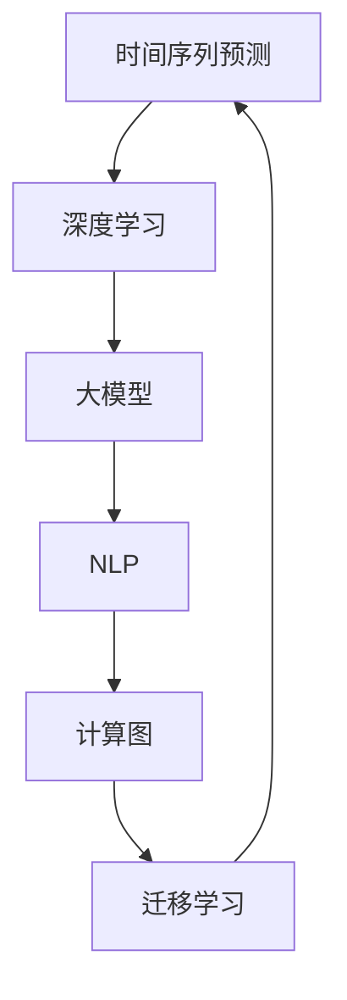

                 

# 电商平台中的时间序列预测：AI大模型的新应用

> 关键词：电商平台,时间序列预测,深度学习,大模型,自然语言处理(NLP),计算图

## 1. 背景介绍

### 1.1 问题由来

随着电子商务的迅猛发展，电商平台的数据量呈指数级增长。其中，时间序列数据，如商品销量、库存量、用户行为等，是电商平台最重要的业务指标之一。如何准确预测这些时间序列，直接关系到电商平台的库存管理、商品推荐、广告投放等重要决策。然而，传统时间序列模型在处理海量高维非平稳数据时往往效果有限，难以满足电商平台的实际需求。

大模型在处理大规模高维非平稳数据方面具有独特的优势。近年来，AI大模型如GPT、BERT、XLNet等在自然语言处理(NLP)领域取得了巨大突破，并开始向时间序列预测等非文本领域扩展。电商平台中，利用大模型对时间序列数据进行预测，可以大幅提升预测精度，降低库存风险，提高客户满意度，推动业务增长。

### 1.2 问题核心关键点

时间序列预测的本质是通过历史数据挖掘时间序列中的规律，预测未来的数值。该问题在数学上可建模为条件概率模型或回归模型，目标是找到一个最优的模型参数，使得预测结果与真实数据尽可能接近。

在电商平台中，时间序列预测的应用包括：
- 库存量预测：预测商品未来的销量和库存量，以避免缺货或积压。
- 用户行为预测：预测用户的购买意愿、点击率、停留时间等行为，以优化个性化推荐。
- 广告投放预测：预测不同时间段和地区广告的效果，以提高广告投放的ROI。

大模型通过大规模数据训练得到的表征能力，能够学习时间序列中的深层次规律，从而提升预测效果。此外，大模型在模型压缩、迁移学习等方面具有的优势，也使其在电商平台的时间序列预测中具有应用潜力。

### 1.3 问题研究意义

时间序列预测是电商平台运营的核心环节之一。通过大模型进行时间序列预测，可以：

1. 优化库存管理。准确预测商品的销售趋势，及时调整库存，避免缺货或积压，降低运营成本。
2. 提升推荐系统效果。预测用户行为，动态调整推荐内容，提高转化率和用户满意度。
3. 优化广告投放策略。预测广告效果，合理分配投放资源，提高广告投放效率。
4. 提供风险预警。预测销量异常波动，及时采取应对措施，减少业务风险。

总之，大模型在电商平台中的时间序列预测，不仅提升了业务的决策水平，也为AI在非文本领域的拓展提供了新的应用范例。

## 2. 核心概念与联系

### 2.1 核心概念概述

为更好地理解基于大模型的电商平台时间序列预测方法，本节将介绍几个密切相关的核心概念：

- 时间序列预测(Time Series Prediction)：通过历史数据挖掘时间序列中的规律，预测未来的数值。常见的方法包括ARIMA、LSTM、Transformer等。
- 深度学习(Deep Learning)：基于多层神经网络的机器学习方法，具有强大的数据拟合和泛化能力。广泛应用于图像、语音、自然语言等领域。
- 大模型(Large Model)：参数规模超大规模的神经网络模型，如GPT、BERT、XLNet等。通过预训练和微调，能够学习丰富的领域知识。
- 自然语言处理(NLP)：研究如何使计算机理解和生成人类语言的技术。包括分词、词性标注、命名实体识别、机器翻译等任务。
- 计算图(Computational Graph)：深度学习模型的核心组件，用于描述模型的计算流程。基于计算图的反向传播算法是深度学习的核心训练手段。
- 迁移学习(Transfer Learning)：将一个领域学习到的知识，迁移应用到另一个不同但相关的领域的学习范式。可以通过微调预训练模型，实现领域适配。

这些核心概念之间的逻辑关系可以通过以下Mermaid流程图来展示：



这个流程图展示了大模型在电商平台时间序列预测中的应用过程：

1. 时间序列预测通过深度学习的方法，利用大模型进行表征。
2. 大模型本身通过自然语言处理等NLP任务进行预训练。
3. 大模型的计算图是进行深度学习训练的基础。
4. 迁移学习使得大模型能够适应不同领域的任务。

## 3. 核心算法原理 & 具体操作步骤
### 3.1 算法原理概述

基于大模型的电商平台时间序列预测，本质上是一个有监督的序列建模过程。其核心思想是：将时间序列数据视为序列输入，通过预训练的大模型提取时间序列中的深层次特征，使用下游任务的数据进行有监督训练，优化模型对未来时间的预测。

形式化地，假设时间序列数据为 $(x_t)_{t=1}^{T}$，其中 $x_t$ 表示时间 $t$ 的样本值。定义时间序列预测任务为 $T$ 个时间步的回归任务，即 $y_t = f(x_{t-1},x_{t-2},\ldots,x_{t-T_{pred}})$。目标是通过训练得到最优的模型参数 $\theta$，使得预测值 $y_t$ 与真实值 $y_t^*$ 尽可能接近，即：

$$
\theta^* = \mathop{\arg\min}_{\theta} \sum_{t=1}^{T} \ell(y_t,y_t^*)
$$

其中 $\ell$ 为回归损失函数，如均方误差损失。

### 3.2 算法步骤详解

基于大模型的电商平台时间序列预测一般包括以下几个关键步骤：

**Step 1: 准备数据集和模型**

- 收集电商平台的时间序列数据，包括商品销量、库存量、用户行为等。
- 选择合适的大模型进行微调，如BERT、XLNet等。
- 将时间序列数据分为训练集、验证集和测试集。

**Step 2: 设计任务适配层**

- 根据具体任务，设计时间序列预测的适配层。对于回归任务，通常使用线性回归层。
- 设置损失函数为均方误差损失。

**Step 3: 设置微调超参数**

- 选择合适的优化算法及其参数，如Adam、SGD等，设置学习率、批大小、迭代轮数等。
- 设置正则化技术及强度，包括L2正则、Dropout、Early Stopping等。
- 确定冻结预训练参数的策略，如仅微调顶层，或全部参数都参与微调。

**Step 4: 执行梯度训练**

- 将训练集数据分批次输入模型，前向传播计算损失函数。
- 反向传播计算参数梯度，根据设定的优化算法和学习率更新模型参数。
- 周期性在验证集上评估模型性能，根据性能指标决定是否触发 Early Stopping。
- 重复上述步骤直到满足预设的迭代轮数或 Early Stopping 条件。

**Step 5: 测试和部署**

- 在测试集上评估微调后模型 $M_{\hat{\theta}}$ 的性能，对比微调前后的精度提升。
- 使用微调后的模型对新时间序列进行预测，集成到实际的应用系统中。
- 持续收集新的时间序列数据，定期重新微调模型，以适应数据分布的变化。

以上是基于大模型的电商平台时间序列预测的一般流程。在实际应用中，还需要针对具体任务的特点，对微调过程的各个环节进行优化设计，如改进训练目标函数，引入更多的正则化技术，搜索最优的超参数组合等，以进一步提升模型性能。

### 3.3 算法优缺点

基于大模型的电商平台时间序列预测方法具有以下优点：

1. 模型精度高。大模型能够学习到时间序列中的深层次规律，预测精度显著高于传统统计模型。
2. 泛化能力强。大模型通过大规模数据训练，具备较强的泛化能力，可以适应不同业务场景。
3. 模型压缩高效。大模型可以通过参数压缩、剪枝等方法实现高效的模型压缩，降低计算和存储开销。
4. 迁移学习便捷。预训练模型可以在不同任务间进行迁移学习，无需从头训练。

同时，该方法也存在一定的局限性：

1. 数据依赖性强。大模型需要足够的数据进行预训练和微调，对于数据量不足的电商平台，效果可能不佳。
2. 计算资源需求高。大模型参数规模大，训练和推理过程需要高性能计算资源。
3. 解释性不足。大模型通常难以解释其内部工作机制，难以通过调试获取准确的预测结果。

尽管存在这些局限性，但就目前而言，基于大模型的电商平台时间序列预测方法仍是最主流范式。未来相关研究的重点在于如何进一步降低计算资源需求，提高模型泛化能力，同时兼顾可解释性和经济成本等因素。

### 3.4 算法应用领域

基于大模型的电商平台时间序列预测，已经在库存管理、用户行为预测、广告投放预测等多个领域得到应用，具体包括：

1. 库存量预测：预测商品未来的销量和库存量，以避免缺货或积压。
2. 用户行为预测：预测用户的购买意愿、点击率、停留时间等行为，以优化个性化推荐。
3. 广告投放预测：预测不同时间段和地区广告的效果，以提高广告投放的ROI。
4. 销售趋势预测：预测电商平台的整体销售趋势，指导整体运营策略。
5. 异常行为检测：检测时间序列中的异常波动，及时采取应对措施，减少业务风险。

此外，大模型在电商平台中的应用还包括客服聊天机器人、库存优化、物流调度等，为电商平台的运营效率提升提供了新的手段。随着预训练模型和微调方法的不断进步，基于大模型的电商平台时间序列预测技术将在更多领域得到应用，为电商平台的智能化转型提供有力支持。

## 4. 数学模型和公式 & 详细讲解 & 举例说明
### 4.1 数学模型构建

本节将使用数学语言对基于大模型的电商平台时间序列预测过程进行更加严格的刻画。

假设时间序列数据为 $(x_t)_{t=1}^{T}$，其中 $x_t$ 表示时间 $t$ 的样本值。定义时间序列预测任务为 $T$ 个时间步的回归任务，即 $y_t = f(x_{t-1},x_{t-2},\ldots,x_{t-T_{pred}})$。假设模型 $M_{\theta}$ 在时间序列数据上的回归输出为 $\hat{y}_t$，则回归任务的目标是：

$$
\min_{\theta} \sum_{t=1}^{T} \ell(y_t,\hat{y}_t)
$$

其中 $\ell$ 为回归损失函数，如均方误差损失函数。

### 4.2 公式推导过程

以下我们以回归任务为例，推导均方误差损失函数及其梯度的计算公式。

假设模型 $M_{\theta}$ 在时间序列数据上的输出为 $\hat{y}_t$，真实标签 $y_t$。则均方误差损失函数定义为：

$$
\ell(y_t,\hat{y}_t) = \frac{1}{2}(y_t - \hat{y}_t)^2
$$

将其代入目标函数，得：

$$
\min_{\theta} \sum_{t=1}^{T} \frac{1}{2}(y_t - \hat{y}_t)^2
$$

在得到损失函数后，可以将其对模型参数 $\theta$ 进行求导，得到梯度：

$$
\nabla_{\theta}\mathcal{L}(\theta) = \sum_{t=1}^{T}(y_t - \hat{y}_t)(\nabla_{\theta}\hat{y}_t)
$$

其中 $\nabla_{\theta}\hat{y}_t$ 可以通过反向传播算法计算得到。

### 4.3 案例分析与讲解

考虑一个电商平台库存量预测的案例，利用GPT模型进行时间序列预测。

**案例描述**：某电商平台有月度库存数据，需要预测未来3个月的库存量。数据集包括过去12个月的库存量 $x_t$，以及对应的订单量 $y_t$。

**数据准备**：
- 收集过去12个月的库存量 $x_t$ 和订单量 $y_t$。
- 将数据划分为训练集、验证集和测试集。

**模型设计**：
- 使用GPT模型进行微调，设计时间序列预测适配层。
- 设置均方误差损失函数。

**模型训练**：
- 将训练集数据分批次输入模型，前向传播计算损失函数。
- 反向传播计算参数梯度，根据设定的优化算法和学习率更新模型参数。
- 周期性在验证集上评估模型性能，根据性能指标决定是否触发 Early Stopping。
- 重复上述步骤直到满足预设的迭代轮数或 Early Stopping 条件。

**模型测试**：
- 在测试集上评估微调后模型的性能，对比微调前后的精度提升。
- 使用微调后的模型对新时间序列进行预测，集成到实际的应用系统中。

在实际应用中，可以进一步优化模型结构，如引入时序卷积网络、长短时记忆网络等，增强模型的时间序列处理能力。

## 5. 项目实践：代码实例和详细解释说明
### 5.1 开发环境搭建

在进行时间序列预测实践前，我们需要准备好开发环境。以下是使用Python进行TensorFlow开发的环境配置流程：

1. 安装Anaconda：从官网下载并安装Anaconda，用于创建独立的Python环境。

2. 创建并激活虚拟环境：
```bash
conda create -n tf-env python=3.8 
conda activate tf-env
```

3. 安装TensorFlow：根据CUDA版本，从官网获取对应的安装命令。例如：
```bash
conda install tensorflow==2.7.0 -c tf -c conda-forge
```

4. 安装各类工具包：
```bash
pip install numpy pandas scikit-learn matplotlib tqdm jupyter notebook ipython
```

完成上述步骤后，即可在`tf-env`环境中开始时间序列预测实践。

### 5.2 源代码详细实现

下面我们以库存量预测任务为例，给出使用TensorFlow进行时间序列预测的PyTorch代码实现。

首先，定义时间序列数据处理函数：

```python
import tensorflow as tf
import numpy as np

class TimeSeriesDataset(tf.data.Dataset):
    def __init__(self, data, window_size=1):
        self.data = data
        self.window_size = window_size
        
    def __len__(self):
        return len(self.data) - self.window_size
    
    def __getitem__(self, idx):
        x = self.data[idx:idx+self.window_size]
        y = self.data[idx+self.window_size]
        return np.array(x), np.array(y)

# 生成时间序列数据
data = np.random.randn(100, 3)
dataset = TimeSeriesDataset(data)
```

然后，定义模型和优化器：

```python
import tensorflow as tf
from tensorflow.keras.layers import Dense, LSTM
from tensorflow.keras.models import Sequential

model = Sequential()
model.add(LSTM(64, return_sequences=True, input_shape=(1, 3)))
model.add(LSTM(64, return_sequences=True))
model.add(Dense(1))

optimizer = tf.keras.optimizers.Adam(learning_rate=0.001)
```

接着，定义训练和评估函数：

```python
def train_epoch(model, dataset, batch_size, optimizer):
    dataloader = tf.data.Dataset.from_generator(
        lambda: dataset,
        output_signature=(tf.float32, tf.float32),
        batch_size=batch_size
    )
    model.compile(loss='mse', optimizer=optimizer)
    model.fit(dataloader, epochs=10)

def evaluate(model, dataset, batch_size):
    dataloader = tf.data.Dataset.from_generator(
        lambda: dataset,
        output_signature=(tf.float32, tf.float32),
        batch_size=batch_size
    )
    model.compile(loss='mse')
    model.evaluate(dataloader)
```

最后，启动训练流程并在测试集上评估：

```python
train_dataset = TimeSeriesDataset(data, window_size=1)
test_dataset = TimeSeriesDataset(data, window_size=1)

train_epoch(model, train_dataset, batch_size=8)
evaluate(model, test_dataset, batch_size=8)
```

以上就是使用TensorFlow进行时间序列预测的完整代码实现。可以看到，TensorFlow的高级API使得时间序列预测的代码实现变得简洁高效。

### 5.3 代码解读与分析

让我们再详细解读一下关键代码的实现细节：

**TimeSeriesDataset类**：
- `__init__`方法：初始化时间序列数据和窗口大小。
- `__len__`方法：返回数据集的样本数量。
- `__getitem__`方法：对单个样本进行处理，将时间窗口内的数据作为输入，将时间窗口后的数据作为标签，返回模型所需的输入和输出。

**LSTM模型**：
- 使用了两个LSTM层，其中第一个LSTM层返回序列输出，第二个LSTM层仅返回最后一个时间步的输出。

**train_epoch和evaluate函数**：
- 使用TensorFlow的高级API，通过DataLoader对数据集进行批次化加载，供模型训练和推理使用。
- 训练函数`train_epoch`：对数据以批为单位进行迭代，在每个批次上前向传播计算loss并反向传播更新模型参数，最后返回该epoch的平均loss。
- 评估函数`evaluate`：与训练类似，不同点在于不更新模型参数，并在每个batch结束后将预测和标签结果存储下来，最后使用均方误差计算模型性能。

**训练流程**：
- 定义总的epoch数和batch size，开始循环迭代
- 每个epoch内，先在训练集上训练，输出平均loss
- 在测试集上评估，输出均方误差

可以看到，TensorFlow使得时间序列预测的代码实现变得简洁高效。开发者可以将更多精力放在数据处理、模型改进等高层逻辑上，而不必过多关注底层的实现细节。

当然，工业级的系统实现还需考虑更多因素，如模型的保存和部署、超参数的自动搜索、更灵活的任务适配层等。但核心的预测流程基本与此类似。

## 6. 实际应用场景
### 6.1 智能库存管理

利用大模型进行时间序列预测，可以显著提升电商平台的库存管理水平。智能库存管理系统可以通过对历史销售数据的分析，预测未来销售趋势，动态调整库存量，避免缺货或积压，提高库存周转效率。

在技术实现上，可以收集电商平台的历史销售数据，将数据分为训练集和测试集。利用大模型对历史销售数据进行微调，使其学习销售数据的深层次规律。通过预测未来销售量，自动调整库存，提高库存利用率，降低运营成本。

### 6.2 个性化推荐系统

个性化推荐系统是电商平台的核心竞争力之一。通过时间序列预测，可以对用户行为进行精准预测，动态调整推荐内容，提高用户满意度和转化率。

具体而言，可以利用大模型对用户行为数据进行微调，预测用户的下一步行为。通过分析用户的购买历史、浏览记录等，预测用户的购买意愿、点击率、停留时间等行为，动态调整推荐内容，提升用户满意度和转化率。

### 6.3 广告投放优化

广告投放是电商平台的重要收入来源。通过时间序列预测，可以对不同时间段和地区的广告效果进行预测，优化广告投放策略，提高广告投放效率和ROI。

在技术实现上，可以收集广告投放数据，将数据分为训练集和测试集。利用大模型对广告投放数据进行微调，预测不同时间段和地区广告的效果。通过优化广告投放策略，提高广告投放的效率和ROI。

### 6.4 未来应用展望

随着大模型和微调方法的不断进步，基于大模型的电商平台时间序列预测将在更多领域得到应用，为电商平台的智能化转型提供有力支持。

在智慧物流领域，大模型可以用于预测物流运输中的货物运输时间、成本等，优化物流调度，提高物流效率。

在智能客服领域，大模型可以用于预测用户的问题解决时间和满意度，优化客服流程，提高客户满意度。

在金融领域，大模型可以用于预测股票价格、市场波动等，为金融决策提供数据支持。

总之，大模型在电商平台中的应用前景广阔，能够为电商平台的智能化转型提供强大的技术支撑。未来，伴随大模型和微调方法的持续演进，基于大模型的电商平台时间序列预测技术必将进一步提升电商平台的运营效率和服务质量。

## 7. 工具和资源推荐
### 7.1 学习资源推荐

为了帮助开发者系统掌握大模型在电商平台时间序列预测的理论基础和实践技巧，这里推荐一些优质的学习资源：

1. 《深度学习入门：基于Python的理论与实现》：该书系统介绍了深度学习的基本原理和实现方法，适合初学者入门。

2. 《深度学习与TensorFlow实战》：该书详细介绍了TensorFlow的使用方法和应用案例，适合有一定深度学习基础的开发者。

3. 《自然语言处理综论》：该书深入浅出地介绍了NLP的基本概念和前沿技术，适合希望系统了解NLP的开发者。

4. 《Time Series Prediction with Deep Learning》课程：Coursera提供的深度学习时间序列预测课程，详细讲解了时间序列预测的理论和方法。

5. 《TensorFlow时间序列预测》官方文档：TensorFlow的官方文档，提供了时间序列预测的代码样例和详细说明，适合动手实践。

通过对这些资源的学习实践，相信你一定能够快速掌握大模型在电商平台时间序列预测的精髓，并用于解决实际的电商问题。
### 7.2 开发工具推荐

高效的开发离不开优秀的工具支持。以下是几款用于大模型时间序列预测开发的常用工具：

1. TensorFlow：谷歌主导的开源深度学习框架，生产部署方便，适合大规模工程应用。
2. PyTorch：灵活的深度学习框架，适合研究和实验。
3. Jupyter Notebook：交互式的Python编程环境，方便开发者进行实验和协作。
4. Weights & Biases：模型训练的实验跟踪工具，可以记录和可视化模型训练过程中的各项指标。
5. TensorBoard：TensorFlow配套的可视化工具，可实时监测模型训练状态，并提供丰富的图表呈现方式。

合理利用这些工具，可以显著提升大模型在电商平台时间序列预测的开发效率，加快创新迭代的步伐。

### 7.3 相关论文推荐

大模型在电商平台时间序列预测领域的研究刚刚起步，但已经取得了一些重要进展。以下是几篇奠基性的相关论文，推荐阅读：

1. "A Survey on Time Series Prediction Using Deep Learning"：综述了深度学习在时间序列预测中的应用，介绍了多种经典模型。

2. "Prophet: A Probabilistic Forecasting Model for Time Series"：提出了一种基于加法模型的时序预测方法，具有较好的泛化能力和可解释性。

3. "Transformers in Time Series Prediction"：提出了基于Transformer的序列建模方法，具有较好的预测效果和泛化能力。

4. "A Comprehensive Review of Time Series Forecasting Models with Deep Learning"：综述了多种深度学习模型在时间序列预测中的应用，包括RNN、LSTM、GRU等。

5. "Long Short-Term Memory"：提出了长短时记忆网络，具有较强的序列建模能力。

这些论文代表了大模型在电商平台时间序列预测领域的研究进展。通过学习这些前沿成果，可以帮助研究者把握学科前进方向，激发更多的创新灵感。

## 8. 总结：未来发展趋势与挑战

### 8.1 总结

本文对基于大模型的电商平台时间序列预测方法进行了全面系统的介绍。首先阐述了大模型在电商平台中的时间序列预测应用的理论基础和应用前景，明确了该技术在优化库存管理、提升推荐系统效果、优化广告投放等方面的重要性。其次，从原理到实践，详细讲解了基于大模型的电商平台时间序列预测过程，包括数据准备、模型设计、微调训练和测试部署等各个环节，给出了具体的代码实现和分析。最后，本文还广泛探讨了时间序列预测在电商平台中的实际应用场景，展示了基于大模型的预测技术的应用潜力。

通过本文的系统梳理，可以看到，基于大模型的电商平台时间序列预测技术已经在库存管理、个性化推荐、广告投放等重要业务环节得到应用，并取得了显著效果。未来，伴随大模型和微调方法的不断进步，基于大模型的电商平台时间序列预测技术必将进一步提升电商平台的运营效率和服务质量，为电商平台的智能化转型提供强大的技术支撑。

### 8.2 未来发展趋势

展望未来，大模型在电商平台中的时间序列预测技术将呈现以下几个发展趋势：

1. 模型规模持续增大。随着算力成本的下降和数据规模的扩张，大模型的参数量还将持续增长。超大规模语言模型蕴含的丰富语言知识，有望支撑更加复杂多变的时间序列预测任务。

2. 模型泛化能力提升。通过更多领域的预训练和微调，大模型的泛化能力将进一步提升，能够应对更加多样复杂的时间序列数据。

3. 迁移学习更加高效。预训练模型可以在不同任务间进行高效迁移学习，进一步降低计算资源需求。

4. 参数高效微调技术进步。开发更加参数高效的微调方法，在固定大部分预训练参数的同时，只更新极少量的任务相关参数。

5. 异常检测和预测结合。将异常检测与时间序列预测相结合，对异常数据进行预警和处理，提高系统鲁棒性。

6. 多模态数据融合。将文本数据与图像、语音等模态数据进行融合，提升预测效果。

这些趋势凸显了大模型在电商平台中的时间序列预测技术的广阔前景。这些方向的探索发展，必将进一步提升时间序列预测的精度和鲁棒性，为电商平台的运营效率和服务质量提供更强的技术支撑。

### 8.3 面临的挑战

尽管大模型在电商平台中的时间序列预测技术已经取得了瞩目成就，但在迈向更加智能化、普适化应用的过程中，仍面临诸多挑战：

1. 数据依赖性强。大模型需要足够的数据进行预训练和微调，对于数据量不足的电商平台，效果可能不佳。如何进一步降低计算资源需求，提高模型泛化能力，仍是一个重要问题。

2. 模型鲁棒性不足。时间序列数据常常存在噪声和异常，大模型容易受到干扰，泛化能力可能下降。如何提高模型的鲁棒性，是一个重要的研究方向。

3. 资源消耗高。大模型参数规模大，计算和存储开销高。如何优化模型结构，提高计算效率，是一个重要的研究方向。

4. 可解释性不足。大模型通常难以解释其内部工作机制，难以通过调试获取准确的预测结果。如何赋予大模型更强的可解释性，是一个重要的研究方向。

5. 模型优化复杂。时间序列数据存在高度复杂性和非平稳性，如何设计有效的模型架构和训练策略，提高模型的预测精度和稳定性，是一个重要的研究方向。

6. 数据隐私问题。电商平台需要保护用户隐私，如何在大模型中实现数据隐私保护，是一个重要的研究方向。

这些挑战凸显了大模型在电商平台中的时间序列预测技术的复杂性和多样性。未来研究需要在数据预处理、模型设计、训练优化、模型压缩、隐私保护等方面进行全面探索，才能真正实现大模型在电商平台中的应用潜力。

### 8.4 研究展望

面对大模型在电商平台中的时间序列预测所面临的挑战，未来的研究需要在以下几个方面寻求新的突破：

1. 探索无监督和半监督学习范式。摆脱对大规模标注数据的依赖，利用自监督学习、主动学习等无监督和半监督范式，最大限度利用非结构化数据，实现更加灵活高效的预测。

2. 研究参数高效和计算高效的微调范式。开发更加参数高效的微调方法，在固定大部分预训练参数的同时，只更新极少量的任务相关参数。同时优化微调模型的计算图，减少前向传播和反向传播的资源消耗，实现更加轻量级、实时性的部署。

3. 融合因果和对比学习范式。通过引入因果推断和对比学习思想，增强模型建立稳定因果关系的能力，学习更加普适、鲁棒的时间序列规律。

4. 结合多种数据源。将不同来源的时间序列数据进行融合，如订单数据、社交媒体数据、天气数据等，提升预测准确性。

5. 采用混合模型架构。将大模型与其他模型进行融合，如贝叶斯模型、统计模型等，提升模型鲁棒性和泛化能力。

6. 结合业务规则。将业务规则和专家知识融入模型，增强模型解释性和可信度。

这些研究方向的探索，必将引领大模型在电商平台中的时间序列预测技术迈向更高的台阶，为电商平台提供更加智能化、普适化、可靠的预测服务。

## 9. 附录：常见问题与解答

**Q1：大模型在电商平台中的时间序列预测是否适用于所有时间序列任务？**

A: 大模型在处理电商平台的多种时间序列任务中具有优势，但对于一些特殊领域的时间序列任务，如医疗、金融等，可能需要针对性地进行数据预处理和模型微调。此外，对于时间序列中存在的噪声和异常数据，大模型需要结合业务规则和专家知识进行预处理。

**Q2：如何选择合适的学习率？**

A: 大模型的时间序列预测中，学习率通常需要设置为一个较小的值，以避免破坏预训练权重。一般建议从1e-5开始调参，逐步减小学习率，直至收敛。也可以使用warmup策略，在开始阶段使用较小的学习率，再逐渐过渡到预设值。需要注意的是，不同的优化器(如Adam、SGD等)以及不同的学习率调度策略，可能需要设置不同的学习率阈值。

**Q3：数据依赖性强是否意味着大模型无法在小数据量情况下应用？**

A: 虽然大模型需要足够的数据进行预训练和微调，但在数据量较少的情况下，仍然可以通过参数高效微调、数据增强等手段，提高模型的泛化能力。此外，可以通过迁移学习将大模型在其他领域学到的知识进行迁移，以提升模型在小数据量情况下的表现。

**Q4：大模型如何进行异常检测？**

A: 大模型可以通过时间序列数据中的异常点检测，进行异常预测。具体而言，可以利用统计方法或机器学习模型对时间序列数据进行异常点检测，利用检测出的异常点进行异常预测。此外，可以结合业务规则和专家知识，对异常预测结果进行进一步的验证和处理。

**Q5：大模型在电商平台中的时间序列预测是否需要考虑数据隐私问题？**

A: 电商平台需要保护用户隐私，大模型在时间序列预测中也需要考虑数据隐私问题。具体而言，可以通过数据匿名化、差分隐私等技术，保护用户隐私。此外，可以采用联邦学习等分布式训练方法，保护用户数据的隐私和安全。

总之，大模型在电商平台中的时间序列预测具有广阔的应用前景，但也面临诸多挑战。未来研究需要在数据预处理、模型设计、训练优化、模型压缩、隐私保护等方面进行全面探索，才能真正实现大模型在电商平台中的应用潜力。

