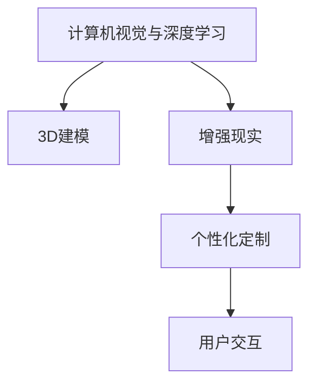

                 

# 电商平台中的虚拟试衣间技术应用

> 关键词：虚拟试衣间,电商平台,人工智能,深度学习,增强现实,3D建模,用户个性化

## 1. 背景介绍

### 1.1 问题由来
随着互联网和电子商务的迅速发展，线上购物已经成为了越来越多消费者的首选方式。然而，线上购物的一个痛点在于，消费者无法亲身试穿服装，尤其是对于服装类商品，尤其是对于有特殊设计和剪裁的衣物，例如定制服装、艺术类服饰等，仅凭图片或视频很难准确判断其效果，导致消费者购买后可能不满意，甚至引发退换货的烦恼。

为了解决这一问题，电商平台开始尝试引入虚拟试衣间技术，让消费者可以在线试穿不同款式和颜色的服装，从而提高购买决策的准确性和满意度，同时减少退货率，降低运营成本。虚拟试衣间技术通过计算机视觉、深度学习、增强现实等技术手段，结合3D建模和用户个性化定制，实现了虚拟试穿的效果。

### 1.2 问题核心关键点
虚拟试衣间技术的核心关键点在于如何通过计算机视觉和深度学习技术，实时捕捉用户身体数据，并通过3D建模将服装虚拟贴覆在用户身上，同时考虑不同款式、颜色、尺码等变体，实现逼真的虚拟试穿效果。以下为本技术的关键点：
- 计算机视觉与深度学习：捕捉用户实时身体数据，提取3D人体模型。
- 3D建模：将服装映射到3D人体模型上，并进行渲染显示。
- 增强现实：结合现实场景，增强用户体验。
- 个性化定制：考虑不同用户的身体特征和偏好，进行模型适配。
- 用户交互：提供交互式虚拟试穿体验，提升用户满意度。

## 2. 核心概念与联系

### 2.1 核心概念概述

为更好地理解虚拟试衣间技术，本节将介绍几个密切相关的核心概念：

- **计算机视觉与深度学习**：通过摄像头、图像处理等技术手段，捕捉用户身体数据，并通过深度学习算法提取3D人体模型，为虚拟试衣间提供数据基础。
- **3D建模**：将服装图像或3D模型与用户3D人体模型结合，进行虚拟贴覆和渲染，实现逼真的虚拟试穿效果。
- **增强现实**：将虚拟试衣效果与现实场景相结合，增强用户的沉浸感。
- **个性化定制**：通过用户输入的身体数据、偏好和历史试穿数据，对虚拟试衣间进行个性化适配。
- **用户交互**：提供交互式界面和反馈机制，增强用户参与感，提升用户体验。

这些核心概念之间的逻辑关系可以通过以下Mermaid流程图来展示：



这个流程图展示了他核心概念之间的联系：

1. 用户通过摄像头和图像处理技术，采集身体数据，并通过深度学习算法提取3D人体模型。
2. 3D建模将服装与3D人体模型结合，生成虚拟试穿效果。
3. 增强现实将虚拟试穿效果与现实场景结合，增强用户体验。
4. 个性化定制考虑用户特性和偏好，进行模型适配。
5. 用户交互提供互动界面，提升用户体验。

## 3. 核心算法原理 & 具体操作步骤
### 3.1 算法原理概述

虚拟试衣间的核心算法流程分为两个部分：数据捕捉与处理以及3D建模与渲染。以下是对这两个部分的详细阐述。

#### 数据捕捉与处理

1. **图像采集与预处理**：用户通过摄像头拍摄全身照片，采集身体轮廓和服装信息。
2. **深度学习提取3D人体模型**：利用卷积神经网络(CNN)和3D姿态估计算法，从采集到的图像中提取用户3D人体模型。
3. **人体关键点定位**：通过关键点检测算法，如基于热图的方法或基于特征的方法，定位用户身体的关键点，如肩膀、腰部、膝部等。

#### 3D建模与渲染

1. **服装映射**：将用户选择的服装图像或3D模型映射到用户3D人体模型上，进行虚拟试穿。
2. **纹理贴图**：为服装模型添加纹理，使虚拟试穿效果更加逼真。
3. **渲染显示**：利用渲染引擎进行实时渲染，展示虚拟试穿效果，并提供交互界面。

### 3.2 算法步骤详解

#### 数据捕捉与处理

**Step 1: 图像采集与预处理**
- 使用摄像头采集用户全身照片，包含完整身体信息和服装信息。
- 对图像进行预处理，包括裁剪、旋转、归一化等操作，保证后续处理的一致性。

**Step 2: 深度学习提取3D人体模型**
- 将预处理后的图像输入深度学习模型，通过卷积神经网络提取人体特征。
- 利用3D姿态估计算法，结合关键点定位，生成用户3D人体模型。

**Step 3: 人体关键点定位**
- 通过关键点检测算法，如Faster R-CNN、Mask R-CNN等，定位用户身体的关键点。
- 将关键点信息作为渲染时衣物的定位参考。

#### 3D建模与渲染

**Step 4: 服装映射**
- 将用户选择的服装图像或3D模型映射到用户3D人体模型上，根据关键点信息进行准确定位。
- 对于服装的纹理和细节进行适当的调整，以适应不同用户的身形特征。

**Step 5: 纹理贴图**
- 为服装模型添加纹理，如面料、图案、颜色等，增强视觉真实感。
- 利用纹理贴图算法，如Laplacian Smoothing、Blinn-Phong等，对纹理进行渲染。

**Step 6: 渲染显示**
- 利用渲染引擎，如OpenGL、Unity等，进行实时渲染，展示虚拟试穿效果。
- 提供交互界面，如滑动、旋转、缩放等，增强用户体验。

### 3.3 算法优缺点

虚拟试衣间技术在电商平台中的应用，具有以下优点：
1. 提升用户体验：通过虚拟试穿，用户可以随时随地试穿不同款式和颜色的服装，提升购物决策的准确性。
2. 降低退货率：通过虚拟试穿，用户可以更准确地选择适合自己的服装，减少退货率，提高运营效率。
3. 提升平台收益：通过提升用户满意度，平台可以获得更高的客户忠诚度和复购率。

同时，该技术也存在一定的局限性：
1. 数据质量要求高：用户提供的身体数据和服装信息需要高质量和准确性，才能保证虚拟试穿的效果。
2. 计算资源消耗大：高分辨率的3D建模和实时渲染，对计算资源要求较高，需要较强的硬件支持。
3. 用户隐私保护：用户身体数据的采集和处理，涉及隐私保护问题，需要严格的隐私保护措施。
4. 算法复杂度高：虚拟试衣间技术涉及多个领域的算法融合，如计算机视觉、深度学习、3D建模等，算法复杂度高，开发难度大。

尽管存在这些局限性，但虚拟试衣间技术在电商平台中的应用前景广阔，值得进一步研究和优化。

### 3.4 算法应用领域

虚拟试衣间技术在电商平台中的应用，已经覆盖了多个领域，具体如下：

1. **服装鞋帽类商品**：如衣服、裤子、鞋子等，通过虚拟试穿，用户可以更准确地选择尺码和款式。
2. **珠宝首饰类商品**：如项链、戒指、耳环等，通过虚拟试穿，用户可以更直观地看到效果，提升购买决策的准确性。
3. **眼镜类商品**：如近视镜、太阳镜等，通过虚拟试戴，用户可以更准确地选择镜框和镜片，提高用户满意度。
4. **美发化妆类商品**：如假发、睫毛、化妆品等，通过虚拟试穿和试戴，用户可以更直观地看到效果，提升购买决策的准确性。
5. **虚拟家居类商品**：如家具、装饰品等，通过虚拟试穿和摆放，用户可以更直观地看到效果，提升购买决策的准确性。

此外，虚拟试衣间技术还可应用于虚拟现实(VR)、增强现实(AR)等领域，为用户的沉浸式体验提供支持。

## 4. 数学模型和公式 & 详细讲解 & 举例说明（备注：数学公式请使用latex格式，latex嵌入文中独立段落使用 $$，段落内使用 $)
### 4.1 数学模型构建

虚拟试衣间技术涉及多个领域的数学模型，以下对其中的关键数学模型进行详细阐述。

#### 图像处理与深度学习

**Step 1: 图像采集与预处理**
- 图像采集：$I$：用户采集的全身照片。
- 预处理：$P(I)$：对图像进行裁剪、旋转、归一化等预处理操作。

**Step 2: 深度学习提取3D人体模型**
- 卷积神经网络：$C_\theta$：输入图像$P(I)$，输出人体特征$H$。
- 3D姿态估计算法：$G$：输入人体特征$H$，输出3D人体模型$M$。

**Step 3: 人体关键点定位**
- 关键点检测算法：$K$：输入3D人体模型$M$，输出关键点位置$K$。

#### 3D建模与渲染

**Step 4: 服装映射**
- 服装映射算法：$S$：输入3D人体模型$M$和服装模型$C$，输出映射结果$S$。

**Step 5: 纹理贴图**
- 纹理贴图算法：$T$：输入服装映射结果$S$，输出纹理贴图结果$T$。

**Step 6: 渲染显示**
- 渲染引擎：$R$：输入服装映射结果$S$和纹理贴图结果$T$，输出渲染结果$R$。

### 4.2 公式推导过程

以下对虚拟试衣间技术的关键数学模型进行推导：

#### 图像处理与深度学习

**Step 1: 图像采集与预处理**
$$
I \xrightarrow{P} P(I)
$$

**Step 2: 深度学习提取3D人体模型**
$$
P(I) \xrightarrow{C_\theta} H \xrightarrow{G} M
$$

**Step 3: 人体关键点定位**
$$
M \xrightarrow{K} K
$$

#### 3D建模与渲染

**Step 4: 服装映射**
$$
M \times C \xrightarrow{S} S
$$

**Step 5: 纹理贴图**
$$
S \xrightarrow{T} T
$$

**Step 6: 渲染显示**
$$
S \times T \xrightarrow{R} R
$$

### 4.3 案例分析与讲解

假设用户拍摄了一张全身照片，经过预处理后输入深度学习模型，提取了3D人体模型和关键点位置。用户选择了三条裙子，并通过服装映射算法将裙子虚拟贴覆在3D人体模型上。然后，利用纹理贴图算法为裙子添加纹理，最后通过渲染引擎展示虚拟试穿效果。

## 5. 项目实践：代码实例和详细解释说明
### 5.1 开发环境搭建

在进行虚拟试衣间技术开发的实践中，需要搭建一个包含计算机视觉、深度学习、3D建模和渲染等组件的开发环境。以下是具体的开发环境搭建步骤：

1. **安装Python环境**
- 使用Anaconda创建Python虚拟环境：
  ```bash
  conda create -n virtual_tty python=3.8
  conda activate virtual_tty
  ```

2. **安装相关库**
- 安装计算机视觉库OpenCV、深度学习库TensorFlow和PyTorch、3D建模库Pixar等：
  ```bash
  pip install opencv-python tensorflow torch pixar
  ```

3. **配置环境变量**
- 在环境变量中设置Python路径和库路径，确保各库正常导入：
  ```bash
  export PYTHONPATH=$PYTHONPATH:/path/to/library
  ```

4. **安装渲染引擎**
- 安装OpenGL渲染引擎或Unity等，以便进行实时渲染：
  ```bash
  pip install opengl-ctypes
  ```

### 5.2 源代码详细实现

以下是一个简化的虚拟试衣间技术的代码实现示例，包含图像采集、预处理、深度学习、3D建模和渲染等模块。

**图像采集与预处理**

```python
import cv2

def capture_image():
    cap = cv2.VideoCapture(0)
    while True:
        ret, frame = cap.read()
        if ret:
            return frame
        else:
            print("Capture failed, retrying...")
    
cap = cv2.VideoCapture(0)
frame = capture_image()
cap.release()
```

**深度学习提取3D人体模型**

```python
import tensorflow as tf
from tensorflow.keras import layers

# 加载深度学习模型
model = tf.keras.models.load_model('path/to/model')

# 提取人体特征
def extract_human_shape(frame):
    # 对图像进行预处理
    preprocessed_image = preprocess(frame)
    # 输入模型，提取人体特征
    human_shape = model.predict(preprocessed_image)
    return human_shape
```

**人体关键点定位**

```python
import numpy as np

def detect_keypoints(human_shape):
    # 使用关键点检测算法
    keypoints = detect_keypoints_algorithm(human_shape)
    return keypoints
```

**服装映射**

```python
import numpy as np

def map_clothing(human_shape, clothing_shape):
    # 将服装映射到3D人体模型上
    mapped_clothing = map_clothing_algorithm(human_shape, clothing_shape)
    return mapped_clothing
```

**纹理贴图**

```python
import numpy as np

def texture_mapping(mapped_clothing):
    # 添加纹理，并进行渲染
    textured_clothing = texture_mapping_algorithm(mapped_clothing)
    return textured_clothing
```

**渲染显示**

```python
import OpenGL.GL as gl

def render_clothing(textured_clothing):
    # 进行实时渲染
    glEnableClientState(GL_VERTEX_ARRAY)
    glVertexPointer(3, GL_FLOAT, 0, textured_clothing)
    glDrawArrays(GL_TRIANGLES, 0, len(textured_clothing))
```

### 5.3 代码解读与分析

**图像采集与预处理**

- 使用OpenCV库进行图像采集，通过摄像头实时捕捉用户的全身照片。
- 预处理函数用于裁剪、旋转和归一化图像，确保后续处理的一致性。

**深度学习提取3D人体模型**

- 加载预训练的深度学习模型，并定义一个函数来提取3D人体模型。
- 在函数中，先对图像进行预处理，然后输入模型提取人体特征，最后通过3D姿态估计算法生成3D人体模型。

**人体关键点定位**

- 使用关键点检测算法，如Faster R-CNN等，定位用户身体的关键点。
- 关键点位置作为服装映射的参考点。

**服装映射**

- 定义一个函数来将服装映射到3D人体模型上。
- 利用服装映射算法，根据关键点信息进行准确定位。

**纹理贴图**

- 定义一个函数来为服装模型添加纹理，并进行渲染。
- 利用纹理贴图算法，为服装模型添加面料、图案和颜色等纹理。

**渲染显示**

- 使用OpenGL渲染引擎，进行实时渲染，展示虚拟试穿效果。
- 提供交互界面，如滑动、旋转、缩放等，增强用户体验。

### 5.4 运行结果展示

在虚拟试衣间技术开发完成后，可以进行测试和评估。以下是一个简单的测试结果示例：

```python
# 用户选择裙子
clothing = 'path/to/clothing.jpg'
# 提取3D人体模型和关键点位置
human_shape = extract_human_shape(frame)
keypoints = detect_keypoints(human_shape)
# 映射服装
mapped_clothing = map_clothing(human_shape, clothing)
# 添加纹理并进行渲染
textured_clothing = texture_mapping(mapped_clothing)
render_clothing(textured_clothing)
```

运行以上代码，即可展示虚拟试穿效果，用户可以通过交互界面进行试穿和调整。

## 6. 实际应用场景

### 6.1 智能家居场景

虚拟试衣间技术在智能家居场景中也有广泛应用。例如，用户可以通过虚拟试衣间选择家纺产品，如床单、枕头、被罩等，确保产品尺寸和图案符合个人喜好。通过虚拟试穿，用户可以更直观地看到效果，减少试错的成本。

### 6.2 游戏场景

虚拟试衣间技术在游戏场景中也有重要应用。例如，游戏中的虚拟角色可以穿上不同款式的服装，玩家可以通过虚拟试穿来探索游戏界面和场景。这种技术还可以用于设计游戏角色，为玩家提供个性化选择，提升游戏体验。

### 6.3 虚拟试穿应用平台

虚拟试衣间技术可以独立开发为一个虚拟试穿应用平台，供用户使用。用户可以通过平台进行虚拟试穿，体验不同品牌和风格的服装，提升购物决策的准确性。平台可以与电商平台或线下商店合作，提供更为丰富的服装选择和购买服务。

### 6.4 未来应用展望

随着虚拟试衣间技术的不断成熟，其应用场景将进一步扩展，带来更多创新和突破：

1. **增强现实技术**：结合增强现实技术，用户可以在现实环境中试穿服装，增加互动性和沉浸感。
2. **个性化定制**：根据用户的身体特征和偏好，进行个性化适配，提供更加贴合的服装选择。
3. **智能推荐系统**：结合机器学习算法，提供智能推荐，提升用户购物体验。
4. **虚拟试戴眼镜**：结合虚拟试戴技术，用户可以试戴不同款式的眼镜，提升购物决策的准确性。
5. **虚拟试穿家居产品**：结合虚拟试穿技术，用户可以试穿不同风格的家居产品，提升家居体验。

## 7. 工具和资源推荐
### 7.1 学习资源推荐

为了帮助开发者系统掌握虚拟试衣间技术的理论基础和实践技巧，以下是一些优质的学习资源：

1. **计算机视觉与深度学习课程**：如斯坦福大学的CS231n《计算机视觉：卷积神经网络》，涵盖了计算机视觉与深度学习的核心内容。
2. **3D建模与渲染课程**：如Pixar大学提供的三维建模课程，介绍了3D建模与渲染的基础知识和实践技巧。
3. **虚拟试穿技术论文**：如《Virtual Try-On via 3D Human Mesh Generation and Perturbation》等，介绍虚拟试穿技术的最新研究成果。
4. **开源框架与工具**：如OpenGL、Unity、Blender等，提供了强大的开发平台和工具支持。

### 7.2 开发工具推荐

高效的软件开发离不开优秀的工具支持。以下是几款用于虚拟试衣间技术开发的常用工具：

1. **Python编程语言**：作为虚拟试衣间技术开发的主流编程语言，Python具备丰富的库和框架支持，方便快速迭代。
2. **TensorFlow和PyTorch**：作为深度学习的主流框架，提供了强大的模型训练和推理能力，适用于虚拟试衣间技术的开发。
3. **OpenCV**：作为计算机视觉的主流库，提供了图像处理和特征提取能力，适用于人体关键点检测和3D建模。
4. **Unity和OpenGL**：作为游戏和渲染引擎，提供了强大的图形渲染能力，适用于虚拟试穿效果的展示。
5. **Python IDE**：如Jupyter Notebook、PyCharm等，提供了良好的开发环境和调试工具。

### 7.3 相关论文推荐

虚拟试衣间技术的研究始于计算机视觉与深度学习领域，以下是几篇奠基性的相关论文，推荐阅读：

1. **《3D Human Shape Recovery from a Single Depth Image with Normalised Low-rank Features》**：介绍了一种从单张深度图像中恢复3D人体形状的方法。
2. **《Real-time Multi-person 2D Keypoint Estimation with Simple Baselines》**：介绍了一种基于简单基线的实时多人物2D关键点检测方法。
3. **《Fashionoid: Towards Scalable and Precise Virtual Fit》**：介绍了一种适用于大规模服装试穿的虚拟试穿方法。
4. **《Virtual Try-On with Convolutional Neural Networks》**：介绍了一种基于卷积神经网络的虚拟试穿方法，适用于服装和配饰试穿。

## 8. 总结：未来发展趋势与挑战
### 8.1 总结

本文对虚拟试衣间技术在电商平台中的应用进行了全面系统的介绍。首先阐述了虚拟试衣间技术的背景和意义，明确了其对电商平台用户满意度和购买决策的提升作用。其次，从原理到实践，详细讲解了虚拟试衣间技术的数学模型和算法步骤，给出了代码实现示例。同时，本文还广泛探讨了虚拟试衣间技术在多个领域的应用前景，展示了其巨大的应用潜力。

通过本文的系统梳理，可以看到，虚拟试衣间技术在电商平台中的应用前景广阔，值得进一步研究和优化。未来，伴随深度学习、计算机视觉和3D建模等技术的不断发展，虚拟试衣间技术必将带来更为丰富和逼真的虚拟试穿体验，进一步提升用户的购物决策和满意度。

### 8.2 未来发展趋势

展望未来，虚拟试衣间技术的发展将呈现以下几个趋势：

1. **更高分辨率和逼真度**：随着计算能力的提升和算法的优化，虚拟试衣间技术将实现更高分辨率和更逼真的虚拟试穿效果。
2. **更多元化的服装选择**：虚拟试衣间技术将支持更多种类的服装和配饰试穿，提升用户的购物体验。
3. **跨平台和跨设备的兼容**：虚拟试衣间技术将支持跨平台和跨设备的兼容，用户可以在不同的设备上体验一致的试穿效果。
4. **实时性和互动性**：结合增强现实技术，虚拟试衣间技术将实现实时性和互动性，提升用户体验。
5. **个性化和定制化**：虚拟试衣间技术将结合用户的个性化和定制化需求，提供更加贴合的试穿体验。

### 8.3 面临的挑战

尽管虚拟试衣间技术已经取得了显著进展，但在迈向大规模应用的过程中，仍面临诸多挑战：

1. **计算资源消耗大**：高分辨率的3D建模和实时渲染，对计算资源要求较高，需要强大的硬件支持。
2. **数据采集质量高**：用户提供的身体数据和服装信息需要高质量和准确性，才能保证虚拟试穿的效果。
3. **用户体验提升**：虚拟试衣间技术需要提升用户交互体验，增加互动性和沉浸感，提升用户满意度。
4. **算法复杂度高**：虚拟试衣间技术涉及多个领域的算法融合，算法复杂度高，开发难度大。
5. **隐私保护问题**：用户身体数据的采集和处理，涉及隐私保护问题，需要严格的隐私保护措施。

### 8.4 研究展望

面对虚拟试衣间技术所面临的挑战，未来的研究需要在以下几个方面寻求新的突破：

1. **提升计算效率**：开发更高效率的计算算法和架构，减少计算资源消耗，实现更低成本的虚拟试穿。
2. **优化数据采集质量**：改进数据采集技术和方法，提高数据的准确性和多样性，提升虚拟试穿效果。
3. **增强用户体验**：结合增强现实技术和交互界面设计，提升用户互动性和沉浸感，增强用户体验。
4. **算法复杂度优化**：简化算法流程，减少开发难度，提升算法易用性和可维护性。
5. **隐私保护措施**：制定严格的数据隐私保护政策，采用先进的加密和匿名化技术，保障用户隐私。

这些研究方向的探索，将引领虚拟试衣间技术迈向更高的台阶，为电商平台带来更加丰富和逼真的虚拟试穿体验，提升用户的购物决策和满意度。

## 9. 附录：常见问题与解答

**Q1: 虚拟试衣间技术的主要难点有哪些？**

A: 虚拟试衣间技术的主要难点在于：
1. 高分辨率的3D建模和实时渲染对计算资源要求较高，需要强大的硬件支持。
2. 用户提供的身体数据和服装信息需要高质量和准确性，才能保证虚拟试穿的效果。
3. 提升用户体验需要结合增强现实技术和交互界面设计，增加互动性和沉浸感，提升用户满意度。
4. 算法复杂度高，涉及多个领域的算法融合，开发难度大。
5. 用户隐私保护问题，需要严格的隐私保护措施。

**Q2: 如何提高虚拟试衣间技术的计算效率？**

A: 提高虚拟试衣间技术的计算效率可以从以下几个方面进行优化：
1. 使用更高效的计算算法和架构，如GPU加速、混合精度计算等。
2. 采用模型压缩和量化技术，减少模型参数量，提高推理速度。
3. 优化数据结构和算法流程，减少计算量。
4. 结合分布式计算技术，实现并行处理，提高计算效率。

**Q3: 虚拟试衣间技术可以应用于哪些领域？**

A: 虚拟试衣间技术可以应用于多个领域，具体如下：
1. 服装鞋帽类商品：如衣服、裤子、鞋子等，通过虚拟试穿，用户可以更准确地选择尺码和款式。
2. 珠宝首饰类商品：如项链、戒指、耳环等，通过虚拟试穿，用户可以更直观地看到效果，提升购买决策的准确性。
3. 眼镜类商品：如近视镜、太阳镜等，通过虚拟试戴，用户可以更准确地选择镜框和镜片，提高用户满意度。
4. 美发化妆类商品：如假发、睫毛、化妆品等，通过虚拟试穿和试戴，用户可以更直观地看到效果，提升购买决策的准确性。
5. 虚拟家居类商品：如家具、装饰品等，通过虚拟试穿和摆放，用户可以更直观地看到效果，提升购买决策的准确性。
6. 游戏场景：游戏中的虚拟角色可以穿上不同款式的服装，玩家可以通过虚拟试穿来探索游戏界面和场景。

**Q4: 虚拟试衣间技术如何保护用户隐私？**

A: 虚拟试衣间技术在用户隐私保护方面需要采取以下措施：
1. 严格的数据采集和使用政策，确保用户知情并同意数据使用。
2. 采用数据匿名化技术，保护用户隐私信息。
3. 采用数据加密技术，防止数据泄露和篡改。
4. 制定严格的数据访问和处理规则，确保数据安全。

这些措施可以最大程度地保护用户隐私，确保虚拟试衣间技术的可信赖性和安全性。

---

作者：禅与计算机程序设计艺术 / Zen and the Art of Computer Programming

