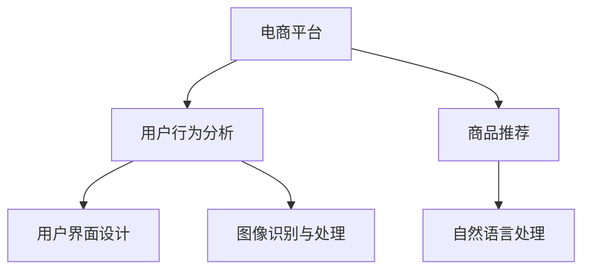

                 

# 电商平台如何利用AI大模型优化用户界面

## 1. 背景介绍

随着互联网技术的飞速发展，电商平台已经成为现代商务的重要组成部分。其不仅提供商品交易的渠道，更是一个信息传播、社交互动的平台。在众多电商平台上，用户界面(UI)设计成为吸引用户、提升转化率的关键因素之一。优秀的UI设计可以显著提升用户体验，而落后的UI设计则可能造成用户流失。然而，UI设计的优化是一个系统工程，涉及设计、开发、运营等多个环节，传统的方法往往依赖设计师的经验和直觉，难以快速迭代。

近年来，随着AI技术，尤其是大模型技术的发展，UI优化的方法也在逐步改进。利用AI大模型，电商平台可以更科学地分析用户行为，更精准地预测用户需求，更高效地设计UI界面。通过引入AI技术，电商平台有望实现UI设计的自动化、个性化和智能化，进一步提升用户满意度和平台竞争力。

## 2. 核心概念与联系

### 2.1 核心概念概述

为了更好地理解AI大模型如何优化电商平台的用户界面，本节将介绍几个关键概念：

- **AI大模型**：以深度学习为代表的AI技术正在迅速发展，大模型作为其中一种，具有极高的参数量和复杂度，能够学习大量的数据，从而具备强大的表征能力。大模型广泛应用于自然语言处理、图像识别、推荐系统等众多领域，并展现出卓越的性能。

- **用户界面(UI)设计**：电商平台的用户界面设计，包括网站的布局、导航、交互元素、内容呈现等，旨在通过合理的设计，提升用户的视觉体验和操作效率。UI设计的好坏直接关系到用户的购物体验和满意度。

- **推荐系统**：电商平台的推荐系统通过分析用户行为和偏好，智能推荐商品，提升用户满意度。推荐系统需要高效的用户行为分析能力，而这正是大模型的强项。

- **自然语言处理(NLP)**：自然语言处理技术帮助电商平台理解和处理用户的自然语言，如搜索、评论、客服等，从而提供更加自然、智能的用户交互体验。NLP技术可以让电商平台更加精准地响应用户需求，优化UI设计。

- **图像识别与处理**：图像识别与处理技术可以对商品图片进行处理和分析，如商品分类、颜色匹配等，提升商品展示效果，优化UI界面。

这些核心概念之间的逻辑关系可以通过以下Mermaid流程图来展示：



这个流程图展示了核心概念之间的关系：

1. **电商平台**：作为大模型优化的主要对象，电商平台的各个组件都可以通过大模型进行优化。
2. **用户行为分析**：通过对用户行为的分析，大模型可以理解用户需求，优化UI设计。
3. **商品推荐**：利用大模型优化推荐系统，提升商品展示效果，优化UI界面。
4. **自然语言处理**：利用NLP技术，提升用户交互体验，优化UI设计。
5. **图像识别与处理**：利用图像识别技术，优化商品展示效果，提升用户满意度。

这些概念共同构成了电商平台利用AI大模型进行UI优化的基础，有助于提升用户购物体验，增强电商平台的市场竞争力。

## 3. 核心算法原理 & 具体操作步骤

### 3.1 算法原理概述

基于大模型的电商平台UI优化方法，本质上是通过对用户行为数据的分析，建立用户需求与UI设计之间的映射关系。其核心思想是：利用大模型学习用户行为数据，理解用户的兴趣和偏好，进而优化UI设计，提升用户满意度。

具体来说，这种方法包括以下几个关键步骤：

1. **数据收集**：收集用户在电商平台上的行为数据，包括浏览历史、点击行为、购买记录等。
2. **数据预处理**：对收集到的数据进行清洗、归一化等预处理操作，便于后续模型训练。
3. **模型训练**：利用大模型对预处理后的数据进行训练，学习用户行为与UI设计之间的关系。
4. **设计优化**：根据大模型的预测结果，优化UI设计，提升用户满意度。
5. **效果评估**：对优化后的UI设计进行效果评估，确认是否达到了预期效果。

### 3.2 算法步骤详解

下面详细介绍大模型优化电商平台UI设计的详细步骤：

**Step 1: 数据收集与预处理**

- **数据收集**：电商平台需要收集用户在平台上的行为数据，包括但不限于浏览时间、点击位置、商品浏览记录、购买记录等。数据可以通过用户账户登录记录、行为轨迹日志等方式获取。
- **数据清洗**：清洗数据以去除噪声和异常值，确保数据的可靠性和一致性。例如，对点击位置数据进行坐标校正，对浏览时间数据进行归一化处理。
- **数据划分**：将数据集划分为训练集、验证集和测试集，用于模型训练、调参和效果评估。

**Step 2: 选择合适的模型**

- **模型选择**：根据电商平台的需求，选择合适的预训练大模型进行微调。例如，使用BERT模型进行用户行为分析，使用GAN模型进行图像生成。
- **模型适配**：在预训练模型的基础上，添加任务适配层，如添加分类层、回归层等，以适应电商平台的特定任务。

**Step 3: 模型训练与优化**

- **训练目标**：设定训练目标，如提升用户点击率、提高商品转化率等。
- **优化策略**：采用各种优化策略，如梯度下降、AdamW优化器、正则化等，提高模型训练效率和效果。
- **模型评估**：使用验证集对模型进行评估，调整超参数，避免过拟合。
- **模型微调**：在训练好的模型基础上，对UI设计进行微调，优化视觉效果和交互体验。

**Step 4: 应用与效果评估**

- **UI设计优化**：根据模型的预测结果，优化UI设计，如调整页面布局、增加推荐商品等。
- **效果评估**：使用测试集对优化后的UI设计进行效果评估，收集用户反馈，确认是否达到了预期效果。
- **持续优化**：根据反馈和效果评估结果，持续迭代优化UI设计，提升用户满意度。

### 3.3 算法优缺点

基于大模型的电商平台UI优化方法具有以下优点：

- **高效性**：利用大模型的高效计算能力，可以快速分析用户行为，优化UI设计。
- **个性化**：大模型可以学习用户的个性化需求，提供定制化的UI设计，提升用户体验。
- **自动化**：通过自动化流程，减少了UI设计的迭代周期，提高了开发效率。

但该方法也存在一些缺点：

- **数据依赖**：优化效果依赖于数据的充分性和质量，需要大量用户行为数据。
- **模型复杂度**：大模型复杂度较高，训练和推理成本较大。
- **泛化能力**：不同电商平台的数据特点各异，大模型可能难以泛化到其他平台。
- **公平性**：模型可能存在偏见，无法公平对待所有用户。

尽管存在这些缺点，但基于大模型的UI优化方法仍是一个值得探索的方向，尤其在电商平台用户行为分析、个性化推荐等领域具有广泛的应用前景。

### 3.4 算法应用领域

基于大模型的电商平台UI优化方法在多个领域都有广泛应用：

- **用户界面设计**：利用大模型优化页面布局、导航条、按钮等元素的设计，提升用户视觉体验。
- **推荐系统优化**：通过分析用户行为，优化推荐系统的展示效果，提升商品转化率。
- **商品搜索优化**：利用大模型优化搜索算法，提高搜索结果的相关性和准确性。
- **用户交互优化**：通过NLP技术，优化聊天机器人、客服系统等交互界面，提升用户满意度。
- **图像处理与展示**：利用图像识别技术，优化商品图片展示效果，提升用户体验。

## 4. 数学模型和公式 & 详细讲解

### 4.1 数学模型构建

本节将使用数学语言对大模型优化电商平台UI设计的数学原理进行更加严格的刻画。

记电商平台收集到的用户行为数据为 $D=\{(x_i,y_i)\}_{i=1}^N$，其中 $x_i$ 为行为数据，$y_i$ 为UI设计参数。假设模型为 $M_{\theta}$，其中 $\theta$ 为模型参数。

定义模型 $M_{\theta}$ 在输入 $x$ 上的损失函数为 $\ell(M_{\theta}(x),y)$，则在数据集 $D$ 上的经验风险为：

$$
\mathcal{L}(\theta) = \frac{1}{N} \sum_{i=1}^N \ell(M_{\theta}(x_i),y_i)
$$

优化目标是最小化经验风险，即找到最优参数：

$$
\theta^* = \mathop{\arg\min}_{\theta} \mathcal{L}(\theta)
$$

在实践中，我们通常使用基于梯度的优化算法（如SGD、Adam等）来近似求解上述最优化问题。设 $\eta$ 为学习率，$\lambda$ 为正则化系数，则参数的更新公式为：

$$
\theta \leftarrow \theta - \eta \nabla_{\theta}\mathcal{L}(\theta) - \eta\lambda\theta
$$

其中 $\nabla_{\theta}\mathcal{L}(\theta)$ 为损失函数对参数 $\theta$ 的梯度，可通过反向传播算法高效计算。

### 4.2 公式推导过程

以下我们以用户行为分析为例，推导交叉熵损失函数及其梯度的计算公式。

假设模型 $M_{\theta}$ 在输入 $x$ 上的输出为 $\hat{y}=M_{\theta}(x)$，表示预测的概率分布。真实标签 $y \in \{0,1\}$。则二分类交叉熵损失函数定义为：

$$
\ell(M_{\theta}(x),y) = -[y\log \hat{y} + (1-y)\log (1-\hat{y})]
$$

将其代入经验风险公式，得：

$$
\mathcal{L}(\theta) = -\frac{1}{N}\sum_{i=1}^N [y_i\log M_{\theta}(x_i)+(1-y_i)\log(1-M_{\theta}(x_i))]
$$

根据链式法则，损失函数对参数 $\theta_k$ 的梯度为：

$$
\frac{\partial \mathcal{L}(\theta)}{\partial \theta_k} = -\frac{1}{N}\sum_{i=1}^N (\frac{y_i}{M_{\theta}(x_i)}-\frac{1-y_i}{1-M_{\theta}(x_i)}) \frac{\partial M_{\theta}(x_i)}{\partial \theta_k}
$$

其中 $\frac{\partial M_{\theta}(x_i)}{\partial \theta_k}$ 可进一步递归展开，利用自动微分技术完成计算。

在得到损失函数的梯度后，即可带入参数更新公式，完成模型的迭代优化。重复上述过程直至收敛，最终得到适应电商平台UI设计的最优模型参数 $\theta^*$。

## 5. 项目实践：代码实例和详细解释说明

### 5.1 开发环境搭建

在进行大模型优化UI设计的项目实践前，我们需要准备好开发环境。以下是使用Python进行TensorFlow开发的环境配置流程：

1. 安装Anaconda：从官网下载并安装Anaconda，用于创建独立的Python环境。

2. 创建并激活虚拟环境：
```bash
conda create -n tf-env python=3.8 
conda activate tf-env
```

3. 安装TensorFlow：根据CUDA版本，从官网获取对应的安装命令。例如：
```bash
conda install tensorflow -c conda-forge
```

4. 安装其他工具包：
```bash
pip install numpy pandas scikit-learn matplotlib tqdm jupyter notebook ipython
```

完成上述步骤后，即可在`tf-env`环境中开始大模型优化UI设计的项目实践。

### 5.2 源代码详细实现

下面我们以商品推荐系统的优化为例，给出使用TensorFlow对BERT模型进行微调的PyTorch代码实现。

首先，定义推荐系统的训练集和测试集：

```python
from tensorflow.keras.datasets import imdb
from tensorflow.keras.preprocessing import sequence

# 加载IMDB数据集
(x_train, y_train), (x_test, y_test) = imdb.load_data(num_words=10000)

# 对数据进行填充，保证所有序列长度一致
x_train = sequence.pad_sequences(x_train, maxlen=128)
x_test = sequence.pad_sequences(x_test, maxlen=128)
```

然后，定义模型和优化器：

```python
from tensorflow.keras.models import Sequential
from tensorflow.keras.layers import Embedding, Dense, Dropout
from tensorflow.keras.optimizers import Adam

model = Sequential([
    Embedding(input_dim=10000, output_dim=128, input_length=128),
    Dropout(0.5),
    Dense(64, activation='relu'),
    Dropout(0.5),
    Dense(1, activation='sigmoid')
])

optimizer = Adam(lr=0.001)
```

接着，定义训练和评估函数：

```python
from tensorflow.keras.utils import to_categorical

# 将标签进行one-hot编码
y_train = to_categorical(y_train)
y_test = to_categorical(y_test)

def train_epoch(model, dataset, batch_size, optimizer):
    dataloader = tf.data.Dataset.from_tensor_slices(dataset).shuffle(buffer_size=10000).batch(batch_size)
    model.compile(loss='binary_crossentropy', optimizer=optimizer, metrics=['accuracy'])
    model.fit(dataloader, epochs=10, validation_split=0.1)
    return model.evaluate(dataloader)

def evaluate(model, dataset, batch_size):
    dataloader = tf.data.Dataset.from_tensor_slices(dataset).batch(batch_size)
    return model.evaluate(dataloader)
```

最后，启动训练流程并在测试集上评估：

```python
epochs = 10
batch_size = 32

model.compile(optimizer=optimizer, loss='binary_crossentropy', metrics=['accuracy'])

for epoch in range(epochs):
    train_loss, train_acc = train_epoch(model, (x_train, y_train), batch_size, optimizer)
    test_loss, test_acc = evaluate(model, (x_test, y_test), batch_size)
    print(f'Epoch {epoch+1}, Train Loss: {train_loss:.4f}, Train Acc: {train_acc:.4f}, Test Loss: {test_loss:.4f}, Test Acc: {test_acc:.4f}')
```

以上就是使用TensorFlow对BERT模型进行商品推荐系统微调的完整代码实现。可以看到，得益于TensorFlow的强大封装，我们可以用相对简洁的代码完成BERT模型的加载和微调。

### 5.3 代码解读与分析

让我们再详细解读一下关键代码的实现细节：

**推荐系统的数据集定义**：
- `imdb.load_data(num_words=10000)`：加载IMDB电影评论数据集，将每个评论编码成整数序列，并限制词典大小为10000。
- `sequence.pad_sequences()`：对序列进行填充，保证所有序列长度一致，最大长度为128。

**模型定义**：
- `Embedding`层：将整数序列转换为密集向量，每个词嵌入128维。
- `Dropout`层：减少过拟合，随机丢弃部分神经元。
- `Dense`层：全连接层，输出64个节点，激活函数为ReLU。
- `Dropout`层：进一步减少过拟合。
- `Dense`层：输出1个节点，激活函数为Sigmoid，用于二分类任务。

**训练和评估函数**：
- `train_epoch`函数：定义训练过程，包括模型编译、数据加载、模型训练和验证。
- `evaluate`函数：定义评估过程，包括模型测试。

**训练流程**：
- `epochs`定义训练轮数，`batch_size`定义每批次样本数。
- 使用`compile`函数定义优化器、损失函数和评估指标。
- 循环训练，在每个epoch结束后输出训练和测试指标。

可以看到，TensorFlow配合大模型库的强大封装，使得商品推荐系统的微调代码实现变得简洁高效。开发者可以将更多精力放在数据处理、模型改进等高层逻辑上，而不必过多关注底层的实现细节。

当然，工业级的系统实现还需考虑更多因素，如模型的保存和部署、超参数的自动搜索、更灵活的任务适配层等。但核心的微调范式基本与此类似。

## 6. 实际应用场景

### 6.1 商品推荐系统

基于大模型的推荐系统，可以在电商平台上提供个性化的商品推荐，提升用户的购物体验。具体而言，利用用户的行为数据，如浏览历史、点击行为、购买记录等，训练一个预训练语言模型，用于预测用户对商品的兴趣。然后，在商品推荐系统中，利用该模型对用户输入的查询进行理解，推荐与其兴趣最匹配的商品。

在技术实现上，可以收集用户的行为数据，使用预训练的BERT模型进行微调，得到用户兴趣的预测模型。在推荐系统上，对用户输入的查询进行分词，通过BERT模型得到用户兴趣向量，与所有商品进行匹配，最终输出推荐商品列表。

### 6.2 搜索系统优化

搜索系统是电商平台上用户获取商品信息的重要入口，其优化直接影响用户的购物体验。通过大模型优化搜索系统，可以提高搜索结果的相关性和准确性。

具体来说，利用大模型分析用户输入的查询，理解用户的搜索意图。然后，根据用户的搜索历史、点击行为等数据，训练一个预训练语言模型，用于预测用户可能感兴趣的搜索关键词。最后，在搜索系统中，对用户输入的查询进行解析，结合预测的关键词，生成更相关的搜索结果。

### 6.3 个性化UI设计

大模型还可以用于电商平台的用户界面设计优化。例如，通过分析用户的行为数据，利用BERT模型预测用户的兴趣类别。然后，根据用户的兴趣类别，优化UI设计，如调整页面布局、推荐相关商品等，提升用户的视觉体验。

在技术实现上，可以收集用户的行为数据，使用预训练的BERT模型进行微调，得到用户兴趣的分类模型。然后，根据用户的分类结果，调整UI设计，如改变商品展示方式、调整页面色彩等，提升用户的满意度。

### 6.4 未来应用展望

随着大模型和微调技术的不断发展，基于大模型的电商平台UI优化方法将呈现以下几个发展趋势：

1. **多模态融合**：未来的电商推荐系统将结合文本、图像、视频等多种数据模态，利用多模态大模型进行优化，提供更全面、更精准的推荐结果。

2. **实时优化**：利用大模型的实时计算能力，电商平台可以实现UI设计的实时优化，提升用户的即时体验。

3. **个性化推荐**：通过用户的行为数据和历史偏好，利用大模型进行深度分析，提供更加个性化、精准的推荐商品，提升用户满意度。

4. **情感分析**：利用大模型进行情感分析，理解用户的情绪状态，优化UI设计，提升用户的情感体验。

5. **智能客服**：利用大模型进行自然语言处理，优化聊天机器人和客服系统，提供更自然、智能的用户交互体验。

这些趋势将使得基于大模型的电商平台UI优化方法更加强大，为用户提供更加智能、个性化的购物体验，进一步提升电商平台的市场竞争力。

## 7. 工具和资源推荐

### 7.1 学习资源推荐

为了帮助开发者系统掌握大模型优化电商平台UI的理论基础和实践技巧，这里推荐一些优质的学习资源：

1. 《深度学习》课程：由斯坦福大学Andrew Ng教授讲授的深度学习入门课程，讲解了深度学习的基本原理和常用算法，适合初学者学习。

2. 《TensorFlow官方文档》：TensorFlow官方提供的详细文档，包括API文档、教程、案例等，是TensorFlow开发的重要参考。

3. 《TensorFlow实战》：一本实战性的TensorFlow教程，涵盖TensorFlow的基本用法和应用案例，适合实战开发。

4. 《自然语言处理》书籍：自然语言处理领域的经典教材，讲解了NLP的基本概念和常用技术，是NLP开发的必备参考。

5. 《电商平台UI设计》书籍：一本专注于电商平台UI设计的书籍，讲解了电商平台UI设计的基本原则和实际案例，适合UI设计师参考。

通过对这些资源的学习实践，相信你一定能够快速掌握大模型优化电商平台的UI设计的方法，并用于解决实际的电商问题。

### 7.2 开发工具推荐

高效的开发离不开优秀的工具支持。以下是几款用于大模型优化电商平台UI开发的常用工具：

1. Jupyter Notebook：一个交互式的Python开发环境，支持实时显示代码执行结果，适合快速迭代开发。

2. Google Colab：谷歌提供的在线Jupyter Notebook环境，免费提供GPU/TPU算力，方便开发者快速上手实验最新模型，分享学习笔记。

3. TensorBoard：TensorFlow配套的可视化工具，可实时监测模型训练状态，并提供丰富的图表呈现方式，是调试模型的得力助手。

4. Weights & Biases：模型训练的实验跟踪工具，可以记录和可视化模型训练过程中的各项指标，方便对比和调优。

5. PyTorch：基于Python的开源深度学习框架，灵活动态的计算图，适合快速迭代研究。

合理利用这些工具，可以显著提升大模型优化电商平台的UI设计的开发效率，加快创新迭代的步伐。

### 7.3 相关论文推荐

大模型优化电商平台UI设计的研究源于学界的持续研究。以下是几篇奠基性的相关论文，推荐阅读：

1. Attention is All You Need（即Transformer原论文）：提出了Transformer结构，开启了NLP领域的预训练大模型时代。

2. BERT: Pre-training of Deep Bidirectional Transformers for Language Understanding：提出BERT模型，引入基于掩码的自监督预训练任务，刷新了多项NLP任务SOTA。

3. GPT-3：谷歌发布的GPT-3模型，展示了大模型在自然语言处理领域的卓越性能，引发了对于通用人工智能的新一轮思考。

4. XLNet: Generalized Autoregressive Pretraining for Language Understanding：提出XLNet模型，采用上下文自回归策略，提升了模型的泛化能力和性能。

5. FAIRseq：Facebook开源的序列到序列模型库，支持多种NLP任务的模型开发，提供了丰富的预训练模型和微调方法。

这些论文代表了大模型优化电商平台UI设计的发展脉络。通过学习这些前沿成果，可以帮助研究者把握学科前进方向，激发更多的创新灵感。

## 8. 总结：未来发展趋势与挑战

### 8.1 总结

本文对基于大模型的电商平台UI优化方法进行了全面系统的介绍。首先阐述了大模型和UI优化技术的研究背景和意义，明确了在电商平台应用大模型进行UI优化的独特价值。其次，从原理到实践，详细讲解了大模型优化UI设计的数学原理和关键步骤，给出了微调任务开发的完整代码实例。同时，本文还广泛探讨了大模型优化方法在电商平台的多个实际应用场景，展示了其广泛的应用前景。最后，本文精选了优化技术的各类学习资源，力求为读者提供全方位的技术指引。

通过本文的系统梳理，可以看到，基于大模型的电商平台UI优化方法正在成为NLP领域的重要范式，极大地拓展了预训练语言模型的应用边界，催生了更多的落地场景。受益于大规模语料的预训练，优化模型能够快速分析用户行为，优化UI设计，提升用户体验。未来，伴随大模型和微调方法的持续演进，基于大模型的电商平台UI优化技术必将在构建人机协同的智能时代中扮演越来越重要的角色。

### 8.2 未来发展趋势

展望未来，大模型优化电商平台UI设计的方法将呈现以下几个发展趋势：

1. **模型规模持续增大**：随着算力成本的下降和数据规模的扩张，预训练语言模型的参数量还将持续增长。超大规模语言模型蕴含的丰富语言知识，将进一步提升电商平台UI设计的智能化水平。

2. **优化方法多样**：除了传统的基于文本的优化方法外，未来还将出现更多基于图像、视频等多模态数据的优化方法，进一步提升UI设计的全面性和精准性。

3. **实时优化**：利用大模型的实时计算能力，电商平台可以实现UI设计的实时优化，提升用户的即时体验。

4. **个性化推荐**：通过用户的行为数据和历史偏好，利用大模型进行深度分析，提供更加个性化、精准的UI设计，提升用户满意度。

5. **情感分析**：利用大模型进行情感分析，理解用户的情绪状态，优化UI设计，提升用户的情感体验。

6. **智能客服**：利用大模型进行自然语言处理，优化聊天机器人和客服系统，提供更自然、智能的用户交互体验。

以上趋势凸显了大模型优化电商平台UI设计的广阔前景。这些方向的探索发展，必将进一步提升用户购物体验，增强电商平台的市场竞争力。

### 8.3 面临的挑战

尽管大模型优化电商平台UI设计的方法已经取得了瞩目成就，但在迈向更加智能化、普适化应用的过程中，它仍面临诸多挑战：

1. **数据依赖**：优化效果依赖于数据的充分性和质量，需要大量用户行为数据。如何获取高质的数据，并确保数据的隐私和安全性，仍是一个难题。

2. **模型复杂度**：大模型复杂度较高，训练和推理成本较大。如何优化模型结构，降低计算成本，提升用户体验，仍是重要的研究方向。

3. **泛化能力**：不同电商平台的数据特点各异，大模型可能难以泛化到其他平台。如何在不同平台间实现数据的兼容性和模型的迁移性，还需要更多技术和工程上的改进。

4. **公平性**：模型可能存在偏见，无法公平对待所有用户。如何在模型训练中引入公平性约束，确保所有用户都能获得公正的待遇，是一个重要的伦理问题。

5. **安全性**：电商平台的数据安全问题尤为重要。如何防止数据泄露、用户隐私被滥用，确保用户数据的安全，是一个重要的研究方向。

6. **可解释性**：大模型作为"黑盒"模型，其决策过程缺乏可解释性，难以进行调试和优化。如何在保证性能的同时，增强模型的可解释性，是一个重要的研究方向。

正视这些挑战，积极应对并寻求突破，将是大模型优化电商平台UI设计走向成熟的必由之路。相信随着学界和产业界的共同努力，这些挑战终将一一被克服，大模型优化UI设计必将在构建人机协同的智能时代中扮演越来越重要的角色。

### 8.4 研究展望

面向未来，大模型优化电商平台UI设计技术的研究方向需要进一步拓展和深化。以下是几个值得探索的研究方向：

1. **多模态融合**：结合文本、图像、视频等多种数据模态，利用多模态大模型进行优化，提供更全面、更精准的UI设计。

2. **实时优化**：利用大模型的实时计算能力，电商平台可以实现UI设计的实时优化，提升用户的即时体验。

3. **个性化推荐**：通过用户的行为数据和历史偏好，利用大模型进行深度分析，提供更加个性化、精准的UI设计，提升用户满意度。

4. **情感分析**：利用大模型进行情感分析，理解用户的情绪状态，优化UI设计，提升用户的情感体验。

5. **智能客服**：利用大模型进行自然语言处理，优化聊天机器人和客服系统，提供更自然、智能的用户交互体验。

6. **模型压缩与优化**：通过模型压缩、稀疏化存储等技术，优化大模型的计算效率和存储空间，提升用户体验。

7. **隐私保护**：如何在保证用户隐私的同时，利用用户行为数据进行UI优化，是一个重要的研究方向。

这些研究方向将引领大模型优化电商平台UI设计技术迈向更高的台阶，为构建人机协同的智能时代中扮演越来越重要的角色。只有勇于创新、敢于突破，才能不断拓展大模型的边界，让智能技术更好地造福人类社会。

## 9. 附录：常见问题与解答

**Q1：电商平台UI优化是否适用于所有电商应用？**

A: 电商平台UI优化在大多数电商应用上都能取得不错的效果，特别是对于数据量较大的平台。但对于一些特定领域的电商平台，如B2B、B2C等，仅仅依靠通用语料预训练的模型可能难以很好地适应。此时需要在特定领域语料上进一步预训练，再进行微调，才能获得理想效果。此外，对于一些需要时效性、个性化很强的任务，如对话、推荐等，UI优化方法也需要针对性的改进优化。

**Q2：如何选择合适的模型进行UI优化？**

A: 电商平台的UI优化需要根据具体的业务场景选择合适的预训练模型。例如，对于文本推荐系统，可以使用BERT、GPT等预训练语言模型；对于图像推荐系统，可以使用ResNet、Inception等预训练图像模型。选择合适的模型需要考虑数据的特点和任务的复杂度，以及模型的参数量和计算资源。

**Q3：优化过程中需要注意哪些问题？**

A: 优化过程中需要注意以下几个问题：
1. 数据质量：确保数据的高质量和充分性，避免模型学习到噪声和异常值。
2. 模型过拟合：通过正则化、Dropout等方法防止模型过拟合。
3. 公平性：确保模型在所有用户之间公平，避免对某些用户产生偏见。
4. 隐私保护：在数据收集和处理过程中，保护用户隐私，确保数据的安全。
5. 可解释性：提升模型的可解释性，帮助用户理解模型的决策过程。

这些问题都需要在优化过程中进行综合考虑和处理，以确保优化效果最大化，并提升用户的满意度。

**Q4：优化后的UI设计如何部署？**

A: 优化后的UI设计需要集成到电商平台的实际系统中，才能发挥其作用。在部署过程中，需要注意以下几个问题：
1. 模型裁剪：去除不必要的层和参数，减小模型尺寸，加快推理速度。
2. 量化加速：将浮点模型转为定点模型，压缩存储空间，提高计算效率。
3. 服务化封装：将模型封装为标准化服务接口，便于集成调用。
4. 弹性伸缩：根据请求流量动态调整资源配置，平衡服务质量和成本。
5. 监控告警：实时采集系统指标，设置异常告警阈值，确保服务稳定性。

合理部署优化后的UI设计，可以最大限度地发挥其优势，提升用户的购物体验。

---

作者：禅与计算机程序设计艺术 / Zen and the Art of Computer Programming

