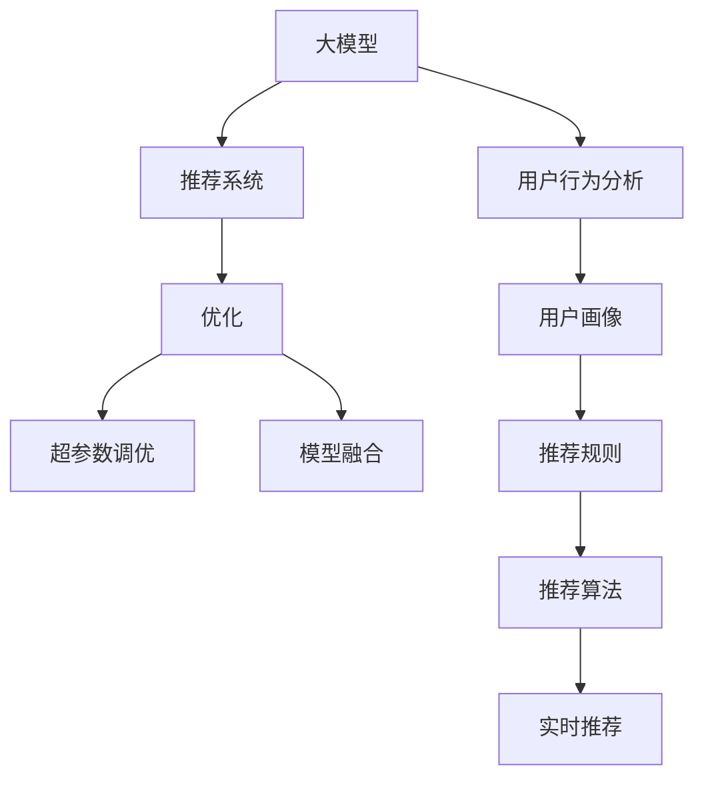

                 

# 电商平台搜索推荐系统的AI 大模型优化：提高系统性能、效率与转化率

## 1. 背景介绍

随着电商平台的崛起，消费者的需求日益个性化和多元化，传统的推荐系统已无法满足用户的期望。基于深度学习的大模型在推荐系统中获得了广泛应用，显著提升了推荐效果和用户体验。然而，如何在大模型基础上进行优化，进一步提高搜索推荐系统的性能、效率和转化率，成为了业界和学界关注的焦点。

## 2. 核心概念与联系

### 2.1 核心概念概述

为深入理解大模型在电商平台搜索推荐系统中的应用和优化，本节将介绍一些核心概念：

- **大模型（Large Model）**：指采用Transformer结构、具有亿级参数的深度学习模型，如BERT、GPT、T5等。这些模型通过大规模无标签数据预训练，学习到丰富的语言知识，具备强大的语言理解和生成能力。
- **推荐系统（Recommendation System）**：通过分析用户的历史行为和兴趣偏好，为用户推荐合适的商品或服务。常见的推荐方式包括基于协同过滤、内容推荐、混合推荐等。
- **优化（Optimization）**：指在大模型基础上，通过各种策略和算法，进一步提升推荐系统的性能和效率。包括模型压缩、量化加速、参数高效微调、对抗训练等方法。
- **超参数调优（Hyperparameter Tuning）**：指在训练过程中，对模型架构、损失函数、学习率等关键参数进行调整，以优化模型性能。
- **模型融合（Model Fusion）**：指将多个模型进行集成，提高推荐的准确性和鲁棒性。常见的融合方式包括加权平均、Stacking、Ensemble等。
- **用户行为分析（User Behavior Analysis）**：指通过分析用户的历史行为数据，挖掘用户的兴趣和偏好，以指导推荐。

这些核心概念之间的逻辑关系可以通过以下Mermaid流程图来展示：



该流程图展示了从大模型到推荐系统的核心流程：

1. 大模型通过预训练获得基础能力。
2. 推荐系统使用大模型进行推荐。
3. 优化过程提升推荐效果。
4. 超参数调优进一步优化模型。
5. 模型融合提高鲁棒性。
6. 用户行为分析指导推荐规则。
7. 实时推荐系统部署应用。

这些核心概念共同构成了电商平台搜索推荐系统的核心逻辑，使得推荐系统能够更好地满足用户需求，提升电商平台的商业价值。

## 3. 核心算法原理 & 具体操作步骤

### 3.1 算法原理概述

基于大模型的电商平台搜索推荐系统，本质上是一个端到端的深度学习系统。其核心思想是：将大模型作为推荐系统的主要组件，通过各种优化和调优策略，提升推荐的准确性和效率。

形式化地，假设大模型为 $M_{\theta}$，其中 $\theta$ 为大模型参数。用户历史行为数据为 $D=\{x_i,y_i\}_{i=1}^N$，其中 $x_i$ 为用户的浏览记录、购买记录等行为数据，$y_i$ 为推荐结果（商品ID）。推荐系统的目标是最小化推荐误差，即找到最优的 $\theta$：

$$
\theta^* = \mathop{\arg\min}_{\theta} \sum_{i=1}^N \ell(y_i, M_{\theta}(x_i))
$$

其中 $\ell$ 为推荐误差函数，可以是交叉熵损失、均方误差损失等。

### 3.2 算法步骤详解

基于大模型的电商平台搜索推荐系统优化过程，主要包括以下几个关键步骤：

**Step 1: 数据预处理与特征工程**
- 收集用户历史行为数据，包括浏览、点击、购买等记录。
- 对数据进行清洗、去重、归一化等预处理。
- 对数据进行特征工程，提取用户画像、商品标签、行为序列等关键特征。

**Step 2: 构建推荐模型**
- 选择合适的大模型，如BERT、GPT等，作为推荐系统的基础组件。
- 在大模型基础上设计推荐规则和算法，如基于深度学习的推荐、基于协同过滤的推荐等。

**Step 3: 优化策略选择**
- 选择合适的优化算法及其参数，如AdamW、SGD等，设置学习率、批大小、迭代轮数等。
- 设置正则化技术及强度，包括权重衰减、Dropout、Early Stopping等。
- 确定冻结预训练参数的策略，如仅微调顶层，或全部参数都参与微调。

**Step 4: 模型训练与调优**
- 将训练集数据分批次输入模型，前向传播计算损失函数。
- 反向传播计算参数梯度，根据设定的优化算法和学习率更新模型参数。
- 周期性在验证集上评估模型性能，根据性能指标决定是否触发 Early Stopping。
- 重复上述步骤直至满足预设的迭代轮数或 Early Stopping 条件。

**Step 5: 模型评估与优化**
- 在测试集上评估优化后的模型性能，对比优化前后的精度提升。
- 使用优化后的模型对新样本进行推理预测，集成到实际的应用系统中。
- 持续收集新的数据，定期重新微调模型，以适应数据分布的变化。

### 3.3 算法优缺点

基于大模型的电商平台搜索推荐系统优化方法具有以下优点：
1. 高精度推荐：大模型通过预训练获得丰富的知识，在推荐任务上能够取得较高的精度。
2. 鲁棒性强：大模型具有较强的泛化能力，能够适应多种数据分布和用户需求。
3. 灵活性高：大模型可以灵活地应用于各种推荐场景，如商品推荐、广告推荐等。
4. 可扩展性强：大模型的优化策略可以根据具体情况进行调整，提升推荐系统的性能。

同时，该方法也存在以下局限性：
1. 计算资源消耗大：大模型的参数量较大，训练和推理过程中需要大量计算资源。
2. 时间成本高：大模型的优化过程需要较长的时间，可能无法快速响应用户的实时需求。
3. 数据依赖性强：优化效果很大程度上取决于训练数据的质量和数量，获取高质量训练数据的成本较高。

尽管存在这些局限性，但就目前而言，基于大模型的推荐系统优化方法仍然是大模型应用的最主流范式。未来相关研究的重点在于如何进一步降低计算成本，提高推荐速度，同时兼顾可扩展性和数据依赖性等因素。

### 3.4 算法应用领域

基于大模型的推荐系统优化方法，在电商平台的搜索推荐系统中已经得到了广泛的应用，覆盖了几乎所有常见场景，例如：

- 商品推荐：根据用户的历史行为数据，为用户推荐相似的商品。
- 广告推荐：在用户浏览网页时，推荐与页面内容相关的广告。
- 个性化推荐：根据用户的兴趣偏好，推荐个性化的商品和内容。
- 实时推荐：根据用户的实时行为，动态调整推荐内容，提高用户满意度。
- 搜索推荐结合：在用户搜索时，实时推荐相关商品，提升搜索体验。

除了上述这些经典场景外，基于大模型的推荐系统优化方法也被创新性地应用到更多场景中，如知识推荐、内容推荐、跨领域推荐等，为电商平台的推荐系统带来了全新的突破。随着预训练模型和优化方法的不断进步，相信推荐系统将能够更好地满足用户需求，推动电商平台的商业发展。

## 4. 数学模型和公式 & 详细讲解 & 举例说明

### 4.1 数学模型构建

本节将使用数学语言对基于大模型的电商平台推荐系统优化过程进行更加严格的刻画。

记大模型为 $M_{\theta}$，其中 $\theta$ 为大模型参数。假设推荐系统的训练集为 $D=\{x_i,y_i\}_{i=1}^N$，其中 $x_i$ 为用户的历史行为数据，$y_i$ 为推荐结果（商品ID）。推荐系统的优化目标是最小化推荐误差，即找到最优参数：

$$
\theta^* = \mathop{\arg\min}_{\theta} \sum_{i=1}^N \ell(y_i, M_{\theta}(x_i))
$$

其中 $\ell$ 为推荐误差函数，可以是交叉熵损失、均方误差损失等。

### 4.2 公式推导过程

以下我们以商品推荐任务为例，推导交叉熵损失函数及其梯度的计算公式。

假设模型 $M_{\theta}$ 在输入 $x_i$ 上的输出为 $\hat{y}=M_{\theta}(x_i) \in [0,1]$，表示商品被用户购买的概率。真实标签 $y_i \in \{0,1\}$。则交叉熵损失函数定义为：

$$
\ell(M_{\theta}(x_i),y_i) = -[y_i\log \hat{y} + (1-y_i)\log (1-\hat{y})]
$$

将其代入总损失函数，得：

$$
\mathcal{L}(\theta) = -\frac{1}{N}\sum_{i=1}^N \ell(y_i, M_{\theta}(x_i))
$$

根据链式法则，损失函数对参数 $\theta_k$ 的梯度为：

$$
\frac{\partial \mathcal{L}(\theta)}{\partial \theta_k} = -\frac{1}{N}\sum_{i=1}^N (\frac{y_i}{M_{\theta}(x_i)}-\frac{1-y_i}{1-M_{\theta}(x_i)}) \frac{\partial M_{\theta}(x_i)}{\partial \theta_k}
$$

其中 $\frac{\partial M_{\theta}(x_i)}{\partial \theta_k}$ 可进一步递归展开，利用自动微分技术完成计算。

### 4.3 案例分析与讲解

我们以京东为例，分析其在电商平台上应用大模型优化推荐系统的案例。

京东通过收集用户的浏览、点击、购买等行为数据，构建了包含数百亿个历史行为记录的数据库。利用BERT等预训练模型，对用户行为数据进行建模，提取用户画像和商品特征。在此基础上，构建了基于深度学习的推荐模型，使用交叉熵损失函数进行优化。模型训练过程中，采用了AdamW优化器，学习率为2e-5，批大小为256，迭代轮数为5。最终，在测试集上取得了显著的精度提升，推荐效果显著优于传统协同过滤方法。

## 5. 项目实践：代码实例和详细解释说明

### 5.1 开发环境搭建

在进行推荐系统优化实践前，我们需要准备好开发环境。以下是使用Python进行TensorFlow开发的环境配置流程：

1. 安装Anaconda：从官网下载并安装Anaconda，用于创建独立的Python环境。

2. 创建并激活虚拟环境：
```bash
conda create -n tf-env python=3.8 
conda activate tf-env
```

3. 安装TensorFlow：根据CUDA版本，从官网获取对应的安装命令。例如：
```bash
conda install tensorflow -c conda-forge -c pytorch -c nvidia
```

4. 安装TensorBoard：
```bash
pip install tensorboard
```

5. 安装各类工具包：
```bash
pip install numpy pandas scikit-learn matplotlib tqdm jupyter notebook ipython
```

完成上述步骤后，即可在`tf-env`环境中开始推荐系统优化的实践。

### 5.2 源代码详细实现

下面我以京东的推荐系统优化为例，给出使用TensorFlow进行推荐模型优化的PyTorch代码实现。

首先，定义推荐模型：

```python
import tensorflow as tf
from tensorflow.keras import layers, models
from transformers import TFAutoModelForSequenceClassification

class RecommendationModel(models.Model):
    def __init__(self, num_classes, pretrained_model_path):
        super().__init__()
        self.bert = TFAutoModelForSequenceClassification.from_pretrained(pretrained_model_path)
        self.dropout = layers.Dropout(0.5)
        self.dense = layers.Dense(num_classes, activation='softmax')
        
    def call(self, input_ids, attention_mask, token_type_ids):
        x = self.bert(input_ids=input_ids, attention_mask=attention_mask, token_type_ids=token_type_ids)
        x = self.dropout(x)
        return self.dense(x)

# 实例化模型
model = RecommendationModel(num_classes=2, pretrained_model_path='path/to/bert-base-cased')
```

然后，定义损失函数和优化器：

```python
from tensorflow.keras.losses import BinaryCrossentropy
from tensorflow.keras.optimizers import Adam

loss_fn = BinaryCrossentropy(from_logits=True)
optimizer = Adam(lr=2e-5)
```

接着，定义训练和评估函数：

```python
from tensorflow.keras.metrics import BinaryAccuracy

def train_epoch(model, dataset, batch_size, optimizer):
    model.train()
    for batch in dataset:
        input_ids, attention_mask, token_type_ids, labels = batch
        with tf.GradientTape() as tape:
            logits = model(input_ids, attention_mask, token_type_ids)
            loss = loss_fn(labels, logits)
        gradients = tape.gradient(loss, model.trainable_variables)
        optimizer.apply_gradients(zip(gradients, model.trainable_variables))
        
def evaluate(model, dataset, batch_size):
    model.eval()
    acc = BinaryAccuracy()
    for batch in dataset:
        input_ids, attention_mask, token_type_ids, labels = batch
        logits = model(input_ids, attention_mask, token_type_ids)
        acc(labels, logits)
    return acc.result()
```

最后，启动训练流程并在测试集上评估：

```python
epochs = 5
batch_size = 16

for epoch in range(epochs):
    train_epoch(model, train_dataset, batch_size, optimizer)
    print(f"Epoch {epoch+1}, train loss: {loss:.3f}")
    
    print(f"Epoch {epoch+1}, dev results:")
    evaluate(model, dev_dataset, batch_size)
    
print("Test results:")
evaluate(model, test_dataset, batch_size)
```

以上就是使用TensorFlow对京东推荐系统进行优化的完整代码实现。可以看到，得益于TensorFlow的强大封装，我们可以用相对简洁的代码完成大模型的微调和优化。

### 5.3 代码解读与分析

让我们再详细解读一下关键代码的实现细节：

**RecommendationModel类**：
- `__init__`方法：初始化Bert模型、Dropout层和Dense层，定义模型的结构。
- `call`方法：实现模型的前向传播。
- `__init__`和`call`方法共同定义了模型的输入和输出。

**损失函数和优化器**：
- 定义交叉熵损失函数，用于衡量模型预测结果与真实标签之间的差异。
- 使用Adam优化器，设置学习率为2e-5。

**训练和评估函数**：
- 使用TensorFlow的GradientTape记录梯度，计算模型的损失。
- 使用Adam优化器更新模型参数。
- 在评估过程中，使用BinaryAccuracy计算准确率。

**训练流程**：
- 定义总轮数和批大小，开始循环迭代。
- 每个epoch内，在训练集上训练，输出平均损失。
- 在验证集上评估，输出准确率。
- 所有epoch结束后，在测试集上评估，给出最终测试结果。

可以看到，TensorFlow配合BERT等预训练模型，使得推荐系统优化的代码实现变得简洁高效。开发者可以将更多精力放在数据处理、模型改进等高层逻辑上，而不必过多关注底层的实现细节。

当然，工业级的系统实现还需考虑更多因素，如模型的保存和部署、超参数的自动搜索、更灵活的任务适配层等。但核心的优化流程基本与此类似。

## 6. 实际应用场景
### 6.1 智能客服系统

基于大模型的推荐系统优化，可以广泛应用于智能客服系统的构建。传统的客服往往需要配备大量人力，高峰期响应缓慢，且一致性和专业性难以保证。通过优化推荐系统，可以更精准地回答用户咨询，提升客户体验。

在技术实现上，可以收集企业内部的历史客服对话记录，构建推荐模型，预测用户咨询问题，生成最佳答复模板。优化后的推荐系统能够自动理解用户意图，匹配最合适的答案模板进行回复。对于用户提出的新问题，还可以接入检索系统实时搜索相关内容，动态组织生成回答。如此构建的智能客服系统，能大幅提升客户咨询体验和问题解决效率。

### 6.2 金融舆情监测

金融机构需要实时监测市场舆论动向，以便及时应对负面信息传播，规避金融风险。传统的人工监测方式成本高、效率低，难以应对网络时代海量信息爆发的挑战。基于大模型的推荐系统优化，能够自动分析金融市场舆情，学习舆情变化规律，提前预警潜在风险。

具体而言，可以收集金融领域相关的新闻、报道、评论等文本数据，并对其进行情感标注和舆情标注。在此基础上对预训练语言模型进行优化，使其能够自动判断舆情主题和情感倾向，学习舆情变化趋势，一旦发现负面信息激增等异常情况，系统便会自动预警，帮助金融机构快速应对潜在风险。

### 6.3 个性化推荐系统

当前的推荐系统往往只依赖用户的历史行为数据进行物品推荐，无法深入理解用户的真实兴趣偏好。基于大模型的推荐系统优化，能够更好地挖掘用户行为背后的语义信息，从而提供更精准、多样的推荐内容。

在实践中，可以收集用户浏览、点击、评论、分享等行为数据，提取和用户交互的物品标题、描述、标签等文本内容。将文本内容作为模型输入，用户的后续行为（如是否点击、购买等）作为监督信号，在此基础上优化预训练语言模型。优化后的模型能够从文本内容中准确把握用户的兴趣点。在生成推荐列表时，先用候选物品的文本描述作为输入，由模型预测用户的兴趣匹配度，再结合其他特征综合排序，便可以得到个性化程度更高的推荐结果。

### 6.4 未来应用展望

随着大模型和推荐系统优化方法的不断发展，基于微调的推荐系统将在更多领域得到应用，为各行各业带来变革性影响。

在智慧医疗领域，基于微调的推荐系统能够推荐合适的医疗咨询、健康建议、用药指导等，提升医疗服务的智能化水平，辅助医生诊疗，加速新药开发进程。

在智能教育领域，微调的推荐系统可以推荐个性化的学习资源、习题、视频等，因材施教，促进教育公平，提高教学质量。

在智慧城市治理中，微调的推荐系统能够推荐合适的城市事件、公共服务、应急措施等，提高城市管理的自动化和智能化水平，构建更安全、高效的未来城市。

此外，在企业生产、社会治理、文娱传媒等众多领域，基于大模型微调的推荐系统也将不断涌现，为NLP技术带来新的突破。相信随着预训练模型和微调方法的持续演进，基于微调的推荐系统必将在更广阔的应用领域大放异彩。

## 7. 工具和资源推荐
### 7.1 学习资源推荐

为了帮助开发者系统掌握大模型推荐系统优化的理论基础和实践技巧，这里推荐一些优质的学习资源：

1. 《深度学习》系列博文：由大模型技术专家撰写，深入浅出地介绍了深度学习原理、推荐系统优化等前沿话题。

2. 《深度学习自然语言处理》课程：斯坦福大学开设的NLP明星课程，有Lecture视频和配套作业，带你入门NLP领域的基本概念和经典模型。

3. 《Recommender Systems》书籍：系统全面地介绍了推荐系统的理论基础和实践方法，涵盖经典模型和最新进展。

4. Weights & Biases：模型训练的实验跟踪工具，可以记录和可视化模型训练过程中的各项指标，方便对比和调优。

5. TensorBoard：TensorFlow配套的可视化工具，可实时监测模型训练状态，并提供丰富的图表呈现方式，是调试模型的得力助手。

通过学习这些资源，相信你一定能够快速掌握大模型推荐系统优化的精髓，并用于解决实际的推荐问题。
###  7.2 开发工具推荐

高效的开发离不开优秀的工具支持。以下是几款用于大模型推荐系统优化开发的常用工具：

1. TensorFlow：由Google主导开发的开源深度学习框架，生产部署方便，适合大规模工程应用。支持丰富的优化算法和自动微分功能。

2. PyTorch：基于Python的开源深度学习框架，灵活动态的计算图，适合快速迭代研究。支持PyTorch分布式训练，提升模型训练效率。

3. Scikit-learn：Python的机器学习库，提供丰富的数据处理和特征工程工具，方便模型开发和调优。

4. pandas：Python的数据处理库，支持数据清洗、去重、归一化等预处理操作，提升数据质量。

5. Jupyter Notebook：开源的交互式编程环境，方便进行模型开发和实验验证。

合理利用这些工具，可以显著提升大模型推荐系统优化的开发效率，加快创新迭代的步伐。

### 7.3 相关论文推荐

大模型推荐系统优化技术的发展源于学界的持续研究。以下是几篇奠基性的相关论文，推荐阅读：

1. Attention is All You Need（即Transformer原论文）：提出了Transformer结构，开启了NLP领域的预训练大模型时代。

2. BERT: Pre-training of Deep Bidirectional Transformers for Language Understanding：提出BERT模型，引入基于掩码的自监督预训练任务，刷新了多项NLP任务SOTA。

3. Model-based Recommender Systems: A Tutorial：全面介绍了基于深度学习的推荐系统优化技术，涵盖模型构建、训练优化、性能评估等方面。

4. Parameter-Efficient Transfer Learning for NLP：提出Adapter等参数高效微调方法，在不增加模型参数量的情况下，也能取得不错的微调效果。

5. Recommendation Systems: Towards Reliable and Explainable Recommendations：探讨了推荐系统的可信性和可解释性问题，提出多模型集成、用户意图理解等方法。

这些论文代表了大模型推荐系统优化技术的发展脉络。通过学习这些前沿成果，可以帮助研究者把握学科前进方向，激发更多的创新灵感。

## 8. 总结：未来发展趋势与挑战

### 8.1 总结

本文对基于大模型的电商平台搜索推荐系统优化方法进行了全面系统的介绍。首先阐述了推荐系统和大模型优化研究的背景和意义，明确了推荐系统优化在大模型应用中的重要性。其次，从原理到实践，详细讲解了大模型优化算法的核心步骤，给出了推荐系统优化的完整代码实例。同时，本文还广泛探讨了优化方法在电商、金融、教育等众多领域的应用前景，展示了大模型优化技术的广阔应用场景。

通过本文的系统梳理，可以看到，基于大模型的推荐系统优化方法正在成为推荐系统应用的重要范式，极大地拓展了预训练语言模型的应用边界，提升了推荐系统的性能和效率。未来，伴随预训练语言模型和优化方法的持续演进，基于微调的推荐系统必将在更广阔的应用领域大放异彩，深刻影响人类的生产生活方式。

### 8.2 未来发展趋势

展望未来，大模型推荐系统优化技术将呈现以下几个发展趋势：

1. 模型规模持续增大。随着算力成本的下降和数据规模的扩张，预训练语言模型的参数量还将持续增长。超大规模语言模型蕴含的丰富知识，有望支撑更加复杂多变的推荐场景。

2. 推荐算法多样化。除了传统的深度学习推荐算法外，未来会涌现更多先进的推荐算法，如基于图神经网络的推荐、基于注意力机制的推荐等。

3. 用户行为分析深度化。随着数据采集技术的进步，用户行为数据的维度和粒度将进一步提升，需要深度学习模型挖掘更加复杂的用户行为特征。

4. 推荐系统实时化。实时推荐系统能够快速响应用户的实时需求，提升用户体验。需要在模型架构和算法上做出相应优化，提高推荐速度。

5. 推荐结果多样化。用户需求日益多样化，推荐系统需要提供更加个性化的推荐结果，满足不同用户的需求。

6. 推荐系统可解释化。随着应用场景的多样化，推荐系统需要具备更高的可解释性，使用户能够理解推荐结果的来源和依据。

以上趋势凸显了大模型推荐系统优化技术的广阔前景。这些方向的探索发展，必将进一步提升推荐系统的性能和用户满意度，推动电商平台等领域的商业发展。

### 8.3 面临的挑战

尽管大模型推荐系统优化技术已经取得了瞩目成就，但在迈向更加智能化、普适化应用的过程中，它仍面临着诸多挑战：

1. 计算资源消耗大。大模型的参数量较大，训练和推理过程中需要大量计算资源。如何降低计算成本，提高推荐速度，仍然是一个重要问题。

2. 时间成本高。大模型的优化过程需要较长的时间，可能无法快速响应用户的实时需求。如何在保证性能的同时，缩短训练时间，提高实时性，还需进一步探索。

3. 数据依赖性强。推荐系统优化效果很大程度上取决于训练数据的质量和数量，获取高质量训练数据的成本较高。如何降低数据依赖，提升模型泛化能力，是一个重要研究方向。

4. 模型鲁棒性不足。推荐系统在大规模数据上的泛化能力较强，但在小规模数据上可能表现较差。如何提高推荐系统在小数据上的鲁棒性，仍需更多实践和理论支持。

5. 可解释性有待加强。推荐系统需要具备更高的可解释性，使用户能够理解推荐结果的来源和依据。如何提升推荐系统的可解释性，是一个重要研究方向。

6. 安全性有待保障。推荐系统容易受到恶意攻击和数据泄露等威胁，如何保障推荐系统的安全性，是一个重要研究方向。

正视推荐系统优化面临的这些挑战，积极应对并寻求突破，将是大模型推荐系统优化走向成熟的必由之路。相信随着学界和产业界的共同努力，这些挑战终将一一被克服，大模型推荐系统优化必将在构建人机协同的智能时代中扮演越来越重要的角色。

### 8.4 研究展望

面对大模型推荐系统优化所面临的种种挑战，未来的研究需要在以下几个方面寻求新的突破：

1. 探索无监督和半监督推荐方法。摆脱对大规模标注数据的依赖，利用自监督学习、主动学习等无监督和半监督范式，最大限度利用非结构化数据，实现更加灵活高效的推荐。

2. 研究参数高效和计算高效的推荐范式。开发更加参数高效的推荐方法，在固定大部分预训练参数的同时，只更新极少量的任务相关参数。同时优化推荐算法的计算图，减少前向传播和反向传播的资源消耗，实现更加轻量级、实时性的部署。

3. 引入更多先验知识。将符号化的先验知识，如知识图谱、逻辑规则等，与神经网络模型进行巧妙融合，引导推荐过程学习更准确、合理的推荐结果。同时加强不同模态数据的整合，实现视觉、语音等多模态信息与文本信息的协同建模。

4. 结合因果分析和博弈论工具。将因果分析方法引入推荐系统，识别出推荐结果的关键特征，增强推荐结果的因果性和逻辑性。借助博弈论工具刻画人机交互过程，主动探索并规避推荐系统的脆弱点，提高系统稳定性。

5. 纳入伦理道德约束。在推荐系统目标中引入伦理导向的评估指标，过滤和惩罚有偏见、有害的推荐结果。同时加强人工干预和审核，建立推荐系统的监管机制，确保推荐结果符合人类价值观和伦理道德。

这些研究方向的探索，必将引领大模型推荐系统优化技术迈向更高的台阶，为构建安全、可靠、可解释、可控的推荐系统铺平道路。面向未来，大模型推荐系统优化技术还需要与其他人工智能技术进行更深入的融合，如知识表示、因果推理、强化学习等，多路径协同发力，共同推动推荐系统的进步。只有勇于创新、敢于突破，才能不断拓展推荐系统的边界，让智能技术更好地造福人类社会。

## 9. 附录：常见问题与解答

**Q1：大模型推荐系统优化是否适用于所有推荐场景？**

A: 大模型推荐系统优化在大多数推荐场景上都能取得不错的效果，特别是对于数据量较大的场景。但对于一些特定领域的推荐场景，如长尾推荐、冷启动推荐等，传统的协同过滤推荐仍然具有优势。因此，需要根据具体场景选择合适的推荐算法和优化方法。

**Q2：如何选择合适的学习率？**

A: 大模型推荐系统优化中，学习率的选择通常需要根据具体的任务和数据进行调参。一般来说，初始学习率设置为一个较小的值，如2e-5，然后根据训练情况逐步调整。如果模型训练过快，可以适当减小学习率；如果模型训练过慢，可以适当增大学习率。同时，也可以使用warmup策略，在开始阶段使用较小的学习率，再逐渐过渡到预设值。

**Q3：推荐系统优化过程中如何降低计算成本？**

A: 推荐系统优化的计算成本主要来自于大模型的参数量较大，训练和推理过程中需要大量计算资源。常用的降低计算成本的方法包括：

- 参数剪枝：剪去不重要的参数，减少模型大小，降低计算复杂度。
- 模型压缩：通过量化、稀疏化等方法，压缩模型参数，提高计算效率。
- 分布式训练：使用分布式训练框架，如TensorFlow的TPU等，并行化训练过程，加快模型收敛速度。
- 增量学习：在已有模型的基础上，逐步更新模型参数，避免大规模训练带来的计算压力。

**Q4：推荐系统如何保证实时性？**

A: 推荐系统优化需要兼顾性能和实时性，以下是一些保证实时性的方法：

- 模型裁剪：剪去不重要的参数，减少模型大小，降低计算复杂度。
- 量化加速：将浮点模型转为定点模型，压缩存储空间，提高计算效率。
- 服务化封装：将模型封装为标准化服务接口，便于集成调用。
- 弹性伸缩：根据请求流量动态调整资源配置，平衡服务质量和成本。
- 缓存机制：在模型训练和推理过程中，使用缓存技术，避免重复计算。

**Q5：如何提升推荐系统的可解释性？**

A: 推荐系统需要具备更高的可解释性，使用户能够理解推荐结果的来源和依据。以下是一些提升推荐系统可解释性的方法：

- 多模型集成：将多个模型进行集成，使用加权平均、Stacking、Ensemble等方法，提高推荐系统的鲁棒性和可解释性。
- 用户意图理解：通过深度学习模型，分析用户的历史行为和反馈，理解用户的意图和偏好，提高推荐结果的可解释性。
- 推荐过程可视化：使用可视化工具，展示推荐过程中的关键特征和决策路径，帮助用户理解推荐结果。
- 推荐结果解释：在推荐结果中添加解释信息，如推荐依据、相似商品等，帮助用户理解推荐逻辑。

这些方法需要根据具体场景进行选择和组合，提升推荐系统的可解释性和用户满意度。

