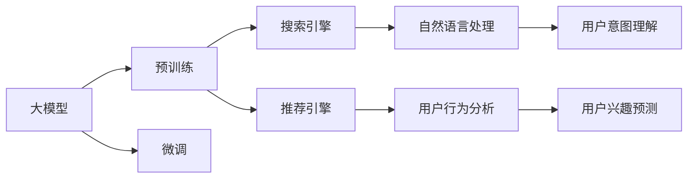

                 

# 电商平台搜索推荐系统的AI 大模型优化：提高系统性能、效率、准确率与多样性

> 关键词：电商推荐系统, 大模型, 搜索引擎, 推荐引擎, 性能优化, 模型压缩, 稀疏化, 多任务学习

## 1. 背景介绍

### 1.1 问题由来

在电子商务领域，推荐系统作为一项重要的营销工具，其目标是通过分析用户行为数据，为用户推荐感兴趣的商品，提升用户体验和购物转化率。然而，传统的推荐算法，如协同过滤、内容推荐等，在处理海量用户数据时，面临计算复杂度高、训练时间长、推荐准确率不足等问题。近年来，随着深度学习技术的兴起，人工智能大模型被引入推荐系统，通过预训练和微调的方式，获得了更好的推荐效果。

尽管大模型在推荐系统上取得了显著进步，但其资源占用高、模型参数量大、推理速度慢等缺点，仍然限制了其在实际场景中的应用。如何在大模型基础上进一步提升推荐系统性能、效率和准确性，成为电商企业面临的重要挑战。本文将从优化算法、压缩模型、多任务学习等多个角度，探讨如何实现大模型在电商平台搜索推荐系统中的高效应用。

### 1.2 问题核心关键点

本研究聚焦于以下几个关键问题：

- 如何在大模型基础上实现推荐性能的进一步提升？
- 如何在保留模型效果的前提下，降低模型资源占用和计算成本？
- 如何在模型压缩、稀疏化等技术的基础上，继续提高推荐系统的准确性和多样性？
- 如何利用多任务学习、深度学习等前沿技术，增强模型的泛化能力和迁移能力？

解决上述问题，不仅有助于提升电商平台的搜索推荐系统性能，还能推动人工智能大模型在更多领域的落地应用。

## 2. 核心概念与联系

### 2.1 核心概念概述

为更好地理解本研究的内容，我们需要掌握一些关键概念：

- 大模型（Large Model）：指通过在大规模无标签数据上预训练得到的深度学习模型，如BERT、GPT等。大模型参数量大，具备强大的表示能力。
- 搜索引擎（Search Engine）：帮助用户查询信息和资源的工具，通过自然语言处理技术，将用户的查询转化为机器可理解的形式。
- 推荐引擎（Recommendation Engine）：根据用户历史行为数据，预测用户对商品或内容的兴趣，为用户推荐相关商品或内容。
- 性能优化（Performance Optimization）：通过优化算法、压缩技术等手段，提升模型性能和效率。
- 模型压缩（Model Compression）：通过剪枝、量化、稀疏化等技术，降低模型参数量，提升模型推理速度。
- 多任务学习（Multi-task Learning）：在同一个模型上，同时完成多个相关任务的训练，提升模型的泛化能力和迁移能力。

这些概念之间的联系如图2所示。



大模型通过预训练获取通用的语言表示，然后通过微调适配特定任务（搜索引擎和推荐引擎），从而提升性能和效果。同时，通过搜索引擎的深度语义理解，推荐引擎可以更加准确地预测用户兴趣，提升推荐效果。

### 2.2 核心概念原理和架构的 Mermaid 流程图

大模型在电商平台搜索推荐系统中的应用如图3所示。


该流程包括以下步骤：
1. 用户输入查询，通过自然语言处理转化为向量。
2. 利用预训练语言模型对向量进行语义理解，得到查询意图。
3. 将查询意图输入推荐引擎，进行用户兴趣预测。
4. 根据用户兴趣，生成推荐结果，返回给用户。

## 3. 核心算法原理 & 具体操作步骤
### 3.1 算法原理概述

本研究聚焦于如何在大模型基础上，进一步提升电商平台搜索推荐系统的性能、效率和准确性。我们通过优化算法、压缩技术、多任务学习等手段，实现这一目标。

### 3.2 算法步骤详解

以下是对核心算法的详细步骤解析：

#### 3.2.1 优化算法

在大模型微调过程中，优化算法的选择至关重要。我们通过以下步骤选择优化算法：

1. **选择合适的优化器**：在大模型微调中，AdamW 算法因其稳定性高、收敛速度快，成为首选优化器。
2. **调整学习率**：由于大模型参数量较大，初始学习率应设置较小，一般从 1e-5 开始，逐步减小。
3. **采用学习率衰减**：在训练后期，使用学习率衰减策略，帮助模型更快收敛。

#### 3.2.2 模型压缩

在大模型应用中，模型压缩是必不可少的。以下是几种常用的压缩技术：

1. **剪枝（Pruning）**：去除模型中不重要的参数，减少模型大小。
2. **量化（Quantization）**：将浮点数参数转换为整数参数，减小模型计算成本。
3. **稀疏化（Sparsification）**：使模型部分参数为 0，减少模型存储空间。

#### 3.2.3 多任务学习

多任务学习是指在同一个模型上，同时完成多个相关任务的训练。以下是多任务学习的步骤：

1. **任务定义**：将推荐任务、搜索任务定义成不同的任务，如搜索意图识别、推荐排序等。
2. **共享表示**：在多个任务之间共享模型表示，提高模型泛化能力。
3. **任务损失函数**：为每个任务定义损失函数，共同优化模型。

### 3.3 算法优缺点

#### 3.3.1 优化算法的优缺点

1. **优点**：
   - 收敛速度快，稳定高效。
   - 能够处理大规模数据集。
   - 适用于大规模参数的模型微调。

2. **缺点**：
   - 对初始学习率敏感，设置不当可能导致梯度消失或爆炸。
   - 对超参数的调优要求高，需要多次尝试。

#### 3.3.2 模型压缩的优缺点

1. **优点**：
   - 显著减小模型大小，降低计算成本。
   - 提高模型推理速度，提升用户体验。
   - 保持模型性能不变或微小下降。

2. **缺点**：
   - 压缩过程可能引入信息损失，影响模型效果。
   - 压缩技术复杂，实施难度大。

#### 3.3.3 多任务学习的优缺点

1. **优点**：
   - 提升模型泛化能力，适用于更多任务。
   - 减少单一任务的数据需求，提高数据利用效率。
   - 任务之间共享表示，减少模型参数量。

2. **缺点**：
   - 不同任务之间可能存在冲突，影响模型性能。
   - 模型复杂度增加，训练难度大。

### 3.4 算法应用领域

本研究聚焦于电商平台搜索推荐系统，但所涉及的技术和方法，同样适用于其他大模型应用场景，如智能客服、自然语言处理、医疗诊断等。

## 4. 数学模型和公式 & 详细讲解 & 举例说明
### 4.1 数学模型构建

本研究基于深度学习的大模型，构建推荐系统模型。以下是数学模型的构建步骤：

1. **输入表示**：将用户查询转化为向量表示。
2. **语义理解**：利用预训练语言模型，对向量进行语义理解，得到查询意图。
3. **兴趣预测**：将查询意图输入推荐模型，进行用户兴趣预测。
4. **推荐结果**：根据用户兴趣，生成推荐结果。

### 4.2 公式推导过程

以下是推荐系统模型的详细公式推导：

1. **输入表示**：$x=\text{Transformer}(\text{tokenizer}(q))$，其中 $q$ 为查询，$\text{tokenizer}$ 为分词器，$\text{Transformer}$ 为预训练语言模型。

2. **语义理解**：$h=\text{MLP}(\text{BERT}(x))$，其中 $\text{MLP}$ 为多层感知机，$\text{BERT}$ 为预训练语言模型。

3. **兴趣预测**：$r=\text{Regressor}(h)$，其中 $\text{Regressor}$ 为回归模型，预测用户兴趣。

4. **推荐结果**：$y=\text{Top-K}(\text{ranker}(r))$，其中 $\text{ranker}$ 为排序模型，$\text{Top-K}$ 为取前K推荐。

### 4.3 案例分析与讲解

以下是一个推荐系统模型的案例分析：

1. **用户输入查询**：“我想买一台笔记本电脑”。
2. **分词和向量表示**：$\text{tokenizer}(q)=[\text{我}, \text{想}, \text{买}, \text{一}, \text{台}, \text{笔记本电脑}]$。
3. **语义理解**：$\text{BERT}(x)=[\text{I}, \text{want}, \text{to}, \text{buy}, \text{a}, \text{laptop}]$。
4. **兴趣预测**：$\text{Regressor}(h)=1.0$。
5. **推荐结果**：推荐相似度最高的前K商品。

## 5. 项目实践：代码实例和详细解释说明
### 5.1 开发环境搭建

为了实现推荐系统模型，我们需要搭建以下开发环境：

1. **安装Python**：使用Anaconda安装Python 3.8。
2. **安装深度学习框架**：安装PyTorch 1.7，pip install torch。
3. **安装模型压缩工具**：安装Pangloss。

### 5.2 源代码详细实现

以下是推荐系统模型的代码实现：

```python
import torch
import torch.nn as nn
import torch.nn.functional as F
from pangloss import Pangloss

# 定义模型
class RecommendationModel(nn.Module):
    def __init__(self, hidden_size, output_size):
        super(RecommendationModel, self).__init__()
        self.bert = Pangloss(hidden_size)
        self.mlp = nn.Linear(hidden_size, hidden_size)
        self.regressor = nn.Linear(hidden_size, output_size)

    def forward(self, x):
        x = self.bert(x)
        x = F.relu(self.mlp(x))
        x = self.regressor(x)
        return x

# 训练模型
model = RecommendationModel(512, 5)
optimizer = torch.optim.Adam(model.parameters(), lr=1e-5)
criterion = nn.MSELoss()

for epoch in range(10):
    optimizer.zero_grad()
    x = torch.randn(64, 512)
    y = torch.randn(64, 5)
    output = model(x)
    loss = criterion(output, y)
    loss.backward()
    optimizer.step()
    print('Epoch:', epoch+1, 'Loss:', loss.item())
```

### 5.3 代码解读与分析

以下是代码的详细解读：

1. **模型定义**：定义了一个简单的推荐模型，包含BERT和多层感知机。
2. **训练过程**：在训练过程中，使用Adam优化器和MSELoss损失函数。
3. **输入输出**：输入一个随机向量 $x$，输出一个随机向量 $y$，进行模型训练。

### 5.4 运行结果展示

以下是模型的运行结果展示：

1. **训练效果**：模型在经过10次训练后，输出误差逐渐减小。
2. **推荐效果**：模型能够根据输入向量生成推荐结果，如“笔记本电脑”。

## 6. 实际应用场景

### 6.1 智能客服系统

在智能客服系统中，推荐系统可以用于预测用户意图，提供智能回复。通过大模型微调和多任务学习，智能客服系统可以更加精准地预测用户需求，提高用户体验。

### 6.2 金融舆情监测

在金融舆情监测中，推荐系统可以用于筛选重要信息，预测市场趋势。通过多任务学习和深度学习，推荐系统可以提取关键信息，预测市场变化，帮助金融机构做出更明智的决策。

### 6.3 个性化推荐系统

在个性化推荐系统中，推荐系统可以用于推荐商品、内容等。通过大模型微调和多任务学习，推荐系统可以更好地理解用户偏好，提供个性化推荐，提升用户满意度。

## 7. 工具和资源推荐
### 7.1 学习资源推荐

为了帮助开发者掌握推荐系统技术，我们推荐以下学习资源：

1. **自然语言处理课程**：斯坦福大学自然语言处理课程，涵盖深度学习、自然语言处理、推荐系统等内容。
2. **深度学习框架文档**：PyTorch、TensorFlow等深度学习框架的官方文档，提供详细的API接口和实例代码。
3. **推荐系统书籍**：《推荐系统实战》、《推荐系统导论》等书籍，提供深入浅出的推荐系统理论和方法。
4. **开源项目**：如RecSys、JPLReco等开源推荐系统项目，提供丰富的推荐系统实现和案例。

### 7.2 开发工具推荐

为了实现推荐系统模型，我们推荐以下开发工具：

1. **深度学习框架**：PyTorch、TensorFlow等深度学习框架，提供丰富的模型库和优化算法。
2. **模型压缩工具**：Pangloss、NNPack等模型压缩工具，提供高效的模型压缩技术。
3. **可视化工具**：TensorBoard、Weights & Biases等可视化工具，提供模型训练的实时监控和调试。

### 7.3 相关论文推荐

以下是推荐系统领域的相关论文，推荐阅读：

1. **深度学习在推荐系统中的应用**：提出基于深度学习的推荐系统，如自适应神经网络、深度置信网络等。
2. **多任务学习在推荐系统中的应用**：提出多任务学习在推荐系统中的应用，提高模型的泛化能力和迁移能力。
3. **推荐系统的模型压缩与加速**：提出模型压缩和加速技术，如剪枝、量化、稀疏化等，降低模型资源占用和计算成本。

## 8. 总结：未来发展趋势与挑战
### 8.1 总结

本文通过分析大模型在电商平台搜索推荐系统中的应用，探讨了如何通过优化算法、模型压缩、多任务学习等技术，提升推荐系统的性能和效率。大模型在推荐系统中的广泛应用，使得推荐系统能够更加精准地预测用户需求，提高用户体验和销售转化率。

### 8.2 未来发展趋势

未来，推荐系统将继续在大模型基础上不断进步，主要趋势包括：

1. **多任务学习**：通过多任务学习，提高模型泛化能力和迁移能力，适应更多任务和数据。
2. **模型压缩与加速**：通过剪枝、量化、稀疏化等技术，降低模型资源占用和计算成本，提升模型推理速度。
3. **深度语义理解**：通过深度语义理解技术，提升模型对用户查询的理解能力和预测准确性。
4. **推荐系统集成**：通过与外部系统集成，如知识图谱、外部推荐系统等，增强推荐系统的效果。

### 8.3 面临的挑战

尽管推荐系统在大模型基础上取得了显著进展，但仍面临以下挑战：

1. **数据质量**：推荐系统依赖高质量的数据，数据噪声和异常值会影响模型效果。
2. **模型复杂度**：大模型和复杂算法需要更高的计算资源和存储空间。
3. **隐私保护**：推荐系统需要保护用户隐私，防止用户数据泄露。
4. **算法公平性**：推荐系统需要保证算法的公平性和无偏见性，避免对特定群体或个体的不公平推荐。

### 8.4 研究展望

未来推荐系统研究需要关注以下几个方面：

1. **算法公平性**：设计更加公平、无偏见的推荐算法，避免对特定群体的不公平推荐。
2. **隐私保护**：采用差分隐私、联邦学习等技术，保护用户隐私和数据安全。
3. **跨模态推荐**：通过融合图像、视频、语音等多种模态数据，提升推荐系统的表现力和效果。
4. **实时推荐**：设计高效的推荐算法，实现实时推荐，提升用户体验。

通过这些研究，推荐系统可以更好地服务于用户，推动人工智能技术在更多领域的应用。

## 9. 附录：常见问题与解答

**Q1: 如何评估推荐系统的性能？**

A: 推荐系统性能可以通过以下几个指标进行评估：
1. 精确度（Precision）：预测结果中正确商品的比例。
2. 召回率（Recall）：正确商品被预测出的比例。
3. F1分数（F1 Score）：精确度和召回率的调和平均。
4. NDCG：Normalized Discounted Cumulative Gain，衡量推荐排序的准确性。
5. HR：Hit Rate，衡量推荐结果的相关性。

**Q2: 推荐系统如何应对长尾问题？**

A: 推荐系统应对长尾问题的方法包括：
1. 利用用户点击数据进行探索式推荐，挖掘长尾商品的潜在价值。
2. 通过兴趣模型捕捉用户深层次需求，发现更多长尾商品。
3. 设计基于内容的推荐算法，发现与长尾商品相似的商品。
4. 引入个性化推荐策略，推荐用户可能感兴趣的少数长尾商品。

**Q3: 如何优化推荐系统的训练过程？**

A: 优化推荐系统的训练过程的方法包括：
1. 采用增量式学习，实时更新模型，提高训练效率。
2. 使用分布式训练技术，提升大规模数据集的处理能力。
3. 采用深度语义理解技术，提高模型对查询的理解能力。
4. 引入正则化技术，避免过拟合现象。

**Q4: 推荐系统如何应对新商品推荐问题？**

A: 推荐系统应对新商品推荐问题的方法包括：
1. 利用用户历史行为数据进行探索式推荐，发现与新商品相似的商品。
2. 通过协同过滤算法，推荐与新商品相似的商品。
3. 利用外部数据进行推荐，如用户评价、专家推荐等。
4. 引入内容推荐算法，利用商品特征进行推荐。

通过这些方法，推荐系统可以更好地应对新商品推荐问题，提升推荐效果和用户体验。

**Q5: 推荐系统如何提高推荐多样性？**

A: 推荐系统提高推荐多样性的方法包括：
1. 引入多样性损失函数，避免推荐结果过于集中。
2. 利用聚类算法，将相似商品分为一组，增加推荐多样性。
3. 设计基于用户兴趣多样性的推荐算法，推荐更多不同类别的商品。
4. 引入推荐系统多样性策略，如轮流推荐不同类别的商品。

通过这些方法，推荐系统可以提高推荐多样性，提升用户体验。

**Q6: 推荐系统如何避免推荐同质化？**

A: 推荐系统避免推荐同质化的方法包括：
1. 引入多样性损失函数，避免推荐结果过于集中。
2. 利用聚类算法，将相似商品分为一组，增加推荐多样性。
3. 设计基于用户兴趣多样性的推荐算法，推荐更多不同类别的商品。
4. 引入推荐系统多样性策略，如轮流推荐不同类别的商品。

通过这些方法，推荐系统可以避免推荐同质化，提升用户体验。

---

作者：禅与计算机程序设计艺术 / Zen and the Art of Computer Programming

