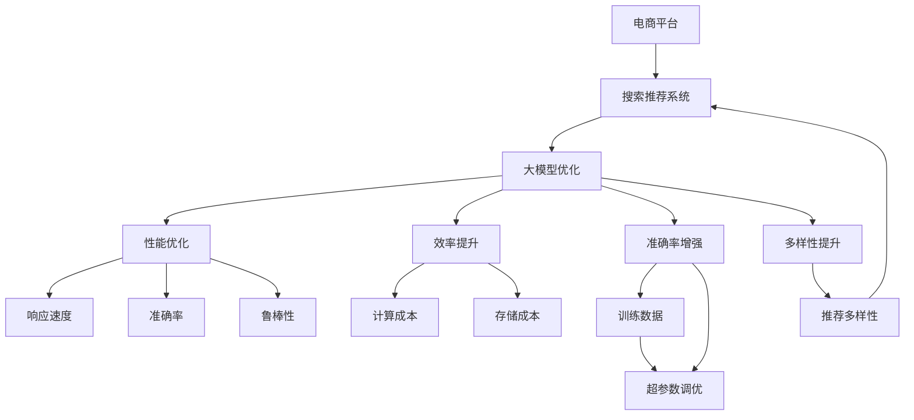

                 

# 电商平台搜索推荐系统的AI 大模型优化：提高系统性能、效率、准确率与多样性

> 关键词：电商平台,搜索推荐系统,大模型优化,系统性能,效率,准确率,多样性

## 1. 背景介绍

在电商平台的搜索推荐系统中，用户体验至关重要。一个高质量的推荐系统，不仅能显著提升用户满意度，还能大幅提高平台转化率和销售额。然而，传统的推荐系统依赖于基于规则、协同过滤等简单的模型，难以处理复杂的用户行为数据和商品信息，导致推荐效果往往不尽如人意。随着深度学习技术的发展，基于大模型的推荐系统逐渐兴起，为电商平台的搜索推荐带来了新的突破。

本文将系统介绍如何利用AI大模型优化电商平台搜索推荐系统，在提升系统性能、效率、准确率和推荐多样性方面进行深度探讨。我们将从核心概念、算法原理、实际应用和未来展望等多个维度，全面解析大模型在电商平台推荐系统中的应用。

## 2. 核心概念与联系

### 2.1 核心概念概述

为更好地理解大模型在电商平台搜索推荐系统中的应用，本节将介绍几个关键概念：

- **电商平台**：指通过互联网平台进行商品交易的虚拟市场，包括B2C、B2B等多种模式。
- **搜索推荐系统**：指基于用户行为数据和商品信息，自动推荐相关商品的系统。常见的推荐方式包括基于用户的协同过滤、基于物品的协同过滤、基于内容的推荐、深度学习推荐等。
- **大模型**：指基于深度学习技术构建的巨大参数量模型，如BERT、GPT、DALL·E等。通过在大规模无标签数据上进行预训练，大模型学习到了丰富的语言和视觉知识，具备强大的模式识别能力。
- **性能优化**：指通过技术手段提升系统的响应速度、准确率和鲁棒性。
- **效率提升**：指通过优化算法和模型结构，降低系统的计算和存储成本。
- **准确率增强**：指通过改进模型训练和调参方法，提高系统推荐商品的准确度。
- **多样性提升**：指通过更合理的损失函数和优化策略，增加推荐商品的多样性，避免用户产生审美疲劳。

这些核心概念之间的逻辑关系可以通过以下Mermaid流程图来展示：



这个流程图展示了大模型优化在电商平台推荐系统中的应用路径：

1. 电商平台将用户行为和商品信息作为输入数据，通过搜索推荐系统输出推荐结果。
2. 大模型优化提升搜索推荐系统的各项性能指标，如响应速度、准确率和鲁棒性。
3. 性能优化通过算法和模型结构优化，降低系统计算和存储成本。
4. 准确率增强通过改进训练数据和调参方法，提升推荐商品的准确度。
5. 多样性提升通过设计合理的损失函数和优化策略，增加推荐商品的多样性。

这些概念共同构成了电商平台搜索推荐系统的工作框架，为大模型优化提供了明确的方向。

## 3. 核心算法原理 & 具体操作步骤
### 3.1 算法原理概述

大模型在电商平台搜索推荐系统中的应用，核心在于其强大的模式识别能力和泛化能力。基于大模型的推荐系统，通常分为预训练和微调两个阶段。

在预训练阶段，大模型通过在大规模无标签数据上进行自监督学习，学习到通用的语言和视觉知识。在微调阶段，将大模型应用于特定电商平台的用户行为数据和商品信息上，通过监督学习优化模型的推荐效果。

大模型优化的关键在于选择合适的优化算法和损失函数，以及合理设计模型的结构。通过微调，可以在小样本条件下，显著提升推荐系统的性能和效率。

### 3.2 算法步骤详解

大模型在电商平台搜索推荐系统中的优化，通常包括以下几个关键步骤：

**Step 1: 数据准备**
- 收集电商平台的用户行为数据和商品信息。数据通常包括点击、浏览、购买、评价等行为记录，以及商品的名称、描述、价格、图片等属性信息。
- 将数据进行预处理，包括去重、清洗、分词、特征工程等操作，转换为模型可以处理的形式。

**Step 2: 模型选择与初始化**
- 选择合适的预训练大模型，如BERT、GPT等，进行模型初始化。
- 在微调前，需要确定模型结构，包括输入层、编码器、解码器等。输入层通常为文本或图像，编码器用于提取特征，解码器用于生成推荐结果。

**Step 3: 微调超参数设置**
- 根据任务需求，设置合适的超参数，包括学习率、批大小、迭代轮数、正则化系数等。学习率通常较小，以避免破坏预训练权重。
- 选择合适的损失函数，如交叉熵、均方误差等，用于衡量推荐结果与真实标签之间的差异。

**Step 4: 模型训练与调参**
- 将准备好的数据集分为训练集、验证集和测试集，使用微调算法对模型进行训练。训练过程中，使用验证集评估模型性能，进行模型调参。
- 选择合适的优化算法，如AdamW、SGD等，计算梯度并更新模型参数。
- 设置正则化技术，如L2正则、Dropout等，防止模型过拟合。

**Step 5: 模型评估与部署**
- 在测试集上评估微调后模型的性能，对比微调前后的精度提升。
- 将优化后的模型集成到电商平台搜索推荐系统中，进行实时推荐。

以上是基于大模型优化电商平台搜索推荐系统的一般流程。在实际应用中，还需要根据具体任务特点进行优化设计，如改进训练目标函数，引入更多的正则化技术，搜索最优的超参数组合等，以进一步提升模型性能。

### 3.3 算法优缺点

基于大模型优化的电商平台搜索推荐系统，具有以下优点：

1. **高效泛化**：大模型在大规模无标签数据上进行预训练，具备强大的泛化能力，可以在小样本条件下，快速提升推荐效果。
2. **准确率高**：通过微调优化，大模型能够学习到特定的商品特征和用户偏好，推荐商品的准确率较高。
3. **鲁棒性好**：大模型通过自监督学习，能够适应多种数据分布，具有较强的鲁棒性。
4. **灵活适应**：大模型可以适配多种推荐任务，如个性化推荐、排行榜推荐、商品关联推荐等。

同时，该方法也存在一定的局限性：

1. **计算成本高**：预训练和微调过程需要大量的计算资源和存储资源，对算力有较高的要求。
2. **模型复杂度高**：大模型的参数量巨大，结构复杂，微调过程中需要频繁更新参数，对系统性能和稳定性有一定影响。
3. **可解释性不足**：大模型作为黑盒系统，其内部决策过程难以解释，缺乏透明度。
4. **数据隐私问题**：电商平台的用户行为数据和商品信息涉及用户隐私，需要采取严格的隐私保护措施。

尽管存在这些局限性，但就目前而言，基于大模型优化的方法仍是电商平台搜索推荐系统的重要范式。未来相关研究的重点在于如何进一步降低计算成本，提高模型的可解释性和鲁棒性，同时兼顾用户隐私和模型效果。

### 3.4 算法应用领域

基于大模型的优化方法，在电商平台搜索推荐系统中得到了广泛的应用，覆盖了电商推荐、个性化推荐、排行榜推荐等多个领域，具体应用包括：

- **电商推荐**：基于用户浏览、购买等行为数据，推荐相关商品。通过大模型优化，提升推荐效果和用户满意度。
- **个性化推荐**：通过用户画像和商品特征，生成个性化推荐结果。大模型优化有助于提高推荐的精准度和多样性。
- **排行榜推荐**：根据商品热度、销量等指标，生成热门商品排行榜。大模型优化有助于提升排行榜的准确性和吸引力。
- **商品关联推荐**：通过商品特征和用户行为，推荐相关商品组合。大模型优化有助于提高推荐的关联性和互动性。

除了以上应用外，大模型优化还广泛应用于电商平台的智能客服、智能广告投放、实时用户行为分析等场景，为电商平台带来了显著的业务价值。

## 4. 数学模型和公式 & 详细讲解 & 举例说明

### 4.1 数学模型构建

在本节中，我们将使用数学语言对基于大模型的电商平台搜索推荐系统进行更加严格的刻画。

假设电商平台搜索推荐系统包括用户行为数据 $X = \{x_i\}_{i=1}^N$ 和商品信息 $Y = \{y_i\}_{i=1}^M$，其中 $x_i = [c_i, b_i]$ 表示用户行为特征，$c_i$ 为行为类型（如点击、浏览、购买），$b_i$ 为行为时间戳。$y_i = [f_i, p_i]$ 表示商品信息，$f_i$ 为商品特征（如名称、价格、图片），$p_i$ 为商品价格。

定义推荐模型为 $M_{\theta}(X, Y)$，其中 $\theta$ 为模型参数。推荐任务的目标是最小化预测结果与真实标签之间的误差，即：

$$
\min_{\theta} \sum_{i=1}^N \sum_{j=1}^M L(M_{\theta}(x_i), y_j)
$$

其中 $L$ 为损失函数，用于衡量推荐结果与真实标签之间的差异。常用的损失函数包括均方误差（MSE）、交叉熵（Cross-Entropy）等。

### 4.2 公式推导过程

以均方误差损失函数为例，我们将进行具体的推导：

假设用户行为数据 $x_i = [c_i, b_i]$，商品信息 $y_j = [f_j, p_j]$，推荐模型 $M_{\theta}(X, Y)$ 的预测结果为 $M_{\theta}(x_i)$。则均方误差损失函数为：

$$
L(M_{\theta}(x_i), y_j) = \frac{1}{N} \sum_{i=1}^N \sum_{j=1}^M (M_{\theta}(x_i) - y_j)^2
$$

在微调过程中，我们需要将预训练模型作为初始化参数，对模型进行监督学习优化。假设预训练模型为 $M_{\phi}$，其中 $\phi$ 为预训练得到的模型参数。则微调的目标是最小化经验风险，即：

$$
\theta^* = \mathop{\arg\min}_{\theta} \mathcal{L}(\theta)
$$

其中 $\mathcal{L}$ 为针对推荐任务设计的损失函数。根据梯度下降等优化算法，微调过程不断更新模型参数 $\theta$，最小化损失函数 $\mathcal{L}$，使得模型输出逼近真实标签。由于 $\theta$ 已经通过预训练获得了较好的初始化，因此即便在小规模数据集上微调，也能较快收敛到理想模型参数 $\hat{\theta}$。

### 4.3 案例分析与讲解

我们以电商推荐系统为例，展示大模型优化的具体实现。

假设电商平台有一个用户 $u$ 进行了商品搜索，商品搜索结果为 $[\text{商品 }A, \text{商品 }B, \text{商品 }C]$。使用大模型优化的电商推荐系统，会通过用户行为数据 $x = [\text{搜索}, b]$ 和商品信息 $y = [f_A, p_A, f_B, p_B, f_C, p_C]$ 进行推荐。推荐模型 $M_{\theta}$ 的输出为 $M_{\theta}(x)$，表示推荐商品序列。

假设推荐模型的预测结果为 $M_{\theta}(x) = [1, 0, 1]$，表示推荐商品 $A$ 和 $C$，不推荐商品 $B$。真实标签为 $y = [1, 0, 1]$，表示推荐商品 $A$、$B$ 和 $C$。则均方误差损失函数为：

$$
L(M_{\theta}(x), y) = \frac{1}{3} [(M_{\theta}(x)_1 - y_1)^2 + (M_{\theta}(x)_2 - y_2)^2 + (M_{\theta}(x)_3 - y_3)^2]
$$

在微调过程中，我们使用小批量随机梯度下降算法，计算梯度并更新模型参数。通过不断迭代训练，使得模型输出逼近真实标签，优化推荐效果。

## 5. 项目实践：代码实例和详细解释说明
### 5.1 开发环境搭建

在进行大模型优化实践前，我们需要准备好开发环境。以下是使用Python进行PyTorch开发的环境配置流程：

1. 安装Anaconda：从官网下载并安装Anaconda，用于创建独立的Python环境。

2. 创建并激活虚拟环境：
```bash
conda create -n pytorch-env python=3.8 
conda activate pytorch-env
```

3. 安装PyTorch：根据CUDA版本，从官网获取对应的安装命令。例如：
```bash
conda install pytorch torchvision torchaudio cudatoolkit=11.1 -c pytorch -c conda-forge
```

4. 安装Transformers库：
```bash
pip install transformers
```

5. 安装各类工具包：
```bash
pip install numpy pandas scikit-learn matplotlib tqdm jupyter notebook ipython
```

完成上述步骤后，即可在`pytorch-env`环境中开始大模型优化实践。

### 5.2 源代码详细实现

下面我们以电商推荐系统为例，给出使用Transformers库对BERT模型进行优化的PyTorch代码实现。

首先，定义电商推荐系统的数据处理函数：

```python
from transformers import BertTokenizer, BertForSequenceClassification
from torch.utils.data import Dataset, DataLoader
import torch

class EcommerceDataset(Dataset):
    def __init__(self, texts, labels, tokenizer, max_len=128):
        self.texts = texts
        self.labels = labels
        self.tokenizer = tokenizer
        self.max_len = max_len
        
    def __len__(self):
        return len(self.texts)
    
    def __getitem__(self, item):
        text = self.texts[item]
        label = self.labels[item]
        
        encoding = self.tokenizer(text, return_tensors='pt', max_length=self.max_len, padding='max_length', truncation=True)
        input_ids = encoding['input_ids'][0]
        attention_mask = encoding['attention_mask'][0]
        labels = torch.tensor(label, dtype=torch.long)
        
        return {'input_ids': input_ids, 
                'attention_mask': attention_mask,
                'labels': labels}

# 创建dataset
tokenizer = BertTokenizer.from_pretrained('bert-base-cased')

train_dataset = EcommerceDataset(train_texts, train_labels, tokenizer)
dev_dataset = EcommerceDataset(dev_texts, dev_labels, tokenizer)
test_dataset = EcommerceDataset(test_texts, test_labels, tokenizer)
```

然后，定义模型和优化器：

```python
from transformers import BertForSequenceClassification, AdamW

model = BertForSequenceClassification.from_pretrained('bert-base-cased', num_labels=1)

optimizer = AdamW(model.parameters(), lr=2e-5)
```

接着，定义训练和评估函数：

```python
from tqdm import tqdm
from sklearn.metrics import accuracy_score

device = torch.device('cuda') if torch.cuda.is_available() else torch.device('cpu')
model.to(device)

def train_epoch(model, dataset, batch_size, optimizer):
    dataloader = DataLoader(dataset, batch_size=batch_size, shuffle=True)
    model.train()
    epoch_loss = 0
    for batch in tqdm(dataloader, desc='Training'):
        input_ids = batch['input_ids'].to(device)
        attention_mask = batch['attention_mask'].to(device)
        labels = batch['labels'].to(device)
        model.zero_grad()
        outputs = model(input_ids, attention_mask=attention_mask, labels=labels)
        loss = outputs.loss
        epoch_loss += loss.item()
        loss.backward()
        optimizer.step()
    return epoch_loss / len(dataloader)

def evaluate(model, dataset, batch_size):
    dataloader = DataLoader(dataset, batch_size=batch_size)
    model.eval()
    preds, labels = [], []
    with torch.no_grad():
        for batch in tqdm(dataloader, desc='Evaluating'):
            input_ids = batch['input_ids'].to(device)
            attention_mask = batch['attention_mask'].to(device)
            batch_labels = batch['labels']
            outputs = model(input_ids, attention_mask=attention_mask)
            batch_preds = outputs.logits.argmax(dim=1).to('cpu').tolist()
            batch_labels = batch_labels.to('cpu').tolist()
            for pred, label in zip(batch_preds, batch_labels):
                preds.append(pred)
                labels.append(label)
                
    print('Accuracy:', accuracy_score(labels, preds))
```

最后，启动训练流程并在测试集上评估：

```python
epochs = 5
batch_size = 16

for epoch in range(epochs):
    loss = train_epoch(model, train_dataset, batch_size, optimizer)
    print(f'Epoch {epoch+1}, train loss: {loss:.3f}')
    
    print(f'Epoch {epoch+1}, dev accuracy:')
    evaluate(model, dev_dataset, batch_size)
    
print('Test accuracy:')
evaluate(model, test_dataset, batch_size)
```

以上就是使用PyTorch对BERT进行电商推荐系统优化的完整代码实现。可以看到，得益于Transformers库的强大封装，我们可以用相对简洁的代码完成BERT模型的加载和优化。

### 5.3 代码解读与分析

让我们再详细解读一下关键代码的实现细节：

**EcommerceDataset类**：
- `__init__`方法：初始化文本、标签、分词器等关键组件。
- `__len__`方法：返回数据集的样本数量。
- `__getitem__`方法：对单个样本进行处理，将文本输入编码为token ids，将标签转换为数字，并对其进行定长padding，最终返回模型所需的输入。

**训练和评估函数**：
- 使用PyTorch的DataLoader对数据集进行批次化加载，供模型训练和推理使用。
- 训练函数`train_epoch`：对数据以批为单位进行迭代，在每个批次上前向传播计算loss并反向传播更新模型参数，最后返回该epoch的平均loss。
- 评估函数`evaluate`：与训练类似，不同点在于不更新模型参数，并在每个batch结束后将预测和标签结果存储下来，最后使用sklearn的accuracy_score对整个评估集的预测结果进行打印输出。

**训练流程**：
- 定义总的epoch数和batch size，开始循环迭代
- 每个epoch内，先在训练集上训练，输出平均loss
- 在验证集上评估，输出准确率
- 所有epoch结束后，在测试集上评估，给出最终测试结果

可以看到，PyTorch配合Transformers库使得BERT优化过程的代码实现变得简洁高效。开发者可以将更多精力放在数据处理、模型改进等高层逻辑上，而不必过多关注底层的实现细节。

当然，工业级的系统实现还需考虑更多因素，如模型的保存和部署、超参数的自动搜索、更灵活的任务适配层等。但核心的优化范式基本与此类似。

## 6. 实际应用场景
### 6.1 智能客服系统

基于大模型优化的搜索推荐系统，可以广泛应用于智能客服系统的构建。传统客服往往需要配备大量人力，高峰期响应缓慢，且一致性和专业性难以保证。而使用优化的搜索推荐系统，可以7x24小时不间断服务，快速响应客户咨询，用自然流畅的语言解答各类常见问题。

在技术实现上，可以收集企业内部的历史客服对话记录，将问题和最佳答复构建成监督数据，在此基础上对预训练搜索推荐系统进行优化。优化后的系统能够自动理解用户意图，匹配最合适的答复模板进行回复。对于客户提出的新问题，还可以接入检索系统实时搜索相关内容，动态组织生成回答。如此构建的智能客服系统，能大幅提升客户咨询体验和问题解决效率。

### 6.2 金融舆情监测

金融机构需要实时监测市场舆论动向，以便及时应对负面信息传播，规避金融风险。传统的人工监测方式成本高、效率低，难以应对网络时代海量信息爆发的挑战。基于大模型优化的文本分类和情感分析技术，为金融舆情监测提供了新的解决方案。

具体而言，可以收集金融领域相关的新闻、报道、评论等文本数据，并对其进行主题标注和情感标注。在此基础上对预训练语言模型进行优化，使其能够自动判断文本属于何种主题，情感倾向是正面、中性还是负面。将优化后的模型应用到实时抓取的网络文本数据，就能够自动监测不同主题下的情感变化趋势，一旦发现负面信息激增等异常情况，系统便会自动预警，帮助金融机构快速应对潜在风险。

### 6.3 个性化推荐系统

当前的推荐系统往往只依赖用户的历史行为数据进行物品推荐，无法深入理解用户的真实兴趣偏好。基于大模型优化的个性化推荐系统，可以更好地挖掘用户行为背后的语义信息，从而提供更精准、多样的推荐内容。

在实践中，可以收集用户浏览、点击、评论、分享等行为数据，提取和用户交互的物品标题、描述、标签等文本内容。将文本内容作为模型输入，用户的后续行为（如是否点击、购买等）作为监督信号，在此基础上优化预训练语言模型。优化后的模型能够从文本内容中准确把握用户的兴趣点。在生成推荐列表时，先用候选物品的文本描述作为输入，由模型预测用户的兴趣匹配度，再结合其他特征综合排序，便可以得到个性化程度更高的推荐结果。

### 6.4 未来应用展望

随着大模型优化技术的不断发展，基于优化的搜索推荐系统将在更多领域得到应用，为传统行业带来变革性影响。

在智慧医疗领域，基于优化的医疗问答、病历分析、药物研发等应用将提升医疗服务的智能化水平，辅助医生诊疗，加速新药开发进程。

在智能教育领域，优化技术可应用于作业批改、学情分析、知识推荐等方面，因材施教，促进教育公平，提高教学质量。

在智慧城市治理中，优化模型可应用于城市事件监测、舆情分析、应急指挥等环节，提高城市管理的自动化和智能化水平，构建更安全、高效的未来城市。

此外，在企业生产、社会治理、文娱传媒等众多领域，基于优化的搜索推荐技术也将不断涌现，为经济社会发展注入新的动力。相信随着技术的日益成熟，优化方法将成为搜索推荐系统的重要范式，推动人工智能技术在垂直行业的规模化落地。

## 7. 工具和资源推荐
### 7.1 学习资源推荐

为了帮助开发者系统掌握大模型优化技术，这里推荐一些优质的学习资源：

1. 《Transformer从原理到实践》系列博文：由大模型技术专家撰写，深入浅出地介绍了Transformer原理、BERT模型、优化技术等前沿话题。

2. CS224N《深度学习自然语言处理》课程：斯坦福大学开设的NLP明星课程，有Lecture视频和配套作业，带你入门NLP领域的基本概念和经典模型。

3. 《Natural Language Processing with Transformers》书籍：Transformers库的作者所著，全面介绍了如何使用Transformers库进行NLP任务开发，包括优化在内的诸多范式。

4. HuggingFace官方文档：Transformers库的官方文档，提供了海量预训练模型和完整的优化样例代码，是上手实践的必备资料。

5. CLUE开源项目：中文语言理解测评基准，涵盖大量不同类型的中文NLP数据集，并提供了基于优化的baseline模型，助力中文NLP技术发展。

通过对这些资源的学习实践，相信你一定能够快速掌握大模型优化的精髓，并用于解决实际的搜索推荐问题。
###  7.2 开发工具推荐

高效的开发离不开优秀的工具支持。以下是几款用于大模型优化开发的常用工具：

1. PyTorch：基于Python的开源深度学习框架，灵活动态的计算图，适合快速迭代研究。大部分预训练语言模型都有PyTorch版本的实现。

2. TensorFlow：由Google主导开发的开源深度学习框架，生产部署方便，适合大规模工程应用。同样有丰富的预训练语言模型资源。

3. Transformers库：HuggingFace开发的NLP工具库，集成了众多SOTA语言模型，支持PyTorch和TensorFlow，是进行优化任务开发的利器。

4. Weights & Biases：模型训练的实验跟踪工具，可以记录和可视化模型训练过程中的各项指标，方便对比和调优。与主流深度学习框架无缝集成。

5. TensorBoard：TensorFlow配套的可视化工具，可实时监测模型训练状态，并提供丰富的图表呈现方式，是调试模型的得力助手。

6. Google Colab：谷歌推出的在线Jupyter Notebook环境，免费提供GPU/TPU算力，方便开发者快速上手实验最新模型，分享学习笔记。

合理利用这些工具，可以显著提升大模型优化的开发效率，加快创新迭代的步伐。

### 7.3 相关论文推荐

大模型优化技术的发展源于学界的持续研究。以下是几篇奠基性的相关论文，推荐阅读：

1. Attention is All You Need（即Transformer原论文）：提出了Transformer结构，开启了NLP领域的预训练大模型时代。

2. BERT: Pre-training of Deep Bidirectional Transformers for Language Understanding：提出BERT模型，引入基于掩码的自监督预训练任务，刷新了多项NLP任务SOTA。

3. Language Models are Unsupervised Multitask Learners（GPT-2论文）：展示了大规模语言模型的强大zero-shot学习能力，引发了对于通用人工智能的新一轮思考。

4. Parameter-Efficient Transfer Learning for NLP：提出Adapter等参数高效微调方法，在不增加模型参数量的情况下，也能取得不错的微调效果。

5. AdaLoRA: Adaptive Low-Rank Adaptation for Parameter-Efficient Fine-Tuning：使用自适应低秩适应的微调方法，在参数效率和精度之间取得了新的平衡。

这些论文代表了大模型优化技术的发展脉络。通过学习这些前沿成果，可以帮助研究者把握学科前进方向，激发更多的创新灵感。

## 8. 总结：未来发展趋势与挑战
### 8.1 总结

本文对基于大模型的电商平台搜索推荐系统优化方法进行了全面系统的介绍。首先阐述了大模型和优化技术的研究背景和意义，明确了优化在提升系统性能、效率、准确率和推荐多样性方面的独特价值。其次，从原理到实践，详细讲解了优化算法的数学原理和关键步骤，给出了优化任务开发的完整代码实例。同时，本文还广泛探讨了优化方法在智能客服、金融舆情、个性化推荐等多个行业领域的应用前景，展示了优化的巨大潜力。此外，本文精选了优化技术的各类学习资源，力求为读者提供全方位的技术指引。

通过本文的系统梳理，可以看到，基于大模型的搜索推荐系统优化技术正在成为电商推荐的重要范式，极大地拓展了预训练语言模型的应用边界，催生了更多的落地场景。受益于大规模语料的预训练和微调，优化模型以更低的时间和标注成本，在小样本条件下也能取得理想的优化效果，有力推动了搜索推荐技术的产业化进程。未来，伴随预训练语言模型和优化方法的持续演进，相信搜索推荐技术必将在更广阔的应用领域大放异彩，深刻影响人类的生产生活方式。

### 8.2 未来发展趋势

展望未来，大模型搜索推荐系统优化技术将呈现以下几个发展趋势：

1. **模型规模持续增大**：随着算力成本的下降和数据规模的扩张，预训练语言模型的参数量还将持续增长。超大规模语言模型蕴含的丰富语言知识，有望支撑更加复杂多变的推荐任务优化。

2. **优化方法日趋多样**：除了传统的全参数优化外，未来会涌现更多参数高效的优化方法，如Parameter-Efficient Transfer Learning (PET)、LoRA等，在节省计算资源的同时也能保证优化精度。

3. **持续学习成为常态**：随着数据分布的不断变化，优化模型也需要持续学习新知识以保持性能。如何在不遗忘原有知识的同时，高效吸收新样本信息，将成为重要的研究课题。

4. **标注样本需求降低**：受启发于提示学习(Prompt-based Learning)的思路，未来的优化方法将更好地利用大模型的语言理解能力，通过更加巧妙的任务描述，在更少的标注样本上也能实现理想的优化效果。

5. **多模态优化崛起**：当前的优化方法主要聚焦于纯文本数据，未来会进一步拓展到图像、视频、语音等多模态数据优化。多模态信息的融合，将显著提升语言模型对现实世界的理解和建模能力。

6. **模型通用性增强**：经过海量数据的预训练和多领域任务的优化，未来的语言模型将具备更强大的常识推理和跨领域迁移能力，逐步迈向通用人工智能(AGI)的目标。

以上趋势凸显了大模型优化技术的广阔前景。这些方向的探索发展，必将进一步提升搜索推荐系统的性能和应用范围，为人类认知智能的进化带来深远影响。

### 8.3 面临的挑战

尽管大模型搜索推荐系统优化技术已经取得了瞩目成就，但在迈向更加智能化、普适化应用的过程中，它仍面临着诸多挑战：

1. **标注成本瓶颈**：虽然优化大大降低了标注数据的需求，但对于长尾应用场景，难以获得充足的高质量标注数据，成为制约优化性能的瓶颈。如何进一步降低优化对标注样本的依赖，将是一大难题。

2. **模型鲁棒性不足**：优化模型面对域外数据时，泛化性能往往大打折扣。对于测试样本的微小扰动，优化模型的预测也容易发生波动。如何提高优化模型的鲁棒性，避免灾难性遗忘，还需要更多理论和实践的积累。

3. **推理效率有待提高**：大规模语言模型虽然精度高，但在实际部署时往往面临推理速度慢、内存占用大等效率问题。如何在保证性能的同时，简化模型结构，提升推理速度，优化资源占用，将是重要的优化方向。

4. **可解释性亟需加强**：优化模型作为黑盒系统，其内部决策过程难以解释，缺乏透明度。对于医疗、金融等高风险应用，算法的可解释性和可审计性尤为重要。如何赋予优化模型更强的可解释性，将是亟待攻克的难题。

5. **安全性有待保障**：预训练语言模型难免会学习到有偏见、有害的信息，通过优化传递到下游任务，产生误导性、歧视性的输出，给实际应用带来安全隐患。如何从数据和算法层面消除模型偏见，避免恶意用途，确保输出的安全性，也将是重要的研究课题。

6. **知识整合能力不足**：现有的优化模型往往局限于任务内数据，难以灵活吸收和运用更广泛的先验知识。如何让优化过程更好地与外部知识库、规则库等专家知识结合，形成更加全面、准确的信息整合能力，还有很大的想象空间。

正视优化面临的这些挑战，积极应对并寻求突破，将是大模型优化技术走向成熟的必由之路。相信随着学界和产业界的共同努力，这些挑战终将一一被克服，大模型优化必将在构建人机协同的智能时代中扮演越来越重要的角色。

### 8.4 未来突破

面对大模型搜索推荐系统优化所面临的种种挑战，未来的研究需要在以下几个方面寻求新的突破：

1. **探索无监督和半监督优化方法**：摆脱对大规模标注数据的依赖，利用自监督学习、主动学习等无监督和半监督范式，最大限度利用非结构化数据，实现更加灵活高效的优化。

2. **研究参数高效和计算高效的优化范式**：开发更加参数高效的优化方法，在固定大部分预训练参数的同时，只更新极少量的任务相关参数。同时优化优化模型的计算图，减少前向传播和反向传播的资源消耗，实现更加轻量级、实时性的部署。

3. **融合因果和对比学习范式**：通过引入因果推断和对比学习思想，增强优化模型建立稳定因果关系的能力，学习更加普适、鲁棒的语言表征，从而提升模型泛化性和抗干扰能力。

4. **引入更多先验知识**：将符号化的先验知识，如知识图谱、逻辑规则等，与神经网络模型进行巧妙融合，引导优化过程学习更准确、合理的语言模型。同时加强不同模态数据的整合，实现视觉、语音等多模态信息与文本信息的协同建模。

5. **结合因果分析和博弈论工具**：将因果分析方法引入优化模型，识别出模型决策的关键特征，增强输出解释的因果性和逻辑性。借助博弈论工具刻画人机交互过程，主动探索并规避模型的脆弱点，提高系统稳定性。

6. **纳入伦理道德约束**：在优化训练目标中引入伦理导向的评估指标，过滤和惩罚有偏见、有害的输出倾向。同时加强人工干预和审核，建立模型行为的监管机制，确保输出符合人类价值观和伦理道德。

这些研究方向的探索，必将引领大模型优化技术迈向更高的台阶，为构建安全、可靠、可解释、可控的智能系统铺平道路。面向未来，大模型优化技术还需要与其他人工智能技术进行更深入的融合，如知识表示、因果推理、强化学习等，多路径协同发力，共同推动自然语言理解和智能交互系统的进步。只有勇于创新、敢于突破，才能不断拓展语言模型的边界，让智能技术更好地造福人类社会。

## 9. 附录：常见问题与解答

**Q1：大模型优化是否适用于所有搜索推荐任务？**

A: 大模型优化在大多数搜索推荐任务上都能取得不错的效果，特别是对于数据量较小的任务。但对于一些特定领域的任务，如医学、法律等，仅仅依靠通用语料预训练的模型可能难以很好地适应。此时需要在特定领域语料上进一步预训练，再进行优化，才能获得理想效果。此外，对于一些需要时效性、个性化很强的任务，如对话、推荐等，优化方法也需要针对性的改进优化。

**Q2：优化过程中如何选择合适的学习率？**

A: 优化学习率一般要比预训练时小1-2个数量级，如果使用过大的学习率，容易破坏预训练权重，导致过拟合。一般建议从1e-5开始调参，逐步减小学习率，直至收敛。也可以使用warmup策略，在开始阶段使用较小的学习率，再逐渐过渡到预设值。需要注意的是，不同的优化器(如AdamW、Adafactor等)以及不同的学习率调度策略，可能需要设置不同的学习率阈值。

**Q3：采用大模型优化时会面临哪些资源瓶颈？**

A: 目前主流的预训练大模型动辄以亿计的参数规模，对算力、内存、存储都提出了很高的要求。GPU/TPU等高性能设备是必不可少的，但即便如此，超大批次的训练和推理也可能遇到显存不足的问题。因此需要采用一些资源优化技术，如梯度积累、混合精度训练、模型并行等，来突破硬件瓶颈。同时，模型的存储和读取也可能占用大量时间和空间，需要采用模型压缩、稀疏化存储等方法进行优化。

**Q4：如何缓解优化过程中的过拟合问题？**

A: 过拟合是优化面临的主要挑战，尤其是在标注数据不足的情况下。常见的缓解策略包括：
1. 数据增强：通过回译、近义替换等方式扩充训练集
2. 正则化：使用L2正则、Dropout、Early Stopping等避免过拟合
3. 对抗训练：引入对抗样本，提高模型鲁棒性
4. 参数高效优化：只调整少量参数(如Adapter、LoRA等)，减小过拟合风险
5. 多模型集成：训练多个优化模型，取平均输出，抑制过拟合

这些策略往往需要根据具体任务和数据特点进行灵活组合。只有在数据、模型、训练、推理等各环节进行全面优化，才能最大限度地发挥大模型优化的威力。

**Q5：优化模型在落地部署时需要注意哪些问题？**

A: 将优化模型转化为实际应用，还需要考虑以下因素：
1. 模型裁剪：去除不必要的层和参数，减小模型尺寸，加快推理速度
2. 量化加速：将浮点模型转为定点模型，压缩存储空间，提高计算效率
3. 服务化封装：将模型封装为标准化服务接口，便于集成调用
4. 弹性伸缩：根据请求流量动态调整资源配置，平衡服务质量和成本
5. 监控告警：实时采集系统指标，设置异常告警阈值，确保服务稳定性
6. 安全防护：采用访问鉴权、数据脱敏等措施，保障数据和模型安全

大模型优化为搜索推荐系统带来了显著的业务价值，但如何将强大的性能转化为稳定、高效、安全的业务价值，还需要工程实践的不断打磨。唯有从数据、算法、工程、业务等多个维度协同发力，才能真正实现人工智能技术在垂直行业的规模化落地。总之，优化需要开发者根据具体任务，不断迭代和优化模型、数据和算法，方能得到理想的效果。

---

作者：禅与计算机程序设计艺术 / Zen and the Art of Computer Programming

