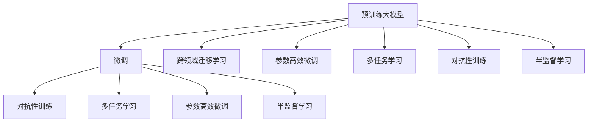

                 

# 电商平台搜索推荐系统的AI 大模型优化：提高系统性能、效率、准确率与用户体验

## 1. 背景介绍

### 1.1 问题由来
随着电子商务平台的迅速发展，个性化搜索推荐系统已成为用户体验提升的关键。通过对用户行为数据的深度分析，搜索推荐系统能够提供符合用户偏好的商品推荐，提升转化率和用户满意度。然而，搜索推荐系统的核心问题在于如何高效、准确地构建用户与商品之间的关联模型，以满足海量用户的个性化需求。

### 1.2 问题核心关键点
目前，搜索推荐系统通常采用协同过滤、基于内容的推荐、深度学习模型等方法。其中，基于深度学习模型的方法，尤其是使用预训练大模型的推荐系统，近年来在学术界和工业界均取得了显著进展。

使用预训练大模型的推荐系统，本质上是将大规模无标签数据上的预训练语言模型，通过微调来适配搜索推荐任务。这种做法可以显著提升推荐系统的性能，但同时也面临模型计算资源消耗大、训练时间长、泛化性能差等问题。

### 1.3 问题研究意义
搜索推荐系统的AI 大模型优化，对于提升电商平台的用户体验，推动电商业务发展具有重要意义：

1. **用户满意度提升**：通过精准的商品推荐，用户能够更快捷地找到满意的商品，从而提升用户满意度。
2. **业务转化率提高**：推荐系统的精准度提升可以显著提高用户转化率和平台收益。
3. **运营效率提升**：通过优化模型参数和算法，降低计算成本和训练时间，提高运营效率。
4. **业务多样性增强**：大模型能够学习到丰富的语言知识，支持多种业务的搜索推荐需求。

## 2. 核心概念与联系

### 2.1 核心概念概述

为更好地理解搜索推荐系统中的AI 大模型优化方法，本节将介绍几个密切相关的核心概念：

- **预训练大模型**：以自回归（如GPT）或自编码（如BERT）模型为代表的，在大量无标签文本数据上进行预训练的语言模型，学习通用的语言表示。
- **微调（Fine-Tuning）**：在预训练模型基础上，使用少量标注数据进行任务特定的优化，使其能够适配特定的搜索推荐任务。
- **跨领域迁移学习（Transfer Learning）**：通过在大规模领域数据上预训练模型，然后应用于其他相关领域，以减少特定领域数据需求，提高模型泛化性能。
- **参数高效微调（Parameter-Efficient Fine-Tuning, PEFT）**：在微调过程中，只更新少量模型参数，而固定大部分预训练权重，以提高微调效率和泛化性能。
- **多任务学习（Multi-task Learning）**：在多个相关任务上进行微调，共享模型参数，提升模型在不同任务上的性能。
- **对抗性训练（Adversarial Training）**：通过引入对抗样本，增强模型的鲁棒性和泛化性能。
- **半监督学习（Semi-supervised Learning）**：在少量标注数据和大量无标签数据上进行联合训练，提高模型性能。

这些核心概念之间的逻辑关系可以通过以下Mermaid流程图来展示：



这个流程图展示了预训练大模型与微调方法之间的联系，以及它们与其他优化方法的关联。

## 3. 核心算法原理 & 具体操作步骤
### 3.1 算法原理概述

搜索推荐系统中的AI 大模型优化，通常遵循以下步骤：

1. **预训练模型选择**：选择适用于推荐任务的大型预训练语言模型，如BERT、GPT、T5等。
2. **微调任务设计**：根据推荐任务的特点，设计合适的微调任务和损失函数。
3. **微调数据准备**：准备包含用户行为和商品信息的数据集，并进行预处理和划分。
4. **微调模型训练**：使用微调数据对预训练模型进行训练，优化模型参数。
5. **模型评估和部署**：在验证集上评估模型性能，调整超参数，最终在测试集上部署优化后的模型。

### 3.2 算法步骤详解

以Bert4Rec为例，详细说明搜索推荐系统中的AI 大模型优化步骤：

**Step 1: 准备预训练模型和数据集**

选择合适的预训练语言模型，如BERT。数据集准备包括：

- 数据集：包含用户行为数据和商品信息，如点击记录、浏览历史、购买记录等。
- 数据预处理：对数据进行清洗、归一化、特征工程等预处理，生成适合模型训练的样本。

**Step 2: 设计微调任务**

根据推荐任务设计合适的微调任务和损失函数。以点击率预测为例：

- 微调任务：点击率预测任务，即预测用户点击某商品的概率。
- 损失函数：使用二元交叉熵损失函数。

**Step 3: 设置微调超参数**

选择合适的优化器（如AdamW、SGD）和超参数（如学习率、批大小、迭代轮数），设置正则化技术（如L2正则、Dropout）和数据增强技术（如数据回译）。

**Step 4: 执行梯度训练**

将数据集分批次输入模型，前向传播计算损失函数，反向传播计算参数梯度，根据优化算法更新模型参数。在每个epoch结束时，评估模型在验证集上的性能。

**Step 5: 模型评估和部署**

在测试集上评估模型性能，比较微调前后的效果提升。根据测试结果调整超参数，最终在生产环境中部署优化后的模型。

### 3.3 算法优缺点

搜索推荐系统中的AI 大模型优化方法具有以下优点：

1. **泛化能力强**：预训练大模型能够学习到丰富的语言知识，适用于多种推荐任务。
2. **可解释性强**：通过微调可以解释模型决策过程，提高用户信任度。
3. **计算资源密集**：尽管训练时间长，但一旦训练完毕，推理速度较快。
4. **模型性能提升显著**：通过微调可以显著提升推荐系统的准确率和个性化程度。

同时，该方法也存在一定的局限性：

1. **计算资源消耗大**：预训练大模型需要大规模计算资源进行训练，初期投入成本较高。
2. **数据标注需求高**：微调需要一定数量的标注数据，而高质量标注数据的获取成本较高。
3. **模型解释性不足**：微调后的模型通常难以解释其决策过程，用户可能难以理解。
4. **过拟合风险高**：微调过程中，模型容易过拟合于训练数据，泛化性能可能下降。
5. **模型部署复杂**：优化后的模型需要在多个业务场景中部署，需要考虑模型封装、推理优化等问题。

### 3.4 算法应用领域

搜索推荐系统中的AI 大模型优化方法在多个领域都有广泛应用：

- **电商平台**：通过优化推荐算法，提升用户购买率和平台收入。
- **内容平台**：优化搜索和推荐，提升用户粘性和内容消费量。
- **智能家居**：通过优化推荐系统，提升用户体验和设备使用率。
- **健康医疗**：优化医生推荐系统，提高诊疗效果和患者满意度。
- **金融服务**：优化投资推荐系统，提升投资回报和风险管理。

## 4. 数学模型和公式 & 详细讲解 & 举例说明

### 4.1 数学模型构建

设推荐系统中的预训练语言模型为 $M_{\theta}$，其中 $\theta$ 为预训练得到的模型参数。假设微调任务为点击率预测，数据集为 $D=\{(x_i,y_i)\}_{i=1}^N$，其中 $x_i$ 为用户行为数据，$y_i$ 为点击标签。微调的目标是最小化预测点击率与真实点击率之间的差异。

定义模型 $M_{\theta}$ 在数据样本 $(x,y)$ 上的损失函数为：

$$
\ell(M_{\theta}(x),y) = -[y\log M_{\theta}(x) + (1-y)\log(1-M_{\theta}(x))]
$$

则在数据集 $D$ 上的经验风险为：

$$
\mathcal{L}(\theta) = \frac{1}{N} \sum_{i=1}^N \ell(M_{\theta}(x_i),y_i)
$$

微调的优化目标是最小化经验风险，即找到最优参数：

$$
\theta^* = \mathop{\arg\min}_{\theta} \mathcal{L}(\theta)
$$

在实践中，我们通常使用基于梯度的优化算法（如AdamW、SGD等）来近似求解上述最优化问题。设 $\eta$ 为学习率，$\lambda$ 为正则化系数，则参数的更新公式为：

$$
\theta \leftarrow \theta - \eta \nabla_{\theta}\mathcal{L}(\theta) - \eta\lambda\theta
$$

其中 $\nabla_{\theta}\mathcal{L}(\theta)$ 为损失函数对参数 $\theta$ 的梯度，可通过反向传播算法高效计算。

### 4.2 公式推导过程

以点击率预测为例，推导微调模型的损失函数及梯度计算公式。

假设模型 $M_{\theta}$ 在输入 $x$ 上的输出为 $\hat{y}=M_{\theta}(x) \in [0,1]$，表示用户点击某商品的概率。真实标签 $y \in \{0,1\}$。则二元交叉熵损失函数定义为：

$$
\ell(M_{\theta}(x),y) = -[y\log \hat{y} + (1-y)\log(1-\hat{y})]
$$

将其代入经验风险公式，得：

$$
\mathcal{L}(\theta) = -\frac{1}{N}\sum_{i=1}^N [y_i\log M_{\theta}(x_i)+(1-y_i)\log(1-M_{\theta}(x_i))]
$$

根据链式法则，损失函数对参数 $\theta_k$ 的梯度为：

$$
\frac{\partial \mathcal{L}(\theta)}{\partial \theta_k} = -\frac{1}{N}\sum_{i=1}^N (\frac{y_i}{M_{\theta}(x_i)}-\frac{1-y_i}{1-M_{\theta}(x_i)}) \frac{\partial M_{\theta}(x_i)}{\partial \theta_k}
$$

其中 $\frac{\partial M_{\theta}(x_i)}{\partial \theta_k}$ 可进一步递归展开，利用自动微分技术完成计算。

在得到损失函数的梯度后，即可带入参数更新公式，完成模型的迭代优化。重复上述过程直至收敛，最终得到适应推荐任务的最优模型参数 $\theta^*$。

### 4.3 案例分析与讲解

以Bert4Rec为例，详细分析搜索推荐系统中的AI 大模型优化。

Bert4Rec是一种基于BERT的推荐系统，通过微调BERT模型，将其应用于点击率预测任务。具体步骤如下：

1. **数据准备**：将用户行为数据和商品信息进行预处理，生成适合模型训练的样本。
2. **模型初始化**：选择BERT预训练模型，设置其上下文表示大小、隐藏层大小、注意力机制等参数。
3. **微调任务设计**：将用户行为数据和商品信息输入BERT模型，计算其表示，然后使用线性分类器预测点击率。
4. **模型训练**：使用微调数据对BERT模型进行训练，优化模型参数，最小化点击率预测与真实点击率之间的差异。
5. **模型评估**：在验证集上评估模型性能，调整超参数，最终在测试集上部署优化后的模型。

## 5. 项目实践：代码实例和详细解释说明

### 5.1 开发环境搭建

在进行搜索推荐系统中的AI 大模型优化实践前，我们需要准备好开发环境。以下是使用Python进行TensorFlow开发的环境配置流程：

1. 安装Anaconda：从官网下载并安装Anaconda，用于创建独立的Python环境。

2. 创建并激活虚拟环境：
```bash
conda create -n tf-env python=3.8 
conda activate tf-env
```

3. 安装TensorFlow：根据CUDA版本，从官网获取对应的安装命令。例如：
```bash
conda install tensorflow
```

4. 安装各类工具包：
```bash
pip install numpy pandas scikit-learn matplotlib tqdm jupyter notebook ipython
```

完成上述步骤后，即可在`tf-env`环境中开始优化实践。

### 5.2 源代码详细实现

下面我们以点击率预测为例，给出使用TensorFlow对BERT模型进行优化搜索推荐系统的PyTorch代码实现。

首先，定义数据处理函数：

```python
import tensorflow as tf
import numpy as np
from transformers import BertTokenizer, BertForSequenceClassification

class ClickDataset(tf.keras.utils.Sequence):
    def __init__(self, texts, labels, tokenizer, max_len=128):
        self.texts = texts
        self.labels = labels
        self.tokenizer = tokenizer
        self.max_len = max_len
        
    def __len__(self):
        return len(self.texts)
    
    def __getitem__(self, item):
        text = self.texts[item]
        label = self.labels[item]
        
        encoding = self.tokenizer(text, return_tensors='tf', max_length=self.max_len, padding='max_length', truncation=True)
        input_ids = encoding['input_ids'][0]
        attention_mask = encoding['attention_mask'][0]
        
        # 对token-wise的标签进行编码
        encoded_labels = tf.constant([label2id[label] for label in label2id] + [label2id['O']] * (self.max_len - len(encoded_labels)))
        labels = tf.one_hot(encoded_labels, num_classes=len(label2id))
        
        return {'input_ids': input_ids, 
                'attention_mask': attention_mask,
                'labels': labels}
```

然后，定义模型和优化器：

```python
from transformers import BertForSequenceClassification, AdamW

model = BertForSequenceClassification.from_pretrained('bert-base-cased', num_labels=len(label2id))

optimizer = AdamW(model.parameters(), lr=2e-5)
```

接着，定义训练和评估函数：

```python
from tensorflow.keras.callbacks import EarlyStopping
from tensorflow.keras import Model

device = tf.device('cuda') if tf.cuda.is_available() else tf.device('cpu')
model.to(device)

def train_epoch(model, dataset, batch_size, optimizer):
    dataloader = tf.data.Dataset.from_generator(lambda: dataset, output_signature={'input_ids': tf.TensorSpec([None, None]), 
                                                                              'attention_mask': tf.TensorSpec([None, None]), 
                                                                              'labels': tf.TensorSpec([None])})
    model.train()
    epoch_loss = 0
    for batch in tf.data.Dataset.from_generator(lambda: dataset, output_signature={'input_ids': tf.TensorSpec([None, None]), 
                                                                              'attention_mask': tf.TensorSpec([None, None]), 
                                                                              'labels': tf.TensorSpec([None])})
    
    model.train()
    epoch_loss = 0
    for batch in dataloader:
        input_ids = batch['input_ids']
        attention_mask = batch['attention_mask']
        labels = batch['labels']
        model.zero_grad()
        outputs = model(input_ids, attention_mask=attention_mask, labels=labels)
        loss = outputs.loss
        epoch_loss += loss.numpy()
        loss.backward()
        optimizer.step()
    
    return epoch_loss / len(dataloader)

def evaluate(model, dataset, batch_size):
    dataloader = tf.data.Dataset.from_generator(lambda: dataset, output_signature={'input_ids': tf.TensorSpec([None, None]), 
                                                                              'attention_mask': tf.TensorSpec([None, None]), 
                                                                              'labels': tf.TensorSpec([None])})
    
    model.eval()
    preds, labels = [], []
    with tf.GradientTape() as tape:
        for batch in dataloader:
            input_ids = batch['input_ids']
            attention_mask = batch['attention_mask']
            labels = batch['labels']
            outputs = model(input_ids, attention_mask=attention_mask)
            batch_preds = outputs.logits.argmax(dim=1)
            batch_labels = labels.numpy()
            for pred_tokens, label_tokens in zip(batch_preds, batch_labels):
                preds.append(pred_tokens[:len(label_tokens)])
                labels.append(label_tokens)
                
    print(classification_report(labels, preds))
```

最后，启动训练流程并在测试集上评估：

```python
epochs = 5
batch_size = 16

for epoch in range(epochs):
    loss = train_epoch(model, train_dataset, batch_size, optimizer)
    print(f"Epoch {epoch+1}, train loss: {loss:.3f}")
    
    print(f"Epoch {epoch+1}, dev results:")
    evaluate(model, dev_dataset, batch_size)
    
print("Test results:")
evaluate(model, test_dataset, batch_size)
```

以上就是使用TensorFlow对BERT进行优化搜索推荐系统的完整代码实现。可以看到，得益于TensorFlow的强大封装，我们可以用相对简洁的代码完成BERT模型的加载和优化。

### 5.3 代码解读与分析

让我们再详细解读一下关键代码的实现细节：

**ClickDataset类**：
- `__init__`方法：初始化文本、标签、分词器等关键组件。
- `__len__`方法：返回数据集的样本数量。
- `__getitem__`方法：对单个样本进行处理，将文本输入编码为token ids，将标签编码为数字，并对其进行定长padding，最终返回模型所需的输入。

**train_epoch函数**：
- 使用TensorFlow的数据管道技术，对数据集进行批次化加载，供模型训练和推理使用。
- 在每个epoch内，对数据集进行迭代，前向传播计算loss并反向传播更新模型参数。
- 在每个batch结束后，将模型输出和真实标签保存下来，用于评估模型的性能。

**evaluate函数**：
- 与训练类似，不同点在于不更新模型参数，而是将每个batch的模型输出和真实标签保存下来，用于评估模型的性能。
- 使用sklearn的classification_report函数对整个评估集的预测结果进行打印输出。

**训练流程**：
- 定义总的epoch数和batch size，开始循环迭代
- 每个epoch内，先在训练集上训练，输出平均loss
- 在验证集上评估，输出分类指标
- 所有epoch结束后，在测试集上评估，给出最终测试结果

可以看到，TensorFlow配合Transformers库使得BERT微调的代码实现变得简洁高效。开发者可以将更多精力放在数据处理、模型改进等高层逻辑上，而不必过多关注底层的实现细节。

当然，工业级的系统实现还需考虑更多因素，如模型的保存和部署、超参数的自动搜索、更灵活的任务适配层等。但核心的微调范式基本与此类似。

## 6. 实际应用场景
### 6.1 电商推荐

基于搜索推荐系统中的AI 大模型优化，电商推荐系统能够更好地理解用户需求，提供个性化商品推荐，提升用户体验和转化率。

具体而言，可以收集用户的历史浏览、点击、购买记录等行为数据，将用户行为数据和商品信息输入优化后的BERT模型，预测用户点击概率。基于预测结果，推荐系统能够动态生成个性化商品推荐，提升用户粘性和平台收益。

### 6.2 内容推荐

内容推荐系统通过搜索推荐系统中的AI 大模型优化，能够更加精准地推荐用户感兴趣的内容。通过分析用户阅读历史、点赞、评论等行为数据，内容推荐系统能够识别用户的兴趣点，匹配最符合用户口味的内容。

具体实现中，将用户行为数据和内容信息输入优化后的BERT模型，预测用户对内容的兴趣度。基于兴趣度排序推荐内容，能够显著提升内容消费量和用户满意度。

### 6.3 广告推荐

广告推荐系统通过搜索推荐系统中的AI 大模型优化，能够更加精准地匹配广告和用户。通过分析用户行为数据，广告推荐系统能够识别用户的偏好和需求，动态生成个性化广告推荐，提高广告点击率和转化率。

具体实现中，将用户行为数据和广告信息输入优化后的BERT模型，预测用户对广告的点击概率。基于预测结果，推荐系统能够动态生成个性化广告推荐，提升广告效果和广告主收益。

### 6.4 未来应用展望

随着搜索推荐系统中的AI 大模型优化技术的不断发展，未来将有望在更多领域得到应用，为传统行业带来变革性影响：

- **医疗健康**：通过优化推荐系统，推荐医生和医院，提高诊疗效果和患者满意度。
- **教育培训**：通过优化推荐系统，推荐课程和教师，提升教育效果和学习体验。
- **金融投资**：通过优化推荐系统，推荐投资产品和理财方案，提升投资回报和风险管理。
- **智能家居**：通过优化推荐系统，推荐家居设备和智能服务，提升生活便利性和舒适度。
- **社交媒体**：通过优化推荐系统，推荐内容和朋友，提升社交互动和平台粘性。

总之，搜索推荐系统中的AI 大模型优化技术，将为各行各业提供个性化推荐解决方案，提升用户体验和业务价值。

## 7. 工具和资源推荐
### 7.1 学习资源推荐

为了帮助开发者系统掌握搜索推荐系统中的AI 大模型优化理论基础和实践技巧，这里推荐一些优质的学习资源：

1. 《推荐系统：设计与实现》书籍：该书全面介绍了推荐系统的基本原理和算法，适合入门学习。
2. 《深度学习推荐系统》课程：斯坦福大学开设的推荐系统课程，详细讲解了深度学习推荐系统的理论和实践。
3. 《TensorFlow 2.0实战》书籍：该书全面介绍了TensorFlow 2.0的开发实战，适合TensorFlow开发人员学习。
4. 《BERT: Pre-training of Deep Bidirectional Transformers for Language Understanding》论文：BERT模型的原始论文，全面介绍了BERT模型的预训练和微调方法。
5. 《BERT4Rec: Towards Parameter-Efficient Neural Recommendation Model》论文：Bert4Rec模型的原始论文，详细介绍了BERT在推荐系统中的应用和优化方法。

通过对这些资源的学习实践，相信你一定能够快速掌握搜索推荐系统中的AI 大模型优化技术的精髓，并用于解决实际的推荐问题。

### 7.2 开发工具推荐

高效的开发离不开优秀的工具支持。以下是几款用于搜索推荐系统中的AI 大模型优化开发的常用工具：

1. TensorFlow：基于Python的开源深度学习框架，支持分布式计算和GPU加速，适合大规模工程应用。
2. PyTorch：基于Python的开源深度学习框架，灵活性高，适合快速迭代研究。
3. HuggingFace Transformers：开源的自然语言处理库，集成了多个预训练模型，支持微调和任务适配。
4. Apache Flink：开源的大数据流处理框架，支持分布式计算和状态管理，适合大规模数据处理和模型训练。
5. KubeFlow：开源的机器学习平台，支持多种深度学习框架和分布式训练，适合企业级应用。

合理利用这些工具，可以显著提升搜索推荐系统中的AI 大模型优化任务的开发效率，加快创新迭代的步伐。

### 7.3 相关论文推荐

搜索推荐系统中的AI 大模型优化技术的发展源于学界的持续研究。以下是几篇奠基性的相关论文，推荐阅读：

1. Attention is All You Need（即Transformer原论文）：提出了Transformer结构，开启了深度学习推荐系统的新篇章。
2. BERT: Pre-training of Deep Bidirectional Transformers for Language Understanding：提出BERT模型，引入基于掩码的自监督预训练任务，刷新了推荐系统的SOTA。
3. Bert4Rec: Towards Parameter-Efficient Neural Recommendation Model：提出BERT4Rec模型，将BERT应用于推荐系统，实现了参数高效微调。
4. Adaptive LoRA: Adaptive Low-Rank Adaptation for Parameter-Efficient Fine-Tuning：提出Adaptive LoRA方法，实现参数高效微调，减少了模型参数量。
5. Multi-task learning with a continuum of tasks: a new framework for structured transfer learning：提出多任务学习框架，利用同一模型在不同任务上的知识迁移，提高模型泛化性能。

这些论文代表了大模型优化推荐系统的研究方向和发展脉络。通过学习这些前沿成果，可以帮助研究者把握学科前进方向，激发更多的创新灵感。

## 8. 总结：未来发展趋势与挑战

### 8.1 总结

本文对搜索推荐系统中的AI 大模型优化方法进行了全面系统的介绍。首先阐述了搜索推荐系统的背景和AI 大模型优化的研究意义，明确了模型优化的目标和过程。其次，从原理到实践，详细讲解了模型的数学模型和优化步骤，给出了微调任务开发的完整代码实现。同时，本文还广泛探讨了优化方法在电商推荐、内容推荐、广告推荐等多个领域的应用前景，展示了AI 大模型优化的广泛适用性。此外，本文精选了优化技术的各类学习资源，力求为读者提供全方位的技术指引。

通过本文的系统梳理，可以看到，搜索推荐系统中的AI 大模型优化技术，为提升平台业务价值和用户体验提供了重要保障。未来，伴随技术的不懈探索，AI 大模型优化必将在更多领域取得新的突破，推动电商、内容、广告等领域向智能化、个性化、实时化方向迈进。

### 8.2 未来发展趋势

展望未来，搜索推荐系统中的AI 大模型优化技术将呈现以下几个发展趋势：

1. **计算资源优化**：随着算力成本的下降，未来大模型优化将更加关注计算资源的优化，如模型裁剪、量化加速、分布式训练等。
2. **数据效率提升**：未来模型优化将更多地关注如何利用少量标注数据进行高效训练，如半监督学习、元学习等。
3. **多任务学习扩展**：未来将探索更多多任务学习框架，通过多个任务的联合训练，提升模型泛化性能。
4. **知识图谱融合**：未来将更多地将知识图谱等外部知识融入模型训练，提升推荐系统的智能性和精度。
5. **个性化推荐算法优化**：未来将探索更多个性化推荐算法，如基于协同过滤、基于内容、混合推荐等，提升推荐系统的准确性和多样性。
6. **模型解释性和可控性增强**：未来将更多地关注模型的可解释性和可控性，如模型压缩、可解释性模型、可控性模型等，提升用户信任度和模型鲁棒性。
7. **实时推荐系统部署**：未来将探索更多实时推荐系统部署方法，如流式训练、实时推理等，提升推荐系统的实时性和稳定性。

以上趋势凸显了搜索推荐系统中的AI 大模型优化技术的广阔前景。这些方向的探索发展，必将进一步提升推荐系统的性能和应用范围，为传统行业带来新的变革性影响。

### 8.3 面临的挑战

尽管搜索推荐系统中的AI 大模型优化技术已经取得了显著进展，但在迈向更加智能化、普适化应用的过程中，它仍面临诸多挑战：

1. **数据隐私和安全**：推荐系统需要处理大量用户数据，如何保护用户隐私和数据安全，是亟待解决的问题。
2. **模型偏见和公平性**：预训练大模型和微调方法可能引入偏见，导致不公平的推荐结果。如何消除偏见，提升模型公平性，需要更多的研究。
3. **计算资源需求高**：大模型优化需要大量计算资源，初期投入成本较高。如何降低计算成本，提升模型优化效率，是一个重要的研究方向。
4. **模型复杂度高**：大模型优化通常具有较高的计算复杂度，如何简化模型结构，提高推理速度，是一个亟待解决的问题。
5. **模型解释性和可控性不足**：优化后的模型通常难以解释其决策过程，用户可能难以理解。如何提升模型的可解释性和可控性，是一个重要的研究方向。
6. **多模态数据融合**：推荐系统通常涉及文本、图片、视频等多种模态数据，如何高效融合多模态数据，提升推荐效果，是一个重要的研究方向。

### 8.4 研究展望

面对搜索推荐系统中的AI 大模型优化技术所面临的挑战，未来的研究需要在以下几个方面寻求新的突破：

1. **多模态数据融合方法**：未来将探索更多高效融合多模态数据的方法，如视觉-文本融合、语音-文本融合等，提升推荐系统的多模态数据处理能力。
2. **推荐系统解释性增强**：未来将更多地关注推荐系统的可解释性和可控性，如可解释性模型、可控性模型等，提升用户信任度和模型鲁棒性。
3. **推荐系统公平性提升**：未来将更多地关注推荐系统的公平性，如消除偏见、提升模型公平性等，确保推荐结果的公正性。
4. **推荐系统实时化优化**：未来将探索更多实时推荐系统部署方法，如流式训练、实时推理等，提升推荐系统的实时性和稳定性。
5. **推荐系统个性化优化**：未来将探索更多个性化推荐算法，如基于协同过滤、基于内容、混合推荐等，提升推荐系统的准确性和多样性。
6. **推荐系统跨领域迁移能力提升**：未来将更多地关注推荐系统的跨领域迁移能力，如在不同业务场景中的应用，提升推荐系统的适应性。

这些研究方向将进一步推动搜索推荐系统中的AI 大模型优化技术的发展，为传统行业带来新的变革性影响。相信随着学界和产业界的共同努力，搜索推荐系统中的AI 大模型优化必将在未来取得新的突破，推动推荐系统向智能化、个性化、实时化方向迈进。

## 9. 附录：常见问题与解答

**Q1：大模型优化是否适用于所有推荐任务？**

A: 大模型优化在大多数推荐任务上都能取得不错的效果，特别是对于数据量较小的任务。但对于一些特定领域的任务，如医学、法律等，仅仅依靠通用语料预训练的模型可能难以很好地适应。此时需要在特定领域语料上进一步预训练，再进行微调，才能获得理想效果。此外，对于一些需要时效性、个性化很强的任务，如对话、推荐等，大模型优化方法也需要针对性的改进优化。

**Q2：大模型优化过程中如何选择合适的学习率？**

A: 大模型优化的学习率一般要比预训练时小1-2个数量级，如果使用过大的学习率，容易破坏预训练权重，导致过拟合。一般建议从1e-5开始调参，逐步减小学习率，直至收敛。也可以使用warmup策略，在开始阶段使用较小的学习率，再逐渐过渡到预设值。需要注意的是，不同的优化器(如AdamW、Adafactor等)以及不同的学习率调度策略，可能需要设置不同的学习率阈值。

**Q3：优化过程中如何缓解过拟合问题？**

A: 过拟合是优化过程中面临的主要挑战，尤其是在标注数据不足的情况下。常见的缓解策略包括：
1. 数据增强：通过回译、近义替换等方式扩充训练集
2. 正则化：使用L2正则、Dropout、Early Stopping等避免过拟合
3. 对抗性训练：引入对抗样本，提高模型鲁棒性
4. 参数高效微调：只调整少量参数(如Adapter、Prefix等)，减小过拟合风险
5. 多模型集成：训练多个优化模型，取平均输出，抑制过拟合

这些策略往往需要根据具体任务和数据特点进行灵活组合。只有在数据、模型、训练、推理等各环节进行全面优化，才能最大限度地发挥大模型优化的威力。

**Q4：大模型优化在部署时需要注意哪些问题？**

A: 将大模型优化转化为实际应用，还需要考虑以下因素：
1. 模型裁剪：去除不必要的层和参数，减小模型尺寸，加快推理速度
2. 量化加速：将浮点模型转为定点模型，压缩存储空间，提高计算效率
3. 服务化封装：将模型封装为标准化服务接口，便于集成调用
4. 弹性伸缩：根据请求流量动态调整资源配置，平衡服务质量和成本
5. 监控告警：实时采集系统指标，设置异常告警阈值，确保服务稳定性
6. 安全防护：采用访问鉴权、数据脱敏等措施，保障数据和模型安全

大模型优化为推荐系统提供了强大的推荐能力，但如何将强大的性能转化为稳定、高效、安全的业务价值，还需要工程实践的不断打磨。

总之，搜索推荐系统中的AI 大模型优化技术，为提升平台业务价值和用户体验提供了重要保障。未来，伴随技术的不懈探索，大模型优化必将在更多领域取得新的突破，推动电商、内容、广告等领域向智能化、个性化、实时化方向迈进。相信随着学界和产业界的共同努力，搜索推荐系统中的AI 大模型优化必将在未来取得新的突破，推动推荐系统向智能化、个性化、实时化方向迈进。

