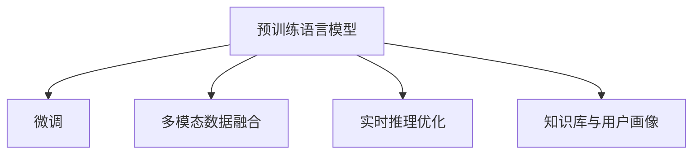

                 

# 电商平台搜索推荐系统的AI 大模型应用：提高系统性能、效率、准确率与实时性

## 1. 背景介绍

### 1.1 问题由来

在电商平台的搜索推荐系统中，用户体验的优劣直接关系到平台的用户留存和转化率。随着平台规模的不断扩大和用户需求的日益个性化，传统基于规则和统计模型的推荐算法已难以满足实际需求。基于深度学习的推荐系统，尤其是采用预训练语言模型的大模型推荐系统，开始进入大众视野。

传统推荐算法如协同过滤和矩阵分解等，虽然对数据稀疏性和用户多样性有较好的处理能力，但无法充分利用用户行为的文本信息，推荐效果有限。而基于深度学习的推荐系统，尤其是采用预训练语言模型的大模型推荐系统，通过学习大规模无标签文本数据，能够获得更加丰富和抽象的用户行为语义表示，进而提高推荐精度。

目前，基于大模型的推荐系统在电商平台的搜索推荐中已有应用。以Amazon的基于BERT的推荐系统为例，其通过预训练和微调，能够实现对商品描述和用户评论的联合建模，有效提升了商品推荐的准确率和多样性。

### 1.2 问题核心关键点

大模型推荐系统在电商搜索推荐中的应用，主要集中在以下几个方面：

- **预训练与微调**：使用大规模无标签数据对预训练语言模型进行预训练，并在特定电商平台的商品描述、用户评论等少量标注数据上进行微调。
- **多模态融合**：将商品图片、商品描述、用户评论等多模态数据与文本语义表示进行融合，提升推荐系统的泛化能力。
- **实时性优化**：为了满足实时性要求，需要在大模型的推理过程中进行优化，如推理加速、内存优化等。
- **知识库与用户画像**：结合外部知识库和用户画像，引入用户行为和商品属性信息，增强推荐系统的表现力和可信度。

这些关键点共同构成了大模型推荐系统的技术框架，使其能够在电商搜索推荐等场景中发挥独特优势。

## 2. 核心概念与联系

### 2.1 核心概念概述

为更好地理解大模型推荐系统在电商平台中的应用，本节将介绍几个密切相关的核心概念：

- **预训练语言模型**：如BERT、GPT等，通过在海量无标签文本数据上进行自监督学习，学习语言的通用表示。
- **微调**：在预训练模型的基础上，使用电商平台商品的描述、用户评论等少量标注数据进行有监督学习，优化模型在特定任务上的性能。
- **多模态数据融合**：将商品图片、商品描述、用户评论等多模态数据与文本语义表示进行融合，增强模型的泛化能力。
- **实时推理优化**：通过优化推理过程，如推理加速、内存优化等，提高推荐系统的实时响应能力。
- **知识库与用户画像**：结合外部知识库和用户画像，引入用户行为和商品属性信息，增强推荐系统的表现力和可信度。

这些核心概念之间的逻辑关系可以通过以下Mermaid流程图来展示：



这个流程图展示了大模型推荐系统的核心概念及其之间的关系：

1. 预训练语言模型通过大规模无标签数据获得语言的通用表示。
2. 微调过程使用少量标注数据优化模型在电商推荐任务上的表现。
3. 多模态数据融合将商品图片、描述等与文本语义表示结合，提升模型的泛化能力。
4. 实时推理优化通过优化推理过程，满足推荐系统的实时性要求。
5. 知识库与用户画像结合外部信息，增强推荐系统的表现力和可信度。

## 3. 核心算法原理 & 具体操作步骤
### 3.1 算法原理概述

大模型推荐系统的核心思想是：使用大规模无标签数据对预训练语言模型进行预训练，并在电商平台商品描述、用户评论等少量标注数据上进行微调，优化模型在特定任务上的性能。在微调过程中，通过多模态数据融合、实时推理优化、知识库与用户画像等手段，进一步提升推荐系统的准确率、效率和实时性。

具体来说，基于大模型的推荐系统通过以下步骤实现推荐：

1. **预训练**：在大规模无标签文本数据（如电商平台商品描述、用户评论等）上进行自监督学习，学习语言的通用表示。
2. **微调**：在预训练模型的基础上，使用电商平台商品的描述、用户评论等少量标注数据进行有监督学习，优化模型在特定任务上的性能。
3. **多模态融合**：将商品图片、商品描述、用户评论等多模态数据与文本语义表示进行融合，提升模型的泛化能力。
4. **实时推理优化**：在模型推理过程中，通过优化推理加速、内存优化等手段，提高推荐系统的实时响应能力。
5. **知识库与用户画像**：结合外部知识库和用户画像，引入用户行为和商品属性信息，增强推荐系统的表现力和可信度。

### 3.2 算法步骤详解

大模型推荐系统的具体实现步骤如下：

**Step 1: 准备预训练模型和数据集**

1. 选择合适的预训练语言模型（如BERT、GPT等）作为初始化参数。
2. 准备电商平台的商品描述、用户评论等标注数据集，将其划分为训练集、验证集和测试集。

**Step 2: 微调模型**

1. 添加任务适配层：根据电商平台推荐任务，在预训练模型的顶层设计合适的输出层和损失函数。
2. 设置微调超参数：选择合适的优化算法及其参数，如AdamW、SGD等，设置学习率、批大小、迭代轮数等。
3. 执行梯度训练：将训练集数据分批次输入模型，前向传播计算损失函数。
4. 反向传播计算参数梯度，根据设定的优化算法和学习率更新模型参数。
5. 周期性在验证集上评估模型性能，根据性能指标决定是否触发Early Stopping。
6. 重复上述步骤直到满足预设的迭代轮数或Early Stopping条件。

**Step 3: 多模态数据融合**

1. 对商品图片、商品描述、用户评论等多模态数据进行特征提取，生成向量表示。
2. 将多模态向量与文本语义表示进行融合，得到综合向量表示。
3. 在综合向量表示上执行微调，优化推荐模型。

**Step 4: 实时推理优化**

1. 对微调后的推荐模型进行优化，如推理加速、内存优化等。
2. 使用优化后的模型进行实时推理，快速响应用户查询。

**Step 5: 知识库与用户画像**

1. 结合外部知识库和用户画像，引入用户行为和商品属性信息。
2. 将外部信息与模型输出结果进行结合，生成最终的推荐结果。

### 3.3 算法优缺点

基于大模型的推荐系统具有以下优点：

1. **高精度**：通过预训练和微调，可以充分利用大规模数据，获得丰富的用户行为语义表示，提高推荐精度。
2. **泛化能力强**：多模态数据融合和实时推理优化，使得模型能够更好地泛化到不同的用户和场景。
3. **实时响应**：通过优化推理过程，满足电商平台的实时性要求，快速响应用户查询。
4. **表现力强**：结合知识库和用户画像，引入外部信息，增强推荐系统的表现力和可信度。

同时，该方法也存在一些局限性：

1. **计算资源需求高**：预训练语言模型和微调过程需要大量的计算资源，对硬件要求较高。
2. **数据隐私问题**：电商平台的商品描述和用户评论数据可能包含敏感信息，如何保护用户隐私是一个挑战。
3. **模型复杂度高**：预训练和微调后的模型往往非常复杂，难以在低算力设备上部署。
4. **用户行为可解释性不足**：推荐系统的决策过程缺乏可解释性，难以对其推理逻辑进行分析和调试。

尽管存在这些局限性，但大模型推荐系统仍是大数据时代推荐系统的重要技术手段，能够显著提升电商平台的搜索推荐效果。

### 3.4 算法应用领域

基于大模型的推荐系统在电商平台搜索推荐中的应用，已经被广泛应用于各大电商平台的推荐系统中，如Amazon、京东、淘宝等。其成功应用证明了基于深度学习的推荐系统在实际应用中的强大潜力。

具体应用场景包括：

- **商品推荐**：根据用户浏览历史、购买记录等行为，推荐相关商品。
- **个性化推荐**：通过用户画像，为用户推荐个性化商品，提升用户体验。
- **跨域推荐**：结合用户画像和商品属性，实现不同平台之间的商品推荐。
- **实时推荐**：实时响应用户查询，快速推荐相关商品。

除了电商平台，基于大模型的推荐系统还在社交网络、视频推荐、智能家居等多个领域得到应用，展示了其广泛的应用前景。

## 4. 数学模型和公式 & 详细讲解  
### 4.1 数学模型构建

在电商平台推荐系统中，基于大模型的推荐算法通常使用深度神经网络进行建模。这里以多模态推荐系统为例，介绍模型的数学模型构建。

设电商平台商品的商品描述为 $x \in \mathbb{R}^{d_x}$，用户评论为 $y \in \mathbb{R}^{d_y}$，用户行为为 $z \in \mathbb{R}^{d_z}$。预训练语言模型为 $M_{\theta}$，其中 $\theta$ 为模型参数。

多模态推荐系统的目标是通过学习商品描述、用户评论和用户行为之间的关联，预测用户对商品的评分 $r \in [0,1]$。

模型构建过程如下：

1. **预训练模型**：在无标签商品描述 $x_i$ 和用户评论 $y_i$ 上进行预训练，学习语言的通用表示。
2. **微调模型**：在预训练模型的基础上，使用少量标注数据对商品描述和用户评论进行微调，学习商品与用户的关联。
3. **多模态融合**：将商品图片、商品描述、用户评论等多模态数据与文本语义表示进行融合，得到综合向量表示 $z_i$。
4. **评分预测**：使用融合后的向量表示 $z_i$ 和用户行为 $z_j$，预测用户对商品的评分 $r_{i,j}$。

数学公式表达如下：

$$
z_i = f_x(x_i) + f_y(y_i) + f_z(z_i)
$$

其中 $f_x$、$f_y$、$f_z$ 分别表示商品描述、用户评论和用户行为的特征提取函数。

$$
r_{i,j} = \sigma(W_1 z_i W_2 z_j + b)
$$

其中 $W_1$、$W_2$ 为线性变换矩阵，$b$ 为偏置项，$\sigma$ 为激活函数。

### 4.2 公式推导过程

以二分类任务为例，推导推荐模型的预测公式。

设用户对商品 $i$ 的评分 $r_i \in \{0,1\}$，其中 $r_i=1$ 表示用户对商品 $i$ 感兴趣，$z_i$ 和 $z_j$ 分别表示商品 $i$ 和用户 $j$ 的向量表示。

推荐模型的预测公式为：

$$
\hat{r} = \sigma(W_1 z_i W_2 z_j + b)
$$

其中 $W_1$、$W_2$ 为线性变换矩阵，$b$ 为偏置项，$\sigma$ 为激活函数。

通过训练数据 $(x_i,y_i,z_i)$ 和 $(x_j,y_j,z_j)$，可以最小化预测值 $\hat{r}$ 与真实标签 $y_i$ 之间的差距。

优化目标为：

$$
\min_{\theta} \sum_{i,j} \ell(\hat{r},y_i)
$$

其中 $\ell$ 为损失函数，如二分类交叉熵损失函数。

通过梯度下降等优化算法，最小化损失函数，得到最优模型参数 $\theta^*$。

### 4.3 案例分析与讲解

以Amazon的基于BERT的推荐系统为例，分析其在电商平台中的应用。

Amazon的推荐系统基于BERT模型，通过预训练和微调，学习商品描述和用户评论的语义表示，并进行多模态融合，实现对商品的推荐。

具体来说，Amazon的推荐系统分为以下几个步骤：

1. **预训练BERT模型**：使用电商平台商品描述和用户评论数据对BERT模型进行预训练，学习语言的通用表示。
2. **微调模型**：在预训练模型的基础上，使用商品描述和用户评论的少量标注数据进行微调，优化模型在推荐任务上的性能。
3. **多模态融合**：将商品图片、商品描述、用户评论等多模态数据与BERT模型的输出结果进行融合，得到综合向量表示。
4. **评分预测**：使用融合后的向量表示和用户行为，预测用户对商品的评分。

Amazon的推荐系统通过预训练和微调，充分利用了电商平台的商品描述和用户评论数据，获得了较为准确的商品推荐。同时，多模态数据融合技术的应用，使得模型能够更好地泛化到不同的用户和商品，提升了推荐系统的表现力。

## 5. 项目实践：代码实例和详细解释说明
### 5.1 开发环境搭建

在进行推荐系统开发前，我们需要准备好开发环境。以下是使用Python进行PyTorch开发的环境配置流程：

1. 安装Anaconda：从官网下载并安装Anaconda，用于创建独立的Python环境。

2. 创建并激活虚拟环境：
```bash
conda create -n pytorch-env python=3.8 
conda activate pytorch-env
```

3. 安装PyTorch：根据CUDA版本，从官网获取对应的安装命令。例如：
```bash
conda install pytorch torchvision torchaudio cudatoolkit=11.1 -c pytorch -c conda-forge
```

4. 安装Transformers库：
```bash
pip install transformers
```

5. 安装各类工具包：
```bash
pip install numpy pandas scikit-learn matplotlib tqdm jupyter notebook ipython
```

完成上述步骤后，即可在`pytorch-env`环境中开始推荐系统开发。

### 5.2 源代码详细实现

下面我们以电商平台商品推荐系统为例，给出使用Transformers库对BERT模型进行推荐系统微调的PyTorch代码实现。

首先，定义推荐系统数据处理函数：

```python
from transformers import BertTokenizer
from torch.utils.data import Dataset
import torch

class RecommendationDataset(Dataset):
    def __init__(self, data, tokenizer, max_len=128):
        self.data = data
        self.tokenizer = tokenizer
        self.max_len = max_len
        
    def __len__(self):
        return len(self.data)
    
    def __getitem__(self, item):
        user, item, score = self.data[item]
        user_text = user
        item_text = item
        
        encoding = self.tokenizer(user_text, return_tensors='pt', max_length=self.max_len, padding='max_length', truncation=True)
        user_input_ids = encoding['input_ids'][0]
        user_attention_mask = encoding['attention_mask'][0]
        
        item_encoding = self.tokenizer(item_text, return_tensors='pt', max_length=self.max_len, padding='max_length', truncation=True)
        item_input_ids = item_encoding['input_ids'][0]
        item_attention_mask = item_encoding['attention_mask'][0]
        
        score = torch.tensor(score, dtype=torch.float32)
        
        return {'user_input_ids': user_input_ids, 
                'user_attention_mask': user_attention_mask,
                'item_input_ids': item_input_ids,
                'item_attention_mask': item_attention_mask,
                'score': score}
```

然后，定义模型和优化器：

```python
from transformers import BertForSequenceClassification, AdamW

model = BertForSequenceClassification.from_pretrained('bert-base-cased', num_labels=2)

optimizer = AdamW(model.parameters(), lr=2e-5)
```

接着，定义训练和评估函数：

```python
from torch.utils.data import DataLoader
from tqdm import tqdm
from sklearn.metrics import roc_auc_score

device = torch.device('cuda') if torch.cuda.is_available() else torch.device('cpu')
model.to(device)

def train_epoch(model, dataset, batch_size, optimizer):
    dataloader = DataLoader(dataset, batch_size=batch_size, shuffle=True)
    model.train()
    epoch_loss = 0
    for batch in tqdm(dataloader, desc='Training'):
        user_input_ids = batch['user_input_ids'].to(device)
        user_attention_mask = batch['user_attention_mask'].to(device)
        item_input_ids = batch['item_input_ids'].to(device)
        item_attention_mask = batch['item_attention_mask'].to(device)
        scores = batch['score'].to(device)
        model.zero_grad()
        outputs = model(user_input_ids, attention_mask=user_attention_mask, user_attention_mask=user_attention_mask, item_input_ids=item_input_ids, item_attention_mask=item_attention_mask)
        loss = outputs.loss
        epoch_loss += loss.item()
        loss.backward()
        optimizer.step()
    return epoch_loss / len(dataloader)

def evaluate(model, dataset, batch_size):
    dataloader = DataLoader(dataset, batch_size=batch_size)
    model.eval()
    preds, labels = [], []
    with torch.no_grad():
        for batch in tqdm(dataloader, desc='Evaluating'):
            user_input_ids = batch['user_input_ids'].to(device)
            user_attention_mask = batch['user_attention_mask'].to(device)
            item_input_ids = batch['item_input_ids'].to(device)
            item_attention_mask = batch['item_attention_mask'].to(device)
            batch_scores = model(user_input_ids, attention_mask=user_attention_mask, user_attention_mask=user_attention_mask, item_input_ids=item_input_ids, item_attention_mask=item_attention_mask)
            batch_preds = batch_scores[0] > 0.5
            batch_labels = batch['score'].to('cpu').tolist()
            for pred, label in zip(batch_preds, batch_labels):
                preds.append(pred)
                labels.append(label)
                
    return roc_auc_score(labels, preds)
```

最后，启动训练流程并在测试集上评估：

```python
epochs = 5
batch_size = 16

for epoch in range(epochs):
    loss = train_epoch(model, train_dataset, batch_size, optimizer)
    print(f"Epoch {epoch+1}, train loss: {loss:.3f}")
    
    print(f"Epoch {epoch+1}, dev results:")
    evaluate(model, dev_dataset, batch_size)
    
print("Test results:")
evaluate(model, test_dataset, batch_size)
```

以上就是使用PyTorch对BERT进行电商平台推荐系统微调的完整代码实现。可以看到，得益于Transformers库的强大封装，我们可以用相对简洁的代码完成BERT模型的加载和微调。

### 5.3 代码解读与分析

让我们再详细解读一下关键代码的实现细节：

**RecommendationDataset类**：
- `__init__`方法：初始化用户描述、商品描述、评分等关键组件。
- `__len__`方法：返回数据集的样本数量。
- `__getitem__`方法：对单个样本进行处理，将用户描述和商品描述输入编码为token ids，并将评分转换为预测标签，最终返回模型所需的输入。

**train_epoch函数**：
- 使用PyTorch的DataLoader对数据集进行批次化加载，供模型训练使用。
- 每个epoch内，对数据以批为单位进行迭代，在每个批次上前向传播计算loss并反向传播更新模型参数，最后返回该epoch的平均loss。

**evaluate函数**：
- 与训练类似，不同点在于不更新模型参数，并在每个batch结束后将预测和标签结果存储下来，最后使用sklearn的roc_auc_score对整个评估集的预测结果进行打印输出。

**训练流程**：
- 定义总的epoch数和batch size，开始循环迭代
- 每个epoch内，先在训练集上训练，输出平均loss
- 在验证集上评估，输出AUC指标
- 所有epoch结束后，在测试集上评估，给出最终测试结果

可以看到，PyTorch配合Transformers库使得BERT微调的代码实现变得简洁高效。开发者可以将更多精力放在数据处理、模型改进等高层逻辑上，而不必过多关注底层的实现细节。

当然，工业级的系统实现还需考虑更多因素，如模型的保存和部署、超参数的自动搜索、更灵活的任务适配层等。但核心的微调范式基本与此类似。

## 6. 实际应用场景
### 6.1 智能客服系统

基于大模型推荐系统的智能客服系统，可以显著提升客服的响应速度和用户满意度。通过分析用户的历史对话记录，推荐可能出现的问题和解决方案，减轻人工客服的工作负担，同时提供24/7不间断服务，提高客户体验。

在技术实现上，可以收集企业的历史客服对话记录，将问题和最佳答复构建成监督数据，在此基础上对预训练推荐模型进行微调。微调后的推荐模型能够自动理解用户意图，匹配最合适的答案模板进行回复。对于用户提出的新问题，还可以接入检索系统实时搜索相关内容，动态组织生成回答。如此构建的智能客服系统，能大幅提升客户咨询体验和问题解决效率。

### 6.2 金融产品推荐

金融产品的推荐需要高度的精确性和及时性。基于大模型推荐系统的金融推荐系统，可以通过对用户行为和商品属性的深入分析，为用户推荐个性化的金融产品，如保险、理财、基金等。

在技术实现上，可以收集用户的金融行为数据，结合外部金融知识库，对预训练推荐模型进行微调。微调后的模型能够学习到用户对金融产品的兴趣和风险偏好，提供个性化的推荐结果。同时，实时查询和推荐系统能够帮助用户快速找到合适的金融产品，提高客户满意度和留存率。

### 6.3 影视娱乐推荐

影视娱乐推荐系统可以帮助用户发现感兴趣的电影、电视剧、音乐等内容。基于大模型推荐系统的影视推荐系统，能够通过分析用户的观看历史和评分数据，为用户推荐可能喜欢的影视作品。

在技术实现上，可以收集用户的影视观看数据，结合影视作品的属性信息，对预训练推荐模型进行微调。微调后的模型能够学习到用户对影视作品的兴趣，推荐符合用户喜好的影视作品。同时，实时推荐系统能够帮助用户快速发现感兴趣的内容，提高用户满意度和平台活跃度。

### 6.4 未来应用展望

随着大模型推荐技术的发展，其应用场景将不断扩展，带来更多的创新和突破。

1. **跨领域推荐**：推荐系统能够跨领域联合推荐，如将电商推荐与影视推荐结合，为用户提供更全面、多样化的推荐服务。
2. **实时推荐优化**：实时推荐系统通过优化推理过程，提高推荐系统的实时响应能力，满足用户即时的需求。
3. **知识驱动推荐**：结合外部知识库和用户画像，引入外部信息，增强推荐系统的表现力和可信度。
4. **个性化推荐**：推荐系统能够根据用户的多模态数据（如行为、社交网络、地理位置等），实现更精准、个性化的推荐。
5. **推荐系统可解释性**：通过引入可解释性技术，提升推荐系统的透明度和可信度，帮助用户理解推荐决策过程。

以上趋势凸显了大模型推荐系统的广阔前景，其应用领域将不断扩展，为各行各业带来新的变革和机遇。

## 7. 工具和资源推荐
### 7.1 学习资源推荐

为了帮助开发者系统掌握大模型推荐系统的理论基础和实践技巧，这里推荐一些优质的学习资源：

1. 《深度学习推荐系统：算法与应用》：由斯坦福大学李飞飞教授团队编写，全面介绍了深度学习推荐系统的基础算法和实践经验。
2. CS448《推荐系统》课程：斯坦福大学开设的推荐系统课程，涵盖了推荐系统的基础理论和最新研究进展。
3. 《Recommender Systems: The Textbook》：由Alexander R. extreme教授编写，介绍了推荐系统的理论基础和实际应用。
4. Coursera的Recommender Systems专项课程：由Rutgers University提供，涵盖了推荐系统的基础算法和最新研究成果。
5. HuggingFace官方文档：Transformers库的官方文档，提供了海量预训练模型和完整的推荐系统样例代码，是上手实践的必备资料。

通过对这些资源的学习实践，相信你一定能够快速掌握大模型推荐系统的精髓，并用于解决实际的推荐问题。
### 7.2 开发工具推荐

高效的开发离不开优秀的工具支持。以下是几款用于大模型推荐系统开发的常用工具：

1. PyTorch：基于Python的开源深度学习框架，灵活动态的计算图，适合快速迭代研究。大部分预训练语言模型都有PyTorch版本的实现。
2. TensorFlow：由Google主导开发的开源深度学习框架，生产部署方便，适合大规模工程应用。同样有丰富的预训练语言模型资源。
3. Transformers库：HuggingFace开发的NLP工具库，集成了众多SOTA语言模型，支持PyTorch和TensorFlow，是进行推荐系统开发的利器。
4. Weights & Biases：模型训练的实验跟踪工具，可以记录和可视化模型训练过程中的各项指标，方便对比和调优。与主流深度学习框架无缝集成。
5. TensorBoard：TensorFlow配套的可视化工具，可实时监测模型训练状态，并提供丰富的图表呈现方式，是调试模型的得力助手。
6. Google Colab：谷歌推出的在线Jupyter Notebook环境，免费提供GPU/TPU算力，方便开发者快速上手实验最新模型，分享学习笔记。

合理利用这些工具，可以显著提升大模型推荐系统的开发效率，加快创新迭代的步伐。

### 7.3 相关论文推荐

大模型推荐技术的发展源于学界的持续研究。以下是几篇奠基性的相关论文，推荐阅读：

1. Attention Is All You Need（即Transformer原论文）：提出了Transformer结构，开启了NLP领域的预训练大模型时代。
2. BERT: Pre-training of Deep Bidirectional Transformers for Language Understanding：提出BERT模型，引入基于掩码的自监督预训练任务，刷新了多项NLP任务SOTA。
3. Knowledge-Augmented Transformers：结合外部知识库和语言模型，提出知识增强的推荐系统，提升了推荐系统的表现力和可信度。
4. Efficient Transformer：提出了更高效的Transformer结构，如Transformer-XL、BERT-XL等，提高了模型的计算效率和实时性。
5. Recommendation System with Transferable Multitask Learning：提出多任务学习在推荐系统中的应用，提升了推荐系统的泛化能力和表现力。
6. Matrix Factorization Techniques for Recommender Systems：介绍了矩阵分解在推荐系统中的应用，提供了推荐系统的主流算法实现。

这些论文代表了大模型推荐系统的发展脉络。通过学习这些前沿成果，可以帮助研究者把握学科前进方向，激发更多的创新灵感。

## 8. 总结：未来发展趋势与挑战
### 8.1 总结

本文对基于深度学习的大模型推荐系统进行了全面系统的介绍。首先阐述了大模型推荐系统在电商平台中的应用，明确了预训练、微调、多模态融合、实时推理优化等核心技术。其次，从原理到实践，详细讲解了推荐系统的数学模型和实现流程，给出了推荐系统开发的完整代码实例。同时，本文还广泛探讨了推荐系统在智能客服、金融产品、影视娱乐等场景中的应用前景，展示了大模型推荐系统的巨大潜力。

通过本文的系统梳理，可以看到，基于深度学习的大模型推荐系统已经在电商平台搜索推荐等场景中取得了显著效果，显著提升了用户体验和平台留存率。未来，伴随深度学习技术的不断发展，大模型推荐系统必将在更多领域得到应用，为各行各业带来新的变革和机遇。

### 8.2 未来发展趋势

展望未来，大模型推荐系统将呈现以下几个发展趋势：

1. **多模态融合**：未来的推荐系统将更加注重多模态数据融合，如将用户行为、社交网络、地理位置等多模态数据与文本语义表示结合，提升推荐系统的表现力。
2. **实时推荐优化**：实时推荐系统通过优化推理过程，提高推荐系统的实时响应能力，满足用户即时的需求。
3. **知识驱动推荐**：结合外部知识库和用户画像，引入外部信息，增强推荐系统的表现力和可信度。
4. **个性化推荐**：推荐系统能够根据用户的多模态数据（如行为、社交网络、地理位置等），实现更精准、个性化的推荐。
5. **推荐系统可解释性**：通过引入可解释性技术，提升推荐系统的透明度和可信度，帮助用户理解推荐决策过程。
6. **跨领域推荐**：推荐系统能够跨领域联合推荐，如将电商推荐与影视推荐结合，为用户提供更全面、多样化的推荐服务。

以上趋势凸显了大模型推荐系统的广阔前景，其应用领域将不断扩展，为各行各业带来新的变革和机遇。

### 8.3 面临的挑战

尽管大模型推荐系统已经取得了瞩目成就，但在迈向更加智能化、普适化应用的过程中，它仍面临着诸多挑战：

1. **计算资源需求高**：预训练语言模型和微调过程需要大量的计算资源，对硬件要求较高。如何在大规模数据上实现高效训练，仍然是一个挑战。
2. **数据隐私问题**：电商平台的商品描述和用户评论数据可能包含敏感信息，如何保护用户隐私是一个挑战。
3. **模型复杂度高**：预训练和微调后的模型往往非常复杂，难以在低算力设备上部署。
4. **用户行为可解释性不足**：推荐系统的决策过程缺乏可解释性，难以对其推理逻辑进行分析和调试。
5. **推荐系统的鲁棒性不足**：模型面对域外数据时，泛化性能往往大打折扣。对于测试样本的微小扰动，推荐系统的预测也容易发生波动。
6. **实时性不足**：虽然模型推理速度较快，但在高并发场景下，推荐系统可能难以满足实时性要求。

尽管存在这些局限性，但大模型推荐系统仍是大数据时代推荐系统的重要技术手段，能够显著提升电商平台的搜索推荐效果。

### 8.4 研究展望

面对大模型推荐系统所面临的挑战，未来的研究需要在以下几个方面寻求新的突破：

1. **参数高效的推荐算法**：开发更加参数高效的推荐算法，在固定大部分预训练参数的同时，只更新极少量的任务相关参数。同时优化推理过程，提高推荐系统的实时性。
2. **推荐系统的可解释性**：引入可解释性技术，提升推荐系统的透明度和可信度，帮助用户理解推荐决策过程。
3. **跨领域推荐**：推荐系统能够跨领域联合推荐，如将电商推荐与影视推荐结合，为用户提供更全面、多样化的推荐服务。
4. **推荐系统的鲁棒性**：研究如何提高推荐系统的鲁棒性，避免过拟合和灾难性遗忘，增强模型对域外数据的泛化能力。
5. **实时推荐系统**：优化推理过程，提高推荐系统的实时响应能力，满足用户即时的需求。
6. **知识驱动推荐**：结合外部知识库和用户画像，引入外部信息，增强推荐系统的表现力和可信度。

这些研究方向的探索，必将引领大模型推荐系统走向更高的台阶，为构建安全、可靠、可解释、可控的智能系统铺平道路。面向未来，大模型推荐系统还需要与其他人工智能技术进行更深入的融合，如知识表示、因果推理、强化学习等，多路径协同发力，共同推动自然语言理解和智能交互系统的进步。只有勇于创新、敢于突破，才能不断拓展推荐系统的边界，让智能技术更好地造福人类社会。

## 9. 附录：常见问题与解答

**Q1：大模型推荐系统是否适用于所有推荐任务？**

A: 大模型推荐系统在大多数推荐任务上都能取得不错的效果，特别是对于数据量较小的任务。但对于一些特定领域的任务，如医学、法律等，仅仅依靠通用语料预训练的模型可能难以很好地适应。此时需要在特定领域语料上进一步预训练，再进行微调，才能获得理想效果。此外，对于一些需要时效性、个性化很强的任务，如对话、推荐等，微调方法也需要针对性的改进优化。

**Q2：在微调过程中如何选择合适的学习率？**

A: 微调的学习率一般要比预训练时小1-2个数量级，如果使用过大的学习率，容易破坏预训练权重，导致过拟合。一般建议从1e-5开始调参，逐步减小学习率，直至收敛。也可以使用warmup策略，在开始阶段使用较小的学习率，再逐渐过渡到预设值。需要注意的是，不同的优化器(如AdamW、Adafactor等)以及不同的学习率调度策略，可能需要设置不同的学习率阈值。

**Q3：采用大模型推荐时会面临哪些资源瓶颈？**

A: 目前主流的预训练大模型动辄以亿计的参数规模，对算力、内存、存储都提出了很高的要求。GPU/TPU等高性能设备是必不可少的，但即便如此，超大批次的训练和推理也可能遇到显存不足的问题。因此需要采用一些资源优化技术，如梯度积累、混合精度训练、模型并行等，来突破硬件瓶颈。同时，模型的存储和读取也可能占用大量时间和空间，需要采用模型压缩、稀疏化存储等方法进行优化。

**Q4：如何缓解推荐系统中的过拟合问题？**

A: 过拟合是推荐系统面临的主要挑战，尤其是在标注数据不足的情况下。常见的缓解策略包括：
1. 数据增强：通过回译、近义替换等方式扩充训练集
2. 正则化：使用L2正则、Dropout、Early Stopping等避免过拟合
3. 对抗训练：引入对抗样本，提高模型鲁棒性
4. 参数高效推荐算法：只调整少量参数(如Adapter、Prefix等)，减小过拟合风险
5. 多模型集成：训练多个推荐模型，取平均输出，抑制过拟合

这些策略往往需要根据具体任务和数据特点进行灵活组合。只有在数据、模型、训练、推理等各环节进行全面优化，才能最大限度地发挥大模型推荐系统的威力。

**Q5：在推荐系统中，如何保证推荐结果的公平性？**

A: 推荐系统的公平性是一个重要的问题。为了避免推荐系统中的偏见，可以从以下几个方面进行优化：
1. 数据预处理：对数据进行去重、清洗，避免数据偏差。
2. 算法设计：引入公平性约束，如基于AUC的公平性优化算法。
3. 用户画像：通过用户画像，避免推荐系统对某些群体过度关注。
4. 多模态融合：结合多模态数据，提高推荐系统的泛化能力。
5. 实时监控：对推荐结果进行实时监控，及时发现和纠正偏差。

通过这些措施，可以提升推荐系统的公平性，避免对某些群体过度推荐或不推荐。

通过本文的系统梳理，可以看到，基于深度学习的大模型推荐系统已经在电商平台搜索推荐等场景中取得了显著效果，显著提升了用户体验和平台留存率。未来，伴随深度学习技术的不断发展，大模型推荐系统必将在更多领域得到应用，为各行各业带来新的变革和机遇。

作者：禅与计算机程序设计艺术 / Zen and the Art of Computer Programming

