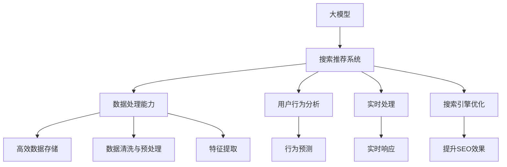

                 

# 电商平台的AI 大模型战略：搜索推荐系统是核心，数据处理能力是重点

在当今数字化时代的背景下，电商平台正处于高速发展的关键时期。作为连接消费者与商家的重要桥梁，电商平台在商业模式、用户体验、服务质量等方面面临着诸多挑战。为应对这些挑战，AI 大模型战略应运而生，成为电商平台的核心理念。本文将详细探讨搜索推荐系统在大模型战略中的核心地位，并强调数据处理能力的重要性。

## 1. 背景介绍

### 1.1 电商平台的现状与挑战

电商平台面临着激烈的市场竞争和日益多样化的消费者需求。传统电商平台的运营方式，如固定搜索、单一推荐引擎，已无法满足现代消费者的个性化需求。同时，商品种类繁多、用户数据复杂，也对平台的搜索推荐系统提出了更高的要求。

### 1.2 大模型的出现

大模型（Large Models）基于大规模数据训练，具备强大的通用性和泛化能力，适用于多种复杂任务。近年来，深度学习技术不断发展，预训练语言模型（如BERT、GPT）、自适应模型（如GPT-3）等技术纷纷涌现，为电商平台提供了强大的AI支持。

## 2. 核心概念与联系

### 2.1 核心概念概述

为了更好地理解搜索推荐系统在大模型战略中的作用，本文将介绍几个关键概念：

- **搜索推荐系统（Search & Recommendation System）**：通过分析用户历史行为和产品特性，为用户提供个性化搜索结果和推荐，提升用户体验和转化率。
- **大模型（Large Models）**：指使用大规模数据训练得到的深度学习模型，具备强大的学习能力。
- **数据处理能力（Data Processing）**：指对大规模数据进行高效、准确地处理和分析，为模型提供优质输入。
- **搜索引擎优化（Search Engine Optimization, SEO）**：通过优化网页结构和内容，提升搜索引擎的收录和排名。
- **用户行为分析（User Behavior Analysis）**：通过分析用户行为数据，挖掘用户需求，优化推荐算法。
- **实时处理（Real-Time Processing）**：指系统能够实时响应用户请求，提供个性化服务。

这些概念之间的关系通过以下 Mermaid 流程图进行展示：



这个流程图展示了各大模型和核心技术之间的关系：

1. 大模型作为搜索推荐系统的核心，提供强大的学习和泛化能力。
2. 数据处理能力通过高效存储、清洗与预处理、特征提取等手段，为模型提供优质输入。
3. 用户行为分析通过挖掘用户历史行为数据，优化推荐算法，提升用户体验。
4. 实时处理通过实时响应，提供更加灵活、个性化的服务。
5. 搜索引擎优化通过提升SEO效果，使推荐系统获得更多的流量。

## 3. 核心算法原理 & 具体操作步骤

### 3.1 算法原理概述

搜索推荐系统在大模型战略中的核心地位，主要基于以下几个原理：

1. **个性化推荐**：通过大模型学习用户行为数据和产品特性，提供个性化推荐，提升用户体验和转化率。
2. **协同过滤**：通过分析用户行为和商品属性，挖掘用户间的相似性和商品的关联性，实现精准推荐。
3. **深度学习**：使用大模型进行特征提取和模式识别，提升推荐系统的准确性和鲁棒性。
4. **自然语言处理**：通过自然语言处理技术，对用户搜索词进行理解与分析，提供更准确的结果。

### 3.2 算法步骤详解

大模型在搜索推荐系统中的应用，通常包括以下几个关键步骤：

1. **数据准备**：收集和清洗用户历史行为数据、产品属性信息等，作为训练数据的输入。
2. **模型训练**：使用大模型进行特征提取和模式识别，训练推荐模型。
3. **模型部署**：将训练好的模型部署到生产环境，进行实时推荐。
4. **效果评估**：通过用户反馈、转化率等指标，评估推荐效果。
5. **持续优化**：根据评估结果，不断调整模型参数，优化推荐算法。

### 3.3 算法优缺点

基于大模型的搜索推荐系统具有以下优点：

1. **准确度高**：大模型通过大规模数据训练，具备强大的泛化能力，推荐结果准确性高。
2. **鲁棒性强**：大模型能够处理多种复杂场景，适应性强。
3. **可扩展性高**：大模型可以同时支持多种推荐算法，灵活性高。

但同时，也存在一些缺点：

1. **计算成本高**：大模型的训练和部署需要高昂的计算资源。
2. **数据隐私风险**：大模型需要大量的用户数据进行训练，可能存在隐私泄露风险。
3. **冷启动问题**：新用户和商品缺乏足够的历史数据，难以进行有效推荐。

### 3.4 算法应用领域

大模型在搜索推荐系统中的应用，广泛存在于电子商务、社交媒体、新闻推荐等多个领域。以下列举几个典型应用场景：

1. **电商平台推荐**：基于用户历史购买记录和浏览行为，推荐相关商品。
2. **新闻内容推荐**：根据用户阅读历史和兴趣爱好，推荐相关新闻文章。
3. **社交媒体推荐**：分析用户互动行为，推荐朋友和内容。
4. **视频推荐**：根据用户观看历史，推荐相关视频内容。

## 4. 数学模型和公式 & 详细讲解 & 举例说明

### 4.1 数学模型构建

搜索推荐系统的数学模型通常包括以下几个部分：

1. **用户-商品矩阵**：表示用户对商品的兴趣度，通过大模型进行训练和更新。
2. **协同过滤模型**：通过用户行为数据和商品属性，进行相似性计算。
3. **深度学习模型**：使用大模型进行特征提取和模式识别。

### 4.2 公式推导过程

以协同过滤模型为例，公式推导如下：

1. **用户-商品相似度计算**：
   $$
   similarity(u_i,v_j)=\frac{\sum_{k=1}^K u_{ik}v_{jk}}{\sqrt{\sum_{k=1}^K u_{ik}^2}\sqrt{\sum_{k=1}^K v_{jk}^2}}
   $$

2. **用户-商品推荐**：
   $$
   \hat{p}_{ij}=\frac{similarity(u_i,v_j)}{\sum_{k=1}^K similarity(u_i,v_k)}
   $$

其中，$u_{ik}$表示用户$i$对商品$k$的兴趣度，$v_{jk}$表示商品$j$的特征向量。

### 4.3 案例分析与讲解

以亚马逊推荐系统为例，用户-商品矩阵通过用户行为数据进行训练和更新，协同过滤模型通过计算用户和商品的相似度，进行个性化推荐。亚马逊使用深度学习技术，分析用户行为和商品属性，提升推荐精度。

## 5. 项目实践：代码实例和详细解释说明

### 5.1 开发环境搭建

1. **选择编程语言和框架**：
   - Python：流行的数据科学语言，生态丰富。
   - TensorFlow：常用的深度学习框架，支持分布式计算。
   - PyTorch：灵活的深度学习框架，易于调试和优化。

2. **安装依赖包**：
   - 使用pip安装TensorFlow、PyTorch、scikit-learn等依赖包。

3. **搭建开发环境**：
   - 使用Docker或虚拟环境（如Anaconda）搭建开发环境。
   - 安装必要的扩展包，如Jupyter Notebook、TensorBoard等。

### 5.2 源代码详细实现

以下是一个使用TensorFlow进行推荐系统训练的示例代码：

```python
import tensorflow as tf
import pandas as pd
import numpy as np

# 准备数据
data = pd.read_csv('user_behavior.csv')
user_ids = data['user_id'].unique().tolist()
item_ids = data['item_id'].unique().tolist()

# 构建用户-商品矩阵
user_item_matrix = np.zeros((len(user_ids), len(item_ids)))
for i, user_id in enumerate(user_ids):
    for j, item_id in enumerate(item_ids):
        count = data[(data['user_id']==user_id) & (data['item_id']==item_id)]['count'].sum()
        user_item_matrix[i, j] = count

# 定义协同过滤模型
def collaborative_filtering(X, num_epochs=10, learning_rate=0.01):
    num_users, num_items = X.shape
    W = tf.Variable(tf.random.normal([num_items, num_users]))
    U = tf.Variable(tf.random.normal([num_users, 1]))
    V = tf.Variable(tf.random.normal([num_items, 1]))
    
    def predict(X):
        return tf.matmul(X, W) + tf.matmul(X, U) * tf.matmul(W, V)
    
    def loss(X, Y):
        return tf.reduce_mean(tf.square(predict(X) - Y))
    
    optimizer = tf.optimizers.Adam(learning_rate=learning_rate)
    for epoch in range(num_epochs):
        with tf.GradientTape() as tape:
            loss_value = loss(X, Y)
        gradients = tape.gradient(loss_value, [W, U, V])
        optimizer.apply_gradients(zip(gradients, [W, U, V]))
        print(f'Epoch {epoch+1}, Loss: {loss_value:.3f}')
    
    return predict

# 训练模型
model = collaborative_filtering(user_item_matrix)
```

### 5.3 代码解读与分析

1. **数据准备**：
   - 从用户行为数据中提取用户ID和商品ID，构建用户-商品矩阵。

2. **协同过滤模型定义**：
   - 使用TensorFlow定义协同过滤模型，包括用户向量、商品向量和权重矩阵。
   - 使用均方误差作为损失函数，Adam优化器进行训练。

3. **模型训练**：
   - 使用梯度下降算法，不断调整模型参数，最小化损失函数。

### 5.4 运行结果展示

运行上述代码，将输出每轮训练的损失值，最终得到一个协同过滤模型。可以使用该模型进行个性化推荐，提升电商平台的用户体验。

## 6. 实际应用场景

### 6.1 电商平台推荐

电商平台推荐是搜索推荐系统的重要应用场景。以淘宝为例，淘宝通过分析用户浏览、购买历史，推荐相关商品，提升用户满意度。

1. **用户行为分析**：
   - 使用深度学习模型，分析用户历史行为数据。
   - 通过协同过滤模型，计算用户和商品的相似度，进行个性化推荐。

2. **实时推荐**：
   - 使用大模型进行实时特征提取和模式识别，提升推荐效率和准确性。

### 6.2 新闻内容推荐

新闻内容推荐系统通过分析用户阅读历史，推荐相关新闻文章，提升用户粘性。

1. **用户行为分析**：
   - 使用深度学习模型，分析用户阅读历史和兴趣爱好。
   - 通过协同过滤模型，计算用户和新闻文章的相似度，进行个性化推荐。

2. **实时推荐**：
   - 使用大模型进行实时特征提取和模式识别，提升推荐效率和准确性。

### 6.3 社交媒体推荐

社交媒体推荐系统通过分析用户互动行为，推荐朋友和内容。

1. **用户行为分析**：
   - 使用深度学习模型，分析用户互动数据。
   - 通过协同过滤模型，计算用户和内容的相似度，进行个性化推荐。

2. **实时推荐**：
   - 使用大模型进行实时特征提取和模式识别，提升推荐效率和准确性。

## 7. 工具和资源推荐

### 7.1 学习资源推荐

为了帮助开发者系统掌握搜索推荐系统在大模型战略中的应用，以下是一些优质的学习资源：

1. **《推荐系统实战》**：本书系统介绍了推荐系统的工作原理和实际应用，包括协同过滤、深度学习、个性化推荐等。
2. **《深度学习》课程**：斯坦福大学开设的深度学习课程，涵盖深度学习的基础知识和高级技巧，适合初学者和进阶者。
3. **Kaggle竞赛**：Kaggle平台上有多个推荐系统竞赛，可以实际操作进行学习和实践。
4. **Coursera推荐系统课程**：Coursera平台上的推荐系统课程，涵盖了推荐系统的理论基础和实际应用。

通过这些学习资源，相信你一定能够快速掌握搜索推荐系统在大模型战略中的应用，并用于解决实际的推荐问题。

### 7.2 开发工具推荐

高效的开发离不开优秀的工具支持。以下是几款用于搜索推荐系统开发的常用工具：

1. **Jupyter Notebook**：轻量级的开发环境，支持Python代码的编写和运行。
2. **TensorFlow**：常用的深度学习框架，支持分布式计算和自动微分。
3. **PyTorch**：灵活的深度学习框架，易于调试和优化。
4. **Docker**：容器化技术，方便部署和管理多个应用程序。
5. **Kubernetes**：容器编排技术，支持大规模集群管理和自动化部署。
6. **AWS SageMaker**：亚马逊提供的机器学习平台，支持多种深度学习框架和算法。

合理利用这些工具，可以显著提升搜索推荐系统的开发效率，加快创新迭代的步伐。

### 7.3 相关论文推荐

搜索推荐系统和大模型技术的发展源于学界的持续研究。以下是几篇奠基性的相关论文，推荐阅读：

1. **《推荐系统》**：Liu, L. (2018). *Recommender Systems*. Cambridge University Press.
2. **《基于协同过滤的推荐系统》**：Sarwar, B., et al. (2001). *A survey of recommendation algorithms for collaborative filtering*. IEEE Transactions on Knowledge and Data Engineering, 13(4), 549-558.
3. **《深度学习推荐系统》**：He, X., et al. (2017). *Deep Learning for Recommender Systems: A Review and Outlook*. IEEE Transactions on Knowledge and Data Engineering, 29(5), 2312-2329.
4. **《基于深度学习的推荐系统》**：Zou, X., et al. (2016). *Deep Learning Recommender Systems: A Survey and Applications*. IEEE Transactions on Neural Networks and Learning Systems, 27(3), 451-465.

这些论文代表了大模型和搜索推荐系统的发展脉络，通过学习这些前沿成果，可以帮助研究者把握学科前进方向，激发更多的创新灵感。

## 8. 总结：未来发展趋势与挑战

### 8.1 总结

本文对大模型在搜索推荐系统中的应用进行了全面系统的介绍。首先阐述了搜索推荐系统在大模型战略中的核心地位，明确了大模型在提升用户体验和转化率方面的独特价值。其次，从原理到实践，详细讲解了搜索推荐系统的数学模型和关键步骤，给出了推荐系统开发的完整代码实例。同时，本文还广泛探讨了搜索推荐系统在电商、新闻、社交媒体等多个行业领域的应用前景，展示了搜索推荐系统的广泛应用。

通过本文的系统梳理，可以看到，搜索推荐系统作为大模型战略的重要组成部分，其应用场景广泛，能够显著提升用户体验和转化率。未来，伴随大模型技术的不断进步，搜索推荐系统将发挥越来越重要的作用。

### 8.2 未来发展趋势

展望未来，搜索推荐系统将呈现以下几个发展趋势：

1. **智能化程度提升**：大模型的不断进步，将推动搜索推荐系统向更加智能化、个性化方向发展，能够更好地满足用户的个性化需求。
2. **实时化能力增强**：实时处理技术的应用，将使搜索推荐系统能够更加灵活地响应用户需求，提供更加实时的服务。
3. **跨领域融合**：搜索推荐系统将与其他AI技术（如自然语言处理、图像识别等）进行融合，提供更加全面、准确的信息。
4. **隐私保护机制优化**：随着数据隐私问题的日益突出，搜索推荐系统将采用更加严格的隐私保护机制，保障用户数据安全。

以上趋势凸显了搜索推荐系统的广阔前景。这些方向的探索发展，将使搜索推荐系统在大模型战略中发挥更大的作用，为电商平台和用户带来更多价值。

### 8.3 面临的挑战

尽管搜索推荐系统在大模型战略中具有重要地位，但在迈向更加智能化、普适化应用的过程中，仍面临诸多挑战：

1. **数据质量和多样性**：搜索推荐系统依赖于高质量、多样化的数据，获取和清洗数据是关键。
2. **模型复杂度和计算成本**：大模型需要大量计算资源进行训练和部署，成本较高。
3. **隐私和安全**：搜索推荐系统需要处理大量用户数据，隐私和安全问题亟需解决。
4. **冷启动问题**：新用户和商品缺乏足够的历史数据，难以进行有效推荐。
5. **数据分布变化**：用户行为和商品特性会随时间变化，需要不断更新模型参数。

这些挑战需要从数据、模型、技术等多个方面进行全面解决，才能真正实现搜索推荐系统的智能化和普适化。

### 8.4 研究展望

为了应对上述挑战，未来的研究需要在以下几个方面寻求新的突破：

1. **数据增强技术**：通过数据增强技术，扩充训练集，提升模型泛化能力。
2. **高效计算技术**：采用分布式计算、模型压缩等技术，降低计算成本。
3. **隐私保护机制**：采用差分隐私、联邦学习等技术，保护用户隐私。
4. **个性化推荐算法**：结合深度学习、协同过滤等算法，提升推荐效果。
5. **实时处理技术**：采用缓存、消息队列等技术，提升实时响应能力。

这些研究方向的探索，将使搜索推荐系统在大模型战略中发挥更大的作用，为电商平台和用户带来更多价值。总之，搜索推荐系统需要不断创新和优化，才能在大模型战略中发挥更大的作用。

## 9. 附录：常见问题与解答

**Q1：如何构建用户-商品矩阵？**

A: 构建用户-商品矩阵通常包括以下几个步骤：

1. **数据清洗**：清洗用户行为数据，去除噪声和异常值。
2. **数据归一化**：对用户行为数据进行归一化处理，使其符合正态分布。
3. **特征提取**：提取用户行为特征，如浏览时间、点击次数等。
4. **数据合并**：将不同用户的行为数据合并，构建用户-商品矩阵。

**Q2：推荐系统如何处理冷启动问题？**

A: 冷启动问题可以通过以下方法解决：

1. **基于内容的推荐**：利用商品属性和用户画像，进行推荐。
2. **基于用户群组的推荐**：将用户分组，对每个群组进行推荐。
3. **混合推荐**：结合多种推荐算法，提升推荐效果。

**Q3：推荐系统如何处理数据隐私问题？**

A: 推荐系统处理数据隐私问题，可以通过以下方法：

1. **差分隐私**：对数据进行扰动，保护用户隐私。
2. **联邦学习**：在多方数据不出本地的情况下，进行模型训练。
3. **匿名化**：对用户数据进行匿名化处理，保护用户隐私。

**Q4：推荐系统如何提升实时响应能力？**

A: 推荐系统提升实时响应能力，可以通过以下方法：

1. **缓存技术**：使用缓存技术，减少计算量。
2. **异步计算**：采用异步计算技术，提升处理速度。
3. **模型压缩**：使用模型压缩技术，降低计算资源消耗。

**Q5：推荐系统如何提升推荐效果？**

A: 推荐系统提升推荐效果，可以通过以下方法：

1. **多臂老虎机算法**：对多个推荐结果进行评估，选择最优结果。
2. **基于梯度的推荐算法**：通过梯度下降算法，不断优化模型参数。
3. **协同过滤算法**：通过协同过滤算法，挖掘用户和商品之间的相似性。

---

作者：禅与计算机程序设计艺术 / Zen and the Art of Computer Programming

