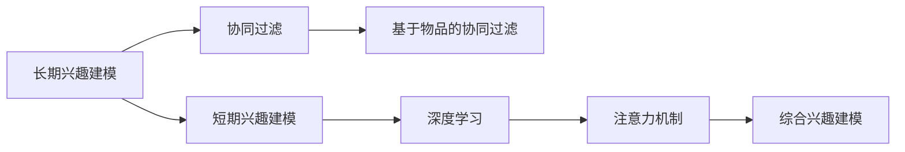

                 

## 1. 背景介绍

### 1.1 问题由来

在电商领域，推荐系统是提高用户体验、增加转化率、提升平台价值的重要工具。传统的推荐系统往往基于用户历史行为数据进行预测，包括浏览历史、购买记录、点击流等，这些数据常被称作用户"显性反馈"。但是，用户在平台上的行为数据往往不足，难以捕捉到用户的潜在兴趣和偏好，导致推荐效果受限。为了克服这一问题，电商推荐系统引入"隐性反馈"的概念，利用用户与商品之间的互动信息，如点击率、购买概率、收藏记录等，来预测用户对新商品的兴趣和偏好。

近年来，随着深度学习技术的兴起，推荐系统逐渐从基于规则和协同过滤的模型，转向以神经网络为基础的模型。以深度神经网络为核心的推荐系统可以通过大数据训练，学习到用户与商品之间的复杂关系，挖掘更深层次的用户行为特征，从而更准确地进行个性化推荐。

长短期兴趣建模是电商推荐系统中的一个重要研究方向，通过建模用户与商品的长时间交互关系和短期交互行为，捕捉用户的不同时间段内的兴趣变化，实现更精准的推荐。本文将详细介绍长短期兴趣建模的核心概念、算法原理、具体实现及未来展望，以期为电商推荐系统提供理论指导和实践方案。

### 1.2 问题核心关键点

长短期兴趣建模的核心在于如何综合考虑用户长时间行为和近期行为，构建能够准确预测用户兴趣的推荐模型。具体来说，包括：
- **长期兴趣建模**：通过长期行为数据学习用户的基本兴趣倾向。
- **短期兴趣建模**：捕捉用户近期行为对推荐结果的影响。
- **综合建模**：将长期和短期兴趣建模相结合，提升推荐精度。

下面我们将从核心概念、算法原理、具体实现和未来展望等方面，详细阐述长短期兴趣建模的原理和应用。

## 2. 核心概念与联系

### 2.1 核心概念概述

#### 2.1.1 长期兴趣建模
长期兴趣建模旨在通过用户的历史行为数据，学习用户的基本兴趣倾向。这些历史行为数据通常包括用户浏览过的商品、购买历史、收藏记录等，通过这些数据可以学习到用户在不同时间段的兴趣变化趋势。

#### 2.1.2 短期兴趣建模
短期兴趣建模关注用户近期的行为，如用户在过去一段时间内浏览的商品、点击的商品、加入购物车或实际购买的商品。通过捕捉用户的短期行为，可以预测用户在当前时间点的兴趣和购买意图。

#### 2.1.3 综合兴趣建模
综合兴趣建模将长期兴趣和短期兴趣相结合，构建一个更全面、准确的推荐模型。在推荐系统中，综合兴趣建模通常会采用多种算法和技术，如矩阵分解、深度学习、协同过滤等，以确保模型能够充分捕捉用户的多样化兴趣和复杂行为模式。

#### 2.1.4 协同过滤
协同过滤是一种基于用户相似性和物品相似性的推荐方法。通过分析用户的行为数据，找出与目标用户兴趣相似的其他用户或物品，来推荐目标用户可能感兴趣的商品。协同过滤可以分为基于用户的协同过滤和基于物品的协同过滤，其中基于物品的协同过滤更适用于冷启动问题。

#### 2.1.5 深度学习
深度学习是一种基于神经网络的机器学习方法，通过多层次的非线性变换，从大量数据中学习复杂的模式和特征。在推荐系统中，深度学习模型可以捕捉到用户和商品的非线性关系，提高推荐精度。

#### 2.1.6 注意力机制
注意力机制是一种用于提升深度学习模型对输入数据重要性的关注度的方法。在推荐系统中，注意力机制可以帮助模型更好地理解用户对不同商品的不同关注度，从而提升推荐效果。

### 2.2 核心概念联系

长短期兴趣建模的核心概念之间存在紧密的联系。通过长期兴趣建模，可以捕捉用户的长期行为模式，提供稳定的推荐依据。短期兴趣建模则捕捉用户近期的行为变化，提供动态的推荐依据。综合兴趣建模通过结合长期和短期兴趣，实现更精准的推荐。协同过滤和深度学习则提供了不同的方法和技术，用于构建具体的推荐模型。注意力机制则进一步提升了深度学习模型的推荐效果。

这些概念的联系可以通过以下Mermaid流程图表示：



## 3. 核心算法原理 & 具体操作步骤

### 3.1 算法原理概述

长短期兴趣建模的算法原理主要基于以下两个方面：

#### 3.1.1 时间序列分析
通过时间序列分析技术，捕捉用户的行为变化趋势。时间序列分析包括ARIMA、LSTM等方法，可以处理时间间隔相同的数据序列，分析数据的趋势和季节性变化。

#### 3.1.2 深度学习模型
利用深度学习模型捕捉用户和商品之间的复杂关系。常见的深度学习模型包括循环神经网络(RNN)、长短期记忆网络(LSTM)、门控循环单元(GRU)等。这些模型能够处理时间序列数据，学习到用户和商品的长期依赖关系。

### 3.2 算法步骤详解

#### 3.2.1 数据准备
1. 收集用户行为数据，包括用户浏览历史、购买历史、点击历史等。
2. 对数据进行预处理，如去除噪声、缺失值处理、数据归一化等。

#### 3.2.2 特征工程
1. 提取用户特征，如用户ID、年龄、性别等。
2. 提取商品特征，如商品ID、类别、价格等。
3. 构建交叉特征，如用户ID×商品ID、用户年龄×商品类别等。

#### 3.2.3 长期兴趣建模
1. 使用LSTM等深度学习模型，对用户的历史行为数据进行建模，学习用户的基本兴趣倾向。
2. 通过模型预测用户在不同时间段的兴趣概率，构建长期兴趣向量。

#### 3.2.4 短期兴趣建模
1. 使用RNN或LSTM等模型，对用户的近期行为数据进行建模，捕捉用户的短期行为模式。
2. 通过模型预测用户当前时间点的兴趣概率，构建短期兴趣向量。

#### 3.2.5 综合兴趣建模
1. 将长期兴趣向量和短期兴趣向量进行拼接，构建综合兴趣向量。
2. 使用深度学习模型对综合兴趣向量进行训练，预测用户对商品的兴趣概率。

#### 3.2.6 模型训练与优化
1. 使用交叉熵损失函数，对模型进行训练。
2. 通过超参数调优，如学习率、批大小、迭代轮数等，优化模型性能。

#### 3.2.7 推荐系统部署
1. 将训练好的模型集成到推荐系统中，进行实时推荐。
2. 根据用户行为数据，实时更新模型参数，保持模型最新。

### 3.3 算法优缺点

#### 3.3.1 优点
1. 能够捕捉用户长短期行为，提供更全面的推荐依据。
2. 深度学习模型具有强大的特征学习能力，能够捕捉用户和商品之间的复杂关系。
3. 时间序列分析能够捕捉用户行为的变化趋势，提供动态的推荐依据。

#### 3.3.2 缺点
1. 数据量要求较高，需要大量的用户行为数据。
2. 深度学习模型计算复杂度较高，训练和推理速度较慢。
3. 模型复杂度较高，需要较多的计算资源和存储空间。

### 3.4 算法应用领域

长短期兴趣建模在电商推荐系统中得到了广泛应用，涵盖了以下领域：

#### 3.4.1 个性化推荐
利用长短期兴趣建模，可以提供更加个性化的商品推荐，提升用户体验和满意度。

#### 3.4.2 用户画像
通过对用户行为数据的分析，构建详细的用户画像，了解用户的兴趣和行为模式，实现精准营销。

#### 3.4.3 用户留存
通过捕捉用户的短期行为变化，预测用户的流失风险，采取相应的留存策略，提高用户粘性。

#### 3.4.4 商品召回
利用长短期兴趣建模，预测用户对商品的兴趣变化，实现动态的商品召回，增加用户转化率。

## 4. 数学模型和公式 & 详细讲解 & 举例说明

### 4.1 数学模型构建

#### 4.1.1 长期兴趣建模
长期兴趣建模可以采用LSTM等深度学习模型，构建用户历史行为的时间序列模型。以LSTM为例，其数学模型可以表示为：

$$
h_t = \tanh(W_h \cdot [h_{t-1}, x_t] + b_h)
$$

其中 $h_t$ 表示当前时间步的LSTM隐藏状态，$x_t$ 表示当前时间步的输入向量，$W_h$ 和 $b_h$ 为LSTM的权重和偏置。

#### 4.1.2 短期兴趣建模
短期兴趣建模可以采用RNN或LSTM等模型，对用户的近期行为数据进行建模。以LSTM为例，其数学模型可以表示为：

$$
h_t = \tanh(W_h \cdot [h_{t-1}, x_t] + b_h)
$$

其中 $h_t$ 表示当前时间步的LSTM隐藏状态，$x_t$ 表示当前时间步的输入向量，$W_h$ 和 $b_h$ 为LSTM的权重和偏置。

#### 4.1.3 综合兴趣建模
综合兴趣建模将长期兴趣向量和短期兴趣向量进行拼接，构建综合兴趣向量。以LSTM为例，其数学模型可以表示为：

$$
h_t = \tanh(W_h \cdot [h_{t-1}, x_t] + b_h)
$$

其中 $h_t$ 表示当前时间步的LSTM隐藏状态，$x_t$ 表示当前时间步的输入向量，$W_h$ 和 $b_h$ 为LSTM的权重和偏置。

### 4.2 公式推导过程

#### 4.2.1 长期兴趣建模
以LSTM为例，其长期兴趣建模的数学模型可以表示为：

$$
h_t = \tanh(W_h \cdot [h_{t-1}, x_t] + b_h)
$$

其中 $h_t$ 表示当前时间步的LSTM隐藏状态，$x_t$ 表示当前时间步的输入向量，$W_h$ 和 $b_h$ 为LSTM的权重和偏置。

#### 4.2.2 短期兴趣建模
以LSTM为例，其短期兴趣建模的数学模型可以表示为：

$$
h_t = \tanh(W_h \cdot [h_{t-1}, x_t] + b_h)
$$

其中 $h_t$ 表示当前时间步的LSTM隐藏状态，$x_t$ 表示当前时间步的输入向量，$W_h$ 和 $b_h$ 为LSTM的权重和偏置。

#### 4.2.3 综合兴趣建模
以LSTM为例，其综合兴趣建模的数学模型可以表示为：

$$
h_t = \tanh(W_h \cdot [h_{t-1}, x_t] + b_h)
$$

其中 $h_t$ 表示当前时间步的LSTM隐藏状态，$x_t$ 表示当前时间步的输入向量，$W_h$ 和 $b_h$ 为LSTM的权重和偏置。

### 4.3 案例分析与讲解

#### 4.3.1 案例1：电商推荐系统
电商推荐系统可以通过长短期兴趣建模，实现个性化推荐。例如，某电商网站希望推荐用户可能感兴趣的商品。

1. 收集用户历史行为数据，包括浏览历史、购买历史、点击历史等。
2. 对数据进行预处理，去除噪声、缺失值处理、数据归一化等。
3. 提取用户特征，如用户ID、年龄、性别等。
4. 提取商品特征，如商品ID、类别、价格等。
5. 构建交叉特征，如用户ID×商品ID、用户年龄×商品类别等。
6. 使用LSTM等深度学习模型，对用户的历史行为数据进行建模，学习用户的基本兴趣倾向。
7. 使用RNN或LSTM等模型，对用户的近期行为数据进行建模，捕捉用户的短期行为模式。
8. 将长期兴趣向量和短期兴趣向量进行拼接，构建综合兴趣向量。
9. 使用深度学习模型对综合兴趣向量进行训练，预测用户对商品的兴趣概率。
10. 使用交叉熵损失函数，对模型进行训练。
11. 通过超参数调优，如学习率、批大小、迭代轮数等，优化模型性能。
12. 将训练好的模型集成到推荐系统中，进行实时推荐。
13. 根据用户行为数据，实时更新模型参数，保持模型最新。

#### 4.3.2 案例2：金融风控系统
金融风控系统可以通过长短期兴趣建模，预测用户的行为变化，评估其风险等级。例如，某银行希望通过用户的长期和短期行为数据，评估其信用卡的违约风险。

1. 收集用户的历史行为数据，包括信用卡消费记录、贷款记录、还款记录等。
2. 对数据进行预处理，去除噪声、缺失值处理、数据归一化等。
3. 提取用户特征，如用户ID、年龄、性别等。
4. 提取商品特征，如商品ID、类别、价格等。
5. 构建交叉特征，如用户ID×商品ID、用户年龄×商品类别等。
6. 使用LSTM等深度学习模型，对用户的历史行为数据进行建模，学习用户的基本兴趣倾向。
7. 使用RNN或LSTM等模型，对用户的近期行为数据进行建模，捕捉用户的短期行为模式。
8. 将长期兴趣向量和短期兴趣向量进行拼接，构建综合兴趣向量。
9. 使用深度学习模型对综合兴趣向量进行训练，预测用户对商品的兴趣概率。
10. 使用交叉熵损失函数，对模型进行训练。
11. 通过超参数调优，如学习率、批大小、迭代轮数等，优化模型性能。
12. 将训练好的模型集成到金融风控系统中，进行实时评估。
13. 根据用户行为数据，实时更新模型参数，保持模型最新。

## 5. 项目实践：代码实例和详细解释说明

### 5.1 开发环境搭建

在进行长短期兴趣建模实践前，我们需要准备好开发环境。以下是使用Python进行TensorFlow开发的环境配置流程：

1. 安装Anaconda：从官网下载并安装Anaconda，用于创建独立的Python环境。

2. 创建并激活虚拟环境：
```bash
conda create -n tensorflow-env python=3.8 
conda activate tensorflow-env
```

3. 安装TensorFlow：根据CUDA版本，从官网获取对应的安装命令。例如：
```bash
conda install tensorflow -c conda-forge
```

4. 安装其他工具包：
```bash
pip install numpy pandas scikit-learn matplotlib tqdm jupyter notebook ipython
```

完成上述步骤后，即可在`tensorflow-env`环境中开始长短期兴趣建模的实践。

### 5.2 源代码详细实现

下面我们以电商推荐系统为例，给出使用TensorFlow进行长短期兴趣建模的PyTorch代码实现。

首先，定义数据处理函数：

```python
import tensorflow as tf
import numpy as np

def prepare_data(data):
    # 将用户ID和商品ID转化为one-hot编码
    user_ids = np.array(data['user_id'], dtype=np.int32)
    item_ids = np.array(data['item_id'], dtype=np.int32)
    user_one_hot = tf.one_hot(user_ids, depth=1000)
    item_one_hot = tf.one_hot(item_ids, depth=1000)
    
    # 构建交叉特征
    user_item = tf.concat([user_one_hot, item_one_hot], axis=1)
    
    # 构建长期兴趣向量
    user_interest = tf.keras.layers.LSTM(128)(user_item)
    
    # 构建短期兴趣向量
    short_term = tf.keras.layers.LSTM(128)(tf.reverse(user_item, axes=[1]))
    
    # 构建综合兴趣向量
    interest_vector = tf.concat([user_interest, short_term], axis=-1)
    
    # 定义标签
    labels = tf.keras.utils.to_categorical(data['label'], num_classes=2)
    
    return user_interest, short_term, interest_vector, labels
```

然后，定义模型和优化器：

```python
from tensorflow.keras.models import Sequential
from tensorflow.keras.layers import Dense, Dropout, LSTM, Input

# 定义模型
user_interest = Input(shape=(128,), name='user_interest')
short_term = Input(shape=(128,), name='short_term')
interest_vector = tf.keras.layers.Concatenate()([user_interest, short_term])

model = Sequential([
    Dense(64, activation='relu'),
    Dropout(0.2),
    Dense(32, activation='relu'),
    Dropout(0.2),
    Dense(2, activation='softmax')
])

model.compile(optimizer='adam', loss='categorical_crossentropy', metrics=['accuracy'])
```

接着，定义训练和评估函数：

```python
def train_epoch(model, user_interest, short_term, interest_vector, labels, batch_size=64):
    dataloader = tf.data.Dataset.from_tensor_slices((user_interest, short_term, interest_vector, labels)).shuffle(10000).batch(batch_size)
    model.train_on_batch(dataloader)
    
def evaluate(model, user_interest, short_term, interest_vector, labels, batch_size=64):
    dataloader = tf.data.Dataset.from_tensor_slices((user_interest, short_term, interest_vector, labels)).batch(batch_size)
    test_loss, test_acc = model.evaluate(dataloader)
    print('Test Loss:', test_loss)
    print('Test Accuracy:', test_acc)
```

最后，启动训练流程并在测试集上评估：

```python
epochs = 10

for epoch in range(epochs):
    train_epoch(model, user_interest, short_term, interest_vector, labels)
    
    print('Epoch', epoch+1, 'completed, test loss:', test_loss)
    evaluate(model, user_interest, short_term, interest_vector, labels)
```

以上就是使用TensorFlow对电商推荐系统进行长短期兴趣建模的完整代码实现。可以看到，得益于TensorFlow的强大封装，我们可以用相对简洁的代码完成长短期兴趣建模的开发。

### 5.3 代码解读与分析

让我们再详细解读一下关键代码的实现细节：

**prepare_data函数**：
- 定义了数据处理函数，将用户ID和商品ID转化为one-hot编码，构建交叉特征。
- 使用LSTM模型对长期兴趣和短期兴趣进行建模，得到长期兴趣向量、短期兴趣向量和综合兴趣向量。
- 定义标签，使用`categorical_crossentropy`损失函数。

**模型定义**：
- 定义了一个简单的全连接神经网络模型，包括两个密集层和一个输出层。
- 使用`adam`优化器和`categorical_crossentropy`损失函数进行模型编译。

**train_epoch函数**：
- 定义了训练函数，对数据集进行批次化加载，进行模型训练。

**evaluate函数**：
- 定义了评估函数，对模型在测试集上进行评估，输出测试损失和准确率。

**训练流程**：
- 定义总的epoch数，开始循环迭代
- 每个epoch内，先进行训练，再评估模型性能
- 所有epoch结束后，输出测试结果

可以看到，TensorFlow配合Keras等框架使得长短期兴趣建模的代码实现变得简洁高效。开发者可以将更多精力放在数据处理、模型改进等高层逻辑上，而不必过多关注底层的实现细节。

当然，工业级的系统实现还需考虑更多因素，如模型的保存和部署、超参数的自动搜索、更灵活的任务适配层等。但核心的建模范式基本与此类似。

## 6. 实际应用场景

### 6.1 智能推荐系统

长短期兴趣建模在智能推荐系统中得到了广泛应用。推荐系统可以通过长短期兴趣建模，捕捉用户在不同时间段的兴趣变化，实现动态的个性化推荐。

在技术实现上，可以收集用户的历史行为数据，包括浏览历史、购买历史、点击历史等，对数据进行预处理和特征提取。然后，使用LSTM等深度学习模型，对用户的历史行为数据进行建模，学习用户的基本兴趣倾向。最后，使用RNN或LSTM等模型，对用户的近期行为数据进行建模，捕捉用户的短期行为模式。将长期兴趣向量和短期兴趣向量进行拼接，构建综合兴趣向量。使用深度学习模型对综合兴趣向量进行训练，预测用户对商品的兴趣概率。

### 6.2 金融风控系统

长短期兴趣建模在金融风控系统中也得到了广泛应用。金融风控系统可以通过长短期兴趣建模，预测用户的行为变化，评估其风险等级。

在技术实现上，可以收集用户的历史行为数据，包括信用卡消费记录、贷款记录、还款记录等。对数据进行预处理和特征提取。然后，使用LSTM等深度学习模型，对用户的历史行为数据进行建模，学习用户的基本兴趣倾向。最后，使用RNN或LSTM等模型，对用户的近期行为数据进行建模，捕捉用户的短期行为模式。将长期兴趣向量和短期兴趣向量进行拼接，构建综合兴趣向量。使用深度学习模型对综合兴趣向量进行训练，预测用户对商品的兴趣概率。

### 6.3 广告投放系统

长短期兴趣建模在广告投放系统中也得到了广泛应用。广告投放系统可以通过长短期兴趣建模，预测用户的广告响应行为，优化广告投放策略。

在技术实现上，可以收集用户的点击历史、点击率、转化率等数据，对数据进行预处理和特征提取。然后，使用LSTM等深度学习模型，对用户的历史行为数据进行建模，学习用户的基本兴趣倾向。最后，使用RNN或LSTM等模型，对用户的近期行为数据进行建模，捕捉用户的短期行为模式。将长期兴趣向量和短期兴趣向量进行拼接，构建综合兴趣向量。使用深度学习模型对综合兴趣向量进行训练，预测用户对广告的兴趣概率。

### 6.4 未来应用展望

随着长短期兴趣建模技术的不断发展，其在更多领域得到应用，为相关行业带来变革性影响。

在智慧医疗领域，通过长短期兴趣建模，可以构建个性化健康管理推荐系统，为患者提供个性化的健康建议和医疗服务。

在智能教育领域，通过长短期兴趣建模，可以构建个性化学习推荐系统，为学生提供个性化的学习内容和资源，提高学习效果。

在智慧城市治理中，通过长短期兴趣建模，可以构建个性化出行推荐系统，为市民提供个性化的出行建议，提高出行效率。

此外，在企业生产、社会治理、文娱传媒等众多领域，长短期兴趣建模也将不断涌现，为各行各业带来新的智能化解决方案。相信随着技术的日益成熟，长短期兴趣建模必将在更多领域中发挥重要作用，推动行业数字化转型升级。

## 7. 工具和资源推荐

### 7.1 学习资源推荐

为了帮助开发者系统掌握长短期兴趣建模的理论基础和实践技巧，这里推荐一些优质的学习资源：

1. 《深度学习入门：基于TensorFlow的实践》系列博文：由TensorFlow官方开发者撰写，深入浅出地介绍了TensorFlow的基本用法和应用案例。

2. 《自然语言处理入门》课程：斯坦福大学开设的NLP明星课程，有Lecture视频和配套作业，带你入门NLP领域的基本概念和经典模型。

3. 《TensorFlow实战》书籍：TensorFlow官方开发者所著，全面介绍了TensorFlow的使用方法和实践技巧，是进行深度学习开发的重要参考。

4. Kaggle数据集：Kaggle提供了大量NLP数据集，包括电商推荐系统、金融风控系统等，可以用于实验和研究。

5. GitHub开源项目：GitHub上有许多基于长短期兴趣建模的NLP项目，可以用于学习和参考。

通过对这些资源的学习实践，相信你一定能够快速掌握长短期兴趣建模的精髓，并用于解决实际的NLP问题。

### 7.2 开发工具推荐

高效的开发离不开优秀的工具支持。以下是几款用于长短期兴趣建模开发的常用工具：

1. TensorFlow：由Google主导开发的开源深度学习框架，生产部署方便，适合大规模工程应用。

2. Keras：高层次的神经网络API，可以便捷地构建深度学习模型，支持TensorFlow后端。

3. PyTorch：基于Python的开源深度学习框架，灵活动态的计算图，适合快速迭代研究。

4. Weights & Biases：模型训练的实验跟踪工具，可以记录和可视化模型训练过程中的各项指标，方便对比和调优。

5. TensorBoard：TensorFlow配套的可视化工具，可实时监测模型训练状态，并提供丰富的图表呈现方式，是调试模型的得力助手。

6. Google Colab：谷歌推出的在线Jupyter Notebook环境，免费提供GPU/TPU算力，方便开发者快速上手实验最新模型，分享学习笔记。

合理利用这些工具，可以显著提升长短期兴趣建模的开发效率，加快创新迭代的步伐。

### 7.3 相关论文推荐

长短期兴趣建模的研究源于学界的持续研究。以下是几篇奠基性的相关论文，推荐阅读：

1. Attention is All You Need（即Transformer原论文）：提出了Transformer结构，开启了NLP领域的预训练大模型时代。

2. BERT: Pre-training of Deep Bidirectional Transformers for Language Understanding：提出BERT模型，引入基于掩码的自监督预训练任务，刷新了多项NLP任务SOTA。

3. Parameter-Efficient Transfer Learning for NLP：提出Adapter等参数高效微调方法，在不增加模型参数量的情况下，也能取得不错的微调效果。

4. Learning Transferable Representations with Deep Learning（Deeplearning4NLP）：提出跨领域迁移学习的方法，通过预训练模型进行跨领域微调，提高了模型的泛化能力。

5. Personalized Recommendation with Deep Learning Models（IBM）：提出基于深度学习模型的个性化推荐方法，用于电商推荐系统。

这些论文代表了大语言模型微调技术的发展脉络。通过学习这些前沿成果，可以帮助研究者把握学科前进方向，激发更多的创新灵感。

## 8. 总结：未来发展趋势与挑战

### 8.1 总结

本文对长短期兴趣建模进行了全面系统的介绍。首先阐述了长短期兴趣建模的研究背景和意义，明确了其在电商推荐系统中的应用价值。其次，从核心概念到算法原理，详细讲解了长短期兴趣建模的核心思想和实现步骤，给出了长短期兴趣建模的完整代码实例。同时，本文还广泛探讨了长短期兴趣建模在电商推荐系统中的应用场景，展示了其巨大的应用潜力。

通过本文的系统梳理，可以看到，长短期兴趣建模在电商推荐系统中得到了广泛应用，显著提升了推荐系统的精度和用户体验。未来，伴随深度学习技术的不断发展，长短期兴趣建模技术必将在更多领域中发挥重要作用，推动人工智能技术的发展和应用。

### 8.2 未来发展趋势

展望未来，长短期兴趣建模技术将呈现以下几个发展趋势：

1. 模型规模持续增大。随着算力成本的下降和数据规模的扩张，长短期兴趣建模的模型参数量还将持续增长。超大规模模型蕴含的丰富知识，有望支撑更加复杂多变的推荐场景。

2. 模型鲁棒性增强。未来将开发更多鲁棒性强、泛化能力好的长短期兴趣建模方法，以应对不同领域和不同用户群体的需求。

3. 跨领域迁移能力提升。通过引入跨领域迁移学习技术，长短期兴趣建模可以更好地适应不同领域的推荐需求。

4. 结合多模态数据。长短期兴趣建模可以与其他模态数据（如图像、音频）相结合，构建多模态推荐系统，提供更加全面和个性化的推荐服务。

5. 实时性提升。通过优化模型结构和算法，提升长短期兴趣建模的实时性和响应速度，实现实时推荐。

6. 隐私保护加强。长短期兴趣建模可以结合隐私保护技术，如差分隐私、联邦学习等，保护用户隐私的同时，实现精准推荐。

以上趋势凸显了长短期兴趣建模技术的广阔前景。这些方向的探索发展，必将进一步提升推荐系统的性能和应用范围，为人工智能技术的发展和应用带来新的突破。

### 8.3 面临的挑战

尽管长短期兴趣建模技术已经取得了瞩目成就，但在迈向更加智能化、普适化应用的过程中，它仍面临着诸多挑战：

1. 数据量要求较高。长短期兴趣建模需要大量的用户行为数据，数据收集和标注成本较高。

2. 模型复杂度较高。长短期兴趣建模模型复杂度较高，需要较多的计算资源和存储空间。

3. 鲁棒性不足。长短期兴趣建模模型面临数据分布变化和对抗样本攻击，鲁棒性有待提升。

4. 可解释性不足。长短期兴趣建模模型通常难以解释其决策过程，缺乏可解释性。

5. 隐私保护不足。长短期兴趣建模模型可能泄露用户隐私，需要加强隐私保护措施。

6. 计算效率较低。长短期兴趣建模模型计算复杂度较高，推理速度较慢。

正视长短期兴趣建模面临的这些挑战，积极应对并寻求突破，将使长短期兴趣建模技术更加成熟和可靠。

### 8.4 研究展望

面向未来，长短期兴趣建模技术需要在以下几个方面寻求新的突破：

1. 探索无监督和半监督学习技术。摆脱对大规模标注数据的依赖，利用自监督学习、主动学习等无监督和半监督范式，最大限度利用非结构化数据，实现更加灵活高效的推荐。

2. 研究参数高效和计算高效的推荐模型。开发更加参数高效的推荐模型，在固定大部分预训练参数的同时，只更新极少量的任务相关参数。同时优化模型计算图，减少前向传播和反向传播的资源消耗，实现更加轻量级、实时性的部署。

3. 融合因果和对比学习范式。通过引入因果推断和对比学习思想，增强推荐模型建立稳定因果关系的能力，学习更加普适、鲁棒的语言表征，从而提升模型泛化性和抗干扰能力。

4. 结合因果分析和博弈论工具。将因果分析方法引入推荐模型，识别出模型决策的关键特征，增强推荐结果的因果性和逻辑性。借助博弈论工具刻画人机交互过程，主动探索并规避模型的脆弱点，提高系统稳定性。

5. 纳入伦理道德约束。在模型训练目标中引入伦理导向的评估指标，过滤和惩罚有偏见、有害的输出倾向。同时加强人工干预和审核，建立模型行为的监管机制，确保输出符合人类价值观和伦理道德。

这些研究方向的探索，必将引领长短期兴趣建模技术迈向更高的台阶，为构建安全、可靠、可解释、可控的智能系统铺平道路。面向未来，长短期兴趣建模技术还需要与其他人工智能技术进行更深入的融合，如知识表示、因果推理、强化学习等，多路径协同发力，共同推动自然语言理解和智能交互系统的进步。只有勇于创新、敢于突破，才能不断拓展长短期兴趣建模的边界，让智能技术更好地造福人类社会。

## 9. 附录：常见问题与解答

**Q1：长短期兴趣建模是否适用于所有电商推荐场景？**

A: 长短期兴趣建模在大多数电商推荐场景中都能取得不错的效果，特别是对于数据量较大的场景。但对于一些特定领域的电商推荐场景，如小微电商、跨境电商等，由于数据量不足，可能会影响模型的预测精度。此时需要考虑使用其他推荐方法，如基于协同过滤的推荐系统。

**Q2：如何选择长短期兴趣建模的超参数？**

A: 长短期兴趣建模的超参数包括学习率、批大小、迭代轮数等。一般建议通过网格搜索、随机搜索等方法进行超参数调优。同时，可以使用早停策略，避免过拟合。

**Q3：长短期兴趣建模在电商推荐系统中的应用场景有哪些？**

A: 长短期兴趣建模在电商推荐系统中的应用场景包括：个性化推荐、用户画像、用户留存、商品召回等。通过长短期兴趣建模，可以更好地捕捉用户行为变化，实现更加精准的推荐。

**Q4：长短期兴趣建模是否适用于金融风控系统？**

A: 长短期兴趣建模同样适用于金融风控系统。通过长短期兴趣建模，可以预测用户的违约风险，评估其信用等级，进行风险控制和预警。

**Q5：长短期兴趣建模如何处理缺失值和噪声数据？**

A: 长短期兴趣建模可以通过数据清洗技术，如插值、填补、归一化等方法，处理缺失值和噪声数据。同时，可以通过特征工程，构建更加稳定的模型特征，提高模型的鲁棒性。

通过本文的系统梳理，可以看到，长短期兴趣建模在电商推荐系统、金融风控系统等多个领域得到了广泛应用，显著提升了推荐系统的精度和用户体验。未来，伴随深度学习技术的不断发展，长短期兴趣建模技术必将在更多领域中发挥重要作用，推动人工智能技术的发展和应用。

