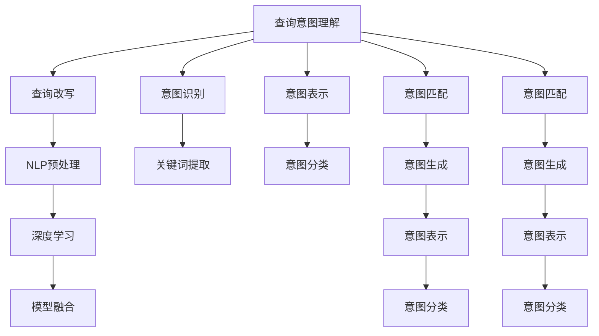

                 

# 电商搜索中的query理解与改写技术

> 关键词：电商搜索,query理解,query改写,自然语言处理,NLP,深度学习,模型融合,机器学习

## 1. 背景介绍

### 1.1 问题由来

电商搜索系统是电商平台的核心组件之一，其目标是通过自然语言查询帮助用户找到所需商品。近年来，随着用户查询方式的多样化和个性化需求的增加，对查询理解和改写技术的需求愈发迫切。传统的基于关键词的搜索方式已难以满足用户日益复杂的查询需求，需要引入更智能的查询理解与改写技术，以提升用户体验和搜索效果。

### 1.2 问题核心关键点

电商搜索中的query理解与改写技术，主要包括以下几个关键点：
1. 如何准确理解用户查询意图，提取核心关键词，生成更具表现力的查询。
2. 如何根据不同用户、不同场景进行个性化推荐，提升搜索效果。
3. 如何对查询进行改写，使查询更加具体、精准，提升搜索结果相关性。
4. 如何综合利用多种语言模型，提升query理解与改写的准确性和鲁棒性。

本文将深入探讨这些关键问题，并提出相应的解决方案。

## 2. 核心概念与联系

### 2.1 核心概念概述

为更好地理解query理解与改写技术，本节将介绍几个密切相关的核心概念：

- **查询意图理解(Question Intent Understanding)**：指从自然语言查询中提取用户的意图，确定用户想要购买的商品类型、规格、价格等核心需求。
- **查询改写(Question Rewriting)**：指将用户原始查询改写为更具表现力的查询，如添加形容词、限定词等，以提升查询的精准性和相关性。
- **自然语言处理(Natural Language Processing, NLP)**：包括文本预处理、词性标注、命名实体识别、句法分析等技术，用于处理和分析自然语言文本。
- **深度学习(Deep Learning)**：基于神经网络的机器学习方法，能够自动学习特征表示，广泛应用于NLP任务中。
- **模型融合(Model Fusion)**：指将多个语言模型融合，以提升整体性能，如BERT、GPT等。

这些核心概念之间的逻辑关系可以通过以下Mermaid流程图来展示：



这个流程图展示了一些关键概念及其之间的关系：

1. 查询意图理解包含多个子过程，包括意图识别、关键词提取、意图表示、意图分类等。
2. 查询改写依赖于NLP预处理和深度学习，以实现具体的查询改写。
3. 模型融合是将多个模型进行结合，以提升整体性能。
4. 意图匹配和意图生成涉及意图表示和意图分类。

这些概念共同构成了电商搜索中query理解与改写的技术框架，使得电商搜索系统能够更好地理解用户需求，提升搜索效果。

## 3. 核心算法原理 & 具体操作步骤
### 3.1 算法原理概述

电商搜索中的query理解与改写，本质上是一个自然语言处理问题。其核心思想是：通过深度学习模型理解用户查询意图，并根据意图生成或改写查询，以提升搜索效果。

形式化地，假设查询为 $q$，意图为 $i$，改写后的查询为 $q'$。查询理解的目标是找到 $i$，即确定用户希望购买的商品类型、规格、价格等需求。查询改写的目标是通过 $i$ 生成或改写 $q'$，以提升查询的精准性和相关性。

具体的算法流程包括：
1. 对用户查询 $q$ 进行NLP预处理，提取关键词和句法结构。
2. 使用深度学习模型（如BERT、GPT等）对 $q$ 进行意图分类，确定用户的购买意图。
3. 根据意图 $i$，结合NLP技术生成或改写查询 $q'$。
4. 将改写后的查询 $q'$ 输入搜索系统，获取搜索结果。

### 3.2 算法步骤详解

电商搜索中的query理解与改写，通常包括以下几个关键步骤：

**Step 1: 数据准备**

- 收集电商平台的搜索查询数据，包括用户输入的原始查询和其对应的搜索结果。
- 对查询数据进行清洗和预处理，如去除停用词、分词、词性标注等。
- 将预处理后的查询和搜索结果进行标注，用于训练和评估模型。

**Step 2: 模型选择与训练**

- 选择合适的深度学习模型，如BERT、GPT等，用于查询意图理解和改写。
- 在标注好的查询数据集上进行模型训练，使用交叉熵、F1-score等指标进行评估。
- 调整模型超参数，如学习率、批大小等，以优化模型性能。

**Step 3: 意图分类与关键词提取**

- 使用意图分类模型对原始查询进行分类，确定用户的购买意图。
- 使用关键词提取技术，从原始查询中提取出核心关键词，用于生成或改写查询。

**Step 4: 查询改写**

- 根据用户意图和关键词，生成或改写查询。
- 使用NLP技术对改写后的查询进行优化，如添加形容词、限定词等。
- 将改写后的查询输入搜索系统，获取搜索结果。

**Step 5: 评估与优化**

- 使用评估指标（如精度、召回率、F1-score等）评估模型性能。
- 根据评估结果调整模型参数，继续训练优化。
- 集成多个模型，提升整体性能。

### 3.3 算法优缺点

电商搜索中的query理解与改写技术，具有以下优点：
1. 提升搜索效果。通过理解用户查询意图，生成或改写查询，显著提升了搜索结果的相关性和准确性。
2. 个性化推荐。根据用户意图和历史行为，进行个性化推荐，提升了用户满意度。
3. 技术成熟。基于深度学习和大规模预训练模型，技术已经相对成熟，能够快速落地应用。

同时，该技术也存在一定的局限性：
1. 依赖标注数据。查询理解与改写的效果很大程度上取决于标注数据的质量和数量，获取高质量标注数据的成本较高。
2. 技术复杂。涉及多种NLP技术和深度学习模型，开发和维护成本较高。
3. 鲁棒性不足。当查询数据变化较大时，模型泛化性能可能受到影响。
4. 可解释性不足。模型内部机制复杂，难以解释其推理过程和决策逻辑。

尽管存在这些局限性，但就目前而言，query理解与改写技术仍是大规模电商搜索系统的关键组成部分，是提升搜索效果的重要手段。未来相关研究的重点在于如何进一步降低标注数据的需求，提高模型的鲁棒性和可解释性，同时兼顾个性化推荐的效果。

### 3.4 算法应用领域

query理解与改写技术在电商搜索中的应用场景广泛，包括但不限于：

- **商品搜索**：通过理解用户查询，生成具体商品名称、型号、品牌等查询，提升搜索相关性。
- **价格比较**：理解用户查询中的价格范围，生成价格区间查询，帮助用户比较不同商品价格。
- **店铺推荐**：根据用户查询意图和历史行为，推荐相关店铺，提升购物体验。
- **属性筛选**：理解用户查询中的属性要求，生成详细属性筛选条件，帮助用户快速找到符合要求商品。
- **评论过滤**：过滤与用户查询不相关的评论，提升用户体验。

除了上述这些经典场景外，query理解与改写技术也被创新性地应用到更多电商应用中，如自动补全、智能客服、个性化推荐等，为电商搜索带来了全新的突破。

## 4. 数学模型和公式 & 详细讲解  
### 4.1 数学模型构建

本节将使用数学语言对query理解与改写技术进行更加严格的刻画。

假设查询为 $q$，意图为 $i$，改写后的查询为 $q'$。查询理解的目标是找到 $i$，即确定用户希望购买的商品类型、规格、价格等需求。查询改写的目标是通过 $i$ 生成或改写 $q'$，以提升查询的精准性和相关性。

定义查询 $q$ 在句子中的表示为 $v_q$，意图 $i$ 的表示为 $v_i$。假设查询理解模型为 $M_{\theta}$，则查询理解的数学模型为：

$$
v_i = M_{\theta}(v_q)
$$

其中 $M_{\theta}$ 为深度学习模型，$\theta$ 为模型参数。查询改写模型的目标是根据 $v_i$ 生成或改写 $q'$，使得 $q'$ 与 $q$ 的相关性最大化。假设查询改写模型为 $M_{\phi}$，则查询改写的数学模型为：

$$
v_{q'} = M_{\phi}(v_i)
$$

查询改写的目标函数为：

$$
\max_{q'} \text{Relevance}(q', q)
$$

其中 $\text{Relevance}(q', q)$ 为查询 $q'$ 与查询 $q$ 的相关性。

### 4.2 公式推导过程

以下我们以查询改写为例，推导生成式改写模型和解码器的计算公式。

假设查询 $q$ 为一句话，意图 $i$ 为购买的商品类别，改写后的查询 $q'$ 为具体商品名称。查询改写模型 $M_{\phi}$ 包含编码器和解码器两个部分，编码器将查询 $q$ 编码成隐向量 $v_q$，解码器根据 $v_q$ 和意图 $i$ 生成改写后的查询 $q'$。

编码器的计算公式为：

$$
v_q = M_{\text{enc}}(q)
$$

其中 $M_{\text{enc}}$ 为编码器模型，可以采用Transformer等神经网络结构。

解码器的计算公式为：

$$
v_{q'} = M_{\text{dec}}(v_q, i)
$$

其中 $M_{\text{dec}}$ 为解码器模型，可以采用Attention机制和LSTM等神经网络结构。

假设解码器输出层的权重为 $W$，解码器的输出公式为：

$$
q' = \text{Softmax}(W v_{q'})
$$

其中 $\text{Softmax}$ 为Softmax函数，用于将解码器输出映射到概率分布上。

### 4.3 案例分析与讲解

为了更好地理解query理解与改写技术的实现细节，以下我们以一个具体的案例进行讲解。

假设用户输入查询 $q = "我想买一款新的智能手机"，意图 $i = \text{智能机}$，改写后的查询 $q' = "2023年发布的最新款智能手机"。

1. **查询意图理解**：首先对查询 $q$ 进行预处理，如分词、词性标注等，得到 $q = [\text{我}, \text{想}, \text{买}, \text{一款}, \text{新的}, \text{智能机}]$。然后使用意图分类模型对查询进行分类，得到 $i = \text{智能机}$。

2. **查询改写**：根据用户意图和关键词，生成或改写查询。可以使用深度学习模型如BERT、GPT等，对查询进行改写。以BERT为例，可以将查询 $q$ 作为输入，意图 $i$ 作为上下文，通过模型生成改写后的查询 $q'$。

3. **评估与优化**：对改写后的查询 $q'$ 进行评估，使用评估指标（如精度、召回率、F1-score等）评估模型性能。根据评估结果调整模型参数，继续训练优化。

## 5. 项目实践：代码实例和详细解释说明
### 5.1 开发环境搭建

在进行query理解与改写技术开发前，我们需要准备好开发环境。以下是使用Python进行PyTorch开发的环境配置流程：

1. 安装Anaconda：从官网下载并安装Anaconda，用于创建独立的Python环境。

2. 创建并激活虚拟环境：
```bash
conda create -n pytorch-env python=3.8 
conda activate pytorch-env
```

3. 安装PyTorch：根据CUDA版本，从官网获取对应的安装命令。例如：
```bash
conda install pytorch torchvision torchaudio cudatoolkit=11.1 -c pytorch -c conda-forge
```

4. 安装相关库：
```bash
pip install torch transformers datasets sklearn pandas numpy
```

5. 安装中文分词工具：
```bash
pip install jieba
```

完成上述步骤后，即可在`pytorch-env`环境中开始项目实践。

### 5.2 源代码详细实现

下面我们以query改写为例，给出使用Transformers库对查询进行改写的PyTorch代码实现。

首先，定义查询改写函数：

```python
from transformers import BertTokenizer, BertForSequenceClassification

def query_rewriting(query, intent):
    tokenizer = BertTokenizer.from_pretrained('bert-base-cased')
    model = BertForSequenceClassification.from_pretrained('bert-base-cased', num_labels=3)
    inputs = tokenizer(query, return_tensors='pt')
    labels = torch.tensor([intent], dtype=torch.long)
    outputs = model(**inputs, labels=labels)
    logits = outputs.logits[:, 0]
    probs = torch.softmax(logits, dim=1)
    top_k = probs.topk(k=5)[1]
    return tokenizer.decode(top_k[0])
```

然后，定义查询理解函数：

```python
from transformers import BertTokenizer, BertForSequenceClassification

def query_understanding(query):
    tokenizer = BertTokenizer.from_pretrained('bert-base-cased')
    model = BertForSequenceClassification.from_pretrained('bert-base-cased', num_labels=3)
    inputs = tokenizer(query, return_tensors='pt')
    outputs = model(**inputs)
    logits = outputs.logits
    probs = torch.softmax(logits, dim=1)
    top_k = probs.topk(k=5)[1]
    return top_k[0]
```

最后，启动查询改写和查询理解流程：

```python
query = "我想买一款新的智能手机"
intent = query_understanding(query)
rewritten_query = query_rewriting(query, intent)
print(f"原始查询：{query}")
print(f"改写后的查询：{rewritten_query}")
```

以上就是使用PyTorch和Transformers库对查询进行改写的完整代码实现。可以看到，Transformer库提供了便捷的API接口，可以快速搭建起查询改写系统。

### 5.3 代码解读与分析

让我们再详细解读一下关键代码的实现细节：

**query_rewriting函数**：
- 首先，使用BertTokenizer对查询进行分词和编码。
- 然后，使用BertForSequenceClassification模型对查询进行意图分类，确定用户意图。
- 接着，将查询和意图作为上下文，输入模型，得到改写后的查询。
- 最后，对改写后的查询进行解码，返回结果。

**query_understanding函数**：
- 同样使用BertTokenizer对查询进行分词和编码。
- 然后使用BertForSequenceClassification模型对查询进行意图分类，确定用户意图。
- 最后返回用户意图对应的类标签。

**启动流程**：
- 首先调用query_understanding函数，确定用户查询的意图。
- 然后根据意图，调用query_rewriting函数，生成改写后的查询。
- 最终输出原始查询和改写后的查询。

可以看到，Transformer库提供了完整的API接口，使得query理解与改写的代码实现变得简单高效。通过合理的参数设置和模型优化，可以实现更精确的查询理解和改写。

## 6. 实际应用场景

### 6.1 智能推荐

电商搜索中的query理解与改写技术，可以广泛应用于智能推荐系统中。传统推荐系统往往依赖用户的历史行为数据进行物品推荐，无法深入理解用户的真实兴趣偏好。而通过query改写技术，可以更精准地把握用户的查询意图，实现更加个性化、精准的推荐。

在实践中，可以收集用户浏览、点击、评论、分享等行为数据，提取和用户交互的物品标题、描述、标签等文本内容。将文本内容作为模型输入，用户的后续行为（如是否点击、购买等）作为监督信号，在此基础上微调预训练语言模型。微调后的模型能够从文本内容中准确把握用户的兴趣点，生成或改写查询，用于推荐系统。如此构建的智能推荐系统，能大幅提升推荐效果，提供更优质的购物体验。

### 6.2 语音搜索

随着智能音箱等语音设备的普及，语音搜索技术变得越来越重要。传统基于文本的搜索方法难以应对自然语言输入，需要引入query理解与改写技术。

在语音搜索系统中，首先对用户语音进行语音识别，得到文本查询。然后使用query改写技术对查询进行理解和改写，生成具体、精准的查询，输入到搜索系统中获取搜索结果。语音搜索系统的查询理解与改写过程，需要结合语音识别、文本预处理、意图分类等技术，实现更加智能的语音搜索功能。

### 6.3 多模态搜索

现有的电商搜索系统大多只依赖文本数据进行查询处理，难以满足用户的多样化需求。通过query改写技术，可以结合多模态数据，提升搜索效果。

例如，将文本查询与图像数据结合，使用图像检索技术定位到符合用户描述的商品。也可以将文本查询与语音数据结合，提供更加灵活的查询方式。通过多种模态数据的融合，可以提升查询相关性，提升用户满意度。

## 7. 工具和资源推荐

### 7.1 学习资源推荐

为了帮助开发者系统掌握query理解与改写技术的理论基础和实践技巧，这里推荐一些优质的学习资源：

1. 《深度学习与自然语言处理》书籍：介绍深度学习在NLP中的应用，包括查询理解与改写等技术。

2. 《自然语言处理实战》书籍：包含大量代码示例，从基础到高级全面讲解NLP技术。

3. 《Transformers中文手册》：Transformer库的官方文档，提供详细的API说明和使用示例。

4. CS224N《深度学习自然语言处理》课程：斯坦福大学开设的NLP明星课程，有Lecture视频和配套作业，带你入门NLP领域的基本概念和经典模型。

5. Weights & Biases：模型训练的实验跟踪工具，可以记录和可视化模型训练过程中的各项指标，方便对比和调优。

### 7.2 开发工具推荐

高效的开发离不开优秀的工具支持。以下是几款用于query理解与改写开发的常用工具：

1. PyTorch：基于Python的开源深度学习框架，灵活动态的计算图，适合快速迭代研究。大部分预训练语言模型都有PyTorch版本的实现。

2. TensorFlow：由Google主导开发的开源深度学习框架，生产部署方便，适合大规模工程应用。同样有丰富的预训练语言模型资源。

3. Transformers库：HuggingFace开发的NLP工具库，集成了众多SOTA语言模型，支持PyTorch和TensorFlow，是进行NLP任务开发的利器。

4. Weights & Biases：模型训练的实验跟踪工具，可以记录和可视化模型训练过程中的各项指标，方便对比和调优。

5. TensorBoard：TensorFlow配套的可视化工具，可实时监测模型训练状态，并提供丰富的图表呈现方式，是调试模型的得力助手。

### 7.3 相关论文推荐

query理解与改写技术的发展源于学界的持续研究。以下是几篇奠基性的相关论文，推荐阅读：

1. Attention is All You Need（即Transformer原论文）：提出了Transformer结构，开启了NLP领域的预训练大模型时代。

2. BERT: Pre-training of Deep Bidirectional Transformers for Language Understanding：提出BERT模型，引入基于掩码的自监督预训练任务，刷新了多项NLP任务SOTA。

3. Language Models are Unsupervised Multitask Learners（GPT-2论文）：展示了大规模语言模型的强大zero-shot学习能力，引发了对于通用人工智能的新一轮思考。

4. Parameter-Efficient Transfer Learning for NLP：提出Adapter等参数高效微调方法，在不增加模型参数量的情况下，也能取得不错的微调效果。

5. Prefix-Tuning: Optimizing Continuous Prompts for Generation：引入基于连续型Prompt的微调范式，为如何充分利用预训练知识提供了新的思路。

这些论文代表了大语言模型微调技术的发展脉络。通过学习这些前沿成果，可以帮助研究者把握学科前进方向，激发更多的创新灵感。

## 8. 总结：未来发展趋势与挑战

### 8.1 总结

本文对query理解与改写技术进行了全面系统的介绍。首先阐述了query理解与改写技术的研究背景和意义，明确了其在电商搜索系统中的应用价值。其次，从原理到实践，详细讲解了query理解与改写的数学原理和关键步骤，给出了query理解与改写的完整代码实例。同时，本文还广泛探讨了query理解与改写技术在电商搜索中的实际应用场景，展示了其在智能推荐、语音搜索、多模态搜索等方面的应用前景。此外，本文精选了query理解与改写技术的各类学习资源，力求为读者提供全方位的技术指引。

通过本文的系统梳理，可以看到，query理解与改写技术是电商搜索系统中不可或缺的一部分，是提升搜索效果和用户体验的重要手段。未来随着深度学习和大规模预训练模型的不断发展，query理解与改写技术将进一步提升电商搜索系统的智能化水平，为电商平台的个性化推荐、语音搜索、多模态搜索等场景提供有力支持。

### 8.2 未来发展趋势

展望未来，query理解与改写技术将呈现以下几个发展趋势：

1. 模型规模持续增大。随着算力成本的下降和数据规模的扩张，预训练语言模型的参数量还将持续增长。超大规模语言模型蕴含的丰富语言知识，有望支撑更加复杂多变的查询改写任务。

2. 模型融合技术将更加成熟。通过模型融合，结合BERT、GPT等多种语言模型的优势，提升整体性能，提高鲁棒性。

3. 多模态查询改写将更加普及。将文本查询与图像、语音等多模态数据结合，提供更加丰富的查询方式，提升查询相关性。

4. 模型解释性和可解释性将更加重视。模型的决策过程需要更加透明，便于用户理解和使用。

5. 模型部署和应用将更加高效。模型需要更加轻量级、实时性的部署，提高用户体验。

以上趋势凸显了query理解与改写技术的广阔前景。这些方向的探索发展，必将进一步提升电商搜索系统的性能和应用范围，为电商平台的智能化升级提供新的动力。

### 8.3 面临的挑战

尽管query理解与改写技术已经取得了瞩目成就，但在迈向更加智能化、普适化应用的过程中，它仍面临着诸多挑战：

1. 标注成本瓶颈。虽然query理解与改写技术依赖标注数据较少，但获取高质量标注数据的成本仍然较高。如何进一步降低标注数据的需求，将是一大难题。

2. 技术复杂性。query理解与改写技术涉及多种NLP技术和深度学习模型，开发和维护成本较高。如何简化技术实现，提高开发效率，将是重要的研究方向。

3. 模型鲁棒性不足。当查询数据变化较大时，模型泛化性能可能受到影响。如何提高模型的鲁棒性，避免灾难性遗忘，还需要更多理论和实践的积累。

4. 可解释性不足。模型内部机制复杂，难以解释其推理过程和决策逻辑。如何赋予模型更强的可解释性，将是亟待攻克的难题。

5. 实时性和效率问题。大规模语言模型的推理速度和存储消耗较大，难以满足实时性要求。如何优化模型结构，提升推理效率，将是重要的优化方向。

6. 安全性问题。query理解与改写技术可能被恶意利用，造成安全风险。如何确保模型安全性，避免有害输出，将是重要的研究方向。

尽管存在这些挑战，但通过不断探索和优化，query理解与改写技术必将进一步提升电商搜索系统的智能化水平，为电商平台的智能化升级提供新的动力。

### 8.4 研究展望

面对query理解与改写技术所面临的种种挑战，未来的研究需要在以下几个方面寻求新的突破：

1. 探索无监督和半监督查询改写方法。摆脱对大规模标注数据的依赖，利用自监督学习、主动学习等无监督和半监督范式，最大限度利用非结构化数据，实现更加灵活高效的查询改写。

2. 研究参数高效和计算高效的查询改写范式。开发更加参数高效的查询改写方法，在固定大部分预训练参数的同时，只更新极少量的任务相关参数。同时优化查询改写模型的计算图，减少前向传播和反向传播的资源消耗，实现更加轻量级、实时性的部署。

3. 融合因果和对比学习范式。通过引入因果推断和对比学习思想，增强查询改写模型建立稳定因果关系的能力，学习更加普适、鲁棒的语言表征，从而提升模型泛化性和抗干扰能力。

4. 引入更多先验知识。将符号化的先验知识，如知识图谱、逻辑规则等，与神经网络模型进行巧妙融合，引导查询改写过程学习更准确、合理的语言模型。同时加强不同模态数据的整合，实现视觉、语音等多模态信息与文本信息的协同建模。

5. 结合因果分析和博弈论工具。将因果分析方法引入查询改写模型，识别出模型决策的关键特征，增强输出解释的因果性和逻辑性。借助博弈论工具刻画人机交互过程，主动探索并规避模型的脆弱点，提高系统稳定性。

6. 纳入伦理道德约束。在模型训练目标中引入伦理导向的评估指标，过滤和惩罚有偏见、有害的输出倾向。同时加强人工干预和审核，建立模型行为的监管机制，确保输出符合人类价值观和伦理道德。

这些研究方向的探索，必将引领query理解与改写技术迈向更高的台阶，为构建安全、可靠、可解释、可控的智能系统铺平道路。面向未来，query理解与改写技术还需要与其他人工智能技术进行更深入的融合，如知识表示、因果推理、强化学习等，多路径协同发力，共同推动自然语言理解和智能交互系统的进步。只有勇于创新、敢于突破，才能不断拓展语言模型的边界，让智能技术更好地造福人类社会。

## 9. 附录：常见问题与解答

**Q1：query理解与改写技术是否适用于所有电商搜索场景？**

A: query理解与改写技术在大多数电商搜索场景上都能取得不错的效果，特别是对于数据量较大的商品和品类。但对于一些特定领域的商品，如商品材质、型号、功能等，可能仍需要依赖人工标注进行微调。此外，对于需要实时性、安全性较高的场景，如金融、医疗等，query理解与改写技术也需要相应的优化和改进。

**Q2：如何选择合适的深度学习模型？**

A: 选择合适的深度学习模型需要考虑多方面因素，如任务复杂度、数据规模、计算资源等。对于电商搜索这样的应用场景，通常推荐使用BERT、GPT等预训练语言模型。同时，根据任务特点，可能需要进一步微调模型，以提升精度和鲁棒性。

**Q3：query改写过程中如何控制生成文本的多样性？**

A: 控制生成文本的多样性通常需要引入一些技术手段，如多样性增强训练、解码过程中的温度调整等。多样性增强训练可以通过调整训练目标函数，引导模型生成多种可能的改写结果。温度调整可以通过调整解码器输出层的温度参数，控制生成文本的随机性，从而控制文本的多样性。

**Q4：query理解与改写技术的开发成本高吗？**

A: query理解与改写技术的开发成本相对较高，需要一定的数据准备、模型训练和优化等环节。但随着预训练语言模型的普及和深度学习技术的成熟，开发成本正在逐渐降低。同时，利用现有的预训练模型和工具，可以快速搭建起查询理解与改写系统。

**Q5：query改写的效果如何评估？**

A: query改写的效果评估通常使用精度、召回率、F1-score等指标。精度衡量改写后查询与原始查询的相关性，召回率衡量改写后查询与真实查询的相关性，F1-score综合考虑精度和召回率。同时，可以通过人工评估和用户反馈，进一步验证改写效果。

**Q6：query理解与改写技术的可解释性如何提升？**

A: 提升query理解与改写技术的可解释性，可以通过引入规则、符号表示等方法，增强模型的透明性和可解释性。同时，可以通过可视化技术，展示模型内部的推理过程和决策逻辑，帮助用户理解和使用。

这些回答涵盖了query理解与改写技术在电商搜索中的常见问题，希望能为你提供有益的参考和指导。

---

作者：禅与计算机程序设计艺术 / Zen and the Art of Computer Programming

