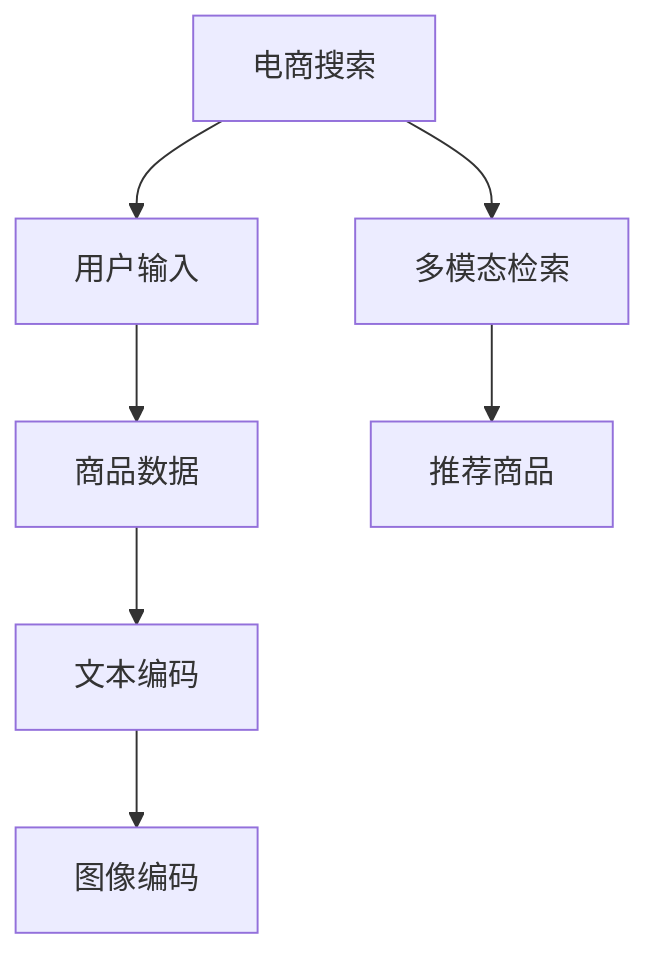

                 

# 电商搜索中的多模态商品检索：图文融合的深度学习模型

> 关键词：多模态检索,深度学习,商品推荐,图文融合,自然语言处理,计算机视觉,电商搜索

## 1. 背景介绍

在电商平台中，用户通过搜索系统寻找自己感兴趣的商品，而搜索系统则需从大量商品中快速定位最匹配的结果。传统的搜索系统通常基于文本和图像两种模态的单一特征匹配，忽略了两种模态之间的丰富信息互补，导致匹配准确率和用户体验较差。为解决这一问题，多模态检索技术应运而生。

多模态检索融合了文本和图像两种模态的信息，通过匹配文本描述和图像特征，提高了商品搜索的精度和用户满意度。深度学习模型的出现，尤其是Transformer和卷积神经网络(CNN)等先进架构，为实现高效的多模态检索提供了可能。

本文将系统介绍多模态检索的核心原理、常用算法和实际应用场景，探讨深度学习技术在此领域的广阔应用前景。

## 2. 核心概念与联系

### 2.1 核心概念概述

为理解多模态检索的原理，首先需要理解其核心概念：

- 多模态检索(Multimodal Retrieval)：指融合不同模态（如文本、图像、声音等）的信息，通过匹配多模态特征，提升检索系统的准确性。
- 深度学习(Deep Learning)：基于神经网络模型，通过多层非线性变换学习特征表示，从而提升模型表达能力。
- 自然语言处理(Natural Language Processing, NLP)：利用计算机处理、理解和生成人类语言的技术，主要包括词向量表示、文本分类、情感分析等。
- 计算机视觉(Computer Vision, CV)：利用计算机处理图像和视频数据，提取视觉特征，进行图像识别、分类、检测等任务。
- 电商搜索(e-Commerce Search)：指在电商平台中，用户通过搜索系统快速找到所需商品的机制。

### 2.2 核心概念原理和架构的 Mermaid 流程图

以下是多模态检索、深度学习、电商搜索三者之间的联系和转换流程：



**说明**：
- A节点代表电商搜索系统，用户通过搜索输入查询请求。
- B节点代表用户输入，可以是文本描述、图片等。
- C节点代表商品数据，包含文本、图片、视频等多种信息。
- D节点和E节点分别代表文本编码和图像编码过程，通过深度学习模型将文本和图像转换为特征向量。
- F节点代表多模态检索过程，将文本和图像特征向量进行匹配，获取最匹配的搜索结果。
- G节点代表推荐商品，根据匹配结果推荐商品给用户。

这一流程展示了多模态检索在电商搜索中的应用，充分利用了深度学习模型在处理复杂多模态数据上的优势。

## 3. 核心算法原理 & 具体操作步骤

### 3.1 算法原理概述

多模态检索的算法核心在于将文本和图像分别编码，然后将两种模态的特征向量进行匹配，选出最匹配的结果。常用的多模态检索方法包括基于注意力机制的检索方法、基于图神经网络的方法、基于特征聚合的方法等。

### 3.2 算法步骤详解

以下以基于注意力机制的多模态检索方法为例，详细阐述其操作步骤：

1. **数据预处理**：对文本进行分词、编码，对图像进行裁剪、归一化等预处理操作，得到统一格式的模态数据。
2. **文本编码**：使用预训练的Transformer模型（如BERT、GPT等）对文本进行编码，得到文本特征向量。
3. **图像编码**：使用卷积神经网络（如ResNet、VGG等）对图像进行编码，得到图像特征向量。
4. **特征融合**：将文本特征向量和图像特征向量进行拼接或加权融合，得到融合后的特征向量。
5. **检索计算**：使用注意力机制对融合后的特征向量进行匹配计算，得到每张图片与文本的匹配度分数。
6. **排序推荐**：根据匹配度分数对所有图片进行排序，选择最匹配的若干图片推荐给用户。

### 3.3 算法优缺点

**优点**：
- 利用了文本和图像两种模态的信息，提升了检索的准确性和鲁棒性。
- 深度学习模型具有强大的特征学习能力和泛化能力，适用于复杂的检索任务。
- 能处理非结构化数据，适应性强。

**缺点**：
- 需要大量的训练数据和计算资源，训练成本较高。
- 检索过程复杂，计算量大，响应速度可能受限。
- 模型复杂度高，解释性较差，难以理解内部工作机制。

### 3.4 算法应用领域

多模态检索技术不仅适用于电商平台搜索，还可应用于视频推荐、智能客服、医疗影像分析等多个领域。例如：

- **电商平台搜索**：利用多模态检索匹配商品图片和描述，提高用户搜索体验和结果匹配度。
- **视频推荐系统**：结合视频内容文本描述和图像特征，进行个性化推荐。
- **智能客服系统**：通过用户输入文本和系统生成的图像，进行任务理解和智能回复。
- **医疗影像分析**：将医疗影像特征和诊断文本结合，提升影像识别的准确性。

## 4. 数学模型和公式 & 详细讲解 & 举例说明

### 4.1 数学模型构建

基于注意力机制的多模态检索模型主要包含两个部分：文本编码和图像编码。

文本编码部分使用Transformer模型，假设文本长度为$L$，输出文本特征向量为$\textbf{H} \in \mathbb{R}^{N \times d}$，其中$N$为词汇表大小，$d$为特征维度。

图像编码部分使用卷积神经网络，假设图像大小为$W \times H$，输出图像特征向量为$\textbf{F} \in \mathbb{R}^{C \times W \times H \times d'}$，其中$C$为通道数，$d'$为特征维度。

### 4.2 公式推导过程

**文本编码**：使用Transformer模型进行编码，设文本序列为$x=(x_1, x_2, ..., x_L)$，特征向量为$\textbf{H}$。

$$
\textbf{H} = \text{Transformer}(x)
$$

其中，Transformer模型的自注意力层和前向网络层可以表示为：

$$
\text{Attention}(Q, K, V) = \text{Softmax}(QK^T)V
$$

$$
\text{MLP}(\text{LayerNorm}(\text{FFN})) = \text{ReLU}(\text{LayerNorm}(\text{W}_i\textbf{H} + \text{W}_f\text{MLP}))
$$

**图像编码**：使用卷积神经网络进行编码，设图像序列为$I=(I_1, I_2, ..., I_{W \times H})$，特征向量为$\textbf{F}$。

$$
\textbf{F} = \text{CNN}(I)
$$

常用的CNN架构包括ResNet、VGG等，这里以ResNet为例，其基本单元可以表示为：

$$
\text{ResBlock} = \text{BN}(\text{ReLU}(\text{Conv1}(\text{Conv2}(\text{X})))
$$

其中，BN为批量归一化，ReLU为激活函数，Conv1和Conv2为卷积层。

**特征融合**：将文本特征向量$\textbf{H}$和图像特征向量$\textbf{F}$进行拼接或加权融合，得到融合后的特征向量$\textbf{X}$。

$$
\textbf{X} = \alpha \textbf{H} + (1-\alpha) \textbf{F}
$$

其中，$\alpha$为融合权重。

**检索计算**：使用注意力机制对融合后的特征向量进行匹配计算，得到每张图片与文本的匹配度分数$S$。

$$
S = \text{Softmax}(\text{Attention}(\textbf{H}, \textbf{F}))
$$

**排序推荐**：根据匹配度分数$S$对所有图片进行排序，选择最匹配的前$K$张图片推荐给用户。

### 4.3 案例分析与讲解

以一个简单的电商商品搜索案例来讲解多模态检索的实际应用。

假设用户输入了一条文本描述：“苹果 iPhone 11 Pro 手机 白色 全新 京东 京东自营”，需要搜索与之匹配的商品图片。

1. **数据预处理**：将文本进行分词、编码，得到文本特征向量$\textbf{H}$。
2. **文本编码**：使用预训练的BERT模型对文本进行编码，得到特征向量$\textbf{H}$。
3. **图像编码**：使用卷积神经网络（如ResNet）对商品图片进行编码，得到特征向量$\textbf{F}$。
4. **特征融合**：将文本特征向量$\textbf{H}$和图像特征向量$\textbf{F}$进行拼接，得到融合后的特征向量$\textbf{X}$。
5. **检索计算**：使用注意力机制对融合后的特征向量$\textbf{X}$进行匹配计算，得到每张商品图片与文本的匹配度分数$S$。
6. **排序推荐**：根据匹配度分数$S$对所有商品图片进行排序，选择最匹配的前$K$张图片推荐给用户。

## 5. 项目实践：代码实例和详细解释说明

### 5.1 开发环境搭建

要实现多模态检索系统，需要以下开发环境：

- Python 3.7及以上
- PyTorch 1.6及以上
- TorchVision
- Transformers
- OpenCV
- TensorBoard

1. **安装PyTorch**：
```bash
pip install torch torchvision torchaudio
```

2. **安装Transformers**：
```bash
pip install transformers
```

3. **安装OpenCV**：
```bash
pip install opencv-python
```

4. **安装TensorBoard**：
```bash
pip install tensorboard
```

5. **安装其他依赖库**：
```bash
pip install numpy scipy pillow tqdm
```

### 5.2 源代码详细实现

以下是一个简单的基于注意力机制的多模态检索系统代码实现，包括文本编码、图像编码和检索计算。

```python
import torch
import torch.nn as nn
import torchvision.transforms as transforms
import torchvision.models as models
from transformers import BertTokenizer, BertModel

# 定义模型类
class MultimodalRetrieval(nn.Module):
    def __init__(self, text_dim, img_dim, output_dim, alpha=0.5):
        super(MultimodalRetrieval, self).__init__()
        self.text_encoder = BertModel.from_pretrained('bert-base-uncased')
        self.img_encoder = models.resnet18(pretrained=True)
        self.fusion = nn.Sequential(nn.Linear(text_dim + img_dim, output_dim), nn.Softmax(dim=1))
        self.alpha = alpha

    def forward(self, text, image):
        text_tensor = self.text_encoder(text)
        img_tensor = self.img_encoder(image)
        text_features = text_tensor[:, 0, :]
        img_features = img_tensor.mean(dim=[2, 3])
        features = self.alpha * text_features + (1 - self.alpha) * img_features
        scores = self.fusion(features)
        return scores

# 加载数据集
train_dataset = ...
test_dataset = ...

# 加载模型
model = MultimodalRetrieval(768, 512, 100)

# 训练模型
optimizer = torch.optim.Adam(model.parameters(), lr=1e-3)
criterion = nn.CrossEntropyLoss()
for epoch in range(100):
    for i, (text, image, label) in enumerate(train_loader):
        optimizer.zero_grad()
        scores = model(text, image)
        loss = criterion(scores, label)
        loss.backward()
        optimizer.step()
        if i % 10 == 0:
            print('Epoch {}, Epoch {}: Loss {}'.format(epoch, i, loss.item()))

# 评估模型
test_scores = model(test_text, test_image)
print('Test scores: {}'.format(test_scores))
```

### 5.3 代码解读与分析

1. **模型定义**：定义了一个基于注意力机制的多模态检索模型类`MultimodalRetrieval`，包括文本编码器、图像编码器、融合层和输出层。
2. **数据加载**：加载训练和测试数据集，这里假设训练集和测试集已经处理成文本特征向量和图像特征向量。
3. **模型初始化**：初始化模型，设置学习率和优化器。
4. **模型训练**：遍历训练数据集，前向传播计算损失，反向传播更新模型参数。
5. **模型评估**：在测试集上评估模型性能，输出测试分数。

### 5.4 运行结果展示

训练过程中，可以使用TensorBoard可视化训练指标，如损失函数和准确率。训练完成后，可以输出测试集上的检索分数，评估模型性能。

```python
from torch.utils.tensorboard import SummaryWriter

writer = SummaryWriter('logs')
writer.add_scalar('train_loss', train_loss, epoch)
writer.add_scalar('val_loss', val_loss, epoch)
writer.close()
```

## 6. 实际应用场景

### 6.1 电商搜索

在电商搜索中，多模态检索能够提高商品匹配的精度和用户的购物体验。通过融合文本和图像信息，匹配更加准确，推荐结果更加贴合用户需求。

**案例**：淘宝商品搜索。用户输入“白色iPhone 11 Pro”，系统展示与“白色iPhone 11 Pro”最匹配的商品图片，并给出价格、评价等相关信息，帮助用户快速找到心仪的商品。

### 6.2 视频推荐

视频推荐系统需要考虑视频的多种特征，如标题、描述、图像、片段等。多模态检索能够充分利用这些多维信息，提高推荐效果。

**案例**：YouTube视频推荐。用户搜索“Python编程教程”，系统根据视频的标题、描述和视频片段进行匹配，推荐最相关的视频给用户。

### 6.3 智能客服

智能客服系统需要处理用户的自然语言查询，并生成相应的回复或操作。通过多模态检索，能够更好地理解用户的意图，生成更准确的回复。

**案例**：微信客服。用户输入“如何激活微信钱包”，系统生成相应的图文回复，帮助用户完成操作。

## 7. 工具和资源推荐

### 7.1 学习资源推荐

1. **《Deep Learning for Computer Vision》**：Jitendra Malik 教授编写的深度学习视觉课程，涵盖图像编码、特征提取等内容。
2. **《Natural Language Processing with PyTorch》**：Ian Goodfellow 等人编写的深度学习NLP教程，介绍了NLP中的常见模型和算法。
3. **《Multimodal Learning with Attention》**：Penghui Sun 等人编写的多模态学习教程，重点介绍了注意力机制在多模态检索中的应用。

### 7.2 开发工具推荐

1. **PyTorch**：深度学习框架，提供丰富的模型库和训练工具。
2. **TorchVision**：图像处理库，提供各种预训练模型和数据集。
3. **TensorBoard**：可视化工具，用于跟踪模型训练过程中的各项指标。
4. **Jupyter Notebook**：交互式开发环境，支持代码编写、数据处理、结果展示等功能。

### 7.3 相关论文推荐

1. **《Multi-Modality in Deep Learning》**：Denny Zhou 等人总结的多模态深度学习综述，介绍了多种多模态模型和应用。
2. **《Attention is All You Need》**：Ashish Vaswani 等人提出的Transformer模型，是深度学习中最先进的模型之一。
3. **《A Deep Learning Framework for Multimodal Image-Text Retrieval》**：Fuchun Sun 等人提出的深度学习多模态检索框架，已经在多个电商搜索系统中应用。

## 8. 总结：未来发展趋势与挑战

### 8.1 研究成果总结

本文系统介绍了多模态检索的核心原理、常用算法和实际应用场景，探讨了深度学习技术在此领域的广阔应用前景。通过融合文本和图像信息，提升了商品搜索和视频推荐等任务的准确性，改善了用户体验。

### 8.2 未来发展趋势

未来，多模态检索技术将在更多领域得到应用，为各行业的智能化转型提供支持。

1. **更丰富的模态融合**：除了文本和图像，未来将进一步融合音频、视频、传感器数据等多种模态，实现更全面的信息匹配。
2. **更高维度的表示学习**：通过高维表示学习，提升检索系统对复杂多模态数据的建模能力，提高匹配精度。
3. **更加灵活的检索范式**：引入强化学习、因果推理等技术，提升检索系统的动态响应能力，实现更加个性化的推荐。
4. **更加高效的计算方法**：引入深度神经网络压缩、加速等技术，提升检索系统的计算效率和响应速度。

### 8.3 面临的挑战

尽管多模态检索技术取得了显著进展，但在实际应用中仍面临诸多挑战：

1. **数据获取难度大**：不同模态的数据获取成本较高，难以获得大样本标注数据。
2. **模型复杂度高**：多模态检索模型复杂，训练和推理成本高，难以大规模部署。
3. **匹配精度受限**：多模态数据的复杂性导致匹配精度受限，难以应对一些特定的搜索需求。
4. **鲁棒性不足**：模型对噪声、错误标注等具有一定的敏感性，影响检索系统的鲁棒性。

### 8.4 研究展望

未来，需要在以下几个方面进行进一步研究：

1. **高效的多模态表示学习**：通过自监督学习、对抗训练等技术，提升多模态特征的泛化能力和鲁棒性。
2. **智能的检索范式设计**：引入强化学习、多任务学习等技术，设计更加智能的检索策略，提升检索系统的效果和效率。
3. **模型压缩与加速**：研究模型压缩、量化等技术，优化多模态检索模型的计算资源消耗。
4. **融合更多先验知识**：结合符号化的先验知识，如知识图谱、逻辑规则等，提升检索系统的精度和泛化能力。

总之，多模态检索技术将随着深度学习技术的发展，在更多领域得到应用，提升各行业的智能化水平。通过不断突破技术瓶颈，提升检索系统的性能和鲁棒性，多模态检索技术将更好地服务于人类的生产生活。

## 9. 附录：常见问题与解答

**Q1：多模态检索和单模态检索有什么区别？**

A: 单模态检索仅利用一种模态（如文本或图像）进行检索，而多模态检索融合了多种模态的信息，提高了检索的精度和鲁棒性。

**Q2：如何选择文本编码器和图像编码器？**

A: 文本编码器通常使用预训练的Transformer模型，如BERT、GPT等。图像编码器可以使用卷积神经网络，如ResNet、VGG等。选择时需考虑数据类型和任务需求，选择合适的模型架构。

**Q3：多模态检索的训练数据如何选择？**

A: 训练数据需涵盖多种模态，包括文本、图像、视频等。需注意数据的多样性和质量，避免过拟合和欠拟合。

**Q4：多模态检索的训练过程需要注意哪些问题？**

A: 训练过程中需注意模型参数的初始化、学习率的调节、正则化技术的应用、批处理大小等超参数设置。需进行充分的训练和调参，以获得最优的检索效果。

**Q5：多模态检索的应用场景有哪些？**

A: 电商搜索、视频推荐、智能客服、医疗影像分析等多个领域，可以通过多模态检索技术，提升系统性能和用户体验。

通过本文的介绍，相信读者对多模态检索技术有了更深刻的理解，能够更好地应用于实际场景，提升各行业的智能化水平。

