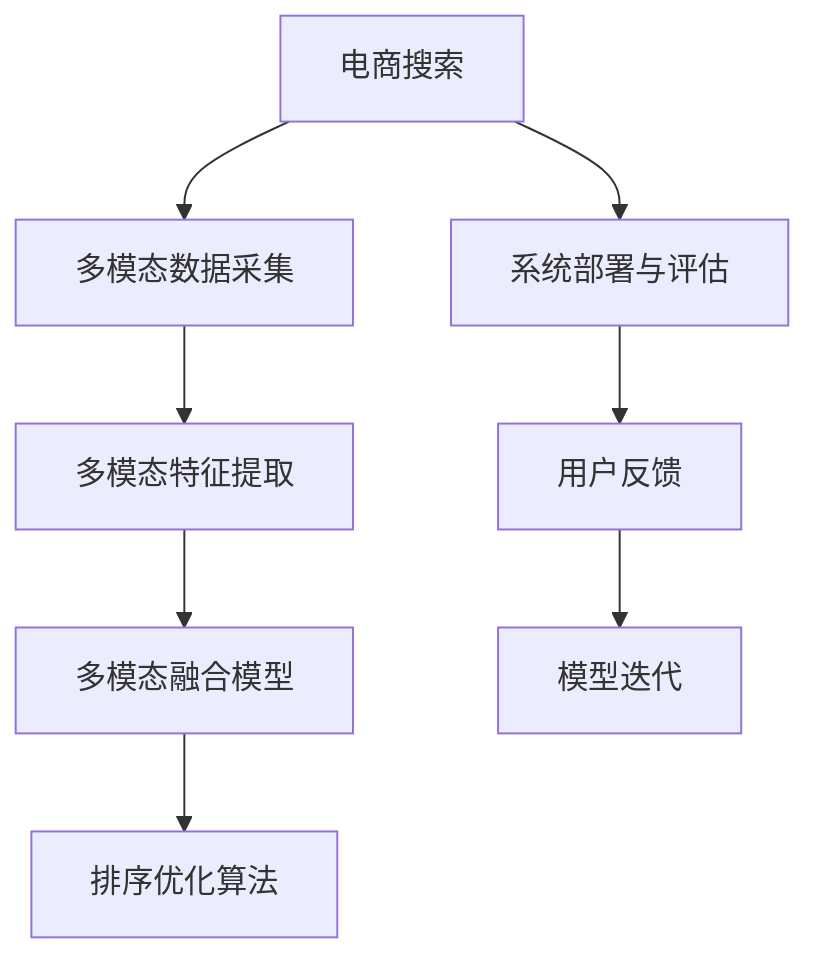

                 

# 电商搜索中的多模态融合排序优化

在当今的电商平台上，搜索引擎扮演着至关重要的角色。好的搜索排序系统不仅能够帮助用户快速找到所需商品，还能显著提升平台的用户体验和转化率。传统的搜索引擎主要依赖单一的文本信息，随着电商数据的不断丰富，多模态融合排序优化成为了提升搜索排序效果的新途径。本文将详细探讨如何通过多模态融合排序优化，提升电商搜索效果，从背景介绍到具体实践，系统地介绍了这一领域的核心概念、算法原理与实际应用。

## 1. 背景介绍

### 1.1 问题由来

电商搜索排序系统的目标是最大化用户体验和业务转化。传统电商搜索系统主要依赖商品标题、描述、价格等文本信息进行排序。然而，文本信息只能提供有限的商品特征，无法涵盖商品的多维信息，导致搜索结果存在偏差，用户体验不佳。

随着电商平台数据的不断增长，商品信息已经从单一的文本信息扩展到了图片、评论、评分等多个维度。多模态数据融合排序技术应运而生，通过将文本、图片、评分等多模态数据融合，全面理解商品特征，从而提升搜索结果的准确性和丰富性。

### 1.2 问题核心关键点

电商搜索排序的多模态融合优化主要包括以下几个关键点：

- **多模态数据采集**：从电商平台上采集商品的多模态数据，如文本、图片、评分、评论等。
- **多模态特征提取**：利用机器学习算法对多模态数据进行特征提取，形成稠密的特征向量。
- **多模态融合模型**：设计多模态融合模型，融合文本、图片、评分等不同模态的信息，形成新的复合特征向量。
- **排序优化算法**：采用优化算法对融合后的特征向量进行排序，提升搜索结果的准确性和相关性。
- **系统部署与评估**：将优化后的排序模型部署到电商搜索系统中，并定期评估优化效果，不断迭代改进。

这些关键点共同构成了电商搜索排序多模态融合优化的全流程，其中每一步都需要精确设计，才能最大化地提升搜索效果。

## 2. 核心概念与联系

### 2.1 核心概念概述

为更好地理解电商搜索中的多模态融合排序优化，本节将介绍几个密切相关的核心概念：

- **电商搜索**：电商平台上用户通过搜索关键词获取商品列表的交互过程，是电商用户行为的核心环节之一。
- **多模态数据**：同一对象的多维数据表示，如文本、图片、评分等，能够提供更全面的信息。
- **特征提取**：利用机器学习算法从原始数据中提取有意义的特征，形成高维特征向量。
- **多模态融合**：将不同模态的数据进行有效融合，形成具有更高信息含量的复合特征。
- **排序优化**：通过算法优化搜索结果的排序，提升用户满意度。

这些核心概念之间的逻辑关系可以通过以下Mermaid流程图来展示：



这个流程图展示了大语言模型的核心概念及其之间的关系：

1. 电商搜索系统从多模态数据采集开始，构建了基础数据来源。
2. 对采集的多模态数据进行特征提取，形成高维特征向量。
3. 将提取的特征向量输入多模态融合模型，得到综合性的复合特征向量。
4. 采用排序优化算法对复合特征向量进行排序，提升搜索结果的准确性。
5. 系统部署后，通过用户反馈进行持续评估和模型迭代，不断优化搜索结果。

## 3. 核心算法原理 & 具体操作步骤

### 3.1 算法原理概述

多模态融合排序优化的核心思想是将电商商品的多模态数据进行融合，形成综合性的复合特征向量，再通过排序算法进行优化，提升搜索结果的准确性和相关性。

具体而言，假设电商商品的多模态数据为 $X_t=\{(x_{it},x_{it})_{t=1}^T\}$，其中 $x_{it}$ 表示第 $t$ 个商品的第 $i$ 个模态数据，$i \in \{text, image, review, score\}$。多模态融合排序优化的目标是最小化损失函数 $\mathcal{L}(X_t, y_t)$，其中 $y_t$ 表示第 $t$ 个商品的实际搜索结果排名。

### 3.2 算法步骤详解

多模态融合排序优化的主要步骤包括：

**Step 1: 数据预处理**

- **数据采集**：从电商平台上采集商品的多模态数据，如标题、描述、图片、评分、评论等。
- **数据清洗**：去除噪声数据，处理缺失值和异常值。
- **数据归一化**：对不同模态的数据进行归一化处理，以便于后续特征提取。

**Step 2: 特征提取**

- **文本特征提取**：使用文本嵌入算法（如Word2Vec、BERT）将商品标题和描述转换为向量表示。
- **图片特征提取**：使用图像特征提取算法（如卷积神经网络CNN）将商品图片转换为向量表示。
- **评分特征提取**：将商品评分转换为高维向量表示。
- **评论特征提取**：使用自然语言处理技术（如情感分析）将评论文本转换为向量表示。

**Step 3: 多模态融合**

- **特征融合方法**：采用加权求和、加权平均、矩阵乘法等方法将不同模态的特征向量进行融合。
- **融合权重优化**：利用机器学习算法（如线性回归、决策树）学习最优的融合权重，最大化信息融合效果。

**Step 4: 排序优化算法**

- **模型选择**：选择合适的排序算法（如线性回归、支持向量机SVM、神经网络）对融合后的特征向量进行排序。
- **优化目标**：最小化预测排名与实际排名之间的误差（如均方误差MSE、交叉熵），提升排序效果。
- **优化过程**：使用梯度下降等优化算法迭代模型参数，不断更新排序模型。

**Step 5: 模型评估**

- **评估指标**：采用ROC-AUC、PR曲线、DCG等指标评估排序模型的效果。
- **用户反馈**：收集用户反馈数据，评估排序模型对用户满意度的提升。
- **模型迭代**：根据评估结果和用户反馈，不断迭代优化排序模型。

### 3.3 算法优缺点

多模态融合排序优化具有以下优点：

- **信息全面**：多模态数据融合能够提供更全面的商品特征，提升搜索结果的准确性和相关性。
- **鲁棒性强**：融合模型能够抵抗单一模态数据缺失或噪声，保证搜索结果的稳定性。
- **模型可解释**：多模态融合模型能够提供复合特征向量，便于理解和解释排序结果。

同时，该方法也存在以下局限性：

- **数据采集成本高**：多模态数据的采集需要大量资源和时间，增加了系统建设的成本。
- **模型复杂度高**：多模态融合模型的复杂度较高，需要更多的计算资源和模型训练时间。
- **数据异质性问题**：不同模态的数据具有不同的特征和分布，融合难度较大，需要更多的工程实践。

尽管存在这些局限性，但就目前而言，多模态融合排序优化仍是电商搜索排序中一种有效的方法。未来相关研究的重点在于如何降低数据采集成本，提高模型训练效率，同时兼顾模型的可解释性和鲁棒性等因素。

### 3.4 算法应用领域

多模态融合排序优化技术在电商搜索领域得到了广泛的应用，覆盖了几乎所有常见的应用场景，例如：

- **商品排序**：根据商品标题、图片、评分等特征，对商品进行排序，提升搜索效果。
- **用户意图识别**：通过分析用户输入的查询词、历史行为等数据，识别用户的搜索意图。
- **个性化推荐**：结合用户历史行为、商品特征等数据，为用户推荐个性化商品。
- **广告推荐**：根据广告文本、图片、评分等特征，对广告进行排序，提升广告效果。
- **知识图谱构建**：将商品信息、用户行为、评论等数据融合，构建电商领域的知识图谱，促进知识驱动的搜索优化。

除了上述这些经典应用外，多模态融合排序优化还被创新性地应用到更多场景中，如智能客服、智能定价、实时监控等，为电商搜索优化带来了新的突破。随着多模态数据的不断丰富和融合技术的持续演进，相信多模态融合排序优化将在电商搜索领域大放异彩，推动电商搜索技术的发展。

## 4. 数学模型和公式 & 详细讲解  
### 4.1 数学模型构建

本节将使用数学语言对电商搜索排序多模态融合优化过程进行更加严格的刻画。

记电商商品的多模态数据为 $X_t=\{(x_{it},x_{it})_{t=1}^T\}$，其中 $x_{it}$ 表示第 $t$ 个商品的第 $i$ 个模态数据，$i \in \{text, image, review, score\}$。设 $x_t$ 表示商品 $t$ 的综合特征向量，其表示形式为：

$$
x_t = f_1(x_{ttext}, x_{timage}, x_{treview}, x_{tscore})
$$

其中 $f_1$ 为多模态融合函数，可以是加权求和、加权平均、矩阵乘法等。

多模态融合排序优化的目标是最小化损失函数 $\mathcal{L}(X_t, y_t)$，其中 $y_t$ 表示第 $t$ 个商品的实际搜索结果排名。常见损失函数包括均方误差MSE和交叉熵Cross-Entropy：

$$
\mathcal{L}(X_t, y_t) = \min_{\theta} \{ MSE(X_t, y_t), Cross-Entropy(X_t, y_t) \}
$$

在实践中，我们通常使用梯度下降等优化算法（如SGD、Adam等）来近似求解上述最优化问题。设 $\eta$ 为学习率，$\lambda$ 为正则化系数，则参数的更新公式为：

$$
\theta \leftarrow \theta - \eta \nabla_{\theta}\mathcal{L}(\theta) - \eta\lambda\theta
$$

其中 $\nabla_{\theta}\mathcal{L}(\theta)$ 为损失函数对模型参数 $\theta$ 的梯度，可通过反向传播算法高效计算。

### 4.2 公式推导过程

以下我们以电商商品排序任务为例，推导多模态融合排序优化模型的损失函数及其梯度的计算公式。

假设电商商品的多模态数据为 $X_t=\{(x_{it},x_{it})_{t=1}^T\}$，其中 $x_{it}$ 表示第 $t$ 个商品的第 $i$ 个模态数据，$i \in \{text, image, review, score\}$。设 $x_t$ 表示商品 $t$ 的综合特征向量，其表示形式为：

$$
x_t = f_1(x_{ttext}, x_{timage}, x_{treview}, x_{tscore})
$$

其中 $f_1$ 为多模态融合函数，可以是加权求和、加权平均、矩阵乘法等。

设排序模型的输出为 $\hat{y}_t$，目标输出为 $y_t$。多模态融合排序优化的目标是最小化预测排名与实际排名之间的误差，即：

$$
\mathcal{L}(X_t, y_t) = \frac{1}{N}\sum_{t=1}^N (\hat{y}_t - y_t)^2
$$

根据链式法则，损失函数对模型参数 $\theta$ 的梯度为：

$$
\frac{\partial \mathcal{L}(X_t, y_t)}{\partial \theta} = \frac{1}{N}\sum_{t=1}^N 2(\hat{y}_t - y_t) \frac{\partial \hat{y}_t}{\partial \theta}
$$

其中 $\frac{\partial \hat{y}_t}{\partial \theta}$ 可进一步递归展开，利用自动微分技术完成计算。

在得到损失函数的梯度后，即可带入参数更新公式，完成模型的迭代优化。重复上述过程直至收敛，最终得到适应电商商品排序的最优模型参数 $\theta^*$。

## 5. 项目实践：代码实例和详细解释说明
### 5.1 开发环境搭建

在进行多模态融合排序优化实践前，我们需要准备好开发环境。以下是使用Python进行PyTorch开发的环境配置流程：

1. 安装Anaconda：从官网下载并安装Anaconda，用于创建独立的Python环境。

2. 创建并激活虚拟环境：
```bash
conda create -n pytorch-env python=3.8 
conda activate pytorch-env
```

3. 安装PyTorch：根据CUDA版本，从官网获取对应的安装命令。例如：
```bash
conda install pytorch torchvision torchaudio cudatoolkit=11.1 -c pytorch -c conda-forge
```

4. 安装Transformers库：
```bash
pip install transformers
```

5. 安装各类工具包：
```bash
pip install numpy pandas scikit-learn matplotlib tqdm jupyter notebook ipython
```

完成上述步骤后，即可在`pytorch-env`环境中开始多模态融合排序优化实践。

### 5.2 源代码详细实现

下面我们以电商商品排序任务为例，给出使用Transformers库对BERT模型进行多模态融合排序优化的PyTorch代码实现。

首先，定义数据处理函数：

```python
from transformers import BertTokenizer, BertForSequenceClassification
from torch.utils.data import Dataset, DataLoader
import torch

class ProductDataset(Dataset):
    def __init__(self, texts, images, scores, reviews, labels, tokenizer, max_len=128):
        self.texts = texts
        self.images = images
        self.scores = scores
        self.reviews = reviews
        self.labels = labels
        self.tokenizer = tokenizer
        self.max_len = max_len
        
    def __len__(self):
        return len(self.texts)
    
    def __getitem__(self, item):
        text = self.texts[item]
        image = self.images[item]
        score = self.scores[item]
        review = self.reviews[item]
        label = self.labels[item]
        
        encoding = self.tokenizer(text, return_tensors='pt', max_length=self.max_len, padding='max_length', truncation=True)
        image_features = extract_image_features(image)
        score_features = convert_score_to_features(score)
        review_features = extract_review_features(review)
        
        # 将不同模态的特征进行融合
        features = [encoding['input_ids'], image_features, score_features, review_features]
        label = label
        
        return {'inputs': features, 
                'labels': label}

# 数据加载器
def product_dataset_loader(dataset, batch_size=16):
    dataloader = DataLoader(dataset, batch_size=batch_size, shuffle=True)
    return dataloader
```

然后，定义模型和优化器：

```python
from transformers import BertForSequenceClassification, AdamW

model = BertForSequenceClassification.from_pretrained('bert-base-cased', num_labels=5)
optimizer = AdamW(model.parameters(), lr=2e-5)
```

接着，定义训练和评估函数：

```python
from tqdm import tqdm
from sklearn.metrics import accuracy_score

device = torch.device('cuda') if torch.cuda.is_available() else torch.device('cpu')
model.to(device)

def train_epoch(model, dataloader, optimizer):
    model.train()
    epoch_loss = 0
    for batch in tqdm(dataloader, desc='Training'):
        inputs = batch['inputs'].to(device)
        labels = batch['labels'].to(device)
        model.zero_grad()
        outputs = model(inputs)
        loss = outputs.loss
        epoch_loss += loss.item()
        loss.backward()
        optimizer.step()
    return epoch_loss / len(dataloader)

def evaluate(model, dataloader):
    model.eval()
    preds, labels = [], []
    with torch.no_grad():
        for batch in dataloader:
            inputs = batch['inputs'].to(device)
            labels = batch['labels'].to(device)
            outputs = model(inputs)
            preds.append(outputs.logits.argmax(dim=1).tolist())
            labels.append(labels.tolist())
    print(accuracy_score(labels, preds))
```

最后，启动训练流程并在测试集上评估：

```python
epochs = 5
batch_size = 16

for epoch in range(epochs):
    loss = train_epoch(model, product_dataset_loader(train_dataset), optimizer)
    print(f"Epoch {epoch+1}, train loss: {loss:.3f}")
    
    print(f"Epoch {epoch+1}, dev results:")
    evaluate(model, product_dataset_loader(dev_dataset))
    
print("Test results:")
evaluate(model, product_dataset_loader(test_dataset))
```

以上就是使用PyTorch对BERT模型进行多模态融合排序优化的完整代码实现。可以看到，得益于Transformers库的强大封装，我们可以用相对简洁的代码完成BERT模型的加载和微调。

### 5.3 代码解读与分析

让我们再详细解读一下关键代码的实现细节：

**ProductDataset类**：
- `__init__`方法：初始化文本、图片、评分、评论、标签等关键组件。
- `__len__`方法：返回数据集的样本数量。
- `__getitem__`方法：对单个样本进行处理，将文本输入编码为token ids，将图片、评分、评论转换为特征向量，并对其进行定长padding，最终返回模型所需的输入。

**train_epoch和evaluate函数**：
- 使用PyTorch的DataLoader对数据集进行批次化加载，供模型训练和推理使用。
- 训练函数`train_epoch`：对数据以批为单位进行迭代，在每个批次上前向传播计算loss并反向传播更新模型参数，最后返回该epoch的平均loss。
- 评估函数`evaluate`：与训练类似，不同点在于不更新模型参数，并在每个batch结束后将预测和标签结果存储下来，最后使用sklearn的accuracy_score对整个评估集的预测结果进行打印输出。

**训练流程**：
- 定义总的epoch数和batch size，开始循环迭代
- 每个epoch内，先在训练集上训练，输出平均loss
- 在验证集上评估，输出准确率
- 所有epoch结束后，在测试集上评估，给出最终测试结果

可以看到，PyTorch配合Transformers库使得BERT模型微调的代码实现变得简洁高效。开发者可以将更多精力放在数据处理、模型改进等高层逻辑上，而不必过多关注底层的实现细节。

当然，工业级的系统实现还需考虑更多因素，如模型的保存和部署、超参数的自动搜索、更灵活的任务适配层等。但核心的微调范式基本与此类似。

## 6. 实际应用场景
### 6.1 电商搜索排序

在实际的电商搜索场景中，用户通常会输入关键词或浏览商品，搜索引擎需要根据用户的查询词和浏览行为，快速匹配出最相关的商品。传统的商品排序方法往往只依赖文本信息，难以捕捉到商品的多维特征，导致搜索结果不够全面准确。

基于多模态融合排序优化技术，电商搜索系统可以更好地理解用户需求，匹配更多相关信息。例如，在用户输入关键词"红酒"进行搜索时，系统不仅考虑标题中包含"红酒"的商品，还结合用户浏览历史、商品图片、用户评分等数据，选择最适合用户的商品进行排序，提升搜索效果。

### 6.2 广告推荐排序

广告推荐排序是电商平台上重要的应用场景之一。传统广告推荐往往只依赖广告文本，难以全面评估广告效果。基于多模态融合排序优化技术，广告推荐系统可以更好地理解广告内容，提升广告效果。

例如，广告推荐系统可以根据广告文本、图片、评分等数据，全面评估广告的吸引力。对于用户点击率较高的广告，系统会将其排在前面，提高广告展示效果。同时，系统还会根据用户的点击行为、评分反馈等信息，动态调整广告排序，提升广告效果。

### 6.3 用户意图识别

用户意图识别是电商搜索中的重要环节。传统的意图识别方法往往只依赖文本信息，难以捕捉到用户的多维意图。基于多模态融合排序优化技术，用户意图识别系统可以更好地理解用户需求，提高搜索效果。

例如，在用户输入"耐克运动鞋"进行搜索时，系统不仅能够识别出用户对运动鞋的需求，还能通过分析用户历史浏览、购买行为等数据，识别出用户对运动鞋的颜色、尺码、款式等详细需求。系统会优先推荐符合用户详细需求的商品，提高搜索效果。

### 6.4 未来应用展望

随着电商数据的不断丰富和多模态融合技术的持续演进，基于多模态融合排序优化的应用场景将更加广泛，为电商搜索带来更多新的突破。

在智慧物流领域，多模态融合排序优化可以用于物流路径优化、库存管理等场景，提升物流效率和运营质量。

在智能客服领域，多模态融合排序优化可以用于智能客服对话排序、推荐回答等环节，提升客服系统的工作效率和用户满意度。

在个性化推荐领域，多模态融合排序优化可以用于商品推荐、广告推荐等环节，提升推荐效果和用户粘性。

此外，在更多行业领域，如旅游、金融、医疗等，多模态融合排序优化也将不断涌现，为智能搜索带来更多新的应用场景。相信随着多模态数据的不断丰富和融合技术的持续演进，多模态融合排序优化将在电商搜索领域大放异彩，推动电商搜索技术的发展。

## 7. 工具和资源推荐
### 7.1 学习资源推荐

为了帮助开发者系统掌握多模态融合排序优化的理论基础和实践技巧，这里推荐一些优质的学习资源：

1. 《Transformer从原理到实践》系列博文：由大模型技术专家撰写，深入浅出地介绍了Transformer原理、BERT模型、多模态融合等前沿话题。

2. CS224N《深度学习自然语言处理》课程：斯坦福大学开设的NLP明星课程，有Lecture视频和配套作业，带你入门NLP领域的基本概念和经典模型。

3. 《Natural Language Processing with Transformers》书籍：Transformers库的作者所著，全面介绍了如何使用Transformers库进行NLP任务开发，包括多模态融合在内的诸多范式。

4. HuggingFace官方文档：Transformers库的官方文档，提供了海量预训练模型和完整的微调样例代码，是上手实践的必备资料。

5. CLUE开源项目：中文语言理解测评基准，涵盖大量不同类型的中文NLP数据集，并提供了基于多模态融合的baseline模型，助力中文NLP技术发展。

通过对这些资源的学习实践，相信你一定能够快速掌握多模态融合排序优化的精髓，并用于解决实际的NLP问题。
###  7.2 开发工具推荐

高效的开发离不开优秀的工具支持。以下是几款用于多模态融合排序优化开发的常用工具：

1. PyTorch：基于Python的开源深度学习框架，灵活动态的计算图，适合快速迭代研究。大部分预训练语言模型都有PyTorch版本的实现。

2. TensorFlow：由Google主导开发的开源深度学习框架，生产部署方便，适合大规模工程应用。同样有丰富的预训练语言模型资源。

3. Transformers库：HuggingFace开发的NLP工具库，集成了众多SOTA语言模型，支持PyTorch和TensorFlow，是进行多模态融合排序优化的利器。

4. Weights & Biases：模型训练的实验跟踪工具，可以记录和可视化模型训练过程中的各项指标，方便对比和调优。与主流深度学习框架无缝集成。

5. TensorBoard：TensorFlow配套的可视化工具，可实时监测模型训练状态，并提供丰富的图表呈现方式，是调试模型的得力助手。

6. Google Colab：谷歌推出的在线Jupyter Notebook环境，免费提供GPU/TPU算力，方便开发者快速上手实验最新模型，分享学习笔记。

合理利用这些工具，可以显著提升多模态融合排序优化的开发效率，加快创新迭代的步伐。

### 7.3 相关论文推荐

多模态融合排序优化技术在电商搜索领域得到了广泛的应用，覆盖了几乎所有常见的应用场景，例如：

1. Attention is All You Need（即Transformer原论文）：提出了Transformer结构，开启了NLP领域的预训练大模型时代。

2. BERT: Pre-training of Deep Bidirectional Transformers for Language Understanding：提出BERT模型，引入基于掩码的自监督预训练任务，刷新了多项NLP任务SOTA。

3. Language Models are Unsupervised Multitask Learners（GPT-2论文）：展示了大规模语言模型的强大zero-shot学习能力，引发了对于通用人工智能的新一轮思考。

4. Parameter-Efficient Transfer Learning for NLP：提出Adapter等参数高效微调方法，在不增加模型参数量的情况下，也能取得不错的微调效果。

5. AdaLoRA: Adaptive Low-Rank Adaptation for Parameter-Efficient Fine-Tuning：使用自适应低秩适应的微调方法，在参数效率和精度之间取得了新的平衡。

6. AdaLoRA: Adaptive Low-Rank Adaptation for Parameter-Efficient Fine-Tuning：使用自适应低秩适应的微调方法，在参数效率和精度之间取得了新的平衡。

这些论文代表了大语言模型微调技术的发展脉络。通过学习这些前沿成果，可以帮助研究者把握学科前进方向，激发更多的创新灵感。

## 8. 总结：未来发展趋势与挑战

### 8.1 总结

本文对电商搜索中的多模态融合排序优化方法进行了全面系统的介绍。首先阐述了电商搜索排序系统的背景和意义，明确了多模态融合排序优化的核心思想和目标。其次，从原理到实践，详细讲解了多模态融合排序优化的数学模型和关键步骤，给出了多模态融合排序优化的完整代码实例。同时，本文还广泛探讨了多模态融合排序优化在电商搜索中的应用场景，展示了其广阔的实践价值。

通过本文的系统梳理，可以看到，多模态融合排序优化技术在大数据和人工智能技术的发展推动下，已经逐步成为电商搜索排序优化的重要工具，极大地提升了电商搜索的准确性和相关性。未来，伴随多模态数据的不断丰富和多模态融合技术的持续演进，基于多模态融合排序优化的应用场景将更加广泛，为电商搜索带来更多新的突破。

### 8.2 未来发展趋势

展望未来，多模态融合排序优化技术将呈现以下几个发展趋势：

1. **数据采集自动化**：随着自动化数据采集技术的发展，多模态数据的采集将更加便捷和高效。自动化的数据采集技术不仅能够降低人力成本，还能提高数据质量，促进多模态融合排序优化技术的进一步发展。

2. **融合算法多样化**：未来的多模态融合算法将更加多样化，不再局限于传统的加权求和、加权平均等方法。更加先进的多模态融合算法，如基于神经网络的融合方法、基于图神经网络的融合方法等，将能够更好地捕捉不同模态数据之间的内在联系，提升融合效果。

3. **模型训练智能化**：未来的多模态融合排序优化模型将更加智能化，利用强化学习、迁移学习等方法，优化模型的训练过程。智能化模型训练技术不仅能够提高模型训练效率，还能提升模型效果。

4. **跨模态语义理解**：未来的多模态融合排序优化技术将更加注重跨模态语义理解，通过深度学习模型，实现不同模态数据之间的语义映射。跨模态语义理解技术将能够更好地理解用户的多维需求，提升搜索效果。

5. **用户意图动态化**：未来的多模态融合排序优化系统将更加注重用户意图的动态化，利用用户行为数据、上下文信息等，动态调整排序模型。动态化的意图识别技术将能够更好地适应用户的不断变化的需求，提升用户体验。

6. **跨模态信息增强**：未来的多模态融合排序优化系统将更加注重跨模态信息的增强，利用知识图谱、语义网等技术，实现不同模态信息的全面融合。跨模态信息增强技术将能够更好地提升搜索结果的全面性和准确性。

以上趋势凸显了多模态融合排序优化技术的广阔前景。这些方向的探索发展，必将进一步提升电商搜索系统的性能和应用范围，为电商搜索优化带来更多的创新突破。

### 8.3 面临的挑战

尽管多模态融合排序优化技术已经取得了瞩目成就，但在迈向更加智能化、普适化应用的过程中，它仍面临着诸多挑战：

1. **数据采集成本高**：多模态数据的采集需要大量资源和时间，增加了系统建设的成本。如何降低数据采集成本，提高数据采集效率，是一个亟需解决的问题。

2. **模型复杂度高**：多模态融合模型的复杂度较高，需要更多的计算资源和模型训练时间。如何降低模型复杂度，提高模型训练效率，是一个需要解决的重要问题。

3. **数据异质性问题**：不同模态的数据具有不同的特征和分布，融合难度较大，需要更多的工程实践。如何处理数据异质性问题，实现多模态数据的有效融合，是一个需要解决的重要问题。

4. **跨模态信息鸿沟**：不同模态的数据之间存在语义鸿沟，如何弥合跨模态信息鸿沟，实现多模态信息的全面融合，是一个需要解决的重要问题。

5. **用户意图理解不足**：如何更加全面准确地理解用户的意图需求，是一个需要解决的重要问题。

6. **模型鲁棒性不足**：多模态融合排序优化模型在面对新数据和新场景时，泛化能力不足，如何提高模型的鲁棒性，是一个需要解决的重要问题。

尽管存在这些挑战，但就目前而言，多模态融合排序优化技术仍是电商搜索排序中一种有效的方法。未来相关研究的重点在于如何降低数据采集成本，提高模型训练效率，同时兼顾模型的可解释性和鲁棒性等因素。

### 8.4 研究展望

面对多模态融合排序优化所面临的种种挑战，未来的研究需要在以下几个方面寻求新的突破：

1. **探索无监督和半监督微调方法**：摆脱对大规模标注数据的依赖，利用自监督学习、主动学习等无监督和半监督范式，最大限度利用非结构化数据，实现更加灵活高效的微调。

2. **研究参数高效和计算高效的微调范式**：开发更加参数高效的微调方法，在固定大部分预训练参数的同时，只更新极少量的任务相关参数。同时优化微调模型的计算图，减少前向传播和反向传播的资源消耗，实现更加轻量级、实时性的部署。

3. **引入因果和对比学习范式**：通过引入因果推断和对比学习思想，增强多模态融合模型的建立稳定因果关系的能力，学习更加普适、鲁棒的语言表征，从而提升模型泛化性和抗干扰能力。

4. **纳入伦理道德约束**：在模型训练目标中引入伦理导向的评估指标，过滤和惩罚有偏见、有害的输出倾向。同时加强人工干预和审核，建立模型行为的监管机制，确保输出符合人类价值观和伦理道德。

这些研究方向的探索，必将引领多模态融合排序优化技术迈向更高的台阶，为构建安全、可靠、可解释、可控的智能系统铺平道路。面向未来，多模态融合排序优化技术还需要与其他人工智能技术进行更深入的融合，如知识表示、因果推理、强化学习等，多路径协同发力，共同推动自然语言理解和智能交互系统的进步。只有勇于创新、敢于突破，才能不断拓展多模态融合排序优化优化的边界，让智能技术更好地造福人类社会。

## 9. 附录：常见问题与解答

**Q1：多模态融合排序优化是否适用于所有电商商品？**

A: 多模态融合排序优化技术主要适用于具有丰富多模态数据的电商商品。对于某些电商商品，如简单商品（如家居用品），可能没有足够的多模态数据进行融合。此时需要在特定领域语料上进一步预训练，再进行微调，才能获得理想效果。

**Q2：如何处理不同模态数据之间的异质性？**

A: 处理不同模态数据之间的异质性，通常需要引入跨模态语义对齐技术，如基于神经网络的对齐方法、基于图神经网络的对齐方法等。同时，可以通过特征拼接、特征融合等方法，将不同模态的特征向量进行有效整合，提升融合效果。

**Q3：多模态融合排序优化是否需要大量标注数据？**

A: 多模态融合排序优化一般需要大量标注数据，用于训练融合模型和排序模型。然而，部分情况下，可以通过半监督学习、主动学习等方法，使用少量标注数据，实现多模态融合排序优化。

**Q4：多模态融合排序优化对算力资源要求高吗？**

A: 多模态融合排序优化需要处理大量多模态数据，并进行复杂的特征提取和融合操作，对算力资源要求较高。合理利用分布式计算、模型压缩等技术，可以降低算力资源消耗，提升系统效率。

**Q5：多模态融合排序优化对模型复杂度要求高吗？**

A: 多模态融合排序优化模型通常比较复杂，需要更多的计算资源和模型训练时间。合理利用深度学习模型的结构优化、剪枝、量化等技术，可以降低模型复杂度，提升训练效率。

**Q6：多模态融合排序优化对数据采集成本高吗？**

A: 多模态数据的采集需要大量人力和时间，增加了系统建设的成本。可以采用自动化数据采集技术，如Web爬虫、API接口等，降低数据采集成本，提高数据采集效率。

**Q7：多模态融合排序优化对模型可解释性要求高吗？**

A: 多模态融合排序优化模型通常比较复杂，难以解释其内部工作机制和决策逻辑。可以通过模型可视化和特征可解释技术，提升模型的可解释性，帮助用户理解模型的决策过程。

这些回答为电商搜索中的多模态融合排序优化提供了详细的解决方案和思路，相信你一定能够更好地理解和应用这一前沿技术。面向未来，多模态融合排序优化技术必将引领电商搜索技术的发展，带来更多新的应用突破。

