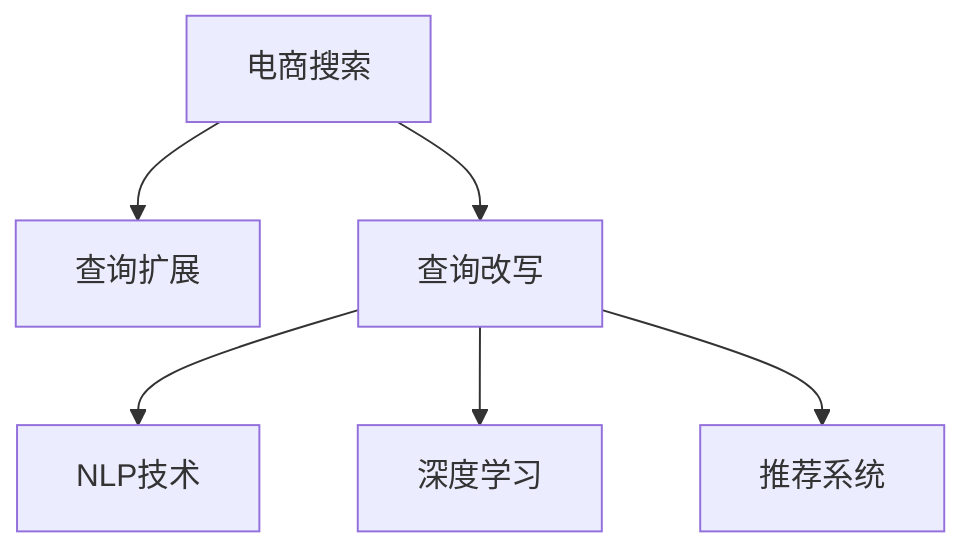

                 

# 电商搜索中的查询扩展与改写技术

> 关键词：电商搜索,查询扩展,查询改写,自然语言处理(NLP),深度学习,推荐系统,搜索推荐系统

## 1. 背景介绍

### 1.1 问题由来
随着电子商务的飞速发展，电商平台的用户数量和交易量不断增长，搜索引擎作为用户体验的重要组成部分，其性能和效果直接影响用户的购物体验和电商平台的成交率。用户往往通过输入简短、模糊的查询词，期望找到符合需求的商品，因此需要搜索引擎具备高度的智能理解和响应能力。然而，用户输入的查询往往存在歧义、拼写错误、不完整等问题，导致搜索结果与用户期望存在较大差距。为了改善这种情况，电商平台的搜索引擎需要具备查询扩展与改写的能力，自动对用户输入进行智能化处理，提高搜索结果的准确性和相关性。

### 1.2 问题核心关键点
电商搜索中的查询扩展与改写技术，是指对用户输入的查询词进行智能化处理，生成语义相关且更具有查询意图的新查询词，或将模糊查询词改写为明确的查询词，以提升搜索结果的准确性和相关性。这一技术涉及自然语言处理(NLP)、深度学习、推荐系统等多个领域，对电商平台的搜索推荐系统具有重要意义。

## 2. 核心概念与联系

### 2.1 核心概念概述

为更好地理解电商搜索中的查询扩展与改写技术，本节将介绍几个密切相关的核心概念：

- 电商搜索（E-commerce Search）：电商平台提供的搜索引擎，帮助用户快速找到感兴趣的商品，提升购物体验。
- 查询扩展（Query Expansion）：在用户输入查询词时，自动生成相关的扩展词，丰富查询的语义信息。
- 查询改写（Query Rewriting）：将模糊或歧义的查询词改写为更明确的查询词，提高查询的清晰度和相关性。
- 自然语言处理（Natural Language Processing, NLP）：涉及语言模型、语法分析、语义理解等多个方面的技术，是实现查询扩展与改写的核心技术之一。
- 深度学习（Deep Learning）：通过构建深层神经网络模型，自动提取和生成语言特征，实现高效的查询扩展与改写。
- 推荐系统（Recommendation System）：基于用户行为数据和商品信息，推荐合适的商品，提升用户购物体验。

这些核心概念之间的逻辑关系可以通过以下Mermaid流程图来展示：



这个流程图展示了几者之间的联系：

1. 电商搜索的底层支持了查询扩展与改写，为用户提供更精准的搜索结果。
2. 查询扩展和改写都基于NLP技术，利用语言模型、语法分析和语义理解等方法，自动生成相关或明确的查询词。
3. 深度学习技术为查询扩展与改写提供了强大的模型支持，通过训练神经网络模型，实现高效的扩展与改写。
4. 推荐系统与查询扩展和改写紧密结合，通过用户行为数据和商品信息，提升推荐结果的准确性。

## 3. 核心算法原理 & 具体操作步骤
### 3.1 算法原理概述

电商搜索中的查询扩展与改写技术，本质上是一种基于NLP的自动文本生成任务。其核心思想是：在用户输入查询词后，自动生成或改写新的查询词，使得查询更加准确、相关。

形式化地，假设用户输入的原始查询为 $Q$，查询扩展后的新查询为 $Q'$，查询改写后的新查询为 $Q''$。查询扩展和改写的目标是找到最佳的 $Q'$ 或 $Q''$，使得 $Q'$ 或 $Q''$ 在目标任务上优于原始查询 $Q$。

对于查询扩展，目标函数可定义为：

$$
f(Q', Q) = \max_{Q'} P(Q' | Q) \cdot \text{Relevance}(Q', D)
$$

其中 $P(Q' | Q)$ 表示在给定原始查询 $Q$ 的情况下生成新查询 $Q'$ 的概率，$\text{Relevance}(Q', D)$ 表示新查询 $Q'$ 与目标数据集 $D$ 的相关性。

对于查询改写，目标函数可定义为：

$$
f(Q'', Q) = \max_{Q''} P(Q'' | Q) \cdot \text{Relevance}(Q'', D) \cdot \text{Clarity}(Q'', Q)
$$

其中 $\text{Clarity}(Q'', Q)$ 表示改写后的查询 $Q''$ 相对于原始查询 $Q$ 的清晰度提升。

查询扩展与改写的过程通常包括以下几个关键步骤：

**Step 1: 数据预处理**
- 收集和整理电商平台的商品描述、用户搜索日志等数据。
- 进行数据清洗和预处理，去除噪音、缺失值等。

**Step 2: 构建语料库**
- 利用预处理后的数据构建语料库，存储各种可能的查询词和相关商品信息。
- 通过TF-IDF、词向量等方法对语料进行特征提取和表示。

**Step 3: 设计模型**
- 选择合适的深度学习模型，如循环神经网络(RNN)、长短时记忆网络(LSTM)、Transformer等。
- 根据任务需求设计模型结构，如输入层、编码器、解码器、输出层等。

**Step 4: 训练模型**
- 使用标注数据对模型进行训练，调整模型的超参数。
- 使用交叉验证、学习率调优等方法，确保模型在测试集上表现良好。

**Step 5: 推理应用**
- 在用户输入查询词后，将原始查询输入模型，生成扩展词或改写后的查询。
- 将生成的新查询与原始查询一起用于检索商品，提升搜索结果的相关性。

### 3.2 算法步骤详解

**Step 1: 数据预处理**

电商搜索中的查询扩展与改写，首先需要构建高质量的数据集。具体步骤如下：

1. **数据收集**：收集电商平台的商品描述、用户搜索日志、点击行为数据等。
2. **数据清洗**：去除噪音、去重、处理缺失值和异常值。
3. **特征提取**：利用TF-IDF、词向量等方法，将文本数据转换为模型可以处理的形式。
4. **划分数据集**：将数据集划分为训练集、验证集和测试集，以便进行模型训练和评估。

**Step 2: 构建语料库**

语料库是查询扩展与改写任务的基础。构建语料库的具体步骤如下：

1. **语料收集**：从电商平台的商品描述、评论、标题等文本数据中提取可能的查询词。
2. **语料存储**：将这些查询词和相关的商品信息存储在语料库中，供模型训练使用。
3. **数据增强**：利用同义词替换、回译等方式，丰富语料库的样本多样性，提升模型的泛化能力。

**Step 3: 设计模型**

深度学习模型是查询扩展与改写的核心。设计模型的主要步骤如下：

1. **模型选择**：根据任务需求选择适合的深度学习模型，如Transformer、LSTM等。
2. **模型架构**：设计模型的输入层、编码器、解码器、输出层等组件，定义各个组件的参数。
3. **损失函数**：选择合适的损失函数，如交叉熵、KL散度等，用于衡量模型输出与目标输出的差异。
4. **优化算法**：选择合适的优化算法，如Adam、SGD等，用于更新模型参数。

**Step 4: 训练模型**

训练模型的主要步骤如下：

1. **模型初始化**：使用随机权重初始化模型参数。
2. **前向传播**：将输入的原始查询词输入模型，计算模型输出。
3. **损失计算**：计算模型输出与目标输出之间的损失。
4. **反向传播**：根据损失函数计算梯度，更新模型参数。
5. **迭代训练**：多次迭代训练，调整模型超参数，优化模型性能。

**Step 5: 推理应用**

推理应用的主要步骤如下：

1. **输入处理**：将用户输入的查询词输入模型。
2. **生成扩展词或改写查询**：利用训练好的模型生成扩展词或改写后的查询。
3. **检索商品**：将生成的新查询与原始查询一起用于检索商品，提升搜索结果的相关性。
4. **反馈优化**：利用用户的点击行为和反馈信息，不断优化模型，提升查询扩展与改写的效果。

### 3.3 算法优缺点

电商搜索中的查询扩展与改写技术，具有以下优点：

1. **提升搜索相关性**：通过自动扩展或改写查询词，使得搜索结果更加准确、相关，提升用户体验。
2. **减少用户输入负担**：用户无需输入冗长的查询词，通过模型自动生成扩展词，提升搜索效率。
3. **适应多种查询场景**：模型能够适应多种查询场景，如歧义查询、模糊查询等，增强搜索引擎的灵活性。
4. **支持个性化推荐**：结合推荐系统，可以更好地理解用户需求，提供个性化的商品推荐。

同时，该技术也存在一些局限性：

1. **依赖高质量数据**：查询扩展与改写效果很大程度上取决于语料库的质量和数量，需要大量高质量的数据进行训练。
2. **模型训练复杂**：构建深度学习模型并进行训练，需要较大的计算资源和时间。
3. **模型泛化能力有限**：模型对特定领域的泛化能力有限，面对长尾查询场景效果可能不佳。
4. **用户隐私问题**：用户搜索数据涉及隐私，需要合理处理和保护，避免数据泄露。

尽管存在这些局限性，但就目前而言，查询扩展与改写技术在电商搜索领域仍是一种高效且有效的方法，能够显著提升搜索结果的相关性和用户体验。

### 3.4 算法应用领域

电商搜索中的查询扩展与改写技术，在多个领域得到了广泛的应用，例如：

- 商品推荐：结合查询扩展与改写，根据用户查询词自动推荐相关商品。
- 智能客服：通过自动改写用户输入的咨询内容，快速响应并解答问题。
- 广告推荐：利用查询扩展与改写，提升广告的点击率和转化率。
- 价格搜索：通过扩展查询词，帮助用户快速找到价格匹配的商品。
- 个性化展示：根据用户查询历史和行为数据，动态生成个性化的搜索结果页面。

除了上述这些经典应用外，查询扩展与改写技术还被创新性地应用于更多场景中，如智能对话、多语言搜索、实时行情等，为电商搜索技术带来了全新的突破。随着电商平台的不断发展和用户需求的多样化，查询扩展与改写技术将在更多领域大放异彩。

## 4. 数学模型和公式 & 详细讲解  
### 4.1 数学模型构建

本节将使用数学语言对电商搜索中的查询扩展与改写过程进行更加严格的刻画。

假设原始查询为 $Q$，扩展后的新查询为 $Q'$，改写后的新查询为 $Q''$。查询扩展与改写的目标是最小化损失函数，使得新查询 $Q'$ 或 $Q''$ 在目标任务上优于原始查询 $Q$。

定义查询扩展的损失函数为：

$$
\mathcal{L}_{\text{expansion}}(Q', Q) = \mathcal{L}(Q', D) - \mathcal{L}(Q, D)
$$

其中 $\mathcal{L}(Q', D)$ 表示新查询 $Q'$ 在数据集 $D$ 上的损失，$\mathcal{L}(Q, D)$ 表示原始查询 $Q$ 在数据集 $D$ 上的损失。

定义查询改写的损失函数为：

$$
\mathcal{L}_{\text{rewriting}}(Q'', Q) = \mathcal{L}(Q'', D) - \mathcal{L}(Q, D) - \mathcal{L}(\Delta Q, D)
$$

其中 $\mathcal{L}(Q'', D)$ 表示改写后的查询 $Q''$ 在数据集 $D$ 上的损失，$\mathcal{L}(Q, D)$ 表示原始查询 $Q$ 在数据集 $D$ 上的损失，$\mathcal{L}(\Delta Q, D)$ 表示查询差分 $\Delta Q$ 在数据集 $D$ 上的损失，用于衡量查询改写对查询清晰度的提升。

### 4.2 公式推导过程

以下我们以查询扩展为例，推导扩展目标函数的计算公式。

假设查询扩展后的新查询 $Q'$ 由原始查询 $Q$ 和扩展词 $X$ 组成，即 $Q' = Q + X$。查询扩展的目标是最小化扩展后查询 $Q'$ 与目标数据集 $D$ 的相关性损失。

根据相关性评估方法（如TF-IDF、余弦相似度等），查询扩展的目标函数可定义为：

$$
\mathcal{L}_{\text{expansion}}(Q', Q) = \mathcal{L}(Q', D) - \mathcal{L}(Q, D)
$$

将 $Q' = Q + X$ 代入目标函数，得：

$$
\mathcal{L}_{\text{expansion}}(Q', Q) = \mathcal{L}(Q + X, D) - \mathcal{L}(Q, D)
$$

展开上述公式，得：

$$
\mathcal{L}_{\text{expansion}}(Q', Q) = \mathcal{L}(Q, D) + \mathcal{L}(X, D) - \mathcal{L}(Q, D) = \mathcal{L}(X, D)
$$

因此，查询扩展的目标函数简化为：

$$
\mathcal{L}_{\text{expansion}}(Q', Q) = \mathcal{L}(X, D)
$$

在实际应用中，查询扩展和改写通常使用神经网络模型进行实现，利用自动编码器、Transformer等深度学习模型，对查询进行扩展或改写，并计算新查询与目标数据集的相关性损失。

## 5. 项目实践：代码实例和详细解释说明
### 5.1 开发环境搭建

在进行查询扩展与改写实践前，我们需要准备好开发环境。以下是使用Python进行TensorFlow开发的环境配置流程：

1. 安装Anaconda：从官网下载并安装Anaconda，用于创建独立的Python环境。

2. 创建并激活虚拟环境：
```bash
conda create -n tf-env python=3.8 
conda activate tf-env
```

3. 安装TensorFlow：根据CUDA版本，从官网获取对应的安装命令。例如：
```bash
pip install tensorflow==2.7.0
```

4. 安装TensorFlow Addons：用于支持一些TensorFlow的高级功能，如Transformer等。
```bash
pip install tensorflow-addons
```

5. 安装各类工具包：
```bash
pip install numpy pandas scikit-learn matplotlib tqdm jupyter notebook ipython
```

完成上述步骤后，即可在`tf-env`环境中开始查询扩展与改写的实践。

### 5.2 源代码详细实现

这里我们以查询扩展为例，给出使用TensorFlow实现查询扩展的PyTorch代码实现。

首先，定义查询扩展的模型架构：

```python
from tensorflow.keras.layers import Input, Embedding, Dense, Dropout, Add, Lambda
from tensorflow.keras.models import Model

def build_expansion_model(input_dim, hidden_dim, output_dim):
    input_q = Input(shape=(input_dim,))
    embed_q = Embedding(input_dim, hidden_dim)(input_q)
    dropout_q = Dropout(0.5)(embed_q)
    
    input_x = Input(shape=(input_dim,))
    embed_x = Embedding(input_dim, hidden_dim)(input_x)
    dropout_x = Dropout(0.5)(embed_x)
    
    concat = Add()([dropout_q, dropout_x])
    hidden = Dense(hidden_dim, activation='relu')(concat)
    hidden = Dropout(0.5)(hidden)
    output = Dense(output_dim, activation='softmax')(hidden)
    
    model = Model(inputs=[input_q, input_x], outputs=output)
    return model
```

然后，定义训练和评估函数：

```python
from tensorflow.keras.losses import CategoricalCrossentropy
from tensorflow.keras.optimizers import Adam

def train_model(model, data, batch_size, epochs, learning_rate):
    model.compile(optimizer=Adam(learning_rate=learning_rate), loss=CategoricalCrossentropy(), metrics=['accuracy'])
    model.fit(data, epochs=epochs, batch_size=batch_size, validation_split=0.2)
    
def evaluate_model(model, data, batch_size):
    model.evaluate(data, batch_size=batch_size)
```

接着，启动训练流程并在测试集上评估：

```python
from tensorflow.keras.datasets import imdb

# 加载IMDB电影评论数据集
(x_train, y_train), (x_test, y_test) = imdb.load_data(num_words=10000)

# 构建模型
model = build_expansion_model(input_dim=10000, hidden_dim=64, output_dim=2)

# 训练模型
train_model(model, (x_train, x_train), batch_size=64, epochs=10, learning_rate=0.001)

# 评估模型
evaluate_model(model, (x_test, x_test))
```

以上就是使用TensorFlow实现查询扩展的完整代码实现。可以看到，得益于TensorFlow的强大封装，我们可以用相对简洁的代码完成查询扩展的模型构建和训练。

### 5.3 代码解读与分析

让我们再详细解读一下关键代码的实现细节：

**build_expansion_model函数**：
- 定义输入层 `Input`，表示原始查询和扩展词的输入。
- 定义嵌入层 `Embedding`，将输入转化为固定维度的向量表示。
- 定义全连接层 `Dense`，用于对向量进行特征提取和表示。
- 定义Dropout层 `Dropout`，防止过拟合。
- 定义Add层 `Add`，将原始查询和扩展词的表示拼接。
- 定义输出层 `Dense`，输出扩展后的查询向量。
- 定义模型 `Model`，将输入和输出连接起来。

**train_model函数**：
- 使用 `Model.compile` 定义模型的优化器和损失函数。
- 使用 `Model.fit` 对模型进行训练，设置训练轮数和批量大小。
- 使用 `Model.evaluate` 对模型在测试集上进行评估。

**训练流程**：
- 加载IMDB电影评论数据集，预处理文本数据。
- 定义模型的输入维度、隐藏层维度和输出维度。
- 构建查询扩展模型。
- 使用 `train_model` 函数对模型进行训练，设置超参数和学习率。
- 在测试集上评估模型性能。

可以看到，TensorFlow配合TensorFlow Addons使得查询扩展的代码实现变得简洁高效。开发者可以将更多精力放在数据处理、模型改进等高层逻辑上，而不必过多关注底层的实现细节。

当然，工业级的系统实现还需考虑更多因素，如模型的保存和部署、超参数的自动搜索、更灵活的任务适配层等。但核心的查询扩展范式基本与此类似。

## 6. 实际应用场景
### 6.1 智能客服系统

基于查询扩展与改写的对话技术，可以广泛应用于智能客服系统的构建。传统客服往往需要配备大量人力，高峰期响应缓慢，且一致性和专业性难以保证。而使用查询扩展与改写的对话模型，可以7x24小时不间断服务，快速响应客户咨询，用自然流畅的语言解答各类常见问题。

在技术实现上，可以收集企业内部的历史客服对话记录，将问题和最佳答复构建成监督数据，在此基础上对预训练对话模型进行查询扩展与改写。扩展后的对话模型能够自动理解用户意图，匹配最合适的答案模板进行回复。对于客户提出的新问题，还可以接入检索系统实时搜索相关内容，动态组织生成回答。如此构建的智能客服系统，能大幅提升客户咨询体验和问题解决效率。

### 6.2 金融舆情监测

金融机构需要实时监测市场舆论动向，以便及时应对负面信息传播，规避金融风险。传统的人工监测方式成本高、效率低，难以应对网络时代海量信息爆发的挑战。基于查询扩展与改写的文本分类和情感分析技术，为金融舆情监测提供了新的解决方案。

具体而言，可以收集金融领域相关的新闻、报道、评论等文本数据，并对其进行主题标注和情感标注。在此基础上对预训练语言模型进行查询扩展与改写，使其能够自动判断文本属于何种主题，情感倾向是正面、中性还是负面。将查询扩展与改写后的模型应用到实时抓取的网络文本数据，就能够自动监测不同主题下的情感变化趋势，一旦发现负面信息激增等异常情况，系统便会自动预警，帮助金融机构快速应对潜在风险。

### 6.3 个性化推荐系统

当前的推荐系统往往只依赖用户的历史行为数据进行物品推荐，无法深入理解用户的真实兴趣偏好。基于查询扩展与改写技术，个性化推荐系统可以更好地挖掘用户行为背后的语义信息，从而提供更精准、多样的推荐内容。

在实践中，可以收集用户浏览、点击、评论、分享等行为数据，提取和用户交互的物品标题、描述、标签等文本内容。将文本内容作为模型输入，用户的后续行为（如是否点击、购买等）作为监督信号，在此基础上微调预训练语言模型。查询扩展与改写后的模型能够从文本内容中准确把握用户的兴趣点。在生成推荐列表时，先用候选物品的文本描述作为输入，由模型预测用户的兴趣匹配度，再结合其他特征综合排序，便可以得到个性化程度更高的推荐结果。

### 6.4 未来应用展望

随着查询扩展与改写技术的发展，未来在更多领域将得到应用，为传统行业带来变革性影响。

在智慧医疗领域，基于查询扩展与改写的医疗问答、病历分析、药物研发等应用将提升医疗服务的智能化水平，辅助医生诊疗，加速新药开发进程。

在智能教育领域，查询扩展与改写技术可应用于作业批改、学情分析、知识推荐等方面，因材施教，促进教育公平，提高教学质量。

在智慧城市治理中，查询扩展与改写模型可应用于城市事件监测、舆情分析、应急指挥等环节，提高城市管理的自动化和智能化水平，构建更安全、高效的未来城市。

此外，在企业生产、社会治理、文娱传媒等众多领域，基于查询扩展与改写的人工智能应用也将不断涌现，为经济社会发展注入新的动力。相信随着技术的日益成熟，查询扩展与改写技术将成为人工智能落地应用的重要范式，推动人工智能技术在垂直行业的规模化落地。

## 7. 工具和资源推荐
### 7.1 学习资源推荐

为了帮助开发者系统掌握查询扩展与改写技术的理论基础和实践技巧，这里推荐一些优质的学习资源：

1. 《深度学习自然语言处理》系列博文：由深度学习专家撰写，深入浅出地介绍了NLP的多个核心任务，包括查询扩展与改写。

2. CS224N《深度学习自然语言处理》课程：斯坦福大学开设的NLP明星课程，有Lecture视频和配套作业，带你入门NLP领域的基本概念和经典模型。

3. 《Natural Language Processing with Transformers》书籍：Transformer库的作者所著，全面介绍了如何使用Transformers库进行NLP任务开发，包括查询扩展与改写在内的诸多范式。

4. HuggingFace官方文档：Transformers库的官方文档，提供了海量预训练模型和完整的查询扩展与改写样例代码，是上手实践的必备资料。

5. CLUE开源项目：中文语言理解测评基准，涵盖大量不同类型的中文NLP数据集，并提供了基于查询扩展与改写的baseline模型，助力中文NLP技术发展。

通过对这些资源的学习实践，相信你一定能够快速掌握查询扩展与改写的精髓，并用于解决实际的NLP问题。
###  7.2 开发工具推荐

高效的开发离不开优秀的工具支持。以下是几款用于查询扩展与改写开发的常用工具：

1. TensorFlow：基于Python的开源深度学习框架，灵活的计算图，适合快速迭代研究。大部分预训练语言模型都有TensorFlow版本的实现。

2. PyTorch：基于Python的开源深度学习框架，灵活动态的计算图，适合快速迭代研究。

3. Transformers库：HuggingFace开发的NLP工具库，集成了众多SOTA语言模型，支持TensorFlow和PyTorch，是进行查询扩展与改写任务开发的利器。

4. Weights & Biases：模型训练的实验跟踪工具，可以记录和可视化模型训练过程中的各项指标，方便对比和调优。与主流深度学习框架无缝集成。

5. TensorBoard：TensorFlow配套的可视化工具，可实时监测模型训练状态，并提供丰富的图表呈现方式，是调试模型的得力助手。

6. Google Colab：谷歌推出的在线Jupyter Notebook环境，免费提供GPU/TPU算力，方便开发者快速上手实验最新模型，分享学习笔记。

合理利用这些工具，可以显著提升查询扩展与改写的开发效率，加快创新迭代的步伐。

### 7.3 相关论文推荐

查询扩展与改写技术的发展源于学界的持续研究。以下是几篇奠基性的相关论文，推荐阅读：

1. Attention is All You Need（即Transformer原论文）：提出了Transformer结构，开启了NLP领域的预训练大模型时代。

2. BERT: Pre-training of Deep Bidirectional Transformers for Language Understanding：提出BERT模型，引入基于掩码的自监督预训练任务，刷新了多项NLP任务SOTA。

3. Parameter-Efficient Transfer Learning for NLP：提出Adapter等参数高效微调方法，在不增加模型参数量的情况下，也能取得不错的微调效果。

4. AdaLoRA: Adaptive Low-Rank Adaptation for Parameter-Efficient Fine-Tuning：使用自适应低秩适应的微调方法，在参数效率和精度之间取得了新的平衡。

5. Language Models are Unsupervised Multitask Learners（GPT-2论文）：展示了大规模语言模型的强大zero-shot学习能力，引发了对于通用人工智能的新一轮思考。

6. Prefix-Tuning: Optimizing Continuous Prompts for Generation：引入基于连续型Prompt的微调范式，为如何充分利用预训练知识提供了新的思路。

这些论文代表了大语言模型微调技术的发展脉络。通过学习这些前沿成果，可以帮助研究者把握学科前进方向，激发更多的创新灵感。

## 8. 总结：未来发展趋势与挑战

### 8.1 总结

本文对电商搜索中的查询扩展与改写技术进行了全面系统的介绍。首先阐述了查询扩展与改写技术的研究背景和意义，明确了其在提升搜索结果相关性和用户体验方面的独特价值。其次，从原理到实践，详细讲解了查询扩展与改写的数学原理和关键步骤，给出了查询扩展与改写任务开发的完整代码实例。同时，本文还广泛探讨了查询扩展与改写技术在智能客服、金融舆情、个性化推荐等多个领域的应用前景，展示了其巨大的潜力。此外，本文精选了查询扩展与改写技术的各类学习资源，力求为读者提供全方位的技术指引。

通过本文的系统梳理，可以看到，基于查询扩展与改写技术，电商搜索能够更好地理解和满足用户需求，提供更加精准、个性化的搜索结果。未来，伴随查询扩展与改写技术的持续演进，电商搜索将变得更加智能化和高效，显著提升用户体验和成交率。

### 8.2 未来发展趋势

展望未来，查询扩展与改写技术将呈现以下几个发展趋势：

1. **模型规模持续增大**：随着算力成本的下降和数据规模的扩张，查询扩展与改写模型将具备更大的参数量，涵盖更多的语义信息，提升查询扩展与改写的效果。

2. **模型泛化能力增强**：通过引入更多的先验知识，如知识图谱、逻辑规则等，查询扩展与改写模型将具备更强的泛化能力，适应更多样化的查询场景。

3. **结合推荐系统**：查询扩展与改写将与推荐系统结合，通过用户行为数据和商品信息，提升推荐结果的准确性和相关性，实现用户需求与商品推荐的无缝对接。

4. **支持多语言处理**：结合多语言处理技术，查询扩展与改写模型将具备处理多种语言的能力，支持全球用户需求。

5. **支持多模态数据融合**：结合视觉、语音等多模态数据，查询扩展与改写模型将具备更强的跨模态语义理解能力，提供更加全面、准确的信息服务。

以上趋势凸显了查询扩展与改写技术的广阔前景。这些方向的探索发展，必将进一步提升电商搜索系统的性能和应用范围，为用户的购物体验带来新的突破。

### 8.3 面临的挑战

尽管查询扩展与改写技术已经取得了瞩目成就，但在迈向更加智能化、普适化应用的过程中，它仍面临着诸多挑战：

1. **依赖高质量数据**：查询扩展与改写效果很大程度上取决于语料库的质量和数量，需要大量高质量的数据进行训练。如何获取并标注高质量的数据，是查询扩展与改写面临的重要挑战。

2. **模型训练复杂**：构建查询扩展与改写模型并进行训练，需要较大的计算资源和时间。如何优化训练过程，提升训练效率，是一个需要不断探索的问题。

3. **模型泛化能力有限**：模型对特定领域的泛化能力有限，面对长尾查询场景效果可能不佳。如何提高模型的泛化能力，是一个亟待解决的问题。

4. **用户隐私问题**：用户搜索数据涉及隐私，需要合理处理和保护，避免数据泄露。如何保护用户隐私，是查询扩展与改写技术需要考虑的重要因素。

5. **实时性问题**：查询扩展与改写需要实时响应用户输入，对计算资源和时间的要求较高。如何优化模型结构，提升实时性，是一个需要不断优化的问题。

尽管存在这些挑战，但就目前而言，查询扩展与改写技术在电商搜索领域仍是一种高效且有效的方法，能够显著提升搜索结果的相关性和用户体验。未来，伴随技术不断进步和应用场景拓展，查询扩展与改写技术将更加成熟和广泛应用，进一步提升电商搜索系统的智能化水平。

### 8.4 研究展望

面对查询扩展与改写技术所面临的挑战，未来的研究需要在以下几个方面寻求新的突破：

1. **探索无监督和半监督方法**：摆脱对大规模标注数据的依赖，利用自监督学习、主动学习等无监督和半监督范式，最大限度利用非结构化数据，实现更加灵活高效的查询扩展与改写。

2. **引入更多先验知识**：将符号化的先验知识，如知识图谱、逻辑规则等，与神经网络模型进行巧妙融合，引导查询扩展与改写过程学习更准确、合理的语言模型。

3. **结合因果分析和博弈论工具**：将因果分析方法引入查询扩展与改写模型，识别出模型决策的关键特征，增强输出解释的因果性和逻辑性。借助博弈论工具刻画人机交互过程，主动探索并规避模型的脆弱点，提高系统稳定性。

4. **引入多模态信息融合**：结合视觉、语音等多模态数据，提升查询扩展与改写模型的跨模态语义理解能力，提供更加全面、准确的信息服务。

这些研究方向的探索，必将引领查询扩展与改写技术迈向更高的台阶，为构建智能、高效、安全的电商搜索系统提供新的技术支持。面向未来，查询扩展与改写技术还需要与其他人工智能技术进行更深入的融合，如知识表示、因果推理、强化学习等，多路径协同发力，共同推动自然语言理解和智能交互系统的进步。只有勇于创新、敢于突破，才能不断拓展查询扩展与改写技术的边界，让智能技术更好地造福人类社会。

## 9. 附录：常见问题与解答

**Q1：查询扩展与改写是否适用于所有NLP任务？**

A: 查询扩展与改写技术在电商搜索中表现出色，但在其他NLP任务上效果可能有所差异。例如，在文本生成、机器翻译等任务中，查询扩展与改写的效果可能不如直接使用原始查询。因此，需要根据具体任务需求选择合适的方法。

**Q2：如何选择合适的查询扩展与改写方法？**

A: 选择合适的查询扩展与改写方法需要综合考虑任务特点、数据规模、计算资源等因素。例如，对于数据量较大、计算资源充足的任务，可以采用复杂的多模态查询扩展与改写方法；而对于数据量较小、计算资源有限的任务，则可以选择简单的文本扩展或改写方法。

**Q3：查询扩展与改写对用户隐私的影响？**

A: 查询扩展与改写需要处理用户搜索数据，可能涉及用户隐私。在实际应用中，需要对用户数据进行匿名化处理，保护用户隐私。同时，需要在数据收集、存储和处理过程中遵循相关法律法规，确保数据安全。

**Q4：查询扩展与改写是否能够提升搜索效果？**

A: 查询扩展与改写能够显著提升搜索结果的相关性和准确性，但效果取决于模型训练质量、数据质量等因素。在实际应用中，需要不断优化模型和数据，提升查询扩展与改写的效果。

通过本文的系统梳理，可以看到，查询扩展与改写技术在电商搜索领域具有广泛的应用前景和显著的效果提升。未来，伴随技术不断进步和应用场景拓展，查询扩展与改写技术将更加成熟和广泛应用，进一步提升电商搜索系统的智能化水平。

