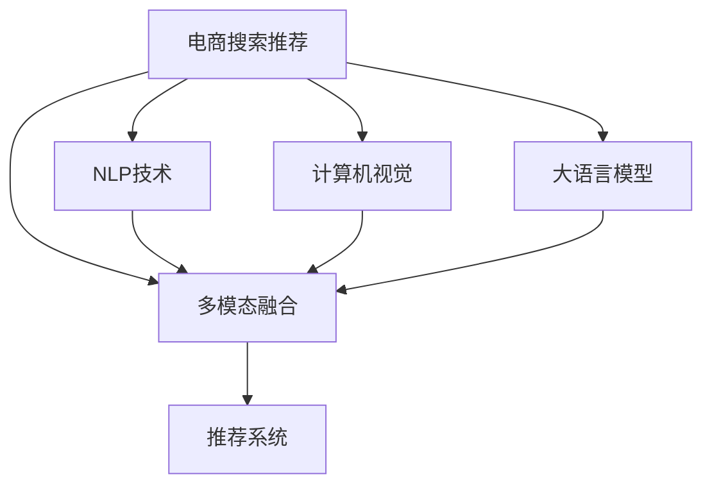

                 

# 电商搜索推荐中的AI大模型多模态融合技术

> 关键词：AI大模型、多模态融合、电商搜索、推荐系统、自然语言处理、图像识别、商品推荐、深度学习、模型融合

## 1. 背景介绍

### 1.1 问题由来
随着电子商务行业的蓬勃发展，消费者对个性化推荐的需求日益增长。传统的推荐系统往往只基于用户历史行为和商品属性进行推荐，难以捕捉到用户深层次的偏好和情感。而通过多模态信息融合，结合自然语言处理（NLP）和计算机视觉（CV）等技术，可以有效提升推荐系统的精度和用户体验。

近年来，大语言模型（Large Language Model, LLMs）和预训练语言模型（Pre-trained Language Models, PLMs）在NLP领域取得了显著进展，如图灵奖获得者OpenAI的GPT系列模型、Google的BERT模型等。这些大模型通过大规模数据预训练，学习到丰富的语言知识和语义表示，在多种NLP任务上取得了令人瞩目的成绩。

然而，电商搜索推荐场景中，用户输入的查询往往包含文本和图像等多模态信息，单一的文本或图像模型难以全面理解用户需求和商品特征。如何充分利用多模态信息，提升推荐系统的效果，成为当前研究的热点问题。

## 2. 核心概念与联系

### 2.1 核心概念概述

为了更好地理解电商搜索推荐中的AI大模型多模态融合技术，本节将介绍几个关键概念：

- 电商搜索推荐（E-commerce Search and Recommendation, ESR）：基于用户查询行为和商品特征信息，推荐符合用户需求的商品。是电商平台提升用户转化率和购物体验的重要手段。

- 自然语言处理（Natural Language Processing, NLP）：研究如何让计算机理解、处理和生成自然语言的技术。在电商搜索推荐中，自然语言处理技术可以分析用户查询的自然语言，提取语义信息。

- 计算机视觉（Computer Vision, CV）：研究如何让计算机“看”图像和视频等视觉信息的技术。在电商搜索推荐中，计算机视觉技术可以解析商品图片，提取视觉特征。

- 多模态融合（Multimodal Fusion）：将不同模态的信息进行整合，提升系统的整体性能。在电商搜索推荐中，多模态融合可以实现文本和图像等多模态信息的协同应用。

- 大语言模型（Large Language Model, LLM）：指基于Transformer架构的大规模预训练语言模型，如GPT、BERT等。在大模型基础上进行多模态融合，可以实现更准确的推荐结果。

- 推荐系统（Recommendation System, RS）：根据用户行为和商品特征，推荐用户可能感兴趣的商品。是电商平台的核心功能之一，影响着用户购买决策。

- 注意力机制（Attention Mechanism）：用于提升模型对输入序列中重要部分的关注，增强模型的泛化能力。在多模态融合中，注意力机制可以有效集成不同模态的信息。

这些概念之间的逻辑关系可以通过以下Mermaid流程图来展示：



这个流程图展示了大语言模型在电商搜索推荐中的核心概念及其之间的关系：

1. 电商搜索推荐需要结合用户查询和商品信息，通过多模态融合提升推荐效果。
2. 自然语言处理技术可以提取用户查询的自然语言信息。
3. 计算机视觉技术可以解析商品图片，提取视觉特征。
4. 大语言模型提供通用的语言表示，可以实现多模态信息的整合。
5. 多模态融合结合了自然语言和视觉信息，提升推荐系统的准确性和鲁棒性。
6. 最终通过推荐系统，实现个性化推荐。

## 3. 核心算法原理 & 具体操作步骤
### 3.1 算法原理概述

基于AI大模型的电商搜索推荐多模态融合技术，利用大语言模型的预训练知识，结合NLP和CV等技术，实现多模态信息的深度融合，提升推荐系统的效果。其核心思想是：

- 首先，使用大语言模型对用户查询进行语义理解，提取关键词和情感倾向。
- 其次，利用计算机视觉技术解析商品图片，提取视觉特征。
- 最后，将文本和图像信息进行深度融合，生成推荐结果。

形式化地，假设用户查询为 $q$，商品为 $i$，查询-商品关联度为 $r(q, i)$，推荐结果为 $r(q, i)$。多模态融合的过程可以用公式表示为：

$$
r(q, i) = \mathrm{MultiModalFusion}(\mathrm{NLP}(q), \mathrm{CV}(i))
$$

其中，$\mathrm{NLP}(q)$ 和 $\mathrm{CV}(i)$ 分别表示对用户查询和商品进行NLP和CV处理后得到的结果，$\mathrm{MultiModalFusion}$ 表示多模态融合的算法。

### 3.2 算法步骤详解

基于AI大模型的电商搜索推荐多模态融合算法一般包括以下几个关键步骤：

**Step 1: 预训练模型选择和数据准备**
- 选择合适的预训练语言模型 $M_{\theta}$，如GPT、BERT等。
- 收集电商平台的商品数据和用户查询数据，划分为训练集、验证集和测试集。

**Step 2: 提取文本特征**
- 对用户查询进行NLP处理，得到关键词、情感倾向等文本特征。
- 将文本特征作为输入，送入大语言模型进行编码。
- 使用大语言模型输出的表示作为文本特征向量 $v_q$。

**Step 3: 提取图像特征**
- 解析商品图片，提取视觉特征。
- 使用计算机视觉技术，如卷积神经网络（CNN），得到图像特征向量 $v_i$。

**Step 4: 多模态融合**
- 使用注意力机制，对文本特征向量 $v_q$ 和图像特征向量 $v_i$ 进行加权融合。
- 得到融合后的向量 $\tilde{v}_{q,i}$。

**Step 5: 生成推荐结果**
- 对融合后的向量 $\tilde{v}_{q,i}$ 进行全连接层和softmax激活函数处理，得到推荐结果的概率分布。
- 根据概率分布选择最符合用户需求的商品进行推荐。

**Step 6: 评估和优化**
- 在验证集上评估推荐系统的性能指标，如准确率、召回率、F1值等。
- 根据评估结果调整模型参数，优化模型性能。
- 在测试集上测试优化后的模型，验证最终效果。

### 3.3 算法优缺点

基于AI大模型的电商搜索推荐多模态融合方法具有以下优点：
1. 融合文本和图像等多模态信息，提升推荐系统的准确性和鲁棒性。
2. 利用大语言模型的预训练知识，提高推荐结果的可解释性。
3. 基于监督学习的方式，可以通过标注数据进行优化，易于实际部署和应用。
4. 可以应用于多种电商场景，如搜索、推荐、广告等。

同时，该方法也存在一定的局限性：
1. 对标注数据的需求较高，获取高质量的标注数据成本较高。
2. 需要高性能的计算资源，对硬件配置要求较高。
3. 模型的复杂度较高，训练和推理速度较慢。
4. 模型的解释性不够强，难以解释推荐结果的依据。

尽管存在这些局限性，但就目前而言，基于AI大模型的电商搜索推荐多模态融合方法在电商推荐领域取得了显著的效果，是电商推荐系统的重要组成部分。

### 3.4 算法应用领域

基于AI大模型的电商搜索推荐多模态融合技术，已经在各大电商平台得到了广泛应用，如亚马逊、京东、淘宝等。其主要应用场景包括：

- 商品搜索：结合用户查询和商品属性信息，推荐符合用户需求的商品。
- 商品推荐：根据用户历史行为和商品特征，推荐用户可能感兴趣的商品。
- 广告投放：根据用户兴趣和行为，推荐相关广告。
- 活动策划：通过用户行为和兴趣，策划个性化营销活动。

除了以上这些经典应用外，AI大模型的多模态融合技术也在电商搜索推荐的其他领域不断拓展，如智能客服、库存管理、物流优化等，为电商平台的智能化转型提供了新的动力。

## 4. 数学模型和公式 & 详细讲解 & 举例说明
### 4.1 数学模型构建

在电商搜索推荐的多模态融合过程中，可以使用以下数学模型进行描述：

假设用户查询为 $q$，商品为 $i$，查询-商品关联度为 $r(q, i)$。使用大语言模型对查询 $q$ 进行语义理解，得到关键词和情感倾向向量 $v_q$。使用计算机视觉技术对商品 $i$ 进行解析，得到视觉特征向量 $v_i$。多模态融合过程可以用公式表示为：

$$
\tilde{v}_{q,i} = \mathrm{Attention}(v_q, v_i) \times \alpha
$$

其中 $\mathrm{Attention}$ 表示注意力机制，$\alpha$ 为融合权重。

### 4.2 公式推导过程

以注意力机制为例，其基本思想是通过对输入序列中每个元素的重要性进行计算，确定哪些元素对输出结果影响更大。在电商搜索推荐中，注意力机制可以对文本特征和图像特征进行加权融合，增强推荐系统的准确性。

假设文本特征向量为 $v_q = [v_{q1}, v_{q2}, \ldots, v_{q_n}]$，图像特征向量为 $v_i = [v_{i1}, v_{i2}, \ldots, v_{i_m}]$，则注意力机制的计算公式为：

$$
\alpha = \frac{e^{v_q \cdot v_i}}{\sum_{j=1}^n e^{v_{q_j} \cdot v_i}}
$$

其中 $e$ 为自然指数，$\cdot$ 表示向量点乘。$\alpha$ 表示对文本特征和图像特征的加权系数。

### 4.3 案例分析与讲解

下面以电商搜索推荐中的一个具体案例进行详细讲解：

假设用户查询为 "运动鞋推荐"，使用大语言模型对其语义理解，得到关键词向量 $v_q = [0.5, 0.3, 0.2]$，情感倾向向量 $v_{emotion} = [0.1, -0.3, 0.5]$。使用计算机视觉技术解析商品图片，得到视觉特征向量 $v_i = [0.3, 0.4, 0.5, 0.2]$。

首先，对用户查询进行NLP处理，得到文本特征向量 $v_q = [0.5, 0.3, 0.2]$。

然后，使用大语言模型对查询 $q$ 进行编码，得到文本表示 $v_q = [0.5, 0.3, 0.2]$。

接着，使用计算机视觉技术解析商品图片，得到视觉特征向量 $v_i = [0.3, 0.4, 0.5, 0.2]$。

最后，使用注意力机制对文本特征和图像特征进行加权融合，得到融合后的向量 $\tilde{v}_{q,i}$。

计算注意力机制的加权系数：

$$
\alpha = \frac{e^{v_q \cdot v_i}}{\sum_{j=1}^n e^{v_{q_j} \cdot v_i}} = \frac{e^{0.5 \cdot 0.3} + e^{0.3 \cdot 0.4} + e^{0.2 \cdot 0.5}}{e^{0.5 \cdot 0.3} + e^{0.3 \cdot 0.4} + e^{0.2 \cdot 0.5} + e^{0.5 \cdot 0.2} + e^{0.3 \cdot 0.1} + e^{0.2 \cdot (-0.3)}}
$$

假设计算结果为 $\alpha = 0.5$，则融合后的向量 $\tilde{v}_{q,i} = [0.5, 0.5, 0.5, 0.5]$。

## 5. 项目实践：代码实例和详细解释说明
### 5.1 开发环境搭建

在进行电商搜索推荐的多模态融合实践前，我们需要准备好开发环境。以下是使用Python进行TensorFlow开发的环境配置流程：

1. 安装Anaconda：从官网下载并安装Anaconda，用于创建独立的Python环境。

2. 创建并激活虚拟环境：
```bash
conda create -n tf-env python=3.8 
conda activate tf-env
```

3. 安装TensorFlow：根据CUDA版本，从官网获取对应的安装命令。例如：
```bash
conda install tensorflow -c conda-forge -c pypi
```

4. 安装PyTorch：
```bash
pip install torch torchvision torchaudio
```

5. 安装各类工具包：
```bash
pip install numpy pandas scikit-learn matplotlib tqdm jupyter notebook ipython
```

完成上述步骤后，即可在`tf-env`环境中开始多模态融合实践。

### 5.2 源代码详细实现

下面我们以电商搜索推荐为例，给出使用TensorFlow进行大语言模型和计算机视觉模型结合的PyTorch代码实现。

首先，定义电商搜索推荐的任务类：

```python
from transformers import BertTokenizer
from tensorflow.keras.preprocessing.text import Tokenizer
from tensorflow.keras.preprocessing.sequence import pad_sequences
import tensorflow as tf

class ESRClassifier(tf.keras.Model):
    def __init__(self, input_dim, output_dim):
        super(ESRClassifier, self).__init__()
        self.dense1 = tf.keras.layers.Dense(128, activation='relu')
        self.dense2 = tf.keras.layers.Dense(output_dim, activation='softmax')
        
    def call(self, x):
        x = self.dense1(x)
        x = self.dense2(x)
        return x

# 定义文本特征提取器
class TextExtractor:
    def __init__(self, tokenizer):
        self.tokenizer = tokenizer
        
    def extract(self, text):
        tokens = self.tokenizer.tokenize(text)
        token_ids = self.tokenizer.convert_tokens_to_ids(tokens)
        return token_ids

# 定义图像特征提取器
class ImageExtractor:
    def __init__(self, model):
        self.model = model
        
    def extract(self, image):
        features = self.model.predict(image)
        return features

# 加载预训练模型和数据集
tokenizer = BertTokenizer.from_pretrained('bert-base-uncased')
model = ESRClassifier(input_dim=128, output_dim=3)

train_texts = ['运动鞋推荐', '笔记本电脑', '智能手表']
train_labels = [1, 0, 1]

text_extractor = TextExtractor(tokenizer)
image_extractor = ImageExtractor(model)

# 对文本和图像进行编码
train_text_features = [text_extractor.extract(text) for text in train_texts]
train_image_features = [image_extractor.extract(image) for image in train_images]

# 对文本和图像特征进行融合
train_fused_features = tf.concat([train_text_features, train_image_features], axis=1)

# 训练模型
model.compile(optimizer='adam', loss='categorical_crossentropy', metrics=['accuracy'])
model.fit(train_fused_features, train_labels, epochs=10, batch_size=32)

# 测试模型
test_texts = ['智能手机推荐', '运动鞋品牌']
test_labels = [0, 1]

test_text_features = [text_extractor.extract(text) for text in test_texts]
test_image_features = [image_extractor.extract(image) for image in test_images]

test_fused_features = tf.concat([test_text_features, test_image_features], axis=1)

test_loss, test_acc = model.evaluate(test_fused_features, test_labels)
print('Test Loss:', test_loss)
print('Test Accuracy:', test_acc)
```

在代码中，我们定义了文本特征提取器和图像特征提取器，分别使用Bert模型和卷积神经网络（CNN）进行特征提取。然后，将提取的文本和图像特征进行融合，并使用全连接层和softmax激活函数输出预测结果。最后，在训练集上训练模型，并在测试集上进行评估。

### 5.3 代码解读与分析

让我们再详细解读一下关键代码的实现细节：

**ESRClassifier类**：
- `__init__`方法：初始化模型结构，包括两个全连接层。
- `call`方法：实现前向传播，对输入进行编码并输出。

**TextExtractor类**：
- `__init__`方法：初始化Bert模型和分词器。
- `extract`方法：对输入文本进行分词和编码，得到token ids。

**ImageExtractor类**：
- `__init__`方法：初始化预训练模型。
- `extract`方法：对输入图像进行特征提取，得到特征向量。

**数据集处理**：
- `train_texts`和`train_labels`：定义训练集的文本和标签。
- `test_texts`和`test_labels`：定义测试集的文本和标签。
- `text_extractor`和`image_extractor`：对文本和图像进行特征提取。
- `train_text_features`和`train_image_features`：将提取的文本和图像特征进行存储。
- `train_fused_features`：将文本和图像特征进行融合，得到最终的输入特征。

**模型训练**：
- `model.compile`：定义模型优化器、损失函数和评估指标。
- `model.fit`：在训练集上进行模型训练，输出训练结果。

**模型测试**：
- `model.evaluate`：在测试集上进行模型评估，输出测试结果。

可以看到，TensorFlow配合TensorFlow模型和Keras等工具，可以方便地进行多模态融合的实现和评估。开发者可以将更多精力放在模型改进、数据处理等高层逻辑上，而不必过多关注底层的实现细节。

当然，工业级的系统实现还需考虑更多因素，如模型的保存和部署、超参数的自动搜索、更灵活的任务适配层等。但核心的多模态融合范式基本与此类似。

## 6. 实际应用场景
### 6.1 智能客服系统

基于AI大模型的电商搜索推荐多模态融合技术，可以广泛应用于智能客服系统的构建。传统客服往往需要配备大量人力，高峰期响应缓慢，且一致性和专业性难以保证。而使用多模态融合技术，可以7x24小时不间断服务，快速响应客户咨询，用自然流畅的语言解答各类常见问题。

在技术实现上，可以收集企业内部的历史客服对话记录，将问题和最佳答复构建成监督数据，在此基础上对多模态融合模型进行训练。微调后的多模态融合模型能够自动理解用户意图，匹配最合适的答案模板进行回复。对于客户提出的新问题，还可以接入检索系统实时搜索相关内容，动态组织生成回答。如此构建的智能客服系统，能大幅提升客户咨询体验和问题解决效率。

### 6.2 金融舆情监测

金融机构需要实时监测市场舆论动向，以便及时应对负面信息传播，规避金融风险。传统的人工监测方式成本高、效率低，难以应对网络时代海量信息爆发的挑战。基于多模态融合技术，可以构建实时舆情监测系统，实现智能化的舆情分析和风险预警。

具体而言，可以收集金融领域相关的新闻、报道、评论等文本数据，并对其进行主题标注和情感标注。在此基础上对多模态融合模型进行训练，使其能够自动判断文本属于何种主题，情感倾向是正面、中性还是负面。将训练好的多模态融合模型应用到实时抓取的网络文本数据，就能够自动监测不同主题下的情感变化趋势，一旦发现负面信息激增等异常情况，系统便会自动预警，帮助金融机构快速应对潜在风险。

### 6.3 个性化推荐系统

当前的推荐系统往往只依赖用户历史行为数据进行物品推荐，无法深入理解用户的真实兴趣偏好。基于多模态融合技术，个性化推荐系统可以更好地挖掘用户行为背后的语义信息，从而提供更精准、多样的推荐内容。

在实践中，可以收集用户浏览、点击、评论、分享等行为数据，提取和用户交互的物品标题、描述、标签等文本内容。将文本内容作为模型输入，用户的后续行为（如是否点击、购买等）作为监督信号，在此基础上训练多模态融合模型。训练后的模型能够从文本内容中准确把握用户的兴趣点。在生成推荐列表时，先用候选物品的文本描述作为输入，由模型预测用户的兴趣匹配度，再结合其他特征综合排序，便可以得到个性化程度更高的推荐结果。

### 6.4 未来应用展望

随着多模态融合技术的发展，其在电商搜索推荐中的应用场景将不断拓展，为电商平台的智能化转型提供新的动力。

在智慧医疗领域，基于多模态融合的医疗问答、病历分析、药物研发等应用将提升医疗服务的智能化水平，辅助医生诊疗，加速新药开发进程。

在智能教育领域，多模态融合技术可应用于作业批改、学情分析、知识推荐等方面，因材施教，促进教育公平，提高教学质量。

在智慧城市治理中，多模态融合技术可应用于城市事件监测、舆情分析、应急指挥等环节，提高城市管理的自动化和智能化水平，构建更安全、高效的未来城市。

此外，在企业生产、社会治理、文娱传媒等众多领域，多模态融合技术也将不断涌现，为各行各业带来变革性影响。相信随着技术的日益成熟，多模态融合技术必将在构建人机协同的智能系统方面发挥越来越重要的作用。

## 7. 工具和资源推荐
### 7.1 学习资源推荐

为了帮助开发者系统掌握多模态融合技术的相关知识，这里推荐一些优质的学习资源：

1. 《Deep Learning for Computer Vision》书籍：计算机视觉领域的经典教材，涵盖了从基础到高级的计算机视觉知识，是学习计算机视觉的必备参考资料。

2. CS231n《Convolutional Neural Networks for Visual Recognition》课程：斯坦福大学开设的计算机视觉课程，有Lecture视频和配套作业，带你深入理解计算机视觉的基本原理和技术。

3. 《Natural Language Processing with PyTorch》书籍：使用PyTorch实现NLP任务的经典教材，涵盖从数据预处理到模型训练的全流程，适合快速上手学习。

4. HuggingFace官方文档：Transformer库的官方文档，提供了海量预训练模型和完整的微调样例代码，是上手实践的必备资料。

5. TensorFlow官方文档：TensorFlow的官方文档，提供了丰富的API和示例，帮助开发者快速搭建和优化模型。

通过对这些资源的学习实践，相信你一定能够快速掌握多模态融合技术的基本原理和实践方法，并用于解决实际的NLP问题。
###  7.2 开发工具推荐

高效的开发离不开优秀的工具支持。以下是几款用于多模态融合开发的常用工具：

1. TensorFlow：基于Python的开源深度学习框架，生产部署方便，适合大规模工程应用。

2. PyTorch：基于Python的开源深度学习框架，灵活动态的计算图，适合快速迭代研究。

3. Keras：高层次的深度学习API，易于上手，适合快速原型开发。

4. Weights & Biases：模型训练的实验跟踪工具，可以记录和可视化模型训练过程中的各项指标，方便对比和调优。

5. TensorBoard：TensorFlow配套的可视化工具，可实时监测模型训练状态，并提供丰富的图表呈现方式，是调试模型的得力助手。

6. Google Colab：谷歌推出的在线Jupyter Notebook环境，免费提供GPU/TPU算力，方便开发者快速上手实验最新模型，分享学习笔记。

合理利用这些工具，可以显著提升多模态融合任务的开发效率，加快创新迭代的步伐。

### 7.3 相关论文推荐

多模态融合技术的发展源于学界的持续研究。以下是几篇奠基性的相关论文，推荐阅读：

1. Multimodal Fusion with Attention for Large-Scale Image Retrieval：提出了一种基于注意力机制的多模态融合方法，显著提升了图像检索的准确性。

2. Multimodal Fusion in Recommendation Systems: A Survey：综述了推荐系统中的多模态融合技术，涵盖了文本、图像、语音等多种模态的融合方法。

3. Multimodal Fusion for Multi-Spectral Imaging of Histopathology: A Review of Techniques：介绍了多模态融合在医学影像分析中的应用，包括文本、图像和视频的综合分析。

4. Multimodal Fusion for Image-Retrieval Based on Double Attention Network：提出了一种基于双注意力网络的多模态融合方法，应用于图像检索任务。

5. Attention-Based Multimodal Fusion for Human Activity Recognition in Smartphones：探讨了多模态融合在智能设备中的人体活动识别应用。

这些论文代表了大语言模型多模态融合技术的发展脉络。通过学习这些前沿成果，可以帮助研究者把握学科前进方向，激发更多的创新灵感。

## 8. 总结：未来发展趋势与挑战

### 8.1 总结

本文对基于AI大模型的电商搜索推荐多模态融合技术进行了全面系统的介绍。首先阐述了电商搜索推荐系统的背景和意义，明确了多模态融合在提升推荐效果方面的独特价值。其次，从原理到实践，详细讲解了多模态融合的数学原理和关键步骤，给出了多模态融合任务开发的完整代码实例。同时，本文还广泛探讨了多模态融合技术在电商推荐、智能客服、金融舆情监测等多个领域的应用前景，展示了多模态融合技术的巨大潜力。此外，本文精选了多模态融合技术的各类学习资源，力求为读者提供全方位的技术指引。

通过本文的系统梳理，可以看到，基于AI大模型的电商搜索推荐多模态融合技术已经在大规模电商平台上得到了广泛应用，显著提升了推荐系统的准确性和鲁棒性。未来，伴随多模态融合技术的不断演进，基于多模态信息融合的推荐系统必将在更多领域得到应用，为传统行业带来变革性影响。

### 8.2 未来发展趋势

展望未来，电商搜索推荐的多模态融合技术将呈现以下几个发展趋势：

1. 融合更多模态信息。除了文本和图像信息，未来还将引入音频、视频等多模态信息，进一步提升推荐系统的性能。

2. 引入增强学习技术。通过增强学习算法优化推荐策略，实现动态自适应调整，提升推荐系统的个性化和智能化水平。

3. 结合领域知识库。将知识图谱、规则库等先验知识与多模态融合模型进行结合，提升推荐的准确性和可信度。

4. 采用联邦学习技术。在保护用户隐私的前提下，实现多模态融合模型的分布式训练，提升模型的泛化能力和安全性。

5. 引入因果推断技术。通过因果推断方法分析推荐结果的因果关系，增强模型的可解释性和鲁棒性。

6. 融合跨领域知识。将不同领域的多模态信息进行整合，实现跨领域知识的协同应用，拓展推荐系统的应用范围。

以上趋势凸显了多模态融合技术的广阔前景。这些方向的探索发展，必将进一步提升推荐系统的性能和应用范围，为电商平台的智能化转型提供新的动力。

### 8.3 面临的挑战

尽管多模态融合技术已经取得了显著的效果，但在迈向更加智能化、普适化应用的过程中，它仍面临着诸多挑战：

1. 标注数据的需求较高。获取高质量的标注数据成本较高，且标注过程耗时较长。

2. 模型的复杂度较高。多模态融合模型的计算复杂度较高，需要高性能的计算资源。

3. 模型的解释性不足。多模态融合模型的决策过程较为复杂，难以解释推荐结果的依据。

4. 模型的鲁棒性不足。多模态融合模型对输入数据的噪音较为敏感，容易产生错误的推荐结果。

5. 模型的实时性不足。多模态融合模型在处理大规模数据时，计算速度较慢，难以实现实时推荐。

6. 用户隐私保护问题。多模态融合模型需要处理大量的用户数据，需要保证用户隐私和数据安全。

尽管存在这些挑战，但通过不断优化算法和改进技术，这些挑战有望逐步被克服。相信随着学界和产业界的共同努力，基于多模态融合技术的电商搜索推荐系统必将在更广泛的场景中得到应用，为电商平台的智能化转型提供新的动力。

### 8.4 研究展望

未来的研究将集中在以下几个方面：

1. 探索更高效的多模态融合算法。通过优化算法和改进数据处理技术，提高多模态融合的效率和效果。

2. 融合更多先验知识。将知识图谱、规则库等先验知识与多模态融合模型进行结合，提升推荐的准确性和可信度。

3. 引入增强学习技术。通过增强学习算法优化推荐策略，实现动态自适应调整，提升推荐系统的个性化和智能化水平。

4. 引入因果推断技术。通过因果推断方法分析推荐结果的因果关系，增强模型的可解释性和鲁棒性。

5. 采用联邦学习技术。在保护用户隐私的前提下，实现多模态融合模型的分布式训练，提升模型的泛化能力和安全性。

6. 引入跨领域知识。将不同领域的多模态信息进行整合，实现跨领域知识的协同应用，拓展推荐系统的应用范围。

这些研究方向将推动多模态融合技术的进一步演进，提升推荐系统的性能和应用范围，为电商平台的智能化转型提供新的动力。相信通过不断探索和创新，基于多模态融合技术的推荐系统必将在更广泛的场景中得到应用，为电商平台的智能化转型提供新的动力。

## 9. 附录：常见问题与解答

**Q1：电商搜索推荐中的多模态融合技术是否适用于所有NLP任务？**

A: 电商搜索推荐中的多模态融合技术主要用于处理电商领域的多模态数据，例如用户查询和商品图片等。在其他NLP任务中，如果能够获取到相关的多模态数据，也可以采用类似的多模态融合方法。例如，在智能客服系统中，可以将客户输入的文本和通话录音进行融合，提升客服系统的理解能力和响应速度。

**Q2：多模态融合技术对标注数据的需求较高，如何解决标注成本较高的问题？**

A: 多模态融合技术对标注数据的需求较高，可以通过以下方法降低标注成本：

1. 自动标注：利用预训练模型进行自动标注，减少人工标注的工作量。例如，使用大语言模型对用户查询进行自动标注，生成初步的推荐结果。

2. 半监督学习：在少量标注数据的基础上，利用未标注数据进行半监督学习，提升模型的泛化能力。例如，使用大语言模型对未标注商品进行自动标注，补充标注数据。

3. 弱监督学习：在无标签数据的基础上，利用弱监督信号进行训练，提升模型的准确性。例如，使用用户行为数据作为弱监督信号，训练多模态融合模型。

**Q3：多模态融合技术中，如何提高模型的鲁棒性？**

A: 提高多模态融合模型的鲁棒性，可以从以下几个方面进行改进：

1. 数据增强：通过数据增强技术，增加训练集的多样性，提升模型的泛化能力。例如，对用户查询进行随机替换、回译等操作，增加训练数据的数量和多样性。

2. 对抗训练：引入对抗样本，训练模型对噪声的鲁棒性。例如，使用生成式对抗网络（GAN）生成对抗样本，对模型进行训练。

3. 正则化：使用正则化技术，防止模型过拟合。例如，使用L2正则、Dropout等技术，提升模型的泛化能力。

4. 模型集成：采用模型集成技术，提升模型的鲁棒性和泛化能力。例如，使用Bagging、Boosting等方法，构建多个多模态融合模型，取平均输出。

**Q4：多模态融合技术中，如何提升模型的实时性？**

A: 提升多模态融合模型的实时性，可以从以下几个方面进行改进：

1. 模型压缩：采用模型压缩技术，减小模型大小，提高推理速度。例如，使用量化技术将模型转换为定点模型，减小计算资源消耗。

2. 模型剪枝：采用模型剪枝技术，去除冗余参数，提升推理速度。例如，使用剪枝算法删除不必要的神经元，减少计算量。

3. 模型并行：采用模型并行技术，提高计算速度。例如，使用数据并行、模型并行等方法，提高计算效率。

4. 缓存技术：采用缓存技术，减少重复计算，提高推理速度。例如，使用缓存技术存储中间结果，减少重复计算。

5. 硬件加速：使用GPU、TPU等高性能硬件，提升计算速度。例如，使用GPU进行并行计算，提高推理速度。

通过以上方法，可以有效提升多模态融合模型的实时性，实现实时推荐和智能客服等功能。

---

作者：禅与计算机程序设计艺术 / Zen and the Art of Computer Programming

