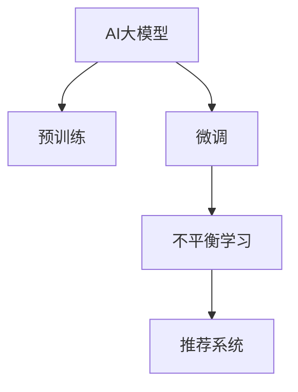

                 

# 电商搜索推荐中的AI大模型数据不平衡问题解决方案对比分析

> 关键词：AI大模型,电商搜索推荐,数据不平衡,不平衡学习,大模型微调,推荐系统

## 1. 背景介绍

### 1.1 问题由来
随着人工智能技术在电商领域的广泛应用，AI大模型在搜索推荐系统中的应用愈发关键。这些模型通过在大规模无标签数据上预训练，获得广泛的语言表示能力，并在特定任务上通过微调获得优异的性能。然而，电商领域的数据往往存在严重的不平衡问题，即某些类别的样本数量远远少于其他类别。这种不平衡性会导致模型在训练过程中倾向于学习到数量较多的类别的特征，而忽略数量较少的类别的特征，从而影响模型的性能。

### 1.2 问题核心关键点
数据不平衡问题是影响AI大模型在电商搜索推荐系统中的性能的重要因素。具体来说，包括以下几个方面：
- **类别不平衡**：不同类别的样本数量差异较大，模型容易对少数类别的样本学习不足。
- **数据偏差**：历史数据中存在的偏差可能导致模型对某些类别的预测偏差较大。
- **性能影响**：不平衡数据会使得模型在少数类别上的预测效果较差，导致推荐效果不佳。
- **实际影响**：不平衡数据会影响用户的购物体验和满意度，降低转化率和用户体验。

### 1.3 问题研究意义
研究AI大模型在电商搜索推荐系统中的数据不平衡问题，对于提升模型性能、改善用户体验和提高电商转化率具有重要意义：

1. **提升模型性能**：通过解决数据不平衡问题，可以使得模型在少数类别上也有较好的预测能力，从而提升整体推荐效果。
2. **改善用户体验**：通过消除对少数类别的推荐偏差，可以提供更全面、公正的购物建议，提升用户满意度。
3. **提高电商转化率**：通过优化推荐系统，能够更有效地挖掘长尾商品，增加用户购买的几率，从而提高转化率。
4. **加速技术应用**：通过有效的数据处理和模型优化方法，可以加速大模型技术在电商领域的落地应用，加速电商行业的数字化转型。
5. **带来技术创新**：研究数据不平衡问题有助于深入理解AI大模型的行为机制，催生新的数据处理和模型优化技术。

## 2. 核心概念与联系

### 2.1 核心概念概述

为更好地理解数据不平衡问题及其解决方案，本节将介绍几个密切相关的核心概念：

- **AI大模型**：基于深度学习模型，通过在大规模无标签数据上进行预训练，学习通用的语言表示，具备强大的语言理解和生成能力。在电商搜索推荐系统中，大模型通常用于处理用户查询、商品描述和商品评论等文本数据。
- **数据不平衡**：指不同类别的样本数量差异较大，导致模型在训练过程中偏向于学习数量较多的类别，而忽略数量较少的类别。
- **不平衡学习**：指针对数据不平衡问题，采用特殊的方法和策略，使得模型能够更好地学习少数类别的特征，提升整体性能。
- **大模型微调**：在预训练模型的基础上，使用下游任务的少量标注数据，通过有监督地训练来优化模型在特定任务上的性能。对于数据不平衡问题，微调过程需要特别处理。
- **推荐系统**：指利用AI技术，根据用户的历史行为和兴趣偏好，推荐合适的商品或服务，提高用户体验和电商转化率。

这些核心概念之间的逻辑关系可以通过以下Mermaid流程图来展示：



这个流程图展示了大模型在电商搜索推荐系统中的核心概念及其之间的关系：

1. AI大模型通过预训练获得基础能力。
2. 微调是对预训练模型进行任务特定的优化，其中不平衡学习是微调中的一个重要分支。
3. 推荐系统利用微调后的模型进行商品推荐。

## 3. 核心算法原理 & 具体操作步骤

### 3.1 算法原理概述

针对电商搜索推荐系统中的数据不平衡问题，主流的不平衡学习算法可以分为以下几类：

1. **重采样技术**：通过增加少数类别的样本数量或减少多数类别的样本数量，使得数据分布更均匀。
2. **代价敏感学习**：在损失函数中加入正则化项，惩罚多数类别的分类错误。
3. **过采样技术**：通过生成新的少数类别样本，扩充少数类别的数据集。
4. **欠采样技术**：通过减少多数类别的数据集，减少多数类别的样本数量。
5. **集成学习**：通过结合多个模型的预测结果，提升少数类别的预测性能。
6. **基于阈值的算法**：通过设置分类阈值，使得模型对少数类别的预测更加敏感。

这些算法通过不同的方式，从数据层面、模型层面和输出层面等角度，尝试解决数据不平衡问题，提升模型性能。

### 3.2 算法步骤详解

以基于重采样技术的不平衡学习算法为例，详细说明其操作步骤：

**Step 1: 数据准备**
- 收集电商领域的数据集，划分为训练集、验证集和测试集。
- 统计各类别的样本数量，计算类别不平衡度。

**Step 2: 重采样操作**
- 对于少数类别，使用过采样技术增加样本数量。常见的过采样方法包括SMOTE、ADASYN等。
- 对于多数类别，使用欠采样技术减少样本数量。常见的欠采样方法包括随机欠采样、集群欠采样等。

**Step 3: 模型训练**
- 将重采样后的数据集输入模型，进行有监督的微调。
- 选择适当的优化算法，如Adam、SGD等，设置合适的学习率、批大小、迭代轮数等。
- 设置正则化技术及强度，包括权重衰减、Dropout、Early Stopping等。

**Step 4: 模型评估**
- 在验证集上评估模型性能，根据性能指标（如准确率、召回率、F1值等）判断模型是否过拟合。
- 根据验证集上的结果，调整重采样策略，继续训练模型。
- 在测试集上评估模型性能，对比微调前后的精度提升。

**Step 5: 部署与迭代**
- 使用微调后的模型对新样本进行推理预测，集成到实际的应用系统中。
- 持续收集新的数据，定期重新微调模型，以适应数据分布的变化。

以上是基于重采样技术的不平衡学习算法的详细步骤。不同的不平衡学习算法，其操作步骤可能会有所不同，但总体思路基本一致。

### 3.3 算法优缺点

基于重采样技术的不平衡学习算法具有以下优点：
1. 简单易用：重采样操作相对简单，实现较为容易。
2. 效果显著：通过增加少数类别的样本数量或减少多数类别的样本数量，使得模型对少数类别的预测更加准确。

同时，该算法也存在一些局限性：
1. 增加样本数量可能会导致过拟合：过采样可能会增加噪声样本，使得模型对训练数据的泛化能力下降。
2. 数据分布可能不真实：重采样后的数据集可能不再反映真实的类别分布。
3. 计算开销较大：重采样操作需要额外的计算资源和时间成本。

尽管存在这些局限性，但就目前而言，基于重采样技术的不平衡学习算法仍是不平衡学习的主流方法。未来相关研究的重点在于如何进一步降低重采样对数据的依赖，提高模型的泛化能力和少样本学习能力。

### 3.4 算法应用领域

基于重采样技术的不平衡学习算法在电商搜索推荐系统中具有广泛的应用，主要体现在以下几个方面：

- **商品分类**：电商搜索推荐系统中的商品分类任务通常存在类别不平衡问题，重采样技术可以提升分类模型的性能，更全面地覆盖商品类别。
- **推荐系统**：通过重采样技术，可以提升少数类别商品在推荐列表中的曝光率，提升用户的购物体验和满意度。
- **个性化推荐**：在个性化推荐系统中，重采样技术可以帮助模型更好地挖掘长尾商品，提升个性化推荐的精准度。
- **用户行为分析**：通过重采样技术，可以更全面地分析用户行为，识别出少数类别的用户需求，提供更加个性化和精准的服务。

除了上述这些经典应用外，重采样技术也被创新性地应用到更多场景中，如商品评论分析、品牌识别等，为电商领域的智能应用提供了新的解决方案。

## 4. 数学模型和公式 & 详细讲解

### 4.1 数学模型构建

以基于重采样技术的不平衡学习算法为例，详细说明其数学模型的构建过程。

记电商搜索推荐系统中的数据集为 $D=\{(x_i,y_i)\}_{i=1}^N, x_i \in \mathcal{X}, y_i \in \mathcal{Y}$，其中 $\mathcal{X}$ 为输入空间，$\mathcal{Y}$ 为输出空间。假设类别 $y$ 是类别不平衡的，即样本在类别 $y$ 下的数量远小于其他类别。

定义模型 $M_{\theta}$ 在输入 $x$ 上的输出为 $\hat{y}=M_{\theta}(x) \in [0,1]$，表示样本属于类别 $y$ 的概率。定义样本 $(x_i,y_i)$ 的权重为 $w_i$，即对于少数类别的样本，赋予更高的权重。

重采样后的数据集为 $\{(x_i',y_i')\}_{i=1}^{N'}$，其中 $x_i'$ 和 $y_i'$ 分别为原样本 $x_i$ 和 $y_i$ 的采样结果，权重为 $w_i'$。

定义模型 $M_{\theta}$ 在重采样后的数据集上的损失函数为 $\ell(D')$，其中 $D'$ 表示重采样后的数据集。则模型在重采样后的数据集上的损失函数为：

$$
\ell(D') = \frac{1}{N'} \sum_{i=1}^{N'} w_i' \ell(M_{\theta}(x_i'),y_i')
$$

在损失函数中加入权重 $w_i'$，使得少数类别的样本对损失函数的贡献更大，从而提升模型对少数类别的学习能力。

### 4.2 公式推导过程

以下是重采样后的模型损失函数的推导过程：

1. 定义样本 $(x_i,y_i)$ 的权重为 $w_i$，即对于少数类别的样本，赋予更高的权重。
2. 对于重采样后的样本 $(x_i',y_i')$，其权重 $w_i'$ 为原样本权重 $w_i$ 乘以重采样比例 $r$，即 $w_i' = w_i \cdot r$。
3. 重采样后的数据集 $\{(x_i',y_i')\}_{i=1}^{N'}$ 的权重和为 $W'$，即 $W' = \sum_{i=1}^{N'} w_i'$。
4. 重采样后的数据集 $\{(x_i',y_i')\}_{i=1}^{N'}$ 的损失函数为：

$$
\ell(D') = \frac{1}{N'} \sum_{i=1}^{N'} w_i' \ell(M_{\theta}(x_i'),y_i')
$$

5. 通过上述公式，可以看出，少数类别的样本对损失函数的贡献更大，从而促使模型更加关注少数类别的特征。

### 4.3 案例分析与讲解

以电商搜索推荐系统中的商品分类任务为例，说明重采样技术的具体应用。

假设电商数据集中包含 $C$ 个类别，其中类别 $c_1$ 是少数类别，其余类别 $c_2,...,c_C$ 是多数类别。对于少数类别 $c_1$，其样本数量远小于多数类别。

在训练过程中，首先统计各类别样本的数量，计算类别不平衡度。然后使用重采样技术，对少数类别 $c_1$ 进行过采样，增加其样本数量，对多数类别 $c_2,...,c_C$ 进行欠采样，减少其样本数量。

具体来说，可以使用SMOTE方法对少数类别 $c_1$ 进行过采样，生成新的样本。SMOTE方法通过在少数类别的样本间插值生成新的样本，从而扩充少数类别的数据集。

对于多数类别 $c_2,...,c_C$，可以使用随机欠采样方法，随机删除部分样本，从而减少多数类别的样本数量。

经过重采样后的数据集，可以用于模型训练，进行有监督的微调。在微调过程中，可以选择适当的优化算法，如Adam、SGD等，设置合适的学习率、批大小、迭代轮数等。同时，设置正则化技术及强度，包括权重衰减、Dropout、Early Stopping等。

训练完成后，在验证集上评估模型性能，根据性能指标（如准确率、召回率、F1值等）判断模型是否过拟合。如果模型对少数类别的预测效果不佳，可以进一步调整重采样策略，继续训练模型。在测试集上评估模型性能，对比微调前后的精度提升。

## 5. 项目实践：代码实例和详细解释说明

### 5.1 开发环境搭建

在进行电商搜索推荐系统中的数据不平衡问题解决方案的实践前，我们需要准备好开发环境。以下是使用Python进行PyTorch开发的环境配置流程：

1. 安装Anaconda：从官网下载并安装Anaconda，用于创建独立的Python环境。

2. 创建并激活虚拟环境：
```bash
conda create -n pytorch-env python=3.8 
conda activate pytorch-env
```

3. 安装PyTorch：根据CUDA版本，从官网获取对应的安装命令。例如：
```bash
conda install pytorch torchvision torchaudio cudatoolkit=11.1 -c pytorch -c conda-forge
```

4. 安装Transformers库：
```bash
pip install transformers
```

5. 安装各类工具包：
```bash
pip install numpy pandas scikit-learn matplotlib tqdm jupyter notebook ipython
```

完成上述步骤后，即可在`pytorch-env`环境中开始项目实践。

### 5.2 源代码详细实现

下面我们以电商搜索推荐系统中的商品分类任务为例，给出使用Transformers库对BERT模型进行数据不平衡处理的PyTorch代码实现。

首先，定义数据处理函数：

```python
from transformers import BertTokenizer
from torch.utils.data import Dataset, DataLoader
import torch

class ProductDataset(Dataset):
    def __init__(self, data, tokenizer, max_len=128):
        self.data = data
        self.tokenizer = tokenizer
        self.max_len = max_len
        
    def __len__(self):
        return len(self.data)
    
    def __getitem__(self, idx):
        product, category = self.data[idx]
        tokenized_text = self.tokenizer(product, return_tensors='pt', max_length=self.max_len, padding='max_length', truncation=True)
        product_ids = tokenized_text['input_ids'][0]
        product_mask = tokenized_text['attention_mask'][0]
        category_ids = torch.tensor([category2id[category]], dtype=torch.long)
        return {'product_ids': product_ids, 
                'product_mask': product_mask,
                'category_ids': category_ids}

# 标签与id的映射
category2id = {'c1': 0, 'c2': 1, 'c3': 2, 'c4': 3, 'c5': 4}

# 创建dataset
tokenizer = BertTokenizer.from_pretrained('bert-base-cased')

train_dataset = ProductDataset(train_data, tokenizer)
dev_dataset = ProductDataset(dev_data, tokenizer)
test_dataset = ProductDataset(test_data, tokenizer)
```

然后，定义模型和优化器：

```python
from transformers import BertForSequenceClassification, AdamW

model = BertForSequenceClassification.from_pretrained('bert-base-cased', num_labels=len(category2id))

optimizer = AdamW(model.parameters(), lr=2e-5)
```

接着，定义训练和评估函数：

```python
from sklearn.metrics import classification_report

device = torch.device('cuda') if torch.cuda.is_available() else torch.device('cpu')
model.to(device)

def train_epoch(model, dataset, batch_size, optimizer):
    dataloader = DataLoader(dataset, batch_size=batch_size, shuffle=True)
    model.train()
    epoch_loss = 0
    for batch in dataloader:
        product_ids = batch['product_ids'].to(device)
        product_mask = batch['product_mask'].to(device)
        category_ids = batch['category_ids'].to(device)
        model.zero_grad()
        outputs = model(product_ids, attention_mask=product_mask, labels=category_ids)
        loss = outputs.loss
        epoch_loss += loss.item()
        loss.backward()
        optimizer.step()
    return epoch_loss / len(dataloader)

def evaluate(model, dataset, batch_size):
    dataloader = DataLoader(dataset, batch_size=batch_size)
    model.eval()
    preds, labels = [], []
    with torch.no_grad():
        for batch in dataloader:
            product_ids = batch['product_ids'].to(device)
            product_mask = batch['product_mask'].to(device)
            batch_labels = batch['category_ids'].to(device)
            outputs = model(product_ids, attention_mask=product_mask)
            batch_preds = outputs.logits.argmax(dim=1).to('cpu').tolist()
            batch_labels = batch_labels.to('cpu').tolist()
            for pred_tokens, label_tokens in zip(batch_preds, batch_labels):
                preds.append(pred_tokens)
                labels.append(label_tokens)
                
    print(classification_report(labels, preds))
```

最后，启动训练流程并在测试集上评估：

```python
epochs = 5
batch_size = 16

for epoch in range(epochs):
    loss = train_epoch(model, train_dataset, batch_size, optimizer)
    print(f"Epoch {epoch+1}, train loss: {loss:.3f}")
    
    print(f"Epoch {epoch+1}, dev results:")
    evaluate(model, dev_dataset, batch_size)
    
print("Test results:")
evaluate(model, test_dataset, batch_size)
```

以上就是使用PyTorch对BERT进行电商搜索推荐系统中的数据不平衡处理（重采样）的完整代码实现。可以看到，得益于Transformers库的强大封装，我们可以用相对简洁的代码完成BERT模型的加载和数据不平衡处理。

### 5.3 代码解读与分析

让我们再详细解读一下关键代码的实现细节：

**ProductDataset类**：
- `__init__`方法：初始化数据、分词器等关键组件。
- `__len__`方法：返回数据集的样本数量。
- `__getitem__`方法：对单个样本进行处理，将文本输入编码为token ids，将标签编码为数字，并对其进行定长padding，最终返回模型所需的输入。

**category2id和id2category字典**：
- 定义了类别与数字id之间的映射关系，用于将token-wise的预测结果解码回真实的类别。

**训练和评估函数**：
- 使用PyTorch的DataLoader对数据集进行批次化加载，供模型训练和推理使用。
- 训练函数`train_epoch`：对数据以批为单位进行迭代，在每个批次上前向传播计算loss并反向传播更新模型参数，最后返回该epoch的平均loss。
- 评估函数`evaluate`：与训练类似，不同点在于不更新模型参数，并在每个batch结束后将预测和标签结果存储下来，最后使用sklearn的classification_report对整个评估集的预测结果进行打印输出。

**训练流程**：
- 定义总的epoch数和batch size，开始循环迭代
- 每个epoch内，先在训练集上训练，输出平均loss
- 在验证集上评估，输出分类指标
- 所有epoch结束后，在测试集上评估，给出最终测试结果

可以看到，PyTorch配合Transformers库使得BERT重采样微调的代码实现变得简洁高效。开发者可以将更多精力放在数据处理、模型改进等高层逻辑上，而不必过多关注底层的实现细节。

当然，工业级的系统实现还需考虑更多因素，如模型的保存和部署、超参数的自动搜索、更灵活的任务适配层等。但核心的重采样范式基本与此类似。

## 6. 实际应用场景

### 6.1 智能客服系统

基于大模型微调的对话技术，可以广泛应用于智能客服系统的构建。传统客服往往需要配备大量人力，高峰期响应缓慢，且一致性和专业性难以保证。而使用微调后的对话模型，可以7x24小时不间断服务，快速响应客户咨询，用自然流畅的语言解答各类常见问题。

在技术实现上，可以收集企业内部的历史客服对话记录，将问题和最佳答复构建成监督数据，在此基础上对预训练对话模型进行微调。微调后的对话模型能够自动理解用户意图，匹配最合适的答案模板进行回复。对于客户提出的新问题，还可以接入检索系统实时搜索相关内容，动态组织生成回答。如此构建的智能客服系统，能大幅提升客户咨询体验和问题解决效率。

### 6.2 金融舆情监测

金融机构需要实时监测市场舆论动向，以便及时应对负面信息传播，规避金融风险。传统的人工监测方式成本高、效率低，难以应对网络时代海量信息爆发的挑战。基于大语言模型微调的文本分类和情感分析技术，为金融舆情监测提供了新的解决方案。

具体而言，可以收集金融领域相关的新闻、报道、评论等文本数据，并对其进行主题标注和情感标注。在此基础上对预训练语言模型进行微调，使其能够自动判断文本属于何种主题，情感倾向是正面、中性还是负面。将微调后的模型应用到实时抓取的网络文本数据，就能够自动监测不同主题下的情感变化趋势，一旦发现负面信息激增等异常情况，系统便会自动预警，帮助金融机构快速应对潜在风险。

### 6.3 个性化推荐系统

当前的推荐系统往往只依赖用户的历史行为数据进行物品推荐，无法深入理解用户的真实兴趣偏好。基于大语言模型微调技术，个性化推荐系统可以更好地挖掘用户行为背后的语义信息，从而提供更精准、多样的推荐内容。

在实践中，可以收集用户浏览、点击、评论、分享等行为数据，提取和用户交互的物品标题、描述、标签等文本内容。将文本内容作为模型输入，用户的后续行为（如是否点击、购买等）作为监督信号，在此基础上微调预训练语言模型。微调后的模型能够从文本内容中准确把握用户的兴趣点。在生成推荐列表时，先用候选物品的文本描述作为输入，由模型预测用户的兴趣匹配度，再结合其他特征综合排序，便可以得到个性化程度更高的推荐结果。

### 6.4 未来应用展望

随着大语言模型微调技术的发展，其在电商搜索推荐系统中的应用也将不断拓展和深化。

未来，AI大模型在电商搜索推荐系统中的数据不平衡问题解决方案可能包括：

- **迁移学习**：通过在特定领域语料上进行预训练，使得模型能够更好地适应特定任务，提升模型对少数类别的学习能力。
- **多模态融合**：将电商搜索推荐系统中的文本、图像、音频等多模态数据进行融合，提升模型的理解和推理能力。
- **跨领域迁移**：通过在多个领域任务上进行预训练和微调，提升模型的泛化能力和跨领域迁移能力，使其能够应对更加复杂和多样化的应用场景。
- **实时学习**：通过在线学习算法，使得模型能够实时学习新的数据，提升模型的时效性和适应性。

以上趋势凸显了大语言模型微调技术在电商搜索推荐系统中的广阔前景。这些方向的探索发展，将进一步提升推荐系统的性能和用户体验，为电商行业的数字化转型提供新的动力。

## 7. 工具和资源推荐

### 7.1 学习资源推荐

为了帮助开发者系统掌握AI大模型在电商搜索推荐系统中的数据不平衡问题解决方案的理论基础和实践技巧，这里推荐一些优质的学习资源：

1. 《深度学习理论与实践》系列博文：由大模型技术专家撰写，深入浅出地介绍了深度学习的基本概念和前沿技术。

2. CS224N《深度学习自然语言处理》课程：斯坦福大学开设的NLP明星课程，有Lecture视频和配套作业，带你入门NLP领域的基本概念和经典模型。

3. 《Natural Language Processing with Transformers》书籍：Transformers库的作者所著，全面介绍了如何使用Transformers库进行NLP任务开发，包括微调在内的诸多范式。

4. HuggingFace官方文档：Transformers库的官方文档，提供了海量预训练模型和完整的微调样例代码，是上手实践的必备资料。

5. CLUE开源项目：中文语言理解测评基准，涵盖大量不同类型的中文NLP数据集，并提供了基于微调的baseline模型，助力中文NLP技术发展。

通过对这些资源的学习实践，相信你一定能够快速掌握AI大模型在电商搜索推荐系统中的数据不平衡问题解决方案的精髓，并用于解决实际的NLP问题。

### 7.2 开发工具推荐

高效的开发离不开优秀的工具支持。以下是几款用于AI大模型在电商搜索推荐系统中的数据不平衡问题解决方案开发的常用工具：

1. PyTorch：基于Python的开源深度学习框架，灵活动态的计算图，适合快速迭代研究。大部分预训练语言模型都有PyTorch版本的实现。

2. TensorFlow：由Google主导开发的开源深度学习框架，生产部署方便，适合大规模工程应用。同样有丰富的预训练语言模型资源。

3. Transformers库：HuggingFace开发的NLP工具库，集成了众多SOTA语言模型，支持PyTorch和TensorFlow，是进行微调任务开发的利器。

4. Weights & Biases：模型训练的实验跟踪工具，可以记录和可视化模型训练过程中的各项指标，方便对比和调优。与主流深度学习框架无缝集成。

5. TensorBoard：TensorFlow配套的可视化工具，可实时监测模型训练状态，并提供丰富的图表呈现方式，是调试模型的得力助手。

6. Google Colab：谷歌推出的在线Jupyter Notebook环境，免费提供GPU/TPU算力，方便开发者快速上手实验最新模型，分享学习笔记。

合理利用这些工具，可以显著提升AI大模型在电商搜索推荐系统中的数据不平衡问题解决方案的开发效率，加快创新迭代的步伐。

### 7.3 相关论文推荐

大语言模型和微调技术的发展源于学界的持续研究。以下是几篇奠基性的相关论文，推荐阅读：

1. Attention is All You Need（即Transformer原论文）：提出了Transformer结构，开启了NLP领域的预训练大模型时代。

2. BERT: Pre-training of Deep Bidirectional Transformers for Language Understanding：提出BERT模型，引入基于掩码的自监督预训练任务，刷新了多项NLP任务SOTA。

3. Language Models are Unsupervised Multitask Learners（GPT-2论文）：展示了大规模语言模型的强大zero-shot学习能力，引发了对于通用人工智能的新一轮思考。

4. Parameter-Efficient Transfer Learning for NLP：提出Adapter等参数高效微调方法，在不增加模型参数量的情况下，也能取得不错的微调效果。

5. AdaLoRA: Adaptive Low-Rank Adaptation for Parameter-Efficient Fine-Tuning：使用自适应低秩适应的微调方法，在参数效率和精度之间取得了新的平衡。

6. Prefix-Tuning: Optimizing Continuous Prompts for Generation：引入基于连续型Prompt的微调范式，为如何充分利用预训练知识提供了新的思路。

这些论文代表了大语言模型微调技术的发展脉络。通过学习这些前沿成果，可以帮助研究者把握学科前进方向，激发更多的创新灵感。

## 8. 总结：未来发展趋势与挑战

### 8.1 总结

本文对AI大模型在电商搜索推荐系统中的数据不平衡问题解决方案进行了全面系统的介绍。首先阐述了数据不平衡问题的背景和意义，明确了重采样技术在解决数据不平衡问题中的核心作用。其次，从原理到实践，详细讲解了基于重采样技术的不平衡学习算法的数学原理和关键步骤，给出了电商搜索推荐系统中的商品分类任务的完整代码实现。同时，本文还广泛探讨了重采样技术在智能客服、金融舆情、个性化推荐等多个行业领域的应用前景，展示了重采样技术的强大潜力。此外，本文精选了重采样技术的各类学习资源，力求为读者提供全方位的技术指引。

通过本文的系统梳理，可以看到，基于重采样技术的不平衡学习方法在电商搜索推荐系统中具有重要应用价值。通过解决数据不平衡问题，可以提升模型在少数类别上的预测能力，从而全面提升推荐系统的性能和用户体验。未来，伴随预训练语言模型和微调方法的持续演进，相信AI大模型在电商搜索推荐系统中的应用将更加广泛和深入。

### 8.2 未来发展趋势

展望未来，AI大模型在电商搜索推荐系统中的数据不平衡问题解决方案将呈现以下几个发展趋势：

1. **算法多样化**：除了重采样技术外，未来还将涌现更多参数高效和计算高效的不平衡学习算法，如Prefix-Tuning、LoRA等，在节省计算资源的同时也能保证微调精度。

2. **数据融合**：通过将电商搜索推荐系统中的文本、图像、音频等多模态数据进行融合，提升模型的理解和推理能力，解决数据不平衡问题。

3. **持续学习**：通过在线学习算法，使得模型能够实时学习新的数据，提升模型的时效性和适应性，更好地应对数据分布的变化。

4. **模型优化**：通过优化模型结构，减少计算开销，提升推理速度和资源效率，优化模型在特定任务上的性能。

5. **模型可解释性**：通过改进模型的输出解释机制，使得用户能够理解模型的决策过程，增强模型的可解释性和可信度。

6. **多领域迁移**：通过在多个领域任务上进行预训练和微调，提升模型的泛化能力和跨领域迁移能力，使其能够应对更加复杂和多样化的应用场景。

以上趋势凸显了AI大模型在电商搜索推荐系统中的数据不平衡问题解决方案的广阔前景。这些方向的探索发展，将进一步提升推荐系统的性能和用户体验，为电商行业的数字化转型提供新的动力。

### 8.3 面临的挑战

尽管AI大模型在电商搜索推荐系统中的数据不平衡问题解决方案已经取得了瞩目成就，但在迈向更加智能化、普适化应用的过程中，它仍面临诸多挑战：

1. **标注成本瓶颈**：尽管重采样技术可以降低对标注样本的依赖，但对于长尾应用场景，难以获得充足的高质量标注数据，成为制约微调性能的瓶颈。

2. **模型鲁棒性不足**：对于域外数据，模型泛化性能往往大打折扣，对于测试样本的微小扰动，模型也容易发生波动，鲁棒性不足。

3. **推理效率有待提高**：大模型尽管精度高，但在实际部署时往往面临推理速度慢、内存占用大等效率问题，需要进一步优化。

4. **可解释性亟需加强**：当前模型往往缺乏可解释性，难以解释其内部工作机制和决策逻辑，对于高风险应用尤为关键。

5. **安全性有待保障**：预训练语言模型难免会学习到有偏见、有害的信息，通过微调传递到下游任务，可能产生误导性、歧视性的输出，给实际应用带来安全隐患。

6. **知识整合能力不足**：现有的微调模型往往局限于任务内数据，难以灵活吸收和运用更广泛的先验知识，限制了模型的表达能力。

正视重采样技术面临的这些挑战，积极应对并寻求突破，将是大模型微调走向成熟的必由之路。相信随着学界和产业界的共同努力，这些挑战终将一一被克服，重采样技术必将在构建智能电商搜索推荐系统中找到更加广泛的落地应用场景。

### 8.4 研究展望

面对重采样技术面临的种种挑战，未来的研究需要在以下几个方面寻求新的突破：

1. **探索无监督和半监督方法**：摆脱对大规模标注数据的依赖，利用自监督学习、主动学习等无监督和半监督范式，最大限度利用非结构化数据，实现更加灵活高效的数据不平衡学习。

2. **研究参数高效和计算高效方法**：开发更加参数高效的微调方法，在固定大部分预训练参数的同时，只更新极少量的任务相关参数。同时优化微调模型的计算图，减少前向传播和反向传播的资源消耗，实现更加轻量级、实时性的部署。

3. **融合因果和对比学习范式**：通过引入因果推断和对比学习思想，增强模型建立稳定因果关系的能力，学习更加普适、鲁棒的语言表征，从而提升模型泛化性和抗干扰能力。

4. **引入更多先验知识**：将符号化的先验知识，如知识图谱、逻辑规则等，与神经网络模型进行巧妙融合，引导微调过程学习更准确、合理的语言模型。同时加强不同模态数据的整合，实现视觉、语音等多模态信息与文本信息的协同建模。

5. **结合因果分析和博弈论工具**：将因果分析方法引入微调模型，识别出模型决策的关键特征，增强输出解释的因果性和逻辑性。借助博弈论工具刻画人机交互过程，主动探索并规避模型的脆弱点，提高系统稳定性。

6. **纳入伦理道德约束**：在模型训练目标中引入伦理导向的评估指标，过滤和惩罚有偏见、有害的输出倾向。同时加强人工干预和审核，建立模型行为的监管机制，确保输出符合人类价值观和伦理道德。

这些研究方向的探索，必将引领重采样技术迈向更高的台阶，为构建安全、可靠、可解释、可控的智能系统铺平道路。面向未来，重采样技术还需要与其他人工智能技术进行更深入的融合，如知识表示、因果推理、强化学习等，多路径协同发力，共同推动自然语言理解和智能交互系统的进步。只有勇于创新、敢于突破，才能不断拓展语言模型的边界，让智能技术更好地造福人类社会。

## 9. 附录：常见问题与解答

**Q1：重采样技术是否适用于所有NLP任务？**

A: 重采样技术在解决数据不平衡问题上具有一定普适性，但并不是所有NLP任务都适合使用重采样技术。对于某些NLP任务，如情感分析、文本分类等，数据不平衡问题可能不是主要瓶颈。而对于某些任务，如命名实体识别、关系抽取等，重采样技术可以显著提升模型性能。

**Q2：重采样技术会对训练数据的分布造成影响吗？**

A: 重采样技术通过增加或减少少数类别或多数类别的样本数量，会影响训练数据的分布，从而可能导致模型对少数类别的学习不足。为避免这种情况，需要在重采样时仔细平衡类别分布，尽量保持训练数据的真实性。

**Q3：重采样技术是否会对模型泛化能力造成影响？**

A: 重采样技术可能会增加噪声样本，降低模型的泛化能力。为提高模型泛化能力，可以使用SMOTE等抗噪重采样技术，或结合其他正则化技术，如Dropout、正则化损失等。

**Q4：重采样技术是否需要每次都重新训练模型？**

A: 重采样技术可以应用于模型微调的任何阶段，包括预训练和微调阶段。如果只是针对微调阶段进行重采样，可以不对预训练模型进行重新训练。

**Q5：重采样技术是否需要考虑计算开销？**

A: 重采样技术会增加计算开销，特别是对于大规模数据集。为减少计算开销，可以使用采样比例较小的重采样技术，如随机欠采样等。

综上所述，重采样技术在解决电商搜索推荐系统中的数据不平衡问题方面具有重要应用价值。通过优化数据分布和提升模型性能，可以提升推荐系统的精准度和用户满意度。未来，伴随预训练语言模型和微调方法的持续演进，相信重采样技术将在更多领域得到广泛应用，为人工智能技术的发展带来新的突破。

