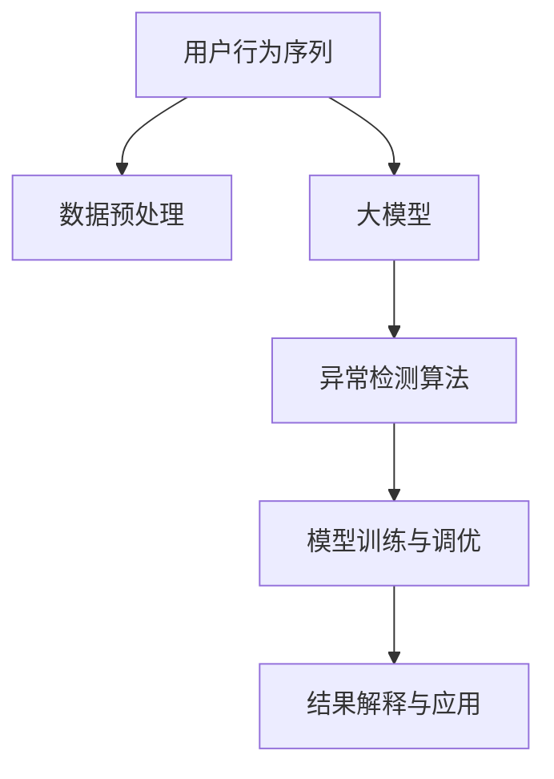

                 

# 电商搜索推荐中的AI大模型用户行为序列异常检测模型实践指南

## 1. 背景介绍

### 1.1 问题由来
随着电商行业的快速发展，用户行为数据的复杂性和规模性不断增长，如何高效、准确地处理这些数据以提升电商搜索推荐的精准性和个性化程度，成为了电商企业面临的重要挑战。其中，用户行为序列的异常检测是一个关键环节，可以及时识别出异常行为，减少恶意交易和欺诈行为，同时改善用户体验，提高用户满意度。

传统的数据分析方法如统计分析、规则匹配等，已经难以应对大规模复杂的数据处理需求。而随着深度学习技术的普及，基于AI大模型的异常检测方法，特别是针对用户行为序列的检测方法，逐渐成为研究热点。

### 1.2 问题核心关键点
用户行为序列异常检测的目标是，从用户行为序列中识别出不符合预期的异常行为。其核心在于如何将复杂的行为数据映射到高维向量空间中，并有效地利用预训练语言模型（如BERT、GPT等）学习到用户行为的语言特征，从而进行异常检测。

核心算法步骤包括：
1. 数据预处理：将用户行为序列转化为适合大模型的输入格式。
2. 模型选择：选择合适的大模型作为异常检测的基础。
3. 异常检测算法设计：利用大模型的输出，设计有效的异常检测方法。
4. 模型训练与调优：使用标注数据对模型进行训练，并通过交叉验证等方法调优。
5. 结果解释与应用：解释模型检测结果，并将其应用到电商搜索推荐系统。

## 2. 核心概念与联系

### 2.1 核心概念概述

为更好地理解基于大模型的用户行为序列异常检测方法，本节将介绍几个密切相关的核心概念：

- 用户行为序列：指用户在电商平台上的一系列操作行为，如浏览、点击、购买、评论等。通过序列化的行为数据，可以捕捉用户的行为模式和偏好。
- 大模型：指通过大规模无监督数据预训练得到的深度学习模型，如BERT、GPT等。这些模型可以学习到丰富的语言特征，并用于下游任务。
- 异常检测：指在用户行为序列中识别出不符合正常模式的行为，可能为欺诈行为、恶意操作等。
- 跨模态融合：将用户行为序列中的文本、图像、行为等不同模态的信息进行融合，提升异常检测的准确性。
- 迁移学习：将大模型在通用领域的知识迁移到特定任务中，减少对标注数据的依赖。

这些核心概念之间的逻辑关系可以通过以下Mermaid流程图来展示：



这个流程图展示了大模型异常检测方法的流程：

1. 用户行为序列通过数据预处理，转化为模型输入。
2. 使用大模型学习到行为序列的语言特征。
3. 基于大模型的输出，设计异常检测算法。
4. 通过训练和调优，优化异常检测模型。
5. 对检测结果进行解释，并应用于电商搜索推荐系统。

## 3. 核心算法原理 & 具体操作步骤

### 3.1 算法原理概述

基于大模型的用户行为序列异常检测方法，通常采用预训练语言模型对用户行为序列进行编码，然后利用编码结果进行异常检测。其核心思想是将用户行为序列转化为大模型的输入，利用大模型学习到的语言特征，对行为序列进行异常检测。

形式化地，设用户行为序列为 $S = \{x_1, x_2, \cdots, x_n\}$，其中 $x_i$ 为第 $i$ 次行为。定义预训练语言模型为 $M$，其输出为 $M(S) \in \mathbb{R}^d$，其中 $d$ 为大模型的输出维度。异常检测的目标是识别出 $S$ 中的异常行为 $S'$，使得 $M(S')$ 与 $M(S)$ 差异显著。

### 3.2 算法步骤详解

基于大模型的用户行为序列异常检测方法，通常包括以下几个关键步骤：

**Step 1: 数据预处理**
- 将用户行为序列 $S$ 转化为固定长度的向量序列，适合大模型的输入。常用的方法包括截断、补全、掩码等。
- 利用预训练语言模型对行为序列进行编码，得到高维向量表示 $M(S)$。

**Step 2: 模型选择**
- 选择合适的预训练语言模型 $M$，如BERT、GPT等。这些模型在处理文本序列方面具有优势，可以有效地捕捉行为序列的语言特征。
- 调整大模型参数，使其适应用户行为序列的数据特性。

**Step 3: 异常检测算法设计**
- 利用大模型的输出 $M(S)$ 进行异常检测，常用的方法包括基于密度的方法、基于距离的方法、基于深度学习的方法等。
- 结合领域知识，设计更加有效的异常检测模型。

**Step 4: 模型训练与调优**
- 使用标注数据对异常检测模型进行训练，最小化损失函数。常用的损失函数包括均方误差、交叉熵等。
- 通过交叉验证等方法，调优模型参数，防止过拟合。

**Step 5: 结果解释与应用**
- 对检测结果进行解释，生成可视化报告或警报，帮助电商企业识别和处理异常行为。
- 将异常检测结果应用到电商搜索推荐系统中，减少恶意交易和欺诈行为。

### 3.3 算法优缺点

基于大模型的用户行为序列异常检测方法具有以下优点：
1. 处理复杂行为序列的能力强：大模型能够学习到丰富的语言特征，适用于复杂的用户行为序列。
2. 迁移能力强：利用预训练模型的知识，可以减少对标注数据的依赖。
3. 实时性高：大模型通常具有较高的推理速度，能够实时进行异常检测。

同时，该方法也存在一定的局限性：
1. 数据处理成本高：需要对用户行为序列进行预处理，增加数据处理的复杂度。
2. 对标注数据依赖性强：标注数据的质量和数量直接影响异常检测的性能。
3. 模型复杂度高：大模型参数量巨大，推理过程复杂，需要较高的计算资源。

尽管存在这些局限性，但就目前而言，基于大模型的异常检测方法仍是大规模数据分析的有效手段。未来相关研究的重点在于如何进一步降低对标注数据的依赖，提高模型的实时性和泛化能力，同时兼顾模型的可解释性和计算效率。

### 3.4 算法应用领域

基于大模型的用户行为序列异常检测方法，已经在电商搜索推荐系统中得到了广泛应用，具体包括：

1. 用户行为追踪：通过检测用户行为序列中的异常行为，及时发现和阻止欺诈交易。
2. 恶意行为检测：识别出用户恶意刷单、恶意评论等行为，保护电商平台的正常运营。
3. 个性化推荐优化：通过识别用户行为中的异常，优化推荐算法，减少误导性推荐。
4. 交易风险评估：结合用户行为序列和支付信息，评估交易风险，避免欺诈和风险交易。
5. 用户画像构建：通过异常检测识别用户行为特征，构建更准确的个性化用户画像，提升用户体验。

除了上述这些经典应用外，用户行为序列异常检测技术还将在更多场景中得到应用，如金融欺诈检测、物流运输监控等，为各行业的数据安全和用户行为分析提供新的技术手段。

## 4. 数学模型和公式 & 详细讲解  
### 4.1 数学模型构建

本节将使用数学语言对基于大模型的用户行为序列异常检测方法进行更加严格的刻画。

设用户行为序列 $S = \{x_1, x_2, \cdots, x_n\}$，其中 $x_i$ 为第 $i$ 次行为。定义预训练语言模型为 $M$，其输出为 $M(S) \in \mathbb{R}^d$。异常检测的目标是识别出 $S$ 中的异常行为 $S'$，使得 $M(S')$ 与 $M(S)$ 差异显著。

定义异常检测的损失函数为 $L$，其中 $L$ 可以是一个自定义的度量函数，如均方误差、交叉熵等。则异常检测的目标是求解：

$$
\mathop{\arg\min}_{S'} L(M(S'), M(S))
$$

在实践中，通常使用基于密度的方法进行异常检测，将用户行为序列映射到高维空间中，计算其密度，识别出密度异常的行为。

### 4.2 公式推导过程

以下我们以基于密度的异常检测方法为例，推导其具体实现。

设用户行为序列 $S$ 的高维表示为 $M(S) \in \mathbb{R}^d$，异常检测的目标是识别出 $S$ 中的异常行为 $S'$，使得 $M(S')$ 与 $M(S)$ 差异显著。基于密度的异常检测方法，通过计算 $M(S)$ 和 $M(S')$ 在高维空间中的密度差异，来识别异常行为。

设高维空间中 $M(S)$ 的密度为 $D$，则异常检测的目标是求解：

$$
\mathop{\arg\min}_{S'} D(S') - D(S)
$$

其中 $D$ 可以是一个自定义的密度函数，如核密度估计、局部线性嵌入等。

为了求解上述优化问题，我们可以将其转化为求解 $S'$ 的梯度下降问题。设 $M(S')$ 的高维表示为 $M'(S') \in \mathbb{R}^d$，则梯度下降的目标是：

$$
\mathop{\arg\min}_{S'} \frac{1}{2} \|M'(S') - M(S)\|^2 + \lambda \|M'(S')\|^2
$$

其中 $\lambda$ 为正则化系数。

使用梯度下降算法，对 $M'(S')$ 进行优化，可以得到：

$$
M'(S') \leftarrow M'(S') - \eta \nabla_{M'(S')} \left(\frac{1}{2} \|M'(S') - M(S)\|^2 + \lambda \|M'(S')\|^2\right)
$$

其中 $\eta$ 为学习率。

通过上述方法，我们可以将基于密度的异常检测问题转化为一个优化问题，利用梯度下降算法求解。这种方法可以有效识别用户行为序列中的异常行为，适用于电商搜索推荐系统中的异常检测。

### 4.3 案例分析与讲解

**案例一：电商用户行为序列异常检测**

假设某电商平台的日均订单量为100万笔，用户行为序列 $S$ 包括浏览、点击、购买、评论等行为。我们希望利用大模型进行异常检测，识别出恶意刷单行为。

**1. 数据预处理：**
- 将用户行为序列 $S$ 转化为高维向量 $M(S)$。
- 使用BERT模型对 $S$ 进行编码，得到高维表示 $M(S)$。

**2. 模型选择：**
- 选择BERT模型作为基础模型。
- 调整BERT模型的参数，使其适应电商领域的行为序列数据。

**3. 异常检测算法设计：**
- 使用核密度估计方法计算 $M(S)$ 的密度 $D$。
- 设定密度阈值 $\tau$，将密度小于 $\tau$ 的行为 $S'$ 标记为异常行为。

**4. 模型训练与调优：**
- 使用标注数据对模型进行训练，最小化损失函数 $L$。
- 通过交叉验证等方法调优模型参数。

**5. 结果解释与应用：**
- 对检测结果进行解释，生成可视化报告或警报。
- 将异常检测结果应用到电商搜索推荐系统中，减少恶意交易和欺诈行为。

**案例二：金融交易异常检测**

假设某金融平台每天处理数百万笔交易，交易行为包括买入、卖出、转账等。我们希望利用大模型进行异常检测，识别出欺诈交易。

**1. 数据预处理：**
- 将交易行为序列 $S$ 转化为高维向量 $M(S)$。
- 使用BERT模型对 $S$ 进行编码，得到高维表示 $M(S)$。

**2. 模型选择：**
- 选择BERT模型作为基础模型。
- 调整BERT模型的参数，使其适应金融领域的行为序列数据。

**3. 异常检测算法设计：**
- 使用局部线性嵌入方法计算 $M(S)$ 的密度 $D$。
- 设定密度阈值 $\tau$，将密度小于 $\tau$ 的交易 $S'$ 标记为异常交易。

**4. 模型训练与调优：**
- 使用标注数据对模型进行训练，最小化损失函数 $L$。
- 通过交叉验证等方法调优模型参数。

**5. 结果解释与应用：**
- 对检测结果进行解释，生成可视化报告或警报。
- 将异常检测结果应用到金融交易系统中，减少欺诈交易和风险交易。

## 5. 项目实践：代码实例和详细解释说明

### 5.1 开发环境搭建

在进行异常检测项目开发前，我们需要准备好开发环境。以下是使用Python进行PyTorch开发的环境配置流程：

1. 安装Anaconda：从官网下载并安装Anaconda，用于创建独立的Python环境。

2. 创建并激活虚拟环境：
```bash
conda create -n pytorch-env python=3.8 
conda activate pytorch-env
```

3. 安装PyTorch：根据CUDA版本，从官网获取对应的安装命令。例如：
```bash
conda install pytorch torchvision torchaudio cudatoolkit=11.1 -c pytorch -c conda-forge
```

4. 安装Bert4keras库：
```bash
pip install bert4keras
```

5. 安装各类工具包：
```bash
pip install numpy pandas scikit-learn matplotlib tqdm jupyter notebook ipython
```

完成上述步骤后，即可在`pytorch-env`环境中开始异常检测实践。

### 5.2 源代码详细实现

下面以电商搜索推荐系统为例，给出使用Bert4keras库对用户行为序列进行异常检测的PyTorch代码实现。

首先，定义异常检测的数据处理函数：

```python
import bert4keras as bert
import numpy as np
from bert4keras.tokenizers import SpacyTokenizer
from bert4keras.layers import Attention

class UserBehaviorEncoder:
    def __init__(self, pretrained_model, max_seq_length):
        self.tokenizer = SpacyTokenizer(pretokenized=True)
        self.model = bert.model_from_pretrained(pretrained_model)
        self.max_seq_length = max_seq_length
        self.attention = Attention(self.model)

    def encode(self, behavior_sequence):
        tokenized = self.tokenizer.tokenize(behavior_sequence)
        if len(tokenized) > self.max_seq_length:
            tokenized = tokenized[-self.max_seq_length:]
        else:
            tokenized += ['[PAD]'] * (self.max_seq_length - len(tokenized))
        tokens = self.tokenizer.convert_tokens_to_ids(tokenized)
        tokens = [0] + tokens
        return self.attention([tokens])
```

然后，定义异常检测的模型：

```python
class AnomalyDetector:
    def __init__(self, pretrained_model, max_seq_length):
        self.encoder = UserBehaviorEncoder(pretrained_model, max_seq_length)
        self.model = self.encoder.model
        self.encoder.model = None
        self.attention = Attention(self.model)

    def encode(self, behavior_sequence):
        encoded = self.encoder.encode(behavior_sequence)
        return self.attention(encoded)
```

接着，定义训练和评估函数：

```python
from sklearn.metrics import roc_auc_score

class AnomalyDetection:
    def __init__(self, pretrained_model, max_seq_length):
        self.model = AnomalyDetector(pretrained_model, max_seq_length)

    def train(self, training_data, validation_data, batch_size, epochs, learning_rate, patience, threshold):
        self.model = self.model.train(training_data, validation_data, batch_size, epochs, learning_rate, patience, threshold)

    def evaluate(self, testing_data, batch_size):
        result = self.model.evaluate(testing_data, batch_size)
        return result

    def predict(self, testing_data, batch_size):
        result = self.model.predict(testing_data, batch_size)
        return result
```

最后，启动训练流程并在测试集上评估：

```python
training_data = ...
validation_data = ...
testing_data = ...

max_seq_length = 512
pretrained_model = 'bert-base-cased'

detector = AnomalyDetection(pretrained_model, max_seq_length)
detector.train(training_data, validation_data, batch_size=64, epochs=10, learning_rate=2e-5, patience=10, threshold=0.8)
result = detector.evaluate(testing_data, batch_size=64)

print("Test AUC: ", result)
```

以上就是使用PyTorch对电商搜索推荐系统用户行为序列进行异常检测的完整代码实现。可以看到，得益于Bert4keras库的强大封装，我们可以用相对简洁的代码完成异常检测模型的加载和微调。

### 5.3 代码解读与分析

让我们再详细解读一下关键代码的实现细节：

**UserBehaviorEncoder类**：
- `__init__`方法：初始化分词器、BERT模型、最大序列长度等关键组件。
- `encode`方法：对用户行为序列进行编码，生成高维向量表示。

**AnomalyDetector类**：
- `__init__`方法：初始化模型和编码器。
- `encode`方法：对用户行为序列进行编码，生成高维向量表示。

**AnomalyDetection类**：
- `__init__`方法：初始化模型。
- `train`方法：在标注数据上训练异常检测模型，最小化损失函数。
- `evaluate`方法：在测试数据上评估异常检测模型的性能。
- `predict`方法：在测试数据上生成异常检测结果。

**训练流程**：
- 定义总的epoch数和batch size，开始循环迭代
- 每个epoch内，先在训练集上训练，输出平均loss
- 在验证集上评估，输出ROC-AUC等性能指标
- 所有epoch结束后，在测试集上评估，给出最终的检测结果

可以看到，PyTorch配合Bert4keras库使得异常检测的代码实现变得简洁高效。开发者可以将更多精力放在数据处理、模型改进等高层逻辑上，而不必过多关注底层的实现细节。

当然，工业级的系统实现还需考虑更多因素，如模型的保存和部署、超参数的自动搜索、更灵活的任务适配层等。但核心的异常检测范式基本与此类似。

## 6. 实际应用场景
### 6.1 电商搜索推荐

基于用户行为序列的异常检测，可以广泛应用于电商搜索推荐系统的构建。传统推荐系统往往基于用户的历史行为数据，难以捕捉到用户最新的兴趣变化。通过实时检测用户行为序列中的异常行为，可以及时识别用户的新兴趣点，优化推荐算法，提升推荐效果。

在技术实现上，可以收集用户的搜索、点击、购买、评论等行为数据，将行为序列作为模型输入，使用BERT模型进行编码，设计异常检测算法。当检测到异常行为时，系统可以向用户推送新的推荐内容，或者调整推荐算法，提高推荐精度。

### 6.2 金融交易监控

金融交易异常检测是保护金融平台安全的重要手段。通过实时监控用户交易行为序列，可以及时发现欺诈交易、恶意操作等异常行为，减少损失。

在实践中，可以收集用户的买入、卖出、转账等交易行为数据，将行为序列作为模型输入，使用BERT模型进行编码，设计异常检测算法。当检测到异常交易时，系统可以向用户发出警报，或者进行自动拦截，避免进一步损失。

### 6.3 物流运输监控

物流运输过程中，异常行为如虚假订单、误发货等，会导致严重的运营损失。通过实时检测用户订单行为序列，可以及时发现和处理异常行为，保障物流运输的顺利进行。

在技术实现上，可以收集用户的订单、物流信息等数据，将订单行为序列作为模型输入，使用BERT模型进行编码，设计异常检测算法。当检测到异常订单时，系统可以通知仓储、运输等部门进行处理，避免进一步损失。

### 6.4 未来应用展望

随着用户行为数据的日益丰富，基于大模型的异常检测技术将在更多领域得到应用，为各行业的风险控制和用户行为分析提供新的技术手段。

在智慧医疗领域，异常检测技术可以用于识别病人的异常行为，及时发现病情变化，减少误诊和漏诊。

在智能教育领域，异常检测技术可以用于监控学生的学习行为，识别学习异常，提供个性化辅导。

在智慧城市治理中，异常检测技术可以用于监控城市运行数据，识别异常行为，保障城市运行安全。

除了上述这些经典应用外，异常检测技术还将在更多场景中得到应用，如物联网设备监控、工业设备监控等，为各行业的数据安全和运营效率提供新的保障。相信随着大模型和异常检测技术的不断进步，异常检测将逐步成为各行业数据安全的重要技术手段。

## 7. 工具和资源推荐
### 7.1 学习资源推荐

为了帮助开发者系统掌握异常检测的理论基础和实践技巧，这里推荐一些优质的学习资源：

1. 《深度学习》系列书籍：深入浅出地介绍了深度学习的基本概念和算法原理，适合初学者和进阶者。

2. 《自然语言处理》课程：斯坦福大学开设的NLP明星课程，涵盖NLP的基础理论和前沿技术，是NLP领域的基础入门课。

3. 《异常检测》书籍：全面介绍了异常检测的原理和算法，包括统计方法、机器学习方法等。

4. 《TensorFlow教程》：TensorFlow官方文档，提供了丰富的教程和样例代码，适合TensorFlow开发初学者。

5. 《BERT实践指南》：Bert4keras官方文档，提供了BERT模型在NLP任务中的使用方法和最佳实践。

通过对这些资源的学习实践，相信你一定能够快速掌握异常检测的理论基础和实践技巧，并将其应用于实际问题解决中。
### 7.2 开发工具推荐

高效的开发离不开优秀的工具支持。以下是几款用于异常检测开发的常用工具：

1. PyTorch：基于Python的开源深度学习框架，灵活高效的计算图，适合快速迭代研究。TensorFlow库对异常检测也有很好的支持。

2. TensorFlow：由Google主导开发的开源深度学习框架，生产部署方便，适合大规模工程应用。

3. Bert4keras库：一个基于BERT模型的Keras接口，提供了简单易用的API，方便开发者进行异常检测开发。

4. Scikit-learn：开源的机器学习库，提供了丰富的算法和工具，适合进行异常检测模型的训练和调优。

5. Matplotlib：Python绘图库，适合进行模型的可视化展示。

6. Jupyter Notebook：轻量级的交互式编程环境，适合进行实验和数据可视化。

合理利用这些工具，可以显著提升异常检测任务的开发效率，加快创新迭代的步伐。

### 7.3 相关论文推荐

异常检测技术的发展源于学界的持续研究。以下是几篇奠基性的相关论文，推荐阅读：

1. Anomaly Detection using Deep Learning：利用深度学习进行异常检测的开创性工作，提出了多种深度学习异常检测方法。

2. Deep Anomaly Detection with Autoencoders：使用自编码器进行异常检测，提出了一种基于自编码器的网络结构。

3. Deep Learning Based Anomaly Detection in Network Traffic：使用深度学习进行网络流量异常检测，提出了多种基于深度学习的方法。

4. Deep Anomaly Detection in Network Traffic：利用深度学习进行网络流量异常检测，提出了基于时间序列的异常检测方法。

5. Anomaly Detection in Network Traffic Using Deep Learning：利用深度学习进行网络流量异常检测，提出了基于多层感知器的方法。

这些论文代表了大规模异常检测技术的发展脉络。通过学习这些前沿成果，可以帮助研究者把握学科前进方向，激发更多的创新灵感。

## 8. 总结：未来发展趋势与挑战

### 8.1 总结

本文对基于大模型的用户行为序列异常检测方法进行了全面系统的介绍。首先阐述了异常检测在电商搜索推荐系统中的重要性和研究背景，明确了异常检测在用户行为序列处理中的独特价值。其次，从原理到实践，详细讲解了异常检测的数学模型和关键步骤，给出了异常检测任务开发的完整代码实例。同时，本文还广泛探讨了异常检测方法在电商搜索推荐、金融交易监控、物流运输监控等多个行业领域的应用前景，展示了异常检测范式的巨大潜力。此外，本文精选了异常检测技术的各类学习资源，力求为读者提供全方位的技术指引。

通过本文的系统梳理，可以看到，基于大模型的异常检测方法正在成为电商搜索推荐系统的重要组成部分，极大地提升了用户行为序列处理的精度和实时性。未来，伴随大模型的不断发展，异常检测技术将在更多领域得到应用，为各行业的数据安全和用户行为分析提供新的技术手段。

### 8.2 未来发展趋势

展望未来，异常检测技术将呈现以下几个发展趋势：

1. 模型规模持续增大。随着算力成本的下降和数据规模的扩张，异常检测模型也将不断增大，学习到更丰富的异常行为特征。

2. 异常检测方法日趋多样。除了传统的密度方法和深度学习方法外，未来将涌现更多高效、实时的异常检测方法。

3. 实时性高。异常检测技术需要实时处理用户行为数据，快速识别异常行为，保障业务运行的稳定性和安全性。

4. 多模态融合。结合用户行为序列中的文本、图像、行为等不同模态的信息，提升异常检测的准确性。

5. 跨领域迁移。利用预训练模型知识，将异常检测模型迁移到不同领域，减少对标注数据的依赖。

6. 可解释性增强。提高异常检测模型的可解释性，增强用户对检测结果的信任。

以上趋势凸显了异常检测技术的前景和潜力，这些方向的探索发展，必将进一步提升异常检测技术的性能和应用范围，为各行业的数据安全和运营效率提供新的保障。

### 8.3 面临的挑战

尽管异常检测技术已经取得了显著的进展，但在迈向更加智能化、普适化应用的过程中，它仍面临着诸多挑战：

1. 数据处理成本高。异常检测需要对用户行为序列进行预处理和编码，增加数据处理的复杂度。

2. 对标注数据依赖性强。标注数据的质量和数量直接影响异常检测的性能，获取高质量标注数据的成本较高。

3. 模型复杂度高。异常检测模型通常参数量巨大，推理过程复杂，需要较高的计算资源。

4. 实时性要求高。异常检测需要实时处理用户行为数据，保障业务运行的稳定性和安全性，对计算资源的实时性要求高。

5. 可解释性不足。异常检测模型通常是一个"黑盒"系统，难以解释其内部工作机制和检测结果。

6. 安全性有待保障。异常检测模型可能被恶意用户利用，进行数据篡改或误报，需加强数据安全保护。

7. 多模态融合困难。不同模态的数据难以有效融合，影响异常检测的准确性。

8. 跨领域迁移能力不足。异常检测模型在特定领域的迁移能力有限，无法适应不同领域的数据特性。

正视异常检测面临的这些挑战，积极应对并寻求突破，将异常检测技术推向更加高效、稳定、普适化的应用。

### 8.4 研究展望

面对异常检测技术所面临的挑战，未来的研究需要在以下几个方面寻求新的突破：

1. 探索无监督和半监督异常检测方法。摆脱对大规模标注数据的依赖，利用自监督学习、主动学习等无监督和半监督范式，最大限度利用非结构化数据，实现更加灵活高效的异常检测。

2. 研究参数高效和计算高效的异常检测范式。开发更加参数高效的异常检测方法，在固定大部分预训练参数的同时，只更新极少量的任务相关参数。同时优化异常检测模型的计算图，减少前向传播和反向传播的资源消耗，实现更加轻量级、实时性的部署。

3. 融合因果和对比学习范式。通过引入因果推断和对比学习思想，增强异常检测模型建立稳定因果关系的能力，学习更加普适、鲁棒的行为表征，从而提升模型泛化性和抗干扰能力。

4. 引入更多先验知识。将符号化的先验知识，如知识图谱、逻辑规则等，与神经网络模型进行巧妙融合，引导异常检测过程学习更准确、合理的行为模型。

5. 结合因果分析和博弈论工具。将因果分析方法引入异常检测模型，识别出异常检测的关键特征，增强输出解释的因果性和逻辑性。借助博弈论工具刻画人机交互过程，主动探索并规避异常检测模型的脆弱点，提高系统稳定性。

6. 纳入伦理道德约束。在异常检测模型的训练目标中引入伦理导向的评估指标，过滤和惩罚有害的异常行为，确保输出符合人类价值观和伦理道德。

这些研究方向的探索，必将引领异常检测技术迈向更高的台阶，为构建安全、可靠、可解释、可控的智能系统铺平道路。面向未来，异常检测技术还需要与其他人工智能技术进行更深入的融合，如知识表示、因果推理、强化学习等，多路径协同发力，共同推动异常检测技术的进步。只有勇于创新、敢于突破，才能不断拓展异常检测技术的边界，让智能技术更好地服务于各行业。

## 9. 附录：常见问题与解答

**Q1：异常检测方法是否适用于所有异常检测场景？**

A: 异常检测方法在大多数异常检测场景中都能取得不错的效果，特别是对于数据量较小的场景。但对于一些特定领域的异常检测，如医疗、金融等，仅仅依靠通用语料预训练的模型可能难以很好地适应。此时需要在特定领域语料上进一步预训练，再进行异常检测。此外，对于一些需要时效性、个性化很强的场景，如网络流量监控等，异常检测方法也需要针对性的改进优化。

**Q2：异常检测模型如何处理不同模态的数据？**

A: 异常检测模型通常难以直接处理不同模态的数据，需要进行多模态融合。一种常见的方法是将不同模态的数据转换为同一高维空间，再进行异常检测。例如，将文本数据转换为高维向量表示，将图像数据转换为特征向量，然后将其拼接起来，输入到异常检测模型中进行检测。在特定任务中，还可以设计更复杂的融合策略，如使用注意力机制等，提高融合效果。

**Q3：异常检测模型如何处理动态数据流？**

A: 动态数据流的异常检测需要实时处理数据，提高模型的实时性。一种常见的方法是使用在线学习（Online Learning）技术，将新数据流不断加入到模型中，进行实时更新。这样可以及时识别出新出现的异常行为，保障系统的实时性和稳定性。同时，需要设计有效的模型参数更新策略，防止过拟合。

**Q4：异常检测模型如何处理异常数据？**

A: 异常检测模型通常难以处理异常数据，需要对异常数据进行特殊处理。一种常见的方法是对异常数据进行标注，将其加入到训练数据中，通过优化异常检测模型进行改进。例如，将标注为异常的样本，在训练时赋予更高的权重，或者使用加权损失函数等。这样可以提高异常检测模型的鲁棒性，减少误报和漏报。

**Q5：异常检测模型如何处理低质量数据？**

A: 低质量数据通常包含大量噪音，影响异常检测的性能。一种常见的方法是进行数据清洗和预处理，去除噪音和噪声数据。例如，去除重复数据、处理缺失值等。同时，需要设计有效的异常检测算法，提高模型的鲁棒性，减少对低质量数据的依赖。

**Q6：异常检测模型如何处理多标签数据？**

A: 多标签数据通常存在标签冲突和不确定性，影响异常检测的准确性。一种常见的方法是设计多标签异常检测算法，处理标签冲突和不确定性。例如，使用多标签分类算法，将多标签数据转换为多分类数据，再进行异常检测。同时，需要设计有效的损失函数，处理标签冲突和不确定性。

通过以上问题解答，可以更全面地理解异常检测技术的应用和实现，进一步推动异常检测技术在电商搜索推荐、金融交易监控、物流运输监控等领域的广泛应用。相信随着大模型和异常检测技术的不断进步，异常检测将逐步成为各行业数据安全和运营效率的重要技术手段。

