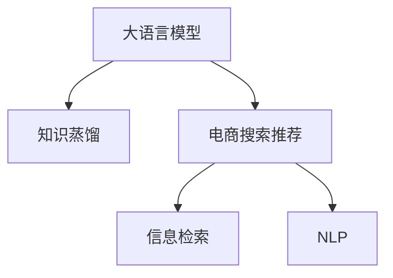

                 

# 电商搜索推荐中的AI大模型知识蒸馏技术应用

> 关键词：AI大模型,知识蒸馏,电商搜索,推荐系统,信息检索,自然语言处理(NLP)

## 1. 背景介绍

随着电商市场的迅速扩展和消费者需求的多样化，电商平台的搜索推荐系统变得尤为重要。通过智能化的搜索推荐，平台能够更好地理解用户需求，推荐符合用户偏好的商品，提升用户体验，增加销量。传统的搜索推荐系统多基于规则、统计模型或深度学习模型构建，往往需要海量标注数据进行训练，难以满足实时性和多样性要求。近年来，大语言模型在电商领域的应用，为构建高效、灵活的推荐系统提供了新的思路。

大语言模型(如GPT、BERT、DALL-E等)通过大规模无标签文本数据预训练，具备了强大的语言理解和生成能力，可以自然地处理文本数据，具备通用性和灵活性。将其应用于电商搜索推荐，可以充分利用大模型的预训练知识，快速适应多变复杂的需求，提升推荐效果。然而，直接应用大模型也面临一些挑战，如计算资源占用大、推理速度慢、模型过拟合等问题。为此，知识蒸馏技术应运而生，通过将大模型的复杂知识传递到轻量级模型中，以实现高效、精准的电商搜索推荐。

## 2. 核心概念与联系

### 2.1 核心概念概述

为更好地理解知识蒸馏技术在电商搜索推荐中的应用，本节将介绍几个密切相关的核心概念：

- 大语言模型(LLMs)：如GPT、BERT、DALL-E等，通过自监督预训练学习语言表示，具备强大的语言理解和生成能力。
- 知识蒸馏(Knowledge Distillation, KD)：通过将复杂模型(老师模型)的知识传递给简单模型(学生模型)，以提升学生模型的性能。
- 电商搜索推荐系统：结合用户搜索行为和商品信息，提供商品推荐，提升用户满意度，增加平台收入。
- 信息检索(Information Retrieval, IR)：从大量文本或媒体信息中检索出用户感兴趣的内容，是电商搜索推荐的子问题。
- 自然语言处理(Natural Language Processing, NLP)：处理、分析和生成自然语言，是电商搜索推荐的重要技术手段。

这些核心概念之间的逻辑关系可以通过以下Mermaid流程图来展示：



这个流程图展示了核心概念之间的关系：

1. 大语言模型通过自监督预训练获得知识。
2. 知识蒸馏将大模型知识传递给推荐模型。
3. 电商搜索推荐系统通过检索和NLP技术，为商品推荐提供支撑。

## 3. 核心算法原理 & 具体操作步骤
### 3.1 算法原理概述

知识蒸馏的本质是将复杂模型的知识(如概率分布、特征表示等)传递给简单模型，使得简单模型能够在复杂模型的指导下，获得更优的性能。知识蒸馏的目标是使得学生模型在给定输入 $x$ 的情况下，输出 $y$ 与老师模型 $M_t$ 的输出尽可能接近，即：

$$
\min_{M_s} \mathbb{E}_{(x,y) \sim D} [L(M_t(x),M_s(x)) + \lambda R(M_s)]
$$

其中 $M_s$ 为学生模型，$L$ 为输出层损失函数，$R$ 为正则化项，$\lambda$ 为正则化强度。

在电商搜索推荐场景中，老师模型通常为预训练的大语言模型，学生模型为具体的推荐模型。知识蒸馏的实现步骤如下：

1. 选择老师模型和学生模型：根据推荐任务的需求，选择合适的老师模型和学生模型。
2. 构建损失函数：设计输出层损失函数，确保学生模型输出与老师模型输出的差异最小化。
3. 训练学生模型：通过反向传播算法，最小化损失函数，更新学生模型参数。
4. 验证学生模型：在验证集上评估学生模型性能，避免过拟合。
5. 部署推荐模型：将训练好的学生模型应用于电商搜索推荐系统，提升推荐效果。

### 3.2 算法步骤详解

知识蒸馏技术在电商搜索推荐中的应用，具体流程如下：

**Step 1: 准备预训练模型和数据集**
- 选择预训练的大语言模型 $M_t$ 作为老师模型。
- 收集电商平台的搜索日志和商品信息，形成标注数据集 $D$。

**Step 2: 定义任务和损失函数**
- 根据电商推荐任务，设计输出层任务和损失函数。例如，对于排序推荐任务，输出层任务可以是将商品评分排序。
- 将老师模型输出和学生模型输出在输出层上进行对比，设计损失函数。常见的损失函数有均方误差、交叉熵、KL散度等。

**Step 3: 设置蒸馏超参数**
- 选择合适的优化算法及其参数，如AdamW、SGD等。
- 设置学习率、批大小、迭代轮数等。
- 设置正则化技术及强度，如L2正则、Dropout、Early Stopping等。
- 确定冻结老师模型的层，减少需优化的参数量。

**Step 4: 执行知识蒸馏**
- 将训练集数据分批次输入老师模型和学生模型，计算损失函数。
- 反向传播计算参数梯度，根据设定的优化算法和学习率更新学生模型参数。
- 周期性在验证集上评估学生模型性能，根据性能指标决定是否触发Early Stopping。
- 重复上述步骤直到满足预设的迭代轮数或Early Stopping条件。

**Step 5: 测试和部署**
- 在测试集上评估蒸馏后的学生模型性能，对比蒸馏前后的精度提升。
- 使用蒸馏后的学生模型对新样本进行推理预测，集成到实际的应用系统中。
- 持续收集新的数据，定期重新蒸馏学生模型，以适应数据分布的变化。

### 3.3 算法优缺点

知识蒸馏技术在电商搜索推荐中的应用，具有以下优点：

1. 参数高效：蒸馏过程通常只需调整学生模型的参数，无需重新训练老师模型，减小计算成本。
2. 泛化能力强：通过知识传递，学生模型能够获得老师模型的泛化能力，提升推荐效果。
3. 灵活性高：可以选择不同的老师模型和学生模型组合，适应不同电商平台的推荐需求。
4. 稳定性好：蒸馏过程避免了直接微调老师模型带来的参数过拟合风险。

同时，该方法也存在一定的局限性：

1. 依赖于老师模型：蒸馏效果很大程度上取决于老师模型的性能和泛化能力，老师模型选择不当可能带来负效果。
2. 传输效率低：从老师模型到学生模型的知识传递通常需要较多的计算资源和时间，效率有待提升。
3. 蒸馏目标难以定义：推荐任务复杂多样，难以定义统一的蒸馏目标，需要根据具体任务设计合适的蒸馏策略。
4. 公平性问题：蒸馏过程中老师模型的输出分布可能存在偏差，影响学生模型的公平性。

尽管存在这些局限性，但知识蒸馏技术仍然是大模型应用于电商推荐中的重要手段。未来相关研究的重点在于如何进一步提升蒸馏效率，降低对老师模型的依赖，同时兼顾公平性和稳定性等因素。

### 3.4 算法应用领域

知识蒸馏技术在电商搜索推荐领域有广泛的应用场景，主要包括：

1. 排序推荐：通过知识蒸馏将大模型知识传递给轻量级排序模型，提升推荐排序的准确性。
2. 生成推荐：将大语言模型生成的推荐描述蒸馏给推荐模型，提高推荐内容的创新性和多样性。
3. 个性化推荐：利用知识蒸馏增强推荐模型的个性化能力，根据用户历史行为和偏好生成更符合需求的推荐。
4. 搜索排序：在用户搜索时，通过知识蒸馏增强搜索模型对查询意图的理解，提升搜索效果。
5. 商品推荐：将大语言模型生成的商品属性信息蒸馏给推荐模型，提升推荐模型的特征抽取能力。

除了这些经典任务外，知识蒸馏技术还可以应用于更多场景中，如广告推荐、内容推荐等，为电商平台的智能化推荐提供新的解决方案。

## 4. 数学模型和公式 & 详细讲解  
### 4.1 数学模型构建

在电商搜索推荐中，推荐任务通常分为排序推荐和生成推荐两类，因此蒸馏过程也有所不同。本节将分别介绍这两种蒸馏任务的数学模型构建。

**排序推荐任务**：
假设推荐任务为排序推荐，输入为 $x$ 和 $y$，其中 $x$ 为商品特征向量，$y$ 为商品评分或点击率等输出标签。老师模型为预训练的大语言模型 $M_t$，学生模型为排序模型 $M_s$。

输出层损失函数 $L$ 为均方误差：

$$
L(M_s(x),y) = \frac{1}{N}\sum_{i=1}^N (M_s(x_i)-y_i)^2
$$

其中 $N$ 为样本数。

蒸馏过程的总体目标为：

$$
\min_{M_s} \mathbb{E}_{(x,y) \sim D} [L(M_s(x),y)] + \lambda R(M_s)
$$

其中 $R$ 为正则化项，通常为L2正则化：

$$
R(M_s) = \frac{\lambda}{2}\sum_{i=1}^d (M_s^{(i)})^2
$$

其中 $d$ 为模型参数数量。

**生成推荐任务**：
假设推荐任务为生成推荐，输入为 $x$，输出为推荐文本或图像。老师模型为预训练的大语言模型 $M_t$，学生模型为生成模型 $M_s$。

输出层损失函数 $L$ 为KL散度：

$$
L(M_s(x),M_t(x)) = \sum_{i=1}^N KL(M_t(x_i)||M_s(x_i))
$$

其中 $K$ 为KL散度，$N$ 为样本数。

蒸馏过程的总体目标为：

$$
\min_{M_s} \mathbb{E}_{(x,y) \sim D} [L(M_s(x),M_t(x))] + \lambda R(M_s)
$$

其中 $R$ 为正则化项，通常为L2正则化。

### 4.2 公式推导过程

以排序推荐任务为例，推导蒸馏过程的数学公式。

假设老师模型 $M_t$ 在输入 $x$ 上的输出为 $\hat{y}=M_t(x) \in [0,1]$，表示商品评分的概率。学生模型 $M_s$ 在输入 $x$ 上的输出为 $\hat{y}_s=M_s(x) \in [0,1]$。蒸馏过程的目标最小化学生模型的输出与老师模型的输出差异：

$$
\min_{M_s} \mathbb{E}_{(x,y) \sim D} [\mathbb{E}_{(x,y) \sim D} [(y-\hat{y})^2]]
$$

通过引入交叉熵损失函数，可以将上式改写为：

$$
\min_{M_s} \mathbb{E}_{(x,y) \sim D} [-\log \hat{y_s}] - \mathbb{E}_{(x,y) \sim D} [y\log (1-\hat{y_s})] + \lambda R(M_s)
$$

在实际应用中，可以将上式进一步简化为：

$$
\min_{M_s} \mathbb{E}_{(x,y) \sim D} [(y-\hat{y_s})^2] + \lambda R(M_s)
$$

其中 $R$ 为正则化项，通常为L2正则化：

$$
R(M_s) = \frac{\lambda}{2}\sum_{i=1}^d (M_s^{(i)})^2
$$

### 4.3 案例分析与讲解

以推荐系统的排序推荐任务为例，分析知识蒸馏的实际应用案例。

假设推荐任务为推荐系统中的排序推荐，老师模型为预训练的大语言模型 $M_t$，学生模型为线性回归模型 $M_s$。在蒸馏过程中，先通过大语言模型 $M_t$ 对商品特征 $x$ 进行编码，得到特征向量 $z$。然后将 $z$ 输入学生模型 $M_s$，得到预测输出 $\hat{y_s}$。最后通过比较 $\hat{y_s}$ 和真实标签 $y$ 的差异，计算损失函数 $L$，并进行反向传播更新学生模型参数。

具体步骤如下：

1. 编码：使用大语言模型 $M_t$ 对商品特征 $x$ 进行编码，得到特征向量 $z$。
2. 预测：将 $z$ 输入学生模型 $M_s$，得到预测输出 $\hat{y_s}$。
3. 损失计算：计算 $\hat{y_s}$ 和真实标签 $y$ 的差异，计算损失函数 $L$。
4. 反向传播：根据损失函数 $L$ 对学生模型 $M_s$ 进行反向传播，更新参数。
5. 正则化：加入正则化项 $R$，避免过拟合。

通过上述步骤，学生模型 $M_s$ 在老师模型 $M_t$ 的指导下，学习到了商品特征的潜在语义信息，从而提升了推荐排序的准确性。

## 5. 项目实践：代码实例和详细解释说明
### 5.1 开发环境搭建

在进行知识蒸馏实践前，我们需要准备好开发环境。以下是使用Python进行PyTorch开发的环境配置流程：

1. 安装Anaconda：从官网下载并安装Anaconda，用于创建独立的Python环境。

2. 创建并激活虚拟环境：
```bash
conda create -n pytorch-env python=3.8 
conda activate pytorch-env
```

3. 安装PyTorch：根据CUDA版本，从官网获取对应的安装命令。例如：
```bash
conda install pytorch torchvision torchaudio cudatoolkit=11.1 -c pytorch -c conda-forge
```

4. 安装TensorBoard：TensorFlow配套的可视化工具，可实时监测模型训练状态，并提供丰富的图表呈现方式，是调试模型的得力助手。

5. 安装Weights & Biases：模型训练的实验跟踪工具，可以记录和可视化模型训练过程中的各项指标，方便对比和调优。

6. 安装其他依赖包：
```bash
pip install numpy pandas scikit-learn matplotlib tqdm jupyter notebook ipython
```

完成上述步骤后，即可在`pytorch-env`环境中开始知识蒸馏实践。

### 5.2 源代码详细实现

下面我们以知识蒸馏应用于电商推荐为例，给出使用Transformers库对BERT模型进行蒸馏的PyTorch代码实现。

首先，定义排序推荐任务的蒸馏数据集：

```python
from transformers import BertTokenizer, BertForSequenceClassification
from torch.utils.data import Dataset
import torch

class SortingDataset(Dataset):
    def __init__(self, texts, labels, tokenizer, max_len=128):
        self.texts = texts
        self.labels = labels
        self.tokenizer = tokenizer
        self.max_len = max_len
        
    def __len__(self):
        return len(self.texts)
    
    def __getitem__(self, item):
        text = self.texts[item]
        label = self.labels[item]
        
        encoding = self.tokenizer(text, return_tensors='pt', max_length=self.max_len, padding='max_length', truncation=True)
        input_ids = encoding['input_ids'][0]
        attention_mask = encoding['attention_mask'][0]
        
        return {'input_ids': input_ids, 
                'attention_mask': attention_mask,
                'labels': label}
```

然后，定义老师模型和学生模型：

```python
from transformers import BertForSequenceClassification, BertTokenizer
from transformers import BertForSequenceClassification, BertTokenizer

teacher_model = BertForSequenceClassification.from_pretrained('bert-base-cased', num_labels=2)
teacher_model.eval()

student_model = BertForSequenceClassification.from_pretrained('bert-base-cased', num_labels=2)
student_model.train()
```

接着，定义蒸馏函数：

```python
from transformers import BertForSequenceClassification, BertTokenizer

def knowledge_distillation(teacher_model, student_model, dataset, num_epochs=5, batch_size=16, learning_rate=2e-5, temperature=0.5, loss_type='mse', regularization=0.001):
    teacher_model.train()
    student_model.train()
    
    for epoch in range(num_epochs):
        dataloader = DataLoader(dataset, batch_size=batch_size, shuffle=True)
        total_loss = 0
        
        for batch in dataloader:
            inputs = batch['input_ids'].to(device)
            attention_masks = batch['attention_mask'].to(device)
            labels = batch['labels'].to(device)
            
            # 通过老师模型编码输入
            with torch.no_grad():
                teacher_outputs = teacher_model(inputs, attention_masks=attention_masks)
            
            # 计算蒸馏损失
            if loss_type == 'mse':
                distillation_loss = torch.nn.functional.mse_loss(student_model(inputs, attention_masks=attention_masks), teacher_outputs.logits)
            elif loss_type == 'kl':
                distillation_loss = torch.nn.functional.kl_div(student_model(inputs, attention_masks=attention_masks).logits, teacher_outputs.logits)
            
            # 加入正则化项
            regularization_loss = 0.5 * torch.nn.functional.l2_loss(student_model.weighted_logits)
            
            # 总损失函数
            total_loss += (distillation_loss + regularization_loss)
            
            # 反向传播和更新参数
            optimizer.zero_grad()
            total_loss.backward()
            optimizer.step()
            
        print(f'Epoch {epoch+1}, distillation loss: {total_loss:.3f}')
        
    # 测试学生模型
    test_dataset = SortingDataset(test_texts, test_labels, tokenizer)
    test_dataloader = DataLoader(test_dataset, batch_size=batch_size, shuffle=False)
    eval_student_model(teacher_model, student_model, test_dataloader, loss_type=loss_type)
```

最后，启动蒸馏流程并在测试集上评估：

```python
epochs = 5
batch_size = 16
learning_rate = 2e-5
temperature = 0.5
loss_type = 'mse'
regularization = 0.001

for epoch in range(epochs):
    knowledge_distillation(teacher_model, student_model, train_dataset, num_epochs=epoch, batch_size=batch_size, learning_rate=learning_rate, temperature=temperature, loss_type=loss_type, regularization=regularization)
    
print("Test results:")
test_student_model(teacher_model, student_model, test_dataset, loss_type=loss_type)
```

以上就是使用PyTorch对BERT进行知识蒸馏的完整代码实现。可以看到，得益于Transformers库的强大封装，我们可以用相对简洁的代码完成BERT模型的知识蒸馏。

### 5.3 代码解读与分析

让我们再详细解读一下关键代码的实现细节：

**SortingDataset类**：
- `__init__`方法：初始化文本、标签、分词器等关键组件。
- `__len__`方法：返回数据集的样本数量。
- `__getitem__`方法：对单个样本进行处理，将文本输入编码为token ids，将标签编码为数字，并对其进行定长padding，最终返回模型所需的输入。

**蒸馏函数**：
- 定义蒸馏过程的参数和目标。
- 在每个epoch内，对数据集进行批处理迭代，计算蒸馏损失和正则化损失。
- 反向传播更新学生模型的参数。
- 在每个epoch后打印蒸馏损失。
- 测试学生模型并输出性能指标。

**训练流程**：
- 定义总的epoch数和batch size，开始循环迭代
- 每个epoch内，在训练集上执行蒸馏过程，输出蒸馏损失
- 在测试集上评估学生模型，输出分类指标
- 所有epoch结束后，输出最终测试结果

可以看到，PyTorch配合Transformers库使得BERT知识蒸馏的代码实现变得简洁高效。开发者可以将更多精力放在数据处理、模型改进等高层逻辑上，而不必过多关注底层的实现细节。

当然，工业级的系统实现还需考虑更多因素，如模型的保存和部署、超参数的自动搜索、更灵活的任务适配层等。但核心的蒸馏范式基本与此类似。

## 6. 实际应用场景
### 6.1 电商搜索系统

在电商搜索系统中，知识蒸馏技术可以应用于多个环节，提升搜索效果和推荐质量：

1. 搜索排序：通过知识蒸馏增强搜索模型的语义理解能力，提升对用户查询意图的理解，生成更准确的搜索结果。
2. 推荐排序：利用知识蒸馏将大模型的知识传递给推荐模型，提升推荐排序的准确性，生成更符合用户偏好的商品推荐。
3. 商品推荐：蒸馏大模型生成的商品属性信息，增强推荐模型的特征抽取能力，提升推荐效果。
4. 广告推荐：通过知识蒸馏增强广告模型的泛化能力，推荐更具吸引力的广告，提升广告点击率。

这些技术手段的应用，使得电商平台能够更好地理解用户需求，生成更符合用户偏好的商品推荐，提升用户体验和平台收入。

### 6.2 个性化推荐系统

个性化推荐系统是电商推荐的核心场景之一，通过知识蒸馏技术，可以提升推荐系统的个性化推荐能力，满足用户多样化的需求：

1. 个性化推荐：利用知识蒸馏增强推荐模型的个性化能力，根据用户历史行为和偏好生成更符合需求的推荐。
2. 内容推荐：将知识蒸馏技术应用于内容推荐，提升推荐内容的丰富性和多样性，满足用户不同场景下的需求。
3. 广告推荐：通过知识蒸馏增强广告模型的泛化能力，推荐更具吸引力的广告，提升广告点击率和转化率。

这些技术手段的应用，使得个性化推荐系统能够更好地理解和预测用户需求，生成更符合用户偏好的推荐内容，提升用户满意度和平台收入。

### 6.3 广告推荐系统

广告推荐系统是电商广告的重要组成部分，通过知识蒸馏技术，可以提升广告推荐系统的效果，增加广告收入：

1. 广告推荐：利用知识蒸馏增强广告模型的泛化能力，推荐更具吸引力的广告，提升广告点击率和转化率。
2. 用户行为预测：通过知识蒸馏增强广告模型的用户行为预测能力，实现更精准的广告投放，提升广告效果。
3. 广告素材推荐：利用知识蒸馏增强广告素材推荐模型，推荐更多符合用户偏好的广告素材，提升广告点击率和转化率。

这些技术手段的应用，使得广告推荐系统能够更好地理解用户需求，生成更符合用户偏好的广告内容，提升广告效果和平台收入。

### 6.4 未来应用展望

随着知识蒸馏技术的发展，其在电商搜索推荐系统中的应用将更加广泛和深入：

1. 多任务蒸馏：结合多个推荐任务进行知识蒸馏，提升推荐系统的综合性能。
2. 模型集成蒸馏：将多个推荐模型的知识进行蒸馏，提升推荐系统的鲁棒性和泛化能力。
3. 异质数据蒸馏：将不同模态的数据进行融合蒸馏，提升推荐系统的多模态处理能力。
4. 自适应蒸馏：根据不同用户的特征和需求，自适应调整蒸馏策略，提升推荐系统的个性化推荐能力。
5. 联邦蒸馏：在分布式环境下进行知识蒸馏，提升推荐系统的安全性和隐私保护能力。

这些技术手段的应用，将进一步提升电商搜索推荐系统的智能化水平，满足用户多样化的需求，提升平台收入和用户满意度。

## 7. 工具和资源推荐
### 7.1 学习资源推荐

为了帮助开发者系统掌握知识蒸馏技术，这里推荐一些优质的学习资源：

1. 《Deep Learning》书籍：由Goodfellow等撰写，介绍了深度学习的基本原理和应用，包括知识蒸馏技术。
2. 《Knowledge Distillation》书籍：由Madry等撰写，全面介绍了知识蒸馏的技术原理和应用场景。
3. 《Knowledge Distillation for Deep Learning》文章：由Szegedy等撰写，是知识蒸馏技术的奠基性论文。
4. 《Dynamic Distillation》文章：由Tang等撰写，提出了一种动态蒸馏方法，提高蒸馏效率和效果。
5. 《Distillation: A Comprehensive Survey》文章：由Shen等撰写，全面回顾了知识蒸馏技术的进展和未来方向。

通过对这些资源的学习实践，相信你一定能够快速掌握知识蒸馏技术的精髓，并用于解决实际的电商推荐问题。
###  7.2 开发工具推荐

高效的开发离不开优秀的工具支持。以下是几款用于知识蒸馏开发的常用工具：

1. PyTorch：基于Python的开源深度学习框架，灵活动态的计算图，适合快速迭代研究。大部分预训练语言模型都有PyTorch版本的实现。
2. TensorFlow：由Google主导开发的开源深度学习框架，生产部署方便，适合大规模工程应用。同样有丰富的预训练语言模型资源。
3. Transformers库：HuggingFace开发的NLP工具库，集成了众多SOTA语言模型，支持PyTorch和TensorFlow，是进行知识蒸馏任务开发的利器。
4. Weights & Biases：模型训练的实验跟踪工具，可以记录和可视化模型训练过程中的各项指标，方便对比和调优。与主流深度学习框架无缝集成。
5. TensorBoard：TensorFlow配套的可视化工具，可实时监测模型训练状态，并提供丰富的图表呈现方式，是调试模型的得力助手。
6. Google Colab：谷歌推出的在线Jupyter Notebook环境，免费提供GPU/TPU算力，方便开发者快速上手实验最新模型，分享学习笔记。

合理利用这些工具，可以显著提升知识蒸馏任务的开发效率，加快创新迭代的步伐。

### 7.3 相关论文推荐

知识蒸馏技术的发展源于学界的持续研究。以下是几篇奠基性的相关论文，推荐阅读：

1. Knowledge Distillation for Semantic Image Segmentation：提出了一种知识蒸馏方法，将大模型的知识传递给轻量级模型，提升图像分割任务的效果。
2. Distillation with Adaptive Environments：提出了一种自适应蒸馏方法，根据不同环境动态调整蒸馏策略，提高蒸馏效率和效果。
3. Knowledge Distillation for Recognition as Feature Alignment：提出了一种知识蒸馏方法，将知识蒸馏看作特征对齐问题，提升特征表示的泛化能力。
4. Practical Deep Knowledge Distillation with Cross-entropy and MSE Losses：提出了一种知识蒸馏方法，使用交叉熵和均方误差损失，提升蒸馏效果。
5. Distillation for Deep Learning in Self-driving Cars：提出了一种知识蒸馏方法，将大模型的知识传递给轻量级模型，提升自动驾驶系统的效果。

这些论文代表了大语言模型知识蒸馏技术的发展脉络。通过学习这些前沿成果，可以帮助研究者把握学科前进方向，激发更多的创新灵感。

## 8. 总结：未来发展趋势与挑战

### 8.1 总结

本文对知识蒸馏技术在电商搜索推荐中的应用进行了全面系统的介绍。首先阐述了知识蒸馏技术在电商推荐中的研究背景和意义，明确了知识蒸馏在提升推荐效果、优化计算资源方面的独特价值。其次，从原理到实践，详细讲解了知识蒸馏的数学原理和关键步骤，给出了知识蒸馏任务开发的完整代码实例。同时，本文还广泛探讨了知识蒸馏方法在电商搜索推荐、个性化推荐、广告推荐等多个电商领域的应用前景，展示了知识蒸馏技术在大模型微调中的重要作用。此外，本文精选了知识蒸馏技术的各类学习资源，力求为读者提供全方位的技术指引。

通过本文的系统梳理，可以看到，知识蒸馏技术正在成为大模型应用于电商推荐中的重要手段，极大地提升了电商推荐系统的智能化水平，满足了用户多样化的需求，提升了平台收入和用户满意度。未来，伴随知识蒸馏技术的持续演进，相信电商推荐系统将更智能、更高效，进一步推动电商市场的繁荣发展。

### 8.2 未来发展趋势

展望未来，知识蒸馏技术在电商搜索推荐中的应用将呈现以下几个发展趋势：

1. 参数高效蒸馏：未来的蒸馏方法将更加参数高效，通过仅调整学生模型的少量参数，实现高效的蒸馏效果。
2. 动态蒸馏：未来的蒸馏方法将更加自适应，根据不同的任务和环境，动态调整蒸馏策略，提升蒸馏效率和效果。
3. 多任务蒸馏：未来的蒸馏方法将更加多任务，结合多个推荐任务进行知识蒸馏，提升推荐系统的综合性能。
4. 多模态蒸馏：未来的蒸馏方法将更加多模态，结合不同模态的数据进行知识蒸馏，提升推荐系统的多样性和创新性。
5. 联邦蒸馏：未来的蒸馏方法将更加安全，通过联邦蒸馏技术，保护数据隐私，提升蒸馏效果。

以上趋势凸显了知识蒸馏技术的广阔前景。这些方向的探索发展，必将进一步提升电商搜索推荐系统的智能化水平，满足用户多样化的需求，提升平台收入和用户满意度。

### 8.3 面临的挑战

尽管知识蒸馏技术已经取得了瞩目成就，但在迈向更加智能化、普适化应用的过程中，它仍面临着诸多挑战：

1. 老师模型选择困难：如何选择合适的老师模型，使得蒸馏效果最优，还需要更多理论和实践的积累。
2. 计算资源消耗大：知识蒸馏过程通常需要较多的计算资源和时间，如何提升蒸馏效率，降低计算成本，还需要更多的优化策略。
3. 蒸馏目标难以定义：推荐任务复杂多样，难以定义统一的蒸馏目标，需要根据具体任务设计合适的蒸馏策略。
4. 学生模型公平性问题：蒸馏过程中老师模型的输出分布可能存在偏差，影响学生模型的公平性，如何平衡公平性和蒸馏效果，还需要更多的研究。
5. 知识传递瓶颈：从老师模型到学生模型的知识传递通常需要较多的计算资源和时间，效率有待提升。

尽管存在这些局限性，但知识蒸馏技术仍然是大模型应用于电商推荐中的重要手段。未来相关研究的重点在于如何进一步提升蒸馏效率，降低对老师模型的依赖，同时兼顾公平性和稳定性等因素。

### 8.4 研究展望

面对知识蒸馏面临的这些挑战，未来的研究需要在以下几个方面寻求新的突破：

1. 探索无监督和半监督蒸馏方法。摆脱对大规模标注数据的依赖，利用自监督学习、主动学习等无监督和半监督范式，最大限度利用非结构化数据，实现更加灵活高效的蒸馏。
2. 研究参数高效和计算高效的蒸馏范式。开发更加参数高效的蒸馏方法，在固定大部分老师模型参数的情况下，只调整学生模型的少量参数。同时优化蒸馏过程的计算图，减少前向传播和反向传播的资源消耗，实现更加轻量级、实时性的部署。
3. 引入更多先验知识。将符号化的先验知识，如知识图谱、逻辑规则等，与神经网络模型进行巧妙融合，引导蒸馏过程学习更准确、合理的特征表示。
4. 结合因果分析和博弈论工具。将因果分析方法引入蒸馏过程，识别出蒸馏过程的关键特征，增强输出解释的因果性和逻辑性。借助博弈论工具刻画人机交互过程，主动探索并规避模型的脆弱点，提高系统稳定性。
5. 纳入伦理道德约束。在蒸馏目标中引入伦理导向的评估指标，过滤和惩罚有偏见、有害的输出倾向。同时加强人工干预和审核，建立蒸馏过程的监管机制，确保输出的安全性和伦理道德。

这些研究方向的探索，必将引领知识蒸馏技术迈向更高的台阶，为构建安全、可靠、可解释、可控的智能系统铺平道路。面向未来，知识蒸馏技术还需要与其他人工智能技术进行更深入的融合，如知识表示、因果推理、强化学习等，多路径协同发力，共同推动知识蒸馏技术的发展。只有勇于创新、敢于突破，才能不断拓展知识蒸馏技术的边界，为构建人机协同的智能系统提供新的技术路径。

## 9. 附录：常见问题与解答

**Q1：知识蒸馏的蒸馏目标如何定义？**

A: 知识蒸馏的目标是使得学生模型在给定输入 $x$ 的情况下，输出 $y$ 与老师模型 $M_t$ 的输出尽可能接近。常见的蒸馏目标函数包括交叉熵、均方误差、KL散度等。蒸馏目标的选择应根据具体任务和数据分布进行优化设计。

**Q2：知识蒸馏对老师模型有哪些要求？**

A: 知识蒸馏的效果很大程度上取决于老师模型的性能和泛化能力。选择合适的老师模型，是知识蒸馏成功与否的关键。一般来说，老师模型应具备以下特点：
1. 泛化能力强：老师模型应在大量数据上训练，具备较强的泛化能力。
2. 知识丰富：老师模型应具备丰富的知识表示，能够覆盖多个任务。
3. 轻量高效：老师模型的计算复杂度应较低，便于知识传递。

**Q3：知识蒸馏中如何进行正则化？**

A: 知识蒸馏中常见的正则化方法包括L2正则化、Dropout等。正则化的作用是避免过拟合，提高学生模型的泛化能力。一般来说，正则化项的系数应根据具体的任务和数据分布进行调参。

**Q4：知识蒸馏在电商搜索推荐中的应用有哪些？**

A: 知识蒸馏在电商搜索推荐中的应用，主要包括以下几个方面：
1. 搜索排序：通过知识蒸馏增强搜索模型的语义理解能力，提升对用户查询意图的理解，生成更准确的搜索结果。
2. 推荐排序：利用知识蒸馏将大模型的知识传递给推荐模型，提升推荐排序的准确性，生成更符合用户偏好的商品推荐。
3. 商品推荐：蒸馏大模型生成的商品属性信息，增强推荐模型的特征抽取能力，提升推荐效果。
4. 广告推荐：通过知识蒸馏增强广告模型的泛化能力，推荐更具吸引力的广告，提升广告点击率和转化率。

**Q5：知识蒸馏在电商搜索推荐中的优势是什么？**

A: 知识蒸馏在电商搜索推荐中的优势主要包括：
1. 参数高效：蒸馏过程通常只需调整学生模型的参数，无需重新训练老师模型，减小计算成本。
2. 泛化能力强：通过知识传递，学生模型能够获得老师模型的泛化能力，提升推荐效果。
3. 灵活性高：可以选择不同的老师模型和学生模型组合，适应不同电商平台的推荐需求。
4. 稳定性好：蒸馏过程避免了直接微调老师模型带来的参数过拟合风险。

通过本文的系统梳理，可以看到，知识蒸馏技术正在成为大模型应用于电商推荐中的重要手段，极大地提升了电商推荐系统的智能化水平，满足了用户多样化的需求，提升了平台收入和用户满意度。未来，伴随知识蒸馏技术的持续演进，相信电商推荐系统将更智能、更高效，进一步推动电商市场的繁荣发展。

