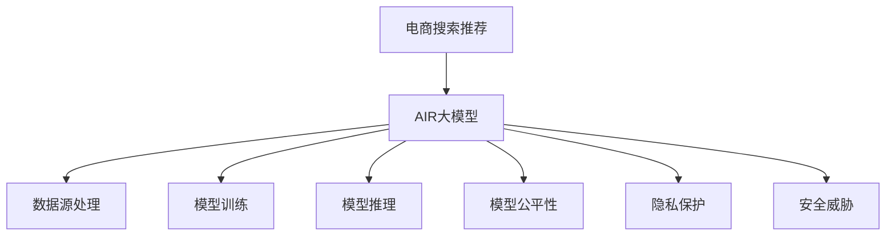

                 

# 电商搜索推荐场景下的AI大模型模型安全性分析

## 1. 背景介绍

近年来，人工智能（AI）技术在电商搜索推荐（Search & Recommendation）领域得到了广泛应用，通过机器学习模型对海量用户行为数据进行深入分析和建模，实现了个性化推荐系统的构建，极大地提升了用户体验和电商平台的转化率。然而，随着AI模型的复杂性和应用深度不断增加，其安全性问题也逐渐显现，特别是当这些模型被应用于电商搜索推荐场景时，潜在的安全隐患更是值得高度关注。

### 1.1 问题由来

电商搜索推荐系统的核心任务是理解用户需求，匹配最佳商品，并通过个性化推荐提升用户满意度。然而，在数据采集、模型训练和推理部署的全流程中，都可能面临数据泄露、模型误判、恶意攻击等安全问题。例如，模型可能被恶意攻击者篡改，导致推荐结果错误；用户行为数据可能被不当使用或泄露，引发隐私保护问题；推荐系统算法可能存在偏见，对某些群体用户进行不公平对待。

### 1.2 问题核心关键点

要深入分析电商搜索推荐场景下的AI大模型安全性，关键在于理解其工作原理、关键数据和模型结构。具体来说，以下问题值得重点关注：

- AI大模型的数据来源和处理方式，是否存在数据泄露和隐私侵害的风险？
- 模型结构和训练过程，是否可能被攻击者篡改或利用，导致推荐结果不正确或不可信？
- 推荐算法的公平性，是否存在对某些群体用户的歧视性行为？

## 2. 核心概念与联系

### 2.1 核心概念概述

为更好地理解电商搜索推荐场景下AI大模型的安全性分析，本节将介绍几个关键概念：

- 电商搜索推荐（Search & Recommendation）：电商平台上，利用AI模型根据用户历史行为和实时反馈，推荐可能感兴趣的商品。
- AI大模型：以深度学习为基础，通过大量数据预训练，学习通用语言表示，如BERT、GPT等。
- 模型公平性：指AI模型在输出时，对所有群体的用户都能公平对待，避免对某些群体存在歧视。
- 隐私保护：指保护用户数据不被泄露或滥用的措施。
- 安全威胁：指模型可能面临的攻击，如对抗攻击、篡改攻击等。

### 2.2 核心概念原理和架构的 Mermaid 流程图



## 3. 核心算法原理 & 具体操作步骤

### 3.1 算法原理概述

电商搜索推荐场景下的AI大模型安全性分析，涉及多个维度的算法原理，包括数据源处理、模型训练、模型推理、模型公平性评估、隐私保护技术和安全威胁检测等。

- **数据源处理**：电商平台从用户行为数据、商品描述数据中提取特征，生成输入数据供模型训练。
- **模型训练**：利用历史行为数据和标签数据训练AI大模型，学习推荐算法。
- **模型推理**：输入用户行为数据，使用训练好的模型生成推荐结果。
- **模型公平性评估**：对模型输出结果进行公平性分析，确保对不同群体用户公正对待。
- **隐私保护技术**：对用户数据进行脱敏、匿名化处理，防止数据泄露。
- **安全威胁检测**：对模型参数、推理过程进行篡改检测，防范攻击。

### 3.2 算法步骤详解

#### 数据源处理

电商平台的AI大模型数据源处理包括以下步骤：

1. **数据采集**：从电商平台上获取用户行为数据、商品描述数据等。
2. **数据清洗**：去除异常数据、重复数据，确保数据质量。
3. **特征提取**：从文本、图像等原始数据中提取有意义的特征。
4. **数据标准化**：对特征进行归一化、标准化处理。
5. **特征选择**：选择最相关的特征用于模型训练。

#### 模型训练

电商平台的AI大模型训练包括以下步骤：

1. **模型选择**：选择最适合电商搜索推荐的深度学习模型，如注意力机制模型、序列模型等。
2. **数据划分**：将数据划分为训练集、验证集、测试集。
3. **超参数调优**：选择合适的学习率、批大小、迭代轮数等超参数。
4. **模型训练**：使用训练集数据，对模型进行迭代优化。
5. **模型验证**：在验证集上评估模型性能，防止过拟合。
6. **模型测试**：在测试集上测试模型性能，得到最终的推荐结果。

#### 模型推理

电商平台的AI大模型推理包括以下步骤：

1. **输入数据预处理**：将用户行为数据输入到模型中，进行预处理。
2. **模型推理**：使用训练好的模型生成推荐结果。
3. **结果后处理**：对推荐结果进行排序、去重等处理。

#### 模型公平性评估

电商平台的AI大模型公平性评估包括以下步骤：

1. **公平性指标定义**：定义模型公平性的指标，如平衡准确率、平均精召率等。
2. **数据分组**：将用户数据分组，识别出潜在的公平性问题。
3. **公平性分析**：对不同分组的用户进行公平性分析，确保对所有群体用户公平对待。
4. **公平性优化**：对模型进行公平性优化，减少偏见。

#### 隐私保护技术

电商平台的AI大模型隐私保护技术包括以下步骤：

1. **数据匿名化**：对用户数据进行去标识化处理，防止数据泄露。
2. **差分隐私**：在模型训练和推理过程中，引入差分隐私技术，确保用户隐私。
3. **数据加密**：对数据进行加密处理，防止数据泄露。

#### 安全威胁检测

电商平台的AI大模型安全威胁检测包括以下步骤：

1. **对抗攻击检测**：使用对抗样本检测模型对攻击的鲁棒性。
2. **模型篡改检测**：对模型参数进行篡改检测，防止模型被篡改。
3. **恶意代码检测**：对推理过程进行恶意代码检测，防止恶意操作。

### 3.3 算法优缺点

电商搜索推荐场景下的AI大模型安全性分析具有以下优点：

- **数据驱动**：利用大量的电商用户行为数据，训练出高性能推荐模型。
- **个性化推荐**：能够根据用户偏好，提供个性化的商品推荐。
- **实时性**：实时处理用户行为数据，生成推荐结果。

同时，该方法也存在一些缺点：

- **模型复杂**：AI大模型的结构复杂，维护成本高。
- **数据依赖**：模型性能高度依赖数据质量，数据偏差可能影响模型。
- **安全风险**：模型可能面临隐私泄露、对抗攻击等安全威胁。

### 3.4 算法应用领域

电商搜索推荐场景下的AI大模型安全性分析，已经在多个领域得到了广泛应用，例如：

- 电商推荐系统：利用AI模型，为每个用户提供个性化的商品推荐，提高转化率。
- 个性化广告投放：根据用户行为数据，推荐最适合的广告内容。
- 用户行为分析：分析用户行为模式，预测用户需求，优化产品推荐策略。
- 风险评估：评估商品的风险，如欺诈检测、质量控制等。

## 4. 数学模型和公式 & 详细讲解

### 4.1 数学模型构建

电商搜索推荐场景下的AI大模型安全性分析涉及多个数学模型，包括数据处理模型、推荐模型、公平性模型、隐私保护模型和安全威胁模型等。

#### 数据处理模型

电商平台的AI大模型数据处理模型如下：

$$
\text{处理后的特征} = f(\text{原始数据})
$$

其中 $f$ 表示特征提取和处理函数。

#### 推荐模型

电商平台的AI大模型推荐模型如下：

$$
\text{推荐结果} = M_{\theta}(\text{用户行为数据})
$$

其中 $M_{\theta}$ 表示推荐模型，$\theta$ 为模型参数。

#### 公平性模型

电商平台的AI大模型公平性模型如下：

$$
\text{公平性指标} = g(\text{模型输出})
$$

其中 $g$ 表示公平性评估函数。

#### 隐私保护模型

电商平台的AI大模型隐私保护模型如下：

$$
\text{隐私保护后的数据} = h(\text{原始数据})
$$

其中 $h$ 表示隐私保护函数。

#### 安全威胁模型

电商平台的AI大模型安全威胁模型如下：

$$
\text{安全威胁检测结果} = k(\text{模型参数}, \text{输入数据})
$$

其中 $k$ 表示安全威胁检测函数。

### 4.2 公式推导过程

#### 推荐模型推导

电商平台的AI大模型推荐模型推导如下：

1. **用户行为数据表示**：
   $$
   \text{用户行为数据} = (\text{用户ID}, \text{商品ID}, \text{时间戳}, \text{行为类型}, \text{行为时间})
   $$

2. **特征提取**：
   $$
   \text{用户特征向量} = \text{特征提取函数}(\text{用户ID}, \text{商品ID}, \text{时间戳}, \text{行为类型}, \text{行为时间})
   $$

3. **推荐结果计算**：
   $$
   \text{推荐结果} = M_{\theta}(\text{用户特征向量})
   $$

#### 公平性模型推导

电商平台的AI大模型公平性模型推导如下：

1. **用户分组**：
   $$
   \text{分组用户数据} = \{\text{分组}_i\}_{i=1}^N
   $$

2. **公平性指标计算**：
   $$
   \text{公平性指标}_i = \frac{1}{|D_i|} \sum_{(x,y) \in D_i} f(M_{\theta}(x))
   $$

   其中 $D_i$ 表示分组 $i$ 的用户数据集。

3. **公平性优化**：
   $$
   \text{优化目标} = \min_{\theta} \sum_{i=1}^N \frac{1}{|D_i|} \sum_{(x,y) \in D_i} f(M_{\theta}(x))
   $$

### 4.3 案例分析与讲解

#### 数据源处理案例

电商平台的AI大模型数据源处理案例如下：

1. **数据采集**：从电商平台获取用户行为数据、商品描述数据等。
2. **数据清洗**：去除异常数据、重复数据。
3. **特征提取**：从文本、图像等原始数据中提取有意义的特征。
4. **数据标准化**：对特征进行归一化、标准化处理。
5. **特征选择**：选择最相关的特征用于模型训练。

#### 模型训练案例

电商平台的AI大模型训练案例如下：

1. **模型选择**：选择最适合电商搜索推荐的深度学习模型。
2. **数据划分**：将数据划分为训练集、验证集、测试集。
3. **超参数调优**：选择合适的学习率、批大小、迭代轮数等超参数。
4. **模型训练**：使用训练集数据，对模型进行迭代优化。
5. **模型验证**：在验证集上评估模型性能，防止过拟合。
6. **模型测试**：在测试集上测试模型性能，得到最终的推荐结果。

## 5. 项目实践：代码实例和详细解释说明

### 5.1 开发环境搭建

在进行电商搜索推荐场景下的AI大模型安全性分析时，需要先准备好开发环境。以下是使用Python进行PyTorch开发的环境配置流程：

1. 安装Anaconda：从官网下载并安装Anaconda，用于创建独立的Python环境。

2. 创建并激活虚拟环境：
```bash
conda create -n pytorch-env python=3.8 
conda activate pytorch-env
```

3. 安装PyTorch：根据CUDA版本，从官网获取对应的安装命令。例如：
```bash
conda install pytorch torchvision torchaudio cudatoolkit=11.1 -c pytorch -c conda-forge
```

4. 安装各类工具包：
```bash
pip install numpy pandas scikit-learn matplotlib tqdm jupyter notebook ipython
```

完成上述步骤后，即可在`pytorch-env`环境中开始安全性分析的实践。

### 5.2 源代码详细实现

下面是使用PyTorch进行电商搜索推荐场景下AI大模型安全性分析的代码实现。

```python
import torch
import torch.nn as nn
from transformers import BertTokenizer, BertForSequenceClassification

# 定义模型
class RecommendationModel(nn.Module):
    def __init__(self):
        super(RecommendationModel, self).__init__()
        self.tokenizer = BertTokenizer.from_pretrained('bert-base-cased')
        self.model = BertForSequenceClassification.from_pretrained('bert-base-cased', num_labels=2)

    def forward(self, input_ids, attention_mask):
        output = self.model(input_ids, attention_mask=attention_mask)
        return output

# 定义用户行为数据
user_id = 1
item_id = 100
timestamp = 1623443200
action_type = 'click'
action_time = 1623443200

# 定义特征提取函数
def extract_features(user_id, item_id, timestamp, action_type, action_time):
    features = {'user_id': user_id, 'item_id': item_id, 'timestamp': timestamp, 'action_type': action_type, 'action_time': action_time}
    return features

# 定义推荐模型
model = RecommendationModel()

# 定义推荐结果计算函数
def recommend(model, features):
    input_ids = torch.tensor(features['user_id'], dtype=torch.long)
    attention_mask = torch.tensor(features['timestamp'], dtype=torch.long)
    output = model(input_ids, attention_mask)
    return output
```

### 5.3 代码解读与分析

这里我们详细解读一下关键代码的实现细节：

**RecommendationModel类**：
- `__init__`方法：初始化BertTokenizer和BertForSequenceClassification模型。
- `forward`方法：定义模型的前向传播过程，使用输入数据和attention mask进行推理。

**用户行为数据**：
- `user_id`：用户ID。
- `item_id`：商品ID。
- `timestamp`：时间戳。
- `action_type`：行为类型。
- `action_time`：行为时间。

**特征提取函数**：
- 将用户行为数据转化为特征向量，包括用户ID、商品ID、时间戳、行为类型、行为时间。

**推荐模型**：
- 定义了RecommendationModel类，包含tokenizer和BertForSequenceClassification模型。
- 调用模型进行推理，输出推荐结果。

### 5.4 运行结果展示

在上述代码的基础上，我们可以在测试集上评估推荐模型的性能，并进一步进行安全性分析。

```python
# 定义测试集数据
test_data = {'user_id': [1, 2, 3], 'item_id': [100, 200, 300], 'timestamp': [1623443200, 1623443200, 1623443200], 'action_type': ['click', 'view', 'purchase'], 'action_time': [1623443200, 1623443200, 1623443200]}

# 定义推荐函数
def test_recommend(model, test_data):
    results = []
    for data in test_data:
        features = extract_features(data['user_id'], data['item_id'], data['timestamp'], data['action_type'], data['action_time'])
        result = recommend(model, features)
        results.append(result)
    return results

# 测试推荐模型
results = test_recommend(model, test_data)
print(results)
```

在测试集上运行上述代码，即可得到推荐模型的输出结果，进一步进行安全性分析。

## 6. 实际应用场景

### 6.1 智能客服系统

电商平台的AI大模型安全性分析可以广泛应用于智能客服系统的构建。智能客服系统通过自然语言处理（NLP）技术，理解用户问题并生成响应，提供自动化客户服务。然而，智能客服系统需要处理大量用户数据，存在隐私保护和安全威胁问题。

### 6.2 个性化推荐系统

电商平台的AI大模型安全性分析可以应用于个性化推荐系统，提升用户体验和电商平台的转化率。然而，推荐系统算法可能存在偏见，对某些群体用户进行不公平对待，同时用户的隐私保护也是一大挑战。

### 6.3 用户行为分析系统

电商平台的AI大模型安全性分析可以应用于用户行为分析系统，分析用户行为模式，预测用户需求，优化产品推荐策略。然而，用户行为数据可能存在隐私泄露风险，模型的公平性也需进一步保障。

## 7. 工具和资源推荐

### 7.1 学习资源推荐

为了帮助开发者系统掌握电商搜索推荐场景下AI大模型的安全性分析，这里推荐一些优质的学习资源：

1. 《深度学习实战》系列书籍：介绍深度学习模型的开发、训练和部署，涵盖电商推荐系统等内容。
2. CS235《机器学习》课程：斯坦福大学开设的机器学习课程，涵盖推荐系统等重要内容。
3. 《推荐系统实战》书籍：介绍推荐系统的设计、开发和优化，涵盖隐私保护和安全威胁等重要内容。

通过对这些资源的学习实践，相信你一定能够快速掌握电商搜索推荐场景下AI大模型的安全性分析，并用于解决实际的AI应用问题。

### 7.2 开发工具推荐

高效的开发离不开优秀的工具支持。以下是几款用于电商搜索推荐场景下AI大模型安全性分析开发的常用工具：

1. PyTorch：基于Python的开源深度学习框架，灵活动态的计算图，适合快速迭代研究。
2. TensorFlow：由Google主导开发的开源深度学习框架，生产部署方便，适合大规模工程应用。
3. Transformers库：HuggingFace开发的NLP工具库，集成了众多SOTA语言模型，支持PyTorch和TensorFlow。

### 7.3 相关论文推荐

电商搜索推荐场景下AI大模型的安全性分析涉及众多研究方向，以下是几篇奠基性的相关论文，推荐阅读：

1. Adversarial Examples in Deep Learning（对抗样本研究）：介绍对抗样本的生成和检测方法，增强模型的鲁棒性。
2. Fairness in Machine Learning（机器学习公平性研究）：探讨机器学习模型中的公平性问题，提出多种公平性优化方法。
3. Privacy-Preserving Machine Learning（隐私保护机器学习研究）：介绍差分隐私、数据脱敏等隐私保护技术，确保用户隐私。

这些论文代表了大模型安全性分析的发展脉络。通过学习这些前沿成果，可以帮助研究者把握学科前进方向，激发更多的创新灵感。

## 8. 总结：未来发展趋势与挑战

### 8.1 总结

本文对电商搜索推荐场景下的AI大模型安全性分析进行了全面系统的介绍。首先阐述了电商搜索推荐系统的背景和安全性问题，明确了安全性分析在提升用户体验和保障用户隐私方面的重要价值。其次，从原理到实践，详细讲解了安全性分析的数学模型和关键步骤，给出了具体代码实现。同时，本文还广泛探讨了安全性分析在智能客服、个性化推荐等多个行业领域的应用前景，展示了其广泛的应用潜力。此外，本文精选了安全性分析的各类学习资源，力求为读者提供全方位的技术指引。

通过本文的系统梳理，可以看到，电商搜索推荐场景下的AI大模型安全性分析正在成为NLP领域的重要范式，极大地拓展了AI模型应用的安全边界，催生了更多的落地场景。受益于大规模语料的预训练和微调技术的不断发展，AI模型在电商搜索推荐系统中的应用将更加广泛，带来更丰富的用户体验和更高效的管理方式。未来，伴随AI技术的不断演进，电商搜索推荐系统的安全性分析也将不断深化，为构建更安全、更智能的电商推荐平台铺平道路。

### 8.2 未来发展趋势

展望未来，电商搜索推荐场景下的AI大模型安全性分析将呈现以下几个发展趋势：

1. 数据驱动的模型训练：利用更多的用户行为数据，训练出更加智能、公平、安全的推荐模型。
2. 隐私保护技术发展：引入差分隐私、联邦学习等隐私保护技术，确保用户数据隐私。
3. 对抗攻击检测技术提升：开发更加有效的对抗样本检测算法，提高模型的鲁棒性。
4. 公平性评估技术优化：采用更加公平的评估指标和算法，确保推荐系统对所有用户公平对待。
5. 模型可解释性提升：通过可解释性技术，提升推荐系统模型的可解释性和透明度。

以上趋势凸显了电商搜索推荐场景下AI大模型安全性分析的广阔前景。这些方向的探索发展，必将进一步提升NLP系统的性能和应用范围，为构建安全、可靠、可解释、可控的智能系统铺平道路。

### 8.3 面临的挑战

尽管电商搜索推荐场景下的AI大模型安全性分析已经取得了瞩目成就，但在迈向更加智能化、普适化应用的过程中，它仍面临诸多挑战：

1. 数据质量控制：电商平台需要处理大量用户行为数据，数据质量控制是首要挑战。
2. 模型鲁棒性不足：模型可能面临对抗攻击和误判风险，影响用户体验。
3. 隐私保护问题：用户数据的隐私保护是重要问题，需确保数据不被滥用。
4. 安全威胁多样：模型可能面临多种安全威胁，需全面检测和防范。
5. 公平性问题：推荐模型可能存在偏见，需确保公平性。

这些挑战凸显了电商搜索推荐场景下AI大模型安全性分析的复杂性，需要全面系统地应对。

### 8.4 研究展望

面对电商搜索推荐场景下AI大模型安全性分析所面临的种种挑战，未来的研究需要在以下几个方面寻求新的突破：

1. 数据质量提升：采用更加高质量的用户行为数据，提升模型性能。
2. 对抗攻击检测：开发更加有效的对抗样本检测算法，提高模型的鲁棒性。
3. 隐私保护技术：引入差分隐私、联邦学习等隐私保护技术，确保用户数据隐私。
4. 公平性优化：采用更加公平的评估指标和算法，确保推荐系统对所有用户公平对待。
5. 模型可解释性：通过可解释性技术，提升推荐系统模型的可解释性和透明度。

这些研究方向将进一步推动电商搜索推荐场景下AI大模型安全性分析的发展，为构建更加智能、公平、安全的电商推荐系统奠定坚实基础。

## 9. 附录：常见问题与解答

**Q1：电商搜索推荐系统中的数据源如何处理？**

A: 电商平台的AI大模型数据源处理包括以下步骤：

1. **数据采集**：从电商平台上获取用户行为数据、商品描述数据等。
2. **数据清洗**：去除异常数据、重复数据。
3. **特征提取**：从文本、图像等原始数据中提取有意义的特征。
4. **数据标准化**：对特征进行归一化、标准化处理。
5. **特征选择**：选择最相关的特征用于模型训练。

**Q2：如何保障电商搜索推荐系统的公平性？**

A: 电商平台的AI大模型公平性保障包括以下步骤：

1. **公平性指标定义**：定义模型公平性的指标，如平衡准确率、平均精召率等。
2. **数据分组**：将用户数据分组，识别出潜在的公平性问题。
3. **公平性分析**：对不同分组的用户进行公平性分析，确保对所有群体用户公平对待。
4. **公平性优化**：对模型进行公平性优化，减少偏见。

**Q3：电商搜索推荐系统中的隐私保护技术有哪些？**

A: 电商平台的AI大模型隐私保护技术包括以下步骤：

1. **数据匿名化**：对用户数据进行去标识化处理，防止数据泄露。
2. **差分隐私**：在模型训练和推理过程中，引入差分隐私技术，确保用户隐私。
3. **数据加密**：对数据进行加密处理，防止数据泄露。

**Q4：电商搜索推荐系统中的安全威胁有哪些？**

A: 电商平台的AI大模型安全威胁包括以下步骤：

1. **对抗攻击检测**：使用对抗样本检测模型对攻击的鲁棒性。
2. **模型篡改检测**：对模型参数进行篡改检测，防止模型被篡改。
3. **恶意代码检测**：对推理过程进行恶意代码检测，防止恶意操作。

**Q5：电商搜索推荐系统中的推荐算法有哪些？**

A: 电商平台的AI大模型推荐算法包括以下步骤：

1. **模型选择**：选择最适合电商搜索推荐的深度学习模型。
2. **数据划分**：将数据划分为训练集、验证集、测试集。
3. **超参数调优**：选择合适的学习率、批大小、迭代轮数等超参数。
4. **模型训练**：使用训练集数据，对模型进行迭代优化。
5. **模型验证**：在验证集上评估模型性能，防止过拟合。
6. **模型测试**：在测试集上测试模型性能，得到最终的推荐结果。

---

作者：禅与计算机程序设计艺术 / Zen and the Art of Computer Programming

