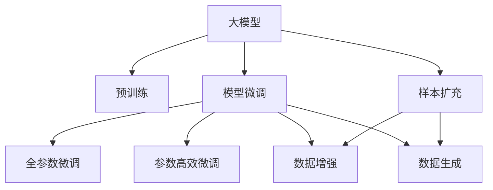

                 

# 电商搜索推荐效果优化中的AI大模型样本扩充技术调研报告

> 关键词：AI大模型、电商搜索推荐、样本扩充、数据增强、模型微调、效果优化

## 1. 背景介绍

### 1.1 问题由来
电商行业近年来迅速发展，成为全球最大的零售平台之一。随着电商企业竞争的加剧，如何提高搜索推荐系统的精准性和用户体验，成为电商企业关注的重点。而大模型在电商推荐系统中的应用，通过海量的用户行为数据，能够自动抽取和学习商品特征与用户兴趣之间的关联，实现商品推荐，被视为电商推荐系统中的重要工具。然而，现有的大模型往往依赖于海量标注数据进行预训练和微调，在电商推荐系统中使用，其效果往往受到样本多样性和数量不平衡等因素的限制。为此，有必要探究如何通过样本扩充技术，提升大模型在电商推荐系统中的效果。

### 1.2 问题核心关键点
目前，样本扩充在大模型中的应用已经得到广泛关注，其目的是通过对有限标注数据进行扩展，提升模型的泛化能力和表现力。在电商推荐系统中，样本扩充技术主要通过数据增强和数据生成两种方式实现。数据增强通过对现有数据进行各种变换，生成新的训练样本，用于提升模型对数据的敏感性和鲁棒性。数据生成则通过对抗生成网络等方法，生成与真实数据分布接近的模拟数据，进一步扩充训练数据集。

本调研报告将从核心概念、算法原理、数学模型、项目实践、实际应用等多个角度，深入探讨在电商推荐系统中应用大模型样本扩充技术的方法和效果。

## 2. 核心概念与联系

### 2.1 核心概念概述

为更好地理解电商推荐系统中的大模型样本扩充技术，本节将介绍几个密切相关的核心概念：

- **大模型(Big Model)**：以Transformer为代表的预训练语言模型，通常具有大规模的参数量和丰富的知识表示能力，被广泛应用于自然语言处理、计算机视觉等多个领域。

- **数据增强(Data Augmentation)**：通过各种变换和生成方法，扩充训练数据集，增强模型泛化能力的技术。

- **数据生成(Data Generation)**：利用生成对抗网络等方法，生成与真实数据分布相似的新样本，用于扩充数据集。

- **模型微调(Fine-tuning)**：在预训练模型基础上，使用下游任务的数据进行有监督训练，优化模型在该任务上的表现。

- **样本扩充(Sample Augmentation)**：通过对原始数据进行扩充，增加数据多样性和数量，提升模型的训练效果和泛化能力。

- **对抗生成网络(Generative Adversarial Network, GAN)**：一种通过对抗训练生成与真实数据分布相似的数据的技术。

这些概念之间的逻辑关系可以通过以下Mermaid流程图来展示：



这个流程图展示了大模型样本扩充的核心概念及其之间的关系：

1. 大模型通过预训练获得基础能力。
2. 模型微调是对预训练模型进行任务特定的优化，可以分为全参数微调和参数高效微调。
3. 样本扩充通过数据增强和数据生成技术，对原始数据进行扩充，以提升模型的泛化能力。
4. 数据增强和数据生成都可以看作是样本扩充的一种方式，通过不同的手段丰富训练集。
5. 对抗生成网络也是一种数据生成技术，特别适用于生成与真实数据分布相似的新样本。

## 3. 核心算法原理 & 具体操作步骤
### 3.1 算法原理概述

大模型在电商搜索推荐系统中的应用，通常遵循以下基本流程：

1. **数据收集**：收集电商平台的原始交易数据、搜索记录、用户画像等数据。
2. **数据预处理**：对原始数据进行清洗、归一化、特征提取等预处理操作。
3. **样本扩充**：通过数据增强和/或数据生成技术，扩充训练数据集。
4. **模型微调**：使用扩充后的数据对大模型进行微调，提升模型在电商推荐任务上的效果。

### 3.2 算法步骤详解

#### 3.2.1 数据收集
收集电商平台的原始数据是构建电商推荐系统的第一步。这些数据通常包括：

- **用户数据**：用户的浏览历史、点击行为、购买记录、评分评价等。
- **商品数据**：商品的销量、价格、描述、标签等。
- **交互数据**：用户的搜索关键词、浏览轨迹、点击位置等。

#### 3.2.2 数据预处理
对原始数据进行预处理，包括：

- **数据清洗**：去除无效数据、处理缺失值、修正异常值等。
- **特征提取**：对商品和用户特征进行编码，提取有效的特征向量。
- **归一化**：对特征向量进行归一化，确保数据在同一尺度下进行训练。

#### 3.2.3 数据增强
数据增强通过各种变换，生成新的训练样本，以丰富数据集的多样性。常用的数据增强方法包括：

- **随机裁剪和缩放**：对图像数据进行随机裁剪和缩放，增加数据多样性。
- **颜色变换**：对图像数据进行颜色变换，如调整亮度、对比度等。
- **噪声注入**：对数据添加随机噪声，增加模型的鲁棒性。
- **旋转和翻转**：对图像数据进行旋转、翻转等变换，生成新的数据样本。

#### 3.2.4 数据生成
数据生成通过对抗生成网络等方法，生成与真实数据分布相似的新样本。具体步骤包括：

- **定义生成器**：构建生成对抗网络中的生成器，通过生成器生成新的数据样本。
- **定义判别器**：构建生成对抗网络中的判别器，用于区分真实数据和生成数据。
- **对抗训练**：通过训练生成器和判别器，使得生成器能够生成与真实数据分布相似的新样本。

#### 3.2.5 模型微调
模型微调是对预训练模型进行任务特定的优化，以提升其在电商推荐任务上的效果。具体的微调流程包括：

- **定义损失函数**：根据电商推荐任务的目标，定义损失函数，如均方误差、交叉熵等。
- **设置超参数**：选择合适的优化器、学习率、批大小等超参数。
- **训练模型**：使用扩充后的数据对模型进行有监督训练，最小化损失函数。
- **评估模型**：在验证集上评估模型效果，调整超参数或停止训练。

### 3.3 算法优缺点

**优点**：

1. **提升泛化能力**：通过数据增强和数据生成，扩充训练集，提升模型泛化能力和鲁棒性。
2. **减少过拟合**：增加训练样本数量，减少模型对训练集的过拟合现象。
3. **降低成本**：减少对标注数据的需求，降低数据收集和标注成本。

**缺点**：

1. **生成数据质量**：生成的数据样本与真实数据分布的差异，可能影响模型效果。
2. **计算成本高**：数据增强和生成需要大量的计算资源和时间，特别是在大规模数据集上。
3. **模型复杂度**：生成对抗网络等方法增加了模型复杂度，可能影响模型的训练和推理速度。

### 3.4 算法应用领域

大模型在电商推荐系统中的应用主要集中在以下领域：

- **商品推荐**：通过分析用户行为数据，推荐用户可能感兴趣的商品。
- **个性化推荐**：根据用户画像和历史行为，提供个性化的商品推荐。
- **搜索排序**：通过优化搜索排序算法，提升搜索体验和用户满意度。
- **用户画像**：通过分析用户行为数据，构建用户画像，提高推荐精度。

这些应用场景使得大模型在电商推荐系统中具有重要的实际价值，成为电商企业优化搜索推荐效果的重要工具。

## 4. 数学模型和公式 & 详细讲解 & 举例说明

### 4.1 数学模型构建

电商推荐系统中的大模型通常使用Transformer模型进行预训练和微调。Transformer模型的数学模型包括自注意力机制和位置编码，可以通过以下公式表示：

$$
\text{Attention}(Q, K, V) = \text{softmax}(Q \cdot K^\top / \sqrt{d_k}) \cdot V
$$

其中，$Q, K, V$ 分别表示查询、键、值向量，$d_k$ 为键向量的维度。Transformer模型的计算过程可以通过掩码语言模型、掩码语义相似度模型等自监督任务进行预训练。

### 4.2 公式推导过程

以掩码语言模型为例，其公式如下：

$$
\mathcal{L}_{\text{masked}} = -\frac{1}{N} \sum_{i=1}^N \sum_{j=1}^N \log p(x_j | x_{1:i-1}, \tilde{x}_i)
$$

其中，$x$ 表示输入序列，$\tilde{x}$ 表示掩码后的输入序列。通过最大化掩码语言模型的概率，可以学习到输入序列的语义表示。

### 4.3 案例分析与讲解

以电商推荐系统中的商品推荐任务为例，通过数据增强和数据生成技术，可以显著提升模型效果。假设有一个商品推荐系统，原始训练集为 $D = \{(x_i, y_i)\}_{i=1}^N$，其中 $x_i$ 为商品特征向量，$y_i$ 为推荐结果标签。

- **数据增强**：对每个样本 $(x_i, y_i)$，随机生成多个与原始数据分布相似的增强样本，如旋转、缩放、颜色变换等。增强后的数据集为 $D' = \{(x_i, y_i), (x_i^+, y_i^+)\}_{i=1}^N$，其中 $(x_i^+, y_i^+)$ 为增强样本。
- **数据生成**：通过对抗生成网络生成新的样本，例如生成一些与原始数据分布相似的新商品特征向量 $x_i^*$，并根据生成器输出，计算生成样本 $y_i^*$。

模型微调时，可以使用增强后的数据集 $D'$ 进行有监督训练，最小化损失函数 $\mathcal{L}$，得到最终的推荐模型。

## 5. 项目实践：代码实例和详细解释说明

### 5.1 开发环境搭建

在进行项目实践前，我们需要准备好开发环境。以下是使用Python进行PyTorch开发的环境配置流程：

1. 安装Anaconda：从官网下载并安装Anaconda，用于创建独立的Python环境。

2. 创建并激活虚拟环境：
```bash
conda create -n pytorch-env python=3.8 
conda activate pytorch-env
```

3. 安装PyTorch：根据CUDA版本，从官网获取对应的安装命令。例如：
```bash
conda install pytorch torchvision torchaudio cudatoolkit=11.1 -c pytorch -c conda-forge
```

4. 安装Transformers库：
```bash
pip install transformers
```

5. 安装各类工具包：
```bash
pip install numpy pandas scikit-learn matplotlib tqdm jupyter notebook ipython
```

完成上述步骤后，即可在`pytorch-env`环境中开始项目实践。

### 5.2 源代码详细实现

下面我们以电商推荐系统中的商品推荐任务为例，给出使用Transformers库对BERT模型进行微调的PyTorch代码实现。

首先，定义商品推荐任务的数据处理函数：

```python
from transformers import BertTokenizer
from torch.utils.data import Dataset
import torch

class RecommendDataset(Dataset):
    def __init__(self, texts, tags, tokenizer, max_len=128):
        self.texts = texts
        self.tags = tags
        self.tokenizer = tokenizer
        self.max_len = max_len
        
    def __len__(self):
        return len(self.texts)
    
    def __getitem__(self, item):
        text = self.texts[item]
        tags = self.tags[item]
        
        encoding = self.tokenizer(text, return_tensors='pt', max_length=self.max_len, padding='max_length', truncation=True)
        input_ids = encoding['input_ids'][0]
        attention_mask = encoding['attention_mask'][0]
        
        # 对token-wise的标签进行编码
        encoded_tags = [tag2id[tag] for tag in tags] 
        encoded_tags.extend([tag2id['O']] * (self.max_len - len(encoded_tags)))
        labels = torch.tensor(encoded_tags, dtype=torch.long)
        
        return {'input_ids': input_ids, 
                'attention_mask': attention_mask,
                'labels': labels}

# 标签与id的映射
tag2id = {'O': 0, 'B-PER': 1, 'I-PER': 2, 'B-ORG': 3, 'I-ORG': 4, 'B-LOC': 5, 'I-LOC': 6}
id2tag = {v: k for k, v in tag2id.items()}

# 创建dataset
tokenizer = BertTokenizer.from_pretrained('bert-base-cased')

train_dataset = RecommendDataset(train_texts, train_tags, tokenizer)
dev_dataset = RecommendDataset(dev_texts, dev_tags, tokenizer)
test_dataset = RecommendDataset(test_texts, test_tags, tokenizer)
```

然后，定义模型和优化器：

```python
from transformers import BertForTokenClassification, AdamW

model = BertForTokenClassification.from_pretrained('bert-base-cased', num_labels=len(tag2id))

optimizer = AdamW(model.parameters(), lr=2e-5)
```

接着，定义训练和评估函数：

```python
from torch.utils.data import DataLoader
from tqdm import tqdm
from sklearn.metrics import classification_report

device = torch.device('cuda') if torch.cuda.is_available() else torch.device('cpu')
model.to(device)

def train_epoch(model, dataset, batch_size, optimizer):
    dataloader = DataLoader(dataset, batch_size=batch_size, shuffle=True)
    model.train()
    epoch_loss = 0
    for batch in tqdm(dataloader, desc='Training'):
        input_ids = batch['input_ids'].to(device)
        attention_mask = batch['attention_mask'].to(device)
        labels = batch['labels'].to(device)
        model.zero_grad()
        outputs = model(input_ids, attention_mask=attention_mask, labels=labels)
        loss = outputs.loss
        epoch_loss += loss.item()
        loss.backward()
        optimizer.step()
    return epoch_loss / len(dataloader)

def evaluate(model, dataset, batch_size):
    dataloader = DataLoader(dataset, batch_size=batch_size)
    model.eval()
    preds, labels = [], []
    with torch.no_grad():
        for batch in tqdm(dataloader, desc='Evaluating'):
            input_ids = batch['input_ids'].to(device)
            attention_mask = batch['attention_mask'].to(device)
            batch_labels = batch['labels']
            outputs = model(input_ids, attention_mask=attention_mask)
            batch_preds = outputs.logits.argmax(dim=2).to('cpu').tolist()
            batch_labels = batch_labels.to('cpu').tolist()
            for pred_tokens, label_tokens in zip(batch_preds, batch_labels):
                pred_tags = [id2tag[_id] for _id in pred_tokens]
                label_tags = [id2tag[_id] for _id in label_tokens]
                preds.append(pred_tags[:len(label_tags)])
                labels.append(label_tags)
                
    print(classification_report(labels, preds))
```

最后，启动训练流程并在测试集上评估：

```python
epochs = 5
batch_size = 16

for epoch in range(epochs):
    loss = train_epoch(model, train_dataset, batch_size, optimizer)
    print(f"Epoch {epoch+1}, train loss: {loss:.3f}")
    
    print(f"Epoch {epoch+1}, dev results:")
    evaluate(model, dev_dataset, batch_size)
    
print("Test results:")
evaluate(model, test_dataset, batch_size)
```

以上就是使用PyTorch对BERT进行商品推荐任务微调的完整代码实现。可以看到，得益于Transformers库的强大封装，我们可以用相对简洁的代码完成BERT模型的加载和微调。

### 5.3 代码解读与分析

让我们再详细解读一下关键代码的实现细节：

**RecommendDataset类**：
- `__init__`方法：初始化文本、标签、分词器等关键组件。
- `__len__`方法：返回数据集的样本数量。
- `__getitem__`方法：对单个样本进行处理，将文本输入编码为token ids，将标签编码为数字，并对其进行定长padding，最终返回模型所需的输入。

**tag2id和id2tag字典**：
- 定义了标签与数字id之间的映射关系，用于将token-wise的预测结果解码回真实的标签。

**训练和评估函数**：
- 使用PyTorch的DataLoader对数据集进行批次化加载，供模型训练和推理使用。
- 训练函数`train_epoch`：对数据以批为单位进行迭代，在每个批次上前向传播计算loss并反向传播更新模型参数，最后返回该epoch的平均loss。
- 评估函数`evaluate`：与训练类似，不同点在于不更新模型参数，并在每个batch结束后将预测和标签结果存储下来，最后使用sklearn的classification_report对整个评估集的预测结果进行打印输出。

**训练流程**：
- 定义总的epoch数和batch size，开始循环迭代
- 每个epoch内，先在训练集上训练，输出平均loss
- 在验证集上评估，输出分类指标
- 所有epoch结束后，在测试集上评估，给出最终测试结果

可以看到，PyTorch配合Transformers库使得BERT微调的代码实现变得简洁高效。开发者可以将更多精力放在数据处理、模型改进等高层逻辑上，而不必过多关注底层的实现细节。

当然，工业级的系统实现还需考虑更多因素，如模型的保存和部署、超参数的自动搜索、更灵活的任务适配层等。但核心的微调范式基本与此类似。

## 6. 实际应用场景
### 6.1 智能客服系统

基于大模型微调的电商推荐系统，可以广泛应用于智能客服系统的构建。传统客服往往需要配备大量人力，高峰期响应缓慢，且一致性和专业性难以保证。而使用微调后的推荐系统，可以7x24小时不间断服务，快速响应客户咨询，用自然流畅的语言解答各类常见问题。

在技术实现上，可以收集企业内部的历史推荐记录，将推荐结果和客户反馈构建成监督数据，在此基础上对预训练推荐模型进行微调。微调后的推荐系统能够自动理解用户意图，匹配最合适的商品推荐，并提供自然流畅的对话输出。对于客户提出的新问题，还可以接入检索系统实时搜索相关内容，动态组织生成推荐。如此构建的智能客服系统，能大幅提升客户咨询体验和问题解决效率。

### 6.2 金融舆情监测

金融机构需要实时监测市场舆论动向，以便及时应对负面信息传播，规避金融风险。传统的人工监测方式成本高、效率低，难以应对网络时代海量信息爆发的挑战。基于大模型微调的文本分类和情感分析技术，为金融舆情监测提供了新的解决方案。

具体而言，可以收集金融领域相关的新闻、报道、评论等文本数据，并对其进行主题标注和情感标注。在此基础上对预训练语言模型进行微调，使其能够自动判断文本属于何种主题，情感倾向是正面、中性还是负面。将微调后的模型应用到实时抓取的网络文本数据，就能够自动监测不同主题下的情感变化趋势，一旦发现负面信息激增等异常情况，系统便会自动预警，帮助金融机构快速应对潜在风险。

### 6.3 个性化推荐系统

当前的推荐系统往往只依赖用户的历史行为数据进行物品推荐，无法深入理解用户的真实兴趣偏好。基于大模型微调技术，个性化推荐系统可以更好地挖掘用户行为背后的语义信息，从而提供更精准、多样的推荐内容。

在实践中，可以收集用户浏览、点击、评论、分享等行为数据，提取和用户交互的物品标题、描述、标签等文本内容。将文本内容作为模型输入，用户的后续行为（如是否点击、购买等）作为监督信号，在此基础上微调预训练语言模型。微调后的模型能够从文本内容中准确把握用户的兴趣点。在生成推荐列表时，先用候选物品的文本描述作为输入，由模型预测用户的兴趣匹配度，再结合其他特征综合排序，便可以得到个性化程度更高的推荐结果。

### 6.4 未来应用展望

随着大模型和微调方法的不断发展，基于微调范式将在更多领域得到应用，为传统行业带来变革性影响。

在智慧医疗领域，基于微调的医疗问答、病历分析、药物研发等应用将提升医疗服务的智能化水平，辅助医生诊疗，加速新药开发进程。

在智能教育领域，微调技术可应用于作业批改、学情分析、知识推荐等方面，因材施教，促进教育公平，提高教学质量。

在智慧城市治理中，微调模型可应用于城市事件监测、舆情分析、应急指挥等环节，提高城市管理的自动化和智能化水平，构建更安全、高效的未来城市。

此外，在企业生产、社会治理、文娱传媒等众多领域，基于大模型微调的人工智能应用也将不断涌现，为NLP技术带来新的突破。相信随着技术的日益成熟，微调方法将成为人工智能落地应用的重要范式，推动人工智能技术在更多行业的应用。

## 7. 工具和资源推荐
### 7.1 学习资源推荐

为了帮助开发者系统掌握大模型微调的理论基础和实践技巧，这里推荐一些优质的学习资源：

1. 《Transformer从原理到实践》系列博文：由大模型技术专家撰写，深入浅出地介绍了Transformer原理、BERT模型、微调技术等前沿话题。

2. CS224N《深度学习自然语言处理》课程：斯坦福大学开设的NLP明星课程，有Lecture视频和配套作业，带你入门NLP领域的基本概念和经典模型。

3. 《Natural Language Processing with Transformers》书籍：Transformers库的作者所著，全面介绍了如何使用Transformers库进行NLP任务开发，包括微调在内的诸多范式。

4. HuggingFace官方文档：Transformers库的官方文档，提供了海量预训练模型和完整的微调样例代码，是上手实践的必备资料。

5. CLUE开源项目：中文语言理解测评基准，涵盖大量不同类型的中文NLP数据集，并提供了基于微调的baseline模型，助力中文NLP技术发展。

通过对这些资源的学习实践，相信你一定能够快速掌握大模型微调的精髓，并用于解决实际的NLP问题。
###  7.2 开发工具推荐

高效的开发离不开优秀的工具支持。以下是几款用于大模型微调开发的常用工具：

1. PyTorch：基于Python的开源深度学习框架，灵活动态的计算图，适合快速迭代研究。大部分预训练语言模型都有PyTorch版本的实现。

2. TensorFlow：由Google主导开发的开源深度学习框架，生产部署方便，适合大规模工程应用。同样有丰富的预训练语言模型资源。

3. Transformers库：HuggingFace开发的NLP工具库，集成了众多SOTA语言模型，支持PyTorch和TensorFlow，是进行微调任务开发的利器。

4. Weights & Biases：模型训练的实验跟踪工具，可以记录和可视化模型训练过程中的各项指标，方便对比和调优。与主流深度学习框架无缝集成。

5. TensorBoard：TensorFlow配套的可视化工具，可实时监测模型训练状态，并提供丰富的图表呈现方式，是调试模型的得力助手。

6. Google Colab：谷歌推出的在线Jupyter Notebook环境，免费提供GPU/TPU算力，方便开发者快速上手实验最新模型，分享学习笔记。

合理利用这些工具，可以显著提升大模型微调任务的开发效率，加快创新迭代的步伐。

### 7.3 相关论文推荐

大模型和微调技术的发展源于学界的持续研究。以下是几篇奠基性的相关论文，推荐阅读：

1. Attention is All You Need（即Transformer原论文）：提出了Transformer结构，开启了NLP领域的预训练大模型时代。

2. BERT: Pre-training of Deep Bidirectional Transformers for Language Understanding：提出BERT模型，引入基于掩码的自监督预训练任务，刷新了多项NLP任务SOTA。

3. Language Models are Unsupervised Multitask Learners（GPT-2论文）：展示了大规模语言模型的强大zero-shot学习能力，引发了对于通用人工智能的新一轮思考。

4. Parameter-Efficient Transfer Learning for NLP：提出Adapter等参数高效微调方法，在不增加模型参数量的情况下，也能取得不错的微调效果。

5. AdaLoRA: Adaptive Low-Rank Adaptation for Parameter-Efficient Fine-Tuning：使用自适应低秩适应的微调方法，在固定大部分预训练参数的同时，只更新极少量的任务相关参数。

这些论文代表了大模型微调技术的发展脉络。通过学习这些前沿成果，可以帮助研究者把握学科前进方向，激发更多的创新灵感。

## 8. 总结：未来发展趋势与挑战

### 8.1 总结

本文对电商推荐系统中应用大模型样本扩充技术的方法和效果进行了全面系统的介绍。首先阐述了大模型和样本扩充技术的研究背景和意义，明确了其在大模型微调中的重要地位。其次，从核心概念、算法原理、数学模型、项目实践、实际应用等多个角度，详细讲解了电商推荐系统中使用大模型样本扩充技术的具体方法和步骤。最后，本文探讨了未来电商推荐系统中的大模型应用趋势和面临的挑战，给出了相关研究展望。

通过本文的系统梳理，可以看到，大模型样本扩充技术在电商推荐系统中具有重要的实际价值，通过数据增强和数据生成，可以有效提升模型的泛化能力和鲁棒性，减少对标注数据的需求，降低标注成本。未来，随着大模型的不断发展和微调技术的进一步优化，基于大模型的电商推荐系统将在实际应用中发挥更加重要的作用。

### 8.2 未来发展趋势

展望未来，大模型样本扩充技术将呈现以下几个发展趋势：

1. **模型规模持续增大**：随着算力成本的下降和数据规模的扩张，预训练语言模型的参数量还将持续增长。超大模型将蕴含更丰富的语言知识，提升电商推荐系统的表现。

2. **样本扩充方法多样化**：除了数据增强和数据生成外，未来可能出现更多样化的样本扩充方法，如对抗训练、数据混合等，进一步提升模型泛化能力。

3. **数据生成技术进步**：生成对抗网络等生成技术将不断进步，生成数据的质量和数量将进一步提升，推动大模型在电商推荐系统中的应用。

4. **微调范式不断优化**：未来的微调范式将更注重参数高效、计算高效的微调方法，如Prefix-Tuning、LoRA等，减小微调过程中的资源消耗。

5. **多模态信息整合**：未来的大模型将更好地整合视觉、语音、文本等多模态数据，提升电商推荐系统的全面性和准确性。

6. **伦理和安全性考虑**：随着大模型的应用范围不断扩大，数据隐私、伦理道德等问题将受到更多关注，模型生成和使用的合规性也将成为重要课题。

以上趋势凸显了大模型样本扩充技术在电商推荐系统中的广阔前景。这些方向的探索发展，必将进一步提升电商推荐系统的表现，推动电商行业的发展。

### 8.3 面临的挑战

尽管大模型样本扩充技术在电商推荐系统中已经取得了显著效果，但在其应用过程中，仍面临以下挑战：

1. **数据质量和标注成本**：尽管样本扩充技术减少了对标注数据的需求，但高质量标注数据的获取仍然成本高昂。数据偏见和标注误差可能影响模型的准确性。

2. **生成数据质量**：生成的数据样本与真实数据分布的差异，可能影响模型效果。生成对抗网络等方法需要精心调参，生成数据的鲁棒性和多样性仍需进一步提升。

3. **计算资源限制**：生成数据和模型微调需要大量的计算资源和时间，特别是在大规模数据集上。如何在保证数据质量的前提下，优化计算资源，提高训练效率，是一个重要问题。

4. **模型复杂性和可解释性**：大模型和微调方法通常较复杂，模型的可解释性和鲁棒性还需进一步提升。如何在保证性能的同时，提升模型的可解释性，仍是研究热点。

5. **数据隐私和安全**：电商推荐系统涉及用户隐私数据的收集和使用，如何保护用户隐私，避免数据滥用，是亟需解决的挑战。

6. **社会责任和伦理道德**：电商推荐系统可能对用户行为产生影响，如何确保系统的公平性和公正性，避免数据偏见和模型歧视，也是一个重要课题。

这些挑战需要开发者在数据采集、模型训练、部署应用等各个环节进行全面考虑，才能真正发挥大模型在电商推荐系统中的潜力。

### 8.4 研究展望

面对电商推荐系统中大模型样本扩充技术的挑战，未来的研究需要在以下几个方面寻求新的突破：

1. **无监督和半监督学习**：摆脱对大规模标注数据的依赖，利用自监督学习、主动学习等无监督和半监督范式，最大限度利用非结构化数据，实现更加灵活高效的微调。

2. **多任务学习和领域迁移**：通过多任务学习和领域迁移，提高模型的泛化能力和迁移能力，适应更多样化的电商推荐任务。

3. **自适应低秩适应**：使用自适应低秩适应的微调方法，在固定大部分预训练参数的同时，只更新极少量的任务相关参数。

4. **对抗训练和鲁棒性提升**：引入对抗训练等技术，提升模型的鲁棒性和泛化能力，避免模型过拟合和灾难性遗忘。

5. **多模态信息融合**：将视觉、语音、文本等多模态信息进行融合，提升电商推荐系统的全面性和准确性。

6. **模型可解释性和公平性**：开发更可解释、更公平的模型，提高模型的可解释性和鲁棒性，避免模型歧视和数据偏见。

这些研究方向将推动大模型在电商推荐系统中的应用，提升模型的泛化能力和应用效果，推动电商行业的数字化转型。相信随着研究的不断深入，大模型样本扩充技术将在大电商推荐系统中发挥更大的作用。

## 9. 附录：常见问题与解答

**Q1：电商推荐系统中的大模型样本扩充方法是否适用于所有电商平台？**

A: 大模型样本扩充方法在电商推荐系统中具有一定的通用性，但不同电商平台的推荐场景和数据特性可能存在差异，因此需要针对具体平台进行适当的调整和优化。例如，针对C2C平台和B2C平台，推荐策略和用户行为分析可能存在差异，需要进行相应的数据处理和模型微调。

**Q2：数据增强和数据生成是否总是提高模型效果？**

A: 数据增强和数据生成并非总是提高模型效果，其效果依赖于具体的数据特性和生成方法。生成对抗网络等方法需要精心调参，生成的数据样本与真实数据分布的差异可能影响模型效果。因此，在实际应用中，需要根据具体情况选择合适的数据增强和生成方法。

**Q3：大模型在电商推荐系统中的应用有哪些局限性？**

A: 大模型在电商推荐系统中的应用仍然存在以下局限性：

1. **数据隐私和安全**：电商推荐系统涉及用户隐私数据的收集和使用，如何保护用户隐私，避免数据滥用，是亟需解决的挑战。

2. **模型复杂性和可解释性**：大模型和微调方法通常较复杂，模型的可解释性和鲁棒性还需进一步提升。

3. **计算资源限制**：生成数据和模型微调需要大量的计算资源和时间，特别是在大规模数据集上。如何在保证数据质量的前提下，优化计算资源，提高训练效率，是一个重要问题。

4. **生成数据质量**：生成的数据样本与真实数据分布的差异，可能影响模型效果。生成对抗网络等方法需要精心调参，生成数据的鲁棒性和多样性仍需进一步提升。

这些局限性需要在实际应用中进行全面考虑，才能真正发挥大模型在电商推荐系统中的潜力。

**Q4：如何评估大模型在电商推荐系统中的效果？**

A: 大模型在电商推荐系统中的效果评估可以从以下几个方面进行：

1. **精确度和召回率**：通过计算预测结果与实际结果的匹配度，评估模型的精确度和召回率。

2. **点击率和转化率**：通过统计推荐列表中商品的点击率和转化率，评估模型的推荐效果。

3. **用户满意度**：通过用户反馈和行为数据，评估用户对推荐结果的满意度和接受度。

4. **A/B测试**：通过对比原始推荐系统和优化后的推荐系统的效果，评估模型改进的实际效果。

通过这些评估指标，可以全面了解大模型在电商推荐系统中的效果，指导后续的优化和改进。

**Q5：如何优化电商推荐系统中的大模型微调流程？**

A: 电商推荐系统中的大模型微调流程可以优化如下：

1. **数据预处理**：对原始数据进行清洗、归一化、特征提取等预处理操作，提升数据质量。

2. **超参数调优**：选择合适的学习率、批大小、迭代轮数等超参数，进行网格搜索或随机搜索，找到最优的超参数组合。

3. **模型选择和训练**：根据电商推荐任务的特点，选择合适的模型架构和优化器，进行有监督训练，最小化损失函数。

4. **效果评估和优化**：在验证集上评估模型效果，根据评估结果调整模型参数或优化算法，进行多次迭代训练，提升模型效果。

5. **模型部署和监控**：将训练好的模型部署到实际应用中，实时监控模型性能，及时调整模型参数，保持模型性能。

通过这些优化措施，可以进一步提升大模型在电商推荐系统中的效果，满足实际应用的需求。

