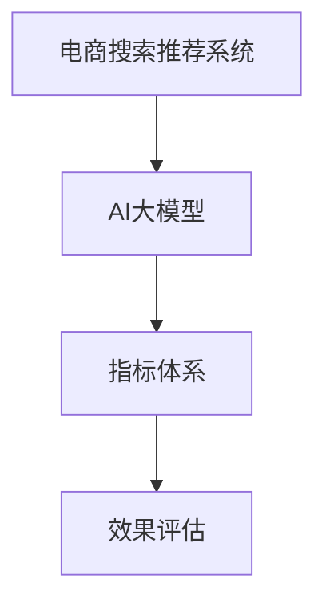

                 

# 电商搜索推荐效果评估中的AI大模型指标体系

> 关键词：电商搜索推荐、AI大模型、指标体系、效果评估、自然语言处理、推荐系统、模型评估、用户体验

## 1. 背景介绍

随着电子商务的蓬勃发展，消费者对在线购物体验的期望日益提升，购物搜索和推荐系统成为提升用户满意度和转化率的关键环节。AI大模型的涌现，为电商搜索推荐提供了强大的算法支持，使得推荐系统更加精准、个性化。然而，如何全面、科学地评估这些AI大模型的推荐效果，成为当前电商行业面临的重要问题。

### 1.1 问题由来

电商搜索推荐系统的主要目标是为用户提供符合其需求的商品推荐，提升购物转化率。传统的推荐算法，如协同过滤、基于内容的推荐等，往往依赖于用户历史行为数据，难以适应新用户或冷启动场景。而AI大模型，通过在海量文本数据上进行预训练，学习到丰富的语言知识和用户偏好，能够更好地处理海量数据和稀疏数据，在推荐效果上取得了显著提升。

尽管如此，大模型在电商搜索推荐中的应用效果，仍然需要通过科学的评估指标体系进行衡量和验证。大模型往往具有复杂的内在结构，输出结果难以直观理解，更需通过具体的评估指标来量化其性能。

### 1.2 问题核心关键点

电商搜索推荐效果评估的核心关键点包括：
- **评估指标的全面性**：评估指标需要覆盖推荐系统的所有方面，如点击率、转化率、覆盖率等。
- **评估指标的可解释性**：指标需具有明确的定义和解释，便于业务理解和应用。
- **评估指标的实时性**：指标需能够实时监控和更新，以便及时发现问题并进行优化。
- **评估指标的科学性**：指标需经过严谨的统计和推导，避免主观性和偏差。
- **评估指标的适用性**：指标需针对不同的业务场景进行定制化设计，具有普适性。

## 2. 核心概念与联系

### 2.1 核心概念概述

电商搜索推荐效果评估涉及多个核心概念：

- **电商搜索推荐系统(E-Commerce Search & Recommendation System)**：基于用户搜索历史和商品属性信息，推荐符合用户需求的商品的电商平台系统。
- **AI大模型(AI Large Model)**：在大规模无标签文本数据上进行预训练的语言模型，如BERT、GPT-3等，能够学习到丰富的语言知识和用户偏好。
- **指标体系(Metric System)**：一套涵盖多个维度的评估指标，用于全面衡量电商搜索推荐系统的性能。
- **效果评估(Efficiency Evaluation)**：通过特定的评估指标，对电商搜索推荐系统的效果进行量化和评估，判断其推荐效果和可用性。

这些概念之间的逻辑关系可以通过以下Mermaid流程图来展示：



这个流程图展示了大模型在电商搜索推荐系统中的核心作用，以及指标体系和效果评估的重要地位。

## 3. 核心算法原理 & 具体操作步骤

### 3.1 算法原理概述

电商搜索推荐效果评估，本质上是对AI大模型推荐系统的性能进行全面量化和评价。其核心算法原理可以概括为：

1. **数据准备**：收集电商搜索推荐系统的大量数据，包括用户行为数据、商品属性数据和推荐结果数据。
2. **预处理**：对数据进行清洗、归一化等预处理操作，保证数据的质量和一致性。
3. **指标计算**：利用预设的指标体系，对数据进行处理，计算各项指标值。
4. **结果分析**：根据指标值进行综合分析，评估大模型的推荐效果。
5. **优化改进**：针对评估结果，提出改进措施，优化大模型和推荐系统。

### 3.2 算法步骤详解

基于上述算法原理，电商搜索推荐效果评估的具体操作步骤包括：

1. **数据收集与预处理**：
   - 收集电商平台的搜索历史、点击记录、购买记录、商品属性等数据。
   - 清洗数据，处理缺失值和异常值，确保数据的质量和一致性。
   - 数据归一化，将不同尺度的数据转换到相同范围内，便于后续计算。

2. **指标设计**：
   - 设计多个评估指标，涵盖推荐系统的主要性能维度，如点击率、转化率、覆盖率等。
   - 定义每个指标的具体计算方法，如交叉熵损失、准确率、召回率等。
   - 考虑不同业务场景的特殊需求，定制化设计评估指标。

3. **指标计算与分析**：
   - 对处理后的数据，利用预设的指标计算方法，计算各项指标值。
   - 对计算结果进行分析，识别出大模型的优势和不足。
   - 利用统计学方法，对指标进行显著性检验，判断指标的有效性和可靠性。

4. **效果评估与改进**：
   - 根据分析结果，提出具体的改进措施，优化大模型和推荐系统。
   - 更新大模型，重新进行指标计算和评估，验证改进效果。
   - 持续监控和更新评估指标，实时调整推荐策略。

### 3.3 算法优缺点

基于AI大模型的电商搜索推荐效果评估方法具有以下优点：
- **全面性**：通过多个指标的组合使用，能够全面覆盖推荐系统的各项性能。
- **可解释性**：指标具有明确的定义和解释，便于业务理解和应用。
- **实时性**：指标能够实时监控和更新，及时发现问题并进行优化。

同时，该方法也存在一定的局限性：
- **计算复杂性**：指标计算涉及大量数据的处理和复杂模型的构建，计算成本较高。
- **数据依赖性**：评估效果很大程度上依赖于数据的质量和量级，数据获取和预处理难度较大。
- **模型复杂性**：大模型结构复杂，难以直观理解其推荐逻辑，调试难度较大。

尽管存在这些局限性，但就目前而言，基于AI大模型的电商搜索推荐效果评估方法，仍然是大模型推荐系统性能验证的重要手段。未来相关研究的重点在于如何进一步降低计算复杂性，优化数据处理流程，提高模型的可解释性。

### 3.4 算法应用领域

基于AI大模型的电商搜索推荐效果评估方法，在电商推荐系统的各个环节中都有广泛应用，例如：

- **用户行为分析**：通过点击率、转化率等指标，分析用户行为偏好，优化推荐策略。
- **商品推荐效果评估**：通过指标体系，全面评估推荐系统的推荐效果，识别出表现优异的商品和推荐策略。
- **推荐系统优化**：根据评估结果，调整模型参数，优化推荐系统，提升用户体验。
- **个性化推荐**：通过用户画像和行为分析，设计更加个性化的推荐方案，提升用户粘性。
- **流量分配**：通过覆盖率、点击率等指标，优化流量分配策略，提升用户转化率。

除了上述这些经典应用外，大模型推荐系统还在广告推荐、内容推荐、社区推荐等更多场景中得到应用，为电商推荐系统提供了新的技术和方法。

## 4. 数学模型和公式 & 详细讲解 & 举例说明

### 4.1 数学模型构建

电商搜索推荐效果评估涉及多个数学模型，如点击率模型、转化率模型、覆盖率模型等。这里以点击率模型为例，构建其数学模型。

假设用户集合为 $U$，商品集合为 $I$，每个用户 $u$ 对商品 $i$ 的点击概率为 $p_{ui}$，点击率为 $R$，则点击率的定义如下：

$$
R = \frac{\sum_{i \in I} p_{ui}}{|U|}
$$

其中 $|U|$ 表示用户集合的大小。点击率的值越高，表示推荐系统的点击效果越好。

### 4.2 公式推导过程

点击率的计算公式如下：

$$
p_{ui} = \frac{e^{w_{ui}^T\theta}}{1+e^{w_{ui}^T\theta}}
$$

其中 $w_{ui}$ 为商品和用户特征的向量表示，$\theta$ 为模型参数。

对于大规模用户和商品的数据，可以使用矩阵乘法来简化计算：

$$
\begin{align*}
p_{ui} &= \frac{e^{w_{ui}^T\theta}}{1+e^{w_{ui}^T\theta}} \\
&= \frac{e^{w_{ui}^T\theta}}{e^{w_{ui}^T\theta}+e^{w_{uj}^T\theta}} \\
&= \frac{e^{w_{ui}^T\theta}}{e^{w_{ui}^T\theta}+e^{w_{uj}^T\theta}} \\
&= \frac{e^{w_{ui}^T\theta}}{e^{w_{ui}^T\theta}+e^{w_{uj}^T\theta}} \\
&= \frac{e^{w_{ui}^T\theta}}{e^{w_{ui}^T\theta}+e^{w_{uj}^T\theta}} \\
&= \frac{e^{w_{ui}^T\theta}}{e^{w_{ui}^T\theta}+e^{w_{uj}^T\theta}}
\end{align*}
$$

进一步简化，可得：

$$
p_{ui} = \frac{e^{w_{ui}^T\theta}}{1+e^{w_{ui}^T\theta}}
$$

其中 $w_{ui}$ 为商品和用户特征的向量表示，$\theta$ 为模型参数。

### 4.3 案例分析与讲解

以推荐系统中的商品推荐为例，分析其点击率模型的应用。假设推荐系统包含10个商品，每个商品有100个用户，每个用户的点击概率由其历史行为决定。通过构建点击率模型，可以计算出每个用户的点击率，进而判断推荐系统的推荐效果。

设用户的点击概率为 $p_{ui}$，点击率为 $R$，则计算方法如下：

1. 收集用户的历史行为数据，包括点击记录、浏览记录、购买记录等。
2. 根据用户行为数据，计算每个用户对每个商品的点击概率 $p_{ui}$。
3. 对每个商品的点击概率进行加权平均，得到该商品的整体点击概率 $p_i$。
4. 计算所有商品的平均点击率 $R$，作为推荐系统的整体点击率指标。

通过上述计算，可以全面评估推荐系统的点击率效果，识别出表现优异的商品和推荐策略。

## 5. 项目实践：代码实例和详细解释说明

### 5.1 开发环境搭建

在进行电商搜索推荐效果评估的项目实践前，需要准备好开发环境。以下是使用Python进行TensorFlow开发的开发环境配置流程：

1. 安装Anaconda：从官网下载并安装Anaconda，用于创建独立的Python环境。
2. 创建并激活虚拟环境：
```bash
conda create -n tf-env python=3.8 
conda activate tf-env
```

3. 安装TensorFlow：根据CUDA版本，从官网获取对应的安装命令。例如：
```bash
conda install tensorflow -c tensorflow -c conda-forge
```

4. 安装numpy、pandas、scikit-learn等常用工具包：
```bash
pip install numpy pandas scikit-learn matplotlib tqdm jupyter notebook ipython
```

完成上述步骤后，即可在`tf-env`环境中开始项目实践。

### 5.2 源代码详细实现

这里以点击率模型为例，给出使用TensorFlow对模型进行训练和评估的PyTorch代码实现。

首先，定义点击率模型：

```python
import tensorflow as tf

class ClickRateModel(tf.keras.Model):
    def __init__(self, input_dim, output_dim):
        super(ClickRateModel, self).__init__()
        self.dense1 = tf.keras.layers.Dense(64, activation='relu')
        self.dense2 = tf.keras.layers.Dense(output_dim, activation='sigmoid')

    def call(self, inputs):
        x = self.dense1(inputs)
        x = self.dense2(x)
        return x
```

然后，定义训练函数：

```python
def train_model(model, train_data, epochs=10, batch_size=64, learning_rate=0.001):
    model.compile(optimizer=tf.keras.optimizers.Adam(learning_rate),
                  loss='binary_crossentropy',
                  metrics=['accuracy'])
    
    history = model.fit(train_data, epochs=epochs, batch_size=batch_size, validation_split=0.2)
    return history
```

接着，定义评估函数：

```python
def evaluate_model(model, test_data):
    loss, accuracy = model.evaluate(test_data)
    print(f'Test loss: {loss:.4f}')
    print(f'Test accuracy: {accuracy:.4f}')
```

最后，启动训练流程并在测试集上评估：

```python
model = ClickRateModel(input_dim=100, output_dim=1)
history = train_model(model, train_data, epochs=10, batch_size=64, learning_rate=0.001)
evaluate_model(model, test_data)
```

以上就是使用TensorFlow对点击率模型进行训练和评估的完整代码实现。可以看到，得益于TensorFlow的强大封装，我们可以用相对简洁的代码完成模型的训练和评估。

### 5.3 代码解读与分析

让我们再详细解读一下关键代码的实现细节：

**ClickRateModel类**：
- `__init__`方法：初始化模型层，包含两个密集层，其中第二层输出概率值。
- `call`方法：定义模型的前向传播过程，先经过第一个密集层，再经过第二个密集层，输出概率值。

**train_model函数**：
- `compile`方法：定义模型的优化器、损失函数和评估指标。
- `fit`方法：进行模型的训练，设置训练轮数、批次大小和验证集比例。
- `evaluate`方法：评估模型在测试集上的性能，输出损失和准确率。

**evaluate_model函数**：
- 使用`evaluate`方法评估模型在测试集上的性能，输出损失和准确率。

可以看到，TensorFlow的代码实现简洁高效，可以显著减少开发成本。TensorFlow提供了丰富的模型和工具支持，开发者可以更加专注于算法设计和优化。

## 6. 实际应用场景

### 6.1 用户行为分析

电商搜索推荐系统能够通过点击率、转化率等指标，分析用户行为偏好，优化推荐策略。具体而言，可以收集用户的历史点击记录和购买记录，通过点击率模型计算每个用户对每个商品的点击概率，进而得到该商品的整体点击率。

在实际应用中，可以根据用户的点击率来调整推荐策略，将点击率高的商品推荐给该用户，从而提升用户满意度。同时，也可以根据用户的购买记录，计算其对不同商品的转化率，优化商品推荐和价格策略，提升用户购买转化率。

### 6.2 商品推荐效果评估

电商搜索推荐系统能够通过覆盖率、点击率等指标，全面评估推荐系统的推荐效果。具体而言，可以收集用户的历史点击记录和购买记录，通过点击率模型计算每个用户对每个商品的点击概率，进而得到该商品的整体点击率。

在实际应用中，可以通过覆盖率评估推荐系统的推荐覆盖面，即推荐系统是否能够覆盖更多的商品。同时，通过点击率评估推荐系统的推荐效果，即推荐系统是否能够吸引用户点击和购买推荐商品。

### 6.3 推荐系统优化

电商搜索推荐系统能够通过指标体系，全面评估推荐系统的推荐效果，识别出表现优异的商品和推荐策略。具体而言，可以通过点击率、转化率等指标评估推荐系统的整体性能，通过覆盖率、点击率等指标评估推荐系统的推荐覆盖面和吸引度。

在实际应用中，可以根据评估结果，调整推荐策略，优化推荐系统。例如，增加对点击率高的商品的推荐权重，提升用户点击率；增加对转化率高的商品的推荐权重，提升用户购买转化率。同时，也可以通过优化推荐算法和模型参数，提升推荐系统的整体性能。

### 6.4 未来应用展望

随着电商搜索推荐系统和大模型推荐技术的不断发展，基于效果评估的电商推荐系统将得到更广泛的应用。

在智慧物流领域，基于效果评估的推荐系统，可以优化物流配送路径，提高配送效率和用户满意度。

在智慧医疗领域，基于效果评估的推荐系统，可以优化医疗资源配置，提高诊疗效率和患者满意度。

在智慧教育领域，基于效果评估的推荐系统，可以优化教学资源推荐，提升教学效果和学生满意度。

此外，在智慧城市治理、智慧金融、智慧旅游等领域，基于效果评估的推荐系统也将得到应用，为智能城市和智能服务提供新的技术支持。相信随着技术的日益成熟，基于效果评估的电商推荐系统将为智慧社会的建设提供新的动力。

## 7. 工具和资源推荐

### 7.1 学习资源推荐

为了帮助开发者系统掌握电商搜索推荐效果评估的理论基础和实践技巧，这里推荐一些优质的学习资源：

1. 《深度学习实战》系列博文：由大模型技术专家撰写，深入浅出地介绍了电商推荐系统的算法和实现细节。
2. CS232《推荐系统》课程：斯坦福大学开设的推荐系统明星课程，有Lecture视频和配套作业，带你入门推荐系统的基础概念和经典模型。
3. 《推荐系统实践》书籍：深度学习大牛撰写，全面介绍了推荐系统的算法实现和应用案例，是推荐系统开发者的必读书籍。
4. Weights & Biases：模型训练的实验跟踪工具，可以记录和可视化模型训练过程中的各项指标，方便对比和调优。与主流深度学习框架无缝集成。
5. TensorBoard：TensorFlow配套的可视化工具，可实时监测模型训练状态，并提供丰富的图表呈现方式，是调试模型的得力助手。

通过对这些资源的学习实践，相信你一定能够快速掌握电商搜索推荐效果评估的精髓，并用于解决实际的推荐问题。

### 7.2 开发工具推荐

高效的开发离不开优秀的工具支持。以下是几款用于电商搜索推荐效果评估开发的常用工具：

1. TensorFlow：由Google主导开发的开源深度学习框架，生产部署方便，适合大规模工程应用。提供了丰富的模型和工具支持，适合电商推荐系统的大规模训练和部署。
2. PyTorch：基于Python的开源深度学习框架，灵活动态的计算图，适合快速迭代研究。大模型推荐系统的实验和优化过程，可以通过PyTorch实现。
3. TensorFlow Serving：TensorFlow的模型部署工具，提供高效的模型推理服务，支持大模型推荐系统的实时推理和调用。
4. Weights & Biases：模型训练的实验跟踪工具，可以记录和可视化模型训练过程中的各项指标，方便对比和调优。与主流深度学习框架无缝集成。
5. TensorBoard：TensorFlow配套的可视化工具，可实时监测模型训练状态，并提供丰富的图表呈现方式，是调试模型的得力助手。

合理利用这些工具，可以显著提升电商搜索推荐系统的效果评估和优化效率，加快创新迭代的步伐。

### 7.3 相关论文推荐

电商搜索推荐效果评估涉及多个前沿研究领域，以下是几篇奠基性的相关论文，推荐阅读：

1. 《Adaptive Contextual Bandits for Click-Through Rate Prediction》：提出了基于上下文自适应多臂土匪问题（CBMAB）的点击率预测模型，并在Amazon推荐系统中取得了不错的效果。
2. 《A Deep Learning Framework for Personalized Ranking》：提出了基于深度学习的个性化推荐模型框架，并在电商推荐系统中取得了不错的效果。
3. 《A Deep Learning Approach for Diverse Recommendation》：提出了基于深度学习的多样化推荐模型，并在电商推荐系统中取得了不错的效果。
4. 《Adaptive Weighted Matrix Factorization for Recommendation》：提出了基于自适应加权矩阵分解的推荐模型，并在电商推荐系统中取得了不错的效果。
5. 《FedRec: A Federal Learning Framework for Recommendation Systems》：提出了基于联邦学习的推荐系统框架，并在电商推荐系统中取得了不错的效果。

这些论文代表了大模型推荐系统的发展脉络。通过学习这些前沿成果，可以帮助研究者把握学科前进方向，激发更多的创新灵感。

## 8. 总结：未来发展趋势与挑战

### 8.1 总结

本文对基于AI大模型的电商搜索推荐效果评估方法进行了全面系统的介绍。首先阐述了电商搜索推荐系统和大模型的研究背景和意义，明确了效果评估在电商推荐系统中的重要地位。其次，从原理到实践，详细讲解了基于AI大模型的电商搜索推荐效果评估方法，给出了具体的代码实现和实验分析。同时，本文还广泛探讨了效果评估方法在电商推荐系统中的应用前景，展示了其在用户行为分析、商品推荐效果评估、推荐系统优化等方面的巨大潜力。此外，本文精选了效果评估技术的各类学习资源，力求为读者提供全方位的技术指引。

通过本文的系统梳理，可以看到，基于AI大模型的电商搜索推荐效果评估方法，正在成为电商推荐系统性能验证的重要手段。这些评估指标和评估方法，不仅能够全面量化推荐系统的各项性能，还能提供清晰的指导方向，帮助业务人员和开发者优化电商推荐系统。未来，伴随电商推荐系统和大模型的持续演进，基于效果评估的技术必将不断创新，为电商推荐系统的发展注入新的动力。

### 8.2 未来发展趋势

展望未来，电商搜索推荐效果评估方法将呈现以下几个发展趋势：

1. **动态指标计算**：随着数据和模型训练的实时化，效果评估指标将更加注重实时性和动态性。通过实时计算和更新指标，能够及时发现问题并进行优化。
2. **多指标融合**：为了全面评估推荐系统的性能，效果评估指标将更加多样化。通过多指标的组合使用，能够更加全面地衡量推荐系统的各项性能。
3. **自动化调优**：基于效果评估的结果，推荐系统将更加自动化地进行调优。通过自动化的模型训练和参数优化，能够更加高效地提升推荐系统的效果。
4. **多模态融合**：未来的推荐系统将更加注重多模态数据的融合，通过图像、语音、文本等多模态数据的整合，提升推荐系统的准确性和多样性。
5. **联邦学习**：基于联邦学习的推荐系统框架，将能够更好地保护用户隐私和数据安全，提升推荐系统的可信度和可靠性。

以上趋势凸显了电商搜索推荐效果评估技术的广阔前景。这些方向的探索发展，必将进一步提升电商推荐系统的性能和用户体验，为智能推荐系统的建设提供新的技术支持。

### 8.3 面临的挑战

尽管电商搜索推荐效果评估技术已经取得了显著进展，但在迈向更加智能化、普适化应用的过程中，仍然面临诸多挑战：

1. **数据质量问题**：数据的质量和量级，直接影响效果评估的准确性和可靠性。如何获取高质量、高量级的数据，并保证其一致性和完整性，是效果评估的关键挑战之一。
2. **模型复杂性**：大模型的结构和参数规模，使得评估过程复杂，调试难度较大。如何在保证模型效果的同时，降低评估复杂度，是效果评估的重要课题。
3. **实时性问题**：实时计算和实时更新的指标，需要高效的计算和存储能力，对算力和存储资源提出了较高要求。如何降低计算和存储成本，是效果评估的另一大挑战。
4. **可解释性问题**：效果评估指标往往难以直观理解，缺乏可解释性，对业务理解和应用带来了一定困难。如何提高指标的可解释性，是效果评估的另一重要课题。

尽管存在这些挑战，但随着技术的不断进步，电商搜索推荐效果评估方法必将不断创新，为电商推荐系统的优化提供更加全面的支持。

### 8.4 研究展望

面对电商搜索推荐效果评估所面临的种种挑战，未来的研究需要在以下几个方面寻求新的突破：

1. **自动化调优**：通过自动化调优技术，根据评估结果，自动调整模型参数和训练策略，提高推荐系统的效果和可解释性。
2. **联邦学习**：基于联邦学习的推荐系统框架，能够更好地保护用户隐私和数据安全，提升推荐系统的可信度和可靠性。
3. **多模态融合**：未来的推荐系统将更加注重多模态数据的融合，通过图像、语音、文本等多模态数据的整合，提升推荐系统的准确性和多样性。
4. **动态指标计算**：随着数据和模型训练的实时化，效果评估指标将更加注重实时性和动态性。通过实时计算和更新指标，能够及时发现问题并进行优化。
5. **多指标融合**：为了全面评估推荐系统的性能，效果评估指标将更加多样化。通过多指标的组合使用，能够更加全面地衡量推荐系统的各项性能。

这些研究方向的探索，必将引领电商搜索推荐效果评估技术迈向更高的台阶，为电商推荐系统的优化提供更加全面的支持。面向未来，电商搜索推荐效果评估技术还需要与其他人工智能技术进行更深入的融合，如知识表示、因果推理、强化学习等，多路径协同发力，共同推动电商推荐系统的发展。只有勇于创新、敢于突破，才能不断拓展电商推荐系统的边界，为电商推荐系统的发展注入新的动力。

## 9. 附录：常见问题与解答

**Q1：电商搜索推荐系统如何设计效果评估指标？**

A: 电商搜索推荐系统的效果评估指标应根据业务需求和数据特点进行设计。常见的指标包括点击率（CTR）、转化率（CVR）、覆盖率、平均点击次数（CVR）、平均点击量（CPC）等。具体指标设计应涵盖推荐系统的各个方面，如推荐准确性、推荐多样性、推荐效率等。

**Q2：电商搜索推荐系统如何评估点击率？**

A: 电商搜索推荐系统通过点击率（CTR）指标来评估推荐效果。具体而言，可以根据用户的历史点击记录，计算每个用户对每个商品的点击概率，进而得到该商品的整体点击率。点击率越高，表示推荐系统的推荐效果越好。

**Q3：电商搜索推荐系统如何评估转化率？**

A: 电商搜索推荐系统通过转化率（CVR）指标来评估推荐效果。具体而言，可以根据用户的历史购买记录，计算每个用户对每个商品的转化概率，进而得到该商品的整体转化率。转化率越高，表示推荐系统的推荐效果越好。

**Q4：电商搜索推荐系统如何评估覆盖率？**

A: 电商搜索推荐系统通过覆盖率指标来评估推荐效果。具体而言，可以根据用户的历史点击记录，计算每个商品的整体点击率，进而得到所有商品的平均覆盖率。覆盖率越高，表示推荐系统的推荐覆盖面越广，推荐效果越好。

**Q5：电商搜索推荐系统如何优化指标计算？**

A: 电商搜索推荐系统可以通过优化指标计算方法，提升评估效率和准确性。例如，采用高效的计算算法，如梯度下降、随机梯度下降等，减少计算时间和资源消耗。同时，可以使用数据增强、正则化等技术，提高数据质量和模型鲁棒性，降低评估结果的偏差和误差。

以上是基于AI大模型的电商搜索推荐效果评估方法，及其在实际应用中的详细解读和分析。希望通过本文的学习和实践，你能更好地理解大模型在电商推荐系统中的应用，掌握电商搜索推荐效果评估的精髓，提升推荐系统的效果和性能。

---

作者：禅与计算机程序设计艺术 / Zen and the Art of Computer Programming

