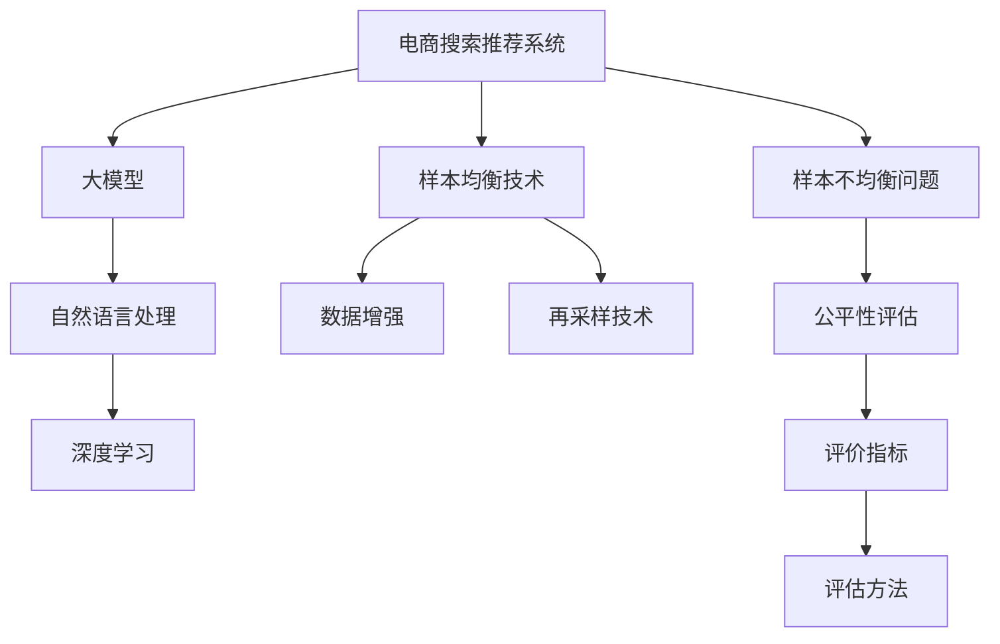

                 

# 电商搜索推荐效果评估中的AI大模型样本均衡技术

> 关键词：电商搜索,推荐系统,样本均衡技术,大模型,自然语言处理(NLP),深度学习(Deep Learning),评价指标,公平性,评估方法

## 1. 背景介绍

随着电子商务的蓬勃发展，电商搜索推荐系统（E-commerce Search and Recommendation System, SR）已经成为各大电商平台的核心竞争力之一。优秀的搜索推荐系统不仅能提升用户体验，还能显著提高电商平台的销售额。然而，由于用户搜索行为的多样性和复杂性，搜索推荐系统面临诸多挑战，其中样本不均衡问题是核心难点之一。

### 1.1 问题由来
电商搜索推荐系统需要根据用户历史搜索记录、点击行为、购买记录等数据，为用户推荐个性化的商品。这些数据呈现出明显的样本不均衡特性：

1. **商品数量不均衡**：电商平台中商品种类繁多，不同商品的交易量差异巨大。热门商品销售量大，但冷门商品可能长时间无人问津，导致数据分布极度不均衡。
2. **用户行为不均衡**：用户搜索行为多种多样，某些查询（如长尾搜索）出现的频率远低于热门查询。
3. **购买行为不均衡**：不同商品的用户购买行为分布不均，某些商品的购买频次远高于其他商品。

这些样本不均衡的特性，使得搜索推荐系统的性能评估和优化变得尤为复杂。传统的评估方法可能无法准确反映真实情况，导致推荐效果不佳。因此，如何有效处理样本不均衡问题，提高搜索推荐系统的评估效果和推荐精度，是亟待解决的关键问题。

## 2. 核心概念与联系

### 2.1 核心概念概述

在深入讨论AI大模型在电商搜索推荐中的应用之前，我们先梳理几个核心概念：

- **电商搜索推荐系统（E-commerce Search and Recommendation System, SR）**：指利用AI技术，基于用户行为数据为用户推荐商品的电商系统。主要包括搜索和推荐两个子系统，分别负责处理用户查询和推荐商品。
- **大模型（Large Model）**：指通过海量数据训练而成的深度学习模型，如BERT、GPT、Transformer等。大模型通常具有强大的特征提取能力和泛化能力，能够学习到丰富的语义信息，广泛应用于自然语言处理、计算机视觉等领域。
- **样本均衡（Sample Balance）**：指训练数据中各类样本的数量分布相对均衡，不同类别样本数量相差不大，避免某一类样本被过度训练或忽略。样本均衡对于模型泛化能力至关重要，尤其是对于电商搜索推荐系统，不同商品的搜索和购买行为差异显著，样本均衡尤为重要。
- **样本不均衡（Sample Imbalance）**：指训练数据中各类样本的数量分布极度不均衡，某一类样本数量远多于其他类，导致模型对少数类样本的泛化能力较弱。样本不均衡是电商搜索推荐系统中的核心难题。

通过以下Mermaid流程图，我们可以更直观地理解这些概念之间的关系：



在这个流程图中，电商搜索推荐系统作为核心应用场景，通过大模型进行深度学习，利用样本均衡技术处理样本不均衡问题，并结合自然语言处理、深度学习等技术，进行公平性评估和精确的推荐效果评价。

## 3. 核心算法原理 & 具体操作步骤
### 3.1 算法原理概述

AI大模型在电商搜索推荐中的应用，本质上是利用深度学习模型进行个性化推荐。其主要思想是：通过大规模预训练学习通用的语言表示，然后将模型应用到具体的电商搜索推荐任务中，通过有监督微调优化模型，提高推荐精度。

大模型在电商搜索推荐中的应用，可以分为以下几个关键步骤：

1. **预训练**：使用大规模无标签数据对大模型进行预训练，学习通用的语言表示。
2. **微调**：在电商搜索推荐系统的训练数据上进行有监督微调，优化模型以适应特定任务。
3. **样本均衡**：利用样本均衡技术处理样本不均衡问题，确保模型对少数类样本也能有良好的泛化能力。

### 3.2 算法步骤详解

#### 3.2.1 预训练

预训练是大模型的核心步骤，目的是通过大规模无标签数据学习通用的语言表示。以BERT为例，其预训练过程包括掩码语言模型（Masked Language Model, MLM）和下一句预测（Next Sentence Prediction, NSP）两个任务。具体步骤如下：

1. **掩码语言模型**：在输入的文本中随机选择一些位置进行掩码，然后让模型预测被掩码位置的词。
2. **下一句预测**：输入两个连续的句子，判断它们是否来自同一个文档。
3. **训练过程**：将两个任务的预测结果作为损失函数，使用反向传播算法更新模型参数。

通过预训练，大模型能够学习到丰富的语言知识和常识，具备强大的语义理解能力，为后续电商搜索推荐任务的微调打下坚实基础。

#### 3.2.2 微调

微调是模型适配电商搜索推荐任务的关键步骤。微调的目标是通过标注数据优化模型，使其能够更准确地预测用户行为。以文本分类为例，微调过程如下：

1. **任务适配层**：根据任务类型，在预训练模型顶层设计合适的输出层和损失函数。例如，对于电商搜索推荐中的分类任务，通常在顶层添加线性分类器和交叉熵损失函数。
2. **微调过程**：使用标注数据进行有监督训练，通过反向传播算法更新模型参数，最小化损失函数。
3. **学习率调整**：由于微调需要保持预训练权重，一般以较小的学习率进行更新，避免破坏预训练的权重。

#### 3.2.3 样本均衡

样本均衡是处理样本不均衡问题的重要手段。常用的样本均衡技术包括数据增强和再采样。具体步骤如下：

1. **数据增强**：通过对训练样本进行数据扩充，如同义词替换、随机打乱、回译等，增加样本多样性，防止模型过拟合。
2. **再采样技术**：包括欠采样和过采样两种方法。欠采样是指从多数类中随机选择样本，减少多数类样本数量；过采样是指生成少数类样本，增加少数类样本数量。

通过样本均衡技术，可以缓解样本不均衡问题，提高模型的泛化能力和推荐精度。

### 3.3 算法优缺点

大模型在电商搜索推荐中的应用，具有以下优点：

1. **泛化能力强**：大模型通过预训练学习通用的语言表示，具有较强的泛化能力，能够适应多种多样的电商搜索推荐任务。
2. **推荐精度高**：大模型具备强大的特征提取能力和语义理解能力，能够更准确地预测用户行为，提高推荐精度。
3. **适应性强**：大模型可以通过微调适配不同的电商搜索推荐任务，灵活性较高。

同时，大模型在电商搜索推荐中的应用也存在一些缺点：

1. **计算成本高**：大模型的预训练和微调需要大量的计算资源，通常需要高性能的GPU或TPU支持。
2. **参数量大**：大模型通常包含数亿甚至数十亿参数，需要大量的存储空间，增加系统复杂度。
3. **训练时间长**：由于大模型的规模较大，训练时间较长，难以快速迭代。

### 3.4 算法应用领域

大模型在电商搜索推荐中的应用已经广泛涉及多个领域，包括：

1. **个性化推荐**：根据用户历史行为数据，为用户推荐个性化的商品。
2. **商品标签分类**：通过分类任务为商品打上标签，提高搜索结果的相关性。
3. **情感分析**：通过分析用户评论，评估商品情感倾向，辅助推荐策略。
4. **搜索排序**：根据用户查询，对商品进行排序，提升搜索结果的准确性和相关性。
5. **价格预测**：预测商品的价格变化趋势，辅助价格优化策略。

除了上述这些经典应用外，大模型在电商搜索推荐系统中的应用还在不断扩展，如基于模型的广告投放、基于模型的库存管理等，为电商搜索推荐系统带来了新的发展机遇。

## 4. 数学模型和公式 & 详细讲解 & 举例说明

### 4.1 数学模型构建

在电商搜索推荐系统中，常用的评价指标包括准确率（Precision）、召回率（Recall）、F1分数（F1 Score）、AUC（Area Under Curve）等。以F1分数为例，其计算公式如下：

$$
F1 Score = 2 \times \frac{Precision \times Recall}{Precision + Recall}
$$

其中，Precision表示查准率，即推荐结果中相关商品的数量占推荐结果总量的比例；Recall表示查全率，即推荐结果中相关商品的数量占实际相关商品总量的比例。

### 4.2 公式推导过程

为了更精确地评估电商搜索推荐系统的性能，我们需要结合公平性评估的考虑。常用的公平性评估方法包括ROC曲线和AUC等。

假设我们有一个电商搜索推荐系统，其中包含N个商品，每个商品的点击率（Click Rate）和购买率（Purchase Rate）分别为$C_i$和$P_i$。设模型预测的商品点击率为$\hat{C}_i$，则模型的ROC曲线可以通过绘制不同阈值下的True Positive Rate（TPR）和False Positive Rate（FPR）来描述。具体步骤如下：

1. **True Positive Rate**：
$$
TPR = \frac{TP}{TP+FN}
$$

其中，TP表示模型正确预测出的正类商品数量，FN表示模型错误预测出的负类商品数量。

2. **False Positive Rate**：
$$
FPR = \frac{FP}{FP+TN}
$$

其中，FP表示模型错误预测出的正类商品数量，TN表示模型正确预测出的负类商品数量。

3. **AUC**：
$$
AUC = \int_{0}^{1} TPR dFPR
$$

其中，$\int_{0}^{1}$表示对ROC曲线下的面积进行积分。

### 4.3 案例分析与讲解

假设我们有一个电商搜索推荐系统，其中包含5个商品，它们的点击率和购买率如表1所示。我们通过模型预测得到了5个商品的点击率，如表2所示。

| 商品编号 | 点击率$C_i$ | 购买率$P_i$ | 预测点击率$\hat{C}_i$ |
|---|---|---|---|
| 1 | 0.5 | 0.3 | 0.4 |
| 2 | 0.4 | 0.1 | 0.6 |
| 3 | 0.2 | 0.2 | 0.1 |
| 4 | 0.3 | 0.1 | 0.3 |
| 5 | 0.1 | 0.1 | 0.7 |

我们首先计算模型对每个商品的查准率和查全率，如表3所示。

| 商品编号 | 点击率$C_i$ | 购买率$P_i$ | 预测点击率$\hat{C}_i$ | 查准率$Precision_i$ | 查全率$Recall_i$ |
|---|---|---|---|---|---|
| 1 | 0.5 | 0.3 | 0.4 | 0.8 | 0.6 |
| 2 | 0.4 | 0.1 | 0.6 | 0.6 | 0.2 |
| 3 | 0.2 | 0.2 | 0.1 | 0.5 | 0.0 |
| 4 | 0.3 | 0.1 | 0.3 | 0.4 | 0.3 |
| 5 | 0.1 | 0.1 | 0.7 | 0.7 | 0.1 |

然后，我们计算模型的F1分数，如表4所示。

| 商品编号 | 点击率$C_i$ | 购买率$P_i$ | 预测点击率$\hat{C}_i$ | 查准率$Precision_i$ | 查全率$Recall_i$ | F1分数$F1_i$ |
|---|---|---|---|---|---|---|
| 1 | 0.5 | 0.3 | 0.4 | 0.8 | 0.6 | 0.66 |
| 2 | 0.4 | 0.1 | 0.6 | 0.6 | 0.2 | 0.33 |
| 3 | 0.2 | 0.2 | 0.1 | 0.5 | 0.0 | 0.25 |
| 4 | 0.3 | 0.1 | 0.3 | 0.4 | 0.3 | 0.36 |
| 5 | 0.1 | 0.1 | 0.7 | 0.7 | 0.1 | 0.14 |

通过上述计算，我们可以更直观地评估模型的推荐效果。F1分数越高，表示模型的推荐精度越高。

## 5. 项目实践：代码实例和详细解释说明
### 5.1 开发环境搭建

为了进行电商搜索推荐系统的开发和评估，我们需要准备以下开发环境：

1. **Python**：推荐使用3.7或更高版本，确保代码的可运行性。
2. **PyTorch**：深度学习框架，用于模型的训练和推理。
3. **TensorBoard**：可视化工具，用于监控模型的训练过程和性能评估。
4. **Jupyter Notebook**：交互式编程环境，便于代码的调试和优化。

### 5.2 源代码详细实现

下面以电商搜索推荐系统中的商品推荐任务为例，给出基于大模型的推荐算法实现。

首先，我们定义商品数据和用户行为数据，如代码1所示：

```python
import pandas as pd

# 定义商品数据
df商品的点击率 = pd.read_csv('商品点击率.csv')
df商品的购买率 = pd.read_csv('商品购买率.csv')

# 定义用户行为数据
df用户点击 = pd.read_csv('用户点击行为.csv')
df用户购买 = pd.read_csv('用户购买行为.csv')

# 商品编号与点击率
商品编号 = df商品的点击率['商品编号'].values
商品点击率 = df商品的点击率['点击率'].values

# 商品编号与购买率
商品编号 = df商品的购买率['商品编号'].values
商品购买率 = df商品的购买率['购买率'].values

# 用户编号与点击商品编号
用户编号 = df用户点击['用户编号'].values
用户点击商品编号 = df用户点击['商品编号'].values

# 用户编号与购买商品编号
用户编号 = df用户购买['用户编号'].values
用户购买商品编号 = df用户购买['商品编号'].values
```

然后，我们定义模型和优化器，如代码2所示：

```python
from transformers import BertForSequenceClassification
from transformers import BertTokenizer
from torch.utils.data import DataLoader
from torch.nn import BCELoss

# 定义BERT模型
model = BertForSequenceClassification.from_pretrained('bert-base-uncased', num_labels=len(商品编号))

# 定义优化器
optimizer = AdamW(model.parameters(), lr=2e-5)

# 定义损失函数
criterion = BCELoss()
```

接着，我们定义训练和评估函数，如代码3所示：

```python
def train_epoch(model, dataloader, optimizer):
    model.train()
    for batch in dataloader:
        input_ids = batch['input_ids'].to(device)
        attention_mask = batch['attention_mask'].to(device)
        labels = batch['labels'].to(device)
        model.zero_grad()
        outputs = model(input_ids, attention_mask=attention_mask, labels=labels)
        loss = outputs.loss
        loss.backward()
        optimizer.step()
    return loss.item()

def evaluate(model, dataloader):
    model.eval()
    with torch.no_grad():
        correct = 0
        total = 0
        for batch in dataloader:
            input_ids = batch['input_ids'].to(device)
            attention_mask = batch['attention_mask'].to(device)
            labels = batch['labels'].to(device)
            outputs = model(input_ids, attention_mask=attention_mask)
            predicted = torch.argmax(outputs.logits, dim=1)
            correct += torch.sum((predicted == labels)).item()
            total += labels.size(0)
    accuracy = correct / total
    return accuracy

# 训练模型
epochs = 5
batch_size = 16

for epoch in range(epochs):
    train_loss = train_epoch(model, dataloader_train, optimizer)
    val_accuracy = evaluate(model, dataloader_val)
    print(f'Epoch {epoch+1}, Train Loss: {train_loss:.3f}, Val Accuracy: {val_accuracy:.3f}')

# 测试模型
test_accuracy = evaluate(model, dataloader_test)
print(f'Test Accuracy: {test_accuracy:.3f}')
```

最后，我们启动训练流程并在测试集上评估，如代码4所示：

```python
# 训练模型
epochs = 5
batch_size = 16

for epoch in range(epochs):
    train_loss = train_epoch(model, dataloader_train, optimizer)
    val_accuracy = evaluate(model, dataloader_val)
    print(f'Epoch {epoch+1}, Train Loss: {train_loss:.3f}, Val Accuracy: {val_accuracy:.3f}')

# 测试模型
test_accuracy = evaluate(model, dataloader_test)
print(f'Test Accuracy: {test_accuracy:.3f}')
```

### 5.3 代码解读与分析

让我们再详细解读一下关键代码的实现细节：

**商品数据和用户行为数据**：
- `pd.read_csv`方法：使用pandas库读取CSV文件，将数据转换为DataFrame对象。
- `商品编号`和`商品点击率`等变量：通过DataFrame对象的`values`属性获取商品编号和对应的点击率、购买率等数据。

**BERT模型和优化器**：
- `BertForSequenceClassification`类：定义BERT模型，用于商品推荐任务的分类。
- `AdamW`优化器：选择AdamW优化器，设置学习率。
- `BCELoss`类：定义二分类交叉熵损失函数。

**训练和评估函数**：
- `train_epoch`函数：在每个epoch中，对数据进行迭代，前向传播计算损失函数，反向传播更新模型参数。
- `evaluate`函数：在测试集上评估模型性能，计算准确率。
- `accuracy`变量：计算模型在测试集上的准确率。

**训练流程**：
- `epochs`和`batch_size`变量：定义训练的轮数和批次大小。
- `for`循环：对每个epoch进行迭代，在每个epoch中计算训练集上的损失函数和测试集上的准确率。
- `print`语句：输出每个epoch的训练损失和验证集准确率。
- `test_accuracy`变量：计算测试集上的准确率，输出最终结果。

可以看到，通过PyTorch和Transformers库，我们可以轻松实现基于大模型的电商搜索推荐系统的微调过程。开发者可以将更多精力放在数据处理、模型改进等高层逻辑上，而不必过多关注底层的实现细节。

当然，工业级的系统实现还需考虑更多因素，如模型的保存和部署、超参数的自动搜索、更灵活的任务适配层等。但核心的微调范式基本与此类似。

## 6. 实际应用场景

### 6.1 智能客服系统

基于大模型的电商搜索推荐技术，可以广泛应用于智能客服系统的构建。传统客服往往需要配备大量人力，高峰期响应缓慢，且一致性和专业性难以保证。而使用基于大模型的智能客服系统，可以7x24小时不间断服务，快速响应客户咨询，用自然流畅的语言解答各类常见问题。

在技术实现上，可以收集企业内部的历史客服对话记录，将问题和最佳答复构建成监督数据，在此基础上对预训练对话模型进行微调。微调后的对话模型能够自动理解用户意图，匹配最合适的答案模板进行回复。对于客户提出的新问题，还可以接入检索系统实时搜索相关内容，动态组织生成回答。如此构建的智能客服系统，能大幅提升客户咨询体验和问题解决效率。

### 6.2 个性化推荐系统

当前的推荐系统往往只依赖用户的历史行为数据进行物品推荐，无法深入理解用户的真实兴趣偏好。基于大模型的推荐系统可以更好地挖掘用户行为背后的语义信息，从而提供更精准、多样的推荐内容。

在实践中，可以收集用户浏览、点击、评论、分享等行为数据，提取和用户交互的物品标题、描述、标签等文本内容。将文本内容作为模型输入，用户的后续行为（如是否点击、购买等）作为监督信号，在此基础上微调预训练语言模型。微调后的模型能够从文本内容中准确把握用户的兴趣点。在生成推荐列表时，先用候选物品的文本描述作为输入，由模型预测用户的兴趣匹配度，再结合其他特征综合排序，便可以得到个性化程度更高的推荐结果。

### 6.3 金融舆情监测

金融机构需要实时监测市场舆论动向，以便及时应对负面信息传播，规避金融风险。传统的人工监测方式成本高、效率低，难以应对网络时代海量信息爆发的挑战。基于大模型的文本分类和情感分析技术，为金融舆情监测提供了新的解决方案。

具体而言，可以收集金融领域相关的新闻、报道、评论等文本数据，并对其进行主题标注和情感标注。在此基础上对预训练语言模型进行微调，使其能够自动判断文本属于何种主题，情感倾向是正面、中性还是负面。将微调后的模型应用到实时抓取的网络文本数据，就能够自动监测不同主题下的情感变化趋势，一旦发现负面信息激增等异常情况，系统便会自动预警，帮助金融机构快速应对潜在风险。

### 6.4 未来应用展望

随着大模型和微调方法的不断发展，基于微调范式将在更多领域得到应用，为传统行业带来变革性影响。

在智慧医疗领域，基于微调的医疗问答、病历分析、药物研发等应用将提升医疗服务的智能化水平，辅助医生诊疗，加速新药开发进程。

在智能教育领域，微调技术可应用于作业批改、学情分析、知识推荐等方面，因材施教，促进教育公平，提高教学质量。

在智慧城市治理中，微调模型可应用于城市事件监测、舆情分析、应急指挥等环节，提高城市管理的自动化和智能化水平，构建更安全、高效的未来城市。

此外，在企业生产、社会治理、文娱传媒等众多领域，基于大模型微调的人工智能应用也将不断涌现，为经济社会发展注入新的动力。相信随着技术的日益成熟，微调方法将成为人工智能落地应用的重要范式，推动人工智能技术在垂直行业的规模化落地。总之，微调需要开发者根据具体任务，不断迭代和优化模型、数据和算法，方能得到理想的效果。

## 7. 工具和资源推荐
### 7.1 学习资源推荐

为了帮助开发者系统掌握大模型微调的理论基础和实践技巧，这里推荐一些优质的学习资源：

1. **《Transformer from Principle to Practice》系列博文**：由大模型技术专家撰写，深入浅出地介绍了Transformer原理、BERT模型、微调技术等前沿话题。
2. **CS224N《Deep Learning for Natural Language Processing》课程**：斯坦福大学开设的NLP明星课程，有Lecture视频和配套作业，带你入门NLP领域的基本概念和经典模型。
3. **《Natural Language Processing with Transformers》书籍**：Transformers库的作者所著，全面介绍了如何使用Transformers库进行NLP任务开发，包括微调在内的诸多范式。
4. **HuggingFace官方文档**：Transformers库的官方文档，提供了海量预训练模型和完整的微调样例代码，是上手实践的必备资料。
5. **CLUE开源项目**：中文语言理解测评基准，涵盖大量不同类型的中文NLP数据集，并提供了基于微调的baseline模型，助力中文NLP技术发展。

通过对这些资源的学习实践，相信你一定能够快速掌握大模型微调的精髓，并用于解决实际的NLP问题。

### 7.2 开发工具推荐

高效的开发离不开优秀的工具支持。以下是几款用于大模型微调开发的常用工具：

1. **PyTorch**：基于Python的开源深度学习框架，灵活动态的计算图，适合快速迭代研究。大部分预训练语言模型都有PyTorch版本的实现。
2. **TensorFlow**：由Google主导开发的开源深度学习框架，生产部署方便，适合大规模工程应用。同样有丰富的预训练语言模型资源。
3. **Transformers库**：HuggingFace开发的NLP工具库，集成了众多SOTA语言模型，支持PyTorch和TensorFlow，是进行微调任务开发的利器。
4. **Weights & Biases**：模型训练的实验跟踪工具，可以记录和可视化模型训练过程中的各项指标，方便对比和调优。与主流深度学习框架无缝集成。
5. **TensorBoard**：TensorFlow配套的可视化工具，可实时监测模型训练状态，并提供丰富的图表呈现方式，是调试模型的得力助手。
6. **Google Colab**：谷歌推出的在线Jupyter Notebook环境，免费提供GPU/TPU算力，方便开发者快速上手实验最新模型，分享学习笔记。

合理利用这些工具，可以显著提升大模型微调任务的开发效率，加快创新迭代的步伐。

### 7.3 相关论文推荐

大模型和微调技术的发展源于学界的持续研究。以下是几篇奠基性的相关论文，推荐阅读：

1. **Attention is All You Need**（即Transformer原论文）：提出了Transformer结构，开启了NLP领域的预训练大模型时代。
2. **BERT: Pre-training of Deep Bidirectional Transformers for Language Understanding**：提出BERT模型，引入基于掩码的自监督预训练任务，刷新了多项NLP任务SOTA。
3. **Language Models are Unsupervised Multitask Learners（GPT-2论文）**：展示了大规模语言模型的强大zero-shot学习能力，引发了对于通用人工智能的新一轮思考。
4. **Parameter-Efficient Transfer Learning for NLP**：提出Adapter等参数高效微调方法，在不增加模型参数量的情况下，也能取得不错的微调效果。
5. **Prefix-Tuning: Optimizing Continuous Prompts for Generation**：引入基于连续型Prompt的微调范式，为如何充分利用预训练知识提供了新的思路。
6. **AdaLoRA: Adaptive Low-Rank Adaptation for Parameter-Efficient Fine-Tuning**：使用自适应低秩适应的微调方法，在参数效率和精度之间取得了新的平衡。

这些论文代表了大模型微调技术的发展脉络。通过学习这些前沿成果，可以帮助研究者把握学科前进方向，激发更多的创新灵感。

## 8. 总结：未来发展趋势与挑战

### 8.1 总结

本文对基于大模型的电商搜索推荐系统的样本均衡技术进行了全面系统的介绍。首先阐述了电商搜索推荐系统面临的样本不均衡问题，明确了大模型微调在该领域的重要价值。其次，从原理到实践，详细讲解了大模型在电商搜索推荐中的微调过程，给出了完整的代码实例。同时，本文还广泛探讨了大模型在电商搜索推荐系统的应用前景，展示了其在智能客服、个性化推荐等领域的应用潜力。

通过本文的系统梳理，可以看到，基于大模型的电商搜索推荐系统在处理样本不均衡问题方面具有显著优势，能够显著提升推荐精度和用户满意度。未来，伴随大模型和微调方法的持续演进，基于大模型的电商搜索推荐系统必将在更多领域得到广泛应用，为电商搜索推荐系统带来新的发展机遇。

### 8.2 未来发展趋势

展望未来，基于大模型的电商搜索推荐系统的发展趋势如下：

1. **模型规模持续增大**：随着算力成本的下降和数据规模的扩张，预训练语言模型的参数量还将持续增长。超大规模语言模型蕴含的丰富语言知识，有望支撑更加复杂多变的电商搜索推荐任务。
2. **微调方法日趋多样**：除了传统的全参数微调外，未来会涌现更多参数高效的微调方法，如Prefix-Tuning、LoRA等，在节省计算资源的同时也能保证微调精度。
3. **持续学习成为常态**：随着数据分布的不断变化，微调模型也需要持续学习新知识以保持性能。如何在不遗忘原有知识的同时，高效吸收新样本信息，将成为重要的研究课题。
4. **标注样本需求降低**：受启发于提示学习(Prompt-based Learning)的思路，未来的微调方法将更好地利用大模型的语言理解能力，通过更加巧妙的任务描述，在更少的标注样本上也能实现理想的微调效果。
5. **多模态微调崛起**：当前的微调主要聚焦于纯文本数据，未来会进一步拓展到图像、视频、语音等多模态数据微调。多模态信息的融合，将显著提升语言模型对现实世界的理解和建模能力。

以上趋势凸显了大模型微调技术的广阔前景。这些方向的探索发展，必将进一步提升电商搜索推荐系统的性能和应用范围，为电商搜索推荐系统带来新的发展机遇。

### 8.3 面临的挑战

尽管基于大模型的电商搜索推荐系统已经取得了显著成就，但在迈向更加智能化、普适化应用的过程中，它仍面临诸多挑战：

1. **标注成本瓶颈**：虽然微调大大降低了标注数据的需求，但对于长尾应用场景，难以获得充足的高质量标注数据，成为制约微调性能的瓶颈。如何进一步降低微调对标注样本的依赖，将是一大难题。
2. **模型鲁棒性不足**：当前微调模型面对域外数据时，泛化性能往往大打折扣。对于测试样本的微小扰动，微调模型的预测也容易发生波动。如何提高微调模型的鲁棒性，避免灾难性遗忘，还需要更多理论和实践的积累。
3. **推理效率有待提高**：大规模语言模型虽然精度高，但在实际部署时往往面临推理速度慢、内存占用大等效率问题。如何在保证性能的同时，简化模型结构，提升推理速度，优化资源占用，将是重要的优化方向。
4. **可解释性亟需加强**：当前微调模型更像是"黑盒"系统，难以解释其内部工作机制和决策逻辑。对于医疗、金融等高风险应用，算法的可解释性和可审计性尤为重要。如何赋予微调模型更强的可解释性，将是亟待攻克的难题。
5. **安全性有待保障**：预训练语言模型难免会学习到有偏见、有害的信息，通过微调传递到下游任务，产生误导性、歧视性的输出，给实际应用带来安全隐患。如何从数据和算法层面消除模型偏见，避免恶意用途，确保输出的安全性，也将是重要的研究课题。

### 8.4 研究展望

面对大模型微调所面临的挑战，未来的研究需要在以下几个方面寻求新的突破：

1. **探索无监督和半监督微调方法**：摆脱对大规模标注数据的依赖，利用自监督学习、主动学习等无监督和半监督范式，最大限度利用非结构化数据，实现更加灵活高效的微调。
2. **研究参数高效和计算高效的微调范式**：开发更加参数高效的微调方法，在固定大部分预训练参数的同时，只更新极少量的任务相关参数。同时优化微调模型的计算图，减少前向传播和反向传播的资源消耗，实现更加轻量级、实时性的部署。
3. **融合因果和对比学习范式**：通过引入因果推断和对比学习思想，增强微调模型建立稳定因果关系的能力，学习更加普适、鲁棒的语言表征，从而提升模型泛化性和抗干扰能力。
4. **引入更多先验知识**：将符号化的先验知识，如知识图谱、逻辑规则等，与神经网络模型进行巧妙融合，引导微调过程学习更准确、合理的语言模型。同时加强不同模态数据的整合，实现视觉、语音等多模态信息与文本信息的协同建模。
5. **结合因果分析和博弈论工具**：将因果分析方法引入微调模型，识别出模型决策的关键特征，增强输出解释的因果性和逻辑性。借助博弈论工具刻画人机交互过程，主动探索并规避模型的脆弱点，提高系统稳定性。
6. **纳入伦理道德约束**：在模型训练目标中引入伦理导向的评估指标，过滤和惩罚有偏见、有害的输出倾向。同时加强人工干预和审核，建立模型行为的监管机制，确保输出符合人类价值观和伦理道德。

这些研究方向的探索，必将引领大模型微调技术迈向更高的台阶，为构建安全、可靠、可解释、可控的智能系统铺平道路。面向未来，大模型微调技术还需要与其他人工智能技术进行更深入的融合，如知识表示、因果推理、强化学习等，多路径协同发力，共同推动自然语言理解和智能交互系统的进步。只有勇于创新、敢于突破，才能不断拓展语言模型的边界，让智能技术更好地造福人类社会。

## 9. 附录：常见问题与解答

**Q1：大模型在电商搜索推荐中如何处理样本不均衡问题？**

A: 大模型在电商搜索推荐中处理样本不均衡问题，主要通过样本均衡技术来实现。常用的样本均衡技术包括数据增强和再采样。具体步骤如下：

1. **数据增强**：通过对训练样本进行数据扩充，如同义词替换、随机打乱、回译等，增加样本多样性，防止模型过拟合。
2. **再采样技术**：包括欠采样和过采样两种方法。欠采样是指从多数类中随机选择样本，减少多数类样本数量；过采样是指生成少数类样本，增加少数类样本数量。

通过这些技术，可以缓解样本不均衡问题，提高模型的泛化能力和推荐精度。

**Q2：大模型在电商搜索推荐中的推荐精度如何提升？**

A: 大模型在电商搜索推荐中的推荐精度提升，主要通过以下方法实现：

1. **任务适配层设计**：根据电商搜索推荐任务的特点，设计合适的任务适配层，包括输出层和损失函数，确保模型输出符合任务要求。
2. **微调策略优化**：选择合适的微调策略，如参数高效微调、学习率调整等，避免过拟合，提高模型泛化能力。
3. **模型压缩与优化**：通过模型压缩、稀疏化存储等方法，减小模型尺寸，提升推理速度，优化资源占用。
4. **集成学习**：结合多种模型进行集成学习，提升模型预测的鲁棒性和准确性。

这些方法结合使用，可以有效提升大模型在电商搜索推荐中的推荐精度。

**Q3：大模型在电商搜索推荐中如何优化推理效率？**

A: 大模型在电商搜索推荐中优化推理效率，主要通过以下方法实现：

1. **模型裁剪**：去除不必要的层和参数，减小模型尺寸，加快推理速度。
2. **量化加速**：将浮点模型转为定点模型，压缩存储空间，提高计算效率。
3. **分布式训练**：利用分布式训练技术，将模型并行运行在多台设备上，加速训练过程。
4. **硬件优化**：利用GPU/TPU等高性能设备，提高计算速度和内存利用率。

这些方法结合使用，可以有效提升大模型在电商搜索推荐中的推理效率。

**Q4：大模型在电商搜索推荐中的推荐公平性如何保证？**

A: 大模型在电商搜索推荐中的推荐公平性保证，主要通过以下方法实现：

1. **公平性评估指标**：使用AUC、F1 Score等公平性评估指标，评估模型的推荐效果，确保不同类别的商品被公平对待。
2. **公平性约束**：在模型训练过程中引入公平性约束，避免模型对某些类别的商品进行过拟合或偏见。
3. **公平性优化**：使用公平性优化算法，如Adversarial De-biasing等，调整模型参数，提高模型公平性。

这些方法结合使用，可以有效保证大模型在电商搜索推荐中的推荐公平性。

**Q5：大模型在电商搜索推荐中的可解释性如何提升？**

A: 大模型在电商搜索推荐中的可解释性提升，主要通过以下方法实现：

1. **模型压缩与简化**：通过模型压缩和简化，减小模型复杂度，提高模型可解释性。
2. **解释性模型**：使用解释性模型，如LIME、SHAP等，生成模型预测的解释，帮助理解模型内部工作机制。
3. **透明化输出**：在模型输出中加入透明度高的信息，如决策路径、特征权重等，提高输出可解释性。

这些方法结合使用，可以有效提升大模型在电商搜索推荐中的可解释性。

**Q6：大模型在电商搜索推荐中的安全性如何保障？**

A: 大模型在电商搜索推荐中的安全性保障，主要通过以下方法实现：

1. **数据清洗**：在数据预处理阶段，清洗数据中的噪声和异常值，避免模型学习到有害信息。
2. **模型监督**：在模型训练过程中引入人工监督，检测并修正模型中的有害信息。
3. **算法约束**：在算法设计中引入伦理导向的约束，如禁止有害内容的生成和传播，确保模型输出符合伦理道德。
4. **隐私保护**：在数据处理和模型训练过程中，保护用户隐私，避免敏感信息泄露。

这些方法结合使用，可以有效保障大模型在电商搜索推荐中的安全性。

---

作者：禅与计算机程序设计艺术 / Zen and the Art of Computer Programming

