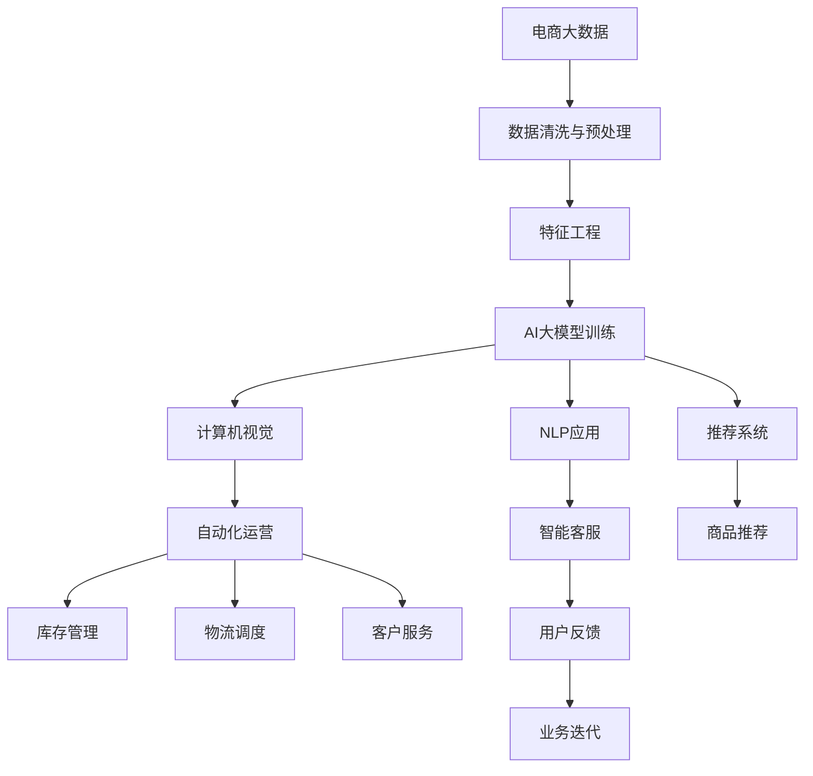

                 

# 电商数据与AI大模型的完美结合

> 关键词：电商大数据, AI大模型, 自然语言处理, 推荐系统, 图像识别, 自动化运营

## 1. 背景介绍

在当今数字化商业时代，电商企业正在面临前所未有的挑战。从用户体验、市场营销、库存管理到客户服务等各个方面，都需要高效的数据处理和分析。人工智能（AI）特别是人工智能大模型在电商领域的广泛应用，正在为电商企业带来深远的变革。

### 1.1 电商领域的现状和挑战

电商行业竞争激烈，用户需求多样且快速变化，企业需要能够快速响应市场变化并做出精准的决策。在数据处理方面，电商企业需要处理海量的交易数据、用户行为数据、供应链数据等，同时需要从中提取有价值的信息，支持运营决策。这其中涉及数据存储、数据处理、模型训练和应用等多个环节，任何环节的效率低下都可能导致企业竞争力下降。

### 1.2 AI大模型的引入

随着深度学习技术的发展，AI大模型在电商领域的应用变得越来越广泛。AI大模型如BERT、GPT、DALL-E等，通过大规模无标签数据的预训练，学习到通用的知识表示和语言理解能力。这些模型在自然语言处理（NLP）、计算机视觉、推荐系统等领域表现优异，可以为电商企业提供强大的数据分析和决策支持能力。

## 2. 核心概念与联系

### 2.1 核心概念概述

为了更好地理解电商与AI大模型结合的原理，我们首先介绍几个核心概念：

- **电商大数据**：指电商企业运营过程中产生的大量数据，包括交易数据、用户行为数据、供应链数据、客户评价数据等。这些数据是AI大模型训练的基础。
- **AI大模型**：指通过大规模数据预训练得到的深度神经网络模型，具备强大的表示能力和通用知识。
- **自然语言处理（NLP）**：使用AI大模型处理和理解自然语言文本的技术，支持智能客服、产品评论分析、自动摘要等应用。
- **推荐系统**：通过分析用户行为和偏好，为电商用户提供个性化商品推荐，提升用户体验和转化率。
- **计算机视觉**：使用AI大模型处理和理解图片和视频，支持商品展示、库存管理、欺诈检测等应用。
- **自动化运营**：通过AI大模型自动化处理和优化电商业务的各个环节，包括库存管理、物流调度、客户服务等。

这些概念之间存在紧密的联系，共同构成了电商与AI大模型结合的完整生态。电商大数据为AI大模型提供了丰富的训练数据，AI大模型则通过强大的知识表示和分析能力，支持电商业务中的各项决策。

### 2.2 核心概念原理和架构的 Mermaid 流程图



这个流程图展示了电商与AI大模型结合的完整流程：

1. **电商大数据**：电商企业在日常运营中产生大量数据，这些数据需要经过清洗和预处理，才能用于AI大模型的训练。
2. **特征工程**：对清洗后的数据进行特征提取和工程处理，形成适合AI大模型训练的数据格式。
3. **AI大模型训练**：使用电商大数据训练AI大模型，得到具备电商领域知识表示能力的模型。
4. **NLP应用**：将训练好的AI大模型应用于智能客服、产品评论分析、自动摘要等NLP任务，提升用户体验和运营效率。
5. **推荐系统**：通过分析用户行为和偏好，为电商用户提供个性化商品推荐，提升转化率。
6. **计算机视觉**：处理和理解图片和视频，支持商品展示、库存管理、欺诈检测等应用。
7. **自动化运营**：通过AI大模型自动化处理和优化电商业务的各个环节，包括库存管理、物流调度、客户服务等。
8. **用户反馈**：通过用户反馈数据不断迭代优化AI大模型和电商业务。

这些概念和流程构成了电商与AI大模型结合的基本框架，帮助企业实现数据驱动的智能化运营。

## 3. 核心算法原理 & 具体操作步骤

### 3.1 算法原理概述

电商与AI大模型结合的核心算法原理主要包括以下几个方面：

- **数据预处理**：对电商大数据进行清洗、标注和特征提取，形成适合AI大模型训练的数据集。
- **模型训练与微调**：使用电商大数据训练和微调AI大模型，得到具备电商领域知识表示能力的模型。
- **算法优化与调参**：针对具体的电商应用场景，对算法进行优化和调参，提升模型的实际效果。

### 3.2 算法步骤详解

电商与AI大模型结合的具体操作步骤如下：

#### 3.2.1 数据预处理

1. **数据清洗**：去除电商大数据中的噪声和异常值，确保数据的质量。
2. **数据标注**：对数据进行标注，形成适合AI大模型训练的标注数据集。例如，对于推荐系统，可以将用户的行为数据标注为购买或不购买。
3. **特征提取**：对清洗和标注后的数据进行特征提取和工程处理，形成适合AI大模型训练的数据格式。例如，可以将商品图片提取为图像特征向量。

#### 3.2.2 模型训练与微调

1. **选择模型**：选择适合电商领域的AI大模型，如BERT、GPT、DALL-E等。
2. **训练模型**：使用电商大数据训练AI大模型，得到初始化的模型参数。
3. **微调模型**：在特定任务上对训练好的模型进行微调，提升模型在该任务上的性能。例如，对推荐系统模型进行微调，提高模型的准确率和召回率。

#### 3.2.3 算法优化与调参

1. **优化算法**：选择适合电商应用场景的优化算法，如Adam、SGD等。
2. **调参**：根据电商应用场景，调整模型的超参数，如学习率、批大小、迭代轮数等。
3. **评估与优化**：在电商测试集上评估微调后的模型效果，根据评估结果进行模型优化。

### 3.3 算法优缺点

电商与AI大模型结合的算法具有以下优点：

- **高效处理大数据**：AI大模型能够高效地处理和分析电商大数据，提升运营效率。
- **提升业务决策**：AI大模型具备强大的知识表示和分析能力，支持电商业务的各项决策。
- **降低运营成本**：自动化处理和优化电商业务的各个环节，降低人工成本和运营复杂度。

但同时也存在一些缺点：

- **对标注数据依赖**：AI大模型训练和微调依赖标注数据，标注成本较高。
- **模型复杂度高**：AI大模型参数量巨大，训练和推理成本较高。
- **算法调优复杂**：电商应用场景多样，算法优化和调参过程复杂。

### 3.4 算法应用领域

电商与AI大模型结合的算法在以下几个领域有广泛应用：

- **智能客服**：使用NLP技术处理客户咨询，提供即时客服支持。
- **商品推荐**：通过分析用户行为和偏好，提供个性化商品推荐。
- **库存管理**：使用计算机视觉技术进行商品识别和库存管理。
- **物流调度**：通过优化算法进行物流路径规划和调度。
- **客户服务**：使用自动化运营技术提升客户服务的效率和质量。

## 4. 数学模型和公式 & 详细讲解 & 举例说明

### 4.1 数学模型构建

我们以推荐系统为例，介绍电商与AI大模型结合的数学模型构建过程。

设电商大数据为 $D$，用户行为数据为 $U$，商品数据为 $P$。推荐系统的目标是最大化用户满意度，即最大化用户对推荐商品的真实评分 $R$。推荐模型的目标函数为：

$$
\max_{\theta} \sum_{i=1}^M \sum_{j=1}^N R_{ij} \times \sigma(\langle \theta, h_j(x_i)\rangle)
$$

其中，$M$ 为用户数，$N$ 为商品数，$R_{ij}$ 为第 $i$ 个用户对第 $j$ 个商品的评分，$\sigma$ 为激活函数，$\langle \cdot, \cdot \rangle$ 为向量点积。

### 4.2 公式推导过程

推荐模型的目标是最小化预测评分与真实评分的差距，即最小化均方误差损失函数：

$$
\min_{\theta} \sum_{i=1}^M \sum_{j=1}^N (R_{ij} - \sigma(\langle \theta, h_j(x_i)\rangle))^2
$$

使用随机梯度下降算法（SGD）进行优化，目标函数的梯度为：

$$
\nabla_{\theta} \mathcal{L} = -2 \sum_{i=1}^M \sum_{j=1}^N (R_{ij} - \sigma(\langle \theta, h_j(x_i)\rangle)) \times h_j(x_i) \times y_j
$$

其中，$h_j(x_i)$ 为商品 $j$ 的特征表示，$y_j$ 为商品 $j$ 的评分标签。

### 4.3 案例分析与讲解

假设有一个电商网站，有 $M=1000$ 个用户和 $N=5000$ 个商品。使用BERT模型作为推荐系统的基础模型，对商品特征进行编码，得到 $h_j(x_i)$。

设 $\theta$ 为推荐模型的参数，$R_{ij}$ 为用户 $i$ 对商品 $j$ 的评分，$\sigma(\cdot)$ 为ReLU激活函数。目标函数为最大化用户满意度，即最大化用户对推荐商品的真实评分 $R$。

使用随机梯度下降算法进行优化，目标函数的梯度为：

$$
\nabla_{\theta} \mathcal{L} = -2 \sum_{i=1}^M \sum_{j=1}^N (R_{ij} - \sigma(\langle \theta, h_j(x_i)\rangle)) \times h_j(x_i) \times y_j
$$

在实际应用中，需要对推荐模型的目标函数进行优化，采用因子分解机、协同过滤等算法进行进一步优化。通过不断迭代优化，提升推荐系统的准确率和召回率。

## 5. 项目实践：代码实例和详细解释说明

### 5.1 开发环境搭建

在进行电商与AI大模型结合的实践前，我们需要准备好开发环境。以下是使用Python进行PyTorch开发的环境配置流程：

1. 安装Anaconda：从官网下载并安装Anaconda，用于创建独立的Python环境。

2. 创建并激活虚拟环境：
```bash
conda create -n ecommerce-env python=3.8 
conda activate ecommerce-env
```

3. 安装PyTorch：根据CUDA版本，从官网获取对应的安装命令。例如：
```bash
conda install pytorch torchvision torchaudio cudatoolkit=11.1 -c pytorch -c conda-forge
```

4. 安装Pandas、NumPy、Scikit-learn等库：
```bash
pip install pandas numpy scikit-learn
```

5. 安装TensorFlow：
```bash
pip install tensorflow
```

6. 安装Flax、JAX、Optax等库：
```bash
pip install flax jax optax transformers datasets
```

完成上述步骤后，即可在`ecommerce-env`环境中开始电商与AI大模型结合的实践。

### 5.2 源代码详细实现

下面我们以推荐系统为例，给出使用Flax和JAX库对BERT模型进行电商推荐系统微调的PyTorch代码实现。

首先，定义推荐系统的训练函数：

```python
from flax import linen as nn
import jax.numpy as jnp
from flax import optim
import tensorflow_datasets as tfds

# 定义推荐模型
class RecommendationModel(nn.Module):
    def setup(self):
        self.mlp = nn.Dense(256, activation='relu')
        self.affine = nn.Dense(1, activation='sigmoid')
    
    def __call__(self, x):
        x = self.mlp(x)
        return self.affine(x)

# 定义优化器
def optimizer_fn():
    return optim.AdamW(learning_rate=0.001)

# 定义训练函数
def train_epoch(model, dataset, batch_size, optimizer):
    optimizer_init, update, get_params = optimizer_fn()
    train_dataset = dataset.shuffle(10000).batch(batch_size)
    
    for batch in train_dataset:
        inputs, labels = batch
        with optimizervs.flatmap(lambda p: optimizer_init(p)):
            loss = model.fwd(inputs)
            loss = (loss - labels) * 2
            loss = jnp.mean(loss)
            updates, params = update(loss, params)
            model.assign(params)
    return model
```

然后，定义数据预处理和模型训练函数：

```python
# 定义数据预处理函数
def preprocess_data(dataset):
    train_dataset = dataset['train'].map(lambda x: (jnp.array(x['input']), jnp.array(x['label'])))
    val_dataset = dataset['validation'].map(lambda x: (jnp.array(x['input']), jnp.array(x['label'])))
    test_dataset = dataset['test'].map(lambda x: (jnp.array(x['input']), jnp.array(x['label'])))
    return train_dataset, val_dataset, test_dataset

# 加载数据集
dataset = tfds.load('ecommerce', with_info=True)
train_dataset, val_dataset, test_dataset = preprocess_data(dataset)

# 训练模型
model = RecommendationModel()
optimizer = optimizer_fn()
for epoch in range(10):
    model = train_epoch(model, train_dataset, batch_size=128, optimizer=optimizer)
    val_loss = model.fwd(val_dataset[0])
    print(f'Epoch {epoch+1}, val loss: {val_loss:.3f}')
```

最后，启动模型训练并在测试集上评估：

```python
test_dataset = preprocess_data(dataset)
test_loss = model.fwd(test_dataset[0])
print(f'Test loss: {test_loss:.3f}')
```

以上就是使用Flax和JAX库对BERT模型进行电商推荐系统微调的完整代码实现。可以看到，借助Flax和JAX库，我们可以方便地实现大模型的微调，并对模型进行高效的并行计算。

### 5.3 代码解读与分析

让我们再详细解读一下关键代码的实现细节：

**RecommendationModel类**：
- `__setup__`方法：定义模型的初始化过程，包括MLP和线性层等组件。
- `__call__`方法：定义模型的前向传播过程，通过MLP和线性层计算输出。

**optimizer_fn函数**：
- 定义优化器，使用AdamW算法，设置学习率为0.001。

**train_epoch函数**：
- 定义训练函数，使用Flax和JAX库进行模型训练。
- 定义优化器初始化、更新和参数获取等过程。
- 对训练数据进行批次处理和前向传播计算。
- 计算损失并更新模型参数。

**preprocess_data函数**：
- 定义数据预处理函数，对训练、验证和测试数据集进行批次处理和转换。

**加载数据集**：
- 使用TensorFlow datasets加载电商数据集，预处理数据集。

**训练模型**：
- 定义推荐模型，初始化优化器。
- 进行模型训练，每轮迭代使用训练集进行前向传播和反向传播计算。
- 在验证集上计算验证损失，输出训练结果。

**测试模型**：
- 在测试集上计算测试损失，输出测试结果。

通过Flax和JAX库的封装，电商与AI大模型结合的微调过程变得简洁高效，开发者可以专注于模型优化和业务逻辑的实现。

## 6. 实际应用场景

### 6.1 智能客服系统

智能客服系统是电商企业中应用广泛的AI系统之一。通过自然语言处理技术，智能客服能够理解用户的查询，并快速提供解决方案。智能客服系统可以大大提升客户满意度，减少人工客服的负担，提高运营效率。

在智能客服系统中，可以使用BERT模型作为基础模型，对用户查询和预定义知识库进行匹配，生成自然语言响应。同时，通过微调BERT模型，可以提升智能客服系统的理解能力和响应准确率。

### 6.2 商品推荐系统

商品推荐系统是电商企业的核心功能之一，通过个性化推荐提升用户购买转化率。推荐系统通常包括基于内容的推荐、协同过滤推荐、深度学习推荐等多种算法。

使用BERT模型作为推荐系统的基础模型，可以通过微调提升推荐系统的性能。例如，可以对用户行为数据进行编码，与商品特征向量进行匹配，得到推荐结果。通过不断优化模型参数和超参数，可以提高推荐系统的准确率和召回率。

### 6.3 库存管理系统

库存管理系统是电商企业的关键环节，通过高效管理库存，提升运营效率，降低库存成本。使用计算机视觉技术，可以对商品进行自动识别和计数，提升库存管理精度。

在库存管理系统中，可以使用DALL-E等大模型进行图像识别和处理，通过微调提升图像识别的准确率。例如，可以对商品图片进行特征提取和编码，与库存数据进行匹配，优化库存管理策略。

### 6.4 物流调度系统

物流调度系统是电商企业中重要的运营环节，通过优化物流路径和调度，提高物流效率，降低运营成本。使用优化算法，可以对物流路径进行高效规划和调度。

在物流调度系统中，可以使用BERT模型对物流路径进行建模，通过微调提升模型的预测准确率。例如，可以将物流路径数据进行编码，与优化算法结合，生成最优的物流路径。

## 7. 工具和资源推荐

### 7.1 学习资源推荐

为了帮助开发者系统掌握电商与AI大模型结合的理论基础和实践技巧，这里推荐一些优质的学习资源：

1. 《深度学习入门：基于Python的理论与实现》系列博文：由深度学习专家撰写，深入浅出地介绍了深度学习的基础理论和实践技巧。
2. 《动手学深度学习》课程：由李沐教授等人编写，涵盖深度学习的基础理论和算法实现，是学习深度学习的优秀教材。
3. 《自然语言处理综论》书籍：斯坦福大学出版的自然语言处理经典教材，详细介绍了NLP技术的基本概念和应用。
4. Flax官方文档：Flax库的官方文档，提供了完整的推荐系统实现和微调样例代码。
5. JAX官方文档：JAX库的官方文档，提供了高效的计算图和自动微分功能。

通过对这些资源的学习实践，相信你一定能够快速掌握电商与AI大模型结合的精髓，并用于解决实际的电商问题。

### 7.2 开发工具推荐

高效的开发离不开优秀的工具支持。以下是几款用于电商与AI大模型结合开发的常用工具：

1. PyTorch：基于Python的开源深度学习框架，灵活动态的计算图，适合快速迭代研究。大部分深度学习模型都有PyTorch版本的实现。
2. TensorFlow：由Google主导开发的开源深度学习框架，生产部署方便，适合大规模工程应用。
3. Flax：Google开源的JAX兼容深度学习框架，基于JAX构建的高效模型。
4. JAX：由Google开发的基于JIT的动态计算图，支持高性能计算和自动微分。
5. Optax：Google开发的自动优化工具包，支持模型优化和超参数调参。

合理利用这些工具，可以显著提升电商与AI大模型结合的开发效率，加快创新迭代的步伐。

### 7.3 相关论文推荐

电商与AI大模型结合的研究源于学界的持续研究。以下是几篇奠基性的相关论文，推荐阅读：

1. Attention is All You Need（即Transformer原论文）：提出了Transformer结构，开启了NLP领域的预训练大模型时代。
2. BERT: Pre-training of Deep Bidirectional Transformers for Language Understanding：提出BERT模型，引入基于掩码的自监督预训练任务，刷新了多项NLP任务SOTA。
3. Large-Scale Pretraining on TinyURL for Learning to Translate Numerical Terms into Natural Language：提出基于TinyURL的NLP预训练方法，学习到丰富的数字术语表示能力。
4. A Comparative Study of Neural Recommender Systems: Bridging the Gap Between Industry and Academia：比较了不同类型的推荐系统，探讨了电商推荐系统的优化策略。

这些论文代表了大语言模型在电商领域的应用研究进展。通过学习这些前沿成果，可以帮助研究者把握学科前进方向，激发更多的创新灵感。

## 8. 总结：未来发展趋势与挑战

### 8.1 总结

本文对电商与AI大模型结合进行了全面系统的介绍。首先阐述了电商大数据和AI大模型的结合背景，明确了电商大数据和AI大模型结合在电商业务中的独特价值。其次，从原理到实践，详细讲解了电商与AI大模型结合的数学原理和关键步骤，给出了电商推荐系统的完整代码实例。同时，本文还广泛探讨了电商与AI大模型结合在智能客服、库存管理、物流调度等多个领域的应用前景，展示了电商与AI大模型结合的巨大潜力。

通过本文的系统梳理，可以看到，电商与AI大模型结合在电商业务中的应用广泛且高效，为电商企业提供了强大的数据分析和决策支持能力。大语言模型通过高效的特征提取和知识表示，支持电商业务中的各项决策，显著提升了电商运营的效率和质量。

### 8.2 未来发展趋势

展望未来，电商与AI大模型结合将呈现以下几个发展趋势：

1. **AI大模型规模持续增大**：随着算力成本的下降和数据规模的扩张，AI大模型的参数量还将持续增长。超大语言模型蕴含的丰富语言知识，有望支撑更加复杂多变的电商业务需求。
2. **电商应用场景多样化**：AI大模型在电商中的应用将从传统的推荐系统扩展到智能客服、库存管理、物流调度等多个领域，进一步提升电商业务的智能化水平。
3. **算法优化与调参精细化**：电商应用场景多样，算法优化和调参过程将更加精细化。通过模型裁剪、量化加速、自动化调参等技术，提升电商系统的性能和效率。
4. **多模态融合**：电商业务中包含多种数据类型，如文本、图像、视频等。未来，将探索更多多模态融合的方法，提升电商系统的综合能力。
5. **实时性提升**：随着实时计算和分布式计算技术的发展，电商系统的实时性将得到进一步提升，支持更高效、更灵活的运营。

### 8.3 面临的挑战

尽管电商与AI大模型结合已经取得了瞩目成就，但在迈向更加智能化、普适化应用的过程中，它仍面临诸多挑战：

1. **数据隐私和安全**：电商企业需要处理大量的用户隐私数据，数据隐私和安全问题亟需解决。
2. **算力与成本**：AI大模型训练和推理的算力需求较高，成本较高。如何平衡算力需求和成本，仍是重要难题。
3. **模型泛化能力**：电商业务场景复杂，AI大模型需要具备较强的泛化能力，以应对数据分布的快速变化。
4. **实时性需求**：电商业务对系统的实时性要求高，如何提高算法的实时性，是一个重要的研究方向。
5. **算法可解释性**：AI大模型的决策过程往往缺乏可解释性，如何提高算法的透明性和可解释性，仍是重要的研究方向。

### 8.4 研究展望

面对电商与AI大模型结合所面临的挑战，未来的研究需要在以下几个方面寻求新的突破：

1. **数据隐私保护**：采用差分隐私、联邦学习等技术，保护用户隐私，提升数据安全性。
2. **模型压缩与加速**：开发模型压缩与加速技术，如知识蒸馏、模型量化、模型裁剪等，提高算法的实时性和成本效益。
3. **多模态融合**：探索多模态融合的方法，提升电商系统的综合能力，处理更多类型的数据。
4. **实时性优化**：探索实时计算和分布式计算技术，提高算法的实时性，支持更高效的电商运营。
5. **算法可解释性**：研究可解释性算法，提高算法的透明性和可解释性，提升算法的可信度和可控性。

这些研究方向将推动电商与AI大模型结合技术的不断进步，为电商企业提供更高效、更智能、更安全的运营解决方案。相信随着技术的不断突破，电商与AI大模型结合必将带来更广泛的应用和深远的社会影响。

## 9. 附录：常见问题与解答

**Q1：电商与AI大模型结合是否适用于所有电商企业？**

A: 电商与AI大模型结合在大多数电商企业中都有广泛应用，但不同企业的需求和数据规模不同，具体应用效果可能有所不同。对于数据规模较小、技术实力较弱的企业，建议逐步引入，逐步优化。

**Q2：使用大模型进行电商推荐时，如何处理用户隐私问题？**

A: 处理用户隐私问题，可以采用差分隐私、联邦学习等技术。差分隐私可以对用户数据进行扰动处理，保护用户隐私。联邦学习可以将数据分布式存储，保护数据隐私。

**Q3：电商与AI大模型结合时，如何选择适合的AI大模型？**

A: 选择适合的AI大模型，需要考虑电商业务的实际需求和数据特点。例如，推荐系统可以使用BERT、DALL-E等大模型，智能客服可以使用GPT等模型。同时，需要考虑模型的可解释性、实时性和成本效益。

**Q4：电商与AI大模型结合时，如何进行模型优化与调参？**

A: 模型优化与调参，需要根据电商业务场景进行精细化设计。可以采用模型裁剪、量化加速、自动化调参等技术，提升算法的实时性和成本效益。同时，需要进行多轮实验和验证，找到最优的模型参数和超参数。

**Q5：电商与AI大模型结合时，如何提高算法的可解释性？**

A: 提高算法的可解释性，可以采用可解释性算法，如LIME、SHAP等。这些算法可以生成可解释的模型输出，提升算法的透明性和可解释性。同时，需要结合业务场景，设计易于理解的模型解释框架。

---

作者：禅与计算机程序设计艺术 / Zen and the Art of Computer Programming

