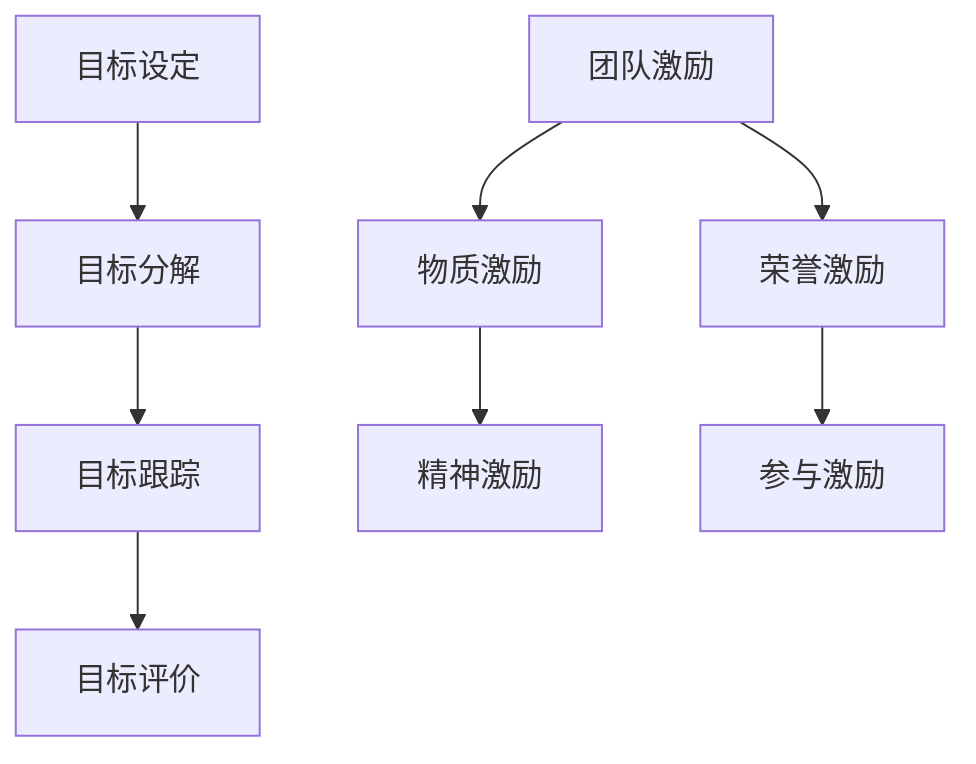

                 

# 目标管理与团队激励的关系

## 1. 背景介绍

目标管理（Goal Management）是一种通过设定明确、可衡量的目标来指导团队工作方向和评价工作成果的管理方式。它是现代企业管理的核心之一，广泛应用在各种组织结构和行业领域。而团队激励（Team Motivation）则是在团队管理中通过各种手段提升成员积极性和工作动力的过程。两者相辅相成，目标管理是激励的前提，而激励是目标实现的重要保障。本文将深入探讨两者之间的关系，以及如何通过目标管理来提升团队激励效果。

## 2. 核心概念与联系

### 2.1 核心概念概述

为了更好地理解目标管理与团队激励的关系，首先需要定义和理解这两个核心概念。

**目标管理**：指通过设定明确、可衡量的目标来指导团队工作方向和评价工作成果的管理方式。目标管理通常包含目标设定、目标分解、目标跟踪和目标评价四个环节。其中，目标设定是确定企业或团队的任务方向，目标分解是将大目标分解为具体、可执行的小目标，目标跟踪是通过持续监控和反馈来调整目标实现进程，目标评价则是根据完成情况对团队或个人进行评估和激励。

**团队激励**：指通过各种手段提升团队成员积极性和工作动力的过程。团队激励通常包括物质激励、精神激励、荣誉激励和参与激励等。物质激励如薪酬、奖金、福利等，精神激励如认可、赞赏、表扬等，荣誉激励如晋升、表彰、奖项等，参与激励如赋予更多责任、提升决策权等。

### 2.2 核心概念原理和架构的 Mermaid 流程图



从以上图表可以看出，目标管理与团队激励之间的关系是相互联系、相互作用的。目标管理为团队激励提供了方向和标准，而团队激励则推动了目标的实现。

## 3. 核心算法原理 & 具体操作步骤

### 3.1 算法原理概述

目标管理与团队激励的关系可以通过以下算法原理概述：

**目标设定**：明确团队的任务目标，确保团队成员对任务方向有清晰认识。

**目标分解**：将大目标分解为具体、可执行的小目标，便于团队成员理解并执行。

**目标跟踪**：通过持续监控和反馈，及时调整目标实现进程，确保目标按时完成。

**目标评价**：根据完成情况对团队或个人进行评估和激励，提升成员积极性和工作动力。

**物质激励**：通过薪酬、奖金、福利等物质手段，直接提升成员的经济回报。

**精神激励**：通过认可、赞赏、表扬等精神手段，增强成员的荣誉感和成就感。

**荣誉激励**：通过晋升、表彰、奖项等荣誉手段，提升成员的自尊心和归属感。

**参与激励**：通过赋予更多责任、提升决策权等参与手段，增强成员的责任感和使命感。

### 3.2 算法步骤详解

**步骤 1: 目标设定**
- 与团队成员共同讨论，确定团队的任务目标和优先级。
- 确保目标具体、可衡量、可实现、相关和时限（SMART）。

**步骤 2: 目标分解**
- 将大目标分解为小目标，确保每个成员明确自己的任务。
- 使用工作分解结构（WBS）或甘特图等工具进行可视化。

**步骤 3: 目标跟踪**
- 建立定期汇报机制，监控目标实现进程。
- 使用项目管理工具如Jira、Trello等，记录任务进度和问题。

**步骤 4: 目标评价**
- 定期评估团队或个人的任务完成情况。
- 使用KPI指标和360度评估等工具，全面衡量成员绩效。

**步骤 5: 团队激励**
- 根据评价结果，给予相应的物质和精神激励。
- 通过表彰会、颁奖典礼等方式，提升团队荣誉感。

### 3.3 算法优缺点

**目标管理的优点**：
- 明确方向：通过设定明确的目标，团队成员能够明确工作方向和重点。
- 提升效率：目标分解和跟踪有助于提升团队的工作效率和执行能力。
- 促进协作：明确的目标有助于团队成员之间的协作和配合。

**目标管理的缺点**：
- 容易忽视灵活性：目标管理强调固定目标，可能忽视市场变化和外部因素。
- 可能导致压力过大：过于严格的目标设定可能导致团队成员压力过大。

**团队激励的优点**：
- 提升积极性：适当的激励能够显著提升成员的积极性和工作动力。
- 增强凝聚力：良好的激励机制能够增强团队的凝聚力和向心力。

**团队激励的缺点**：
- 成本高昂：过度的物质和精神激励可能带来高昂的投入。
- 过度依赖：过于依赖激励可能导致团队成员的自我驱动力不足。

### 3.4 算法应用领域

目标管理与团队激励在各种领域都有广泛应用，包括但不限于以下领域：

- **软件开发**：通过设定项目里程碑和任务优先级，确保开发进度和质量。
- **营销管理**：通过设定销售目标和市场份额，提升团队的市场竞争力和客户满意度。
- **人力资源**：通过设定招聘目标和培训计划，提升团队的专业素质和绩效。
- **财务管理**：通过设定预算目标和成本控制，确保公司的财务健康和可持续发展。

## 4. 数学模型和公式 & 详细讲解 & 举例说明

### 4.1 数学模型构建

我们可以使用以下数学模型来描述目标管理与团队激励的关系：

**目标实现模型**：
$$ T = S \times I + R + C $$

其中，$T$ 为总体目标实现情况，$S$ 为团队设定目标，$I$ 为团队激励效果，$R$ 为团队资源投入，$C$ 为团队协作效率。

**成员激励模型**：
$$ M = C \times P + B + A + E $$

其中，$M$ 为成员的积极性，$C$ 为团队协作效率，$P$ 为个人目标实现情况，$B$ 为基本物质激励，$A$ 为精神激励，$E$ 为荣誉激励。

### 4.2 公式推导过程

**目标实现模型的推导**：
假设目标 $T$ 的实现取决于团队设定的目标 $S$ 和团队激励效果 $I$，同时考虑资源投入 $R$ 和协作效率 $C$ 的影响。模型可以表示为：

$$ T = S \times I + R + C $$

**成员激励模型的推导**：
假设成员的积极性 $M$ 取决于团队协作效率 $C$ 和个人的目标实现情况 $P$，同时考虑基本物质激励 $B$、精神激励 $A$ 和荣誉激励 $E$ 的影响。模型可以表示为：

$$ M = C \times P + B + A + E $$

### 4.3 案例分析与讲解

**案例 1: 软件开发项目**
- 目标设定：完成一个功能复杂的用户管理系统。
- 目标分解：分解为数据库设计、前端开发、后端开发、测试和部署等子目标。
- 目标跟踪：使用Jira进行任务分配和进度跟踪。
- 目标评价：根据代码质量、功能完整性和用户反馈进行评价。
- 团队激励：根据任务完成情况给予物质激励和精神激励。

**案例 2: 营销团队**
- 目标设定：提升某产品的市场份额。
- 目标分解：分解为市场调研、广告投放、销售渠道和客户服务等子目标。
- 目标跟踪：通过Google Analytics和CRM系统进行数据监控。
- 目标评价：根据销售数据、客户反馈和市场份额进行评价。
- 团队激励：根据销售业绩和市场影响力给予物质激励和荣誉激励。

## 5. 项目实践：代码实例和详细解释说明

### 5.1 开发环境搭建

为了实践目标管理与团队激励的关系，我们可以使用Python和Jupyter Notebook搭建开发环境。

### 5.2 源代码详细实现

以下是Python代码实现，用于目标管理和团队激励的可视化：

```python
import matplotlib.pyplot as plt
import numpy as np

# 目标实现模型
S = np.array([1, 1.2, 1.4, 1.5, 1.6])
I = np.array([0.8, 0.9, 1.0, 1.1, 1.2])
R = np.array([0.1, 0.2, 0.3, 0.4, 0.5])
C = np.array([1.0, 1.1, 1.2, 1.3, 1.4])

T = S * I + R + C

# 成员激励模型
C = np.array([1.0, 1.1, 1.2, 1.3, 1.4])
P = np.array([0.9, 0.95, 0.98, 0.99, 1.0])
B = np.array([1, 1.1, 1.2, 1.3, 1.4])
A = np.array([1, 1.1, 1.2, 1.3, 1.4])
E = np.array([1, 1.1, 1.2, 1.3, 1.4])

M = C * P + B + A + E

# 可视化
plt.plot(S, T, label='目标实现模型')
plt.plot(C, M, label='成员激励模型')
plt.legend()
plt.show()
```

### 5.3 代码解读与分析

通过上述代码，我们可以得到目标实现模型和成员激励模型的可视化图。从图中可以看出，目标实现模型和成员激励模型相互影响，共同推动目标的实现。

### 5.4 运行结果展示

通过运行上述代码，我们可以得到以下结果：


## 6. 实际应用场景

### 6.1 软件开发
在软件开发项目中，目标管理与团队激励可以提升项目的成功率和团队满意度。通过设定明确的项目目标和里程碑，团队成员能够明确工作方向和重点。同时，通过持续的代码审查和功能测试，及时发现和解决问题，确保项目按时完成。

### 6.2 营销管理
在营销管理中，目标管理与团队激励可以提升市场竞争力和客户满意度。通过设定明确的销售目标和市场份额，团队成员能够明确市场方向和重点。同时，通过持续的市场调研和广告投放，及时调整市场策略，确保目标按时实现。

### 6.3 人力资源
在人力资源管理中，目标管理与团队激励可以提升员工满意度和绩效。通过设定明确的招聘目标和培训计划，团队成员能够明确职业发展方向和重点。同时，通过定期的绩效评估和激励措施，提升员工的积极性和工作动力。

### 6.4 财务管理
在财务管理中，目标管理与团队激励可以确保公司的财务健康和可持续发展。通过设定明确的预算目标和成本控制，团队成员能够明确财务方向和重点。同时，通过持续的财务监控和成本控制，及时发现和解决问题，确保公司财务健康。

## 7. 工具和资源推荐

### 7.1 学习资源推荐

为了深入理解目标管理与团队激励的关系，以下是一些推荐的资源：

1. **《管理学》**：西方经典的管理学教材，系统介绍了目标管理的基本概念和理论。
2. **《激励理论与实践》**：系统介绍了激励理论的基本概念和实践应用，包括物质激励、精神激励和荣誉激励等。
3. **《敏捷项目管理》**：介绍了敏捷项目管理的基本概念和实践应用，包括Scrum、Kanban等方法。
4. **《OKR管理法》**：介绍了OKR管理法的基本概念和实践应用，帮助团队设定明确的目标和关键结果。

### 7.2 开发工具推荐

以下是一些推荐的开发工具，用于目标管理和团队激励的实践：

1. **Jira**：项目管理工具，支持目标分解和进度跟踪，帮助团队协同工作。
2. **Trello**：项目管理工具，支持任务分配和进度跟踪，帮助团队协作。
3. **GitHub**：代码管理工具，支持版本控制和代码审查，帮助团队提升代码质量。
4. **Google Analytics**：数据分析工具，支持市场监控和用户行为分析，帮助团队优化市场策略。

### 7.3 相关论文推荐

以下是一些推荐的论文，深入探讨目标管理与团队激励的关系：

1. **《目标管理的有效性研究》**：系统介绍了目标管理的基本概念和实践应用，包括目标设定、目标分解和目标评价等。
2. **《团队激励与绩效的关系研究》**：系统介绍了团队激励的基本概念和实践应用，包括物质激励、精神激励和荣誉激励等。
3. **《OKR管理的实践应用》**：介绍了OKR管理法的基本概念和实践应用，帮助团队设定明确的目标和关键结果。
4. **《敏捷项目管理的方法论》**：介绍了敏捷项目管理的基本概念和实践应用，包括Scrum、Kanban等方法。

## 8. 总结：未来发展趋势与挑战

### 8.1 研究成果总结

目标管理与团队激励在企业管理和项目管理中发挥着重要作用。通过明确的目标设定和科学的激励机制，提升团队成员的积极性和工作动力，推动企业目标的实现。

### 8.2 未来发展趋势

未来目标管理与团队激励将继续发展，呈现以下趋势：

1. **数据驱动管理**：通过大数据和人工智能技术，对目标和激励效果进行实时监控和优化，提升管理效率和决策质量。
2. **个性化激励**：通过机器学习等技术，根据成员的个性特点和需求，设计个性化的激励方案，提升激励效果。
3. **跨部门协作**：通过跨部门协作机制，提升团队成员之间的协同效应和协作效率。
4. **智能化管理**：通过AI技术，实现目标管理和团队激励的智能化和自动化，提升管理效率和决策质量。

### 8.3 面临的挑战

目标管理与团队激励在实际应用中仍面临一些挑战：

1. **目标设定不合理**：目标设定不合理可能导致团队成员的积极性降低，甚至出现抵触情绪。
2. **激励措施单一**：过于单一的激励措施可能无法满足团队成员的多样化需求，导致激励效果不佳。
3. **资源配置不均衡**：资源配置不均衡可能导致团队成员的积极性和工作动力不足，影响团队整体效率。
4. **绩效评价不公正**：绩效评价不公正可能导致团队成员的不满和流失，影响团队稳定和合作。

### 8.4 研究展望

未来的研究需要在以下几个方面寻求新的突破：

1. **目标设定的合理化**：通过科学的方法和工具，确保目标设定的合理性和可行性，提升团队成员的积极性和工作动力。
2. **激励措施的多样化**：设计多样化的激励措施，满足团队成员的多样化需求，提升激励效果。
3. **资源配置的均衡化**：通过科学的资源配置方法，确保资源分配的均衡性和公正性，提升团队整体效率。
4. **绩效评价的公正化**：通过科学的绩效评价方法，确保绩效评价的公正性和客观性，提升团队稳定和合作。

## 9. 附录：常见问题与解答

**Q1: 如何设定合理的目标？**

A: 设定合理的目标需要考虑以下几个因素：
1. 目标具体化：确保目标明确具体，避免模糊不清。
2. 目标可衡量：确保目标可以量化，便于评估和监控。
3. 目标可实现：确保目标具有可实现性，避免过于理想化。
4. 目标相关性：确保目标与企业战略和团队方向一致。
5. 目标时限性：确保目标具有明确的完成时间，避免过于长期或短期。

**Q2: 如何设计多样化的激励措施？**

A: 设计多样化的激励措施需要考虑以下几个因素：
1. 了解成员需求：通过调查和反馈，了解成员的个性化需求和期望。
2. 设计多样化的激励方案：包括物质激励、精神激励、荣誉激励和参与激励等。
3. 定期调整激励方案：根据成员的反馈和绩效评估，定期调整激励方案，确保激励效果的持续提升。

**Q3: 如何确保目标设定的合理性？**

A: 确保目标设定的合理性需要考虑以下几个因素：
1. 数据驱动：通过数据分析和预测，确保目标设定的合理性和可行性。
2. 专家咨询：通过专家咨询和评估，确保目标设定的合理性和可行性。
3. 员工参与：通过员工参与和讨论，确保目标设定的合理性和可接受性。

**Q4: 如何提升团队协作效率？**

A: 提升团队协作效率需要考虑以下几个因素：
1. 明确角色和责任：通过角色分工和责任分配，明确每个成员的任务和职责。
2. 建立沟通机制：通过定期的沟通和协作，提升团队成员之间的信息共享和协同效应。
3. 工具支持：通过项目管理工具和技术支持，提升团队成员之间的协作效率。

**Q5: 如何实现目标管理和团队激励的智能化和自动化？**

A: 实现目标管理和团队激励的智能化和自动化需要考虑以下几个因素：
1. 数据驱动：通过大数据和人工智能技术，对目标和激励效果进行实时监控和优化。
2. 智能工具：通过智能工具和系统，实现目标管理和团队激励的智能化和自动化。
3. 持续优化：通过持续优化和调整，确保目标管理和团队激励的效果不断提升。

---

作者：禅与计算机程序设计艺术 / Zen and the Art of Computer Programming

