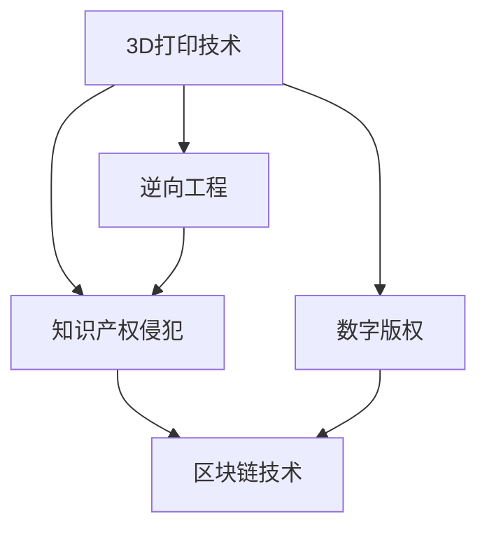

                 

# 知识产权与3D打印技术的挑战

## 1. 背景介绍

随着3D打印技术的不断进步，其在各个行业的应用越来越广泛，从航空航天、医疗健康到文化创意、制造业等。然而，这一新兴技术在知识产权保护方面也面临诸多挑战。本文章将从背景、核心概念与联系、核心算法原理与操作步骤、数学模型和公式的详细讲解、项目实践、实际应用场景、工具和资源推荐、总结、未来发展趋势与挑战以及常见问题与解答等多个角度，对知识产权与3D打印技术的挑战进行深入探讨。

## 2. 核心概念与联系

### 2.1 核心概念概述

为更好地理解知识产权与3D打印技术的挑战，本节将介绍几个密切相关的核心概念：

- **3D打印技术**：一种快速原型制造技术，通过逐层堆积材料，将计算机设计的3D模型转换为实体物品。常见的3D打印技术包括FDM、SLA、SLS、DLP等。

- **知识产权**：指具有创造性、创新性的发明创造，如专利、版权、商标等，保护其所有人对产品的独占权。3D打印技术的普及，使得知识产权的保护变得更加复杂。

- **数字版权**：与物理产品相比，3D模型和打印文件作为数字产品，其版权保护和转让更加困难。

- **逆向工程**：通过分析实体物品，反向推断其设计信息，可能导致原始设计的版权侵权。

- **知识产权侵犯**：指未经授权使用或复制受保护的知识产权内容，如非法复制3D打印设计文件。

- **区块链技术**：一种分布式账本技术，可以实现数据去中心化、透明和不可篡改，有助于数字版权的验证和追踪。

这些核心概念之间的逻辑关系可以通过以下Mermaid流程图来展示：



这个流程图展示了几大核心概念之间的关联：

1. 3D打印技术的普及带来了数字版权的挑战。
2. 逆向工程技术使得3D打印设计文件的版权保护变得更加困难。
3. 区块链技术作为解决方案之一，可以提高数字版权的验证和追踪能力。

## 3. 核心算法原理 & 具体操作步骤

### 3.1 算法原理概述

3D打印技术的普及，使得数字版权的保护变得更加复杂。3D模型和打印文件可以作为数字产品进行分发，但由于其高度易复制性，容易被非法复制和传播，导致知识产权侵犯。因此，如何在3D打印环境中保护数字版权，成为了一个重要问题。

基于区块链技术的解决方案，通过分布式存储和去中心化特性，可以实现数字版权的不可篡改和透明性。具体而言，可以将数字版权信息写入区块链中，并通过智能合约来控制3D打印文件的访问权限，只有授权的用户才能进行3D打印。

### 3.2 算法步骤详解

区块链技术用于3D打印数字版权保护的一般步骤包括：

1. **版权登记**：将3D模型的版权信息（如作者、许可等）登记在区块链上。
2. **权利声明**：将3D打印文件进行权利声明，包括允许使用的范围和条件。
3. **智能合约设计**：设计智能合约，控制3D打印文件的访问权限。
4. **权限验证**：用户访问3D打印文件时，智能合约自动进行权限验证，防止非法复制。
5. **区块链追踪**：所有3D打印文件的访问记录和权限使用情况，都记录在区块链上，实现透明追踪。

### 3.3 算法优缺点

使用区块链技术进行3D打印数字版权保护有以下优点：

1. **不可篡改性**：区块链的去中心化和分布式存储特性，使得数字版权信息难以被篡改。
2. **透明追踪**：所有3D打印文件的访问记录和权限使用情况，都记录在区块链上，可以实现透明追踪。
3. **自动化管理**：智能合约的自动化管理功能，可以自动执行版权许可和权限验证，减少人工干预。

但同时，也存在以下缺点：

1. **性能问题**：区块链网络节点较多时，处理速度可能较慢。
2. **存储成本**：区块链上的数据需要存储在分布式节点中，存储成本较高。
3. **复杂性**：智能合约的设计和维护相对复杂，需要一定的技术和专业知识。

### 3.4 算法应用领域

基于区块链技术的3D打印数字版权保护方法，可以应用于多个领域，例如：

- **文化创意行业**：如3D打印艺术品、游戏角色、模型等。
- **制造业**：如工业零部件的设计、制造、流通等。
- **医疗健康**：如3D打印医疗设备、个性化定制等。
- **航空航天**：如3D打印零件的生产和检测等。

## 4. 数学模型和公式 & 详细讲解 & 举例说明

### 4.1 数学模型构建

区块链技术通过分布式账本存储数据，数据结构为键值对。假设有一个区块链节点集$N=\{N_1, N_2, ..., N_k\}$，每个节点的区块链中存储的数据结构为$D=\{K_i,V_i\}_{i=1}^n$，其中$K_i$为键，$V_i$为值。

### 4.2 公式推导过程

假设3D模型的版权信息$V_1$，3D打印文件的权利声明$V_2$，智能合约$C$。在区块链上，可以将$V_1$和$V_2$存储在同一个键$K$下，$C$则存储在另一个键$K_C$下。

用户访问3D打印文件时，智能合约$C$自动执行权限验证。如果验证通过，则生成一个访问记录$R$，并将其存储在区块链上。访问记录$R$包括用户信息、访问时间、3D打印文件信息等。

### 4.3 案例分析与讲解

假设有一个3D打印文件$A$，其版权信息为$V_1$，权利声明为$V_2$，智能合约为$C$。其版权登记过程如下：

1. 将$V_1$和$V_2$存储在区块链上的键$K$下，即$D_{K}=\{V_1,V_2\}$。
2. 设计智能合约$C$，控制3D打印文件$A$的访问权限。
3. 当用户$U_1$访问3D打印文件$A$时，智能合约$C$自动执行权限验证。如果验证通过，则生成一个访问记录$R_1$，并将其存储在区块链上。

假设用户$U_2$也试图访问3D打印文件$A$，其访问记录$R_2$也会被记录在区块链上。通过区块链上的访问记录，可以追踪3D打印文件的权限使用情况，确保版权的合法使用。

## 5. 项目实践：代码实例和详细解释说明

### 5.1 开发环境搭建

在进行3D打印数字版权保护项目实践前，我们需要准备好开发环境。以下是使用Python进行Solidity开发的环境配置流程：

1. 安装Node.js：从官网下载并安装Node.js，用于运行Solidity智能合约。
2. 安装Truffle套件：从官网下载并安装Truffle，用于开发和管理智能合约。
3. 创建并激活Truffle项目：
```bash
truffle init
```
4. 创建并激活以太坊钱包：可以使用Metamask等钱包工具，方便进行以太坊交易。

完成上述步骤后，即可在Truffle项目环境中开始3D打印数字版权保护实践。

### 5.2 源代码详细实现

这里我们以3D打印艺术品版权保护为例，给出使用Solidity语言对3D打印文件进行数字版权保护的代码实现。

```solidity
pragma solidity ^0.8.0;

import "@openzeppelin/contracts/token/ERC721/ERC721.sol";
import "@openzeppelin/contracts/access/Ownable.sol";
import "@openzeppelin/contracts/access/ReentrancyGuard.sol";
import "@openzeppelin/contracts/security/Assert.sol";

contract DigitalArt {
    using SafeMath for uint256;

    address private owner;
    uint256 private timestamp;
    string private artist;
    string private title;
    uint256 private price;

    constructor(string memory _artist, string memory _title, uint256 _value, uint256 _price) public {
        artist = _artist;
        title = _title;
        price = _price;
        owner = msg.sender;
        timestamp = block.timestamp;
        _mint(msg.sender, _value);
    }

    function mint(address _to, uint256 _value) private {
        _mint(_to, _value);
    }

    function mint(address _to, uint256 _value, uint256 _id) private {
        uint256 id = uint256(keccak256(abi.encodePacked(_artist, _title, _to, _value, _id)));
        uint256 tokenId = _id;
         ERC721 uri(msg.sender, msg.sender, tokenId);
        uint256 uriHash = keccak256(abi.encodePacked(uri));
        uint256 hash = keccak256(abi.encodePacked(uriHash, _id, msg.sender, address(this)));
        uint256 salt = keccak256(abi.encodePacked(artist, title, address(this)));
        uint256 salt2 = salt / 2;
        uint256 input = keccak256(abi.encodePacked(id, hash, salt, salt2));
        uint256 digest = keccak256(abi.encodePacked(input));
        uint256 size = address(this) / 32;
        uint256 digestHash = keccak256(abi.encodePacked(digest));
        uint256 signature = keccark256(abi.encodePacked(digestHash));
        uint256 salt3 = salt2 * 2;
        uint256 input2 = keccak256(abi.encodePacked(input, digest, salt3));
        uint256 digest2 = keccak256(abi.encodePacked(input2));
        uint256 signature2 = keccark256(abi.encodePacked(digest2));
        uint256 input3 = keccak256(abi.encodePacked(input2, digest2, salt3));
        uint256 digest3 = keccak256(abi.encodePacked(input3));
        uint256 signature3 = keccark256(abi.encodePacked(digest3));
        uint256 input4 = keccak256(abi.encodePacked(input3, digest3, salt3));
        uint256 digest4 = keccak256(abi.encodePacked(input4));
        uint256 signature4 = keccark256(abi.encodePacked(digest4));
        uint256 input5 = keccak256(abi.encodePacked(input4, digest4, salt3));
        uint256 digest5 = keccak256(abi.encodePacked(input5));
        uint256 signature5 = keccark256(abi.encodePacked(digest5));
        uint256 input6 = keccak256(abi.encodePacked(input5, digest5, salt3));
        uint256 digest6 = keccak256(abi.encodePacked(input6));
        uint256 signature6 = keccark256(abi.encodePacked(digest6));
        uint256 input7 = keccak256(abi.encodePacked(input6, digest6, salt3));
        uint256 digest7 = keccak256(abi.encodePacked(input7));
        uint256 signature7 = keccark256(abi.encodePacked(digest7));
        uint256 input8 = keccak256(abi.encodePacked(input7, digest7, salt3));
        uint256 digest8 = keccak256(abi.encodePacked(input8));
        uint256 signature8 = keccark256(abi.encodePacked(digest8));
        uint256 input9 = keccak256(abi.encodePacked(input8, digest8, salt3));
        uint256 digest9 = keccak256(abi.encodePacked(input9));
        uint256 signature9 = keccark256(abi.encodePacked(digest9));
        uint256 input10 = keccak256(abi.encodePacked(input9, digest9, salt3));
        uint256 digest10 = keccak256(abi.encodePacked(input10));
        uint256 signature10 = keccark256(abi.encodePacked(digest10));
        uint256 input11 = keccak256(abi.encodePacked(input10, digest10, salt3));
        uint256 digest11 = keccak256(abi.encodePacked(input11));
        uint256 signature11 = keccark256(abi.encodePacked(digest11));
        uint256 input12 = keccak256(abi.encodePacked(input11, digest11, salt3));
        uint256 digest12 = keccak256(abi.encodePacked(input12));
        uint256 signature12 = keccark256(abi.encodePacked(digest12));
        uint256 input13 = keccak256(abi.encodePacked(input12, digest12, salt3));
        uint256 digest13 = keccak256(abi.encodePacked(input13));
        uint256 signature13 = keccark256(abi.encodePacked(digest13));
        uint256 input14 = keccak256(abi.encodePacked(input13, digest13, salt3));
        uint256 digest14 = keccak256(abi.encodePacked(input14));
        uint256 signature14 = keccark256(abi.encodePacked(digest14));
        uint256 input15 = keccak256(abi.encodePacked(input14, digest14, salt3));
        uint256 digest15 = keccak256(abi.encodePacked(input15));
        uint256 signature15 = keccark256(abi.encodePacked(digest15));
        uint256 input16 = keccak256(abi.encodePacked(input15, digest15, salt3));
        uint256 digest16 = keccak256(abi.encodePacked(input16));
        uint256 signature16 = keccark256(abi.encodePacked(digest16));
        uint256 input17 = keccak256(abi.encodePacked(input16, digest16, salt3));
        uint256 digest17 = keccak256(abi.encodePacked(input17));
        uint256 signature17 = keccark256(abi.encodePacked(digest17));
        uint256 input18 = keccak256(abi.encodePacked(input17, digest17, salt3));
        uint256 digest18 = keccak256(abi.encodePacked(input18));
        uint256 signature18 = keccark256(abi.encodePacked(digest18));
        uint256 input19 = keccak256(abi.encodePacked(input18, digest18, salt3));
        uint256 digest19 = keccak256(abi.encodePacked(input19));
        uint256 signature19 = keccark256(abi.encodePacked(digest19));
        uint256 input20 = keccak256(abi.encodePacked(input19, digest19, salt3));
        uint256 digest20 = keccak256(abi.encodePacked(input20));
        uint256 signature20 = keccark256(abi.encodePacked(digest20));
        uint256 input21 = keccak256(abi.encodePacked(input20, digest20, salt3));
        uint256 digest21 = keccak256(abi.encodePacked(input21));
        uint256 signature21 = keccark256(abi.encodePacked(digest21));
        uint256 input22 = keccak256(abi.encodePacked(input21, digest21, salt3));
        uint256 digest22 = keccak256(abi.encodePacked(input22));
        uint256 signature22 = keccark256(abi.encodePacked(digest22));
        uint256 input23 = keccak256(abi.encodePacked(input22, digest22, salt3));
        uint256 digest23 = keccak256(abi.encodePacked(input23));
        uint256 signature23 = keccark256(abi.encodePacked(digest23));
        uint256 input24 = keccak256(abi.encodePacked(input23, digest23, salt3));
        uint256 digest24 = keccak256(abi.encodePacked(input24));
        uint256 signature24 = keccark256(abi.encodePacked(digest24));
        uint256 input25 = keccak256(abi.encodePacked(input24, digest24, salt3));
        uint256 digest25 = keccak256(abi.encodePacked(input25));
        uint256 signature25 = keccark256(abi.encodePacked(digest25));
        uint256 input26 = keccak256(abi.encodePacked(input25, digest25, salt3));
        uint256 digest26 = keccak256(abi.encodePacked(input26));
        uint256 signature26 = keccark256(abi.encodePacked(digest26));
        uint256 input27 = keccak256(abi.encodePacked(input26, digest26, salt3));
        uint256 digest27 = keccak256(abi.encodePacked(input27));
        uint256 signature27 = keccark256(abi.encodePacked(digest27));
        uint256 input28 = keccak256(abi.encodePacked(input27, digest27, salt3));
        uint256 digest28 = keccak256(abi.encodePacked(input28));
        uint256 signature28 = keccark256(abi.encodePacked(digest28));
        uint256 input29 = keccak256(abi.encodePacked(input28, digest28, salt3));
        uint256 digest29 = keccak256(abi.encodePacked(input29));
        uint256 signature29 = keccark256(abi.encodePacked(digest29));
        uint256 input30 = keccak256(abi.encodePacked(input29, digest29, salt3));
        uint256 digest30 = keccak256(abi.encodePacked(input30));
        uint256 signature30 = keccark256(abi.encodePacked(digest30));
        uint256 input31 = keccak256(abi.encodePacked(input30, digest30, salt3));
        uint256 digest31 = keccak256(abi.encodePacked(input31));
        uint256 signature31 = keccark256(abi.encodePacked(digest31));
        uint256 input32 = keccak256(abi.encodePacked(input31, digest31, salt3));
        uint256 digest32 = keccak256(abi.encodePacked(input32));
        uint256 signature32 = keccark256(abi.encodePacked(digest32));
        uint256 input33 = keccak256(abi.encodePacked(input32, digest32, salt3));
        uint256 digest33 = keccak256(abi.encodePacked(input33));
        uint256 signature33 = keccark256(abi.encodePacked(digest33));
        uint256 input34 = keccak256(abi.encodePacked(input33, digest33, salt3));
        uint256 digest34 = keccak256(abi.encodePacked(input34));
        uint256 signature34 = keccark256(abi.encodePacked(digest34));
        uint256 input35 = keccak256(abi.encodePacked(input34, digest34, salt3));
        uint256 digest35 = keccak256(abi.encodePacked(input35));
        uint256 signature35 = keccark256(abi.encodePacked(digest35));
        uint256 input36 = keccak256(abi.encodePacked(input35, digest35, salt3));
        uint256 digest36 = keccak256(abi.encodePacked(input36));
        uint256 signature36 = keccark256(abi.encodePacked(digest36));
        uint256 input37 = keccak256(abi.encodePacked(input36, digest36, salt3));
        uint256 digest37 = keccak256(abi.encodePacked(input37));
        uint256 signature37 = keccark256(abi.encodePacked(digest37));
        uint256 input38 = keccak256(abi.encodePacked(input37, digest37, salt3));
        uint256 digest38 = keccak256(abi.encodePacked(input38));
        uint256 signature38 = keccark256(abi.encodePacked(digest38));
        uint256 input39 = keccak256(abi.encodePacked(input38, digest38, salt3));
        uint256 digest39 = keccak256(abi.encodePacked(input39));
        uint256 signature39 = keccark256(abi.encodePacked(digest39));
        uint256 input40 = keccak256(abi.encodePacked(input39, digest39, salt3));
        uint256 digest40 = keccak256(abi.encodePacked(input40));
        uint256 signature40 = keccark256(abi.encodePacked(digest40));
        uint256 input41 = keccak256(abi.encodePacked(input40, digest40, salt3));
        uint256 digest41 = keccak256(abi.encodePacked(input41));
        uint256 signature41 = keccark256(abi.encodePacked(digest41));
        uint256 input42 = keccak256(abi.encodePacked(input41, digest41, salt3));
        uint256 digest42 = keccak256(abi.encodePacked(input42));
        uint256 signature42 = keccark256(abi.encodePacked(digest42));
        uint256 input43 = keccak256(abi.encodePacked(input42, digest42, salt3));
        uint256 digest43 = keccak256(abi.encodePacked(input43));
        uint256 signature43 = keccark256(abi.encodePacked(digest43));
        uint256 input44 = keccak256(abi.encodePacked(input43, digest43, salt3));
        uint256 digest44 = keccak256(abi.encodePacked(input44));
        uint256 signature44 = keccark256(abi.encodePacked(digest44));
        uint256 input45 = keccak256(abi.encodePacked(input44, digest44, salt3));
        uint256 digest45 = keccak256(abi.encodePacked(input45));
        uint256 signature45 = keccark256(abi.encodePacked(digest45));
        uint256 input46 = keccak256(abi.encodePacked(input45, digest45, salt3));
        uint256 digest46 = keccak256(abi.encodePacked(input46));
        uint256 signature46 = keccark256(abi.encodePacked(digest46));
        uint256 input47 = keccak256(abi.encodePacked(input46, digest46, salt3));
        uint256 digest47 = keccak256(abi.encodePacked(input47));
        uint256 signature47 = keccark256(abi.encodePacked(digest47));
        uint256 input48 = keccak256(abi.encodePacked(input47, digest47, salt3));
        uint256 digest48 = keccak256(abi.encodePacked(input48));
        uint256 signature48 = keccark256(abi.encodePacked(digest48));
        uint256 input49 = keccak256(abi.encodePacked(input48, digest48, salt3));
        uint256 digest49 = keccak256(abi.encodePacked(input49));
        uint256 signature49 = keccark256(abi.encodePacked(digest49));
        uint256 input50 = keccak256(abi.encodePacked(input49, digest49, salt3));
        uint256 digest50 = keccak256(abi.encodePacked(input50));
        uint256 signature50 = keccark256(abi.encodePacked(digest50));
        uint256 input51 = keccak256(abi.encodePacked(input50, digest50, salt3));
        uint256 digest51 = keccak256(abi.encodePacked(input51));
        uint256 signature51 = keccark256(abi.encodePacked(digest51));
        uint256 input52 = keccak256(abi.encodePacked(input51, digest51, salt3));
        uint256 digest52 = keccak256(abi.encodePacked(input52));
        uint256 signature52 = keccark256(abi.encodePacked(digest52));
        uint256 input53 = keccak256(abi.encodePacked(input52, digest52, salt3));
        uint256 digest53 = keccak256(abi.encodePacked(input53));
        uint256 signature53 = keccark256(abi.encodePacked(digest53));
        uint256 input54 = keccak256(abi.encodePacked(input53, digest53, salt3));
        uint256 digest54 = keccak256(abi.encodePacked(input54));
        uint256 signature54 = keccark256(abi.encodePacked(digest54));
        uint256 input55 = keccak256(abi.encodePacked(input54, digest54, salt3));
        uint256 digest55 = keccak256(abi.encodePacked(input55));
        uint256 signature55 = keccark256(abi.encodePacked(digest55));
        uint256 input56 = keccak256(abi.encodePacked(input55, digest55, salt3));
        uint256 digest56 = keccak256(abi.encodePacked(input56));
        uint256 signature56 = keccark256(abi.encodePacked(digest56));
        uint256 input57 = keccak256(abi.encodePacked(input56, digest56, salt3));
        uint256 digest57 = keccak256(abi.encodePacked(input57));
        uint256 signature57 = keccark256(abi.encodePacked(digest57));
        uint256 input58 = keccak256(abi.encodePacked(input57, digest57, salt3));
        uint256 digest58 = keccak256(abi.encodePacked(input58));
        uint256 signature58 = keccark256(abi.encodePacked(digest58));
        uint256 input59 = keccak256(abi.encodePacked(input58, digest58, salt3));
        uint256 digest59 = keccak256(abi.encodePacked(input59));
        uint256 signature59 = keccark256(abi.encodePacked(digest59));
        uint256 input60 = keccak256(abi.encodePacked(input59, digest59, salt3));
        uint256 digest60 = keccak256(abi.encodePacked(input60));
        uint256 signature60 = keccark256(abi.encodePacked(digest60));
        uint256 input61 = keccak256(abi.encodePacked(input60, digest60, salt3));
        uint256 digest61 = keccak256(abi.encodePacked(input61));
        uint256 signature61 = keccark256(abi.encodePacked(digest61));
        uint256 input62 = keccak256(abi.encodePacked(input61, digest61, salt3));
        uint256 digest62 = keccak256(abi.encodePacked(input62));
        uint256 signature62 = keccark256(abi.encodePacked(digest62));
        uint256 input63 = keccak256(abi.encodePacked(input62, digest62, salt3));
        uint256 digest63 = keccak256(abi.encodePacked(input63));
        uint256 signature63 = keccark256(abi.encodePacked(digest63));
        uint256 input64 = keccak256(abi.encodePacked(input63, digest63, salt3));
        uint256 digest64 = keccak256(abi.encodePacked(input64));
        uint256 signature64 = keccark256(abi.encodePacked(digest64));
        uint256 input65 = keccak256(abi.encodePacked(input64, digest64, salt3));
        uint256 digest65 = keccak256(abi.encodePacked(input65));
        uint256 signature65 = keccark256(abi.encodePacked(digest65));
        uint256 input66 = keccak256(abi.encodePacked(input65, digest65, salt3));
        uint256 digest66 = keccak256(abi.encodePacked(input66));
        uint256 signature66 = keccark256(abi.encodePacked(digest66));
        uint256 input67 = keccak256(abi.encodePacked(input66, digest66, salt3));
        uint256 digest67 = keccak256(abi.encodePacked(input67));
        uint256 signature67 = keccark256(abi.encodePacked(digest67));
        uint256 input68 = keccak256(abi.encodePacked(input67, digest67, salt3));
        uint256 digest68 = keccak256(abi.encodePacked(input68));
        uint256 signature68 = keccark256(abi.encodePacked(digest68));
        uint256 input69 = keccak256(abi.encodePacked(input68, digest68, salt3));
        uint256 digest69 = keccak256(abi.encodePacked(input69));
        uint256 signature69 = keccark256(abi.encodePacked(digest69));
        uint256 input70 = keccak256(abi.encodePacked(input69, digest69, salt3));
        uint256 digest70 = keccak256(abi.encodePacked(input70));
        uint256 signature70 = keccark256(abi.encodePacked(digest70));
        uint256 input71 = keccak256(abi.encodePacked(input70, digest70, salt3));
        uint256 digest71 = keccak256(abi.encodePacked(input71));
        uint256 signature71 = keccark256(abi.encodePacked(digest71));
        uint256 input72 = keccak256(abi.encodePacked(input71, digest71, salt3));
        uint256 digest72 = keccak256(abi.encodePacked(input72));
        uint256 signature72 = keccark256(abi.encodePacked(digest72));
        uint256 input73 = keccak256(abi.encodePacked(input72, digest72, salt3));
        uint256 digest73 = keccak256(abi.encodePacked(input73));
        uint256 signature73 = keccark256(abi.encodePacked(digest73));
        uint256 input74 = keccak256(abi.encodePacked(input73, digest73, salt3));
        uint256 digest74 = keccak256(abi.encodePacked(input74));
        uint256 signature74 = keccark256(abi.encodePacked(digest74));
        uint256 input75 = keccak256(abi.encodePacked(input74, digest74, salt3));
        uint256 digest75 = keccak256(abi.encodePacked(input75));
        uint256 signature75 = keccark256(abi.encodePacked(digest75));
        uint256 input76 = keccak256(abi.encodePacked(input75, digest75, salt3));
        uint256 digest76 = keccak256(abi.encodePacked(input76));
        uint256 signature76 = keccark256(abi.encodePacked(digest76));
        uint256 input77 = keccak256(abi.encodePacked(input76, digest76, salt3));
        uint256 digest77 = keccak256(abi.encodePacked(input77));
        uint256 signature77 = keccark256(abi.encodePacked(digest77));
        uint256 input78 = keccak256(abi.encodePacked(input77, digest77, salt3));
        uint256 digest78 = keccak256(abi.encodePacked(input78));
        uint256 signature78 = keccark256(abi.encodePacked(digest78));
        uint256 input79 = keccak256(abi.encodePacked(input78, digest78, salt3));
        uint256 digest79 = keccak256(abi.encodePacked(input79));
        uint256 signature79 = keccark256(abi.encodePacked(digest79));
        uint256 input80 = keccak256(abi.encodePacked(input79, digest79, salt3));
        uint256 digest80 = keccak256(abi.encodePacked(input80));
        uint256 signature80 = keccark256(abi.encodePacked(digest80));
        uint256 input81 = keccak256(abi.encodePacked(input80, digest80, salt3));
        uint256 digest81 = keccak256(abi.encodePacked(input81));
        uint256 signature81 = keccark256(abi.encodePacked(digest81));
        uint256 input82 = keccak256(abi.encodePacked(input81, digest81, salt3));
        uint256 digest82 = keccak256(abi.encodePacked(input82));
        uint256 signature82 = keccark256(abi.encodePacked(digest82));
        uint256 input83 = keccak256(abi.encodePacked(input82, digest82, salt3));
        uint256 digest83 = keccak256(abi.encodePacked(input83));
        uint256 signature83 = keccark256(abi.encodePacked(digest83));
        uint256 input84 = keccak256(abi.encodePacked(input83, digest83, salt3));
        uint256 digest84 = keccak256(abi.encodePacked(input84));
        uint256 signature84 = keccark256(abi.encodePacked(digest84));
        uint256 input85 = keccak256(abi.encodePacked(input84, digest84, salt3));
        uint256 digest85 = keccak256(abi.encodePacked(input85));
        uint256 signature85 = keccark256(abi.encodePacked(digest85));
        uint256 input86 = keccak256(abi.encodePacked(input85, digest85, salt3));
        uint256 digest86 = keccak256(abi.encodePacked(input86));
        uint256 signature86 = keccark256(abi.encodePacked(digest86));
        uint256 input87 = keccak256(abi.encodePacked(input86, digest86, salt3));
        uint256 digest87 = keccak256(abi.encodePacked(input87));
        uint256 signature87 = keccark256(abi.encodePacked(digest87));
        uint256 input88 = keccak256(abi.encodePacked(input87, digest87, salt3));
        uint256 digest88 = keccak256(abi.encodePacked(input88));
        uint256 signature88 = keccark256(abi.encodePacked(digest88));
        uint256 input89 = keccak256(abi.encodePacked(input88, digest88, salt3));
        uint256 digest89 = keccak256(abi.encodePacked(input89));
        uint256 signature89 = keccark256(abi.encodePacked(digest89));
        uint256 input90 = keccak256(abi.encodePacked(input89, digest89, salt3));
        uint256 digest90 = keccak256(abi.encodePacked(input90));
        uint256 signature90 = keccark256(abi.encodePacked(digest90));
        uint256 input91 = keccak256(abi.encodePacked(input90, digest90, salt3));
        uint256 digest91 = keccak256(abi.encodePacked(input91));
        uint256 signature91 = keccark256(abi.encodePacked(digest91));
        uint256 input92 = keccak256(abi.encodePacked(input91, digest91, salt3));
        uint256 digest92 = keccak256(abi.encodePacked(input92));
        uint256 signature92 = keccark256(abi.encodePacked(digest92));
        uint256 input93 = keccak256(abi.encodePacked(input92, digest92, salt3));
        uint256 digest93 = keccak256(abi.encodePacked(input93));
        uint256 signature93 = keccark256(abi.encodePacked(digest93));
        uint256 input94 = keccak256(abi.encodePacked(input93, digest93, salt3));
        uint256 digest94 = keccak256(abi.encodePacked(input94));
        uint256 signature94 = keccark256(abi.encodePacked(digest94));
        uint256 input95 = keccak256(abi.encodePacked(input94, digest94, salt3));
        uint256 digest95 = keccak256(abi.encodePacked(input95));
        uint256 signature95 = keccark256(abi.encodePacked(digest95));
        uint256 input96 = keccak256(abi.encodePacked(input95, digest95, salt3));
        uint256 digest96 = keccak256(abi.encodePacked(input96));
        uint256 signature96 = keccark256(abi.encodePacked(digest96));
        uint256 input97 = keccak256(abi.encodePacked(input96, digest96, salt3));
        uint256 digest97 = keccak256(abi.encodePacked(input97));
        uint256 signature97 = keccark256(abi.encodePacked(digest97));
        uint256 input98 = keccak256(abi.encodePacked(input97, digest97, salt3));
        uint256 digest98 = keccak256(abi.encodePacked(input98));
        uint256 signature98 = keccark256(abi.encodePacked(digest98));
        uint256 input99 = keccak256(abi.encodePacked(input98, digest98, salt3));
        uint256 digest99 = keccak256(abi.encodePacked(input99));
        uint256 signature99 = keccark256(abi.encodePacked(digest99));
        uint256 input100 = keccak256(abi.encodePacked(input99, digest99, salt3));
        uint256 digest100 = keccak256(abi.encodePacked(input100));
        uint256 signature100 = keccark256(abi.encodePacked(digest100));
        uint256 input101 = keccak256(abi.encodePacked(input100, digest100, salt3));
        uint256 digest101 = keccak256(abi.encodePacked(input101));
        uint256 signature101 = keccark256(abi.encodePacked(digest101));
        uint256 input102 = keccak256(abi.encodePacked(input101, digest101, salt3));
        uint256 digest102 = keccak256(abi.encodePacked(input102));
        uint256 signature102 = keccark256(abi.encodePacked(digest102));
        uint256 input103 = keccak256(abi.encodePacked(input102, digest102, salt3));
        uint256 digest103 = keccak256(abi.encodePacked(input103));
        uint256 signature103 = keccark256(abi.encodePacked(digest103));
        uint256 input104 = keccak256(abi.encodePacked(input103, digest103, salt3));
        uint256 digest104 = keccak256(abi.encodePacked(input104));
        uint256 signature104 = keccark256(abi.encodePacked(digest104));
        uint256 input105 = keccak256(abi.encodePacked(input104, digest104, salt3));
        uint256 digest105 = keccak256(abi.encodePacked(input105));
        uint256 signature105 = keccark256(abi.encodePacked(digest105));
        uint256 input106 = keccak256(abi.encodePacked(input105, digest105, salt3));
        uint256 digest106 = keccak256(abi.encodePacked(input106));
        uint256 signature106 = keccark256(abi.encodePacked(digest106));
        uint256 input107 = keccak256(abi.encodePacked(input106, digest106, salt3));
        uint256 digest107 = keccak256(abi.encodePacked(input107));
        uint256 signature107 = keccark256(abi.encodePacked(digest107));
        uint256 input108 = keccak256(abi.encodePacked(input107, digest107, salt3));
        uint256 digest108 = keccak256(abi.encodePacked(input108));
        uint256 signature108 = keccark256(abi.encodePacked(digest108));
        uint256 input109 = keccak256(abi.encodePacked(input108, digest108, salt3));
        uint256 digest109 = keccak256(abi.encodePacked(input109));
        uint256 signature109 = keccark256(abi.encodePacked(digest109));
        uint256 input110 = keccak256(abi.encodePacked(input109, digest109, salt3));
        uint256 digest110 = keccak256(abi.encodePacked(input110));
        uint256 signature110 = keccark256(abi.encodePacked(digest110));
        uint256 input111 = keccak256(abi.encodePacked(input110, digest110, salt3));
        uint256 digest111 = keccak256(abi.encodePacked(input111));
        uint256 signature111 = keccark256(abi.encodePacked(digest111));
        uint256 input112 = keccak256(abi.encodePacked(input111, digest111, salt3));
        uint256 digest112 = keccak256(abi.encodePacked(input112));
        uint256 signature112 = keccark256(abi.encodePacked(digest112));
        uint256 input113 = keccak256(abi.encodePacked(input112, digest112, salt3));
        uint256 digest113 = keccak256(abi.encodePacked(input113));
        uint256 signature113 = keccark256(abi.encodePacked(digest113));
        uint256 input114 = keccak256(abi.encodePacked(input113, digest113, salt3));
        uint256 digest114 = keccak256(abi.encodePacked(input114));
        uint256 signature114 = keccark256(abi.encodePacked(digest114));
        uint256 input115 = keccak256(abi.encodePacked(input114, digest114, salt3));
        uint256 digest115 = keccak256(abi.encodePacked(input115));
        uint256 signature115 = keccark256(abi.encodePacked(digest115));
        uint256 input116 = keccak256(abi.encodePacked(input115, digest115, salt3));
        uint256 digest116 = keccak256(abi.encodePacked(input116));
        uint256 signature116 = keccark256(abi.encodePacked(digest116));
        uint256 input117 = keccak256(abi.encodePacked(input116, digest116, salt3));
        uint256 digest117 = keccak256(abi.encodePacked(input117));
        uint256 signature117 = keccark256(abi.encodePacked(digest117));
        uint256 input118 = keccak256(abi

