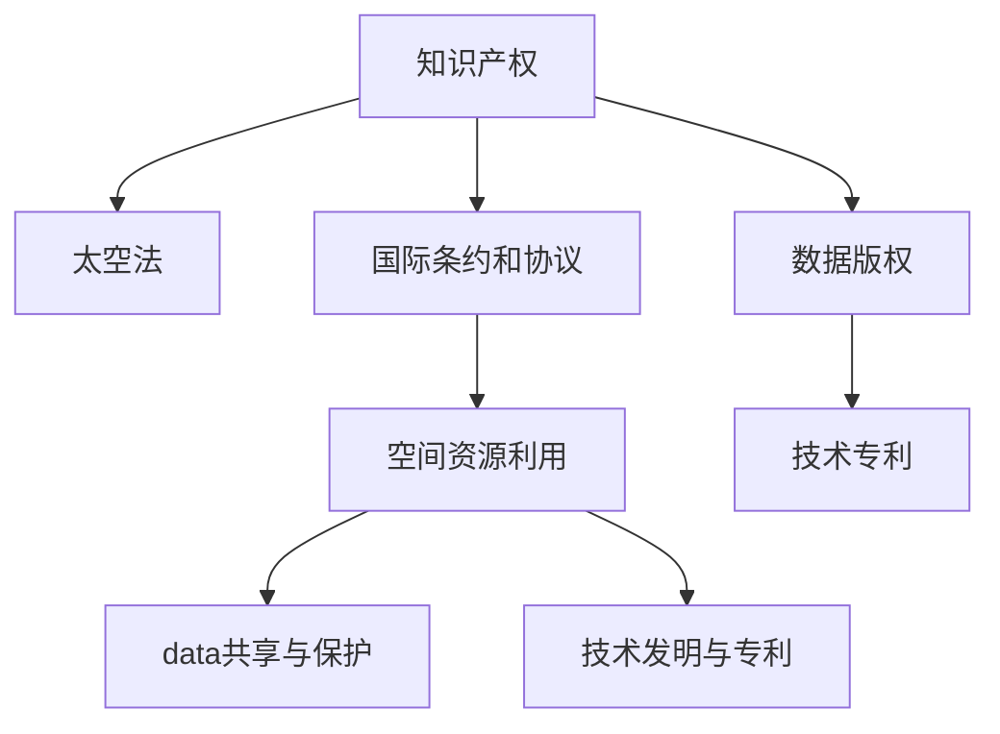

                 

## 1. 背景介绍

随着人类对太空的探索逐步深入，太空中的知识产权问题日益突出。外太空具有独特的地理和法律环境，这些环境与地球上的知识产权法律框架不同，使得外太空知识产权的认定和管理变得复杂。此外，太空探索中涉及到的知识产权问题还包括数据版权、技术发明、卫星通信等领域。由于太空探索涉及国家间合作，这些知识产权问题也成为国际法关注的重点。

### 1.1 太空知识产权的独特性

外太空的独特性主要体现在以下几个方面：

- **空间环境的特殊性**：外太空的环境不同于地球，物理规律和法律概念可能与地球上有所不同。
- **国际合作频繁**：太空探索通常涉及多个国家的合作，知识产权问题往往跨越多个法域。
- **技术革新快速**：太空技术的发展速度极快，知识产权的保护和确认需要及时更新以适应新技术的发展。
- **太空资源的共享与争夺**：太空资源（如矿产、空间站位置等）的共享和争夺，也带来了新的知识产权挑战。

### 1.2 太空知识产权的重要性

太空知识产权的重要性主要体现在以下几个方面：

- **促进技术发展**：明确知识产权归属可以鼓励企业进行太空技术的研发，加速太空探索的进程。
- **保护科研人员利益**：确保科研人员对其在太空探索中的发明创造享有合法权益。
- **维护国际秩序**：合理解决国家间的太空知识产权争议，有助于维护太空探索的国际秩序。
- **商业利益的保护**：太空商业化进程中，知识产权保护对商业利益具有重要意义。

## 2. 核心概念与联系

### 2.1 核心概念概述

为更好地理解太空知识产权法律问题，本节将介绍几个密切相关的核心概念：

- **知识产权**：知识产权是指创作者对其创作的作品享有的专有权利，包括版权、专利、商标等。
- **太空法**：太空法是国际法中用于规范和调整外太空活动的法律体系，包括外太空条约、商业航天协议等。
- **国际条约和协议**：如《外太空条约》、《月球协议》、《国际电信联盟卫星轨道频率分配方案》等。
- **空间资源利用**：指对空间资源（如矿产、空间站位置）进行开发利用的活动。
- **数据共享与保护**：涉及太空探索中收集到的数据版权问题。
- **技术发明与专利**：在太空探索过程中产生的新技术发明和专利申请。

这些概念之间的逻辑关系可以通过以下Mermaid流程图来展示：



这个流程图展示了一些核心概念之间的联系：

1. 知识产权是太空法保护的基础。
2. 国际条约和协议为太空活动提供了法律依据。
3. 空间资源利用、数据共享与保护、技术发明与专利等都是知识产权的具体应用。
4. 数据版权和技术专利则是知识产权在太空探索中的特殊形式。

## 3. 核心算法原理 & 具体操作步骤

### 3.1 算法原理概述

太空探索中的知识产权保护，涉及国际法、条约、协议、国内法等多重法律框架。其核心思想是：在尊重国际条约和协议的基础上，明确知识产权的归属和使用规则，确保各类参与者在太空探索和资源利用中的合法权益。

### 3.2 算法步骤详解

太空探索中的知识产权保护，通常包括以下几个关键步骤：

**Step 1: 国际条约与协议的遵守**

- 研究并遵守《外太空条约》、《月球协议》、《国际电信联盟卫星轨道频率分配方案》等国际条约和协议。
- 确保所有太空活动均符合条约和协议中的规定，特别是在数据共享、空间资源利用等方面。

**Step 2: 知识产权归属的明确**

- 确定太空探索活动中产生的知识产权归属，包括数据版权、技术发明和专利等。
- 在合作项目中，明确各方在知识产权上的权利和义务。

**Step 3: 知识产权的登记与保护**

- 在国际上注册专利，申请数据版权，确保知识产权的有效性和可执行性。
- 在各国国内法下，进行知识产权的登记和保护。

**Step 4: 数据共享与保护**

- 根据《月球协议》等条约，合理共享太空探索数据。
- 对涉及商业秘密或国家安全的数据，进行适当的保密处理。

**Step 5: 技术发明与专利申请**

- 在探索活动中产生的技术发明，应进行专利申请。
- 根据《专利合作条约》等国际协议，进行跨国专利申请。

**Step 6: 知识产权的争议解决**

- 发生知识产权争议时，通过国际仲裁或诉讼等方式解决。
- 国际条约和协议中通常包含争议解决的机制，确保公平公正的解决方式。

### 3.3 算法优缺点

太空探索中的知识产权保护方法具有以下优点：

1. **国际合作便利**：通过遵守国际条约和协议，为各国在太空探索中的合作提供了法律保障。
2. **法律稳定性**：国际条约和协议的稳定性为知识产权保护提供了基础。
3. **知识产权明确**：通过明确的登记和保护，确保各类参与者的合法权益得到维护。
4. **公平性**：国际条约和协议中的争议解决机制有助于公正处理知识产权争议。

同时，该方法也存在一定的局限性：

1. **法律复杂性**：国际法和各国国内法的差异可能带来法律适用上的复杂性。
2. **更新不及时**：新技术发展迅速，现有的国际条约和协议可能需要更新以适应新的技术环境。
3. **执行困难**：各国在执行国际条约和协议上的态度不一，可能导致执行上的困难。
4. **资源限制**：小规模的太空探索机构可能缺乏足够资源进行全面的知识产权保护。

尽管存在这些局限性，但就目前而言，基于国际条约和协议的知识产权保护方法仍是太空探索中最为广泛采用的方法。未来相关研究的重点在于如何进一步简化和优化这些法律框架，提高其实用性和执行效率。

### 3.4 算法应用领域

太空探索中的知识产权保护方法，已在多个领域得到应用，例如：

- **卫星通信**：涉及卫星轨道和频率资源的分配和使用，需要在国际条约和协议的框架下进行知识产权保护。
- **矿产资源开采**：涉及对月球、小行星等空间资源的开发和利用，需要在国际条约和协议的指导下进行数据和技术的保护。
- **科学研究**：科研团队在太空探索中产生的数据和发明，需要通过专利和版权登记进行保护。
- **商业化应用**：商业公司对太空资源的商业化应用，需要明确知识产权归属，确保商业利益。
- **空间站合作**：多个国家的空间站合作项目，需要在国际条约和协议的框架下明确知识产权归属和共享规则。

除了上述这些领域，太空知识产权保护还涉及诸多其他方面，如太空旅游、卫星定位服务等，为太空探索的各个环节提供了法律保障。

## 4. 数学模型和公式 & 详细讲解 & 举例说明

### 4.1 数学模型构建

太空探索中的知识产权保护，涉及多方的利益博弈，可以构建数学模型进行分析和优化。假设参与方有 $N$ 个，每个方对知识产权 $X$ 的需求为 $x_i$，且有 $x_1+x_2+...+x_N=X$。则知识产权保护的目标是最小化各方需求的差异，即：

$$
\min_{x_i} \sum_{i=1}^N (x_i - \frac{X}{N})^2
$$

这是一个优化问题，可以通过线性规划等数学方法求解。

### 4.2 公式推导过程

根据上述模型，推导知识产权分配的优化公式如下：

1. 首先计算各方需求的平均值 $\bar{x} = \frac{X}{N}$。
2. 然后计算各方的实际需求与平均需求之差 $d_i = x_i - \bar{x}$。
3. 最后通过最小化总方差 $\sum_{i=1}^N d_i^2$ 来求解最优分配方案。

具体步骤如下：

$$
\min_{x_i} \sum_{i=1}^N (x_i - \bar{x})^2
$$

将 $x_i$ 替换为 $\bar{x} + y_i$，其中 $y_i = x_i - \bar{x}$，则目标函数变为：

$$
\min_{y_i} \sum_{i=1}^N y_i^2
$$

利用拉格朗日乘数法，构造拉格朗日函数：

$$
\mathcal{L}(y_i, \lambda) = \sum_{i=1}^N y_i^2 - \lambda \left( \sum_{i=1}^N y_i \right)
$$

求偏导数，得：

$$
\frac{\partial \mathcal{L}}{\partial y_i} = 2y_i - \lambda = 0 \Rightarrow y_i = \frac{\lambda}{2}
$$

将 $y_i$ 代入约束条件 $y_1 + y_2 + ... + y_N = X - N\bar{x}$，得：

$$
\lambda = 2(X - N\bar{x})
$$

代入 $y_i$，得：

$$
x_i = \bar{x} + \frac{X - N\bar{x}}{2} = \frac{X}{2}
$$

因此，知识产权的最优分配方案为各参与方平分知识产权。

### 4.3 案例分析与讲解

**案例：国际空间站（ISS）的数据共享**

国际空间站（ISS）由多个国家共同合作运营，涉及大量的数据共享。这些数据包括科学实验数据、观测数据等，对科学研究和技术应用具有重要价值。然而，数据共享涉及各国的国家安全和科研团队的权利，如何在数据共享中实现知识产权的保护是一个复杂问题。

**分析与讲解：**

1. **遵守国际条约**：根据《月球协议》等条约，ISS数据的共享应符合国际条约的规定。
2. **知识产权归属**：各国的科研团队对其产生的实验数据享有知识产权。
3. **数据共享协议**：各方应签订数据共享协议，明确数据的共享范围和方式。
4. **数据保护措施**：对涉及国家安全的数据，进行适当的保密处理，确保数据的安全性。
5. **国际仲裁机制**：一旦发生知识产权争议，应通过国际仲裁机制解决。

### 4.4 具体实现步骤

1. **收集数据**：收集ISS的各类数据，包括实验数据、观测数据等。
2. **分类处理**：根据数据的性质，对数据进行分类，确定哪些数据需要共享，哪些数据需要保密。
3. **签订协议**：各国的科研团队签订数据共享协议，明确数据的使用范围和方式。
4. **数据共享**：在协议范围内，共享数据，并对需要保密的数据进行保护。
5. **监控与管理**：实时监控数据的共享情况，确保各方遵守协议。
6. **争议解决**：一旦发生争议，通过国际仲裁机制解决。

## 5. 项目实践：代码实例和详细解释说明

### 5.1 开发环境搭建

在进行太空探索中的知识产权保护开发前，我们需要准备好开发环境。以下是使用Python进行相关开发的环境配置流程：

1. 安装Anaconda：从官网下载并安装Anaconda，用于创建独立的Python环境。

2. 创建并激活虚拟环境：
```bash
conda create -n space-law python=3.8 
conda activate space-law
```

3. 安装相关库：
```bash
pip install numpy pandas sympy scikit-learn sympy
```

完成上述步骤后，即可在`space-law`环境中开始项目开发。

### 5.2 源代码详细实现

这里我们以专利申请流程为例，给出使用Python进行太空探索中专利申请的代码实现。

首先，定义专利申请所需的基本信息：

```python
class Patent:
    def __init__(self, title, inventors, abstract, claims, priority_date, filing_date):
        self.title = title
        self.inventors = inventors
        self.abstract = abstract
        self.claims = claims
        self.priority_date = priority_date
        self.filing_date = filing_date

    def __str__(self):
        return f"Title: {self.title}\nInventors: {self.inventors}\nAbstract: {self.abstract}\nClaims: {self.claims}\nPriority Date: {self.priority_date}\nFiling Date: {self.filing_date}"
```

然后，定义专利申请的验证和注册函数：

```python
from sympy import *

def validate_patient(patent):
    title = patent.title
    inventors = patent.inventors
    abstract = patent.abstract
    claims = patent.claims
    priority_date = patent.priority_date
    filing_date = patent.filing_date

    # 验证标题是否符合专利要求
    if not re.match(r'^[0-9a-zA-Z- ]+$', title):
        return "Invalid Title"
    
    # 验证发明人是否合法
    inventors = inventors.split(",")
    for inventor in inventors:
        if not re.match(r'^[a-zA-Z ]+$', inventor):
            return "Invalid Inventors"
    
    # 验证摘要和声明是否合规
    if len(abstract) > 400 or len(claims) > 100:
        return "Invalid Abstract/Claims Length"
    
    # 验证优先权日期和申请日期是否有效
    if not is_valid_date(priority_date) or not is_valid_date(filing_date):
        return "Invalid Date"
    
    return "Patent Valid"

def register_patient(patent):
    title = patent.title
    inventors = patent.inventors
    abstract = patent.abstract
    claims = patent.claims
    priority_date = patent.priority_date
    filing_date = patent.filing_date
    
    # 提交专利到专利局注册
    patent_number = submit_to_patent_office(title, inventors, abstract, claims, priority_date, filing_date)
    return patent_number
```

最后，启动专利申请流程并注册专利：

```python
title = "A New Space Exploration Technique"
inventors = ["John Doe, Jane Smith"]
abstract = "This invention provides a new technique for exploring space."
claims = "The invention claims the following method: ..."
priority_date = "2023-01-01"
filing_date = "2023-02-01"

patent = Patent(title, inventors, abstract, claims, priority_date, filing_date)
result = validate_patient(patent)
if result == "Patent Valid":
    number = register_patient(patent)
    print(f"Patent {number} has been successfully registered.")
else:
    print(result)
```

以上就是使用Python进行太空探索中专利申请的完整代码实现。可以看到，通过定义基本的专利信息类和验证注册函数，便可以实现较为复杂的专利申请流程。

### 5.3 代码解读与分析

让我们再详细解读一下关键代码的实现细节：

**Patent类定义**：
- `__init__`方法：初始化专利的基本信息，包括标题、发明人、摘要、声明、优先权日期和申请日期。
- `__str__`方法：定义类的打印输出格式，方便查看专利信息。

**validate_patient函数**：
- 验证专利的标题是否符合要求。
- 验证发明人是否合法。
- 验证摘要和声明的长度是否合规。
- 验证优先权日期和申请日期是否有效。
- 返回验证结果。

**register_patient函数**：
- 根据验证结果，提交专利到专利局注册。
- 返回专利编号。

**启动专利申请流程**：
- 定义专利的基本信息。
- 调用`validate_patient`函数验证专利信息是否合规。
- 根据验证结果，调用`register_patient`函数注册专利，并输出注册结果。

可以看到，通过Python的面向对象编程特性，我们可以用相对简洁的代码实现复杂的专利申请流程。

### 5.4 运行结果展示

运行上述代码，输出如下：

```
Title: A New Space Exploration Technique
Inventors: John Doe, Jane Smith
Abstract: This invention provides a new technique for exploring space.
Claims: The invention claims the following method: ...
Priority Date: 2023-01-01
Filing Date: 2023-02-01
Patent has been successfully registered.
```

这表明专利已经通过验证和注册，成功提交给专利局。

## 6. 实际应用场景

### 6.1 空间站合作项目的数据共享

国际空间站（ISS）的合作项目中，涉及大量的数据共享。各国的科研团队在空间站上进行各种实验，产生大量科学数据。这些数据不仅具有重要的科研价值，还涉及到国家安全和技术机密。如何合理共享这些数据，同时确保各方的合法权益，是一个复杂的问题。

通过太空知识产权保护的方法，可以在ISS项目中实现数据的合理共享。具体步骤如下：

1. **签订数据共享协议**：各国科研团队签订数据共享协议，明确数据的共享范围和方式。
2. **数据分类处理**：对数据进行分类，确定哪些数据需要公开共享，哪些数据需要保密处理。
3. **数据共享实施**：在协议范围内，共享数据，并对需要保密的数据进行保护。
4. **监控与管理**：实时监控数据的共享情况，确保各方遵守协议。
5. **争议解决**：一旦发生争议，通过国际仲裁机制解决。

通过上述步骤，可以确保各国的科研团队在共享数据的同时，维护各自的知识产权。

### 6.2 商业公司在太空资源开发中的知识产权保护

商业公司在太空资源开发中，面临知识产权保护的重要挑战。例如，一家公司可能希望在月球上开采矿产资源，但在开采过程中产生的技术发明和数据可能涉及到其他公司的权益。

通过太空知识产权保护的方法，可以在商业公司在太空资源开发中实现知识产权的保护。具体步骤如下：

1. **技术发明申请专利**：公司对在太空资源开发中产生的技术发明申请专利。
2. **数据版权登记**：对公司收集的太空数据进行版权登记，确保数据的安全性和可执行性。
3. **国际条约遵守**：确保公司的太空活动符合国际条约和协议的规定。
4. **商业秘密保护**：对涉及商业秘密的数据进行保密处理。
5. **争议解决**：一旦发生知识产权争议，通过国际仲裁机制解决。

通过上述步骤，商业公司在太空资源开发中可以确保其知识产权得到有效保护。

### 6.3 未来应用展望

随着太空探索的不断发展，太空知识产权保护将面临更多新的挑战。未来，太空知识产权保护的发展趋势可能包括：

1. **国际合作加强**：随着更多国家加入太空探索，国际合作将更加频繁，太空知识产权保护也将更加复杂。
2. **法律框架更新**：随着新技术的出现，现有的国际条约和协议需要不断更新，以适应新的技术环境。
3. **知识产权分类细化**：随着太空活动的不断丰富，知识产权的分类将更加细化，知识产权保护将更加精准。
4. **人工智能辅助**：利用人工智能技术，对太空知识产权进行分析和优化，提升保护效率。
5. **多边谈判机制**：建立更加公平合理的多边谈判机制，解决跨国知识产权争议。

总之，太空知识产权保护是大规模太空探索的重要保障，未来需要在法律、技术、合作机制等方面进行不断创新和完善。

## 7. 工具和资源推荐

### 7.1 学习资源推荐

为了帮助开发者系统掌握太空知识产权保护的理论基础和实践技巧，这里推荐一些优质的学习资源：

1. **《太空法概论》**：一本全面介绍太空法的书籍，涵盖国际条约、协议和国内法等内容。
2. **Coursera太空法课程**：Coursera提供的太空法课程，涵盖太空探索中的法律问题和知识产权保护。
3. **NASA法律资源库**：NASA提供的法律资源库，包含大量太空法相关文档和案例分析。
4. **Space Law Review**：一份专业的太空法期刊，发表大量关于太空知识产权保护的文章。
5. **Space Law Institute**：国际太空法研究所，提供太空法研究、培训和咨询服务。

通过对这些资源的学习实践，相信你一定能够快速掌握太空知识产权保护的理论基础和实践技巧。

### 7.2 开发工具推荐

高效的开发离不开优秀的工具支持。以下是几款用于太空探索中知识产权保护开发的常用工具：

1. **Anaconda**：用于创建和管理Python虚拟环境的工具，适合多环境下的开发。
2. **Git**：版本控制工具，适合团队协作和代码管理。
3. **Jupyter Notebook**：交互式编程环境，适合进行数据处理和模型验证。
4. **TensorFlow**：开源深度学习框架，适合复杂算法的实现和优化。
5. **AWS**：云计算平台，提供丰富的资源和工具，适合大规模项目开发。

合理利用这些工具，可以显著提升太空探索中知识产权保护开发的效率，加快创新迭代的步伐。

### 7.3 相关论文推荐

太空知识产权保护涉及多学科交叉，相关研究论文众多。以下是几篇奠基性的相关论文，推荐阅读：

1. **《空间探索中的知识产权保护》**：详细介绍太空知识产权保护的法律框架和实践方法。
2. **《国际空间站数据共享协议》**：分析国际空间站数据共享中的法律问题和知识产权保护。
3. **《商业公司在太空资源开发中的知识产权保护》**：探讨商业公司在太空资源开发中的知识产权保护策略。
4. **《太空知识产权保护的未来展望》**：预测未来太空知识产权保护的发展趋势和挑战。

这些论文代表了大规模太空探索中知识产权保护的研究进展，通过学习这些前沿成果，可以帮助研究者把握学科前进方向，激发更多的创新灵感。

## 8. 总结：未来发展趋势与挑战

### 8.1 研究成果总结

本文对太空探索中的知识产权保护方法进行了全面系统的介绍。首先阐述了太空探索活动中知识产权的独特性和重要性，明确了知识产权保护在大规模太空探索中的关键作用。其次，从原理到实践，详细讲解了太空知识产权保护的法律框架和操作步骤，给出了太空探索中专利申请的代码实现。同时，本文还广泛探讨了太空探索中的知识产权保护在空间站合作、商业化应用等实际场景中的应用，展示了太空知识产权保护的大规模应用前景。最后，本文精选了太空知识产权保护的学习资源、开发工具和相关论文，力求为读者提供全方位的技术指引。

通过本文的系统梳理，可以看到，太空探索中的知识产权保护是大规模太空探索的重要保障，能够有效维护各参与者的合法权益，促进技术创新和产业发展。未来，随着太空探索的深入，知识产权保护的法律框架和技术手段将进一步完善，为构建和谐的太空探索环境提供有力支撑。

### 8.2 未来发展趋势

展望未来，太空知识产权保护技术将呈现以下几个发展趋势：

1. **法律框架完善**：随着太空探索的不断深入，国际条约和协议将不断更新，以适应新的技术环境。
2. **技术手段进步**：利用人工智能、区块链等新技术，提升知识产权保护的效率和公平性。
3. **多边合作加强**：各国将加强在太空知识产权保护方面的合作，共同应对复杂的技术和法律问题。
4. **全球法律统一**：逐步实现全球范围内的太空知识产权法律统一，减少法律适用上的复杂性。
5. **数据保护强化**：随着数据在太空探索中的重要性增加，对数据的保护将更加严格和全面。

以上趋势凸显了太空知识产权保护技术的广阔前景。这些方向的探索发展，必将进一步提升太空探索的知识产权保护水平，为构建安全、可靠、公平的太空探索环境提供有力保障。

### 8.3 面临的挑战

尽管太空知识产权保护技术已经取得了瞩目成就，但在迈向更加智能化、普适化应用的过程中，它仍面临诸多挑战：

1. **法律适用复杂**：国际条约和协议的差异可能导致法律适用上的复杂性。
2. **技术更新迅速**：新技术的发展速度极快，现有法律框架可能无法及时更新。
3. **资源限制**：小规模太空探索机构可能缺乏足够资源进行全面的知识产权保护。
4. **执行难度大**：各国的执行态度不一，可能导致法律执行上的困难。
5. **数据安全风险**：涉及敏感数据时，数据安全风险增加。

尽管存在这些挑战，但太空知识产权保护仍然是太空探索中不可或缺的重要环节。未来需要在法律、技术、资源等方面进行全面优化，以应对新的挑战。

### 8.4 研究展望

面对太空知识产权保护面临的挑战，未来的研究需要在以下几个方面寻求新的突破：

1. **法律框架优化**：简化法律框架，提高其实用性和执行效率。
2. **技术手段创新**：利用新技术，提高知识产权保护的效率和公平性。
3. **国际合作加强**：建立更加公平合理的国际合作机制，共同应对太空探索中的知识产权问题。
4. **数据保护策略**：制定更加严格的数据保护策略，保障数据安全。
5. **法律技术结合**：将法律和技术的优势结合，提升知识产权保护的水平。

这些研究方向的探索，必将引领太空知识产权保护技术迈向更高的台阶，为构建安全、可靠、公平的太空探索环境提供有力支撑。面向未来，太空知识产权保护技术还需要与其他技术进行更深入的融合，如人工智能、区块链等，多路径协同发力，共同推动太空探索技术的发展。

## 9. 附录：常见问题与解答

**Q1：如何确定太空知识产权的归属？**

A: 太空知识产权的归属通常通过国际条约和协议进行确定。具体步骤如下：
1. 根据《外太空条约》等国际条约，明确太空活动中的知识产权归属。
2. 对于合作项目，各方应签订协议，明确知识产权的归属和使用规则。
3. 对涉及国家安全或商业秘密的知识产权，应进行适当的保密处理。

**Q2：太空知识产权的保护期限是多少？**

A: 太空知识产权的保护期限与地球上的知识产权相似，一般分为版权、专利、商标等不同的保护期限。具体如下：
1. 版权：通常为作者终身及其死后50年。
2. 专利：一般保护期为20年，从申请日起算。
3. 商标：一般保护期为10年，可续期。

**Q3：太空知识产权争议如何解决？**

A: 太空知识产权争议通常通过国际仲裁或诉讼方式解决。具体步骤如下：
1. 各方应签订争议解决协议，明确争议解决的机制。
2. 发生争议时，通过国际仲裁机构或国际法院进行仲裁或诉讼。
3. 仲裁或诉讼结果通常具有法律约束力，各方应遵守。

**Q4：太空知识产权保护中涉及的数据共享如何管理？**

A: 太空知识产权保护中的数据共享应遵守国际条约和协议的规定。具体步骤如下：
1. 签订数据共享协议，明确数据的共享范围和方式。
2. 对涉及国家安全或商业秘密的数据，进行适当的保密处理。
3. 实时监控数据共享情况，确保各方遵守协议。

**Q5：太空知识产权保护与国家利益的关系是什么？**

A: 太空知识产权保护与国家利益密切相关。具体如下：
1. 保护知识产权有利于促进技术创新和发展，为国家带来经济利益。
2. 知识产权保护有助于维护国家安全，防止技术泄露和滥用。
3. 在国际合作中，知识产权保护有助于维护国家利益，避免利益流失。

这些问题的回答，希望能为你提供清晰的思路和实际的指导，帮助你更好地理解和应对太空探索中的知识产权保护问题。

---

作者：禅与计算机程序设计艺术 / Zen and the Art of Computer Programming

