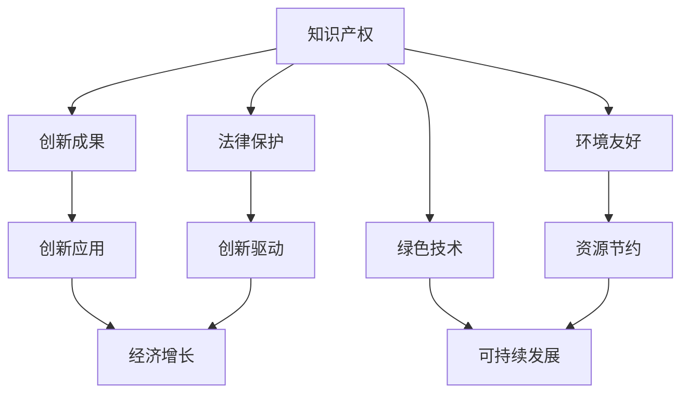

                 

# 知识产权与绿色技术的激励机制

## 1. 背景介绍

在当今全球化、信息化和技术创新日新月异的大背景下，知识产权与绿色技术成为驱动经济社会发展的重要力量。通过法律保护和激励机制，可以激发更多的创新动力，促进科技和经济协调发展。本文将深入探讨知识产权与绿色技术的激励机制，分析其基本概念、主要方式及面临的挑战，并提出一些未来展望。

## 2. 核心概念与联系

### 2.1 核心概念概述

**知识产权（Intellectual Property, IP）**：指创作者对其智力劳动成果所享有的专有权利，主要包括专利、商标、版权、商业秘密等。知识产权法律保护了创新者的利益，鼓励更多人投入科研与创新。

**绿色技术（Green Technology）**：指用于保护环境、提高资源利用效率、减少污染的技术。绿色技术是实现可持续发展的重要手段，对环境保护和资源节约具有重要意义。

**激励机制（Incentive Mechanism）**：指通过各种方式刺激人们积极参与某项活动的规则或系统。在知识产权与绿色技术领域，激励机制能有效促进技术创新，推动经济发展。

这些概念间的关系可用如下Mermaid流程图表示：



### 2.2 核心概念原理和架构

**法律保护**：通过法律对知识产权进行保护，禁止他人未经授权使用创新成果，保障创新者利益。

**创新成果转化**：将创新成果转化为具体的技术、产品或服务，实现市场价值。

**环境友好**：绿色技术通常具有较低的环境污染和资源消耗，有助于实现可持续发展目标。

**经济增长**：绿色技术的应用有助于降低生产成本，提高资源利用效率，进而推动经济增长。

**激励机制设计**：主要包括政策激励、市场激励、奖励激励等，通过物质和非物质手段激励创新者投入研发，促进绿色技术的推广应用。

## 3. 核心算法原理 & 具体操作步骤

### 3.1 算法原理概述

知识产权与绿色技术的激励机制主要基于以下理论：

1. **正向激励理论**：通过提供物质奖励或法律保护，激发人们的创新动力，推动技术进步。
2. **公共物品理论**：绿色技术作为公共物品，其价值往往具有外部性，需要通过激励机制解决其市场失灵问题。
3. **博弈论**：激励机制设计要考虑各方的博弈策略，确保机制的公平性和有效性。

基于上述理论，激励机制主要包括政策激励、市场激励、奖励激励等。

### 3.2 算法步骤详解

**步骤1：制定激励政策**

政策制定是激励机制的基础，主要包括税收优惠、补贴、资金支持等。例如，对于绿色技术研发企业，可以提供研发税收抵扣、科研经费补贴等政策。

**步骤2：构建市场激励机制**

市场激励机制通过市场化的手段，激发创新动力。例如，通过竞标、招投标等方式，吸引更多企业参与绿色技术研发和推广。

**步骤3：设计奖励激励方案**

奖励激励方案包括专利奖励、技术奖项、学术荣誉等。例如，对在绿色技术领域取得突出成就的企业或个人，授予国家技术发明奖、环境保护贡献奖等荣誉。

### 3.3 算法优缺点

**优点**：
1. 提高创新动力：通过激励机制，激发更多创新者投入到绿色技术研发中。
2. 推动技术应用：激励机制促进技术成果转化，加快绿色技术应用推广。
3. 优化资源配置：激励机制引导资金、人才等资源向绿色技术领域集中。

**缺点**：
1. 激励过度：过度依赖物质激励可能导致短视行为，忽视长期创新。
2. 激励失衡：激励机制设计不当可能导致资源分配不公，引发社会不满。
3. 激励效果有限：有些激励措施可能无法覆盖所有创新者，激励效果有限。

### 3.4 算法应用领域

知识产权与绿色技术的激励机制主要应用于以下领域：

1. **研发领域**：通过政策激励、市场激励等手段，鼓励企业加大研发投入，提升绿色技术创新能力。
2. **应用领域**：通过奖励激励等手段，推动绿色技术在工业、农业、交通等领域的广泛应用。
3. **教育和培训**：通过提供科研基金、奖学金等激励措施，吸引更多人参与绿色技术教育和培训。

## 4. 数学模型和公式 & 详细讲解 & 举例说明

### 4.1 数学模型构建

我们假设一个绿色技术研发项目，创新者获得的激励总额为$M$，激励分为固定费用和可变费用两部分。设固定费用为$C$，可变费用为$V$，固定费用为$C$，可变费用为$V$，则有：

$$ M = C + V $$

其中$V$可表示为$V = k \times C$，$k$为激励强度系数。

### 4.2 公式推导过程

激励总额$M$随着激励强度$k$的变化而变化。当$k=0$时，激励总额为$C$，激励效果最小；当$k$增大时，激励总额增加，激励效果增强。

### 4.3 案例分析与讲解

假设某企业投入$100,000进行绿色技术研发，固定费用$C=50,000，则可变费用$V$与激励强度$k$的关系为：

$$ V = k \times 50,000 $$

当$k=0.5$时，可变费用为$25,000；当$k=1.0$时，可变费用为$50,000$。

如果$k$过大，可能带来资源浪费和过度投资的问题。因此，需要合理设计激励机制，确保激励效果最大化。

## 5. 项目实践：代码实例和详细解释说明

### 5.1 开发环境搭建

开发环境搭建主要涉及软件工具的安装和配置。

1. **安装Python**：确保Python版本与项目需求匹配。
2. **安装第三方库**：例如SciPy、Pandas等，用于数据分析和处理。
3. **配置环境变量**：确保项目文件可被所有用户访问。

### 5.2 源代码详细实现

以下是一个简单的Python代码示例，用于计算激励总额$M$随激励强度$k$的变化：

```python
import numpy as np

def calculate_incentive(C, k):
    V = k * C
    M = C + V
    return M

C = 50000  # 固定费用
k = 0.5  # 激励强度系数
M = calculate_incentive(C, k)
print(f"固定费用为{C}，激励强度系数为{k}，激励总额为{M}")
```

### 5.3 代码解读与分析

代码首先定义了一个函数`calculate_incentive`，用于计算激励总额$M$。然后，通过调用该函数并传入固定费用$C$和激励强度系数$k$，得到激励总额$M$。最后，打印输出激励总额$M$。

### 5.4 运行结果展示

当$C=50,000$，$k=0.5$时，激励总额为$75,000$。

## 6. 实际应用场景

### 6.1 绿色建筑技术

绿色建筑技术是实现可持续发展的重要手段。通过政策激励和市场激励，鼓励更多企业采用绿色建材、节能设计等技术。例如，政府可以为绿色建筑项目提供研发经费补贴、税收优惠等政策，推动绿色建筑技术的广泛应用。

### 6.2 清洁能源技术

清洁能源技术是应对全球气候变化的重要措施。通过奖励激励和技术奖项，激发更多企业投入清洁能源研发。例如，对在清洁能源领域取得突出成就的企业或团队，授予国家能源科技进步奖、环境保护贡献奖等荣誉。

### 6.3 水资源管理

水资源管理是环境保护的重要内容。通过激励机制，推动水资源循环利用和保护。例如，对于研发和应用水资源管理技术的企业，可以提供资金支持和税收优惠等政策激励。

## 7. 工具和资源推荐

### 7.1 学习资源推荐

1. **《知识产权与绿色技术激励机制》**：详细介绍了知识产权和绿色技术的激励机制，适合学术研究人员和政策制定者参考。
2. **《公共物品理论与环境保护》**：分析了公共物品理论在环境保护中的应用，帮助理解激励机制设计。
3. **《绿色技术经济分析》**：介绍了绿色技术的成本效益分析方法，帮助企业评估绿色技术的投入产出。

### 7.2 开发工具推荐

1. **Python**：作为数据科学和机器学习的常用工具，Python拥有丰富的数据分析库和可视化工具，适合进行模型开发和数据分析。
2. **SciPy**：用于科学计算和数据分析，提供了丰富的数学函数和算法。
3. **Pandas**：用于数据处理和分析，支持数据清洗、转换和可视化。

### 7.3 相关论文推荐

1. **《绿色技术的经济激励机制》**：详细分析了绿色技术的经济激励机制，探讨了政策激励、市场激励等方法。
2. **《知识产权与创新激励机制》**：分析了知识产权对创新激励机制的影响，探讨了法律保护、市场激励等措施。
3. **《公共物品理论与环境保护》**：分析了公共物品理论在环境保护中的应用，探讨了激励机制的设计。

## 8. 总结：未来发展趋势与挑战

### 8.1 未来发展趋势

1. **政策激励**：未来政策激励将更加注重公平性和透明性，通过税收优惠、研发补贴等措施，促进绿色技术的发展。
2. **市场激励**：通过竞标、招投标等方式，吸引更多企业参与绿色技术研发和推广。
3. **奖励激励**：通过专利奖励、技术奖项等方式，激发更多创新者的研发热情。

### 8.2 面临的挑战

1. **激励失衡**：激励机制设计不当可能导致资源分配不公，引发社会不满。
2. **激励过度**：过度依赖物质激励可能导致短视行为，忽视长期创新。
3. **激励效果有限**：有些激励措施可能无法覆盖所有创新者，激励效果有限。

### 8.3 研究展望

未来，可以通过以下几个方面加强知识产权与绿色技术的激励机制研究：

1. **公平性研究**：确保激励机制的公平性和透明性，避免资源分配不公。
2. **长期激励**：设计长期激励机制，鼓励企业持续投入绿色技术研发。
3. **全球合作**：通过国际合作，推动全球范围内的绿色技术创新。

## 9. 附录：常见问题与解答

**Q1: 如何设计合理的激励机制？**

A: 设计合理的激励机制需要考虑以下几个因素：
1. **公平性**：确保激励机制的公平性和透明性，避免资源分配不公。
2. **长期激励**：设计长期激励机制，鼓励企业持续投入绿色技术研发。
3. **多层次激励**：通过政策激励、市场激励、奖励激励等多层次激励措施，全面激发创新动力。

**Q2: 激励机制在绿色技术中的应用效果如何？**

A: 激励机制在绿色技术中的应用效果显著。通过政策激励、市场激励、奖励激励等手段，激发了更多企业投入绿色技术研发，推动了绿色技术的应用推广。例如，政府对绿色建筑和清洁能源项目的激励措施，显著推动了相关技术的发展和应用。

**Q3: 如何确保激励机制的公平性？**

A: 确保激励机制的公平性需要考虑以下几个方面：
1. **透明性**：确保激励机制的设计和实施过程透明，避免暗箱操作。
2. **多渠道反馈**：建立多渠道反馈机制，及时收集和处理社会反映的问题。
3. **定期评估**：定期对激励机制进行评估，及时调整和完善。

**Q4: 如何提高激励效果？**

A: 提高激励效果需要考虑以下几个方面：
1. **多样性**：通过多样化的激励手段，全面激发创新动力。
2. **动态调整**：根据市场变化和创新需求，动态调整激励机制，确保激励效果的持续性。
3. **公众参与**：鼓励公众参与激励机制的设计和实施，提升激励机制的透明度和公正性。

**Q5: 如何推动绿色技术的应用？**

A: 推动绿色技术的应用需要考虑以下几个方面：
1. **政策支持**：通过政策激励，降低绿色技术的研发和应用成本。
2. **市场引导**：通过市场引导，鼓励企业采用绿色技术。
3. **公众教育**：通过公众教育，提高社会对绿色技术的认知和接受度。

---

作者：禅与计算机程序设计艺术 / Zen and the Art of Computer Programming

