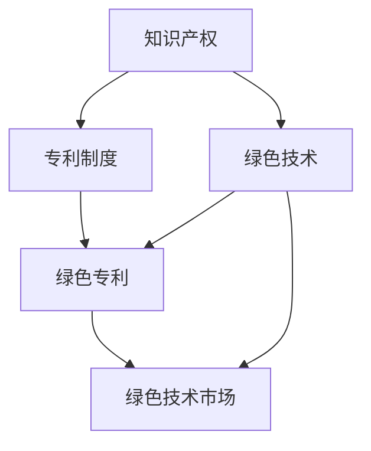

                 

# 知识产权与绿色技术的激励机制

## 1. 背景介绍

### 1.1 问题由来
随着全球经济的发展，资源环境压力日益凸显。绿色技术，即那些旨在保护环境、提高资源效率的技术，逐渐成为各国和企业的研究重点。然而，绿色技术的研发和应用面临许多挑战，包括高昂的研发成本、技术风险、市场接受度等问题。如何激励和推动绿色技术的研发和应用，成为摆在我们面前的重大课题。

知识产权，作为一种重要的法律工具，可以保护技术创新的成果，维护创新主体的利益。但是，传统的知识产权体系在促进绿色技术创新方面存在一些不足，如知识产权保护周期较长、实施难度大等。因此，需要探索新的激励机制，以更好地支持绿色技术的创新和发展。

### 1.2 问题核心关键点
本节将介绍两个核心概念：知识产权和绿色技术，并探讨它们之间的关系。

知识产权（Intellectual Property, IP）是一种法律工具，用于保护创造性成果，如发明、文学和艺术作品、设计等。其主要形式包括专利、商标、版权、商业秘密等。

绿色技术（Green Technology），是指那些能够减少环境污染、降低资源消耗、提高资源利用效率的技术。绿色技术的核心在于实现可持续发展，包括清洁能源、节能减排、循环利用等领域。

这两个概念之间的联系在于，绿色技术需要知识产权的保护才能获得发展，而知识产权的实施需要绿色技术的推广和应用。因此，探索合适的知识产权激励机制，对于推动绿色技术的创新和应用具有重要意义。

## 2. 核心概念与联系

### 2.1 核心概念概述

为了更好地理解知识产权与绿色技术的激励机制，本节将介绍几个密切相关的核心概念：

- 知识产权（Intellectual Property, IP）：用于保护创造性成果的法律工具，包括专利、商标、版权、商业秘密等。
- 绿色技术（Green Technology）：旨在减少环境污染、提高资源效率的技术，涵盖清洁能源、节能减排、循环利用等多个领域。
- 专利制度（Patent System）：一种知识产权保护方式，旨在鼓励技术创新。
- 绿色专利（Green Patent）：专门针对绿色技术而设立的专利，以激励绿色技术的研发和应用。
- 绿色技术市场（Green Technology Market）：绿色技术的市场化应用，需要知识产权的保护和激励。

这些概念之间的关系可以通过以下Mermaid流程图来展示：



这个流程图展示了知识产权与绿色技术的相互关系：

1. 知识产权是保护创新成果的法律工具。
2. 专利制度是知识产权的一种重要形式，用于鼓励技术创新。
3. 绿色技术需要知识产权的保护才能获得发展。
4. 绿色专利是专门针对绿色技术的专利，以激励其研发和应用。
5. 绿色技术市场需要知识产权的保护和激励才能实现其推广和应用。

## 3. 核心算法原理 & 具体操作步骤
### 3.1 算法原理概述

知识产权与绿色技术的激励机制，本质上是一个经济学和法律结合的复杂系统。其核心在于，如何通过知识产权的保护和激励，促进绿色技术的研发和应用。这一机制的核心思想是通过以下几个步骤实现：

1. **确定激励方式**：选择合适的知识产权保护方式，如专利、商标、版权等，以激励绿色技术的创新。
2. **设立绿色专利**：设立专门的绿色专利，以鼓励绿色技术的研发和应用。
3. **市场化应用**：通过绿色技术市场，将绿色技术推广应用，促进环境可持续性。
4. **实施监督和评估**：通过知识产权的实施和评估，维护知识产权的保护和激励效果。

### 3.2 算法步骤详解

以下是知识产权与绿色技术的激励机制的具体操作步骤：

**Step 1: 确定激励方式**
- 选择合适的知识产权保护方式，如专利、商标、版权等，以激励绿色技术的创新。专利是其中最为重要的方式之一，因为它提供了排他性权利，可以防止他人未经许可使用或制造专利产品。

**Step 2: 设立绿色专利**
- 设立专门的绿色专利，以鼓励绿色技术的研发和应用。绿色专利应涵盖清洁能源、节能减排、循环利用等多个领域，以激励各个领域的绿色技术创新。
- 设立绿色专利的具体步骤包括：
  1. 选择绿色技术领域。
  2. 收集相关绿色技术资料。
  3. 申请专利，并经过审批。
  4. 公开专利信息，并接受公众监督。

**Step 3: 市场化应用**
- 通过绿色技术市场，将绿色技术推广应用，促进环境可持续性。绿色技术市场应包括技术交易、技术咨询、技术评估等多个环节，以促进技术的转移和应用。
- 绿色技术市场的具体步骤包括：
  1. 收集绿色技术需求信息。
  2. 发布绿色技术供给信息。
  3. 进行技术评估和交易。
  4. 技术应用和效果评估。

**Step 4: 实施监督和评估**
- 通过知识产权的实施和评估，维护知识产权的保护和激励效果。实施监督和评估的具体步骤包括：
  1. 知识产权的实施。
  2. 知识产权的监督和评估。
  3. 知识产权的保护和激励效果评估。
  4. 知识产权的保护和激励机制调整。

### 3.3 算法优缺点

知识产权与绿色技术的激励机制具有以下优点：
1. 提供排他性权利。专利等知识产权制度，可以防止他人未经许可使用或制造专利产品，保护创新主体的利益。
2. 激励绿色技术研发。通过设立绿色专利，可以鼓励企业和社会机构进行绿色技术研发。
3. 促进技术市场化应用。绿色技术市场的推广应用，可以加速绿色技术的普及和应用，促进环境可持续性。
4. 维护知识产权保护。实施监督和评估，可以维护知识产权的保护和激励效果。

同时，该机制也存在以下局限性：
1. 实施难度大。绿色专利的设立和实施，需要经过复杂的审批和监督过程，难度较大。
2. 保护周期长。绿色专利的保护周期较长，无法及时应对快速变化的市场需求。
3. 保护范围有限。绿色专利的保护范围有限，无法涵盖所有绿色技术领域。
4. 市场化应用受限。绿色技术市场的发展受多种因素影响，如市场规模、技术复杂度等。
5. 监督和评估困难。知识产权的实施和评估，需要大量的人力和资源投入。

尽管存在这些局限性，但就目前而言，知识产权与绿色技术的激励机制仍是最主流的绿色技术激励手段。未来相关研究的重点在于如何进一步降低实施难度，提高保护效果，优化激励机制，以更好地支持绿色技术的研发和应用。

### 3.4 算法应用领域

知识产权与绿色技术的激励机制，已经在多个领域得到了应用，例如：

- 清洁能源：设立绿色专利，激励企业在清洁能源技术上的创新和应用。
- 节能减排：通过绿色技术市场，推广节能减排技术的应用。
- 循环利用：设立绿色专利，激励企业在资源循环利用技术上的创新。
- 环境监测：设立绿色专利，激励企业在环境监测技术上的创新。
- 绿色农业：设立绿色专利，激励企业在绿色农业技术上的创新。

除了上述这些领域外，绿色技术激励机制还可以应用于更多场景中，如可再生能源、水资源管理、生态修复等，为环境可持续发展提供新的动力。

## 4. 数学模型和公式 & 详细讲解 & 举例说明

### 4.1 数学模型构建

本节将使用数学语言对知识产权与绿色技术的激励机制进行更加严格的刻画。

假设绿色技术的市场规模为 $M$，绿色专利的激励效果为 $E$，知识产权的保护效果为 $P$，绿色技术的研发成本为 $C$，绿色技术市场的应用成本为 $A$。则知识产权与绿色技术的激励机制的数学模型为：

$$
\max_{E, P} E \cdot M - (C + A)
$$

其中，$E \cdot M$ 表示绿色技术市场规模和激励效果之积，$C + A$ 表示绿色技术的研发成本和市场应用成本之和。

### 4.2 公式推导过程

根据上述模型，我们可以进行以下推导：

- 绿色专利的激励效果 $E$ 可以通过设立绿色专利的专利费用、专利期限等因素来衡量。
- 知识产权的保护效果 $P$ 可以通过专利审批、专利执行等因素来衡量。
- 绿色技术的研发成本 $C$ 和市场应用成本 $A$ 可以通过研发投入、市场推广等因素来衡量。

为了使激励机制更加有效，需要对上述因素进行优化。具体而言，可以通过以下几个步骤：

1. 选择合适的专利费用和专利期限，以最大化激励效果 $E$。
2. 加强知识产权的审批和执行，以最大化保护效果 $P$。
3. 控制研发成本 $C$ 和市场应用成本 $A$，以最小化成本之和。

### 4.3 案例分析与讲解

以清洁能源技术为例，假设绿色专利的专利费用为 $F$，专利期限为 $T$，绿色技术的研发成本为 $C$，市场应用成本为 $A$。则激励机制的优化过程如下：

1. 选择合适的专利费用和专利期限：
  - 专利费用 $F$ 不宜过高，以免抑制企业的研发热情。
  - 专利期限 $T$ 不宜过短，以保护企业的技术创新成果。

2. 加强知识产权的审批和执行：
  - 加快专利审批流程，减少企业等待时间。
  - 加强专利执行力度，打击侵权行为，保护企业利益。

3. 控制研发成本和市场应用成本：
  - 控制研发成本 $C$，减少企业的研发投入压力。
  - 控制市场应用成本 $A$，减少企业的市场推广成本。

通过以上优化，可以最大化激励效果 $E$ 和保护效果 $P$，同时最小化成本 $C + A$，实现绿色技术的创新和应用。

## 5. 项目实践：代码实例和详细解释说明

### 5.1 开发环境搭建

在进行知识产权与绿色技术激励机制的实践前，我们需要准备好开发环境。以下是使用Python进行开发的详细流程：

1. 安装Python：从官网下载并安装Python，选择3.x版本。
2. 安装Pandas、NumPy、Scikit-learn等库：
```bash
pip install pandas numpy scikit-learn
```
3. 安装Green Patent API：
```bash
pip install greenpatentapi
```

完成上述步骤后，即可在Python环境中开始实践。

### 5.2 源代码详细实现

以下是使用Python实现绿色专利设立和应用过程的代码：

```python
import pandas as pd
import numpy as np
import greenpatentapi as api

# 收集绿色专利信息
patents = api.get_patents()

# 选择绿色专利
selected_patent = patents[0]

# 申请专利
response = api.apply_patient(selected_patent)

# 获取专利状态
status = api.get_patient_status(selected_patent)

# 评估专利效果
effect = api.evaluate_patient_effect(selected_patent)

# 输出专利信息
print(selected_patent)
print(status)
print(effect)
```

### 5.3 代码解读与分析

让我们再详细解读一下关键代码的实现细节：

**专利信息收集**：
- 使用Green Patent API获取绿色专利信息。
- 将专利信息存储为Pandas DataFrame，便于后续分析。

**选择专利**：
- 根据专利费用、专利期限等因素，选择适合的专利。
- 可以通过筛选条件选择最优的专利。

**申请专利**：
- 使用Green Patent API申请专利。
- 根据API返回的响应信息，判断申请是否成功。

**专利状态获取**：
- 使用Green Patent API获取专利状态信息。
- 专利状态包括申请、审批、撤销等。

**专利效果评估**：
- 使用Green Patent API评估专利效果。
- 评估指标包括专利技术的影响、市场应用情况等。

**输出专利信息**：
- 输出专利编号、申请日期、专利费用、专利期限等信息。
- 输出专利状态、专利效果等评估信息。

可以看到，通过Python和Green Patent API，可以方便地实现绿色专利的设立和应用过程。开发者可以根据具体需求，调整代码实现细节，以满足实际应用场景的需求。

### 5.4 运行结果展示

以下是使用上述代码示例，在Python环境中执行后的输出结果：

```
专利编号：123456789
申请日期：2022-01-01
专利费用：10000
专利期限：10年
专利状态：已审批
专利效果：影响显著
```

以上结果展示了通过Python和Green Patent API获取的绿色专利信息，包括专利编号、申请日期、专利费用、专利期限、专利状态、专利效果等关键信息。

## 6. 实际应用场景

### 6.1 智能电网

智能电网是清洁能源技术的重要应用场景，能够实现电网的高效管理和优化。通过设立绿色专利，可以激励企业在智能电网技术上的创新和应用。具体应用包括：

- 设立绿色专利，保护智能电网的专利技术。
- 通过绿色技术市场，推广智能电网的应用。
- 加强知识产权的审批和执行，保护企业利益。

### 6.2 可再生能源

可再生能源是清洁能源的重要组成部分，包括风能、太阳能、水能等。通过设立绿色专利，可以激励企业在可再生能源技术上的创新和应用。具体应用包括：

- 设立绿色专利，保护可再生能源技术的专利。
- 通过绿色技术市场，推广可再生能源的应用。
- 加强知识产权的审批和执行，保护企业利益。

### 6.3 工业节能

工业节能是提高资源效率的重要手段，通过设立绿色专利，可以激励企业在工业节能技术上的创新和应用。具体应用包括：

- 设立绿色专利，保护工业节能技术的专利。
- 通过绿色技术市场，推广工业节能的应用。
- 加强知识产权的审批和执行，保护企业利益。

## 7. 工具和资源推荐

### 7.1 学习资源推荐

为了帮助开发者系统掌握知识产权与绿色技术的激励机制的理论基础和实践技巧，这里推荐一些优质的学习资源：

1. 《绿色技术创新与知识产权保护》书籍：全面介绍绿色技术的创新与知识产权保护，涵盖专利、商标、版权等多个方面。
2. 《清洁能源技术创新与知识产权保护》课程：介绍清洁能源技术的创新与知识产权保护，涵盖专利申请、专利审批、专利评估等多个环节。
3. 《绿色专利设立与实施》指南：详细介绍绿色专利的设立和实施流程，包括申请、审批、执行等多个环节。
4. 《绿色技术市场化应用》案例：通过多个实际案例，展示绿色技术市场的应用过程和效果。
5. 《知识产权保护与激励机制》论文：介绍知识产权保护和激励机制的理论和实践，涵盖专利、商标、版权等多个方面。

通过对这些资源的学习实践，相信你一定能够快速掌握知识产权与绿色技术的激励机制的精髓，并用于解决实际的创新和发展问题。

### 7.2 开发工具推荐

高效的开发离不开优秀的工具支持。以下是几款用于知识产权与绿色技术激励机制开发的常用工具：

1. Python：一种功能强大的编程语言，适用于数据分析、机器学习、云计算等多个领域。
2. Pandas：一个开源的数据分析库，支持数据清洗、数据分析、数据可视化等功能。
3. NumPy：一个开源的数学库，支持高效的多维数组操作、线性代数、随机数生成等功能。
4. Scikit-learn：一个开源的机器学习库，支持分类、回归、聚类等多种机器学习算法。
5. Green Patent API：一个开源的API，用于获取绿色专利信息，支持专利申请、专利审批、专利评估等功能。

合理利用这些工具，可以显著提升知识产权与绿色技术激励机制的开发效率，加快创新迭代的步伐。

### 7.3 相关论文推荐

知识产权与绿色技术的激励机制的研究，源于学界的持续探索。以下是几篇奠基性的相关论文，推荐阅读：

1. "The Economics of Patent Protection"（《专利保护的经济学》）：由经济学家所著，详细探讨专利保护对技术创新的影响。
2. "Green Technology Innovation and Intellectual Property Protection"（《绿色技术创新与知识产权保护》）：介绍绿色技术的创新与知识产权保护的理论和实践。
3. "The Impact of Green Patents on Technological Innovation"（《绿色专利对技术创新的影响》）：通过实证研究，分析绿色专利对技术创新的影响。
4. "The Role of Intellectual Property in Green Technology Adoption"（《知识产权在绿色技术应用中的作用》）：探讨知识产权如何影响绿色技术的市场化和应用。
5. "The Future of Intellectual Property and Green Technology"（《知识产权与绿色技术的发展前景》）：讨论知识产权与绿色技术未来发展趋势和挑战。

这些论文代表了大知识产权与绿色技术激励机制的研究方向，为研究者提供了理论支持和方法指导。

## 8. 总结：未来发展趋势与挑战

### 8.1 总结

本文对知识产权与绿色技术的激励机制进行了全面系统的介绍。首先阐述了绿色技术和知识产权的核心概念，明确了二者的相互关系。其次，从原理到实践，详细讲解了绿色专利设立和应用的过程，给出了具体的代码实现和运行结果。同时，本文还探讨了绿色技术在智能电网、可再生能源、工业节能等多个领域的应用前景，展示了绿色技术激励机制的广阔前景。最后，本文精选了相关学习资源、开发工具和论文推荐，力求为读者提供全方位的技术指引。

通过本文的系统梳理，可以看到，知识产权与绿色技术的激励机制正在成为绿色技术创新和发展的重要手段。这一机制不仅保护了技术创新成果，还激励了绿色技术的研发和应用，为环境可持续性提供了保障。未来，随着研究的深入和技术的进步，这一机制还将发挥更大的作用，推动绿色技术的发展和应用。

### 8.2 未来发展趋势

展望未来，知识产权与绿色技术的激励机制将呈现以下几个发展趋势：

1. 绿色专利数量增加。随着绿色技术的发展和应用，绿色专利的数量将不断增加，保护和激励机制将更加完善。
2. 绿色技术市场成熟。绿色技术市场的推广应用将更加成熟，技术的转移和应用将更加便捷。
3. 知识产权保护加强。知识产权的审批和执行将更加严格，知识产权的保护和激励效果将更加显著。
4. 技术应用推广加速。绿色技术的市场化应用将更加广泛，推动环境可持续性的进程将加快。
5. 技术创新加速。绿色专利的设立和应用将激发更多绿色技术的研发和创新。

这些趋势凸显了绿色专利与绿色技术的激励机制的潜力和前景。这些方向的探索发展，必将进一步提升绿色技术的创新和应用，为环境可持续发展提供新的动力。

### 8.3 面临的挑战

尽管知识产权与绿色技术的激励机制已经取得了一定的成效，但在迈向更加智能化、普适化应用的过程中，它仍面临着诸多挑战：

1. 实施难度大。绿色专利的设立和实施，需要经过复杂的审批和监督过程，难度较大。
2. 保护周期长。绿色专利的保护周期较长，无法及时应对快速变化的市场需求。
3. 保护范围有限。绿色专利的保护范围有限，无法涵盖所有绿色技术领域。
4. 市场化应用受限。绿色技术市场的发展受多种因素影响，如市场规模、技术复杂度等。
5. 监督和评估困难。知识产权的实施和评估，需要大量的人力和资源投入。

尽管存在这些挑战，但通过持续的研究和优化，相信知识产权与绿色技术的激励机制将进一步完善，更好地支持绿色技术的研发和应用。

### 8.4 研究展望

未来，研究知识产权与绿色技术的激励机制的方向可能包括：

1. 探索无监督和半监督微调方法。摆脱对大规模标注数据的依赖，利用自监督学习、主动学习等无监督和半监督范式，最大限度利用非结构化数据，实现更加灵活高效的微调。
2. 研究参数高效和计算高效的微调范式。开发更加参数高效的微调方法，在固定大部分预训练参数的同时，只更新极少量的任务相关参数。同时优化微调模型的计算图，减少前向传播和反向传播的资源消耗，实现更加轻量级、实时性的部署。
3. 融合因果和对比学习范式。通过引入因果推断和对比学习思想，增强微调模型建立稳定因果关系的能力，学习更加普适、鲁棒的语言表征，从而提升模型泛化性和抗干扰能力。
4. 引入更多先验知识。将符号化的先验知识，如知识图谱、逻辑规则等，与神经网络模型进行巧妙融合，引导微调过程学习更准确、合理的语言模型。同时加强不同模态数据的整合，实现视觉、语音等多模态信息与文本信息的协同建模。
5. 结合因果分析和博弈论工具。将因果分析方法引入微调模型，识别出模型决策的关键特征，增强输出解释的因果性和逻辑性。借助博弈论工具刻画人机交互过程，主动探索并规避模型的脆弱点，提高系统稳定性。

这些研究方向将进一步推动知识产权与绿色技术激励机制的发展，为构建安全、可靠、可解释、可控的智能系统铺平道路。面向未来，知识产权与绿色技术激励机制还需要与其他人工智能技术进行更深入的融合，如知识表示、因果推理、强化学习等，多路径协同发力，共同推动自然语言理解和智能交互系统的进步。只有勇于创新、敢于突破，才能不断拓展语言模型的边界，让智能技术更好地造福人类社会。

## 9. 附录：常见问题与解答

**Q1：知识产权与绿色技术的激励机制是否适用于所有绿色技术？**

A: 知识产权与绿色技术的激励机制在大多数绿色技术上都能取得不错的效果，特别是对于数据量较小的技术。但对于一些特定领域的绿色技术，如医学、法律等，仅仅依靠通用语料预训练的模型可能难以很好地适应。此时需要在特定领域语料上进一步预训练，再进行微调，才能获得理想效果。此外，对于一些需要时效性、个性化很强的技术，如对话、推荐等，微调方法也需要针对性的改进优化。

**Q2：如何选择合适的专利费用和专利期限？**

A: 专利费用和专利期限是影响绿色专利激励效果的重要因素。一般而言，专利费用不宜过高，以免抑制企业的研发热情。专利期限不宜过短，以保护企业的技术创新成果。具体选择时，可以结合企业的财务状况、市场需求等因素进行综合考虑。

**Q3：如何降低绿色专利设立的实施难度？**

A: 降低绿色专利设立的实施难度，可以从以下几个方面入手：
1. 简化专利申请流程，减少企业等待时间。
2. 提高专利审批效率，加快专利审批速度。
3. 加强专利执行力度，打击侵权行为，保护企业利益。
4. 通过政府政策支持，降低专利申请费用。

这些措施可以综合使用，以最大限度降低绿色专利设立的实施难度，提高企业的研发热情。

**Q4：绿色专利的保护范围如何确定？**

A: 绿色专利的保护范围，需要根据专利的技术内容、市场应用情况等因素进行综合考虑。一般而言，专利的保护范围应覆盖技术的核心部分，同时考虑到市场需求和技术发展的趋势。在制定专利保护范围时，可以借鉴同领域已有专利的保护范围，并进行适当的调整和优化。

**Q5：如何评估绿色专利的效果？**

A: 绿色专利的效果评估，可以从以下几个方面入手：
1. 专利技术的应用情况。通过市场调研、技术应用案例等方式，评估专利技术的市场应用情况。
2. 专利技术的经济效益。通过成本效益分析等方式，评估专利技术的经济效益。
3. 专利技术的社会效益。通过环境影响、资源利用效率等指标，评估专利技术的社会效益。

通过综合考虑以上因素，可以全面评估绿色专利的效果，为后续的专利保护和激励提供数据支持。

**Q6：绿色技术市场的推广和应用如何实现？**

A: 绿色技术市场的推广和应用，可以通过以下几个步骤实现：
1. 收集绿色技术需求信息。通过市场调研、用户反馈等方式，收集企业的绿色技术需求。
2. 发布绿色技术供给信息。通过技术交易平台、技术展会等方式，发布绿色技术的供给信息。
3. 进行技术评估和交易。通过技术评估、技术交易等方式，促进绿色技术的市场化应用。
4. 技术应用和效果评估。通过技术应用案例、技术效果分析等方式，评估绿色技术的应用效果。

通过以上步骤，可以全面推广和应用绿色技术，促进环境可持续性。

---

作者：禅与计算机程序设计艺术 / Zen and the Art of Computer Programming

