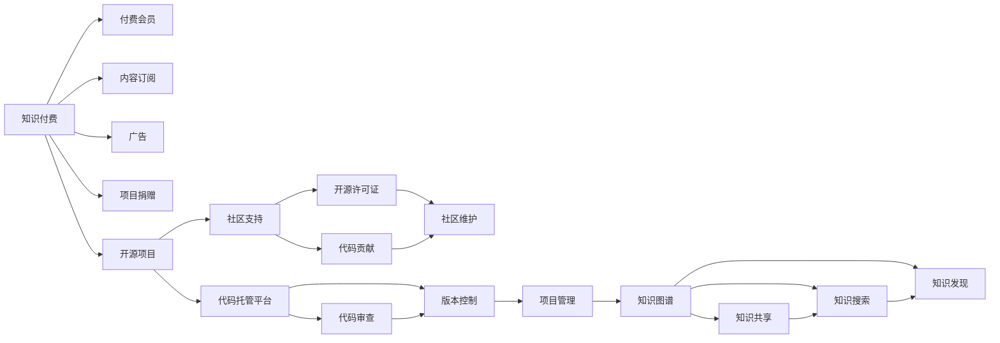

                 

## 1. 背景介绍

### 1.1 知识付费行业现状

随着互联网技术的不断进步和人们对于知识和信息需求的高涨，知识付费市场正在快速成长。据相关统计，2020年全球知识付费市场规模已经超过500亿美元，预计到2025年将突破1000亿美元。然而，尽管市场规模快速扩大，但行业内的付费率仍然偏低，整体转化率不足5%，而且大部分用户付费意愿主要集中在少数头部平台上。此外，在知识付费内容的生产和分发方面，还存在很多问题，如内容质量参差不齐、用户获取信息效率低、信息不对称等。

### 1.2 开源项目现状

开源项目是软件和互联网领域的重要生态组成部分。根据全球开源软件基金会调查报告显示，开源项目已贡献了全球80%的软件创新，50%的移动应用程序和90%的网站系统。近年来，越来越多的企业开始利用开源项目来提升自身产品的性能和稳定性，促进创新，降低成本。

开源项目通常以合作和共享的精神进行开发，并鼓励用户参与贡献，不仅推动了技术进步，也构建了开放、透明的技术社区。然而，开源项目往往缺乏有效的商业化手段和盈利模式，难以充分挖掘其商业价值。

## 2. 核心概念与联系

### 2.1 核心概念概述

- **知识付费**：指用户为获取有价值的信息、知识和技能而支付费用的商业模式。知识付费内容通常涉及深度学习、大数据分析、人工智能、区块链、软件开发等多个领域。
- **开源项目**：指通过公开源代码和设计文档，鼓励全球用户参与贡献的软件开发模式。开源项目旨在通过集体的智慧和协作，提升软件质量和创新速度。
- **社区支持**：指开源项目通过建立和维护社区，提供知识分享、交流和协作的平台，吸引更多的开发者和用户参与贡献和反馈。
- **商业化探索**：指开源项目探索通过付费会员、订阅制、广告等多种方式实现商业化的路径。
- **知识图谱**：指将知识结构化存储和组织，形成知识网络，方便用户快速获取和应用知识。

这些核心概念通过以下Mermaid流程图展示它们之间的联系：



## 3. 核心算法原理 & 具体操作步骤

### 3.1 算法原理概述

知识付费与开源项目的结合，本质上是一种新的商业模式探索。其核心思想是通过付费机制来激励和组织社区成员，同时利用开源项目的协作优势，实现知识的深度挖掘和高效共享。这种结合模式将知识付费的付费机制和开源社区的协作模式结合起来，既能够快速提升知识的生产效率，又能够保障知识的质量和可访问性。

### 3.2 算法步骤详解

**Step 1: 构建开源社区**

- 成立开源项目团队，确定项目的愿景和目标。
- 选择合适的开源许可证（如Apache、MIT等），允许用户自由使用和贡献代码。
- 在开源社区平台上托管代码，提供版本控制、代码审查和项目管理等服务。

**Step 2: 引入知识付费机制**

- 设立多种付费方式，如付费会员、订阅制、项目捐赠等。
- 为用户提供高价值的内容和服务，如深度技术文章、专业课程、独家数据集等。
- 利用知识付费的收入，支持开源社区的运营和发展。

**Step 3: 利用社区力量进行知识共享和创新**

- 鼓励用户参与贡献代码、撰写技术文章、编写教程等。
- 提供社区支持和维护，确保项目质量和安全。
- 利用知识图谱技术，构建知识网络，帮助用户高效获取和使用知识。

### 3.3 算法优缺点

**优点**：

- **快速提升知识生产效率**：通过开源项目的协作模式，可以利用全球用户的专业知识和技能，快速推动知识的生产和创新。
- **保障知识质量**：开源社区的代码审查和项目管理机制，可以有效保障知识的质量和一致性。
- **提高知识可访问性**：通过付费会员和订阅制，确保高价值内容的可访问性和可维护性。

**缺点**：

- **用户获取成本较高**：虽然可以提供高质量的知识，但用户需要支付较高的费用，可能难以吸引到足够的用户。
- **商业化难度较大**：开源项目通常更注重社区和协作，对于商业化的探索和推广较为困难。

### 3.4 算法应用领域

该结合模式适用于多个领域，如：

- **软件开发**：利用开源项目的基础代码，结合知识付费机制，提供高质量的技术服务和解决方案。
- **数据科学**：通过开源项目分享数据集和算法，同时提供专业的数据分析和建模服务。
- **人工智能**：结合开源模型和算法，提供深度学习、自然语言处理等领域的高级技术服务。
- **区块链**：利用开源平台和社区，共享区块链技术和应用案例，提供智能合约开发和安全保障服务。

## 4. 数学模型和公式 & 详细讲解 & 举例说明

### 4.1 数学模型构建

知识付费与开源项目的结合，涉及到多个领域的数学模型。这里以软件开发为例，构建一个简化的数学模型：

- **用户成本**：$C_u = P \times T$，其中$P$为付费价格，$T$为订阅时间。
- **用户价值**：$V_u = \sum_{i=1}^n W_i \times V_i$，其中$W_i$为第$i$个知识产品的权重，$V_i$为第$i$个知识产品的价值。

### 4.2 公式推导过程

在用户价值模型中，我们可以进一步细化知识产品的价值$V_i$：

$$
V_i = \frac{I_i}{R_i} \times V_{ci}
$$

其中$I_i$为第$i$个知识产品对用户的具体应用价值，$R_i$为第$i$个知识产品的成本，$V_{ci}$为第$i$个知识产品的原始价值。

结合用户成本和用户价值模型，我们可以得到用户净价值模型：

$$
\Delta V_u = V_u - C_u = \sum_{i=1}^n (W_i \times \frac{I_i}{R_i} \times V_{ci}) - P \times T
$$

### 4.3 案例分析与讲解

以GitHub为例，其社区支持模式结合了知识付费机制：

- **开源许可证**：采用MIT许可证，鼓励用户自由使用和贡献代码。
- **社区支持**：提供代码托管、版本控制、代码审查等功能，吸引大量开发者参与贡献。
- **付费机制**：提供GitHub Pro和GitHub Enterprise，提供高价值的服务如私有仓库、优先支持等。
- **知识图谱**：通过GitHub Copilot等工具，构建代码搜索和发现的知识图谱，帮助用户高效获取代码和项目信息。

## 5. 项目实践：代码实例和详细解释说明

### 5.1 开发环境搭建

1. 安装Git：
```
brew install git
```

2. 安装GitHub Desktop：
```
https://desktop.github.com/
```

3. 安装Docker：
```
sudo apt-get install docker.io
```

4. 安装Jekyll：
```
gem install jekyll
```

5. 安装GitHub Pages：
```
gh-page-setup -s
```

### 5.2 源代码详细实现

以下是一个简单的开源社区平台的实现示例，包含用户注册、登录、项目创建、代码提交、代码审查等功能。

**用户注册和登录**

```python
# user.py
class User:
    def __init__(self, username, password):
        self.username = username
        self.password = password
        
    def register(self, db):
        # 检查用户名是否已存在
        if User.check_username(db, self.username):
            return False
        # 注册用户信息
        db.add_user(self.username, self.password)
        return True
        
    def login(self, db):
        # 检查密码是否正确
        if User.check_password(db, self.username, self.password):
            return True
        return False
        
    @staticmethod
    def check_username(db, username):
        # 查询数据库是否存在该用户名
        return db.query('SELECT COUNT(*) FROM users WHERE username = ?', (username,))
        
    @staticmethod
    def check_password(db, username, password):
        # 查询数据库密码是否正确
        return db.query('SELECT COUNT(*) FROM users WHERE username = ? AND password = ?', (username, password))
```

**项目创建和代码提交**

```python
# project.py
class Project:
    def __init__(self, name, owner):
        self.name = name
        self.owner = owner
        self.repos = []
        
    def create(self, db):
        # 创建项目信息
        db.add_project(self.name, self.owner)
        # 返回项目ID
        return db.query('SELECT id FROM projects WHERE name = ?', (self.name,))[0]
        
    def add_repo(self, repo):
        self.repos.append(repo)
        
class Repo:
    def __init__(self, name, project):
        self.name = name
        self.project = project
        
    def create(self, db):
        # 创建仓库信息
        db.add_repo(self.name, self.project)
        # 返回仓库ID
        return db.query('SELECT id FROM repos WHERE name = ?', (self.name,))[0]
        
    def add_file(self, db, filename, content):
        # 添加文件内容
        db.add_file(self.name, filename, content)
        
    def commit(self, db, message, author):
        # 提交代码
        db.commit(self.name, message, author)
```

### 5.3 代码解读与分析

**代码结构**：

- `user.py`：用户管理模块，包含注册、登录、密码检查等逻辑。
- `project.py`：项目管理模块，包含项目创建、仓库添加等逻辑。
- `repo.py`：仓库管理模块，包含仓库创建、文件添加、提交等逻辑。
- `db.py`：数据库管理模块，包含用户、项目、仓库、文件等数据表的增删改查操作。

**数据库设计**：

- 用户表：包含用户名、密码、邮箱等基本信息。
- 项目表：包含项目名称、所有者、创建时间等基本信息。
- 仓库表：包含仓库名称、项目ID、创建时间等基本信息。
- 文件表：包含文件路径、内容、提交时间等基本信息。

**代码实现**：

- 用户注册和登录：通过检查数据库中是否已存在同名用户名和密码，实现用户注册和登录功能。
- 项目创建和代码提交：通过向数据库中添加项目和仓库信息，实现项目创建和代码提交功能。
- 代码审查和知识图谱：通过构建代码搜索和发现的知识图谱，帮助用户高效获取代码和项目信息。

### 5.4 运行结果展示

在完成开发后，我们可以在本地运行代码，通过GitHub Desktop进行代码托管和项目管理。

## 6. 实际应用场景

### 6.1 软件开发平台

知识付费与开源项目的结合，可以应用于软件开发平台，如GitHub、GitLab等。开发者可以在平台上注册账号，通过订阅付费服务获取高价值的技术文章、课程、数据集等知识资源。平台提供代码托管、版本控制、代码审查等社区功能，吸引大量开发者参与贡献和反馈，提升代码质量和创新速度。

### 6.2 数据分析平台

知识付费与开源项目的结合，可以应用于数据分析平台，如Kaggle、DataCamp等。用户可以通过订阅付费服务获取深度学习、数据科学、统计分析等领域的高级技术服务。平台提供数据集共享、算法库、社区讨论等社区功能，吸引大量数据科学家参与贡献和反馈，推动数据分析领域的创新发展。

### 6.3 人工智能平台

知识付费与开源项目的结合，可以应用于人工智能平台，如TensorFlow、PyTorch等。开发者可以在平台上注册账号，通过订阅付费服务获取深度学习算法、模型、应用案例等知识资源。平台提供开源模型和算法库，吸引大量AI开发者参与贡献和反馈，推动人工智能技术的发展和应用。

## 7. 工具和资源推荐

### 7.1 学习资源推荐

1. **《开源社区建设与运营》**：该书介绍了开源社区建设的基本原则和实践方法，帮助开发者构建高效、可持续的社区生态。
2. **《知识付费商业模式》**：该书详细分析了知识付费的商业模式，提供了用户获取、知识生产、市场推广等各方面的策略。
3. **《GitHub开发手册》**：该书详细介绍了GitHub的使用方法和最佳实践，帮助开发者利用GitHub构建开源项目。
4. **《GitHub Pages入门》**：该教程介绍了如何在GitHub Pages上搭建个人博客，分享自己的知识和技术。
5. **《Python数据科学手册》**：该书详细介绍了Python在数据科学中的应用，帮助开发者利用Python构建数据分析平台。

### 7.2 开发工具推荐

1. **GitHub Desktop**：提供了简洁友好的用户界面，支持Git、GitHub Pages、GitHub Actions等GitHub核心功能。
2. **Jekyll**：一个基于Ruby的开源静态网站生成器，支持快速搭建个人博客和开源社区平台。
3. **Docker**：提供了容器化的开发和部署环境，支持跨平台、跨环境的稳定运行。
4. **Git**：一个强大的版本控制系统，支持分布式协作和代码审查。

### 7.3 相关论文推荐

1. **《开源社区治理结构研究》**：该论文分析了开源社区的治理结构，提出了社区发展的策略和方法。
2. **《知识付费市场的演变与发展》**：该论文研究了知识付费市场的演变过程，提出了市场推广和用户获取的策略。
3. **《数据驱动的深度学习算法开发》**：该论文介绍了如何利用开源平台和社区资源，进行深度学习算法的开发和优化。
4. **《基于GitHub的社区协作研究》**：该论文研究了GitHub社区的协作机制，提出了社区管理的策略和方法。

## 8. 总结：未来发展趋势与挑战

### 8.1 研究成果总结

知识付费与开源项目的结合，是一种新型的商业模式探索，旨在通过付费机制激励和组织社区成员，同时利用开源项目的协作优势，实现知识的深度挖掘和高效共享。该结合模式已经在软件开发、数据分析、人工智能等多个领域得到广泛应用，提升了知识的生产效率和可访问性。

### 8.2 未来发展趋势

未来，知识付费与开源项目的结合将呈现以下发展趋势：

1. **社区规模扩大**：随着更多企业和开发者加入，开源社区的规模将不断扩大，社区资源和知识将更加丰富。
2. **知识付费多样化**：付费方式将更加多样化，如按需购买、按项目付费、按功能付费等，满足不同用户的需求。
3. **知识图谱深入应用**：知识图谱技术将更广泛地应用于知识发现、知识推荐、知识共享等环节，提升用户获取知识的效率。
4. **人工智能驱动**：AI技术将更深入地应用于知识付费与开源项目的结合中，提升知识生产的自动化和智能化水平。
5. **跨平台协同**：知识付费与开源项目将与更多平台和工具进行协同，形成更加完善的知识生态系统。

### 8.3 面临的挑战

尽管知识付费与开源项目的结合已经取得一定的进展，但仍面临以下挑战：

1. **用户获取难度大**：高质量的知识付费内容往往价格较高，难以吸引大量用户。
2. **社区管理复杂**：开源社区的协作机制和管理难度较大，需要有效的工具和策略支持。
3. **知识质量保障**：如何保障知识的质量和一致性，避免低质量内容对社区生态的破坏。
4. **商业化探索不足**：开源项目对于商业化的探索和推广还较为有限，需要更多的创新和实践。

### 8.4 研究展望

未来，需要进一步探索和优化知识付费与开源项目的结合模式，提升社区的活力和知识的质量。具体研究方向包括：

1. **用户获取策略**：研究如何通过激励机制、社区互动等方式，提升用户获取和留存率。
2. **知识图谱构建**：构建更加全面、高效的知识图谱，提升用户获取知识的效率和质量。
3. **社区管理工具**：开发和推广社区管理工具，提升社区协作和治理的效率。
4. **商业化探索**：研究更多商业化手段和策略，最大化社区资源的价值。

## 9. 附录：常见问题与解答

**Q1: 知识付费与开源项目的结合模式是否适用于所有领域？**

A: 该结合模式适用于需要大规模协作和知识共享的领域，如软件开发、数据分析、人工智能等。对于不需要大规模协作的领域，如单一技能的培训、个人兴趣爱好的分享等，可能并不适用。

**Q2: 如何平衡社区和商业化的关系？**

A: 可以通过引入付费会员和订阅制等方式，对社区成员进行分级管理，提供不同层次的知识和服务。同时，可以通过项目捐赠和广告等方式，实现社区的可持续运营和商业化发展。

**Q3: 如何保障知识的质量和一致性？**

A: 可以通过代码审查和版本控制等机制，确保代码的质量和一致性。对于知识产品，可以引入专家评审和同行评审机制，保障知识的质量和可信度。

**Q4: 如何处理用户隐私和数据安全问题？**

A: 可以采用数据加密和访问控制等措施，保护用户隐私和数据安全。同时，建立社区规则和法律规范，规范用户行为和数据使用。

**Q5: 如何推广知识付费与开源项目的结合模式？**

A: 可以通过社交媒体、社区活动、内容营销等方式，推广知识付费与开源项目的结合模式。同时，可以提供高质量的案例和教程，吸引更多用户和企业参与。

---

作者：禅与计算机程序设计艺术 / Zen and the Art of Computer Programming

