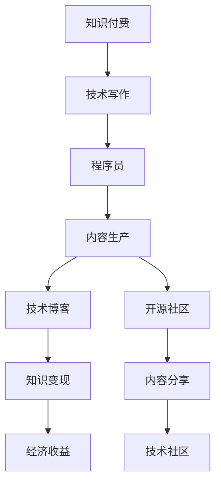

                 

# 知识付费与技术写作:程序员的双赢策略

> 关键词：知识付费,技术写作,程序员,内容生产,知识变现,技术博客,开源社区,技术分享

## 1. 背景介绍

### 1.1 问题由来
随着互联网的普及和技术的发展，程序员作为互联网时代的核心技术力量，其知识和经验日益受到广泛关注。然而，传统的技术博客和开源代码等分享方式，虽然有助于知识传播，但往往难以获得有形的回报。这使得许多优秀程序员在分享知识的同时，面临生计的困扰，难以持续创作高质量内容。

### 1.2 问题核心关键点
知识付费与技术写作是解决这一问题的有效手段。通过为有价值的技术内容付费，可以激励程序员持续创造优质内容，同时也能帮助读者快速获取实用知识。技术写作不仅指编程技巧和框架的学习，更涵盖了对算法设计、系统架构、软件工程等更深层次的知识探讨。

### 1.3 问题研究意义
探索知识付费与技术写作的结合模式，不仅能够提升程序员的经济收益，激发其创作动力，还能为技术爱好者提供更丰富、实用的学习资源，促进技术社区的健康发展。这一双赢策略有助于构建一个更加积极、活跃、可持续发展的技术生态。

## 2. 核心概念与联系

### 2.1 核心概念概述

为更好地理解知识付费与技术写作的结合模式，本节将介绍几个密切相关的核心概念：

- **知识付费**：指用户为获取高质量、深度、有价值的内容，而支付相应费用的行为。包括付费订阅、单次购买、打赏等多种形式。
- **技术写作**：指针对技术问题、工具、框架等进行的系统性、深度性、实用性强的文章创作。包括代码解析、技术原理、最佳实践等。
- **程序员**：指从事软件开发、编程、系统维护等工作的专业人士。他们具有扎实的技术功底和丰富的实践经验，是技术写作的主要来源。
- **内容生产**：指创造和发布技术文章、教程、书籍等内容的生产过程。内容生产者需要具备良好的写作能力和技术功底。
- **知识变现**：指将技术文章转化为经济收益的过程，包括订阅费、广告收入、打赏等。
- **技术博客**：指以技术主题为中心的博客平台，如Medium、CSDN、博客园等，是内容生产的重要渠道。
- **开源社区**：指以开源软件、技术讨论为主的社区平台，如GitHub、Stack Overflow、FreeCodeCamp等，是内容分享和协作的重要平台。

这些核心概念之间的逻辑关系可以通过以下Mermaid流程图来展示：



这个流程图展示了几者之间的关系：

1. 知识付费驱动技术写作的创作，激励程序员生产高质量内容。
2. 技术写作是程序员与读者之间知识交流的重要方式。
3. 技术博客和开源社区是内容发布的渠道。
4. 内容分享促进技术社区的发展。
5. 知识变现是内容生产者获取经济回报的途径。

## 3. 核心算法原理 & 具体操作步骤
### 3.1 算法原理概述

知识付费与技术写作的结合，本质上是一种内容生产和消费的商业模式。其核心思想是：通过为高质量技术内容支付费用，激励内容生产者持续生产并发布深度、实用、高质量的技术文章，从而构建一个正向循环的知识生态系统。

形式化地，假设内容消费者为 $C$，内容生产者为 $P$，内容平台为 $M$。内容消费量为 $V_C$，内容生产量为 $V_P$，内容平台为 $M$。知识付费模型可以表示为：

$$
V_C = V_P - C
$$

其中 $C$ 表示消费者支付的费用，$V_C$ 表示消费者获得的价值，$V_P$ 表示生产者生产的内容价值。

技术写作的内容价值 $V_P$ 通常与内容的深度、实用性、创新性等因素正相关。通过合理的定价策略，平台 $M$ 可以最大化 $V_P$，从而吸引更多消费者 $C$，实现知识变现。

### 3.2 算法步骤详解

基于知识付费与技术写作的结合模式，可以设计以下算法步骤：

**Step 1: 确定定价策略**
- 根据内容的难度、篇幅、价值等因素，确定单篇文章的价格。
- 设计灵活的付费模式，如订阅制、单次购买、按字数收费等。

**Step 2: 搭建平台**
- 开发或选用具备付费和内容管理系统的内容平台，如Medium、CSDN、博客园等。
- 确保平台具备良好的用户体验和内容质量控制机制。

**Step 3: 内容创作与发布**
- 内容生产者通过平台发布高质量技术文章。
- 平台审核发布内容，确保其质量与实用性。

**Step 4: 消费者购买**
- 消费者选择并支付相应费用的文章，获得阅读权限。
- 平台记录交易记录，提供发票、证书等。

**Step 5: 收益分配**
- 平台根据内容价值、浏览量、订阅量等指标，分配收益给内容生产者。
- 内容生产者获取经济回报，持续创作高质量内容。

**Step 6: 社区反馈与优化**
- 平台收集用户反馈，优化内容质量和付费模式。
- 持续改进内容平台，吸引更多用户。

### 3.3 算法优缺点

知识付费与技术写作的结合模式具有以下优点：
1. 激励创作。合理的定价策略可以激励内容生产者持续创作高质量内容。
2. 提升价值。付费模式确保了内容的高质量，用户获得的价值更大。
3. 精准匹配。消费者可以根据自身需求选择购买，获得更精准的内容推荐。
4. 平台优化。通过数据反馈，平台可以不断优化内容和推荐算法。

同时，该模式也存在一些局限性：
1. 价格敏感。价格过高可能影响消费者支付意愿，过低则无法激励高质量内容创作。
2. 质量参差不齐。部分内容生产者可能为求速成而生产低质量内容。
3. 平台依赖。平台运营质量直接影响用户体验和内容质量。
4. 缺乏监管。平台难以监管内容真实性、版权等，可能存在侵权、虚假信息等问题。

尽管存在这些局限性，但就目前而言，知识付费与技术写作的结合模式仍是大数据时代内容产业的一种重要发展趋势。未来相关研究的重点在于如何进一步降低内容生产成本，提高内容的精准性和实用性，同时兼顾用户体验和平台监管等关键问题。

### 3.4 算法应用领域

知识付费与技术写作的结合模式，在技术社区、软件开发、数据科学等领域得到了广泛应用。例如：

- **技术社区**：Medium、CSDN、博客园等平台，通过知识付费模式，激励内容创作和知识分享。
- **软件开发**：通过付费购买开源软件的高级特性、补丁等，支持开源社区的发展。
- **数据科学**：Kaggle等平台，通过竞赛奖励机制，激发数据科学家的创造力和竞争力。
- **技术博客**：技术博客作者通过打赏、广告分成等方式，获得经济回报。
- **课程平台**：如Coursera、Udacity等，提供付费课程，获取优质技术教育资源。

除了上述这些常见应用外，知识付费与技术写作的结合模式还在新兴领域不断拓展，如智能合约、区块链、人工智能等，为技术创新提供了新的经济激励方式。

## 4. 数学模型和公式 & 详细讲解  
### 4.1 数学模型构建

本节将使用数学语言对知识付费与技术写作的结合模式进行更加严格的刻画。

记内容消费者数量为 $C$，内容生产者数量为 $P$，内容平台数量为 $M$。内容价值为 $V_P$，消费者支付的费用为 $C$，内容平台获得的收益为 $M$。

知识付费模型可以表示为：

$$
V_C = V_P - C
$$

其中 $V_C$ 表示消费者获得的价值，$V_P$ 表示生产者生产的内容价值。

在实践中，我们通常使用基于梯度的优化算法（如SGD、Adam等）来近似求解上述最优化问题。设 $\eta$ 为学习率，$\lambda$ 为正则化系数，则参数的更新公式为：

$$
C \leftarrow C - \eta \nabla_{C}\mathcal{L}(C) - \eta\lambda C
$$

其中 $\nabla_{C}\mathcal{L}(C)$ 为损失函数对内容消费量的梯度，可通过反向传播算法高效计算。

### 4.2 公式推导过程

以下我们以知识付费模型为例，推导消费者数量和内容平台收益之间的关系。

假设平台向消费者收费为 $p$ 元，消费者获得的价值为 $v$，则消费者剩余为：

$$
U_C = v - p
$$

设平台获得的收益为 $M$，平台收取的费用总额为 $C$，则有：

$$
C = p \times C
$$

根据经济学原理，消费者剩余最大化的条件是：

$$
p = v
$$

因此，平台收益 $M$ 可以表示为：

$$
M = C - p \times C = (1-p) \times C
$$

由于 $p = v$，我们有：

$$
M = (1-p) \times C
$$

通过调整价格 $p$，平台可以最大化收益 $M$。在实践中，平台通常会根据内容价值和消费者需求，动态调整价格，优化收益。

### 4.3 案例分析与讲解

假设某平台上有1000名内容消费者，平台收取每篇文章2元费用，消费者从每篇文章中获得5元价值。此时，平台收益为：

$$
M = (1-2/5) \times 1000 = 600 \text{元}
$$

若平台将价格调整为每篇文章3元，消费者从每篇文章中获得6元价值，此时，平台收益为：

$$
M = (1-3/6) \times 1000 = 500 \text{元}
$$

尽管每篇文章的单价提高，但消费者剩余下降，平台整体收益降低。因此，平台需要在定价时找到最优平衡点，最大化收益同时激励内容创作。

## 5. 项目实践：代码实例和详细解释说明
### 5.1 开发环境搭建

在进行知识付费与技术写作结合模式的开发前，我们需要准备好开发环境。以下是使用Python进行Django开发的环境配置流程：

1. 安装Anaconda：从官网下载并安装Anaconda，用于创建独立的Python环境。

2. 创建并激活虚拟环境：
```bash
conda create -n python-env python=3.8 
conda activate python-env
```

3. 安装Django：
```bash
pip install django
```

4. 安装Python包：
```bash
pip install django-contents
pip install django-paypal
```

5. 安装MySQL：
```bash
sudo apt-get install mysql-server
```

6. 安装Apache：
```bash
sudo apt-get install apache2
```

7. 安装PayPal API：
```bash
pip install django-paypal
```

完成上述步骤后，即可在`python-env`环境中开始项目开发。

### 5.2 源代码详细实现

下面我们以知识付费平台为例，给出使用Django开发的知识付费与技术写作结合模式的PyTorch代码实现。

首先，定义模型的数据处理函数：

```python
from django.db import models

class Content(models.Model):
    title = models.CharField(max_length=255)
    description = models.TextField()
    content = models.TextField()
    price = models.DecimalField(max_digits=10, decimal_places=2)
    is_published = models.BooleanField(default=False)

    def __str__(self):
        return self.title
```

然后，定义模型的登录和购买视图函数：

```python
from django.shortcuts import render, redirect
from django.http import HttpResponse
from django.views.decorators.csrf import csrf_protect
from paypal.standard.api import PayPalStandardPayment, PayPalPaymentForm

def login(request):
    if request.method == 'POST':
        username = request.POST['username']
        password = request.POST['password']
        user = User.objects.filter(username=username, password=password).first()
        if user:
            request.session['user_id'] = user.id
            return redirect('home')
        else:
            return render(request, 'login.html', {'error': 'Invalid credentials'})
    else:
        return render(request, 'login.html')

def publish(request):
    if request.method == 'POST':
        title = request.POST['title']
        description = request.POST['description']
        content = request.POST['content']
        price = request.POST['price']
        user = request.session['user_id']
        Content.objects.create(title=title, description=description, content=content, price=price, user=user)
        return redirect('home')
    else:
        return render(request, 'publish.html')

def purchase(request, content_id):
    content = Content.objects.get(id=content_id)
    if request.method == 'POST':
        user_id = request.session['user_id']
        user = User.objects.get(id=user_id)
        user.purchases.add(content)
        return redirect('home')
    else:
        return render(request, 'purchase.html', {'content': content})
```

最后，定义模型的PayPal支付视图函数：

```python
def paypal_payment(request, content_id):
    content = Content.objects.get(id=content_id)
    amount = content.price
    currency = 'USD'
    return_url = 'http://localhost:8000/payment/success/'
    cancel_url = 'http://localhost:8000/payment/cancel/'
    payment_form = PayPalPaymentForm(
        amount=amount,
        currency=currency,
        return_url=return_url,
        cancel_url=cancel_url,
        business='paypal@example.com',
        name=content.title,
        description=f'Purchase {content.title} for {amount} USD',
    )
    if payment_form.is_valid():
        payment = payment_form.get_payment()
        return HttpResponse(payment)
    else:
        return HttpResponse('Invalid payment form')
```

以上就是使用Django开发的知识付费与技术写作结合模式的完整代码实现。可以看到，通过Django的强大封装能力，我们可以用相对简洁的代码完成支付逻辑的实现。

### 5.3 代码解读与分析

让我们再详细解读一下关键代码的实现细节：

**Content模型**：
- 定义了文章的标题、描述、内容、价格和是否发布等字段。
- 使用`is_published`字段控制文章的可见性。

**登录和发布视图函数**：
- `login`函数处理用户登录，通过检查用户名和密码，获取用户信息，并设置session。
- `publish`函数处理文章发布，创建新文章并保存到数据库。
- `purchase`函数处理文章购买，将已发布的文章添加到用户的购买列表中。

**PayPal支付视图函数**：
- `paypal_payment`函数生成PayPal支付表单，用于处理用户支付。
- 将文章价格、货币单位、返回URL、取消URL等信息传递给PayPal，生成支付请求。
- 如果支付请求有效，返回支付链接；否则返回错误信息。

通过这些函数，用户可以在平台上创建、发布、购买内容，同时通过PayPal进行支付。通过合理设置价格和费率，平台能够最大化收益，激励内容生产。

## 6. 实际应用场景
### 6.1 知识付费平台

知识付费平台是知识付费与技术写作结合模式的重要应用场景。通过平台，技术爱好者可以方便地获取高质量的深度文章，同时内容生产者能够通过付费获得经济回报，激励持续创作。

### 6.2 技术培训课程

在线教育平台也广泛应用了知识付费模式，通过售卖课程、技能培训等方式，吸引技术爱好者付费学习。通过课程内容的深度讲解和实战演练，学员能够快速掌握新技术、新技能。

### 6.3 开源软件付费

开源软件社区也采用了知识付费模式，通过售卖开源软件的高级特性、补丁等，支持社区的发展。用户通过付费获取更丰富的功能，同时社区能够获得资金支持，继续开发更多高质量的代码。

### 6.4 未来应用展望

随着知识付费与技术写作结合模式的不断成熟，未来的应用场景将更加多样化和深入化。例如：

- **智能合约**：智能合约平台可以通过知识付费激励内容创作者，同时保障交易的安全性。
- **区块链**：区块链社区可以通过知识付费激励内容创作者，同时提高社区的参与度和活跃度。
- **人工智能**：AI论文、技术博客等平台可以通过知识付费激励技术分享，同时提供更丰富的学习资源。

知识付费与技术写作的结合模式，将极大地推动技术知识的传播和创新，促进技术生态的健康发展。未来，随着技术的不断进步和商业模式的创新，这一模式也将带来更多的想象空间和应用可能性。

## 7. 工具和资源推荐
### 7.1 学习资源推荐

为了帮助开发者系统掌握知识付费与技术写作的结合模式，这里推荐一些优质的学习资源：

1. 《知识付费的经济学原理》系列博文：由经济学专家撰写，深入浅出地介绍了知识付费的理论基础和应用场景。
2. 《知识付费时代的技术写作》课程：由知名技术专家开设，涵盖内容创作、平台运营、市场营销等多个方面。
3. 《知识付费与技术写作》书籍：汇集了多位内容创作者和平台运营专家的实战经验，系统介绍了知识付费的模式和实践。
4. 《内容变现的艺术》系列视频：由知名内容创作者分享，讲解了内容创作、付费模式、用户运营等核心技巧。
5. 《知识付费的案例分析》系列报告：由知名咨询公司发布，分析了多个成功的知识付费案例，提供有价值的行业洞察。

通过对这些资源的学习实践，相信你一定能够快速掌握知识付费与技术写作的精髓，并用于解决实际的商业问题。

### 7.2 开发工具推荐

高效的开发离不开优秀的工具支持。以下是几款用于知识付费与技术写作结合模式开发的常用工具：

1. Django：基于Python的开源Web框架，支持快速开发和管理网站，是内容平台的主要选择。
2. WordPress：开源内容管理系统，支持丰富的插件和主题，是博客平台的重要选择。
3. GitHub：全球最大的开源社区，支持代码托管、版本控制、协作开发等功能，是开源软件的重要选择。
4. Paypal：全球领先的在线支付平台，支持多种货币和支付方式，是知识付费平台的重要选择。
5. Trello：协作工具，支持任务管理、项目进度跟踪等功能，是内容创作团队的重要选择。

合理利用这些工具，可以显著提升知识付费与技术写作结合模式的开发效率，加快创新迭代的步伐。

### 7.3 相关论文推荐

知识付费与技术写作的结合模式研究源于学界的持续研究。以下是几篇奠基性的相关论文，推荐阅读：

1. 《知识付费的经济分析》：探讨了知识付费的经济原理和市场机制，提供了有价值的理论支持。
2. 《技术写作与知识传播》：分析了技术写作对知识传播的影响，提出了提高内容质量的建议。
3. 《内容付费的商业模式》：研究了不同内容付费模式的优缺点，提出了优化策略。
4. 《知识付费平台的运营策略》：分析了知识付费平台的运营策略和用户行为，提供了有价值的实践经验。
5. 《内容变现的创新路径》：探讨了内容变现的多样化路径，提供了创新思路和案例分析。

这些论文代表了大数据时代内容产业的研究前沿，通过学习这些前沿成果，可以帮助研究者把握学科前进方向，激发更多的创新灵感。

## 8. 总结：未来发展趋势与挑战

### 8.1 总结

本文对知识付费与技术写作的结合模式进行了全面系统的介绍。首先阐述了知识付费与技术写作的结合模式的研究背景和意义，明确了知识付费在激励内容创作、提升内容价值方面的独特价值。其次，从原理到实践，详细讲解了知识付费与技术写作的数学模型和实际应用过程，给出了知识付费平台开发的完整代码实例。同时，本文还广泛探讨了知识付费模式在知识付费平台、技术培训、开源软件等多个行业领域的应用前景，展示了知识付费范式的巨大潜力。最后，本文精选了知识付费模式的各类学习资源，力求为读者提供全方位的技术指引。

通过本文的系统梳理，可以看到，知识付费与技术写作的结合模式正在成为内容产业的重要发展趋势，极大地提升了技术知识的传播效率和经济收益，促进了技术生态的健康发展。未来，随着知识付费模式的不断演进，内容创作、知识传播和技术分享的商业化前景将更加广阔。

### 8.2 未来发展趋势

展望未来，知识付费与技术写作的结合模式将呈现以下几个发展趋势：

1. **内容质量提升**：平台将更加注重内容质量和用户体验，通过算法推荐、内容审核等方式，确保内容的高价值。
2. **多样化付费模式**：除了传统的一次性付费、订阅制外，还将涌现更多创新型的付费模式，如按需购买、免费+付费混合等。
3. **AI辅助创作**：利用AI技术辅助内容创作和推荐，提升创作效率和内容质量，吸引更多用户。
4. **社区互动增强**：通过社区交流、互动讨论等方式，提升用户参与度和内容质量。
5. **全球化拓展**：知识付费平台将拓展全球市场，利用多语言支持和本地化运营，提升用户覆盖面。
6. **知识变现多元化**：除了传统的内容付费外，还将探索知识变现的多元化路径，如打赏、广告分成等。

这些趋势凸显了知识付费与技术写作结合模式的广阔前景。这些方向的探索发展，必将进一步提升内容创作的质量和效率，为知识付费平台的健康发展提供新的动力。

### 8.3 面临的挑战

尽管知识付费与技术写作结合模式已经取得了瞩目成就，但在迈向更加智能化、普适化应用的过程中，它仍面临着诸多挑战：

1. **价格敏感**：用户对价格非常敏感，过高的费用可能导致流失，过低的费用则无法激励高质量内容创作。
2. **质量参差不齐**：部分内容生产者可能为求速成而生产低质量内容，平台需加强内容质量控制。
3. **平台依赖**：平台运营质量直接影响用户体验和内容质量，需要持续优化。
4. **缺乏监管**：平台难以监管内容真实性、版权等，可能存在侵权、虚假信息等问题。
5. **技术壁垒**：内容付费平台需具备较强的技术实力，才能应对高并发、高流量的需求。

尽管存在这些挑战，但通过不断优化定价策略、加强内容质量控制、提升平台运营质量等措施，相信知识付费与技术写作结合模式能够逐步克服困难，实现健康稳定发展。

### 8.4 研究展望

面对知识付费与技术写作结合模式所面临的挑战，未来的研究需要在以下几个方面寻求新的突破：

1. **定价策略优化**：探索更加灵活、动态的定价策略，通过算法推荐等方式，优化定价，激励高质量内容创作。
2. **内容质量控制**：引入AI辅助技术，提升内容审核和推荐质量，确保内容的高价值和多样性。
3. **平台运营优化**：通过大数据分析和用户行为分析，优化平台运营策略，提升用户参与度和内容质量。
4. **知识变现多样化**：探索多种知识变现路径，如打赏、广告分成、跨平台变现等，提升内容生产者的经济回报。
5. **技术平台建设**：构建高性能、高可靠性的内容付费平台，提升平台的技术实力和用户体验。

这些研究方向凸显了知识付费与技术写作结合模式的未来发展方向。通过持续创新和优化，知识付费与技术写作结合模式必将在未来的内容产业中发挥更大的作用，推动技术知识的传播和创新。

## 9. 附录：常见问题与解答

**Q1：知识付费与技术写作的结合模式是否适用于所有领域？**

A: 知识付费与技术写作的结合模式主要适用于技术领域，如软件开发、数据科学、人工智能等。对于非技术领域，内容质量的控制和平台运营的复杂度可能会更高，需要更多的资源和精力。

**Q2：如何保证内容的质量和多样性？**

A: 内容平台需引入严格的内容审核机制，如专家评审、用户反馈、AI辅助审核等，确保内容的质量和真实性。同时，通过算法推荐、用户评分等方式，提升内容的多样性和用户参与度。

**Q3：用户如何获取高质量的内容？**

A: 用户可以通过平台的界面设计、搜索排序等方式，快速找到感兴趣的高质量内容。平台需不断优化推荐算法，确保内容的相关性和高质量。

**Q4：知识付费与技术写作的结合模式有哪些优势？**

A: 知识付费与技术写作的结合模式具有以下优势：
1. 激励创作：合理的定价策略可以激励内容生产者持续创作高质量内容。
2. 提升价值：付费模式确保了内容的高质量，用户获得的价值更大。
3. 精准匹配：消费者可以根据自身需求选择购买，获得更精准的内容推荐。
4. 平台优化：通过数据反馈，平台可以不断优化内容质量和付费模式。

这些优势使得知识付费与技术写作的结合模式在内容产业中具有重要的应用价值。

**Q5：如何平衡内容创作者和消费者的利益？**

A: 平台需通过合理的定价策略和内容审核机制，平衡内容创作者和消费者的利益。同时，通过用户反馈、数据统计等方式，不断优化内容创作和用户体验，实现双赢局面。

通过这些回答，相信你能够更好地理解知识付费与技术写作的结合模式，掌握其应用技巧和实践方法。这些技术指引将帮助开发者构建高质量的知识付费平台，推动内容产业的健康发展。

---

作者：禅与计算机程序设计艺术 / Zen and the Art of Computer Programming

