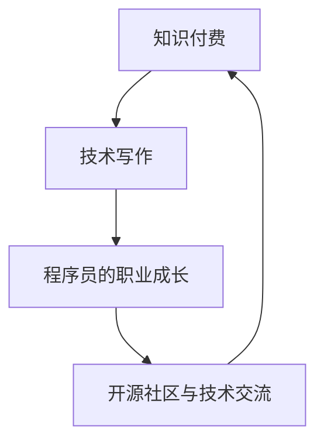
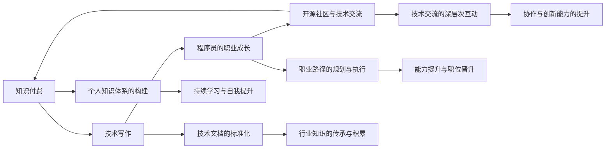

                 

# 知识付费与技术写作:程序员的双赢策略

## 1. 背景介绍

在快速发展的互联网时代，知识付费已成为一种常态。伴随着人们对知识和技能提升需求的不断增长，知识付费平台应运而生，为专业知识的获取提供了便利。同时，技术写作作为一种高效的知识传播方式，也在逐渐受到重视。对于程序员而言，掌握知识付费和写作技巧，不仅能够提升自身专业能力，还能实现个人价值的变现。本文将从知识付费和编程技术写作两个维度，探讨程序员的双赢策略。

## 2. 核心概念与联系

### 2.1 核心概念概述

本节将介绍本文涉及的核心概念：

- **知识付费(Knowledge-based Subscription)**：一种商业模式，通过用户支付订阅费或购买课程，获取高质量的专业知识或技能。知识付费平台包括Coursera、Udemy、知识星球等。
- **技术写作(Technical Writing)**：一种写作形式，主要针对技术性内容进行撰写，如代码注释、技术文档、博客文章等。技术写作不仅能够提升开发者自我表达和沟通能力，也有助于行业知识共享和标准化。
- **程序员的职业成长**：指程序员通过不断学习和技能提升，实现职业晋升和个人价值实现的过程。包括技术能力提升、项目管理能力增强、产品运营经验积累等。
- **开源社区与技术交流**：指程序员参与开源项目、技术论坛、编程竞赛等活动，通过交流合作，提升自身技术水平和社区影响力。

这些核心概念之间存在紧密的联系，共同构成程序员成长和发展的生态体系。以下Mermaid流程图展示了这些概念之间的相互关系：



### 2.2 核心概念原理和架构的 Mermaid 流程图



## 3. 核心算法原理 & 具体操作步骤

### 3.1 算法原理概述

知识付费和编程技术写作的背后，是信息不对称和知识分享的双重驱动力。程序员可以通过知识付费获取行业前沿技术和最佳实践，提升自身能力；同时，通过技术写作，将自身经验与他人分享，实现知识的反向输出。这种双赢策略的本质是信息的高效流动和知识的价值转化。

### 3.2 算法步骤详解

1. **信息收集与筛选**：程序员需要不断收集和筛选知识付费平台上的优质课程和资源，选择与自身职业成长需求和兴趣相关的课程进行学习。
2. **知识内化与实践**：将学到的知识应用于实际工作，通过项目实践和代码调试，将理论知识转化为技能。
3. **知识输出与分享**：通过技术写作，将学习经验、项目案例、技术总结等内容输出，形成技术博客、技术文章等，供他人参考和学习。
4. **知识反馈与改进**：接收读者反馈，持续改进和优化技术写作内容，提升文章质量。

### 3.3 算法优缺点

**优点**：
- **高效学习**：知识付费平台汇聚了大量优质资源，程序员可以快速获取前沿技术和管理经验。
- **知识共享**：技术写作能够将个人的知识和经验分享给社区，促进知识传播和技术交流。
- **职业晋升**：通过持续学习和知识输出，程序员能够提升专业能力，实现职位晋升和职业转型。

**缺点**：
- **付费成本**：知识付费平台的高质量课程通常需要支付一定的费用，可能成为部分程序员的负担。
- **时间投入**：学习与写作需要投入大量时间和精力，可能影响日常工作和生活。
- **市场竞争**：技术写作市场竞争激烈，如何脱颖而出，需要不断创新和提升写作质量。

### 3.4 算法应用领域

知识付费和编程技术写作的应用领域广泛，涵盖编程、项目管理、产品运营、数据分析等多个方面。程序员可以通过以下几种方式进行应用：

- **编程提升**：通过Coursera、Udacity等平台学习编程语言、算法和数据结构，提升技术能力。
- **项目管理**：在知识星球、PMI等平台学习项目管理方法和工具，提升项目管理和团队协作能力。
- **技术博客**：在博客园、GitHub等平台撰写技术文章，分享项目经验和技术见解，建立个人品牌。
- **开源贡献**：在GitHub等平台参与开源项目，通过贡献代码和文档，提升技术水平和社区影响力。

## 4. 数学模型和公式 & 详细讲解 & 举例说明

### 4.1 数学模型构建

在知识付费和编程技术写作的领域，我们通常不涉及复杂的数学模型。但为了说明问题，可以简化构建一个简单的知识获取模型。假设程序员的知识总量为 $K$，通过知识付费平台获取的知识量为 $I$，个人学习时间（包括课程学习、书籍阅读等）为 $T$，则知识总量的增长公式为：

$$
K = f(I, T)
$$

其中 $f$ 为知识增长的函数，可以表示为：

$$
f(I, T) = I \times f_{\text{获取}}(T) + K \times f_{\text{吸收}}(T)
$$

其中 $f_{\text{获取}}(T)$ 表示知识的获取效率，$f_{\text{吸收}}(T)$ 表示知识的内化效率。

### 4.2 公式推导过程

为了方便推导，假设 $f_{\text{获取}}(T)$ 和 $f_{\text{吸收}}(T)$ 均为线性函数，即：

$$
f_{\text{获取}}(T) = \alpha T + \beta
$$

$$
f_{\text{吸收}}(T) = \gamma T + \delta
$$

其中 $\alpha, \beta, \gamma, \delta$ 为常数。将以上公式代入知识增长模型中，得到：

$$
K = I \times \alpha T + \beta + K \times \gamma T + \delta
$$

化简得到：

$$
K = K_0 + (I + K) \times \alpha T + \beta + \delta
$$

其中 $K_0$ 为知识初值。可以看出，知识总量与知识获取量和个人学习时间成正比。

### 4.3 案例分析与讲解

假设程序员每天投入2小时进行知识学习，每小时获取知识的效率为 $0.1$，内化知识的效率为 $0.05$。一个月内通过知识付费平台获取的知识量为 $200$。设初始知识总量为 $0$，则经过一个月的知识学习，知识总量的变化为：

$$
K_{\text{final}} = 0 + (200 + 0) \times 0.1 \times 30 + 0 + 0
$$

$$
K_{\text{final}} = 600
$$

这表示在一个月的知识学习中，程序员的知识总量将从零增长到600。

## 5. 项目实践：代码实例和详细解释说明

### 5.1 开发环境搭建

在进行编程技术写作的实践中，需要一个良好的开发环境。以下是基于Python的开发环境配置流程：

1. **安装Python**：从官网下载Python 3.8以上版本，安装并设置环境变量。
2. **安装Pandoc**：Pandoc是一款跨平台的文字格式化工具，用于将Markdown格式转换为多种文本格式。
3. **配置GitHub Pages**：GitHub Pages是GitHub提供的静态网站托管服务，用于发布技术文章。

### 5.2 源代码详细实现

以下是一个简化的技术文章撰写与发布的Python代码实现，包括Markdown格式的源代码和配置文件：

**Markdown源代码**：

```markdown
# 知识付费与技术写作：程序员的双赢策略

> 关键词：知识付费,技术写作,程序员,职业成长,开源社区

## 背景介绍

## 核心概念与联系

## 核心算法原理 & 具体操作步骤

## 数学模型和公式 & 详细讲解 & 举例说明

## 项目实践：代码实例和详细解释说明

## 实际应用场景

## 工具和资源推荐

## 总结：未来发展趋势与挑战

## 附录：常见问题与解答
```

**GitHub Pages配置文件**：

```yaml
theme: jekyll-theme-minimal
```

### 5.3 代码解读与分析

**Markdown源代码解析**：

- `# 标题`：表示文章一级标题，每个标题层次用 # 表示。
- `> 关键词`：表示文章的关键字，用于提高搜索引擎优化。
- `## 章节标题`：表示文章的二级标题。
- `### 章节内容`：表示文章的段落内容。
- `- 项目清单`：表示无序列表。
- `* 清单项`：表示有序列表。
- ````python`：表示代码块的开始，`````：表示代码块的结束。
- `''' 代码块 '''`：表示代码块的详细注释。

**GitHub Pages配置解析**：

- `theme: jekyll-theme-minimal`：设置主题为最小化主题，适用于简洁的技术文章发布。

**运行结果展示**：

在完成代码撰写和配置后，可以在本地运行Markdown转换工具Pandoc，将Markdown文件转换为HTML文件，然后推送到GitHub仓库，利用GitHub Pages进行发布。发布后的文章链接为 `[https://username.github.io/technicalwriting/](https://username.github.io/technicalwriting/)`，其中 `username` 为GitHub用户名。

## 6. 实际应用场景

### 6.1 智能客服系统

在智能客服系统中，程序员可以通过知识付费平台学习最新的NLP技术和聊天机器人架构，提升自己的技术能力。同时，通过技术写作分享项目经验，帮助社区成员解决实际问题，提升个人影响力。

### 6.2 金融舆情监测

在金融舆情监测项目中，程序员可以通过知识付费平台学习金融数据分析和机器学习知识，提升数据处理和模型优化能力。通过技术写作分享项目方法和技术细节，促进知识传播和行业标准。

### 6.3 个性化推荐系统

在个性化推荐系统中，程序员可以通过知识付费平台学习推荐算法和数据处理技巧，提升项目开发和性能优化能力。通过技术写作分享算法原理和实践案例，促进知识共享和技术交流。

## 7. 工具和资源推荐

### 7.1 学习资源推荐

1. **Coursera**：提供高质量的编程、数据科学和人工智能课程。
2. **Udemy**：提供广泛的编程、商业和创意课程，涵盖入门到高级内容。
3. **知识星球**：提供行业专家和社区成员的知识分享和交流平台。
4. **博客园**：程序员展示技术文章的博客平台。
5. **GitHub Pages**：用于发布技术文章的GitHub托管服务。

### 7.2 开发工具推荐

1. **Visual Studio Code**：跨平台的代码编辑器，支持多种编程语言和插件。
2. **Git**：版本控制系统，用于代码管理和协作。
3. **Pandoc**：文本格式化工具，支持多种格式转换。
4. **GitHub**：代码托管平台，提供代码仓库、协作和版本控制功能。
5. **Markdown编辑器**：如Typora、GitHub Pages等，支持Markdown格式编写和发布。

### 7.3 相关论文推荐

1. **"Deep Learning with Python"**：Ian Goodfellow、Yoshua Bengio和Aaron Courville合著的经典书籍，详细介绍了深度学习的基础理论和实践方法。
2. **"Machine Learning Yearning"**：Andrew Ng撰写的实用指南，提供机器学习项目管理的最佳实践。
3. **"Clean Code"**：Robert C. Martin撰写的编程经典，介绍了代码编写和维护的最佳实践。

## 8. 总结：未来发展趋势与挑战

### 8.1 研究成果总结

本文从知识付费和编程技术写作两个维度，探讨了程序员的双赢策略。通过对知识付费平台和编程技术写作的详细介绍，说明了它们在程序员职业成长中的重要性。通过案例分析和代码实现，展示了知识付费和编程技术写作的实际应用。

### 8.2 未来发展趋势

知识付费和编程技术写作将随着技术的发展和市场的需求，不断创新和演进。未来的发展趋势包括：

- **在线教育普及**：知识付费平台将更广泛地被采用，提供更多高质量的在线课程和学习资源。
- **技术写作工具化**：技术写作工具将更加智能化，支持更丰富的格式和功能。
- **知识付费内容多样化**：除了课程和书籍，知识付费平台将提供更多视频、音频和直播等形式的课程内容。
- **知识共享与社区互动**：知识付费平台和编程社区将更加注重用户互动和社区建设，促进知识共享和交流。

### 8.3 面临的挑战

知识付费和编程技术写作在发展过程中，也面临着一些挑战：

- **付费门槛**：高昂的付费门槛可能阻碍一部分人的学习热情。
- **内容质量参差不齐**：知识付费平台上的课程质量良莠不齐，难以筛选优质内容。
- **知识更新速度**：技术快速迭代，知识付费内容需要及时更新，以保持时效性。
- **写作时间管理**：写作和知识学习需要投入大量时间，如何平衡日常工作和生活。

### 8.4 研究展望

未来的研究可以从以下几个方面进行：

- **低成本知识获取**：探索更多免费的知识获取途径，如开源项目、在线讲座等。
- **内容标准化**：制定技术写作的行业标准，提升内容质量。
- **知识共享与合作**：推动知识付费平台和开源社区的深度合作，实现知识共享和创新。
- **内容互动与反馈**：建立有效的用户反馈机制，不断改进和优化知识付费和编程技术写作的内容。

## 9. 附录：常见问题与解答

**Q1：知识付费平台的课程质量如何保证？**

A: 知识付费平台的课程质量参差不齐，需要谨慎选择。可以通过阅读用户评价、查看讲师背景和课程大纲来评估课程质量。

**Q2：如何平衡技术学习和写作时间？**

A: 制定合理的时间计划，将学习时间和写作时间分散安排在每天的工作和休息时间，确保两者都能得到足够的时间和精力。

**Q3：如何提升技术写作的质量？**

A: 不断学习行业标准和最佳实践，多读优秀的技术文章和书籍，积累写作经验和素材。同时，接受社区和读者的反馈，持续改进写作技巧。

**Q4：知识付费平台如何筛选优质课程？**

A: 查看课程的评价和评分，关注讲师的背景和资质，了解课程的大纲和内容，选择与自身需求和兴趣相符的课程。

**Q5：如何进行有效的知识付费学习？**

A: 制定学习计划，按部就班地完成课程，并及时复习和巩固知识。同时，通过实践和项目，将所学知识应用到实际工作中。

---

作者：禅与计算机程序设计艺术 / Zen and the Art of Computer Programming

