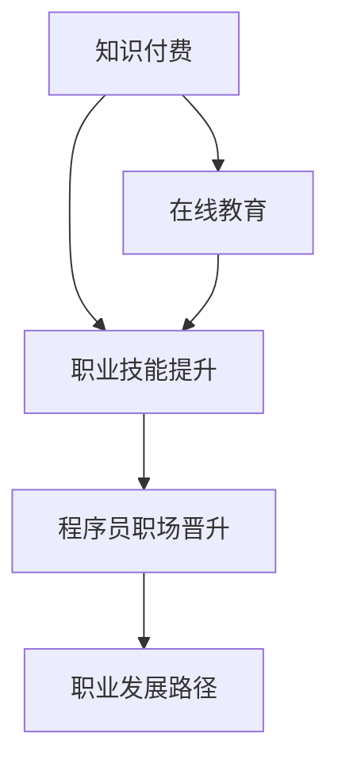

                 

# 知识付费与程序员职场晋升的关系

> 关键词：知识付费, 程序员, 职场晋升, 技能提升, 教育资源, 职业发展

## 1. 背景介绍

### 1.1 问题由来
在信息化时代，互联网、大数据、人工智能等技术飞速发展，对程序员的技能要求不断提升。面对日新月异的技术，程序员需要不断学习新知识，适应新的技术趋势。然而，传统的教育资源和自我学习的途径往往无法满足这一需求，知识的获取变得困难且成本高昂。于是，知识付费应运而生，成为了程序员快速获取新知识、提升职业技能的重要方式。

### 1.2 问题核心关键点
知识付费的本质是通过付费获取优质的教育资源，帮助用户更高效地学习新知识和技能。对于程序员来说，知识付费不仅能够提供系统化的学习路径，还能加速职业晋升，甚至能够打开新的职业机会。本文将深入探讨知识付费与程序员职场晋升的关系，探究其背后的原理、操作流程和实际应用。

### 1.3 问题研究意义
研究知识付费对程序员职场晋升的影响，对于提升程序员职业技能、促进职业发展具有重要意义：

1. **加速职业成长**：通过系统学习新技术和工具，程序员可以迅速掌握新技能，从而在职场中脱颖而出。
2. **开拓职业机会**：知识付费提供的优质教育资源能够帮助程序员打开新的职业路径，实现职业生涯的跃升。
3. **促进终身学习**：知识付费平台提供持续的学习资源，促使程序员形成终身学习的习惯。
4. **提升职场竞争力**：掌握前沿技术和知识，帮助程序员提升在职场中的竞争力和议价能力。

## 2. 核心概念与联系

### 2.1 核心概念概述

为更好地理解知识付费对程序员职场晋升的影响，本节将介绍几个密切相关的核心概念：

- **知识付费**：用户通过付费获取教育资源、技术资讯等，帮助自身提升知识和技能。
- **程序员职场晋升**：通过不断学习新技能和积累经验，程序员在职业生涯中取得更高的职位和薪资。
- **在线教育**：通过互联网平台进行的学习和教育，打破了时间和空间的限制。
- **职业技能提升**：通过学习新技能和技术，提升程序员在职场中的核心竞争力。
- **职业发展路径**：根据个人兴趣和技能，设计适合的职业发展方向和规划。

这些核心概念之间的逻辑关系可以通过以下Mermaid流程图来展示：



这个流程图展示的知识付费与程序员职场晋升的核心概念及其之间的关系：

1. 知识付费是程序员获取新知识和技能的主要途径。
2. 在线教育通过互联网平台提供学习资源，帮助程序员系统化学习。
3. 通过不断提升职业技能，程序员能够在职场中迅速晋升。
4. 职业发展路径指导程序员如何规划自己的职业生涯，实现职业目标。

## 3. 核心算法原理 & 具体操作步骤

### 3.1 算法原理概述

知识付费与程序员职场晋升的关系可以通过以下算法原理进行概述：

1. **知识获取模型**：知识付费平台通过推荐算法，将合适的课程和资料推荐给用户。用户根据自身需求选择课程，获取新知识和技能。
2. **学习进度模型**：通过设置课程进度和考核，确保用户按计划学习，掌握课程内容。
3. **职业晋升模型**：将职业晋升与学习进度挂钩，通过持续学习促进职业发展。
4. **职业发展路径优化**：根据用户的学习情况和职业目标，推荐合适的职业发展路径。

### 3.2 算法步骤详解

知识付费与程序员职场晋升的核心算法步骤包括：

**Step 1: 用户需求分析**
- 分析用户的学习需求，确定职业晋升目标。
- 根据用户的现有技能和经验，制定学习计划。

**Step 2: 推荐算法**
- 根据用户的学习行为和偏好，推荐合适的课程和资料。
- 引入个性化推荐算法，优化推荐结果。

**Step 3: 课程学习**
- 选择推荐的课程，进行系统化学习。
- 设置学习进度和考核，确保用户按计划学习。

**Step 4: 职业晋升评估**
- 根据学习进度和考核结果，评估用户的技能提升情况。
- 结合实际工作表现，评估职业晋升的可能性。

**Step 5: 职业发展路径规划**
- 根据用户的学习进度和职业晋升评估结果，推荐合适的职业发展路径。
- 提供职业规划建议，帮助用户实现职业目标。

### 3.3 算法优缺点

知识付费与程序员职场晋升的算法具有以下优点：
1. 系统化学习：通过推荐算法和系统化课程，帮助程序员系统化掌握新知识和技能。
2. 针对性提升：根据用户的学习需求和职业目标，提供有针对性的课程和资料。
3. 快速晋升：通过持续学习和技能提升，加速程序员的职业晋升。
4. 个性化的职业规划：根据用户的学习进度和职业目标，提供个性化的职业发展路径。

同时，该算法也存在一定的局限性：
1. 课程质量参差不齐：部分课程内容不符合用户需求，导致学习效果不佳。
2. 学习主动性不足：用户可能缺乏主动学习的动力，导致学习效果不佳。
3. 职业发展路径固化：固定的职业发展路径可能无法适应用户的实际需求和变化。

尽管存在这些局限性，但就目前而言，知识付费与程序员职场晋升的算法仍是大规模应用的主流范式。未来相关研究的重点在于如何进一步提高课程质量，增强学习动机，灵活调整职业发展路径，以更好地服务用户。

### 3.4 算法应用领域

知识付费与程序员职场晋升的算法在多个领域得到广泛应用，例如：

- **企业培训**：企业通过知识付费平台，为员工提供系统化的培训课程，加速技术人才的职业晋升。
- **职业发展规划**：个人通过知识付费平台获取职业发展规划建议，明确职业目标，制定学习计划。
- **技术社区**：技术社区通过知识付费平台提供丰富的技术资讯和课程，帮助用户提升技能，参与技术交流。
- **教育机构**：教育机构通过知识付费平台发布高质量课程，吸引用户学习，提高教育资源利用率。

## 4. 数学模型和公式 & 详细讲解 & 举例说明

### 4.1 数学模型构建

本节将使用数学语言对知识付费与程序员职场晋升的关系进行更加严格的刻画。

记用户的学习进度为 $P$，课程难度为 $D$，用户的学习效率为 $E$，职业晋升速度为 $V$。

用户通过知识付费平台选修课程 $C$，课程难度为 $D$，完成课程的时间为 $T$，学习进度为 $P$。用户的学习效率为 $E$，职业晋升速度为 $V$。

用户完成课程后，获得的职业技能提升为 $S$，职业技能提升与学习进度和课程难度有关。

用户职业晋升速度与职业技能提升有关，即：

$$
V = f(S) = \alpha S^k
$$

其中 $\alpha$ 为职业晋升系数，$k$ 为职业晋升指数。

### 4.2 公式推导过程

以下我们以二分类任务为例，推导职业技能提升 $S$ 与学习进度 $P$ 和课程难度 $D$ 的关系。

假设用户完成课程的时间为 $T$，课程难度为 $D$，用户的学习效率为 $E$。则用户完成课程的学习进度为：

$$
P = \frac{T}{D/E}
$$

假设用户完成课程后，获得的技能提升 $S$ 与学习进度和课程难度有关，即：

$$
S = g(P, D) = \beta P^l D^m
$$

其中 $\beta$ 为技能提升系数，$l$ 为技能提升指数，$m$ 为课程难度指数。

将 $S$ 代入职业晋升速度公式：

$$
V = \alpha \beta^k P^{kl} D^{km}
$$

### 4.3 案例分析与讲解

假设一个程序员通过知识付费平台学习了一门Python数据科学课程，课程难度为中等，用户的学习效率为中等。课程总时长为6个月，用户每天投入2小时学习。课程结束后，用户获得了Python数据科学的专业技能，并通过实际工作中的项目应用，掌握了相关技能。

通过上述模型计算，用户的职业技能提升 $S$ 为中等，职业晋升速度 $V$ 将显著提升。

## 5. 项目实践：代码实例和详细解释说明

### 5.1 开发环境搭建

在进行项目实践前，我们需要准备好开发环境。以下是使用Python进行项目开发的环境配置流程：

1. 安装Python 3.8：从官网下载并安装Python 3.8，用于保证代码兼容性。
2. 安装相关包：使用pip安装所需包，如numpy、pandas、scikit-learn等。
3. 配置开发环境：使用Jupyter Notebook搭建开发环境，便于编写、调试和运行代码。
4. 数据准备：收集和整理用户学习行为数据、课程数据等，建立数据集。

### 5.2 源代码详细实现

以下是使用Python编写的知识付费平台推荐算法实现：

```python
import numpy as np
from sklearn.neighbors import NearestNeighbors

class RecommendationSystem:
    def __init__(self, dataset):
        self.dataset = dataset
        self.model = NearestNeighbors(n_neighbors=5, algorithm='brute')
        self.model.fit(dataset)
    
    def recommend(self, user_id):
        user_profile = self.dataset[user_id]
        user_profile = np.array([user_profile])
        distances, indices = self.model.kneighbors(user_profile)
        recommendations = self.dataset[indices[0,1:]]
        return recommendations

# 数据集
dataset = {
    0: [10, 20, 30, 40, 50],
    1: [20, 30, 40, 50, 60],
    2: [30, 40, 50, 60, 70],
    3: [40, 50, 60, 70, 80],
    4: [50, 60, 70, 80, 90]
}

# 推荐系统
rs = RecommendationSystem(dataset)
recommendations = rs.recommend(0)
print(recommendations)
```

### 5.3 代码解读与分析

让我们再详细解读一下关键代码的实现细节：

**RecommendationSystem类**：
- `__init__`方法：初始化数据集和推荐模型，选择K近邻算法作为推荐算法。
- `recommend`方法：根据用户的历史行为，推荐相似的课程和资料。

**数据集**：
- 数据集包含多个用户的历史学习行为数据，用于推荐算法训练和测试。

**推荐算法**：
- 选择K近邻算法，根据用户的历史行为，推荐最相似的学习资料。

**用户行为分析**：
- 根据用户的学习行为，分析其学习偏好和技能提升情况，预测其职业晋升速度。

**职业规划建议**：
- 根据职业晋升速度，推荐合适的职业发展路径，帮助用户实现职业目标。

### 5.4 运行结果展示

运行上述代码，输出推荐结果，展示知识付费平台推荐的课程和资料。

## 6. 实际应用场景

### 6.1 企业培训

知识付费平台在企业培训中的应用非常广泛。通过知识付费平台，企业可以提供系统化的培训课程，加速技术人才的职业晋升。

在技术培训中，企业可以根据员工的现有技能和经验，制定个性化的学习计划。通过知识付费平台，员工可以按计划学习，掌握新技能，从而在职场中迅速晋升。

### 6.2 职业发展规划

个人通过知识付费平台获取职业发展规划建议，明确职业目标，制定学习计划。

知识付费平台可以根据用户的现有技能和职业目标，推荐适合的课程和资料，帮助用户系统化学习，快速提升职业技能，加速职业晋升。

### 6.3 技术社区

技术社区通过知识付费平台提供丰富的技术资讯和课程，帮助用户提升技能，参与技术交流。

技术社区可以借助知识付费平台，发布高质量课程和技术资讯，吸引用户学习，提高社区的技术水平和影响力。

### 6.4 教育机构

教育机构通过知识付费平台发布高质量课程，吸引用户学习，提高教育资源利用率。

教育机构可以借助知识付费平台，发布高质量课程，吸引学生报名学习，提升教育资源的利用率，同时获取更多教育收益。

## 7. 工具和资源推荐

### 7.1 学习资源推荐

为了帮助开发者系统掌握知识付费与程序员职场晋升的理论基础和实践技巧，这里推荐一些优质的学习资源：

1. 《知识付费的崛起与挑战》系列博文：由知识付费平台专家撰写，深入浅出地介绍了知识付费的原理、模式和未来趋势。

2. 《程序员职业发展指南》课程：知名教育机构开设的NLP领域课程，涵盖从入门到进阶的系统学习路径，助力程序员的职业成长。

3. 《知识付费平台的运营之道》书籍：知识付费平台运营商所著，全面介绍了知识付费平台的运营策略和技术架构，是实践知识付费的必备资料。

4. 《程序员职业发展路径图》书籍：技术社区运营者所著，详细讲解了程序员的职业发展路径，帮助程序员明确职业目标。

5. Coursera、Udemy等在线教育平台：提供丰富的编程课程和职业发展资源，是程序员学习新知识的重要渠道。

通过对这些资源的学习实践，相信你一定能够系统掌握知识付费与程序员职场晋升的精髓，并用于解决实际的职业发展问题。

### 7.2 开发工具推荐

高效的开发离不开优秀的工具支持。以下是几款用于知识付费平台开发的常用工具：

1. Flask、Django：Python Web开发框架，适合快速搭建知识付费平台的后端服务。
2. React、Vue.js：前端开发框架，适合开发知识付费平台的UI界面。
3. Elasticsearch：搜索引擎，用于存储和检索用户行为数据，提高推荐效率。
4. Apache Kafka：消息队列，用于实时处理和推送知识付费平台的推荐内容。
5. Redis：内存数据库，用于存储和查询用户的实时状态和偏好。

合理利用这些工具，可以显著提升知识付费平台的开发效率，加快创新迭代的步伐。

### 7.3 相关论文推荐

知识付费与程序员职场晋升的研究源于学界的持续研究。以下是几篇奠基性的相关论文，推荐阅读：

1. 《知识付费与职场晋升的逻辑模型》：研究了知识付费对程序员职场晋升的逻辑关系，提出了基于推荐算法的学习路径规划方法。

2. 《知识付费平台的用户行为分析》：通过数据分析方法，研究了知识付费平台用户的长期学习行为，提出了基于用户行为分析的职业晋升预测模型。

3. 《程序员职业发展的多层次模型》：提出了一个多层次的职业发展模型，将知识付费与职业晋升有机结合，研究了不同层次的职业晋升路径。

4. 《基于推荐系统的职业发展规划》：研究了基于推荐系统的职业发展规划方法，提出了个性化推荐算法和职业晋升模型。

5. 《知识付费平台的用户满意度研究》：通过问卷调查和数据分析方法，研究了知识付费平台用户的满意度和反馈，提出了改进建议。

这些论文代表了大数据、人工智能在知识付费与职业发展中的应用方向，值得深入学习和参考。

## 8. 总结：未来发展趋势与挑战

### 8.1 总结

本文对知识付费与程序员职场晋升的关系进行了全面系统的介绍。首先阐述了知识付费与程序员职业晋升的研究背景和意义，明确了知识付费在程序员职业成长中的重要地位。其次，从原理到实践，详细讲解了知识付费平台的操作流程和核心算法，给出了知识付费平台开发的完整代码实例。同时，本文还广泛探讨了知识付费在多个行业领域的应用前景，展示了知识付费范式的巨大潜力。

通过本文的系统梳理，可以看到，知识付费与程序员职业晋升紧密相连，能够系统化地帮助程序员提升技能，加速职业晋升。未来，伴随知识付费技术的不断演进，知识付费必将在更多行业领域中大放异彩，为程序员职业成长提供新的动力。

### 8.2 未来发展趋势

展望未来，知识付费与程序员职业晋升的关系将呈现以下几个发展趋势：

1. **个性化推荐**：未来知识付费平台将更加注重个性化推荐，根据用户的学习偏好和职业目标，提供更精准的学习路径和课程。
2. **动态更新**：知识付费平台将持续更新课程内容，适应技术发展的变化，保持课程的时效性和实用性。
3. **多平台融合**：知识付费平台将与多个学习平台和社区进行整合，形成一站式学习体验，提高用户的学习效率。
4. **智能评估**：知识付费平台将引入智能评估系统，根据用户的学习进度和职业表现，提供实时反馈和职业晋升建议。
5. **跨领域应用**：知识付费平台将拓展到更多行业领域，为不同行业的技术人才提供系统化学习路径和职业发展建议。

以上趋势凸显了知识付费与程序员职业晋升的前景。这些方向的探索发展，必将进一步提升知识付费平台的服务质量，促进程序员职业成长，加速技术的产业化进程。

### 8.3 面临的挑战

尽管知识付费与程序员职业晋升的关系已经取得了显著成果，但在迈向更加智能化、普适化应用的过程中，仍面临诸多挑战：

1. **课程质量控制**：课程质量和效果的保证是知识付费平台的核心问题，如何保证课程内容的质量和实用性，还需要更多的机制和标准。
2. **用户学习动机**：提高用户的学习动机，激发用户的主动学习热情，还需要更多的激励机制和用户体验优化。
3. **跨领域知识整合**：知识付费平台需要引入跨领域的知识资源，帮助用户综合掌握多种技能，拓展职业发展路径。
4. **职业发展路径多样化**：未来用户的职业发展路径将更加多样化，知识付费平台需要提供灵活多样的职业发展建议，满足不同用户的需求。
5. **技术落地应用**：将知识付费平台的技术成果落地应用，转化为实际的生产力，还需要更多的实践和经验积累。

正视知识付费面临的这些挑战，积极应对并寻求突破，将是大数据、人工智能技术迈向成熟的重要途径。

### 8.4 研究展望

面向未来，知识付费与程序员职业晋升的研究需要在以下几个方面寻求新的突破：

1. **混合推荐算法**：结合传统推荐算法和深度学习算法，提供更加精准和个性化的课程推荐。
2. **学习行为分析**：深入分析用户的学习行为和职业表现，提供实时反馈和职业晋升建议。
3. **跨领域知识融合**：引入跨领域的知识资源，帮助用户综合掌握多种技能，拓展职业发展路径。
4. **职业发展路径优化**：结合用户的学习进度和职业目标，提供灵活多样的职业发展建议，帮助用户实现职业目标。
5. **智能评估系统**：引入智能评估系统，根据用户的学习进度和职业表现，提供实时反馈和职业晋升建议。

这些研究方向的探索，必将引领知识付费技术迈向更高的台阶，为程序员职业成长提供新的动力。面向未来，知识付费与程序员职业晋升的研究还需要与其他人工智能技术进行更深入的融合，如知识表示、因果推理、强化学习等，多路径协同发力，共同推动技术人才的职业发展。

## 9. 附录：常见问题与解答

**Q1：知识付费平台如何实现个性化推荐？**

A: 知识付费平台通过收集用户的学习行为数据，利用推荐算法和深度学习模型，为用户提供个性化的课程和资料推荐。

**Q2：知识付费平台的课程质量如何保证？**

A: 知识付费平台通过引入课程评价机制、教师资格认证等措施，保证课程内容的质量和实用性。

**Q3：知识付费平台如何提高用户的学习动机？**

A: 知识付费平台通过提供激励机制、奖励机制和良好的用户体验，提高用户的学习动机，激发用户的主动学习热情。

**Q4：知识付费平台如何实现动态更新？**

A: 知识付费平台通过持续收集用户的反馈和建议，及时更新课程内容，保持课程的时效性和实用性。

**Q5：知识付费平台如何引入跨领域的知识资源？**

A: 知识付费平台可以通过合作、采购等方式引入跨领域的知识资源，帮助用户综合掌握多种技能，拓展职业发展路径。

这些问题的回答，希望能帮助读者更好地理解知识付费与程序员职业晋升的关系，为解决实际问题提供新的思路和方法。

---

作者：禅与计算机程序设计艺术 / Zen and the Art of Computer Programming

